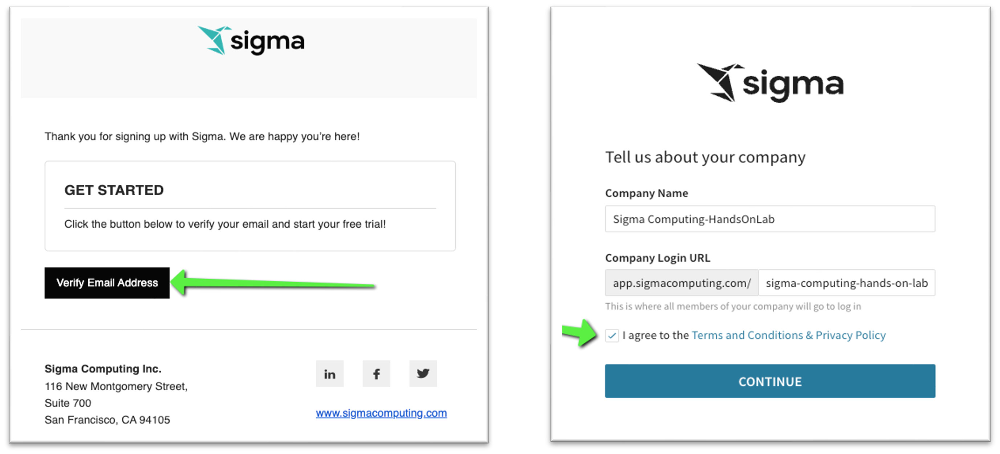
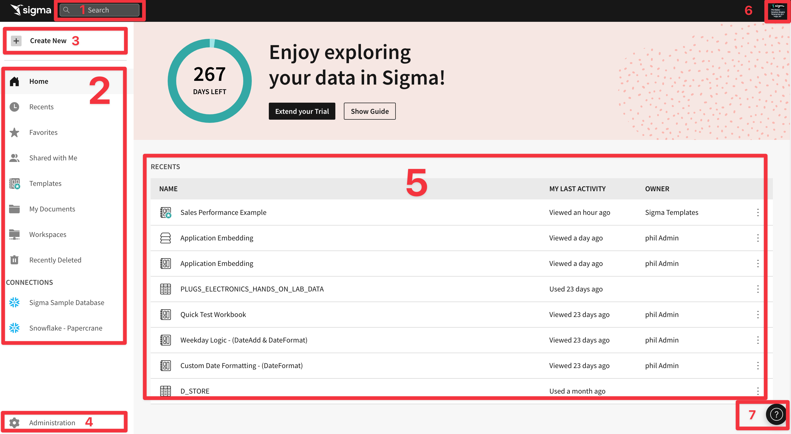

summary: Hand-on Lab for new users and Sigma Trials
id: getting_started_getting_around_HOL
categories: Getting-Started
status: Published
feedback link: https://github.com/sigmacomputing/sigmaquickstarts/issues
tags: Getting Started, Analytics, Data Engineering, BI, Business Intelligence, Sigma, Sigma Computing, Snowflake, Dashboarding, Visualization, Analysis, Excel, Spreadsheet
authors: Phil Ballai, Sigma Computing

# 1 - Getting Around Hands-on Lab
<!-- ------------------------ -->
## Overview 
This lab is the first in a series of labs designed to instruct new users how to use Sigma to explore and analyze data, and turn results into visualizations and more. 

Through this lab we will walk through how to access a Sigma Trial environment, navigate the user interface and more. 

We will be working with some common sales data from our fictitious company ‘Plugs Electronics’. This data is provided to you automatically. We will look at sales data, but throughout the course of other labs will incorporate more sources from associated store, product, and customer data.

The other QuickStart labs explore topics such as working with Tables, Visualizations, Pivot Tables, Dashboards and more. We have broken these labs up so that they can be taken in any order you want.

Sigma combines with the unlimited power of the cloud data warehouse and the familiar feel of a spreadsheet; no limit on the amount of data you wish to analyze. Sigma is awesome for users of Excel and even better for customers who have millions or even billions of rows of data.

Typical audience for this lab is users of Excel, common Business Intelligence or Reporting tools and semi-technical users who want to try out or learn Sigma. Everything is done in a browser so you already know how to use that. No SQL or technical skills are needed to do this lab.
 
 ### Sigma Target Audience
Typical audience for this lab is users of Excel, common Business Intelligence or Reporting tools and semi-technical users who want to try out or learn Sigma. Everything is done in a browser so you already know how to use that. No SQL or technical skills are needed to do this lab.

Sigma combines with the unlimited power of the cloud data warehouse and the familiar feel of a spreadsheet; no limit on the amount of data you wish to analyze. Sigma is awesome for users of Excel and even better for customers who have millions or even billions of rows of data.

### Prerequisites
<ul>
  <li>A computer with a current browser. It does not matter which browser you want to use.
</li>
  <li>Access to your Sigma environment. A Sigma trial environment is acceptable and preferred. Step 4 shows you how to get started with a Trial.</li>
</ul>

### What You’ll Learn
some text

### What You’ll Build
some text

## **Sigma Trial Setup**
Sigma combines with the unlimited power of the cloud data warehouse and the familiar feel of a spreadsheet; no limit on the amount of data you wish to analyze. Sigma is awesome for users of Excel and even better for customers who have millions or even billions of rows of data.
Sign up for a free trial (if you do not already have an account):
Sign up for a free trial account here:<a href="https://www.sigmacomputing.com/free-trial/">Free Trial</a>

<strong>Fill out the form on Sigma's Trial page:</strong>

<strong>You will receive an Email invitation:</strong> 
Sigma Trial. Open the email and click “Verify Email Address”. If you have not received this email within 10 minutes, please check your spam folder and if not there, ask for assistance immediately. The link will open a new tab on the profile creation page. Enter in your name and a password and click “GET STARTED”. 

<strong>Agree to the terms and conditions and click the Continue button:</strong> 

<strong>Create your user profile and click “Create”:</strong> 

<strong>You should now see the Welcome Message on your Sigma Trial homepage:</strong> 

<strong>Review the Tutorial (optional)</strong> 
If this is the first time you have used Sigma you may want to spend a few minutes reviewing the short video tutorial but this lab will cover most of these topics so it is not really necessary. 

## **Getting Around the UI**
The Home page is organized logically to make it easy to get to things quickly. The main functions are highlighted below: 
**NOTE:** As the user who initiated the Trial you are granted Admin rights. Other users may not see every option as dictated by their role assignment. Administration is covered in a different lab.

 If you want to get Home from anywhere in the portal, just click the Sigma logo in the upper left corner.

 Once you open a different page you may notice the back arrow next to the Sigma logo. This allows you to go back one level.

<ol type="1">
  <li><strong>Search:</strong> You can click in the search bar at any point to search for content within Sigma.</li>
  
  <li><strong>My Content:</strong> Access various content available to your role. These include:
    <ol type="i"> 
      <li><strong>Workbook:</strong> our spreadsheet UI for analyzing data</Li>
      <li><strong>Dataset:</strong> enables the curation of data to then be shared with others</Li>
      <li><strong>Custom SQL:</strong> allows you to write SQL to run against the data warehouse
      <li><strong>CSV upload:</strong> allows you to upload a csv in order to perform analysis within a Workbook</Li>
    </ol>
  </li>

  <li><strong>Create New:</strong> Use this anytime you want to create new content 
    <ol type="i"> 
      <li><strong>Home</strong> will bring back to home screen</Li>
      <li><strong>Recents</strong> will bring up items you have accessed recently</Li>
      <li><strong>Favorites</strong> will show a list of items that you have favorite or quicker access</Li>
      <li><strong>Shared with Me</strong> will show a list of items others have shared directly with you</Li>
      <li><strong>My Documents</strong> is a personal folder for you to save content you have created</Li>
      <li><strong>Workspaces</strong> are a way to organize and share content with specific members or teams within your organization. Items placed in workspaces can be accessed by anyone who has permission to that workspace.</Li>
      <li><strong>Connections</strong> (visible to Administrators and Creators by default): Connections list the data warehouses you have connections to. Clicking on one of them shows the tables in that warehouse you can access. There can be many connections for a single Sigma account, each configured with different levels of access to the warehouse, to be shared with members or teams. 
      <strong>NOTE:</strong> In this Virtual Hands On Lab environment you can only see and access the “Sigma Sample Database” database used for this lab.
      </ol>
  </li>
    <li><strong>Administration:</strong> Dedicated area for user management and other common configuration settings. Only shown to users in the Admin role.</li>
   <li><strong>Canvas:</strong> This area is where most of your working sessions will be. The Home page uses it to “Get Your Data” and will change based on what you are doing over time. </li>
   <li><strong>User Profile:</strong> On the top right corner is a box with your username initial. Clicking on it reveals Profile where you can make changes to your preferences and sign out.  Other UI options may or may not be visible to you depending on your permissions.  These options will be covered in a different module./li>
   <li><strong>Help:</strong> has lots of useful information for you to explore later:</li>
</ol>

## **Workbooks, Pages and Datasets**
Let’s begin by establishing some basic terminology Sigma uses. Consider that a Workbook is like a book you have read; the Workbook is the title of the book. The books’ index is like a Page, each page of the book is a Canvas and the words are all part of a Dataset. 

From that we can understand that: A Workbook contains Pages (each with a Canvas) that display information that comes from a Dataset. 

The Canvas on each Page makes it easy to bring multiple data elements, including tables, charts, free-form text, and images, into a Single page to make it easy to tell a data story, or narrative, with live data and collaborate with colleagues. Analysis and presentation are now seamlessly integrated in a spreadsheet-like experience. Run meetings, or your entire business, on Sigma

This is useful to know because if you want to build something in Sigma (ie: dashboard, report etc..) you need a Workbook, at least one Page and some data. 

Now there is one more feature to mention; Controls. A Sigma control is typically a drop list that filters the Page data (or individual item); books don't really have this I guess. There are more Controls than drop lists but we will cover that later. 

Of course, this is all baseline terminology but we are just getting started.

Click on My Documents and then click into the Examples folder and then click the Plugs Electronics Sales Performance Workbook. Notice the icon to the left of the Workbook title? That represents a Workbook. There are different icons for different objects in Sigma. 

