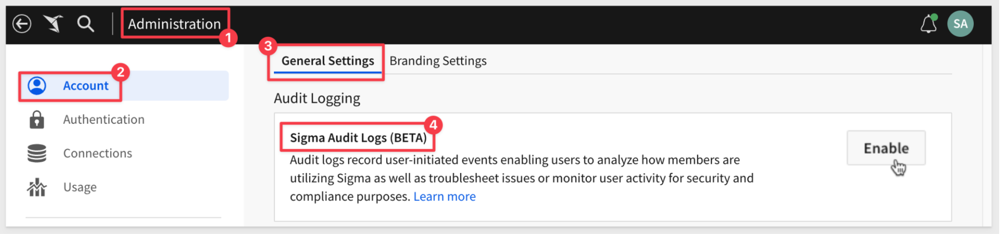
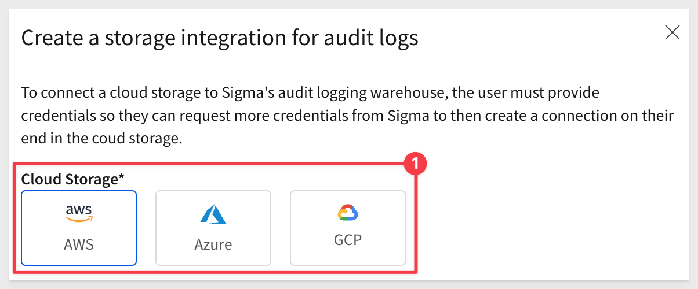
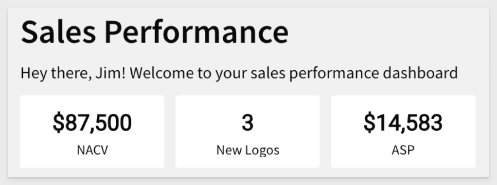
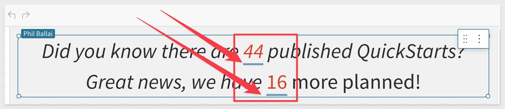

author: pballai
id: 01_2024_first_friday_features
summary: 01_2024_first_friday_features
categories: Administration
environments: web
status: Published
feedback link: https://github.com/sigmacomputing/sigmaquickstarts/issues
tags: first_friday_features
lastUpdated: 2024-01-31

<!--
Jan 5 (was included in Jan FFF)
Jan 12: done
Jan 19: done
Jan 26: done
Feb 2:
-->

# (01-2024) January

## Overview 
Duration: 5 

This QuickStart lists all the new and public beta features released, as well as bugs fixed in January 2024.

It is summary in nature, and you should refer to the specific Sigma documentation links provided for more information.

**Public beta features will carry the section text "Beta".**

All other features are considered released (**GA** or generally available).

Sigma actually has feature and bug fix releases weekly, and high-priority bug fixes on demand. We felt it was best to keep these QuickStarts to a summary of the previous month for your convenience.

New first Friday features QuickStarts will be published on the first Friday of each month, and will include information for the previous month.

## Audit Logging (Beta)
Duration: 20

<aside class="negative">
<strong>NOTE:</strong>  This is a premium beta feature that’s subject to quick, iterative changes. As a result, the latest product version may differ from the contents of this document.
</aside>

There is also the QuickStart[Audit Logging](https://quickstarts.sigmacomputing.com/guide/administration_audit_logging/index.html?index=..%2F..index#0)

The Administration portal now includes an `Account` > `General Settings` > `Audit Logging` section that supports the following self-serve features:

### Enable audit logging
Enable audit logging by activating the Sigma Audit Logs connection.

This feature requires `Admin` access and is located in Sigma under `Administration` > `Account` > `General Settings` > `Audit logging`:

The Sigma Audit Logs connection stores entries for 30 days, but you can retain audit log data for extended periods by exporting it to cloud storage

For more information, see [Enable audit logging](https://help.sigmacomputing.com/docs/enable-audit-logging)  

### Create an Audit Logs Storage Integration 
Audit log cloud storage integration provides exporting log data to AWS, Azure, or GCP.

<aside class="negative">
<strong>NOTE:</strong>  Exporting audit logs to third party services requires configuration work in those services, in order to provide the appropriate permissions and storage type.
</aside>

For more information, see [Create an audit logs storage integration](https://help.sigmacomputing.com/docs/create-an-audit-logs-storage-integration).

## Input Tables
Duration: 20

### Input table row deletion
You can now delete any row (saved or unsaved) when editing an input table in the permitted workbook version (based on element’s data entry permission).

The ability to delete saved rows was previously restricted when the [data entry permission](https://help.sigmacomputing.com/docs/create-and-manage-input-tables#set-data-entry-permission) was set to `Only on Published` version. Therefore, users could only delete unsaved rows while editing an input table in a workbook’s published version. This update removes the restriction and allows users to delete any row while editing the draft (via `Edit` mode) or published version (via `View` or `Explore` mode).

## Functions
Duration: 20

We have added to new system functions to allow more personalization for users.

For example, you may want to display the user's first name in a dashboard element.

When "Jim Smith" logs into Sigma and views the Sales Performance workbook, the text element displays “Hey there, Jim!”

[CurrentUserFirstName:](https://help.sigmacomputing.com/docs/currentuserfirstname)
Returns the current (signed-in) user’s first name as configured in the user’s profile.

[CurrentUserFullName:](https://help.sigmacomputing.com/docs/currentuserfullname)
Returns the current (signed-in) user’s first and last name as configured in the user’s profile.

## New QuickStarts in January
Duration: 20

**Version Tagging with Sigma (non-embed user cases):**  
[In this QuickStart](https://quickstarts.sigmacomputing.com/guide/administration_version_tagging/index.html?index=..%2F..index#0), we cover how Sigma version tagging can be used (inside Sigma itself) to provide a controlled release experience, which should result in less reported issues and happier end-users.

**Getting Started with Period Over Period Analysis in Sigma:**  
In this [QuickStart](https://quickstarts.sigmacomputing.com/guide/functions_period_over_period_analysis/index.html?index=..%2F..index#0), we will focus on the PoP analysis scenarios, where two specific time periods are selected and compared, against key metrics or data points between these periods.

## Regional Support (Infrastructure)

Sigma is now deployed in AWS UK in compliance with UK GDPR ([Data Protection Act 2018](https://www.gov.uk/data-protection)). 

Located in London, United Kingdom, the deployment gives customers in the UK more control over data storage while enabling compliance with internal policies and external data residency requirements.

To accompany the region expansion, Sigma now supports the English (United Kingdom) (en-gb) locale for enhanced localization. When enabled, dates display as DD/MM/YYYY or Day Month Year, and time displays in the 24-hour format.

## Version Tagging
Duration: 20

### Bug Fixes

1: Sigma successfully exports a tagged workbook version when recipients have access to the tagged version. The export no longer relies on recipient's access to the source workbook.

2: Resolved an issue that periodically caused the `Move tag to` functionality to incorrectly apply the selected tag to a previous workbook version.

3: Sigma now exports a tagged workbook version to Google Drive without requiring recipients to have access to the source workbook.

## Workbooks

### Column Level Security (CLS)
Column-level security is now generally available.

The feature provides admins with the flexibility to restrict or grant access to column-level data. This granular control over data access allows your organization to secure sensitive or confidential information, ensuring it’s accessible to authorized users only.

For more information, [see Column-level security.](https://help.sigmacomputing.com/docs/column-level-security)

There is also a [QuickStart on CLS here.](https://quickstarts.sigmacomputing.com/guide/security_column_level_security/index.html?index=..%2F..index#0)

### Dynamic element titles
Workbook element titles now support dynamic values. This update allows you to create more relevant and detailed element titles that adapt to selected control values.

For more information, see [Create a dynamic title](https://help.sigmacomputing.com/docs/customize-element-title#create-a-dynamic-title) in [Customize element title.](https://help.sigmacomputing.com/docs/customize-element-title)

### Dynamic text style update
In workbook Edit mode, the pill-style display of dynamic text has been updated to a more sleek and simple underlined format to enhance readability.

## Additional Information
Duration: 20

**Additional Resource Links**

[Blog](https://www.sigmacomputing.com/blog/) 
[Community](https://community.sigmacomputing.com/) 
[Help Center](https://help.sigmacomputing.com/hc/en-us) 
[QuickStarts](https://quickstarts.sigmacomputing.com/) 
 

&emsp;
&emsp;

