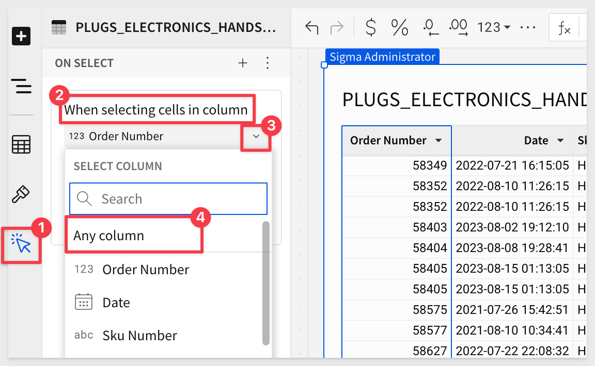
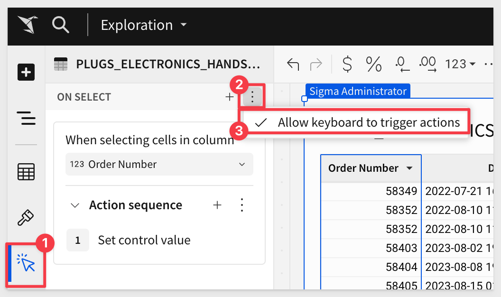
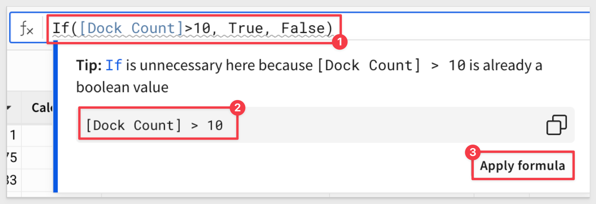
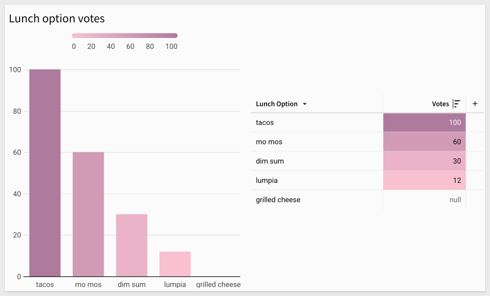
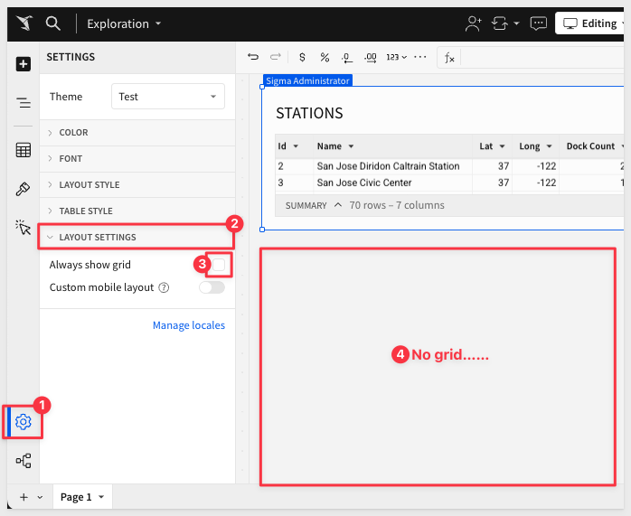

author: pballai
id: 01_2025_first_friday_features
summary: 01_2025_first_friday_features
categories: firstfridayfeatures
environments: web
status: Published
feedback link: https://github.com/sigmacomputing/sigmaquickstarts/issues
tags: first_friday_features
lastUpdated: 2025-02-07

# (01-2025) January 2025

## Overview 
Duration: 5 

This QuickStart lists all the new and public beta features released, as well as bugs fixed in January 2025.

It is summary in nature, and you should refer to the specific Sigma documentation links provided for more information.

**Public beta features will carry the section text "Beta".**

All other features are considered released (**GA** or generally available).

Sigma actually has feature and bug fix releases weekly, and high-priority bug fixes on demand. We felt it was best to keep these QuickStarts to a summary of the previous month for your convenience.

New `First Friday Features` QuickStarts will be published on the first Friday of each month, and will include information for the previous month.


<!-- END OF SECTION-->

## Actions
Duration: 20

### Action trigger configurations for tables, pivot tables, and input tables
Tables, pivot tables, and input tables now support more ways to determine when and how user interaction triggers action sequences:

**1:** In the When selecting cells in column field, select `Any column` to trigger an action sequence when a user selects a cell in any column.



**2:** In the element’s `Action panel`, click the "three dots" to open the menu, then select or deselect `Allow keyboard to trigger actions` to control whether keyboard navigation within the element can trigger action sequences.

When the option displays a checkmark, keyboard navigation and pointer events (e.g., mouse clicks) can trigger the action sequences. When the option doesn’t display a checkmark, only pointer events can trigger them.



<aside class="negative">
<strong>NOTE:</strong><br> Keyboard navigation as a trigger interaction can disrupt the user experience. For example, if the element's action sequences include actions that open links or other workbooks, a user can be unintentionally navigated away from their current task. This can be particularly disruptive if the action sequence can be triggered by selecting a cell in any column.

Consider allowing keyboard navigation to trigger actions only when it facilitates the configured action sequences and is unlikely to interfere with usability.
</aside>

### Option to open workbook templates with actions
When configuring an `Open Sigma doc` action, you can now select a workbook template as the destination.

### Updated trigger type UI
In the `Actions panel`, action sequences are no longer added and grouped based on trigger type (On select, On change, On click, etc.). 

Each sequence indicates the trigger type, and you can select a different option from a dropdown when multiple types are available.


<!-- END OF SECTION-->

## Administration
Duration: 20

### COMMENTS audit log dimension table
The `SIGMA_SHARED` schema in the Sigma Audit Logs connection now features a `COMMENTS` dimension table containing information about comment activity on workbooks and elements, including a full transcript, attachments, and mentioned users.

For more information, see [Sigma Shared metadata reference in Audit log events and metadata.](https://help.sigmacomputing.com/docs/audit-log-events-and-metadata#sigma-shared-metadata-reference)

### AWS US East region is now available 
Sigma is now deployed in `AWS US East (us-east-1).` 

This region, located in Northern Virginia, is the largest AWS region and gives customers on the East Coast lower latency and enhanced performance when connecting to Sigma.

### EN-AU now supported as an account locale
You can now set `Australian English` as your organization’s locale. 

Setting `EN-AU` as your organization’s locale will allow `EN-AU` number formatting, currency, and custom translations to be used as a default across the organization.

For more information, see [Manage organization locale.](https://help.sigmacomputing.com/docs/manage-organization-locale)

### Inputting invalid SAML RelayState now displays error messages
When a SAML RelayState with invalid origin is entered, an error message is now displayed.

### Reduced 2FA code expiry times
Two-factor authentication email codes now expire after 5 minutes, instead of 15 minutes.

### Uniquely identify SAML attributes with the Sigma namespace prefix
You can now uniquely identify your SAML attributes by using the Sigma namespace prefix (https://schema.sigmacomputing.com/2025/01/claims). 

This can be applied to the `userRole` and `userGroups` attributes to avoid overlap with other app configurations. 

For example, the `userRole` attribute name would look like `https://schema.sigmacomputing.com/2025/01/claims/userRole`.

For more information, see [Configure SSO for your Sigma Organization in Single sign-on with SAML.](https://help.sigmacomputing.com/docs/single-sign-on-with-saml)


<!-- END OF SECTION-->

## API
Duration: 20

### Allowlist IP addresses for API access (Beta)
Restrict access to the Sigma API for your organization by adding IP addresses and IP address ranges using CIDR notation to an allowlist. 

**With an allowlist configured, only users making API requests from allowed IP addresses can make successful requests.**

For more details, see [Restrict API access by IP address (Beta).](https://help.sigmacomputing.com/docs/restrict-api-access-by-ip-address)

### New options for Add workbook schedule endpoint
The `Add workbook schedule` endpoint, [POST /v2/workbooks/{workbookId}/schedules](https://help.sigmacomputing.com/reference/postworkbookschedule) now includes two new options:

The `parameters` option, allowing you to customize control values when programmatically adding an export schedule to a workbook.

The `ownerId` option, allowing you to specify a user to own the export schedule.

### New parameters added for List workbooks endpoint
The [List workbooks](https://help.sigmacomputing.com/reference/listworkbooks) (GET /v2/workbooks) endpoint now supports two new optional query parameters:

**SkipPermissionCheck:** 
When set to `true`, allows the API client to return all workbooks in a Sigma organization, including those not shared with the requesting user. 

<aside class="positive">
<strong>IMPORTANT:</strong><br> The API client must have admin privileges to use this parameter.
</aside>

**isArchived parameter:** When set to `true`, filters the results to include only archived workbooks.

### New API Recipe - Bulk Deactivate
For customers wanting to bulk deactivate (soft-delete) users from Sigma, this API recipe demonstrations how to accomplish that through the use of a regex pattern match against the user's name.

<aside class="negative">
<strong>NOTE:</strong><br> User records are never fully deleted from Sigma but rather deactivated, preventing future system access. Any workbooks created by the deactivated user are reassigned to the specified user.
</aside>

For more information, see [Sigma REST API Recipes](https://quickstarts.sigmacomputing.com/guide/developers_api_code_samples/index.html?index=..%2F..index#6)


<!-- END OF SECTION-->

## Bug Fixes
Duration: 20

**1:** When a value in a `list control` is selected, the `display value` is now shown instead of the `raw value.`

**2:** Formulas with an argument referencing a hidden control (control element on a hidden page) now evaluate successfully, regardless of the reference’s argument position.

**3:** When entering a table in a SQL query, the autocomplete dropdown now excludes tables that the user does not have permission to view.

**4:** You can now select specific tables in a data model when adding or changing data sources for an element.

**5:** Sigma no longer allows users to create input tables on an OAuth connection when an input table edit log destination is not configured.

**6:** The `Refresh element` action now successfully refreshes data for elements on hidden pages.

**7:** The `List columns` for a workbook element endpoint `(GET /v2/workbooks/{workbookId}/elements/{elementId}/columns)` now correctly returns pagination data in the nextPage portion of the response.

**8:** Scheduled exports that email team members now send to the members of the team when the export is sent, instead of the members of the team when the schedule is added.

**9:** When the embed team name contains an apostrophe, the embed sandbox no longer shows an `invalid embed signature` error and loads the embed successfully.

**10:** When you switch between `Secur`e and `JWT` mode in the embed sandbox, Sigma now clears the URL field so that you can load the new embed without any error messages.

**11:** When hidden column values are passed to controls through workbook actions, those columns are now correctly excluded from Excel files.


<!-- END OF SECTION-->

## Embedding
Duration: 20

### Embed SDK for React (GA)
The `Embed SDK for React` offers a developer-friendly interface that simplifies integration into applications. 

Developers can access detailed installation and usage guides on Github.

For more information, see [Embed SDK for React](https://help.sigmacomputing.com/docs/embed-sdk-for-react) or review the [Embedding 15: Embed-SDK for React QuickStart.](https://quickstarts.sigmacomputing.com/guide/embedding_15_embed_sdk/index.html?index=..%2F..index&_gl=1*sstmup*_gcl_au*NjI3NDQxOTM0LjE3MzY5Nzc3NTc.*_ga*MjAyNzIyMDcwLjE3MTcxODQ4Nzk.*_ga_PMMQG4DCHC*MTczODY5ODEzNC40ODkuMS4xNzM4Njk5NzA1LjYwLjAuMA..#0)


<!-- END OF SECTION-->

## Functions / Calculations
Duration: 20

### Get additional formula guidance 
When you write formulas in workbooks and data models, additional guidance is now available to help! 

If guidance is available, a wavy underline appears. 

Hover over the highlight to see a tip or a warning that your results might not be what you expect, and select `Apply formula` to update your formula with one click.



This works for simple and complex formulas and help catch those little syntax issues that can be a time-waster too.


<!-- END OF SECTION-->

## Filters and controls
Duration: 20

### Specify date values in controls with Unix timestamps
Date range controls and date controls now accept date values as `Unix timestamps` (milliseconds since epoch) when setting values with URL query string parameters or from an action.

For exampleL
```code
 ?date-control-ID=1738260555.
```

For more information, see [Set control values in a URL using query string parameters.](https://help.sigmacomputing.com/docs/workbook-control-values-in-the-url)


<!-- END OF SECTION-->

## Pivot Tables
Duration: 20

### Display images in pivot table cells 
If your pivot table has a column that contains links to images, such as thumbnail images of retail products, you can transform the column to display the image links as images. 

You can set images to display in pivot table row, column, or values columns.

For more information, see [Display linked images in a table or pivot table.](https://help.sigmacomputing.com/docs/add-hyperlinks-to-columns#display-linked-images-in-a-table-or-pivot-table)


<!-- END OF SECTION-->

## Visualizations (Now called "Charts")
Duration: 20

### Terminology Change 
As part of ongoing improvements to UI terminology, references to `visualization` are now consistently updated to `chart.`


<!-- END OF SECTION-->

## Workbooks
Duration: 20

### Add custom data labels to area, bar, line, scatter, and combo charts
It can sometimes be useful to display a more verbose data label on a chart to help the user better understand meaning.

By default, a chart can display data labels for the aggregate series of the chart, such as the Y-axis or X-axis values, depending on the chart and orientation. With this addition, some charts, and for region and point maps, you can specify a column to use to provide custom data labels for a chart.

Simply select one or more columns to add custom data labels to area, bar, line, scatter, and combo charts.

For more information see [Display chart data labels.](https://help.sigmacomputing.com/docs/display-chart-data-labels)

### Customize chart and formatting color scales (Beta)
You can now create custom color scales to use when formatting chart colors or conditional formatting for tables. Create a custom color scale for an organization theme, workbook theme, or for a specific data element.



For more details, see [Add a custom color scale (Beta).](https://help.sigmacomputing.com/docs/add-a-custom-color-scale)

### Export raw data formats from bookmarks
You can now export data from a Bookmark to a CSV, Excel, or JSON-formatted file.

### Layout grid is hidden by default 
When editing workbooks and data models, grid lines are visible when moving elements and are otherwise hidden.



To show grid lines by default, you can modify the layout settings for a specific workbook. 

For more information, see [Layout settings in Workbook settings overview.](https://help.sigmacomputing.com/docs/workbook-settings-overview#layout-settings)

### Show or hide all totals in a grouped table
You can now show or hide totals for all levels of a grouped table. 

Simply right-click a table cell to open the `context menu` and select S`how all totals` or `Hide all totals` to show or hide totals for all grouping levels of the table.

For more information, see [Show totals in a grouped table for more details.](https://help.sigmacomputing.com/docs/create-and-manage-tables#show-totals-in-a-grouped-table)


<!-- END OF SECTION-->

## Additional Information
Duration: 20

**Additional Resource Links**

[Blog](https://www.sigmacomputing.com/blog/)<br>
[Community](https://community.sigmacomputing.com/)<br>
[Help Center](https://help.sigmacomputing.com/hc/en-us)<br>
[QuickStarts](https://quickstarts.sigmacomputing.com/)<br>
<br>

[](https://twitter.com/sigmacomputing)&emsp;
[](https://www.linkedin.com/company/sigmacomputing)&emsp;
[](https://www.facebook.com/sigmacomputing)


<!-- END OF SECTION-->
