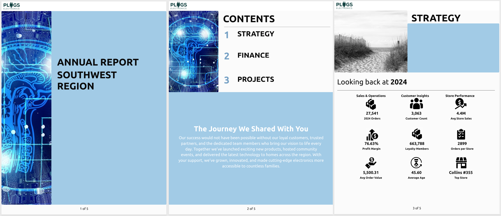

author: pballai
id: 01_2026_first_friday_features
summary: 01_2026_first_friday_features
categories: firstfridayfeatures
environments: web
status: Published
feedback link: https://github.com/sigmacomputing/sigmaquickstarts/issues
tags: first_friday_features
lastUpdated: 2026-02-06

# (01-2026) January
<!-- The above name is what appears on the website and is searchable. 

January 9th, 2026: done

Publish on Feb 6

 
-->

## Overview 
Duration: 5 

This QuickStart lists all the new and public beta features released, as well as bugs fixed in January 2026.

It is summary in nature, and you should refer to the specific Sigma documentation links provided for more information.

**Public beta features will carry the section text "Beta".**

All other features are considered released (**GA** or generally available).

Sigma actually has feature and bug fix releases weekly, and high-priority bug fixes on demand. We felt it was best to keep these QuickStarts to a summary of the previous month for your convenience.

New first Friday features QuickStarts will be published on the first Friday of each month, and will include information for the previous month.

### Subscribe to What's New in Sigma
For those wanting to see what Sigma is doing on each week, release notes are now also available on the [Sigma Community site](https://community.sigmacomputing.com/). There, you can **opt in to receive notifications about future release notes** in order to stay on top of everything new happening at Sigma. You can also subscribe to automated updates in any Slack channel using the Sigma Community release notes RSS feed. 

For more information on how to subscribe to release note notifications, see [About the release notes](https://community.sigmacomputing.com/t/about-the-release-notes-category/5517) 

<aside class="positive">
<strong>IMPORTANT:</strong>  Some screens in Sigma may appear slightly different from those shown in QuickStarts. This is because Sigma continuously adds and enhances functionality. Rest assured, Sigma’s intuitive interface ensures that any differences will not prevent you from successfully completing any QuickStart.
</aside>

For more information on Sigma's product release strategy, see [Sigma product releases](https://help.sigmacomputing.com/docs/sigma-product-releases)

If something is not working as you expect, here's how to [contact Sigma support](https://help.sigmacomputing.com/docs/sigma-support)

<!-- END OF SECTION-->

## Administration
Duration: 20

### My documents and Shared with me renamed
The `My documents` section has been renamed to `Documents`, and `Shared with me` has been renamed to `Shared with you`. Functionality remains unchanged.

### Try AI before human support 
An AI chatbot trained on Sigma documentation, Community posts, and QuickStarts is now available outside support hours via the `Help` > `Live chat` menu.

***Why it matters:*** 
Gets you unblocked outside support hours with instant answers to common questions instead of waiting for the next business day.

For more information, see [Sigma support](https://help.sigmacomputing.com/docs/sigma-support)

### OAuth token expiration warning banner
A notification banner now appears three days before OAuth session expiration, allowing users to reauthorize their session and avoid losing access to data.

***Why it matters:*** 
Prevents unexpected data access interruptions by proactively notifying users to refresh their credentials before expiration, instead of discovering expired sessions mid-analysis.

### Sigma Tenants (Beta) 
Organizations can now set up a multitenant architecture with multiple Sigma organizations to centralize governance while maintaining isolated tenants in the same or different regions.

There is a QuickStart, [Sigma Tenants: Managing Isolated Organizations](https://quickstarts.sigmacomputing.com/guide/administration_multitenancy/index.html?index=..%2F..index#0)

Example use cases include:
- Comply with data residency requirements across different regions
- Fully isolate customer data as a managed service provider
- Centralize governance for multiple business units while keeping them isolated

***Why it matters:*** 
Enables service providers and large enterprises to manage multiple isolated Sigma environments from a single parent organization instead of maintaining completely separate Sigma accounts, streamlining administration while ensuring data isolation.

<aside class="positive">
<strong>NOTE:</strong>  Sigma Tenants is a premium feature.
</aside>

For more information, see [Sigma Tenants](https://help.sigmacomputing.com/docs/sigma-tenants) and [Deploy content to tenant organizations](https://help.sigmacomputing.com/docs/deploy-content-to-tenant-organizations)

### Use other supported IdPs for Databricks OAuth via OAuth token federation
Sigma now supports using other supported identity providers to authenticate to Databricks through OAuth token federation, beyond Databricks itself.

***Why it matters:*** 
Allows you to use your existing enterprise IdP for Databricks authentication instead of managing separate Databricks credentials, consolidating identity management and improving security posture.

For more information, see [Configure Databricks OAuth token federation](https://help.sigmacomputing.com/docs/configure-a-sigma-oauth-application#step-6-configure-databricks-oauth-token-federation-databricks-only)

<!-- END OF SECTION-->

## AI
Duration: 20

### Documentation MCP server available (Beta) 
Sigma documentation is now accessible via the Model Context Protocol (MCP) server at https://help.sigmacomputing.com/mcp for AI tools working with Sigma.

***Why it matters:*** 
Enriches AI agent behavior with official Sigma documentation context, enabling more accurate responses when using AI tools to build or troubleshoot Sigma implementations.

For more information, see [Use the Sigma documentation MCP server](https://help.sigmacomputing.com/docs/use-the-sigma-documentation-mcp-server)

<!-- END OF SECTION-->

## AI Apps
Duration: 20

### Single-select and multi-select columns in input tables (GA) 
Input tables now support single-select and multi-select columns (generally available), allowing users to select predefined values with visual pill formatting and color coding.

***Why it matters:*** 
Provides validated data entry options directly in input tables instead of relying on free-text fields that require manual validation or cleanup, reducing data quality issues and improving user experience.

<aside class="negative">
<strong>NOTE:</strong>  Multi-select columns are not supported on Databricks connections.
</aside>

For more information, see [Configure single-select and multi-select columns in input tables](https://help.sigmacomputing.com/docs/configure-single-select-and-multi-select-columns-in-input-tables)

### Single row container (Beta)
A layout element that displays individual records by selecting a key column and value from connected data.

***Why it matters:*** 
Displays detailed views of individual records without filtering entire workbooks, useful for drill-down pages or detail views in data apps where users need to see one record at a time.

For more information, see [Use single row containers to show records in detail](https://help.sigmacomputing.com/docs/use-single-row-containers-to-show-records-in-detail) and [Create actions that control single row containers](https://help.sigmacomputing.com/docs/create-actions-that-control-single-row-containers)

### Repeated container (Beta)
A new layout element that connects to a data source and generates a layout card for each row, enabling dynamic layouts based on data.

***Why it matters:*** 
Creates dynamic, data-driven layouts without manually duplicating containers for each item, particularly useful for building catalogs, dashboards, or card-based interfaces that adapt to changing data.

For more information, see [Use repeated containers to generate layouts from data](https://help.sigmacomputing.com/docs/use-repeated-containers-to-generate-layouts-from-data)

### Value list (Beta)
A display element showing details from a data source with customization options for formulas, controls, and static values.

***Why it matters:*** 
Presents key metrics and values in a customizable list format instead of building custom layouts with individual text elements, streamlining the creation of KPI displays and metric summaries.

For more information, see [Value lists](https://help.sigmacomputing.com/docs/value-lists)

<!-- END OF SECTION-->

## API
Duration: 20

### Create and manage data models from code (Beta)  
Data models can now be created and managed programmatically via the Sigma API using JSON representations.

The following endpoints are available:
- [Get the JSON representation of a data model](https://help.sigmacomputing.com/reference/getdatamodelspec) (GET /v2/dataModels/{dataModelId}/spec)
- [Create a data model from a JSON representation](https://help.sigmacomputing.com/reference/createdatamodelfromspec) (POST /v2/dataModels/spec)
- [Update a data model from a JSON representation](https://help.sigmacomputing.com/reference/updatedatamodelfromspec) (PUT /v2/dataModels/{dataModelId}/spec)

***Why it matters:*** 
Enables infrastructure-as-code workflows for data models, allowing teams to version control, automate deployment, and programmatically generate data models instead of manually recreating them across environments.

There is a QuickStart, [Data Models as Code](https://quickstarts.sigmacomputing.com/guide/developers_data_models_as_code/index.html?index=..%2F..index#0)

For more information, see [Create and manage data models from code](https://help.sigmacomputing.com/docs/create-and-manage-data-models-from-code) and [Data model representation example library](https://help.sigmacomputing.com/docs/data-model-representation-example-library)

### New API endpoints for managing SAML authentication
The following endpoints to manage SAML authentication configurations are now available:

- [List SAML service providers](https://help.sigmacomputing.com/reference/listsamlserviceproviders) (GET /v2/saml/service-providers)
- [Create a SAML service provider certificate](https://help.sigmacomputing.com/reference/createsamlserviceprovidercertificate) (POST /v2/saml/service-providers/{samlServiceProviderId}/certificates)
- [List SAML service provider certificates](https://help.sigmacomputing.com/reference/listsamlserviceprovidercertificates) (GET /v2/saml/service-providers/{samlServiceProviderId}/certificates)
- [Get a SAML service provider certificate](https://help.sigmacomputing.com/reference/getsamlserviceprovidercertificate) (GET /v2/saml/service-providers/{samlServiceProviderId}/certificates/{samlServiceProviderCertificateId})
- [Activate a SAML service provider certificate](https://help.sigmacomputing.com/reference/activatesamlserviceprovidercertificate) (POST /v2/saml/service-providers/{samlServiceProviderId}/certificates/{samlServiceProviderCertificateId}/activate)
- [Deactivate a SAML service provider certificate](https://help.sigmacomputing.com/reference/deactivatesamlserviceprovidercertificate) (POST /v2/saml/service-providers/{samlServiceProviderId}/certificates/{samlServiceProviderCertificateId}/deactivate)
- [Remove a SAML service provider certificate](https://help.sigmacomputing.com/reference/deletesamlserviceprovidercertificate) (DELETE /v2/saml/service-providers/{samlServiceProviderId}/certificates/{samlServiceProviderCertificateId})

***Why it matters:*** 
Automates SAML certificate rotation and management instead of manually updating certificates through the UI, reducing downtime risk during certificate renewals.

### New API endpoint to tag a data model
The following endpoint to tag a data model version is now available:

[Tag a data model](https://help.sigmacomputing.com/reference/tagdatamodel) (POST /v2/dataModels/tag)

***Why it matters:*** 
Enables automated version control workflows for data models, allowing CI/CD pipelines to tag stable versions programmatically.

### New API endpoint to list tags of a data model
The following endpoint to list version tags of a data model is now available:

[List tags of a data model](https://help.sigmacomputing.com/reference/listdatamodeltags) (GET /v2/dataModels/{dataModelId}/tags)

### New data model detail endpoints
The following endpoints to retrieve data model information are now available:

[List lineage for a data model](https://help.sigmacomputing.com/reference/listdatamodellineagetree) (GET /v2/dataModels/{dataModelId}/lineage)

[List elements in a data model](https://help.sigmacomputing.com/reference/listdatamodelelements) (GET /v2/dataModels/{dataModelId}/elements)

[List columns for all elements in a data model](https://help.sigmacomputing.com/reference/listdatamodelcolumns) (GET /v2/dataModels/{dataModelId}/columns)

***Why it matters:*** 
Automates documentation and impact analysis instead of manually clicking through the UI to understand data model lineage and structure.

### New workbook detail endpoints
The following endpoints to retrieve workbook information are now available:

[List lineage for a workbook](https://help.sigmacomputing.com/reference/listlineagetree) (GET /v2/workbooks/{workbookId}/lineage)

[List elements in a workbook](https://help.sigmacomputing.com/reference/listworkbookelements) (GET /v2/workbooks/{workbookId}/elements)

[List columns for all elements in a workbook](https://help.sigmacomputing.com/reference/listworkbookcolumns) (GET /v2/workbooks/{workbookId}/columns)

***Why it matters:*** 
Retrieves all workbook details in fewer API calls instead of querying each page and element individually, reducing integration complexity and latency.

<!-- END OF SECTION-->

## Bug Fixes
Duration: 20

**1:** Updated metrics from Snowflake semantic views to use correct metrics syntax when referenced in the formula bar.

**2:** When migrating a dataset that contained a SQL statement that used a user attribute to reference a data model, users received an error indicating "There is a cycle in this element's dependencies" and referenced workbooks were not updated.

**3:** Custom page headers now span the full workbook width, instead of matching the selected page width.

**4:** When tagging a document version, the system now correctly updates ownership to the user who performed the tagging action.

**5:** Fixed an error where selecting "Allow user to use data sources when they 'Save as'" while tagging workbook versions sourced from data models resulted in a Hidden inodes error message. Users must now manually grant data model access to shared users/teams when using this option.

**6:** Ask Sigma usage data is now available for all embed users in the Ask Sigma Usage dashboard.

**7:** If you embed Ask Sigma, usage data for Ask Sigma is now available for all embed users and appears in the Ask Sigma Usage dashboard.

**8:** Deployment policies with more than 50 documents no longer error.

**9:** When sharing templates from one organization to another, the data sources failed to swap to the correct data source when the data source used OAuth to authenticate to the connection.

**10:** Clicking a pivot table subtotal now correctly passes the subtotal/total value and row/column context into actions (e.g., actions that set control values from the selected subtotal).

<!-- END OF SECTION-->

## Reports
Duration: 20

### Add and manage multiple report headers and footers (Beta)
Reports now support creating and managing multiple headers and footers for each report.

***Why it matters:*** 
Enables different headers/footers for first pages, odd/even pages, or specific sections instead of using the same header/footer throughout an entire report, matching common document formatting standards.

For more information, see [Edit report page setup, headers, and footers (Beta)](https://help.sigmacomputing.com/docs/edit-report-page-setup-headers-and-footers)

<!-- END OF SECTION-->

## Embedding
Duration: 20

### New URL parameters available for JWT-signed secure embeds
The following embed parameters are now available for JWT-signed secure embeds:

- :hide_element_interactions
- :hide_schedule
- :hide_send

For more information, see [Embed URL parameters](https://help.sigmacomputing.com/docs/embed-url-parameters)

### Ask Sigma Usage dashboard 
If you embed Ask Sigma, usage data for Ask Sigma is now available for all embed users and appears in the Ask Sigma Usage dashboard.

<!-- END OF SECTION-->

## Input Tables
Duration: 20

### File upload columns, controls, and form fields (Beta) 
Users can now upload images, documents, and videos directly to Sigma through file columns in input tables and file upload controls. Supported formats include JPEG, PNG, GIF, TIFF, BMP, WebP, SVG for images; PDF, CSV, DOC/DOCX, XLS/XLSX and others for documents; and MP4, MOV, AVI, MKV, WebM, M4V for videos.

***Why it matters:*** 
Eliminates the need for external form tools like Google Forms or Typeform, keeping file uploads and data collection entirely within your Sigma data app.

<aside class="negative">
<strong>NOTE:</strong>  Organizations must configure storage integration support to enable file upload functionality.
</aside>

For more information, see [Configure file upload columns on input tables](https://help.sigmacomputing.com/docs/configure-file-upload-columns-on-input-tables), [Create and configure a file upload control](https://help.sigmacomputing.com/docs/create-and-configure-a-file-upload-control), and [Configure storage integration for file upload columns](https://help.sigmacomputing.com/docs/configure-storage-integration-for-file-upload-columns)

### Copy input table data during source swaps and version tagging (GA)
When changing input table connections or applying version tags, users can copy input table data to new destinations.

***Why it matters:*** 
Preserves manually entered or uploaded data when promoting content across environments or switching connections, reducing data loss risks in deployment workflows.

For more information, see [Swap the connection used by an input table](https://help.sigmacomputing.com/docs/change-the-data-source-for-a-workbook-data-model-or-element#swap-the-connection-used-by-an-input-table) and [Use input tables with version tagging](https://help.sigmacomputing.com/docs/use-input-tables-with-version-tagging)

<!-- END OF SECTION-->

## New QuickStarts in January
Duration: 20

### Data Models as Code
This one’s for developers and data engineers who want to manage Sigma data models the same way they manage application code.

It doesn’t teach Git—that’s assumed knowledge. Instead, it focuses on how the pattern actually works in Sigma, with a simple, concrete walkthrough of creating and updating data models via the API.

[Data Models as Code](https://quickstarts.sigmacomputing.com/guide/developers_data_models_as_code/index.html?index=..%2F..index#0)

***Why it matters:***
If you’ve ever wanted data models to behave like real software artifacts—reviewable, repeatable, and deployable across environments—this QS shows the exact pattern to do it.

### Fundamentals 11: Pixel Perfect Reporting 
In this [QuickStart](https://quickstarts.sigmacomputing.com/guide/fundamentals_11_pixel_perfect_reporting/index.html?index=..%2F..index#0), you'll explore how Sigma makes creating professional, branded reports effortless—without sacrificing the precision and control that pixel-perfect formatting demands.

### Embedding: Use Case: Sigma with Databricks OAuth
This QuickStart demonstrates how to implement connection-level OAuth with PKCE for Sigma embedding with Databricks, enabling secure, user-specific data access in embedded analytics.

For more information, see [Use Case: Sigma with Databricks OAuth](https://quickstarts.sigmacomputing.com/guide/embedding_use_cases_databricks_oauth/index.html?index=..%2F..index#0)

<!-- END OF SECTION-->

## Workbooks
Duration: 20

### Ad hoc calculations in pivot tables (Beta)
Pivot tables now support ad hoc calculated rows for one-time calculations without modifying the underlying dataset.

***Why it matters:*** 
Enables quick what-if analysis and temporary calculations directly in pivot tables instead of creating permanent formulas in the dataset, useful for exploratory analysis and presentation preparation.

For more information, see [Create ad hoc calculations (Beta)](https://help.sigmacomputing.com/docs/create-ad-hoc-calculations)

### Aggregate table cells by highlighting
Pivot tables now support cell aggregation by highlighting, with multiple aggregation methods available for both pivot and level tables.

***Why it matters:*** 
Quickly calculates sums, averages, or other aggregates for ad hoc selections instead of creating formal groupings or calculations, useful for rapid exploration and presentations.

For more information, see [Working with pivot tables](https://help.sigmacomputing.com/docs/working-with-pivot-tables)

### Custom page sizes in reports (Beta)
You can now specify custom page sizes in reports for enhanced layout control.

For more information, see [Edit report page setup, headers, and footers (Beta)](https://help.sigmacomputing.com/docs/edit-report-page-setup-headers-and-footers#change-page-margins-orientation-and-size)

### Export to cloud storage external stages 
You can now export to an external stage when configuring ad hoc and scheduled cloud storage exports.

For more information, see [Export to cloud storage](https://help.sigmacomputing.com/docs/export-to-cloud-storage)

### Hide or show fixed pivot table headers (GA)
You can now toggle the visibility of fixed row and column headers in pivot tables.

***Why it matters:*** 
Prevents redundant headers from cluttering embedded pivot tables where surrounding context already identifies the data, particularly useful in dashboards and customer-facing embeds.

For more information, see [Hide or show fixed pivot table headers](https://help.sigmacomputing.com/docs/working-with-pivot-tables#hide-or-show-fixed-pivot-table-headers)

### Image alignment settings
Image elements and container background images now support vertical and horizontal alignment options.

***Why it matters:*** 
Aligns images and backgrounds precisely within containers instead of relying on padding adjustments or container resizing to position them correctly.

For more information, see [Image elements](https://help.sigmacomputing.com/docs/image-elements) and [Use containers to organize workbook layouts](https://help.sigmacomputing.com/docs/use-containers-to-organize-workbook-layouts)

### Image shape setting
A new shape setting allows you to modify the appearance of images within Sigma.

***Why it matters:*** 
Applies circular or rounded corners to images directly in Sigma instead of pre-processing them in external image editors before upload.

For more information, see [Image elements](https://help.sigmacomputing.com/docs/image-elements)

### Pick from an existing organization locale when adding a workbook locale
When adding a workbook locale, you can now select from a dropdown of existing organization locales instead of manually entering custom translation files.

***Why it matters:*** 
Reuses organization-wide translations across workbooks instead of recreating or uploading translation files for each workbook individually, ensuring consistency and reducing setup time.

For more information, see [Add a custom translation for a language](https://help.sigmacomputing.com/docs/add-a-custom-translation-for-a-language)

### Run Python code in a document (GA) 
Python elements are now generally available, allowing you to write and run Python code against Databricks or Snowflake connections directly within workbooks and data models.

Python elements support:
- Referencing tables, pivot tables, and input tables as DataFrames
- Incorporating control values into code
- Building tables and charts from Python output
- Importing libraries available in your connection
- Running code on-demand or via actions

***Why it matters:*** 
Performs complex data transformations, forecasting, ML predictions, and API integrations directly within Sigma instead of building separate Python environments and importing results, consolidating analytics workflows.

For more information, see [Set up a Databricks connection for Python](https://help.sigmacomputing.com/docs/set-up-a-databricks-connection-for-python), [Set up a Snowflake connection for Python](https://help.sigmacomputing.com/docs/set-up-a-snowflake-connection-for-python), [Write and run Python code](https://help.sigmacomputing.com/docs/write-and-run-python-code), and [Python method reference](https://help.sigmacomputing.com/docs/python-method-reference)

### Version tagging for warehouse views (GA)
You can now create warehouse views from tagged workbook or data model versions, maintaining a stable query for a virtual table despite published version changes.

***Why it matters:*** 
Ensures downstream consumers of warehouse views have stable, predictable queries even as published content evolves, supporting production environments and data pipelines that require version consistency.

For more information, see [Use warehouse views with version tagging](https://help.sigmacomputing.com/docs/use-warehouse-views-with-version-tagging)

<!-- END OF SECTION-->

## Additional Information
Duration: 20

**Additional Resource Links**

[Blog](https://www.sigmacomputing.com/blog/) 
[Community](https://community.sigmacomputing.com/) 
[Help Center](https://help.sigmacomputing.com/hc/en-us) 
[QuickStarts](https://quickstarts.sigmacomputing.com/) 
 

<button>[Sigma Free Trial](https://www.sigmacomputing.com/free-trial/)</button>

&emsp;
&emsp;

<!-- END OF SECTION-->
