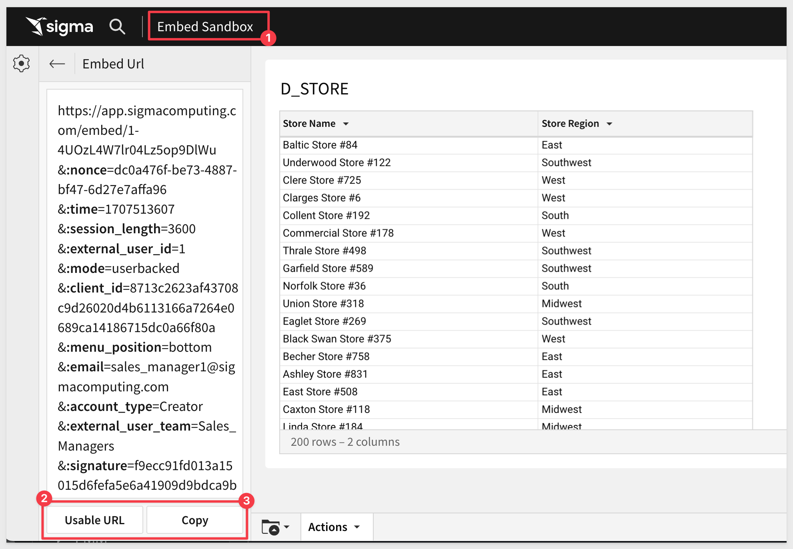
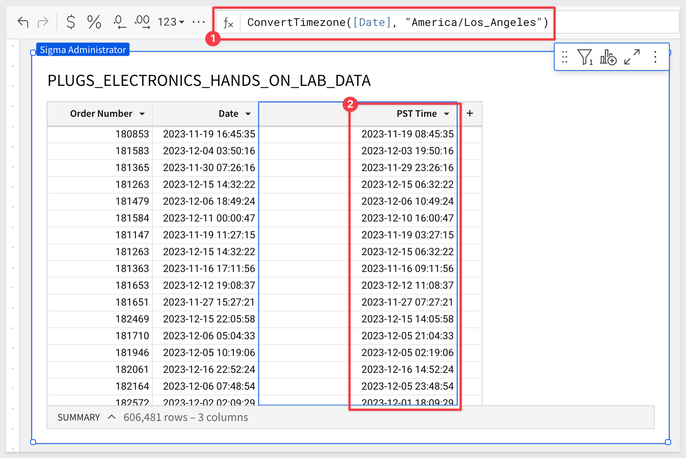
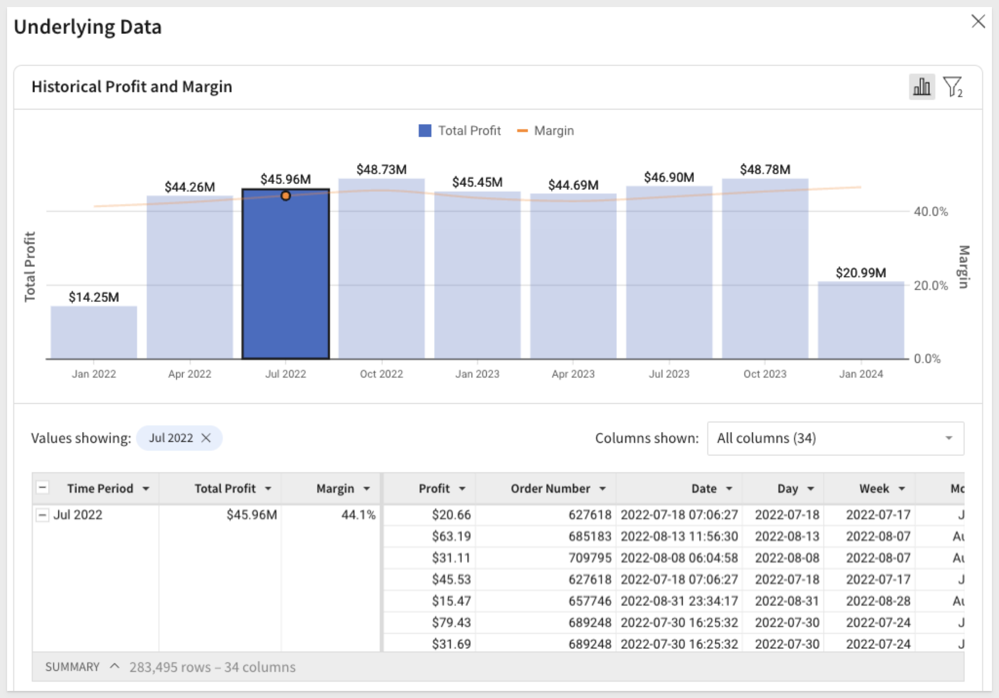
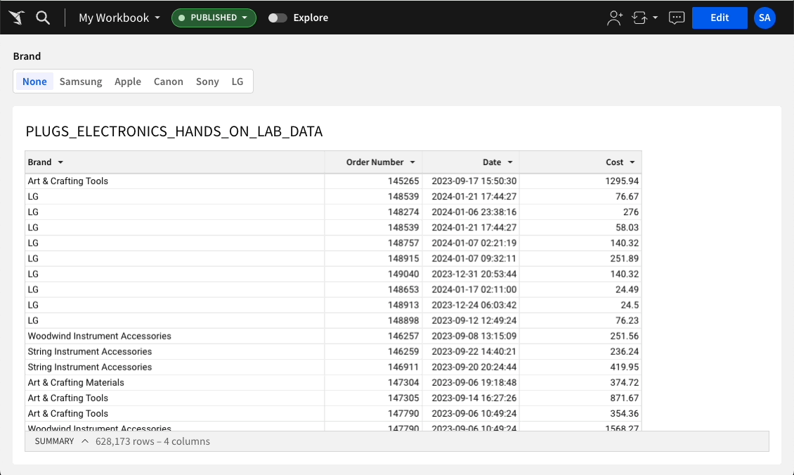
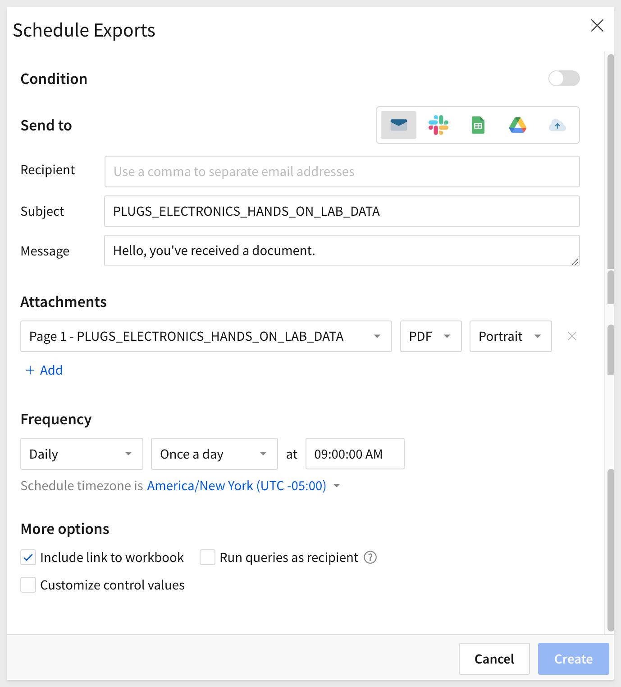
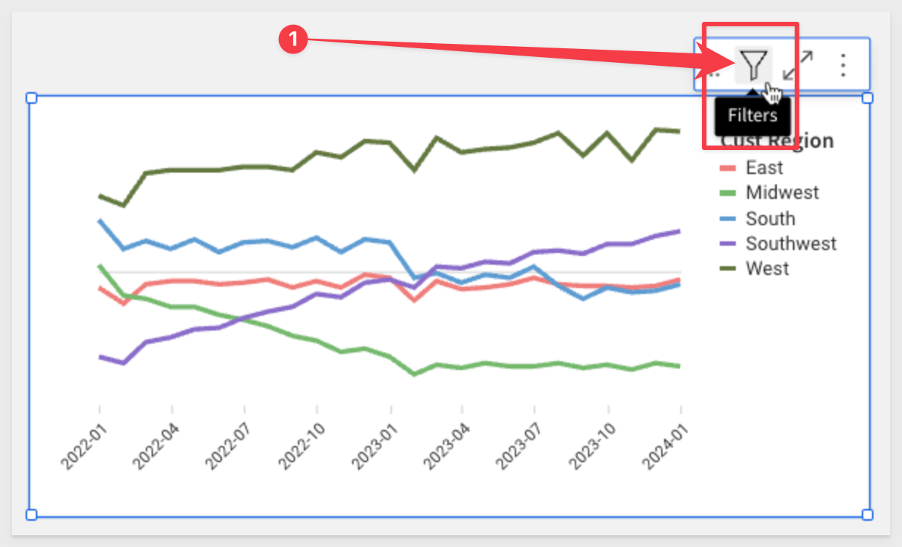
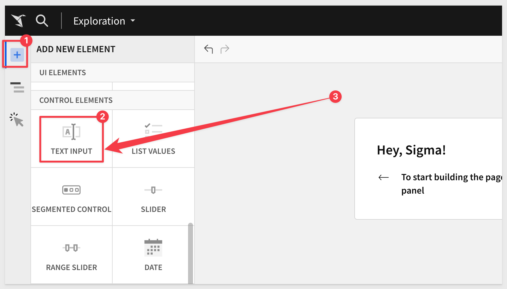

author: pballai
id: 02_2024_first_friday_features
summary: 02_2024_first_friday_features
categories: Administration
environments: web
status: Published
feedback link: https://github.com/sigmacomputing/sigmaquickstarts/issues
tags: first_friday_features
lastUpdated: 2024-02-28

<!--
Feb 2 was included in Jan done
Feb 9 done
Feb 16 done
FEb 23 done
-->

# (02-2024) February

## Overview 
Duration: 5 

This QuickStart lists all the new and public beta features released, as well as bugs fixed in February 2024.

It is summary in nature, and you should refer to the specific Sigma documentation links provided for more information.

**Public beta features will carry the section text "Beta".**

All other features are considered released (**GA** or generally available).

Sigma actually has feature and bug fix releases weekly, and high-priority bug fixes on demand. We felt it was best to keep these QuickStarts to a summary of the previous month for your convenience.

New first Friday features QuickStarts will be published on the first Friday of each month, and will include information for the previous month.


## Audit Logging (Beta)
Duration: 20


## Bug Fixes
Duration: 20

**1:** Can write only permission set at the connection level no longer blocks additive permissions set at the schema or database table levels.


## Embedding
Duration: 20

### Embedding workflows UI refresh
The following UI changes have been applied to the embedding workflows in Sigma:

1: Embed types now include `Secure` or `Public`. 
2: All references to `Application` and `User-backed` embedding have been removed.
3: The former `APIs & Embed Secrets` page in the Administration portal is now labeled `Developer Access`. 
    - This page displays existing credentials and allows you to create new ones.
4: The former Application Embedding Secret modal (accessible from the Developer Access page) is now labeled `Secure Embedding Credentials`. 
    - This modal displays the client ID and embed secret upon creation.

In support of this, the [help documentation](https://help.sigmacomputing.com/docs/workbook-embedding-overview) and [Embed QuickStart series](https://quickstarts.sigmacomputing.com/?cat=embedding) have been refresh.

### Hide run as recipient
Embeds now support a `hide_run_as_recipient` parameter that allows you to hide the Run queries as recipient option in the `Send Now` and `Schedule Exports` modals. 

This removes the ability for embed users to configure exports that run queries using the recipient’s permissions and data access. 

A `Hide run as recipient` option has also been added to the Embed configurations panel in the embed sandbox.

### View embed URL in Embed Sandbox
When an embed is loaded in the sandbox environment, you can now click a View Url option to display the embed URL.

There are two options:

**Usable URL:** Clicking this, copies a URL to your clickboard that can then be pasted into any browser window and will generate the embed. Each time you click it, the clipboard is updated with a working URL as a new NONCE will be included.

**Copy:** Provides a copy of the URL to the clipboard for detailed inspection of it's constructions. This is useful in debugging URLs manually.



### New JavaScript Event Type
We we have added the ability to create bookmarks via a postMessage event.

Below is sample code:

```code
{
    type: 'workbook:bookmark:oncreate';
    bookmarkName: string;
    workbookId: string;
    versionTagName: string | null;
    bookmarkId: string;
 };
 ```

To learn how to use actions and events in Sigma, please refer to this [QuickStart: Embedding 07: Actions and Events.](https://quickstarts.sigmacomputing.com/guide/embedding_07_actions_events/index.html?index=..%2F..index#0)


## Functions
Duration: 20

### ConvertTimezone function improvement
The ConvertTimezone function now supports an optional from_timezone argument that allows you to specify the time zone from which the datetime value is converted. 

This argument can be used when the data’s originating time zone differs from [your organization’s configured account time zone.](https://help.sigmacomputing.com/docs/account-time-zone)

For example, adding a column to display another columns date into the US Pacific Timezone:



For more information, [see ConvertTimezone.](https://help.sigmacomputing.com/docs/converttimezone)

### MakeDate function improvements
The MakeDate function now supports optional hour, minute, and second arguments that enable more precision when specifying the datetime components.

For more information, [see MakeDate.](https://help.sigmacomputing.com/docs/makedate)


## Input Tables
Duration: 20


## Metrics
Duration: 20


## New QuickStarts in November
Duration: 20

### Google Analytics 4 Template Setup
This template gives you a prebuilt analytics package for Google Analytics 4 events data, including detailed page-level metrics for every page and the ability to dive into event-level details, and is based on reports from Universal Analytics/GA3.

[Link to QuickStart](https://quickstarts.sigmacomputing.com/guide/google_analytics_4_template_setup/index.html?index=..%2F..index#0)

### Embedding Series
In support of some announced changes to embed terminology, we also took the opportunity to completely update the entire series, adding any recent "goodness" related to embedding.

[Embed QuickStart series](https://quickstarts.sigmacomputing.com/?cat=embedding)


## Visualizations
Duration: 20

### Underlying data enhancements for visualizations (Beta)
Underlying data is now accessible from individual data points in visualization elements. 

`Right-click` and `left-click` menus for data points both feature `Show underlying data` options that open an enhanced Underlying Data modal. 

You can explore the underlying data for specific data points or the entire chart by modifying filters, adding and removing columns, and interacting directly with the chart and data table.




## Workbooks

### Actions (BETA)
Workbook actions allow you to configure interactivity within and across elements in a workbook.

By automating responses to specific user interactions, you can create efficient workbook workflows that produce quick and relevant data insights.

Workbook actions also support dynamic cross-element filtering, which enables user interactions with one element to automatically filter the data of other elements in the same workbook. 

For example, when a user clicks a data point in one chart (the trigger element), Sigma automatically applies a filter to another chart (the target element) using the dimension value of the clicked data point (see the interactive demo).

For more information about workbook actions, see [Create and manage workbook actions](https://help.sigmacomputing.com/docs/create-and-manage-workbook-actions) and [Configure a cross-element filter.](https://help.sigmacomputing.com/docs/configure-a-cross-element-filter)

### Clear segmented control selection
Segmented control elements now feature a `Show clear option` setting in the `Element properties` > `Settings` tab. 

Enable this and customize the display label (default “None”) to add an option that allows users to clear the selected control value.



### Design improvements for scheduled exports
The [Schedule Exports](https://help.sigmacomputing.com/docs/send-and-schedule-exports-from-workbooks) modal has been redesigned to make it easier for users to find it, and the overall user experience when scheduling an export.



### Dynamic page visibility (BETA)
Dynamic page visibility allows you to restrict the visibility of individual workbook pages based on specific users and teams. By default, pages are visible to all users with permission to view, explore, or edit the workbook, but you can now choose from three options:

 <ul>
      <li><strong>Hide page from all users:</strong> Hides page from all users when the workbook is open in View or Explore mode.</li>
      <li><strong>Show page to all users (default):</strong> Shows page to all users when the workbook is open in any mode.</li>
      <li><strong>Only show to select users or teams:</strong> Shows page to select users and teams when the workbook is open in any mode. Hides page from unselected users when the workbook is open in View or Explore mode.</li>
</ul>

<aside class="negative">
<strong>NOTE:</strong><br> Page visibility settings apply to View and Explore mode only. The workbook owner and all users with Can edit access to the particular workbook can access all pages in Edit mode, regardless of page visibility settings.
</aside>

For more information, [see Customize workbook page visibility.](https://help.sigmacomputing.com/docs/customize-workbook-page-visibility)

### Permanent filter icon display
The inline toolbar for data elements now includes a filter icon at all times, regardless of whether a filter or control is already applied. 

<aside class="positive">
<strong>IMPORTANT:</strong><br> This update enables quick access to filtering options for every data element added to the workbook.
</aside>



### Text input control type
The former Text box control element has been renamed to Text input to differentiate it from the Text UI element.




## Additional Information
Duration: 20

**Additional Resource Links**

[Blog](https://www.sigmacomputing.com/blog/)<br>
[Community](https://community.sigmacomputing.com/)<br>
[Help Center](https://help.sigmacomputing.com/hc/en-us)<br>
[QuickStarts](https://quickstarts.sigmacomputing.com/)<br>


Be sure to check out all the latest developments at [Sigma's First Friday Feature page!](https://quickstarts.sigmacomputing.com/firstfridayfeatures/)
<br>

[](https://twitter.com/sigmacomputing)&emsp;
[](https://www.linkedin.com/company/sigmacomputing)&emsp;
[](https://www.facebook.com/sigmacomputing)


<!-- END OF QUICKSTART -->