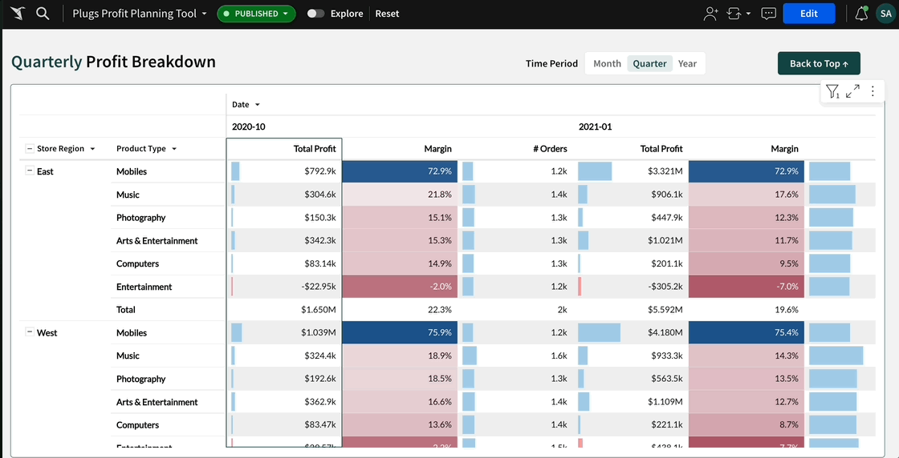
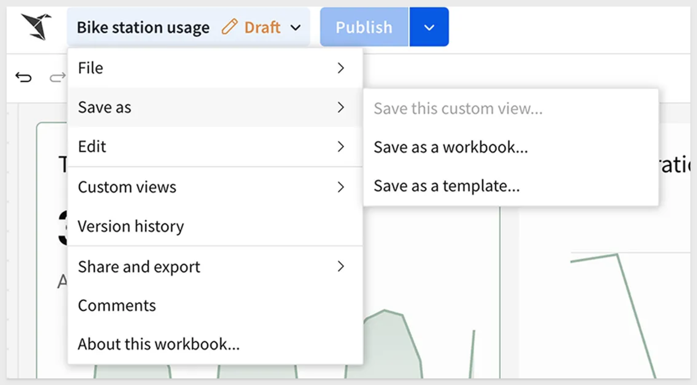
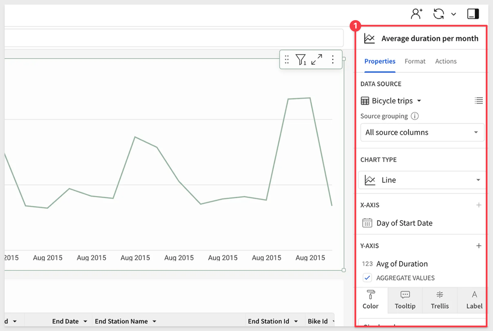
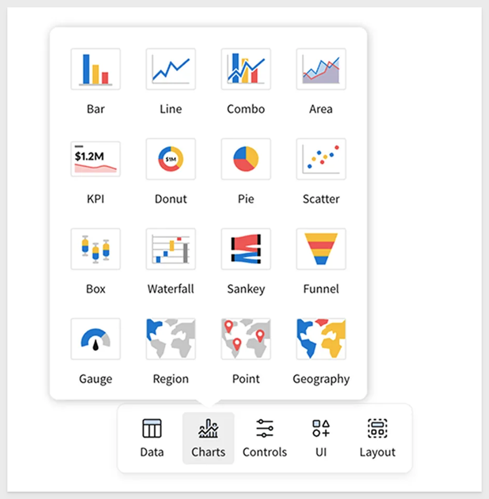

author: pballai
id: 02_2025_first_friday_features
summary: 02_2025_first_friday_features
categories: firstfridayfeatures
environments: web
status: Published
feedback link: https://github.com/sigmacomputing/sigmaquickstarts/issues
tags: first_friday_features
lastUpdated: 2024-03-1

# (02-2025) February

<!--
7 Feb changes: done
14 changes: done
21 changes: done
28 changes: 

Publish on 7 March
-->

## Overview 
Duration: 5 

This QuickStart lists all the new and public beta features released, as well as bugs fixed in February 2025.

It is summary in nature, and you should refer to the specific Sigma documentation links provided for more information.

**Public beta features will carry the section text "Beta".**

All other features are considered released (**GA** or generally available).

Sigma actually has feature and bug fix releases weekly, and high-priority bug fixes on demand. We felt it was best to keep these QuickStarts to a summary of the previous month for your convenience.

New first Friday features QuickStarts will be published on the first Friday of each month, and will include information for the previous month.

<aside class="positive">
<strong>IMPORTANT:</strong><br> Some screens in Sigma may appear slightly different from those shown in QuickStarts. This is because Sigma is continuously adding and enhancing functionality. Rest assured, Sigma’s intuitive interface ensures that any differences will not prevent you from successfully completing any QuickStart.
</aside>

For more information on Sigma's product release strategy, see [Sigma product releases.](https://help.sigmacomputing.com/docs/sigma-product-releases)

[If something is not working as you expect, here is how to contact Sigma support.](https://help.sigmacomputing.com/docs/sigma-support)


<!-- END OF SECTION-->

## Administration
Duration: 20

### Audit logs now available in us-east-1 region
Organizations hosted in AWS us-east-1 are now able to access the Sigma Audit Logs connection, which records data related to user-initiated events that occur within your Sigma organization. The connection is disabled by default, but an Admin user can enable it in the Administration portal.

For more information, see [Enable audit logging](https://help.sigmacomputing.com/docs/enable-audit-logging)

There is also a [QuickStart on Audit Logging.](https://quickstarts.sigmacomputing.com/guide/administration_audit_logging/index.html?index=..%2F..index#0)

### License tier updates
Sigma's license model now includes four tiers: View, Act, Analyze, and Build. **This structure applies to all organizations created on or after March 4, 2025.**

<li><strong>The Four Tiers:</strong>
    <ol type="n"> 
      <li><strong>View:</strong> Suitable for report consumers who need access to prepared data and insights with baseline interactions</li>
      <li><strong>Act:</strong> Ideal for collaborative data contributors who actively input and update data.</li>
      <li><strong>Analyze:</strong> Optimized for decision-making data consumers who require more deep-dive capabilities without building workbooks themselves.</li>
      <li><strong>Build:</strong> Designed for data architects, BI analysts, and report builders who model, transform, and analyze data.</li>
    </ol>
  </li>

 <aside class="negative">
<strong>NOTE:</strong><br> The Build license also supports system administrators who can manage organization settings and users.
</aside>

Organizations created prior to this date will continue using Lite, Essential, and Pro license tiers and will be scheduled for a license migration at a later date.

For more information about the new licenses, see [Account type and license overview.](https://help.sigmacomputing.com/docs/account-type-and-license-overview)

### Use different OAuth configurations for authenticating users to your connections than you use for your Sigma organization (Beta)
Sigma now supports authenticating a connection with OAuth without re-using OAuth credentials used for authenticating users to your Sigma organization. 

As a result:

- You no longer need to use OAuth as your authentication method for your Sigma organization in order to authenticate a connection with OAuth.
- If you use multiple IdPs and data platforms, you can create connections with different OAuth configurations as needed.
- When authenticating Snowflake connections with OAuth, you can configure Proof Key for Code Exchange (PKCE) and/or JSON Web Tokens (JWTs) to secure your connection.

For instructions on how to configure a unique OAuth connection for a Databricks or Snowflake connection, see:

[Connect to Databricks](https://help.sigmacomputing.com/docs/connect-to-databricks#configure-oauth-features)<br>

[Connect to Snowflake](https://help.sigmacomputing.com/docs/connect-to-snowflake#connect-to-snowflake-with-oauth)

For more general information about OAuth, see [Configure OAuth.](https://help.sigmacomputing.com/docs/configure-oauth#use-different-oauth-configurations-for-authenticating-users-to-your-connections-than-you-use-for-your-sigma-organization-beta)


<!-- END OF SECTION-->

## Actions
Duration: 20

### Modal element (GA) 
Modals help simplify workbook design and allow you to build a streamlined, app-like experience. 

An open modal overlays and obscures a workbook page to provide a focused view of the modal content. This reduces visual clutter and allows you to present form fields, provide customized drill-downs, display controls and filters in a dedicated container, etc.

To incorporate a modal into a workbook, you must configure an `Open modal` action. 

For more information, see [Add a modal to a workbook](https://help.sigmacomputing.com/docs/add-a-modal-to-a-workbook) and [Open or close a modal.](https://help.sigmacomputing.com/docs/create-actions-that-navigate-to-destinations#open-or-close-a-modal)

### Updated application of the "On close" action trigger for modals
The `On close` trigger type for modals has been updated to only initiate actions when a user clicks the `Close icon` or anywhere outside the modal. 

The trigger no longer applies when the `Close modal` action is configured for the primary or secondary button.

If you configured actions for the `On close` trigger that are intended to initiate when a user clicks a button to trigger a `Close modal` action, you can move the actions to the applicable button trigger.


<!-- END OF SECTION-->

## API
Duration: 20

### Expanded options for the Add workbook schedule endpoint
The `Add workbook schedule` endpoint [POST /v2/workbooks/{workbookId}/schedules](https://help.sigmacomputing.com/reference/postworkbookschedule) now supports options that were previously available only from the UI, such as creating a conditional export, repeating pivot header labels, compressing attachments to a zip file, and specifying control values for the export.

### Swap link sources for datasets
The `Swap workbook data sources` endpoint, [POST /v2/workbooks/{workbookId}/swapSources](https://help.sigmacomputing.com/reference/sourceswapworkbook) now includes the option to swap dataset links. 

When using the `sourceMapping` option, the `columnMapping` option supports specifying a link name and linked column name to swap from one dataset link to another dataset link.

For example, to change the source for a workbook from one dataset link to another, set the `fromId` and `toId` to the same dataset ID, but update the `fromColumn` to the name of the previous dataset link and linked column name and the toColumn to the desired dataset link and linked column:
```json
{
    "sourceMapping": [
        {
            "fromId": "bfa59799-69c7-423d-b965-7319cbfc2ebb",
            "toId": "bfa59799-69c7-423d-b965-7319cbfc2ebb",
            "columnMapping": [
                {
                    "fromColumn": ["Link name", "Missing column name"],
                    "toColumn": ["Link name", "New column name"]
                }
            ]
        }
    ]
}
```


<!-- END OF SECTION-->

## Bug Fixes
Duration: 20

**1:** The `Create connection` endpoint [POST /v2/connections](https://help.sigmacomputing.com/reference/createconnection) and `Update connection` endpoint [PUT /v2/connections/{connectionId}](https://help.sigmacomputing.com/reference/updateconnection) no longer fail when creating or updating connections with OAuth. 

<aside class="negative">
<strong>NOTE:</strong><br> Note that for non-OAuth connections, the API validates that you can connect to the newly created or updated connection with your credentials. In the case of an OAuth connection, this validation step does not apply. Instead, manually validate that you can connect with your OAuth credentials after you create or update the connection.
</aside>

**2:** When the value of a grouping key is null, applying the `Selection variable` to an `Open link` action no longer returns a null value that opens a blank page.


<!-- END OF SECTION-->

## Charts
Duration: 20

### Customize chart and formatting color scales (GA)
Create custom color scales to use when formatting chart colors or conditional formatting for tables. Create a custom color scale for an organization theme, workbook theme, or for a specific data element.

For more information, see [Add a custom color scale.](https://help.sigmacomputing.com/docs/add-a-custom-color-scale)


<!-- END OF SECTION-->

## Embedding
Duration: 20

### New outbound events in embeds
Use two new outbound events, `workbook:bookmark:ondelete` and `workbook:bookmark:onupdate`, to communicate and interact between embedded content and the host application.

The event, `workbook:bookmark:ondelete` occurs when an embed user deletes a bookmark using the embed UI.

The event, `workbook:bookmark:onupdate` occurs when an embed user updates a bookmark using the embed UI by either changing the bookmark name, setting or removing it as the default view, sharing the bookmark, or unsharing the bookmark by setting it as a personal view.

For more information, see [Implement inbound and outbound events in embeds.](https://help.sigmacomputing.com/docs/inbound-and-outbound-events-in-embeds)


<!-- END OF SECTION-->

## New QuickStarts in February
Duration: 20

### AI App QuickStarts are Here! 

In fact, there are **ten** to choose from right now!

[AI App Fundamentals](https://quickstarts.sigmacomputing.com/guide/dataaps_fundamentals/index.html?index=..%2F..index#0)

[Adjustment Change Log](https://quickstarts.sigmacomputing.com/guide/dataapps_adjustments_change_log/index.html?index=..%2F..index#0)

[Approvals](https://quickstarts.sigmacomputing.com/guide/dataapps_approvals_flow/index.html?index=..%2F..index#0)

[Discounted Cash Flow](https://quickstarts.sigmacomputing.com/guide/dataapps_finance_discounted_cash_flow/index.html?index=..%2F..index#0)

[Forms Quick Capture and Analysis with Sigma](https://quickstarts.sigmacomputing.com/guide/dataapps_create_a_form_simple/index.html?index=..%2F..index#0)

[Integrate 3rd Party REST API via Stored Procedure](https://quickstarts.sigmacomputing.com/guide/dataapps_calling_external_api_procedure/index.html?index=..%2F..index#0)

[Native Sigma Snapshot Workflow](https://quickstarts.sigmacomputing.com/guide/dataapps_native_sigma_snapshot_workflow/index.html?index=..%2F..index#0)

[Pivot Spreading](https://quickstarts.sigmacomputing.com/guide/dataapps_pivot_spreading/index.html?index=..%2F..index#0)

[Reconciliation](https://quickstarts.sigmacomputing.com/guide/dataapps_reconciliation/index.html?index=..%2F..index#0)

[Snapshotting with Stored Procedures](https://quickstarts.sigmacomputing.com/guide/dataapps_snapshotting_with_sp/index.html?index=..%2F..index#0)


<!-- END OF SECTION-->

## Workbooks
Duration: 20

### Freeze columns in pivot tables
Pivot tables now support the ability to `freeze` or `unfreeze` the position of column:



For more information, see [Format column location in a table.](https://help.sigmacomputing.com/docs/format-and-customize-a-table#format-column-location-in-a-table)

### Redesigned user interface 
The workbook and data model UI has been redesigned to simplify the creation experience in Sigma. The redesign includes the following changes:

- **Streamlined workbook header:** We’ve combined essential actions—such as saving, commenting, and sharing—into one spot. No more clicking around to find what you need.



- **New ways to create and edit elements:**
        - An Add new element bar where you can add elements at any time.
        - A simplified editor panel with tabs to access element properties, format, and actions.
        - For an overview of the new workbook UI, see Navigating a workbook (link).

- **Simpler custom views:** Previously known as `Explore`, these views are now easier to create and customize. You can save them, share them, or discard changes and return to the original Workbook anytime.


- **Refined editor panel:** Properties, formatting options, and actions are now neatly organized into tabs, so you can make quick adjustments without feeling lost.



- **A new floating element bar:** Insert charts, tables, and other elements on the fly. It’s all about making sure inspiration doesn’t have to wait.



Sigma’s redesign sharpens the experience without sacrificing power. A cleaner UI, smarter workflows, and a more intuitive flow mean you can move faster, focus on what matters, and get to insights without distractions. Whether you’re deep into analysis or just getting started, Sigma stays flexible and responsive to your needs. This is just the start—we’ll keep pushing forward to make data exploration even more seamless, powerful, and accessible. 

The new UI has been rolled out for all **new** Sigma organizations, and will continue to be enabled in a multi-stage rollout for all existing organizations.

To learn more about the design ethos behind this change, see [Making Sigma Click: Introducing Our Refreshed Interface.](https://www.sigmacomputing.com/blog/making-sigma-click-introducing-our-refreshed-interface?_gl=1*616xf3*_gcl_au*MTAxNTE2MDYxOC4xNzMzNzY1NDI3*_ga*MjYwNTkzMzY0LjE2NzA0NDY3NTc.*_ga_PMMQG4DCHC*MTc0MTM2MTExMi4xMDYuMS4xNzQxMzYxMTY0LjguMC4w)

### Schedule exports as an email burst (GA) 
You can send a custom-filtered report to a dynamic list of recipients as a scheduled email burst. 

Send a workbook, workbook pages, and individual workbook elements as supported attachment types, such as PDF, Excel, or PNG files.

For more information, see [Export as email burst.](https://help.sigmacomputing.com/docs/export-as-email-burst)

There is also [QuickStart on email bursting.](https://quickstarts.sigmacomputing.com/guide/administration_export_bursting/index.html?index=..%2F..index#0)

### Set conditional exports to alert a specific number of times (Beta)
Limit the number of conditional exports by setting the frequency of an export to send only a given number of times per day, per week, or all time.

For example, a conditional export that sends an email when there is data in a table can be set to alert once per day.


<!-- END OF SECTION-->

## Additional Information
Duration: 20

**Additional Resource Links**

[Blog](https://www.sigmacomputing.com/blog/)<br>
[Community](https://community.sigmacomputing.com/)<br>
[Help Center](https://help.sigmacomputing.com/hc/en-us)<br>
[QuickStarts](https://quickstarts.sigmacomputing.com/)<br>
<br>

[](https://twitter.com/sigmacomputing)&emsp;
[](https://www.linkedin.com/company/sigmacomputing)&emsp;
[](https://www.facebook.com/sigmacomputing)


<!-- END OF SECTION-->
