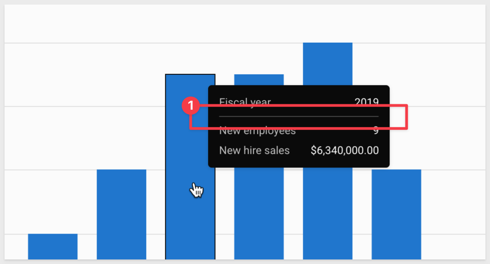
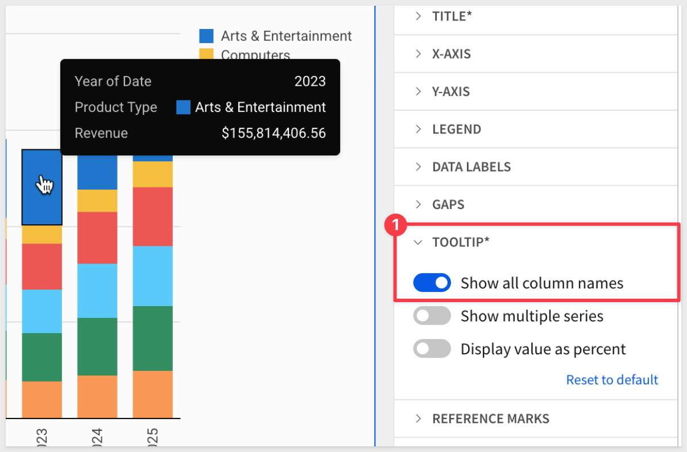
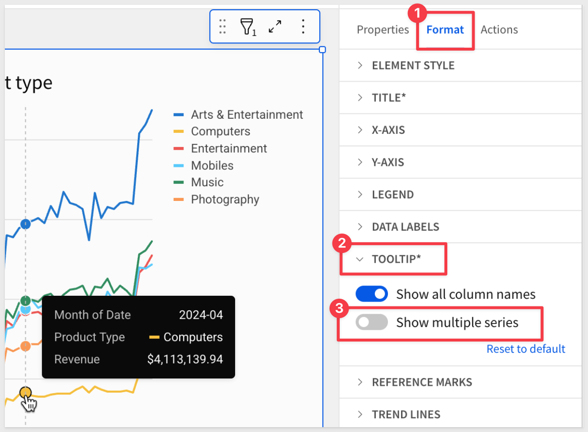

author: pballai
id: 02_2026_first_friday_features
summary: 02_2026_first_friday_features
categories: firstfridayfeatures
environments: web
status: Published
feedback link: https://github.com/sigmacomputing/sigmaquickstarts/issues
tags: first_friday_features
lastUpdated: 2026-02-27

# (02-2026) February

## Overview 
Duration: 5 

This QuickStart lists all the new and public beta features released, as well as bugs fixed in February 2026.

It is summary in nature, and you should refer to the specific Sigma documentation links provided for more information.

**Public beta features will carry the section text "Beta".**

All other features are considered released (**GA** or generally available).

Sigma actually has feature and bug fix releases weekly, and high-priority bug fixes on demand. We felt it was best to keep these QuickStarts to a summary of the previous month for your convenience.

New first Friday features QuickStarts will be published on the first Friday of each month, and will include information for the previous month.

### Subscribe to What's New in Sigma
For those wanting to see what Sigma is doing on each week, release notes are now also available on the [Sigma Community site](https://community.sigmacomputing.com/). There, you can **opt in to receive notifications about future release notes** in order to stay on top of everything new happening at Sigma. You can also subscribe to automated updates in any Slack channel using the Sigma Community release notes RSS feed. 

For more information on how to subscribe to release note notifications, see [About the release notes](https://community.sigmacomputing.com/t/about-the-release-notes-category/5517) 

<aside class="positive">
<strong>IMPORTANT:</strong>  Some screens in Sigma may appear slightly different from those shown in QuickStarts. This is because Sigma continuously adds and enhances functionality. Rest assured, Sigma’s intuitive interface ensures that any differences will not prevent you from successfully completing any QuickStart.
</aside>

For more information on Sigma's product release strategy, see [Sigma product releases](https://help.sigmacomputing.com/docs/sigma-product-releases)

If something is not working as you expect, here's how to [contact Sigma support](https://help.sigmacomputing.com/docs/sigma-support)

<!-- END OF SECTION-->

## Administration
Duration: 20

### Audit logs for Sigma Tenants (Beta) 
You can now enable audit logs for tenant organizations. When audit logs are enabled for tenant organizations:

- Admin users in each tenant organization can review their own audit logs
- Admin users in the parent organization can review audit logs for the parent organization and each tenant organization with audit logging enabled

This enables granular security monitoring and compliance tracking across multi-tenant deployments, giving each tenant visibility into their own activity while maintaining parent organization oversight.

<aside class="negative">
<strong>NOTE:</strong>  Audit logging is not automatically enabled on tenant organizations, even if the parent organization has audit logging enabled. To enable audit logging in a tenant organization, follow the instructions to open a tenant organization as an admin from the parent organization, then enable audit logging.
</aside>

For more information, see [Enable audit logs](https://help.sigmacomputing.com/docs/enable-audit-logs)

### Configure a BigQuery connection to use OAuth (Beta)
You can now authenticate to BigQuery from Sigma using connection-level OAuth.

This provides enhanced security and streamlined access management for BigQuery connections.

For more information, see [Connect to BigQuery with OAuth (Beta)](https://help.sigmacomputing.com/docs/connect-to-bigquery-with-oauth)

### CSV upload using customer-owned cloud storage (Beta) 
CSV upload can now use a customer-owned cloud storage data flow instead of the default data flow through Sigma's infrastructure.

When customer-owned cloud storage is enabled, raw and processed CSV files are staged in a customer-owned bucket (instead of a Sigma-owned bucket) before loading to the data platform. Your company controls the bucket region, access, TTL, etc., helping your organization meet security and compliance requirements.

For more information, see [Configure CSV upload and storage options](https://help.sigmacomputing.com/docs/configure-csv-upload-and-storage-options) and [Configure storage integration using customer-owned bucket](https://help.sigmacomputing.com/docs/configure-storage-integration-using-customer-owned-bucket)

### Customer managed keys supported for Google Cloud Platform 
Sigma now supports the use of customer-managed keys for all GCP regions, allowing you to use your own key management services to encrypt the secrets and data that Sigma uses.

This provides greater control over encryption and helps meet compliance requirements.

For more information, see [Set up customer-managed keys](https://help.sigmacomputing.com/docs/set-up-customer-managed-keys)

### Improved cloud storage exports (Beta) 
When exporting to cloud storage, you can now generate files directly in Sigma, instead of in your data warehouse. This allows for more supported file types and data platforms, and more reliable export formatting.

This reduces dependency on data warehouse resources, improves export performance, and expands flexibility for cross-platform data sharing.

For more information, see [Export to cloud storage](https://help.sigmacomputing.com/docs/export-to-cloud-storage)

### Override the Snowflake warehouse for a workbook
Administrators can now select a different virtual warehouse in Snowflake to execute queries for specific workbooks.

This enables optimization for complex queries that benefit from larger warehouse resources, providing greater control over query performance and resource allocation.

For more information, see the [Override the Snowflake warehouse used by a workbook](https://help.sigmacomputing.com/docs/override-snowflake-warehouse-workbook)

### Select Snowflake role for a connection (Beta)
If you have access to a Snowflake connection authenticated with OAuth, you can select which Snowflake role to use when performing tasks in Sigma.

This provides fine-grained access control and enables users to work with different permission sets without switching connections, improving security and workflow flexibility.

For more information, see [Choose your Snowflake role for an OAuth connection](https://help.sigmacomputing.com/docs/choose-snowflake-role)

### Usage dashboard for Sigma Tenants (Beta) 
View usage details for Sigma Tenants on the Tenants tab of the usage dashboard.

You can now review the following details:

- **Organization type**: Whether the organization is the parent or a tenant
- **Organization name and slug**
- **Total queries** performed over the last 90 days
- **User activity** over the last 90 days, such as total users and total active users
- **Document activity** over the last 90 days, such as number created and number queried
- **Embed activity** over the last 90 days, such as number of embedded documents and number of embed sessions
- **Export and materialization activity**, such as total exports and total materializations
- **Types of connections** in each organization

This centralized visibility enables parent organizations to monitor tenant adoption, optimize resource allocation, and identify usage patterns across their entire tenant ecosystem.

<aside class="negative">
<strong>NOTE:</strong>  Only users with access to view usage dashboards in a parent organization can view the Tenants usage dashboard.
</aside>

For more information, see [View usage dashboards](https://help.sigmacomputing.com/docs/view-usage-dashboards)

<!-- END OF SECTION-->

## Bug Fixes
Duration: 20

**1:** With the latest Chrome update to version 144, embedded content with the `:responsive_height` query string parameter in the embed URL could not be scrolled in an iframe. This issue has been resolved.

**2:** When you migrate a dataset to a data model from the `Administration` > `Dataset` migration page, related datasets now correctly show that they have been migrated as well.

**3:** You no longer need to wait for a dataset migration to complete before starting another migration from the `Administration` > `Dataset` migration page.

**4:** Custom SQL, pivot table, and summary row errors now properly trigger the `workbook:chart:error` JavaScript event.

**5:** Errors that occurred on custom SQL elements, pivot table elements, and summary rows in table elements did not produce the workbook:chart:error outbound JavaScript event.

<!-- END OF SECTION-->

## Charts
Duration: 20

### Improved chart tooltips layout
The layout of chart tooltips has been improved. Additionally, a new divider line has been added to certain tooltip configurations to make tooltip values easier to read.

These visual improvements enhance readability and user experience when exploring chart data.

### New chart tooltip formatting options
New formatting options are available for chart tooltips:

**Show all column names**: You can now choose to hide column names in a tooltip. If Sigma detects that hiding a column name reduces a user's ability to discern between tooltip values, the column name is not hidden in the tooltip.

**Show multiple series**: For bar, line, and area charts, you can now choose to show a single series or multiple series in the chart tooltip.

These customization options allow you to create cleaner, more focused tooltips that surface the most relevant information without overwhelming users with unnecessary details.

For more information, see [Chart element overview](https://help.sigmacomputing.com/docs/chart-element-overview)

<!-- END OF SECTION-->

## AI Apps
Duration: 20

### API Actions (Beta) 
Create actions that invoke API endpoints within Sigma workbooks to activate workflows and interact with external systems.

This feature enables workbooks to call REST APIs directly, bringing live external data into Sigma or triggering actions in third-party systems without ETL or middleware. Key capabilities include:

- **Diverse authentication methods**: Basic auth, Bearer tokens, OAuth 2.0 (client credentials, authorization code, password credentials)
- **Dynamic parameters**: Path, query, and body parameters can reference workbook controls, table values, or formulas
- **API credential management**: Securely store and reuse credentials across multiple connectors
- **API connector configuration**: Define reusable API endpoints with typed variables in request bodies
- **OpenAPI specification support**: Import API definitions to automatically generate connectors

This unlocks operational analytics use cases where data doesn't just inform decisions—it executes them. Examples include updating CRM records, triggering workflow automation, posting to collaboration tools, or querying live SaaS data without data replication.

Check out the **"New QuickStarts in February"** down below for three new QuickStarts covering this topic.

For more information, see [Create actions that call APIs (Beta)](https://help.sigmacomputing.com/docs/create-actions-that-call-apis)

### CC and BCC support for email notification actions
Users can now add CC and BCC recipient lists when configuring email notification actions in workbooks, expanding email distribution capabilities.

This enhancement provides greater flexibility for managing email notifications and ensuring the right stakeholders receive important updates.

For more information, see the [Create actions that send notifications and export data](https://help.sigmacomputing.com/docs/create-actions-that-send-notifications-and-export-data#send-notifications-or-export-data-to-email)

### Forms (Beta) 
Use the form element to create a clear interface for user data entry. Create a form manually, or based on an existing input table or stored procedure.

Forms can submit data to multiple data sources at the same time, and trigger action workflows at the time of submission, allowing you to centrally manage user input in AI apps.

This new element provides a structured, user-friendly way to collect and process user input with integrated workflow capabilities.

There is a QuickStart, [Forms: Quick Capture and Analysis with Sigma](https://quickstarts.sigmacomputing.com/guide/dataapps_create_a_form_simple/index.html?index=..%2F..index#0)

For more information, see [Use forms to streamline user data entry](https://help.sigmacomputing.com/docs/use-forms-to-streamline-user-data-entry)

### Update row(s) and Delete row(s) actions (GA) 
The Update row(s) and Delete row(s) actions are now generally available.

- Update row(s) action: Update the value of one or more rows in an input table or linked input table based on specified criteria.
- Delete row(s) action: Delete one or more rows in an input table based on specified criteria.

These actions enable users to build fully interactive data management applications within Sigma, allowing end users to modify and maintain data directly from workbooks without requiring technical expertise.

For more information, see [Create actions that modify input table data](https://help.sigmacomputing.com/changelog/create-actions-that-modify-input-table-data)

<!-- END OF SECTION-->

## API
Duration: 20

### API support for creating and managing reports 
Extended API endpoints now support report operations, including file management, member file access, and favorites management across GET, POST, PATCH, and DELETE operations.

This enhancement provides programmatic access to reports, enabling automation and integration of report management workflows.

The following endpoints now support reports:

**File endpoints:** 
[List files](https://help.sigmacomputing.com/reference/fileslist) (GET /v2/files) 
[Create a file](https://help.sigmacomputing.com/reference/filescreate) (POST /v2/files) 
[Get file information](https://help.sigmacomputing.com/reference/filesget) (GET /v2/files/{inodeId}) 
[Update a file](https://help.sigmacomputing.com/reference/filesupdate) (PATCH /v2/files/{inodeId}) 
[Delete a file](https://help.sigmacomputing.com/reference/filesdelete) (DELETE /v2/files/{inodeId}) 

**Member endpoints:** 
[List member files](https://help.sigmacomputing.com/reference/listaccessibleinodes) (GET /v2/members/{memberId}/files) 
[List recent files for a member](https://help.sigmacomputing.com/reference/listrecentinodes) (GET /v2/members/{memberId}/files/recents) 
[List all favorite documents of a member](https://help.sigmacomputing.com/reference/listfavoriteinodes) (GET /v2/members/{memberId}/files/favorites) 

**Favorites endpoints:** 
[Get favorite documents for a user](https://help.sigmacomputing.com/reference/listfavorites) (GET /v2/favorites/member/{memberId}) 
[Favorite a document](https://help.sigmacomputing.com/reference/addfavorite) (POST /v2/favorites) 
[Unfavorite a document](https://help.sigmacomputing.com/reference/removefavorite) (DELETE /v2/favorites/member/{memberId}/file/{inodeId}) 

For more information, see the [Sigma API Reference](https://help.sigmacomputing.com/reference)

### Export rate limit increase 
The workbook export API endpoint now supports 400 requests per minute, quadrupling the previous limit of 100 requests per minute.

This significant increase enables higher-volume export automation and better supports organizations with extensive scheduled export workflows or high-frequency export requirements.

The updated endpoint: [POST /v2/workbooks/{workbookId}/export](https://help.sigmacomputing.com/reference/exportworkbook)

### New API endpoints to manage account types
The following API endpoints to manage account types are now available:

- Create an account type: [POST /v2/accountTypes](https://help.sigmacomputing.com/reference/createaccounttype)
- Delete an account type: [DELETE /v2/accountTypes/{accountTypeId}](https://help.sigmacomputing.com/reference/deleteaccounttype)

This enables programmatic management of account types, supporting automated provisioning and governance workflows at scale.

### New endpoint to delete a user attribute
- Delete a user attribute [DELETE /v2/user-attributes/{userAttributeId}](https://help.sigmacomputing.com/reference/deleteuserattribute)

This API simplifies user attribute lifecycle management, enabling automated cleanup and maintenance of user attributes as organizational needs evolve.

### New API endpoint to remove a tenant from a deployment policy (Beta)
- Remove a tenant from a deployment policy: [DELETE /v2/deploymentPolicies/{deploymentPolicyId}/tenants/{tenantOrganizationId}](https://help.sigmacomputing.com/reference/removetenantfromdeployment)

This API enables dynamic management of tenant deployments, allowing organizations to automate the removal of tenants from deployment policies as part of offboarding or reconfiguration processes.

<!-- END OF SECTION-->

## Data Modeling
Duration: 20

### Migrate a dataset to a data model (GA)
You can now create a data model from a dataset and its links by choosing to migrate a dataset. Optionally choose to update documents that reference the dataset automatically.

When you migrate a dataset, the dataset is unchanged and the contents of the dataset are recreated in the data model. You can also track the status of all datasets in your organization.

This feature is now generally available, making it easier to transition from datasets to the more powerful data modeling framework.

For more information, see [Migrate a dataset to a data model](https://help.sigmacomputing.com/docs/migrate-a-dataset-to-a-data-model)

### Validate metrics and relationships in a data model (Beta)
Changes made to metrics and relationships in a data model can affect users that use those metrics and related columns in their documents. If you make changes such as changing columns, deleting metrics, deleting relationships, or swapping sources, you can validate content in the data model to prevent breaking documents that use those metrics and related columns.

This helps ensure data integrity and prevents downstream impact when making changes to data models.

For more information, see [Validate content in a data model (Beta)](https://help.sigmacomputing.com/docs/validate-content-in-a-data-model)

<!-- END OF SECTION-->

## Embedding
Duration: 20

### Embed content from tenant organizations (Beta)
Organizations using Sigma Tenants can now embed content from tenant organizations without setting up separate embed credentials for each tenant.

This simplifies the embedding process for multi-tenant environments and reduces administrative overhead.

For more information, see the [Embed content from a tenant organization](https://help.sigmacomputing.com/docs/embed-content-from-a-tenant-organization)

### New Inbound JavaScript event - document:navigateto
A new JavaScript event enables navigation between data models, reports, or workbooks within embedded contexts.

This provides embedded applications with programmatic control over navigation, enhancing the user experience in custom integrations.

For more information, see the [Inbound event reference](https://help.sigmacomputing.com/docs/inbound-event-reference#documentnavigateto)

### Embed URL parameter integration with plugin development API
The Sigma plugin development API now features new methods related to working with embed URL parameters in plugins.

**If you are using the plugin development API with React Hooks:**

- `useUrlParameter()`: Returns a given URL parameter's value as well as a setter method to update the returned URL parameter

**If you are using the plugin development API without React Hooks:**

- `getUrlParameter()`: Returns the current value of an embed URL parameter
- `setUrlParameter()`: Set an embed URL parameter
- `subscribeToUrlParameter()`: Subscribe to changes made to the embed URL parameters

This enhancement provides greater flexibility for plugin developers to interact with embed parameters programmatically.

For more information, see [Plugin development API](https://help.sigmacomputing.com/docs/plugin-development-api)

### Save As modal support for embedded workbooks
The `workbook:modal:toggle` inbound JavaScript event now accepts a `save-as` modalType parameter, enabling embedded workbooks to programmatically open the "Save As" dialog.

This allows parent applications to trigger the Save As functionality, enabling users to create copies of embedded workbooks without requiring custom UI elements.

For more information, see [Inbound event reference](https://help.sigmacomputing.com/docs/inbound-event-reference#workbookmodaltoggle)

### Report download event 
A new `report:download` inbound JavaScript event enables programmatic downloading of reports from embedded contexts.

This provides embedded applications with the ability to trigger report downloads on demand, improving integration capabilities for custom workflows.

For more information, see [Inbound event reference](https://help.sigmacomputing.com/docs/inbound-event-reference)

<!-- END OF SECTION-->

## Functions and Calculations
Duration: 20

### RegexpCount function
New function counts occurrences of regular expression patterns within strings, expanding text processing capabilities.

This function enables advanced text analysis and pattern matching directly within Sigma calculations, eliminating the need for external data processing tools when working with complex string patterns.

For more information, see the [RegexpCount](https://help.sigmacomputing.com/docs/regexpcount)

### Unix timestamp conversion functions
Two new functions enable conversion of Unix epoch timestamps to date values:

- **DateFromUnixMs**: Converts milliseconds since the Unix epoch (January 1, 1970) into a date value
- **DateFromUnixUs**: Converts microseconds since the Unix epoch (January 1, 1970) into a date value

These functions simplify working with timestamp data from APIs, IoT devices, and systems that use Unix epoch time, eliminating the need for complex date arithmetic or warehouse-specific conversion logic.

For more information, see [DateFromUnixMs](https://help.sigmacomputing.com/docs/datefromunixms) and [DateFromUnixUs](https://help.sigmacomputing.com/docs/datefromunixus)

<!-- END OF SECTION-->

## Resources
Duration: 20

### Sigma Fundamentals on DataCamp
Sigma has partnered with DataCamp to provide interactive learning tracks with videos, exercises, and quizzes covering introductory through advanced Sigma topics.

This comprehensive training resource helps users build their Sigma skills through hands-on practice.

For more information, see the [Datacamp Sigma Fundamentals](https://app.datacamp.com/learn/skill-tracks/sigma-fundamentals)

### AI chatbot support 
Outside business hours, users can now access an AI chatbot trained on Sigma documentation, community posts, and quickstarts through the Help menu.

This provides 24/7 support access to help users find answers when they need them.

The Chatbot, powered by Intercom's FinAI Agent, is available from the `Help menu` > `Live chat` > `Try AI before Human Support`.

For more information, see the [Sigma support](https://help.sigmacomputing.com/docs/sigma-support)

<!-- END OF SECTION-->

## New QuickStarts in February
Duration: 20

[Building AI Apps with Multi-Modal File Uploads](https://quickstarts.sigmacomputing.com/?cat=aiapps)

Learn how to build an AI-powered file analysis application that processes images, documents, and audio/video files using Snowflake Cortex AI and Sigma's file upload features.

### API Actions has arrived!
To get you up-to-speed learning this new feature, here are three QuickStarts:

#### [API Actions – Getting Started](https://quickstarts.sigmacomputing.com/guide/aiapps_api_actions_getting_started/index.html?index=..%2F..index#0)

This QuickStart introduces Sigma API Actions, showing how to connect Sigma workbooks directly to external REST APIs — starting with the free, no-auth Open-Meteo Weather API.

- Configure API connectors with static and dynamic parameters 
- Bind dropdowns to drive live API inputs 
- Parse JSON responses for KPI and visualization use 
- Learn how Actions can bring external data into Sigma in real time 

**WHY IT MATTERS:**
This is Sigma's first API Actions walkthrough, designed to help internal teams and early testers learn the fundamentals. It shows how developers and data teams can call live APIs directly from a Sigma workbook—no middleware or code hosting required—unlocking dynamic, real-time data app use cases.

#### [Integrate Salesforce using API Actions](https://quickstarts.sigmacomputing.com/guide/aiapps_api_actions_salesforce/index.html?index=..%2F..index#7)

Use Sigma API Actions to connect to Salesforce’s REST API using an authenticated, enterprise-style pattern (OAuth + dynamic parameters), then surface live Salesforce data directly inside a Sigma workbook.

- Create and authorize a Salesforce Connected App (OAuth 2.0) and store credentials securely in Sigma 
- Build API connectors for SOQL-based queries (Accounts + Opportunities) with dynamic query parameters driven by workbook controls 
- Parse raw JSON API responses into a Sigma table using a Python element running on Snowflake 

An `API PATCH` is demonstrated to update `Opportunity Stage` in Salesforce and refresh the data automatically.

**WHY IT MATTERS:**
This is the “no ETL, no data load” integration pattern—query Salesforce live, interact with the results in Sigma, and optionally write changes back to the system of record. It’s a realistic blueprint for operational analytics and lightweight workflows where freshness matters.

#### [Integrate JIRA using API Actions](https://quickstarts.sigmacomputing.com/guide/developers_api_actions_jira/index.html?index=..%2F..index#0)

This QuickStart demonstrates integrating JIRA's REST API with Sigma using Basic Authentication and API Actions, building a complete bidirectional integration.

- Create JIRA API tokens and configure Basic Auth credentials in Sigma
- Build API connectors for JQL-based queries with dynamic parameters
- Parse nested JSON responses using Python elements on the data warehouse
- Implement status filtering with dynamic JQL queries
- Create an interactive modal workflow to update JIRA issue statuses
- Discover and use JIRA's transitions API for workflow-aware status updates

The integration pattern includes both read (query issues) and write (update status) operations, with automatic data refresh after updates.

**WHY IT MATTERS:**
This demonstrates the full potential of API Actions for operational workflows—not just reading data from external systems, but writing changes back and maintaining bidirectional sync. The pattern works for any REST API using Basic Authentication (ServiceNow, Zendesk, GitHub, etc.), showing how business users can interact with SaaS platforms directly from Sigma without ETL pipelines or custom middleware.

<!-- END OF SECTION-->

## Workbooks
Duration: 20

### Ad hoc calculations in pivot tables (GA)
Create one-off calculated rows in pivot tables without modifying the underlying dataset.

This feature is now generally available, allowing users to add calculations specific to a single pivot table analysis without affecting the source data or other workbook elements.

For more information, see [Ad hoc calculations](https://help.sigmacomputing.com/docs/ad-hoc-calculations)

### Advanced text settings 
New text settings, such as underline, strikethrough, superscript and subscript, are now available in both workbooks and reports.

These formatting options provide greater control over document styling and enable clearer communication of important information, annotations, and mathematical or scientific notations.

For more information, see [Text elements](https://help.sigmacomputing.com/docs/text-elements)

### Customize "No data" and "Invalid date" messages in KPI charts
For KPI charts that display "No data" or "Invalid date," you can now customize the message that is displayed.

This enables more user-friendly messaging that provides context-specific guidance or explanations when data is unavailable, improving the end-user experience in dashboards and reports.

For more information, see [Build a KPI chart](https://help.sigmacomputing.com/docs/build-a-kpi-chart#customize-empty-state-text-when-kpi-has-no-data)

### Customize map category legend colors
You can now customize color assignments for map category legends, providing greater control over map visualizations.

This enables more meaningful color coding based on business context and improves readability of geographic data visualizations.

For more information, see [Map element overview](https://help.sigmacomputing.com/docs/map-element-overview)

### Find in table feature (Beta) 
New "Find in table" capability allows users to search visible columns and navigate highlighted matches in tables and input tables.

This feature enhances data discovery and makes it easier to locate specific values within large tables.

For more information, see the [Find a specific value in a table or input table](https://help.sigmacomputing.com/docs/find-a-value-in-a-table)

### Hierarchy controls in scheduled exports (Beta)
Scheduled exports can now filter data using hierarchy controls, expanding the filtering capabilities available in automated exports.

This allows scheduled reports to leverage the same hierarchical filtering used in interactive workbooks, ensuring exported data matches user expectations.

For more information, see [Schedule workbook exports](https://help.sigmacomputing.com/docs/schedule-workbook-exports)

### Manage locales panel no longer displays default workbook locale
The Manage locales panel in Workbook settings no longer lists the workbook's default locale. Only manually added locales and custom translations now display in the Manage locales panel.

<aside class="positive">
<strong>NOTE:</strong>  Workbooks that have custom translations added to their default locale still display the locale in the Manage locales panel.
</aside>

For more information, see [Manage workbook localization](https://help.sigmacomputing.com/docs/manage-workbook-localization)

### Page-level formatting options 
You can now configure page background color, background images, and widths at the level of individual pages. These settings override workbook layout and theme settings, enabling more customization options.

This provides greater flexibility for designing workbooks with varying page styles and layouts.

For more information, see [Workbook page settings overview](https://help.sigmacomputing.com/docs/workbook-page-settings-overview)

### Sort filters and controls by a custom order (GA)
You can now sort list and hierarchy filters and controls by a custom order.

This allows you to prioritize filter options based on business logic or user preferences rather than alphabetical or numerical order, improving usability and highlighting the most relevant choices.

This feature is now generally available.

For more information, see [Sort by a custom order](https://help.sigmacomputing.com/docs/sort-filter-values#sort-by-a-custom-order)

### Theme-based color palettes for charts
Custom chart category colors can now be selected from the workbook's default theme palette, ensuring visual consistency across all charts within a workbook.

This enhancement simplifies chart styling and helps maintain brand consistency by automatically applying theme colors to chart categories.

For more information, see [Chart element overview](https://help.sigmacomputing.com/docs/chart-element-overview)

<!-- END OF SECTION-->

## Additional Information
Duration: 20

**Additional Resource Links**

[Blog](https://www.sigmacomputing.com/blog/) 
[Community](https://community.sigmacomputing.com/) 
[Help Center](https://help.sigmacomputing.com/hc/en-us) 
[QuickStarts](https://quickstarts.sigmacomputing.com/) 
 

<button>[Sigma Free Trial](https://www.sigmacomputing.com/free-trial/)</button>

&emsp;
&emsp;

<!-- END OF SECTION-->
