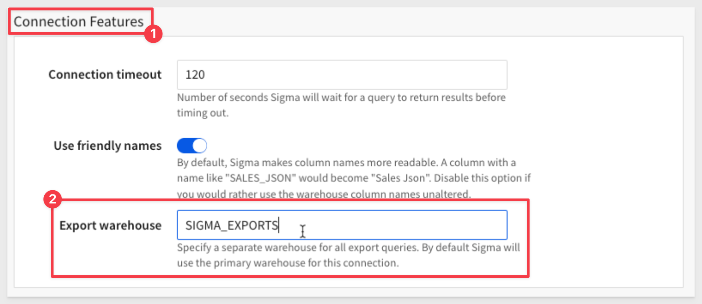
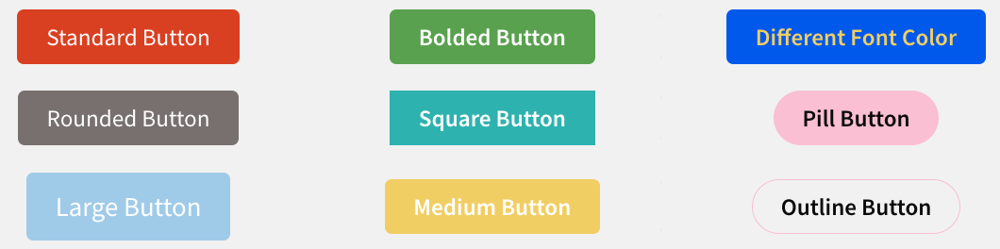
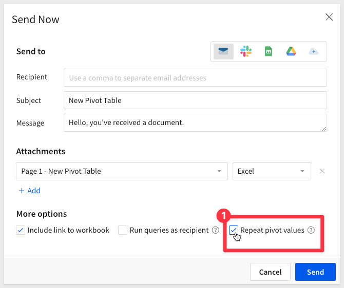

author: pballai
id: 03_2024_first_friday_features
summary: 03_2024_first_friday_features
categories: Administration
environments: web
status: Published
feedback link: https://github.com/sigmacomputing/sigmaquickstarts/issues
tags: first_friday_features
lastUpdated: 2024-03-31

<!--  1, 8, 15 22 done  -->

# (03-2024) March
<!-- The above name is what appears on the website and is searchable. -->

## Overview 
Duration: 5 

This QuickStart lists all the new and public beta features released, as well as bugs fixed in March 2024.

It is summary in nature, and you should refer to the specific Sigma documentation links provided for more information.

**Public beta features will carry the section text "Beta".**

All other features are considered released (**GA** or generally available).

Sigma actually has feature and bug fix releases weekly, and high-priority bug fixes on demand. We felt it was best to keep these QuickStarts to a summary of the previous month for your convenience.

New first Friday features QuickStarts will be published on the first Friday of each month, and will include information for the previous month.

## Administration
Duration: 20

### Account type permissions for export destinations
The [Account types](https://help.sigmacomputing.com/docs/license-and-account-type-overview) feature separates permissions for individual export destinations, enabling granular control over members’ ability to export workbook content to Google Sheets, Google Drive, Slack, cloud storage, and webhooks.

For more information, see the account type permission availability matrix (Sharing and exports section) in [License and account type overview.](https://help.sigmacomputing.com/docs/license-and-account-type-overview)

### Separate export warehouse
If your Sigma organization is connected to Snowflake, you can run all scheduled, direct, and on-demand exports through a separate warehouse. 

This practice isolates export operations to optimize performance and reduce computing costs.

In the `Administration` > `Connection` > `Connection Features` section, locate the `Export Warehouse` field and enter the name of the virtual warehouse created for export queries:

For more information, see [Configure an export warehouse.](https://help.sigmacomputing.com/docs/configure-an-export-warehouse)

### Updated licensing model
Sigma’s license tiers are now labeled `Lite`, `Essential`, and `Pro` to bring clarity and simplicity to the licensing model.

<aside class="positive">
<strong>IMPORTANT:</strong>  No action is required to accommodate the update, as all user functionality and experiences will continue seamlessly.
</aside>

**Here’s what you need to know:**

1: No action is required from your end. Your Sigma experience will continue seamlessly. 

2: Default account names will be automatically updated to reflect the new license names. 

3: If your organization was previously subscribed to the two-license model, it will continue using two license tiers: Lite (formerly Viewer) and Pro (formerly Creator). 

4: Custom account names will remain unchanged. 

5: All Embed URLs will continue to function as usual. The old default account names will automatically map to the new names. 

6: SCIM processes will continue to function as normal and old license names will continue to work. 

7: Your Admin Portal and Usage Dashboards will be updated to reflect the new license names. 

8: Existing licensing agreements and terms will remain unchanged.

For more information, [see the Sigma Community post.](https://community.sigmacomputing.com/t/sigma-license-name-changes-no-action-needed/3332?_gl=1*1gugfu2*_ga*MTM0MjUwMjM2Ny4xNzAwMjQxMDE5*_ga_PMMQG4DCHC*MTcwOTkyMTA5My41NTIuMS4xNzA5OTI1MDE1LjYwLjAuMA..)

## Embedding
Duration: 20

## Input Tables
Duration: 20

## Functions
Duration: 20

### Array function
The Array function returns an array containing specified values.

This function allows users to create and manipulate arrays, which are collections of elements that can store various types of data, such as numbers, strings, and even other arrays. With the "Array" function, users can perform a wide range of operations, including adding or removing elements, accessing specific items, and iterating over the elements for processing.

<aside class="negative">
<strong>NOTE:</strong>  This function is currently supported by Snowflake, PostgreSQL, BigQuery, and MySQL connections only.
</aside>

For more information, [see the Array documentation.](https://help.sigmacomputing.com/docs/array)

### DateFormat function enhancement
The `DateFormat` function now supports the `%q` specifier that allows you to extract the **quarter** component from a datetime value.

For more information about the function and supported format specifiers, [see DateFormat.](https://help.sigmacomputing.com/docs/dateformat)

## New QuickStarts in March
Duration: 20

### Sigma Health Check Native App
The Sigma Health Check Native App is designed to provide insights into the overall health and performance of your Snowflake environment. This native app includes insights into architecture, user and role grants, as well as warehouse performance and sizing recommendation.

[Getting Started with the Sigma Health Check Native App for Snowflake](https://quickstarts.sigmacomputing.com/guide/partners_snowflake_health_check_app/index.html?index=..%2F..index#0)

## Redshift Connections
Duration: 20

### SUPER data type support
Sigma now natively supports the `SUPER` data type to seamlessly handle semi-structured data from Redshift connections.

For more information, see [SUPER type](https://docs.aws.amazon.com/redshift/latest/dg/r_SUPER_type.html) in the AWS developer documentation.

## Visualizations
Duration: 20

## Workbooks

### Bulk column drag-and-drop
When interacting with a visualization, table, pivot table, or input table elements, you can now `bulk drag-and-drop columns` in the `Element properties` > `Columns` tab to reorder multiple columns or add them to groupings, calculations, or other properties.

### Button element formatting
Sigma is continuing to deliver polish and customization to our workbooks and in this case has improved the styling options for buttons.

Users now have more options to adjust the look-and-feel of their button elements, including new `styles`, `shapes`, and `sizes` in the `Element properties` panel:

### Default value for empty pivot table cells
When there’s no corresponding source data for a pivot table value cell to reference (no record exists for the particular combination of dimensions), the cell is empty by default. 

To customize the value for all empty cells, go to  `Element format` > `Format` and enter the preferred value in the `Empty cell` display value field.

### Default table styling
You can now configure a default table style for an **entire workbook** (in the Workbook settings panel), or an organization theme (in the Administration portal).

This allows users to make bulk styling changes across their entire workbook (or theme), rather than making adjustments one by one, saving lots of time.

For more information, see [Customize table styles](https://help.sigmacomputing.com/docs/customize-table-style) and [Create and manage workbook themes.](https://help.sigmacomputing.com/docs/create-and-manage-workbook-themes)

### Repeat pivot values in exports
When sending or scheduling an export, you now have the option to repeat pivot values in Excel or CSV output.

In the Send Now or Schedule Exports modal, go to More options and select the Repeat pivot values checkbox. This ensures the pivot header values are populated in every applicable row or column:

## Additional Information
Duration: 20

**Additional Resource Links**

[Blog](https://www.sigmacomputing.com/blog/) 
[Community](https://community.sigmacomputing.com/) 
[Help Center](https://help.sigmacomputing.com/hc/en-us) 
[QuickStarts](https://quickstarts.sigmacomputing.com/) 
 

&emsp;
&emsp;

