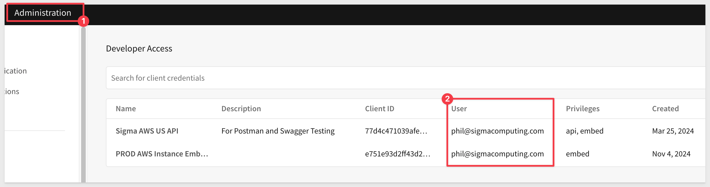
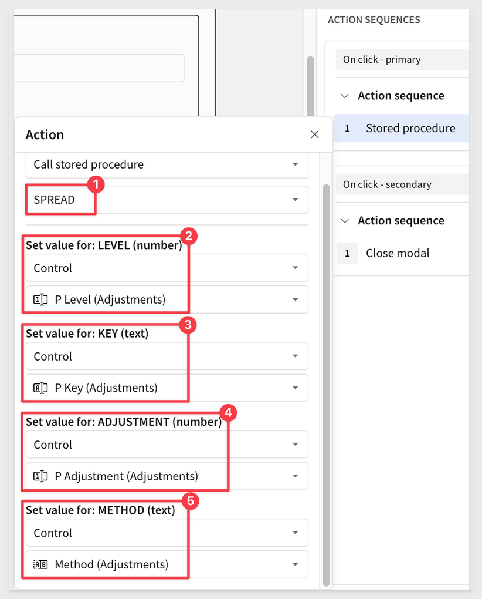
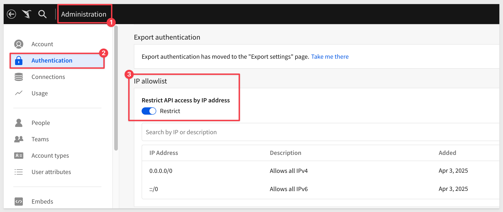
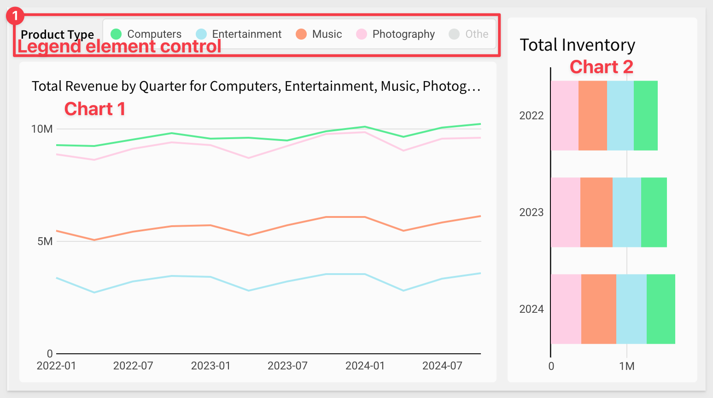
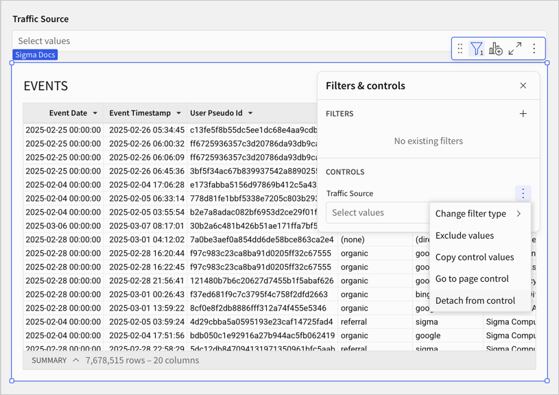
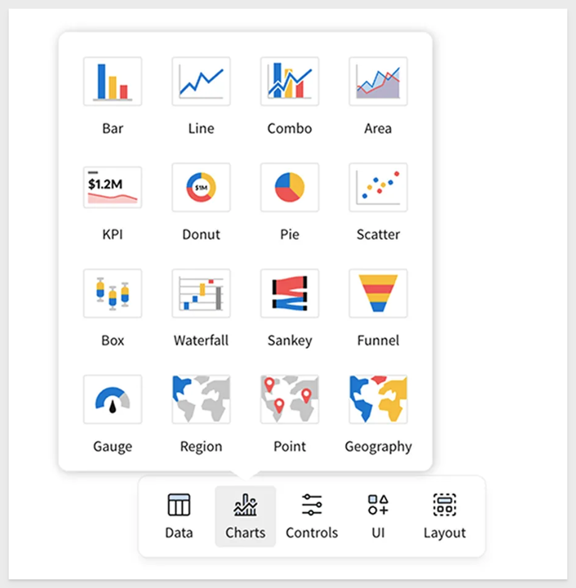
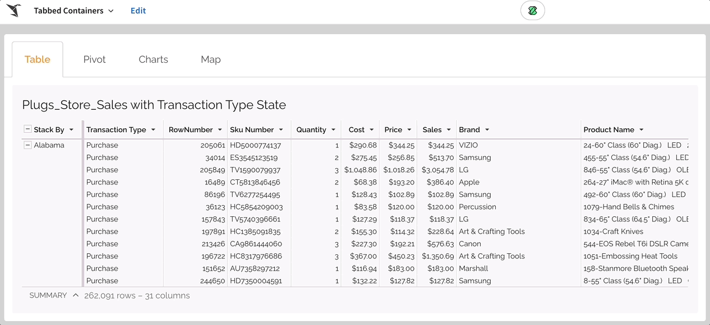

author: pballai
id: 02_2025_first_friday_features
summary: 02_2025_first_friday_features
categories: Administration
environments: web
status: Published
feedback link: https://github.com/sigmacomputing/sigmaquickstarts/issues
tags: first_friday_features
lastUpdated: 2024-03-3

# (02-2025) March

<!--
7 Mar changes: done
14 changes: done
21 changes: done
28 changes: 
 
Publish on 
-->

## Overview 
Duration: 5 

This QuickStart lists all the new and public beta features released, as well as bugs fixed in March 2025.

It is summary in nature, and you should refer to the specific Sigma documentation links provided for more information.

**Public beta features will carry the section text "Beta".**

All other features are considered released (**GA** or generally available).

Sigma actually has feature and bug fix releases weekly, and high-priority bug fixes on demand. We felt it was best to keep these QuickStarts to a summary of the previous month for your convenience.

New first Friday features QuickStarts will be published on the first Friday of each month, and will include information for the previous month.

<aside class="positive">
<strong>IMPORTANT:</strong>  Some screens in Sigma may appear slightly different from those shown in QuickStarts. This is because Sigma is continuously adding and enhancing functionality. Rest assured, Sigma’s intuitive interface ensures that any differences will not prevent you from successfully completing any QuickStart.
</aside>

For more information on Sigma's product release strategy, see [Sigma product releases.](https://help.sigmacomputing.com/docs/sigma-product-releases)

If something is not working as you expect, here is [how to contact Sigma support.](https://help.sigmacomputing.com/docs/sigma-support)

<!-- END OF SECTION-->

## Administration
Duration: 20

### Improved management of developer credentials
On the `Developer access` page in the `Administration` portal, the owner of each set of developer credentials is now identified by `email` instead of by `user name. 

As a result, admins can now identify which API token is assigned to each user, even when multiple users share the same username.

### License tier updates
Sigma's license model now includes four tiers: View, Act, Analyze, and Build. **This structure applies to all organizations created on or after March 4, 2025.**

<li><strong>My Content:</strong> Some text...
    <ol type="n"> 
      <li><strong>View:</strong> Suitable for report consumers who need access to prepared data and insights with baseline interactions</li>
      <li><strong>Act:</strong> Ideal for collaborative data contributors who actively input and update data.</li>
      <li><strong>Analyze:</strong> Optimized for decision-making data consumers who require more deep-dive capabilities without building workbooks themselves.</li>
      <li><strong>Build:</strong> Designed for data architects, BI analysts, and report builders who model, transform, and analyze data.</li>
    </ol>
  </li>

 <aside class="negative">
<strong>NOTE:</strong>  The Build license also supports system administrators who can manage organization settings and users.
</aside>

Organizations created prior to this date will continue using Lite, Essential, and Pro license tiers and will be scheduled for a license migration at a later date.

For more information about the new licenses, see [Account type and license overview.](https://help.sigmacomputing.com/docs/account-type-and-license-overview)

<!-- END OF SECTION-->

## Actions
Duration: 20

### Call stored procedures with actions (Beta) 
Call stored procedures defined in a Snowflake, BigQuery, or Amazon Redshift connection using an action. 

If the stored procedure returns non-tabular results like a string, number, or Boolean value, you can work with the output as an action variable. 

With this release, you can also grant users and teams access to use existing stored procedures from a specific schema without granting those users access to the entire connection.

For example, if you have an existing stored procedure in your data platform that you use to perform a complex calculation, rather than recreating the logic in a Sigma custom function or formula, you can call the stored procedure and use the output in Sigma.

This feature opens up a whole new world of possibilities. For example, in the QuickStart , call call a Snowflake procedure and pass it a few values from Sigma contol elements for processing:

For more details, including detailed end-to-end examples, see [Create actions that call stored procedures (Beta).](https://help.sigmacomputing.com/docs/create-actions-that-call-stored-procedures)

### Select tab action (Beta)
With the addition of tabbed containers--**such a cool feature,** you can now create an action to display a specific tab in a tabbed container element. 

Configure these actions based on user actions and optional conditions to customize what your tabbed container displays.

The tabs in a tabbed container can be visible or hidden from the end user. If they are hidden, the `Select tab` action is the only way to display tabs other than the default tab.

For more information, see [Create actions that modify or refresh elements.](https://help.sigmacomputing.com/docs/create-actions-that-modify-or-refresh-elements#select-tab-beta)

### Update row and Delete row actions (Beta)
Use the `Update row` and `Delete row` actions to modify input tables. 

`Update row` allows user interaction to update values in an existing row, while `Delete row` removes an entire row. 

These actions are designed to support form functionality, but can be used in other ways to accommodate different data app use cases.

For more information, see [Create actions that modify input table data.](https://help.sigmacomputing.com/docs/create-actions-that-modify-input-table-data)

<!-- END OF SECTION-->

## API
Duration: 20

### Allowlist IP addresses for API access (GA)
Administrators can now restrict access to the Sigma API by adding `IP addresses` and `IP address ranges` using CIDR notation to an allowlist. 

With an allowlist configured, only users making API requests from allowed IP addresses can make successful requests.

For more information, see [Restrict API access by IP address.](https://help.sigmacomputing.com/docs/restrict-api-access-by-ip-address)

### New 2.1 version for some API endpoints
The following endpoints are now available in a v2.1 version. 

The new versions use pagination for the API response by default, allowing you to retrieve large responses in manageable segments.

The following endpoints are updated:
- [List members](https://help.sigmacomputing.com/reference/listmemberspaginated)
- [List teams](https://help.sigmacomputing.com/reference/listteamspaginated)
- [List workspaces](https://help.sigmacomputing.com/reference/listworkspacespaginated)
- [List materialization schedules for a workbook](https://help.sigmacomputing.com/reference/listmaterializationschedulespaginated)
- [List scheduled exports for a workbook](https://help.sigmacomputing.com/reference/listworkbookschedulespaginated)

The equivalent endpoints in v2 continue to work, but might not use pagination by default for all customers.

### New API endpoint to update the schedule for an export
The following endpoint has been added to `update a workbook schedule` for an export.

This endpoint lets you create a file containing data exported from a workbook, allowing you to retrieve large datasets or detailed reports in a structured format. Export the entire workbook, a single workbook page, or an individual element. You can specify parameters to filter the data and format options for the file.

For more information, see [Export data from a workbook](https://help.sigmacomputing.com/reference/exportworkbook) 

### New option for Export data from a workbook endpoint
When exporting an entire workbook or workbook page using the `Export data from a workbook` method, the format parameter now supports the `xlsx` option to support the Excel file format.

For more information, see [Update a workbook schedule](https://help.sigmacomputing.com/reference/updateworkbookschedule) 

### New option for List workbook pages for a workbook and List elements in a workbook endpoints
You can now retrieve pages and elements for a saved view, formerly known as a `bookmark`, using the API.

The [List workbook pages](https://help.sigmacomputing.com/reference/listworkbookpages) for a workbook endpoint and the [List elements in a workbook](https://help.sigmacomputing.com/reference/listworkbookpageelements) endpoint now include the `bookmarkId` query parameter.

### New writebackSchemas options for Create a connection and Update a connection endpoints
When adding a Snowflake or Databricks connection that uses OAuth with the [Create a connection](https://help.sigmacomputing.com/reference/createconnection) endpoint or updating one with the [Update a connection](https://help.sigmacomputing.com/reference/updateconnection) endpoint, you can use the new writebackSchemas option to provide multiple write-back schemas for the connection to use.

Multiple write-back schemas helps keep content created by different teams or users with different permissions in different schemas.

### Request an API token on any endpoint page
When accessing the Sigma public API documentation, you can request an `API token` from any endpoint documentation page, instead of first accessing the `Get access token` documentation page.

The endpoint for retrieving a token and refreshing an existing token is unchanged. This is not a code change to the API itself.

<!-- END OF SECTION-->

## Bug Fixes
Duration: 20

**1:** Actions with conditions based on hidden columns now trigger as expected.

**2:** The Workspaces page no longer displays a `Too many results resolved` error when attempting to load a very large number of workspaces. 

**3:** In secure embeds that use `OAuth` to access data, new embed users no longer need to reload the embed to clear a `no valid refresh token` error. Instead, the embed loads for a newly-created embed user on the first try.

**4:** API endpoints that return information about tagged workbook versions now return an accurate `sourceWorkbookVersion.` Previously, the API returned the highest `sourceWorkbookVersion` even in cases where a lower s`ourceWorkbookVersion` had been tagged more recently.

**5:** Users are no longer signed out of Sigma if they attempt to run a query with `OAuth credentials` that do not exist.

**6:** For connections that use `OAuth`, users can now see and use stored procedures that they have access to.

**5:** Materialization schedules owned by users deactivated after `March 25, 2025` transfer to the administrator performing the deactivation, or if specified, the user chosen to receive the deactivated user's documents. Materialization schedules owned by users deactivated prior to that date fail to run and materialized elements might display an error.

<!-- END OF SECTION-->

## Charts
Duration: 20

### Customize chart and formatting color scales (GA)
Create custom color scales to use when formatting chart colors or conditional formatting for tables. Create a custom color scale for an organization theme, workbook theme, or for a specific data element.

For more information, see [Add a custom color scale.](https://help.sigmacomputing.com/docs/add-a-custom-color-scale)

### Interactive chart legends support map and funnel charts
Map and funnel charts that have a color by category set support the following interactive filtering capabilities in the legend:

- Hover over a legend entry to highlight corresponding data points.
- Click a legend entry label to isolate corresponding data points.
- Select or clear the checkbox of one or more legend entries to show or hide corresponding data points.
- Click anywhere (within the element) outside of the plot area or legend to reset the chart displ

### Legend control element (Beta) 
Add the `legend control element` to your workbook to target multiple charts with one legend and align colors across charts. 

The legend control functions as an interactive legend, letting you filter and highlight corresponding data points in targeted charts. Any categories not represented in the list are collected as an extra category, "Others", which can be turned off.

For example, the image below shows one legend control targeting two charts:

For more details, see [Create and configure a legend control (Beta)](https://help.sigmacomputing.com/docs/create-and-configure-a-legend-control)

<!-- END OF SECTION-->

## Input Tables
Duration: 20

### Input tables are now supported on Amazon Redshift connections (GA) 

Input tables are now compatible with Amazon Redshift connections. These dynamic workbook elements support structured data entry that allows you to integrate new data points into your analysis and augment existing data.

For more information about input tables and how to use them, see the following documentation:

[Intro to input tables](https://help.sigmacomputing.com/docs/intro-to-input-tables)
[Create new input tables](https://help.sigmacomputing.com/docs/create-new-input-tables)
[Edit existing input table columns](https://help.sigmacomputing.com/docs/edit-existing-input-table-columns)

There is also a [QuickStart](https://quickstarts.sigmacomputing.com/guide/input_tables_use_cases/index.html?index=..%2F..index#0) that demonstrates common use case. While this QuickStart uses Snowflake, they will behave the same on Redshift as well. 

<!-- END OF SECTION-->

## New QuickStarts in March
Duration: 20

### Resolving The Fan Trap with Sigma and Snowflake UDF
In this QuickStart, we explore a fan trap use case and one way to solve it in Sigma.

A fan trap occurs when a one-to-many relationship is followed by another one-to-many relationship, leading to potential overcounting of values in queries. 

[Resolving The Fan Trap with Sigma and Snowflake UDF](https://quickstarts.sigmacomputing.com/guide/tables_fan_traps/index.html?index=..%2F..index#0)

<!-- END OF SECTION-->

## Workbooks
Duration: 20

### Change the grid density within containers (Beta)
You can now change the `density of the grid` within a container or tabbed container element. 

By default, a container's grid has `twelve` horizontal grid spaces, which expand and contract to fit the container size. 

Using the new `Column density` setting, you can opt to configure a lower or higher density, depending on your layout. 

Higher density gives you a finer grain of control over element positions in large containers.

For more information, see [Change the grid column density of a container (Beta).](https://help.sigmacomputing.com/docs/organize-workbook-layouts-with-containers#change-the-grid-column-density-of-a-container-beta) 

### Conditional formatting retained for XLSX files
When a table, input table, or pivot table with conditional formatting is exported as an XLSX-formatted (Excel) file, the conditional formatting is retained. Conditional formatting includes single color, color scale, and data bar formatting. This makes for reports that are more familiar to users and better-looking too.

### Detach a control from an element
You can now "detach" an element as a target of a control, you can now detach the control from the element from the element's filter menu.

This is handy when adding or remapping controls in the build stage of projects or when changes are required later. 

### Keyboard shortcut for cell selection
When you select a single cell in a table, you can add adjacent cells to the selection using the keyboard shortcut `⌘+⇧+arrow` (Mac) or `ctrl+⇧+arrow` (Windows).

### Redesigned user interface for workbooks and data models
The workbook and data model UI has been redesigned to simplify the creation experience in Sigma. The redesign includes the following changes:

- **Streamlined workbook header:** We’ve combined essential actions—such as saving, commenting, and sharing—into one spot. No more clicking around to find what you need.

- **New ways to create and edit elements:**
        - An Add new element bar where you can add elements at any time.
        - A simplified editor panel with tabs to access element properties, format, and actions.
        - For an overview of the new workbook UI, see Navigating a workbook (link).

- **Simpler custom views:** Previously known as `Explore`, these views are now easier to create and customize. You can save them, share them, or discard changes and return to the original Workbook anytime.

- **Refined editor panel:** Properties, formatting options, and actions are now neatly organized into tabs, so you can make quick adjustments without feeling lost.

- **A new floating element bar:** Insert charts, tables, and other elements on the fly. It’s all about making sure inspiration doesn’t have to wait.

Sigma’s redesign sharpens the experience without sacrificing power. A cleaner UI, smarter workflows, and a more intuitive flow mean you can move faster, focus on what matters, and get to insights without distractions. Whether you’re deep into analysis or just getting started, Sigma stays flexible and responsive to your needs. This is just the start—we’ll keep pushing forward to make data exploration even more seamless, powerful, and accessible. 

The new UI has been rolled out for all **new** Sigma organizations, and will continue to be enabled in a multi-stage rollout for all existing organizations.

To learn more about the design ethos behind this change, see [Making Sigma Click: Introducing Our Refreshed Interface.](https://www.sigmacomputing.com/blog/making-sigma-click-introducing-our-refreshed-interface?_gl=1*616xf3*_gcl_au*MTAxNTE2MDYxOC4xNzMzNzY1NDI3*_ga*MjYwNTkzMzY0LjE2NzA0NDY3NTc.*_ga_PMMQG4DCHC*MTc0MTM2MTExMi4xMDYuMS4xNzQxMzYxMTY0LjguMC4w)

### Shared view limitations
Each workbook is now limited to `10 shared views.` If a workbook has version tags, the limit applies per tagged version. 

There is no limit on the number of personal saved views (previously known as personal bookmarks) per workbook.

Organizations with more than existing 10 saved views will be able to keep their existing views, but not be able to make more.

### Tabbed containers (Beta) 
Sigma already supported workbook pages that traditional spreadsheet users were familiar with.

Tabbed containers bring that functionality ***inside*** the workbook itself and are a fundamental design element used in data apps.

Add a tabbed container to your workbook pages when you want to offer multiple sets of content in the same section of your workbook canvas. 

A tabbed container has multiple tabs at the top of the container, which can either be visible or hidden for end users. 

By placing content on different tabs and configuring logic about which tab should display, you can allow users to experience different views in the same space without scrolling or navigating elsewhere.

For example:

### Refined header on the Sigma home page
The home page header has been redesigned to match the recently updated workbook and data model UI. 

The change is ***aesthetic and does not impact any functionality.*** 

The new updated homepage header has rolled out for some organizations, and will continue to be incrementally rolled out over the coming weeks.

<!-- END OF SECTION-->

## Additional Information
Duration: 20

**Additional Resource Links**

[Blog](https://www.sigmacomputing.com/blog/) 
[Community](https://community.sigmacomputing.com/) 
[Help Center](https://help.sigmacomputing.com/hc/en-us) 
[QuickStarts](https://quickstarts.sigmacomputing.com/) 
 

&emsp;
&emsp;

<!-- END OF SECTION-->
