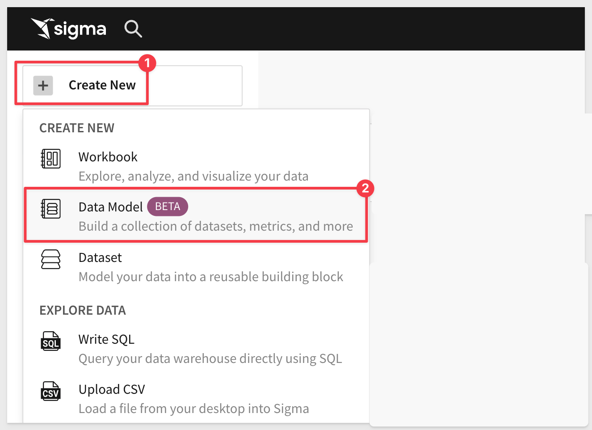
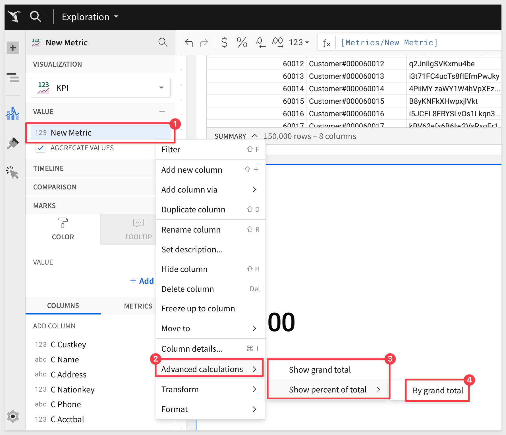
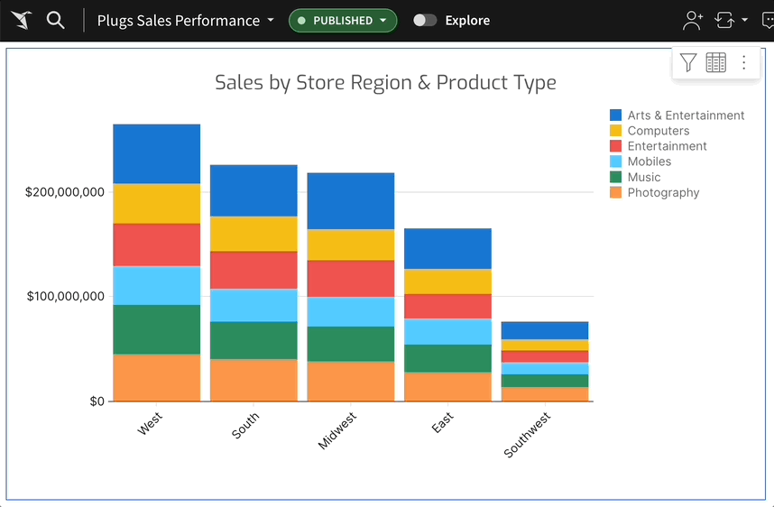

author: pballai
id: 04_2024_first_friday_features
summary: 04_2024_first_friday_features
categories: Administration
environments: web
status: Published
feedback link: https://github.com/sigmacomputing/sigmaquickstarts/issues
tags: first_friday_features
lastUpdated: 2024-04-31

<!-- 
04-05 (in previous month)
04-12 done 

-->

# (04-2024) April
<!-- The above name is what appears on the website and is searchable. -->

## Overview 
Duration: 5 

This QuickStart lists all the new and public beta features released, as well as bugs fixed in April 2024.

It is summary in nature, and you should refer to the specific Sigma documentation links provided for more information.

**Public beta features will carry the section text "Beta".**

All other features are considered released (**GA** or generally available).

Sigma actually has feature and bug fix releases weekly, and high-priority bug fixes on demand. We felt it was best to keep these QuickStarts to a summary of the previous month for your convenience.

New first Friday features QuickStarts will be published on the first Friday of each month, and will include information for the previous month.

## Administration
Duration: 20

## Bug Fixes
Duration: 20

1: To preserve data integrity, Sigma no longer converts `Yes/No` and `0/1` values to True/False boolean values in CSV uploads.

## Data models (BETA)
Duration: 20

Sigma Data Models represent the next iteration of Datasets and their introduction is a **foundational change that offers significant benefits** over the existing Dataset functionality. We’re investing heavily in Data Models over the coming months and years, with plans to add a whole suite of functionality, coupled with the ease-of-use that you have come to expect from Sigma.

This is large topic, and we will be providing a ton of resources for customers to take advantage of, including a new QuickStart. 

For now, we strongly recommend reading this post in [Sigma Community on DataModels.](https://community.sigmacomputing.com/t/data-model-faqs/3481)

There is also some documentation (with more to come) [here.](https://help.sigmacomputing.com/docs/intro-to-data-models)

## Embedding
Duration: 20

## Functions
Duration: 20

### Advanced calculation options for metrics
Quickly convert metrics to cumulative aggregates (grand total) or relative aggregates (percent of total) in tables, pivot tables, and visualizations. 

Open the relevant metric column menu, then hover over `Advanced calculations` and select an option to show the `grand total` or `percent of total`. 

Available percentage breakdowns (by grand total, x-axis, row, column, etc.) depend on the element type.

For example:

## New QuickStarts in March
Duration: 20

## Visualizations
Duration: 20

### Interactive chart legends
Interact with chart legend entries to quickly focus on specific data subsets. 

Charts containing legends that represent qualitative segments (like categories or series) support the following interactive filtering capabilities:

<ul>
      <li><strong> Hover over a legend entry to highlight corresponding data points.</strong></li>
      <li><strong> Click a legend entry label to isolate corresponding data points.</strong></li>
      <li><strong> Select or clear the checkbox of one or more legend entries to show or hide corresponding data points.</strong></li>
      <li><strong> Click anywhere (within the element) outside of the plot area or legend to reset the chart display.</strong></li>
</ul>

<aside class="negative">
<strong>NOTE:</strong>  Changes resulting from chart legend interactions persist when you switch between workbook modes; however, they don’t persist across user sessions and aren’t saved when the workbook is published.
</aside>

## Workbooks
Duration: 20

## Additional Information
Duration: 20

**Additional Resource Links**

[Blog](https://www.sigmacomputing.com/blog/) 
[Community](https://community.sigmacomputing.com/) 
[Help Center](https://help.sigmacomputing.com/hc/en-us) 
[QuickStarts](https://quickstarts.sigmacomputing.com/) 
 

&emsp;
&emsp;

