author: pballai
id: 04_2025_first_friday_features
summary: 04_2025_first_friday_features
categories: firstfridayfeatures
environments: web
status: Published
feedback link: https://github.com/sigmacomputing/sigmaquickstarts/issues
tags: first_friday_features
lastUpdated: 2024-05-02

# (04-2025) April
<!-- The above name is what appears on the website and is searchable. 

April 4th done
April 11th done
April 18th done
April 25th done
May 2nd done

Publish on May 2nd


-->

## Overview 
Duration: 5 

This QuickStart lists all the new and public beta features released, as well as bugs fixed in April 2025.

It is summary in nature, and you should refer to the specific Sigma documentation links provided for more information.

**Public beta features will carry the section text "Beta".**

All other features are considered released (**GA** or generally available).

Sigma actually has feature and bug fix releases weekly, and high-priority bug fixes on demand. We felt it was best to keep these QuickStarts to a summary of the previous month for your convenience.

New first Friday features QuickStarts will be published on the first Friday of each month, and will include information for the previous month.

<aside class="positive">
<strong>IMPORTANT:</strong><br> Some screens in Sigma may appear slightly different from those shown in QuickStarts. This is because Sigma is continuously adding and enhancing functionality. Rest assured, Sigma’s intuitive interface ensures that any differences will not prevent you from successfully completing any QuickStart.
</aside>

For more information on Sigma's product release strategy, see [Sigma product releases](https://help.sigmacomputing.com/docs/sigma-product-releases)

If something is not working as you expect, here is [how to contact Sigma support](https://help.sigmacomputing.com/docs/sigma-support)


<!-- END OF SECTION-->

## Administration
Duration: 20

### Audit log events for stored procedures
The Sigma Audit Logs connection now features a `STORED_PROCEDURES` event category that records events related to the execution of stored procedures.

For more information, see [Audit log events and metadata](https://help.sigmacomputing.com/docs/audit-log-events-and-metadata)

### Azure SQL Database, SQL Server 2022 and Azure Managed Instance connections (Beta)

Sigma now supports secure connections to Azure SQL Database, SQL Server 2022 and Azure SQL Managed Instances.

For more information on how to set up these connections, see [Connect to Azure SQL Database (Beta)](https://help.sigmacomputing.com/docs/connect-to-azure-sql-database) and [Connect to SQL Server and Azure SQL Managed Instance (Beta)](https://help.sigmacomputing.com/docs/connect-to-sql-server-2022)

### Granular permissions for AI features 
Three separate feature permissions now allow admins to configure which account types can use AI features.

Settings for this are found in `Administration` > `Account Types` and scrolling down to `AI`:

 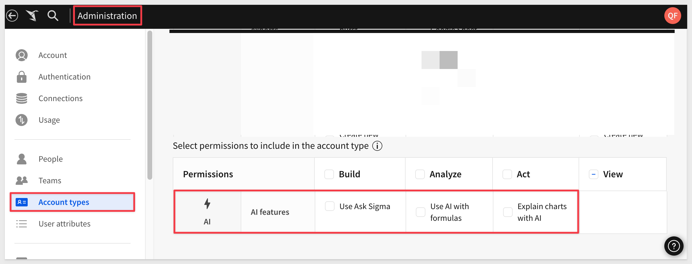

- The **Explain charts with AI** feature permission allows users to see and use the Explain this chart option on any visualization. 

- The **Use AI with formulas** feature permission allows users to use the AI-powered formula assistant to write new formulas, correct formula errors, and explain existing formulas. 

- The **Use Ask Sigma** feature permission allows users to ask natural language queries with Ask Sigma. 

<aside class="negative">
<strong>NOTE:</strong><br> The use of AI-powered features also requires an admin to configure an AI provider for the organization.
</aside>

For more information, see [Account type and license overview](https://help.sigmacomputing.com/docs/account-type-and-license-overview) and [Configure AI features for your organization](https://help.sigmacomputing.com/docs/configure-ai-features-for-your-organization)

### Materialization with Snowflake dynamic tables (GA)
Materialization with Snowflake dynamic tables is now generally available (GA). 

If your Sigma organization has a Snowflake connection, you can configure materialization to use dynamic tables for materialization. 

<aside class="negative">
<strong>NOTE:</strong><br> New connections to Snowflake use dynamic tables for materialization by default.
</aside>

To set this up for an existing connection, see [Connect to Snowflake](https://help.sigmacomputing.com/docs/connect-to-snowflake#configure-write-access)

For more information, see [About materialization](https://help.sigmacomputing.com/docs/materialization#incremental-materialization-with-dynamic-tables)

### Require all email exports to run as recipient
Sigma admins can now choose to require all email exports to run queries as recipients. 

After enabling this setting, all new and modified email export schedules run queries as the recipients:

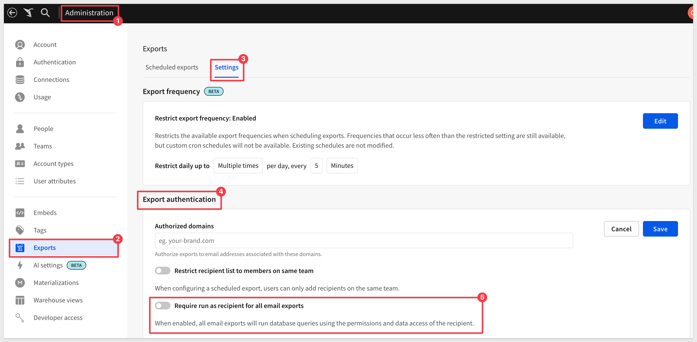

For more information, see [Manage export frequency and authentication settings](https://help.sigmacomputing.com/docs/restrict-export-recipients)

### SAML configuration values now available in Administration portal
When setting up single sign-on with SAML, you can now copy and paste your SAML configuration values (e.g. prefix, RelayState) from the Administration portal. 

Go to `Administration` > `Authentication` > `Edit`, and your configuration values will be available under `Authentication Method & Options`:

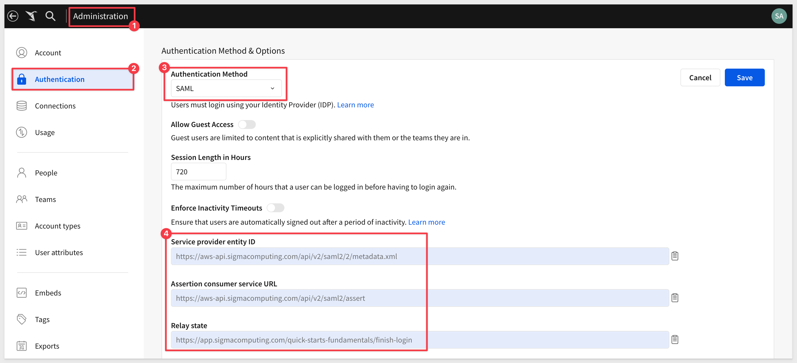

For more information, see: [Set up single sign-on with SAML](https://help.sigmacomputing.com/docs/single-sign-on-with-saml#configure-your-idp-manually)

### Scheduled materialization bypass on Snowflake connections
When using materialization with a Snowflake connection, Sigma detects data updates in materialized elements in workbooks and data models. 

If the underlying data hasn’t been updated since the last successful materialization, **Sigma bypasses the scheduled materialization to reduce unnecessary compute time and costs.**

For more information, see [Scheduled materialization bypass](https://help.sigmacomputing.com/docs/materialization#scheduled-materialization-bypass)

### Updated team creation behavior
Admins who create teams are no longer automatically added as members of that team. Teams now start empty, allowing the admin to choose whether or not to include themselves as a member.

### Updated user requirements for creating shared views
The ability to share saved views is now limited to users who are assigned account types with the `Create`, `edit`, and `publish workbooks` permission enabled:

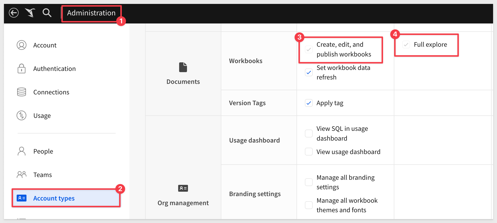

Users who are assigned account types with the `Full explore` permission enabled (without Create, edit, and publish workbooks) can create and save custom views, but cannot share them.

Existing shared views will remain shared regardless of the account type assigned to the user who created them. For more information about saved views, see Create and share saved views.


<!-- END OF SECTION-->

## AI (Ask Sigma)
Duration: 20

Sigma's approach to integrating AI is really innovative and accelerates the time it takes to create meaningful content.

[Checkout our unique approach here](https://www.sigmacomputing.com/product/ai-ml)

### Explore with related charts in Ask Sigma (Beta) 
After you receive an initial answer from `Ask Sigma`, you can continue your exploration. 

`Ask Sigma` provides related charts underneath its primary answer to offer avenues to analyze related data.

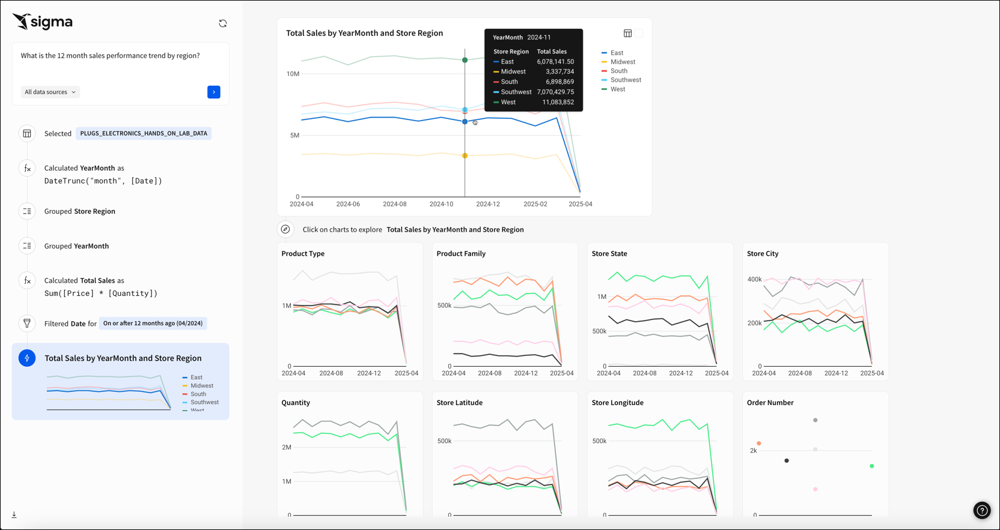


<!-- END OF SECTION-->

## Actions
Duration: 20

### Bulk clear controls in a tabbed container
You can now set the `Clear control` action to bulk clear all controls in a tabbed container element or a specific tab. 

When configuring the action, select the tabbed container element, then choose the `All tabs` option or select a specific tab that contains the controls you want the action to clear.

For more information, see [Clear one or more control values](https://help.sigmacomputing.com/docs/create-actions-that-manage-control-values#clear-one-or-more-control-values)

### Copy and paste actions and sequences 
Individual actions or entire sequences can now be copy/pasted to allow rapid reuse configurations across your organization. 

You can paste a copied action or sequence to the same element, a different element in the same workbook, or an element in a different workbook.

In the action or sequence menu, click `Copy action` or `Copy sequence`, then use the `Paste` action within a sequence, `Paste` action below another action, or `Paste` sequence option to paste the configuration to a specific location:

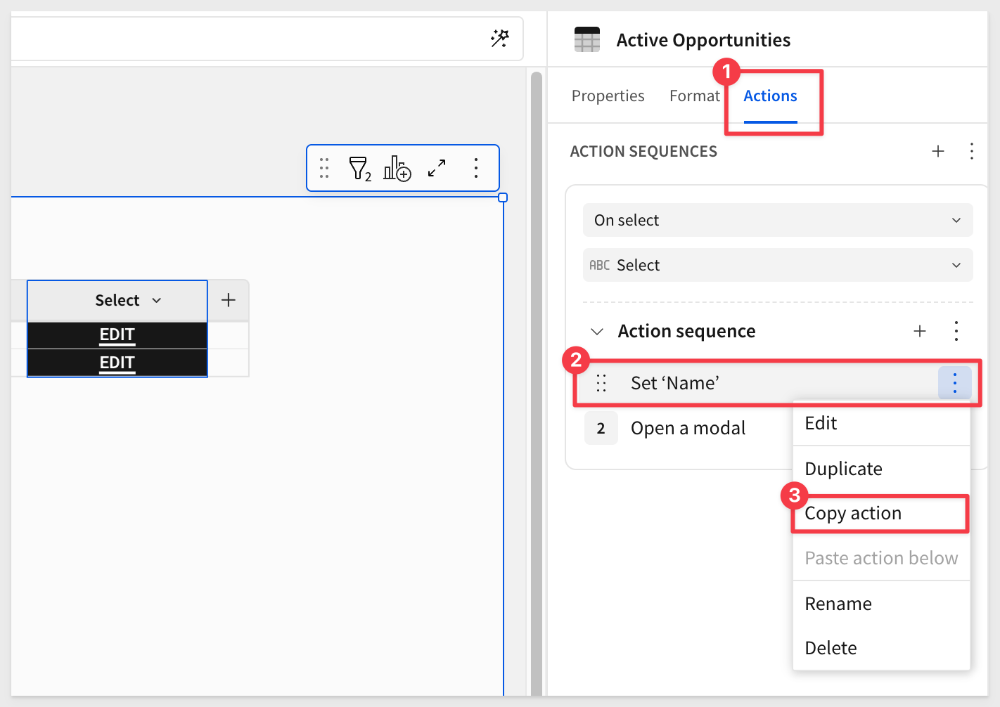

### Prevent whitespace from triggering actions
By default, actions configured on charts can be triggered when a user clicks on whitespace within the element. 

You can disable this to prevent unwanted initiation of actions.

In the `Actions panel`, click `More` and select `Allow whitespace to trigger actions`. If there is no checkmark displayed on the setting, whitespace is disabled as a trigger:

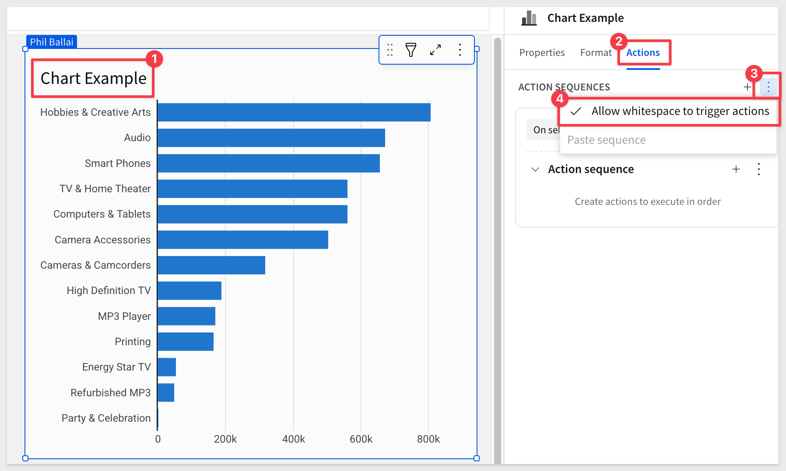


<!-- END OF SECTION-->


## API
Duration: 20

### New options for the Update member endpoint
The `Update member` [PATCH /v2/members/{memberId}](https://help.sigmacomputing.com/reference/updatemember) endpoint includes two new options to better manage scheduled exports when deactivating a user:

- Set `archiveDocuments` to `true` to archive all documents associated with a user that you deactivate, including scheduled exports associated with those documents.

- Set `archiveScheduledExports` to `true` to archive only the scheduled exports associated with the documents owned by the deactivated user.


<!-- END OF SECTION-->

## Bug Fixes
Duration: 20

**1:** Tagging a data model with a CSV uploaded no longer results in an error.

**2:** Secure embed users no longer see an “Invalid Databricks access token” error when accessing a workbook with OAuth credentials on a Databricks connection.

**3:** X-axis labels in trellis charts now display correctly when the y-axis title is displayed ( `Format` > `Y-Axi`s >` Axis title`) and shared x-axis is enabled (`Format` > `Trellis` > `Shared` > `X-Axis`).

**4:** In a custom view of a workbook embed when `:responsive_height` is set to `true`, the lineage view now displays correctly without being truncated.

**5:** When exporting grouped tables with totals, the totals now appear in a separate column with a correct header, for example, `"Column Name" (Grand Total)`.

**6:** Dynamic text in text elements now correctly displays line breaks (newline characters) and whitespace characters (tabs or spaces).

**7:** In OAuth-enabled embedded workbooks, OAuth connections are no longer disabled when external OAuth tokens are passed in an embed URL.

**8:** When an action sequence on a chart has a condition referencing the `Selection` variable, triggering the sequence by clicking whitespace on the chart no longer generates an error.

**9:** When an action sequence is configured with the `On select` trigger type for a column, the sequence is no longer initiated when a user clicks the column header.

**10:** If users attempt to run a query with OAuth credentials that do not exist, they are now shown an improved error message.

**11:** When sharing a template containing input tables across organizations, the input table data entry permissions in the shared template now matches what was defined in the source document.


<!-- END OF SECTION-->

## Charts
Duration: 20

### Change to underlying data grouping for cartesian charts
Previously, underlying data was grouped for cartesian charts (bar, line, area, scatter, combo, box, and waterfall charts) regardless of whether the chart values were aggregated. 

With this update, when viewing underlying data, the grouping will match the chart aggregation. 

For example, if `Aggregate values` is unchecked, the underlying data is not grouped.

For more information, see: [View underlying data](https://help.sigmacomputing.com/docs/view-underlying-data)

### Legend controls (GA)
Add the legend control element to your workbook to target multiple charts with one legend and align colors across charts.

The legend control functions as an interactive legend, letting you filter and highlight corresponding data points in targeted charts. 

Any categories not represented in the list are collected as an extra category, `Others`, which can be turned off.

For example, the image below shows one legend targeting two charts with the `Others` category hidden:

 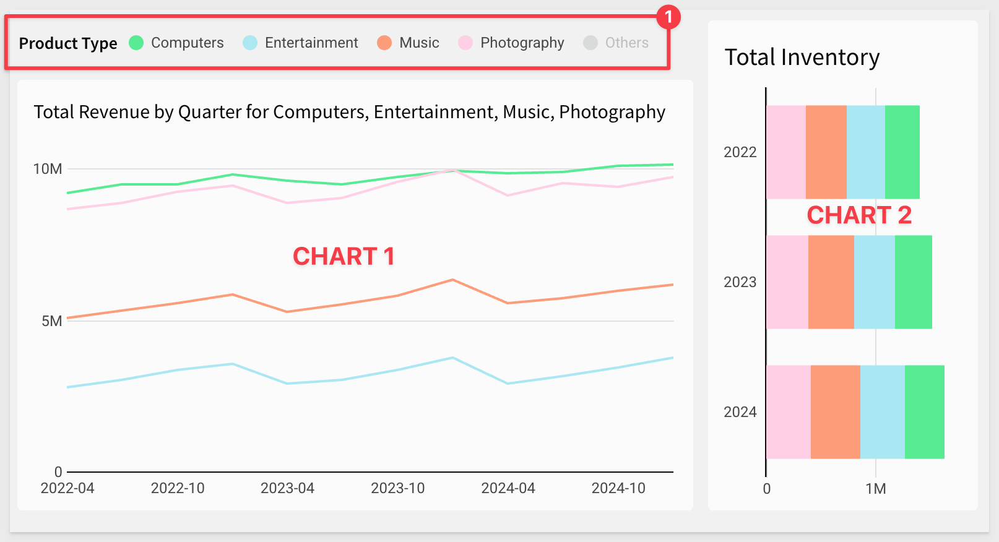

For more information, see [Create and configure a legend control](https://help.sigmacomputing.com/docs/create-and-configure-a-legend-control)


<!-- END OF SECTION-->

## Data Modeling
Duration: 20

Sigma has made significant changes to the way users can model data. Data Models represent the next iteration of Datasets. We’re investing heavily in Data Models over the coming months and years, with plans to add a whole suite of functionality outlined in this post. 

In April, we are releasing several new features in this area to beta. 

### Add metrics to data models (Beta)
You can now add metrics to data models. Metrics are dynamic and reusable calculations that are specific to a data source. As such, metrics usually reference specific columns. Create a metric to provide reliable and efficient aggregate calculations, abstracting complex formulas away from business users.

When defining a metric on a data model, you can reference other metrics in your formula. Metrics propagate downstream, so a metric defined on one data model is also available to any data elements that use that data model as a source.

Data elements in data models and workbooks that were materialized before April 1, 2025 might not work with metrics. If columns that use metrics produce an Invalid Query error, and the table or an upstream table is materialized, manually re-run the materialization. If the error persists, contact Sigma Support.

For more information, see:

[About metrics](https://help.sigmacomputing.com/docs/about-metrics)
[Create and manage metrics](https://help.sigmacomputing.com/docs/create-and-manage-metrics)
[Navigate data models](https://help.sigmacomputing.com/docs/navigate-data-models)
[Use metrics in a workbook](https://help.sigmacomputing.com/docs/use-metrics-in-a-workbook)

### Column-level security for data models (Beta)
You can now apply column-level security (CLS) to elements in data models. 

Column-level security restricts access to column-level data, ensuring that sensitive and confidential information is secure and accessible only to authorized users. 

CLS in a data model element allows configuration for specific users or teams.

For example, we may not want to allow users to see the `Cost Amount` column in a sales table:

 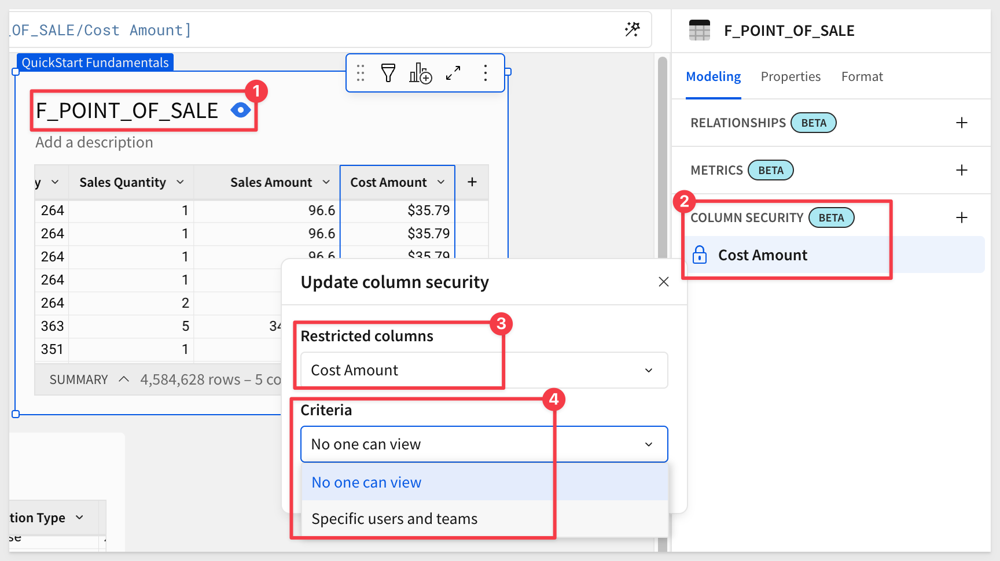

For more information, see [Configure column-level security](https://help.sigmacomputing.com/docs/column-level-security)

### Define relationships in data models (Beta)
You can pre-configure relationships between tables in a data model to enable business users to work with related data without performing ad hoc joins. 

A relationship defines the join logic for Sigma to use to join the tables, making the columns from both tables available to the source table for analysis and exploration **on demand.** 

When a user analyzes the source table in a workbook and adds a related column, Sigma performs the join.

<aside class="positive">
<strong>IMPORTANT:</strong><br> When a data model is used in a workbook, only the tables that have selected columns from the relationship are queried from the warehouse. The relationship may have tables that are available but if no columns are selected by the user, the table is not queried. This is called "join pruning" and improved performance and help reduce warehouse compute cost by not requesting tables that are not required by Sigma.
</aside>

Relationships between data model tables only support many-to-one or one-to-one joins, and are not automatically created between tables from a connected data source, even if the table has primary and foreign keys defined.

The video below shows selecting an existing data model relationship and opening the `Edit relationship` modal to view more details, such as relationship name, description, and keys:

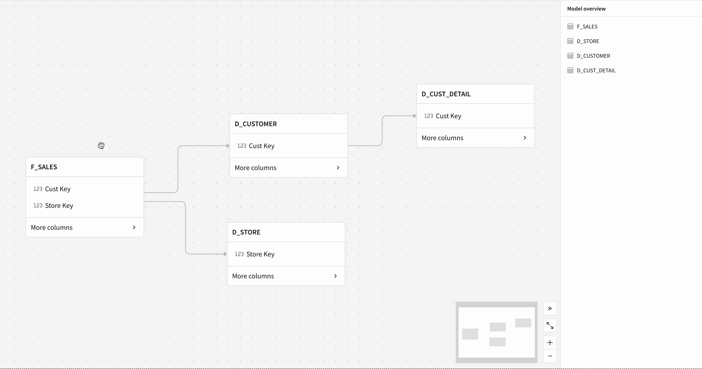

For more information, see [​​Define relationships in data models (Beta)](https://help.sigmacomputing.com/docs/define-relationships-in-data-models) 

For guidance using related columns in a workbook, see [Use related columns in a workbook (Beta)](https://help.sigmacomputing.com/docs/use-related-columns-in-a-workbook)

### Materialization support for version-tagged data models
You can now schedule materialization for each tagged version of a data model. 

For more information, see [Schedule materialization for a version-tagged data model](https://help.sigmacomputing.com/docs/schedule-materialization-for-a-version-tagged-data-model)


<!-- END OF SECTION-->

## Embedding
Duration: 20

### Ask Sigma now supported in secure embeds signed with JWT (Beta) 
Secure embedding with JWTs now extends to the `Ask Sigma` page. 

Embed `Ask Sigma` in your own application to offer your end users the ability to ask natural language queries of the data they have permission to access. 

Apply custom theming and remove Sigma branding for seamless integration.

For example:


For more information, see [Embed Ask Sigma (Beta)](https://help.sigmacomputing.com/docs/embed-ask-sigma) and [Ask natural language queries with Ask Sigma](https://help.sigmacomputing.com/docs/ask-natural-language-queries-with-ask-sigma)

### Authenticate secure embeds using JSON Web Tokens (JWTs) (GA) 
Sigma supports authenticating secure embeds using **JSON Web Tokens (JWTs).** 

JWTs are compact, URL-safe tokens that can be digitally signed, ensuring that the data they contain is tamper-proof. Using JWT-signed URLs for your embeds offers several advantages, including offering a secure way to embed content that can be accessed by both external users and internal users.

For more information, see [Create an embed API with JSON web tokens](https://help.sigmacomputing.com/docs/create-an-embed-api-with-json-web-tokens)

There is also a QuickStart on this topic: [Embedding 16: Secure Embedding with JWT](https://quickstarts.sigmacomputing.com/guide/embedding_16_jwt/index.html?index=..%2F..index#0)


<!-- END OF SECTION-->

## Functions / Calculations
Duration: 20

### ArrayExcept function
The ArrayExcept function returns an array of all unique elements from one specified array not included in another specified array. 

For example, consider a table that lists all available colors of different clothing items. To see all colors available for each item, ***excluding the colors black and white**, use the ArrayExcept formula:
```code
ArrayExcept([Colors], Array("black", "white"))
```

 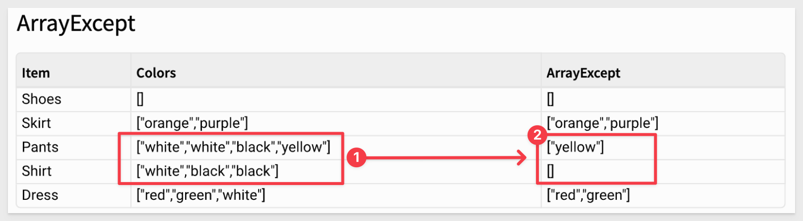

This can be a big time saver!

For more information, see [ArrayExcept](https://help.sigmacomputing.com/docs/arrayexcept)


<!-- END OF SECTION-->


## New QuickStarts in July
Duration: 20

[Fundamentals 10: Data Modeling](https://quickstarts.sigmacomputing.com/guide/fundamentals_10_data_modeling/index.html?index=..%2F..index#0)

In this QuickStart, we explore how to build a Sigma data model, join and organize tables, create calculated fields and metrics, apply column-level security, and improve usability through folders and materialization. With these tools, you're ready to deliver clean, consistent, and secure data to your users—all without writing SQL.


<!-- END OF SECTION-->

## Workbooks
Duration: 20

### Custom totals and subtotals for pivot tables and grouped tables (Beta)
In a pivot table or grouped table, you can change the way that totals and subtotals are calculated by choosing to change the aggregate used for a subtotal, or modifying the formula for a grand total or subtotal directly.

With this update, the default names of subtotals and totals update to `Column Name total` for subtotals or `Grand total` for totals. You can change the label of any subtotal or grand total.

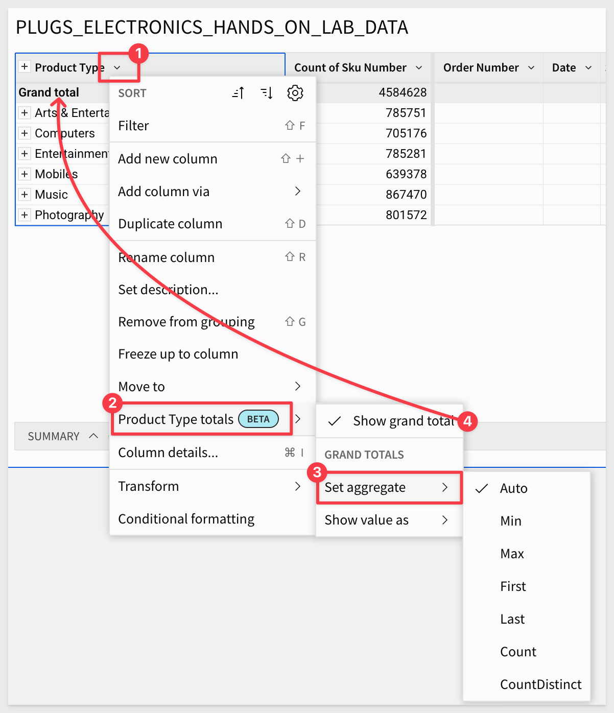

For more information, see [Customize totals and subtotals (Beta)](https://help.sigmacomputing.com/docs/pivot-table-subtotals#customize-totals-and-subtotals-beta)

### Customize element styles in a workbook layout
You can now customize the styling of data elements such as tables, input tables, visualizations, and UI elements. 

- Add or remove padding, change the corner style, add a border, and change the text alignment for text elements.

- Set default styles in an organization theme, customize styles for an entire workbook in the workbook settings, or style individual elements.

For more information, see [Customize element background and styles](https://help.sigmacomputing.com/docs/customize-element-background-and-styles) and [Workbook settings overview](https://help.sigmacomputing.com/docs/workbook-settings-overview)

### Dependent materialization schedules (Beta)
You can now set up dependent materialization schedules in workbooks and data models. 

If you materialize both parent and child elements in a workbook or data model, you can set up materialization schedules that include child elements to run after the parent materialization schedule completes.

For more information, see: [Schedule materialization for a data model or workbook](https://help.sigmacomputing.com/docs/schedule-materialization-for-a-data-model-or-workbook#set-up-a-dependent-materialization-schedule)

<aside class="negative">
<strong>NOTE:</strong><br> This functionality is not available for dataset materializations.
</aside>

### Format Slack messages in exports
You can now add formatting to Slack messages, such as hyperlinks and text formatting which help the notification gain visibility in Slack.

For more information, see [Export to Slack](https://help.sigmacomputing.com/docs/export-to-slack)

### Export from Amazon Redshift connections to S3 buckets (Beta)
You can now export data from a Redshift connection to an Amazon S3 bucket.

For more information, see: [Export to cloud storage (Beta)](https://help.sigmacomputing.com/docs/export-to-cloud-storage)


<!-- END OF SECTION-->

## Additional Information
Duration: 20

**Additional Resource Links**

[Blog](https://www.sigmacomputing.com/blog/)<br>
[Community](https://community.sigmacomputing.com/)<br>
[Help Center](https://help.sigmacomputing.com/hc/en-us)<br>
[QuickStarts](https://quickstarts.sigmacomputing.com/)<br>
<br>

[](https://twitter.com/sigmacomputing)&emsp;
[](https://www.linkedin.com/company/sigmacomputing)&emsp;
[](https://www.facebook.com/sigmacomputing)


<!-- END OF SECTION-->
