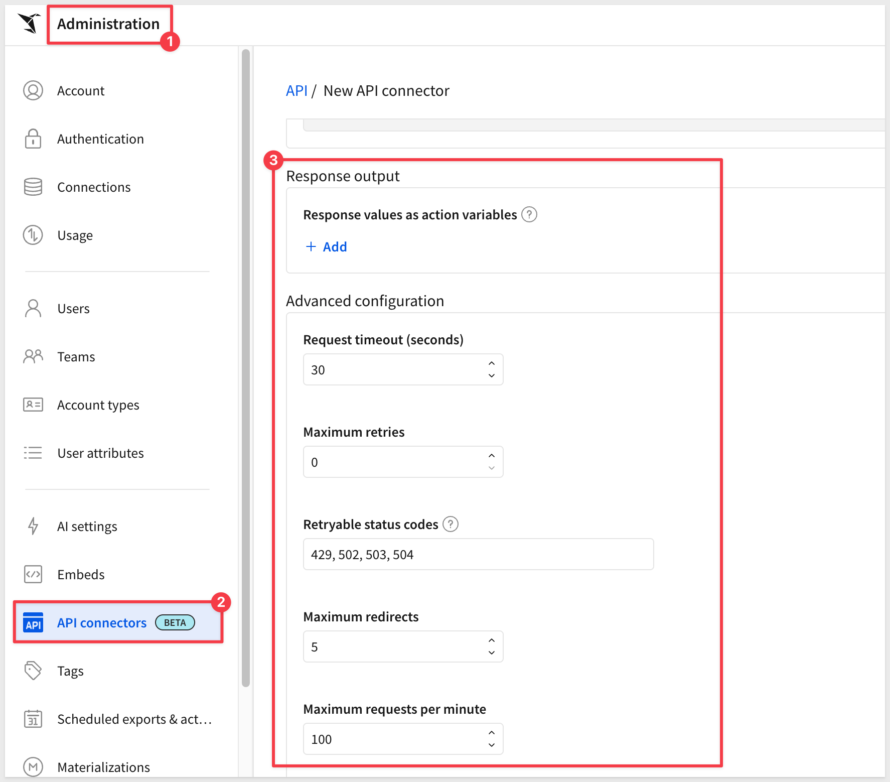

author: pballai
id: 04_2026_first_friday_features
summary: 04_2026_first_friday_features
categories: firstfridayfeatures
environments: web
status: Published
feedback link: https://github.com/sigmacomputing/sigmaquickstarts/issues
tags: first_friday_features
lastUpdated: 2026-06-14

# (04-2026) April
<!-- The above name is what appears on the website and is searchable. 

April 3, 2026 changes: k
April 10th, 2026 changes:k
April 17, 2026 changes:k
April 24, 2026 changes:k
April 30, 2026 changes:

Publish on May 1
 
-->

## Overview 
Duration: 5 

This QuickStart lists all the new and public beta features released, as well as bugs fixed in April 2026.

It is a summary in nature, and you should refer to the specific Sigma documentation links provided for more information.

**Public beta features will carry the section text "Beta".**

All other features are considered released (**GA** or generally available)

Sigma actually has feature and bug fix releases weekly, and high-priority bug fixes on demand. We felt it was best to keep these QuickStarts to a summary of the previous month for your convenience.

New first Friday features QuickStarts will be published on the first Friday of each month, and will include information for the previous month.

### Subscribe to What's New in Sigma
For those wanting to see what Sigma is doing on each week, release notes are now also available on the [Sigma Community site](https://community.sigmacomputing.com/) There, you can **opt in to receive notifications about future release notes** in order to stay on top of everything new happening at Sigma. You can also subscribe to automated updates in any Slack channel using the Sigma Community release notes RSS feed. 

For more information on how to subscribe to release note notifications, see [About the release notes](https://community.sigmacomputing.com/t/about-the-release-notes-category/5517) 

<aside class="positive">
<strong>IMPORTANT:</strong>  Some screens in Sigma may appear slightly different from those shown in QuickStarts. This is because Sigma continuously adds and enhances functionality. Rest assured, Sigma’s intuitive interface ensures that any differences will not prevent you from successfully completing any QuickStart.
</aside>

For more information on Sigma's product release strategy, see [Sigma product releases](https://help.sigmacomputing.com/docs/sigma-product-releases)

If something is not working as you expect, here's how to [contact Sigma support](https://help.sigmacomputing.com/docs/sigma-support)

<!-- END OF SECTION-->

## Administration
Duration: 20

### Azure Blob Storage Integration (GA)
Organizations can now integrate customer-owned Azure Blob containers with Sigma, supporting CSV uploads, file uploads in input tables, and cloud storage exports. This joins existing AWS and GCP options, giving organizations direct control over file location, access, retention, and encryption.

For more information, see [Configure an external storage integration with Azure Blob Storage](https://help.sigmacomputing.com/docs/configure-an-external-storage-integration-with-azure-blob)

**WHY IT MATTERS:** 
Organizations can now route file uploads and exports through their own Azure Blob containers, keeping data within their cloud environment. This matters for customers with data residency, compliance, or security requirements that prevent third-party storage.

### Connection-level OAuth for Snowflake and Databricks (GA)
For Snowflake or Databricks connections, you can configure connection-level OAuth to manage role-based access control and data permissions in your data platform without reusing the OAuth configuration used to authenticate to your Sigma organization.

Connection-level OAuth is also available for Google BigQuery, but is still in beta.

For more information, see [About using OAuth with Sigma](https://help.sigmacomputing.com/docs/configure-oauth)

For setup instructions, see [Connect to Snowflake with OAuth](https://help.sigmacomputing.com/docs/connect-to-snowflake-oauth) or [Connect to Databricks with OAuth](https://help.sigmacomputing.com/docs/connect-to-databricks-oauth)

**WHY IT MATTERS:** 
This decouples authentication for the data platform from authentication to Sigma, giving administrators independent control over data permissions without sharing credentials across systems. It's a foundational security pattern for enterprises that require fine-grained, role-based data access.

### CSV upload limit to 1GB option (GA) 
By default, Sigma limits CSV uploads to 200MB to avoid timeouts and failures that can be common with large files. 

If your organization's users regularly work with larger files, you can increase the file size limit to 1GB. 

When this option is enabled, Sigma generates pre-signed URLs, and the browser uploads the CSV files in multiple parts directly to cloud storage, bypassing Sigma's servers. This flow supports larger file sizes while improving performance and reliability.

For more information, see [Configure CSV upload and storage options](https://help.sigmacomputing.com/docs/configure-csv-upload-and-storage-options)

### Improved search functionality
If your organization configures an AI provider, Sigma provides enhanced global search performance using semantic search.

For more information, see [Search for content in your organization](https://help.sigmacomputing.com/docs/search-in-sigma)

### Set a tagged workbook as a custom homepage
You can now specify a tagged version of a workbook when assigning a custom homepage to a user or team. 

For more information, see [Set up custom home pages](https://help.sigmacomputing.com/docs/enable-a-custom-homepage)

### Set variables on a Snowflake connection (Beta)
You can now specify session variables on a Sigma connection to Snowflake. After being set up, the session variables are set for each query that Sigma runs in Snowflake.

For more information, see [Specify session variables for a Snowflake connection](https://help.sigmacomputing.com/docs/specify-session-variables-for-a-snowflake-connection)

**WHY IT MATTERS:** 
Session variables let administrators enforce query context — such as cost centers, row-level security tags, or audit fields — at the connection level before any query runs. This is particularly useful for multi-tenant deployments or organizations enforcing Snowflake row access policies.

<!-- END OF SECTION-->

## AI
Duration: 20

### Ask Sigma is now Sigma Assistant 
Ask Sigma is now Sigma Assistant, and includes the following:

- Improved accuracy and performance when answering questions and performing analysis.
- Higher quality data source selection, relying on a new semantic search service that indexes configured sources using the AI provider set up for your organization.
- Improved experience, including the ability to provide feedback on the quality of responses.
- Highlighted sources are now configured sources, and the steps to add configured data sources for Assistant are updated. Configure sources for Sigma Assistant to answer questions without selecting a data source.
- Configure data models as data sources to improve accuracy and capabilities. When Sigma Assistant uses data models to answer questions, it can choose which relationships to use.

If you embed Ask Sigma, Sigma Assistant is accessible from the same URL and existing embeds continue to work.

For more information, see [Ask natural language queries with Sigma Assistant](https://help.sigmacomputing.com/docs/ask-natural-language-queries-with-assistant)

### Sigma MCP Server is now available 
Use natural language to interact programmatically with your Sigma organization using the Sigma MCP server. You can now search, describe, and query data within your AI assistant's interface. You can connect to the Sigma MCP server from any AI assistant that supports connection to custom remote MCP servers via HTTP and OAuth.

For more information, see [Use the Sigma MCP Server](https://help.sigmacomputing.com/docs/use-sigma-mcp-server)

There is also a QuickStart, [Natural Language Analytics with Claude and Sigma](https://quickstarts.sigmacomputing.com/guide/aiapps_natural_language_with_claude/index.html?index=..%2F..index#0)

### Snowflake AI Provider Model Update
AWS-hosted Snowflake connections now use `claude-sonnet-4-5` as the language model for Sigma Assistant.

For more information, see [Configure a warehouse-hosted model as AI provider](https://help.sigmacomputing.com/docs/configure-warehouse-ai-model-integration)

<!-- END OF SECTION-->

## AI Apps
Duration: 20

### Custom sort action (GA)
The `Custom sort action` is now generally available.

This action enables you to create an action that sorts one or more columns in a target element.

For more information, see [Create actions that modify or refresh element](https://help.sigmacomputing.com/docs/create-actions-that-modify-or-refresh-elements)

### Forms (GA) 
Forms are now generally available. They provide a structured data entry interface that can be created manually or built on an existing input table or stored procedure. Forms support simultaneous submission to multiple sources and can trigger action workflows.

For more information, see [Use forms to streamline user data entry](https://help.sigmacomputing.com/docs/use-forms-to-streamline-user-data-entry)

For a hands-on walkthrough, see the [Forms QuickStart](https://quickstarts.sigmacomputing.com/guide/aiapps_forms/index.html)

### Input Table Audit History (Beta) 
Sigma now records versioned snapshots of input table changes, automatically creating warehouse-native views that track row-level history — what changed, who made the change, and when. Schema modifications are also captured.

For more information, see [View input table audit history](https://help.sigmacomputing.com/docs/view-input-table-audit-history)

<!-- END OF SECTION-->

## API
Duration: 20

### Advanced governance settings for API connectors
You can configure advanced settings for API connectors to manage rate limits, redirect rules, and retries.

For more information, see [Configure API credentials and connectors in Sigma](https://help.sigmacomputing.com/docs/configure-api-credentials-and-connectors-in-sigma#configure-governance-settings-for-an-api-connector)

### Create and manage data models as code (GA)
You can create and manage data models programmatically using the Sigma API. The endpoints use a code representation of the data model to retrieve contents, make updates, and create new data models.

The following endpoints are generally available to read, create, and update data models programmatically:

[Get the code representation of a data model](https://help.sigmacomputing.com/reference/getdatamodelspec)

[Create a data model from a code representation](https://help.sigmacomputing.com/reference/createdatamodelspec)

[Update a data model from a code representation](https://help.sigmacomputing.com/reference/updatedatamodelspec)

For example representations of sources and elements, see the [Data model representation example library](https://help.sigmacomputing.com/docs/data-model-representation-example-library)

To provide context to AI agents building data models from code, see [Access Sigma documentation from AI tools](https://help.sigmacomputing.com/docs/use-documentation-mcp-server)

**WHY IT MATTERS:** 
Data models can now be created and updated programmatically, enabling version-controlled, repeatable deployment workflows. Teams managing large or multi-environment Sigma deployments can treat data model configuration as infrastructure — consistent, auditable, and automatable.

### List scheduled exports for a user
The following endpoint to list all scheduled workbook and report exports owned by a specific user is now available:

List scheduled exports for a user (GET /v2/members/{memberId}/schedules)

### List Warehouse Table Columns
A new endpoint, `GET v2/connections/tables/{tableId}/columns`, enables retrieval of column names, types, and details for data warehouse tables.

For more information, see [listConnectionTableColumns](https://help.sigmacomputing.com/reference/listconnectiontablecolumns)

### New query parameter for List data models endpoint
The List data models (GET v2/dataModels) endpoint now includes the skipPermissionCheck query parameter. When set to true, this parameter allows the API client to return all data models in a Sigma organization, including those not shared with or owned by the requesting user. The API client must have admin privileges to use this parameter.

<!-- END OF SECTION-->

## Bug Fixes
Duration: 20

**1:** Image elements with Circle shape now align properly with Horizontal/Vertical alignment settings.

**2:** Tabbed container exports now render the selected tab instead of the first tab only (excluding scheduled exports).

**3:** Databricks OAuth connection creation no longer requires a service account.

**4:** The `pageSize` parameter is now respected in the List documents deployment policy endpoint.

**5:** Data model version tagging and source swapping with `#raw` directives now functions correctly.

**6:** `SCHEMA.TABLE` path length errors during deployment policy source swaps are resolved.

**7:** Dataset migration now updates workbook references to point to the new data model in cases where the dataset was used as part of a join or union.

**8:** If you edit a document using the API, such as by swapping a data source or editing a data model using the `Update a data model` from a code representation endpoint, there is now a prompt to discard stale changes and include the updates in the document the next time it is opened in the UI.

**9:** Editing SQL for datasets now completes as expected and no longer runs infinitely.

**10:** When validating content in a data model or migrating a dataset to a data model with `Update references` selected, downstream documents no longer fail to update due to a permission error.

**11:** Workbooks no longer fail to load when a column exists across multiple properties in an element.

**12:** For organizations with greater than 15,000 user attributes, it was not possible to specify a user attribute to dynamically set a role or warehouse for a Snowflake connection.

**13:** Users in tenant organizations were unable to duplicate or tag versions of deployed documents.

<!-- END OF SECTION-->

## Charts
Duration: 20

### Chart Background Images (Beta)
Cartesian charts — including bar, line, scatter, area, waterfall, box/whisker, and combo charts — now support background image configuration. Images can be set via file upload or a dynamic URL formula reference.

For more information, see [Configure a custom background image for a chart](https://help.sigmacomputing.com/docs/customize-chart-background-and-style#configure-a-custom-background-image-for-a-chart-beta)

### Change legend position in map elements
You can now choose the location of the legend on a map. 

Navigate to `Format` > `Legend` and, next to `Position`, choose an option from the dropdown.

### Control pan and zoom for maps
You can now choose whether to allow pan and zoom for maps. Select the `Allow pan and zoom` checkbox under `Format` > `Map` style to allow users to freely pan and zoom, or clear the checkbox to lock a map chart to a fixed position and zoom level.

### Customize data label display for bar charts
If you add a custom data label to a stacked bar chart, you can now choose to display the label as the value for the entire bar, the value for the individual segment, or both.

### Set chart axis range dynamically
You can now set a maximum or minimum range for a chart axis dynamically using a formula that references columns or controls in your workbook or report. 

For more information, see [Customize chart axis range](https://help.sigmacomputing.com/docs/customize-chart-axis-range)

<!-- END OF SECTION-->

## Data Modeling
Duration: 20

### Add AI context to data models (Beta)
You can now add AI context to a data model to help Sigma Assistant better understand how to use your data model as a data source. Adding AI context to a data model can help improve the accuracy and consistency of Sigma Assistant responses when answering questions that use the data model as a source.

For more information, see [Manage AI context for data models](https://help.sigmacomputing.com/docs/manage-ai-context-for-data-models)

### Swap data model sources when accepting a shared template
Data models used as sources in a shared template are now available to be swapped when you accept a template shared with your organization. 

You can swap data models to tables in your connection or to other data models in your organization. 

If a template includes multiple data models as sources, you can accept the template and swap the sources.

<!-- END OF SECTION-->

## Embedding
Duration: 20

### New Embed URL Parameter: hide_save_as
A new URL parameter, `:hide_save_as`, hides the `Save As` option in embedded content.

For more information, see [Embed URL parameters](https://help.sigmacomputing.com/docs/embed-url-parameters)

<!-- END OF SECTION-->

## Functions / Calculations
Duration: 20

### Databricks Variant Data Type (GA)
Sigma now natively supports the Databricks Variant data type, enabling handling of arrays and JSON structures using Variant, JSON, and Array functions.

### System Functions in Custom SQL
System functions are now accessible via the `#formula` directive in custom SQL, returning workbook context information such as username, email, and timestamp.

For more information, see [Write custom SQL](https://help.sigmacomputing.com/docs/write-custom-sql)

<!-- END OF SECTION-->

## Input Tables
Duration: 20

### Copy input table data to tenant organizations (Beta)
When deploying documents to tenant organizations, you can now choose to include the data from input tables in the deployed document.

For details, see [Deploy content to tenant organizations](https://help.sigmacomputing.com/docs/deploy-content-to-tenant-organizations)

### Input table audit history (GA) 
Input table audit history is now generally available.

Input table audit history records versioned snapshots of input table row and schema changes over time. For each input table, Sigma automatically creates a warehouse-native view in your data platform that can help you understand the following:

- Row-level history: What changed in a specific row, who made the change, and when the change occurred.
- Schema history: When a column was created or changed to a different data type, along with who made the change and when the change occurred.

For more information, see [View input table audit history](https://help.sigmacomputing.com/docs/view-input-table-audit-history)

**WHY IT MATTERS:** 
Row-level and schema change history stored as warehouse-native views gives organizations an auditable record of who changed what and when — without relying on Sigma logs. This directly addresses compliance and data governance requirements in regulated industries.

<!-- END OF SECTION-->

## New QuickStarts in April
Duration: 20

### Natural Language Analytics with Claude and Sigma 
[This QuickStart](https://quickstarts.sigmacomputing.com/guide/aiapps_natural_language_with_claude/index.html?index=..%2F..index#0) shows how to connect Claude AI to your Sigma organization using the Sigma MCP server and use that connection to do real analytical work — finding content, understanding data structure, and getting answers from live data through natural language.

It walks through how to:
* Connect Claude to Sigma via the Sigma MCP Server using OAuth
* Configure a Claude Project with org-specific context to improve response quality
* Search your Sigma organization for relevant workbooks and data sources
* Query live Sigma data and receive answers in plain language — no SQL required

**WHY IT MATTERS:** 
This is the governed external AI pattern — Claude inherits your Sigma permissions via OAuth, so administrators retain full control over what data is reachable. A well-configured Claude Project with org context turns Claude into an analyst that already knows your data landscape before the first question is asked, reducing friction between a business question and a grounded answer.

### Reshaping Data with Transpose Tables
[This QuickStart](https://quickstarts.sigmacomputing.com/guide/tables_transpose_tables/index.html?index=..%2F..index#0) shows how to use Sigma's Transpose table to reshape source data in two directions — converting stacked row values into columns for side-by-side comparison, and collapsing wide metric columns into a single long-format column for grouping and charting.

It walks through how to:
* Add a Transpose table from any source table using Element source > Transpose
* Configure Row to Column — selecting a label column, value column, aggregate, and output dimensions
* Configure Column to Row — collapsing multiple metric columns into a single labeled measure
* Add grouping and calculations within the Transpose element to complete the analysis

**WHY IT MATTERS:** 
Most warehouse data arrives in a shape that isn't directly analysis-ready — dimension values stacked in rows when you need them as column headers, or related metrics split across separate columns when you need a single measure. Transpose handles both in Sigma, on live data, without SQL or ETL work. The pattern applies broadly: any time your data is too narrow or too wide for the view you need, Transpose is the right tool.

### Scheduling Sigma Insights to Slack 
[This QuickStart](https://quickstarts.sigmacomputing.com/guide/aiapps_scheduling_sigma_insights_to_slack/index.html?index=..%2F..index#0) shows how to connect Claude to Sigma using the Sigma MCP server and use the claude.ai Slack connector to deliver a formatted daily sales digest automatically — with fresh data on every run.

It walks through how to:
* Connect Claude to Sigma via the Sigma MCP server in claude.ai
* Query live Sigma data and iterate on a Slack-ready format in the browser
* Confirm end-to-end Slack delivery before committing to a schedule
* Use Claude Code's /schedule command to turn the workflow into a recurring routine

**WHY IT MATTERS:** 
This is the "no dashboard, no pipeline" automation pattern — Sigma governs the data, Claude reasons over it, and the result lands in Slack on a recurring schedule with fresh data every time. It demonstrates what Sigma and Claude can do together: analytical questions answered automatically, delivered where teams already work. The same approach applies to any recurring data question your team needs answered on a regular cadence.

<!-- END OF SECTION-->

## Security
Duration: 20

### AWS signature V4 authentication for API connectors
API connectors now support the AWS signature V4 authentication method.

AWS Signature Version 4 (SigV4) is the protocol used to authenticate API requests to Amazon Web Services. It verifies the identity of the requester and ensures that the request has not been tampered with during transit.

For AWS supplied information, see [Authenticating Requests (AWS Signature Version 4)](https://docs.aws.amazon.com/AmazonS3/latest/API/sig-v4-authenticating-requests.html)

For more information, see [Configure API credentials and connectors in Sigma](https://help.sigmacomputing.com/docs/configure-api-credentials-and-connectors-in-sigma#add-a-new-api-credential-to-sigma)

<!-- END OF SECTION-->

## Workbooks
Duration: 20

### Add Control from Column 
Right-clicking a column name now surfaces an `Add control` option, streamlining control creation directly from the column context menu.

For more information, see [Create and manage a control element](https://help.sigmacomputing.com/docs/create-and-manage-a-control-element)

### Automatically scale column width to the size of your table element
You can now configure columns to automatically scale to the size of your table element with the `Autofit columns` option. 

Autofit columns is not supported for pivot tables.

For more information, see [Format and customize a table](https://help.sigmacomputing.com/docs/format-and-customize-a-table#autofit-columns)

### Dynamic Column Aliases (Beta)  
Control values can now be used to create dynamic column aliases via the `#identifier` directive in SQL, enabling formula-based column naming.

For more information, see [Reference workbook control values in SQL statements](https://help.sigmacomputing.com/docs/reference-workbook-control-values-in-sql-statements)

### Repeated container (GA)  
The repeated container is a layout element that connects to a data source. For each row in the data source, the repeated container generates a layout card, allowing you to quickly generate identical, dynamic layouts from your data.

For more information, see [Use repeated containers to generate layouts from data](https://help.sigmacomputing.com/docs/use-repeated-containers-to-generate-layouts-from-data)

**WHY IT MATTERS:** 
Repeated containers make it straightforward to build card-based layouts — product listings, customer profiles, ticket queues — driven directly from data. The pattern replaces static grid layouts with dynamic, data-bound views that scale with the underlying dataset.

### Single row container (GA)  
The single row container is a layout element that connects to a data source. By selecting a key column and value, you can choose a row from the data source to display inside the container, allowing for dynamic, focused views at individual rows.

For more information, see [Use single row containers to show records in detail](https://help.sigmacomputing.com/docs/use-single-row-containers-to-show-records-in-detail) and [Create actions that control single row containers](https://help.sigmacomputing.com/docs/create-actions-that-control-single-row-containers)

**WHY IT MATTERS:** 
Combined with actions, the single row container enables record-detail views where selecting a row in a table populates a dedicated layout with that record's full context. This is the core pattern for building operational record browsers without custom code.

### Value list (GA)  
Add a value list element to create an organized display of details from a data source. 

You can customize the value list to show custom formula results, control values, static values, and more. 

When paired with a single row container, you can create a dynamic list that shows individual records from a data source based on user input.

For more information, see [Value lists](https://help.sigmacomputing.com/docs/value-lists)

<!-- END OF SECTION-->

## Additional Information
Duration: 20

**Additional Resource Links**

[Blog](https://www.sigmacomputing.com/blog/) 
[Community](https://community.sigmacomputing.com/) 
[Help Center](https://help.sigmacomputing.com/hc/en-us) 
[QuickStarts](https://quickstarts.sigmacomputing.com/) 
 

<button>[Sigma Free Trial](https://www.sigmacomputing.com/free-trial/)</button>

&emsp;
&emsp;

<!-- END OF SECTION-->
