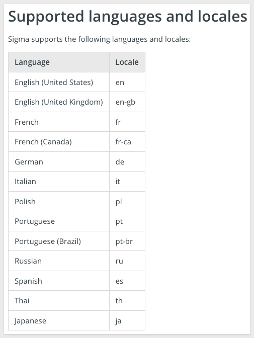
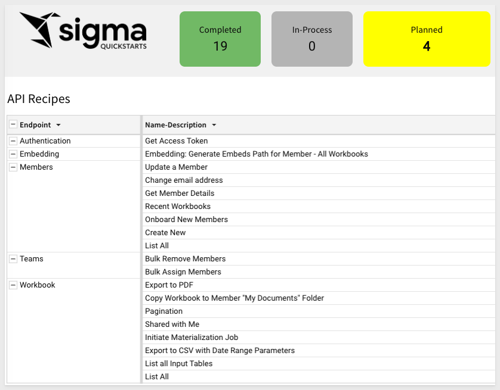
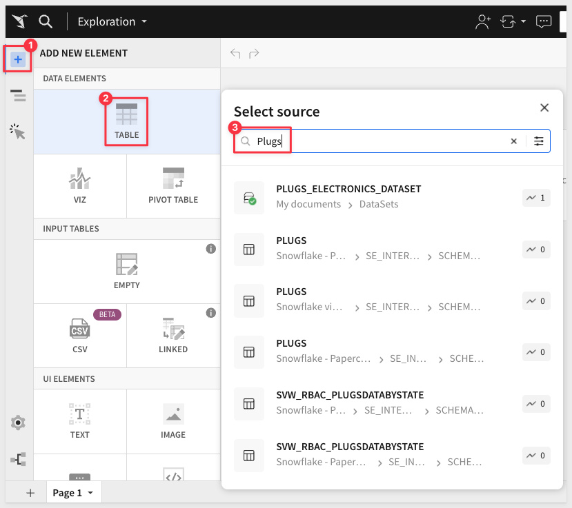
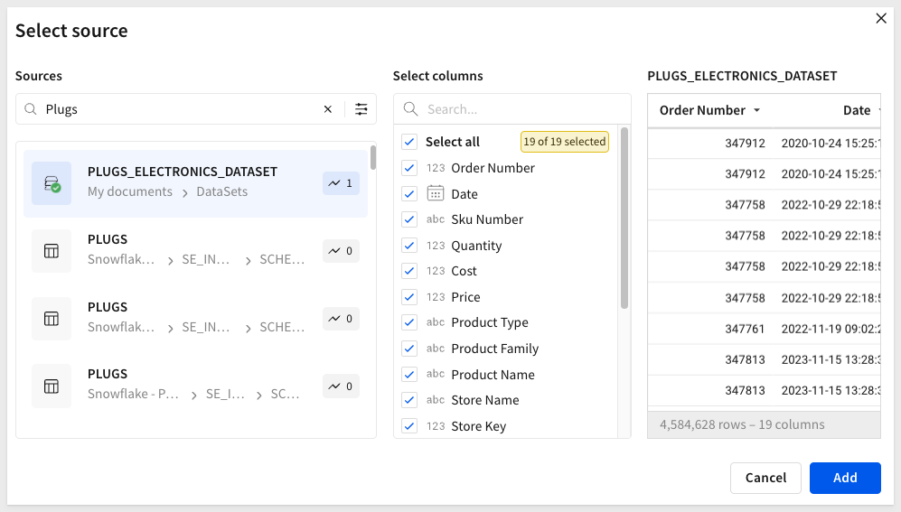

author: pballai
id: 05_2024_first_friday_features
summary: 05_2024_first_friday_features
categories: Administration
environments: web
status: Published
feedback link: https://github.com/sigmacomputing/sigmaquickstarts/issues
tags: first_friday_features
lastUpdated: 2024-04-31

<-- 
May 10th, 2024 - Done
May 17th, 2024 - Done
May 24th, 2024

!-->

# (05-2024) May
<!-- The above name is what appears on the website and is searchable. -->

## Overview 
Duration: 5 

This QuickStart lists all the new and public beta features released, as well as bugs fixed in May 2024.

It is summary in nature, and you should refer to the specific Sigma documentation links provided for more information.

**Public beta features will carry the section text "Beta".**

All other features are considered released (**GA** or generally available).

Sigma actually has feature and bug fix releases weekly, and high-priority bug fixes on demand. We felt it was best to keep these QuickStarts to a summary of the previous month for your convenience.

New first Friday features QuickStarts will be published on the first Friday of each month, and will include information for the previous month.

## Administration
Duration: 20

### Organization translation files
We have made it easier to serve Sigma users in your organization and consumers of embedded analytics with content in their preferred language.

Sigma admins can create organization-wide `translation files` to translate custom strings that are common across workbooks in an organization, saving time and ensuring a consistent experience. 

Workbook owners inherit the organization-level translations and can override and supplement them with translations unique to an individual workbook. For more information, see:

[Manage organization translation files](https://help.sigmacomputing.com/docs/manage-organization-translation-files)
[Manage workbook localization](https://help.sigmacomputing.com/docs/manage-workbook-localization)
[New translations API endpoints](https://help.sigmacomputing.com/reference/change-log#new-translations-api-endpoints)

## API
Duration: 20

### New API reference and recipes
We have migrated to a new API Reference platform that is far more feature rich while being easier to use.

All API reference documentation has moved [here.](https://help.sigmacomputing.com/reference/get-started-sigma-api)

The new structure for the API reference offers better in-line documentation for endpoints and interactive code samples in a variety of languages:

In addition, we have published API code samples ([Recipes](https://help.sigmacomputing.com/recipes)) and a [corresponding QuickStart](https://quickstarts.sigmacomputing.com/guide/administration_api_code_samples/index.html?_gl=1*2dnp9q*_ga*ODgwOTI4NTIyLjE3MTM1NjI2OTE.*_ga_PMMQG4DCHC*MTcxNjU3MzM1OC4yOC4xLjE3MTY1NzM0MTMuNS4wLjA.#0) that walks you through real-world code examples using the API. 

All the current "Recipes" are written in JavaScript today. The recipes can be downloaded individually from the [Recipes page]() and are also available in a public [Git repository]().

The following Recipes are available today:

## Bug Fixes
Duration: 20

**1:** Administrators can no longer circumvent UI restrictions to raise privileges of guest and embed users.  
**2:** Sigma no longer throws an error when multiple embeds attempt to add a new user at the same time.  

## Data models (BETA)
Duration: 20

## Input Tables
Duration: 20

### CSV input tables
You can now pre-populate a new input table with uploaded CSV data that you can then edit at the cell level.

Like empty input tables, CSV input tables support data entry independent of existing data, enabling you to add editable rows and columns to construct the table as you see fit.

For more information, [see Intro to input tables](https://help.sigmacomputing.com/docs/intro-to-input-tables) and [Create new input tables.](https://help.sigmacomputing.com/docs/create-new-input-tables)

## Embedding
Duration: 20

### Embed Events (formally known as Action and Events):
To avoid confusion with Sigma's new [Actions feature](https://help.sigmacomputing.com/docs/intro-to-actions), we have renamed embedded Actions and Events to `Embed Events`. 

There are two types:
**Inbound Events:**
Are variables sent from the Parent application to Sigma. There is no "listener" to code into the iframe; Sigma handles that out-of-the-box. Sigma can use these messages to update control values. For example, passing a new value to a Sigma control that is used to filter table data.

Inbound events can be passed using either JavaScript or URL.

**Out-bound Events:**
Are variables sent from Sigma to the Parent application which must have a "listener" coded into the Parent application to receive and react to the message as desire

For more information, see [Implement inbound and outbound events in embeds.](https://help.sigmacomputing.com/docs/inbound-and-outbound-events-in-embeds)

Embed Events are discussed and demonstrated in this [QuickStart.](https://quickstarts.sigmacomputing.com/guide/embedding_07_events/index.html?index=..%2F..index#0)

### New Embedded Events
Sigma has added many new events to support existing and new functionality.

#### New Inbound events:
workbook:bookmark:create
workbook:fullscreen:update
workbook:selectednodeid:update
workbook:variables:list
workbook:variables:update

#### New Outbound events:
url:onchange
workbook:bookmark:oncreate
workbook:chart:error
workbook:dataloaded
workbook:error
workbook:fullscreen:onchange
workbook:id:onchange
workbook:pageheight:onchange
workbook:pivottable:oncellselect
workbook:published

For more information, see [Implement inbound and outbound events in embeds.](https://help.sigmacomputing.com/docs/inbound-and-outbound-events-in-embeds)

## Functions
Duration: 20

## New QuickStarts in May
Duration: 20

### 
Sigma REST API Recipes

This [QuickStart](https://quickstarts.sigmacomputing.com/guide/administration_api_code_samples/index.html?_gl=1*2dnp9q*_ga*ODgwOTI4NTIyLjE3MTM1NjI2OTE.*_ga_PMMQG4DCHC*MTcxNjU3MzM1OC4yOC4xLjE3MTY1NzM0MTMuNS4wLjA.#0) is designed to support Sigma's API Recipes and demonstrates many common operations that customers may use the REST API for.

## Visualizations
Duration: 20

### Dynamic button text
You can now add dynamic values to button elements. 

When configuring the button text, enter `=` to include a dynamic value defined by a formula expression.

For more information about buttons, see [Create a button element.](https://help.sigmacomputing.com/docs/create-a-button-element)

## Workbooks
Duration: 20

### Embedding Sigma's documentation now supported
Many customers provide useful information on how to best use Sigma workbooks directly in the workbook itself. 

There are time when it can be used to embed specific Sigma documentation content from the Sigma help pages. 

This is quite easy to do now using the [Embed element](https://help.sigmacomputing.com/docs/intro-to-ui-elements#embed-element)

For example, you may want to provide a basic introduction to your new users on how to get started with Sigma:

Another example is to provide the list of popular functions that are available:

Users will appreciate the time saved by avoiding opening another browser page to access documentation.

### Improved data source selection UI
Select data sources for workbook elements using a new popover UI. 

With the new experience, you can `search` for data sources, `review` a list of suggested sources, and `preview` data sources. 

Preview a data source to review the source data and choose specific columns to apply to the element:

For more information, see [Create a data element.](https://help.sigmacomputing.com/docs/create-a-data-element)

## Additional Information
Duration: 20

**Additional Resource Links**

[Blog](https://www.sigmacomputing.com/blog/) 
[Community](https://community.sigmacomputing.com/) 
[Help Center](https://help.sigmacomputing.com/hc/en-us) 
[QuickStarts](https://quickstarts.sigmacomputing.com/) 
 

&emsp;
&emsp;

