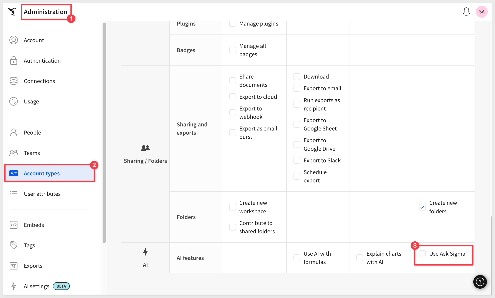
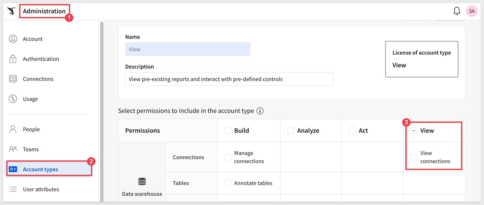
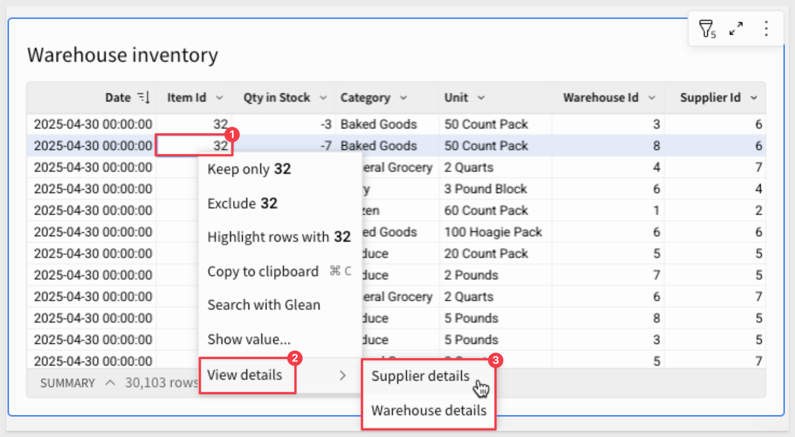
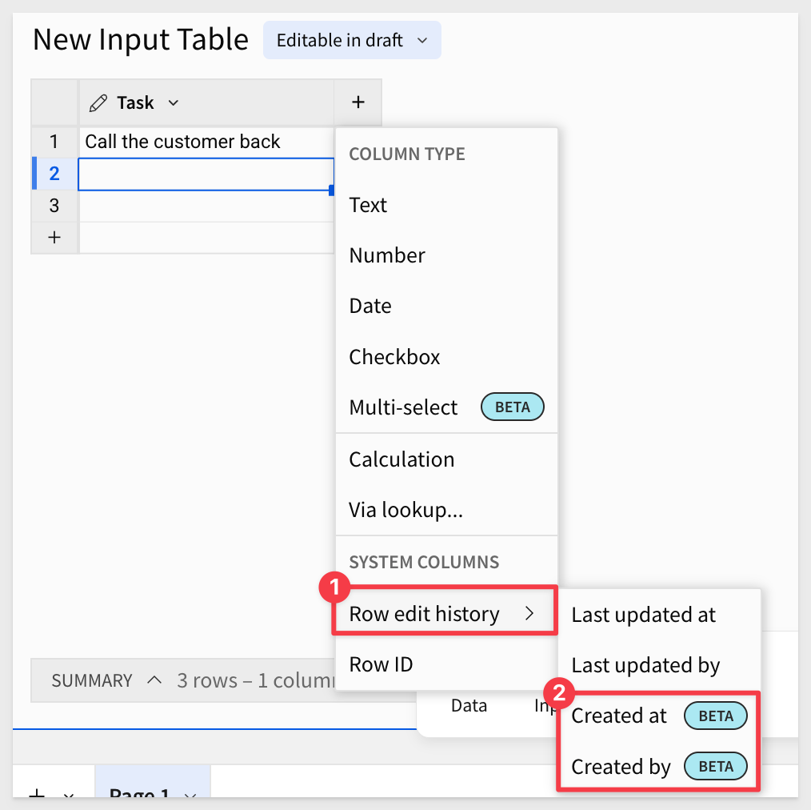
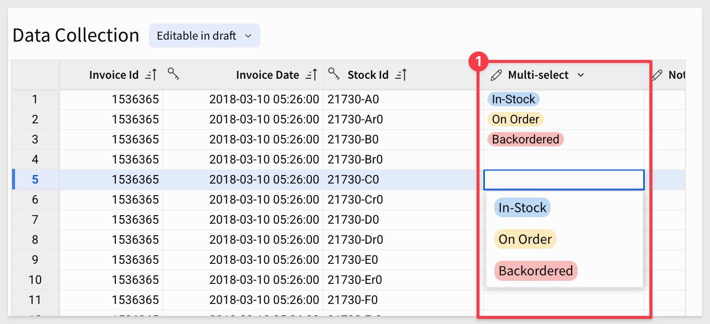
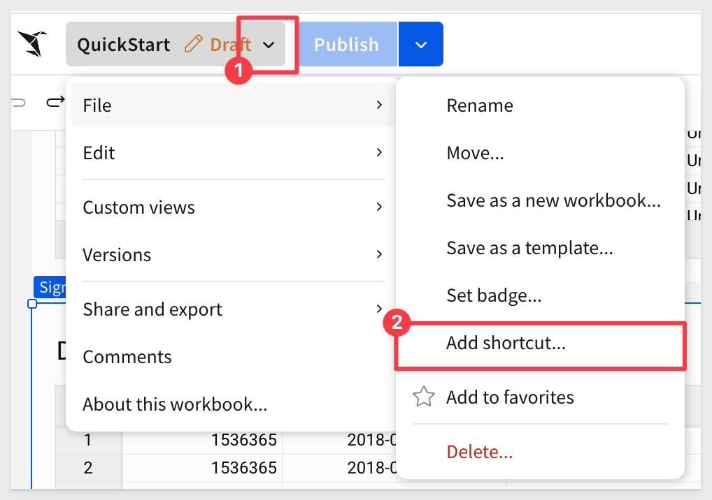
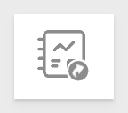
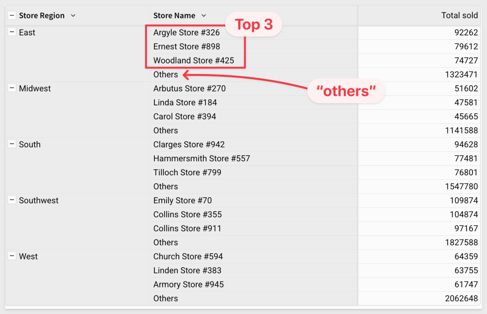
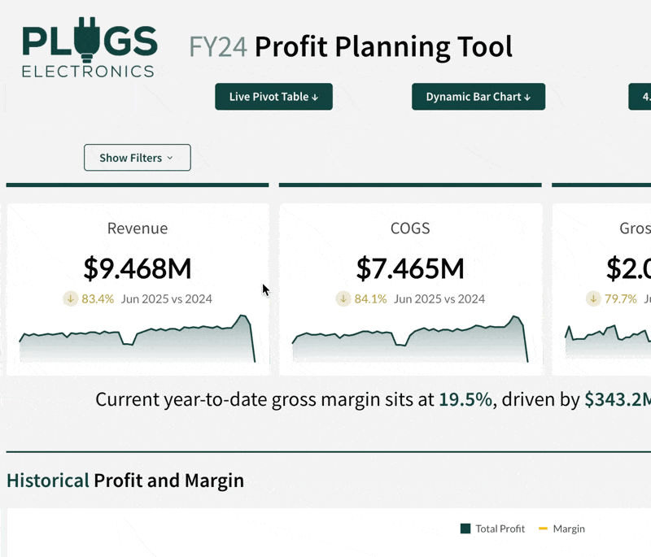

author: pballai
id: 05_2025_first_friday_features
summary: 05_2025_first_friday_features
categories: firstfridayfeatures
environments: web
status: Published
feedback link: https://github.com/sigmacomputing/sigmaquickstarts/issues
tags: first_friday_features
lastUpdated: 2025-05-06

# (05-2025) May
<!-- The above name is what appears on the website and is searchable. 

02 was included in April
09 done
16 done
23 DONE
30 done
6 June: ?

Publish on 6th June


-->

## Overview 
Duration: 5 

This QuickStart lists all the new and public beta features released, as well as bugs fixed in May 2025.

It is summary in nature, and you should refer to the specific Sigma documentation links provided for more information.

**Public beta features will carry the section text "Beta".**

All other features are considered released (**GA** or generally available).

Sigma actually has feature and bug fix releases weekly, and high-priority bug fixes on demand. We felt it was best to keep these QuickStarts to a summary of the previous month for your convenience.

New first Friday features QuickStarts will be published on the first Friday of each month, and will include information for the previous month.

<aside class="positive">
<strong>IMPORTANT:</strong><br> Some screens in Sigma may appear slightly different from those shown in QuickStarts. This is because Sigma continuously adds and enhances functionality. Rest assured, Sigma’s intuitive interface ensures that any differences will not prevent you from successfully completing any QuickStart.
</aside>

For more information on Sigma's product release strategy, see [Sigma product releases](https://help.sigmacomputing.com/docs/sigma-product-releases)

If something is not working as you expect, here's how to [contact Sigma support](https://help.sigmacomputing.com/docs/sigma-support)


<!-- END OF SECTION-->

## Administration
Duration: 20

### Alerts before OAuth sessions expire
Users now see an alert message 20 minutes before their connection-level OAuth session expires, prompting them to re-sign into the connection. 

For more information, see [Configure OAuth](https://help.sigmacomputing.com/docs/configure-oauth)

### Allow users with View license to ask natural language queries with Ask Sigma
The `Use Ask Sigma` permission can now be enabled for users with the `View` license (or Lite license). 

No existing account types were changed. 

To enable `Ask Sigma` for users who did not previously have access, update their account types to add the permission:



For more information, see [Account type and license overview](https://help.sigmacomputing.com/docs/account-type-and-license-overview)

<aside class="positive">
<strong>IMPORTANT:</strong><br> To continue analysis in a workbook, a user's account type must also have the Create, edit, and publish workbooks permission enabled.
</aside>

### Allow users with View license to browse connections
The `View connections` permission can now be enabled for users with the `View` license (or Lite license). 

Users with this permission enabled on their account type can view database or catalog, schema, or table names that they have access to. 

<aside class="positive">
<strong>IMPORTANT:</strong><br> This permission does not grant access to data in connections. 
</aside>



For more information, see [Manage access to data and connections](https://help.sigmacomputing.com/docs/manage-data-permissions)

### New permission for calling stored procedure actions
Administrators can now manage which users can call stored procedure actions from a workbook with the `Call stored procedure actions` permission. 

For more information, see [Account type and license overview](https://help.sigmacomputing.com/docs/account-type-and-license-overview)

The permission requires an `Act` or Essentials license. 

<aside class="positive">
<strong>IMPORTANT:</strong><br> Users must also have access to the stored procedure in the connection. 
</aside>

For all requirements, see [Create actions that call stored procedures (Beta)](https://help.sigmacomputing.com/docs/create-actions-that-call-stored-procedures)

### Passing multiple SAML userRole values is now supported
When configuring SAML, it is now possible to pass in multiple `userRole` values. 

The first valid account type in the list of userRole values will be assigned. 

For more information, see [Configure your IdP in Set up single sign-on with SAML](https://help.sigmacomputing.com/docs/single-sign-on-with-saml#configure-your-idp)


<!-- END OF SECTION-->

## Ask Sigma
Duration: 20

### Warehouse AI model integration (Beta) 
If your organization is connected to Snowflake or Databricks, you can now use warehouse-hosted AI models to power Sigma AI features. 

<aside class="positive">
<strong>WHY THIS MATTERS:</strong><br> Customers who have sensitive data may prefer to use their own warehouse provider in order to prevent exposing data to third party providers.
</aside>

For information about selecting your data platform as your organization's AI provider, see [Configure warehouse AI model integration](https://help.sigmacomputing.com/docs/configure-warehouse-ai-model-integration)


<!-- END OF SECTION-->

## Bug Fixes
Duration: 20

**1:** When adding date data in an input table, the format of the data now respects the locale of the Sigma organization. For example, if your Sigma organization uses a locale of English (Great Britain) and you paste a date value of 10.05.2025 into an input table, the date correctly appears as May 10, 2025.

**2:** When adding a version tag to a data model and swapping sources from one connection to another in cases where the table is available at a different path in each connection, the data sources no longer fail to swap with the error "Failed to find the table in connection".

**3:** Users in an embed can no longer open the source of a data model.

**4:** After deactivating a SCIM user, the folder created to contain the deactivated user's documents no longer includes a UUID and matches the behavior described in Deactivated user documents.

**5:** When revoking access to a connection, database or catalog, schema, table, or stored procedure in Sigma, you can now only revoke access from the level to which the access was granted.

**6:** When a user has inherited access to a document from a version-tagged folder, the version tag is now shown in the Share Workbook or Share Data Model modal.

**7:** When sharing a workbook, version tags now appear for all access levels as expected.

**8:** When a user has access to specific version tagged documents in a folder, you can now grant access to all versions of 
documents in the Share Folder modal.

**9:** Archived connections no longer cause unexpected errors in shared templates.

**10:** Changing organization level authentication from OAuth to another authentication method no longer causes independent OAuth configuration options to disappear in Administration.

**11:** The  More menu for tables has been updated to remove a nonfunctional Make owner option.

**12:** When using connection-level OAuth, your email is no longer checked to see if it matches the email used for signing in to Sigma.

**13:** Previously, in Snowflake OAuth connections with service accounts enabled, if the serviceAccountWarehouse was not set in Sigma, it would be evaluated as undetermined (resulting in an error). Now, if the warehouse is set by a user attribute, the service account will use the default value of the user attribute.

**14:** When pressing Tab to navigate between elements in a container, the navigation order matches the position of the elements within the container.

**15:** When a container is selected, pressing Tab correctly changes selection from the container to the top-left-most element in the container.

**16:** When the top-left-most element in a container is selected, pressing Shift + Tab selects the parent container.

**17:** When selecting an element in a workbook to navigate to with the Navigate in this workbook action, the list of elements for a page matches the order of the elements on the page.

**18:** Sigma now uses improved logic for presenting the initial workbook page from a URL with the :nodeId parameter when the page includes conditional visibility rules. If the user cannot view the page, the first visible page is shown.

**19:** Sigma did not support workbook deletion for JWT-signed secure embeds. Now a user can delete a workbook from the menu and get redirected to an error page with the document browser to navigate to another workbook.

**20:** For JWT-signed embeds, errors are now sent when the JWT token cannot be parsed and when the current user is not invited to the workbook they are attempting to access.


<!-- END OF SECTION-->

## AI Apps
Duration: 20

### Column order enforced when dynamically moving columns
When you use a multi-select list control to dynamically move columns into and out of groupings or properties (via the Move columns action), the column order in the table now matches the order of the values defined in the control.

The `Move column` action moves columns into or out of a table grouping, pivot table property (row, column, or value), or chart property (axis, color, tooltip, etc.) in the target element. Columns can be moved based on a static selection or when column names match selected control values in the trigger element.

<aside class="positive">
<strong>IMPORTANT:</strong><br> If the target element is a table, the Move columns option is only available when the table contains existing groupings.

If the target element is a pivot table or chart, the action doesn't remove an existing column from the target property unless the property only supports one column.
</aside>

For more information, see [Move columns](https://help.sigmacomputing.com/docs/create-actions-that-modify-or-refresh-elements#move-columns)

### Custom context menu actions (Beta) 
You can now add custom context menu items in tables, pivot tables, input tables, and charts to provide clear, discoverable triggers for actions relevant to selected cells and data points. 

You can add standalone menu items or create nested submenus that execute any action effect, including calling stored procedures, generating iframe events, and opening modals.

This unlocks really interesting workflows to get users the detail they need quickly.



For more information, see [Create custom context menu actions (Beta)](https://help.sigmacomputing.com/docs/create-custom-context-menu-actions)

### Formula support in image URL
When configuring an image element, you can enter dynamic text in the `Image URL` field to source the URL from a formula. 

For example, `Lookup([Team/Profile Image URL], CurrentUserEmail(), [Team/Email])` references the Profile Image URL column in an existing `Teams` table to dynamically display profile images based on the current user.

For more information, see [Add hyperlinks and images to columns](https://help.sigmacomputing.com/docs/add-hyperlinks-to-columns)

### PostgreSQL support for calling stored procedure actions
You can now call a stored procedure on a PostgreSQL connection from a workbook action.

For more information, see [Create actions that call stored procedures (Beta)](https://help.sigmacomputing.com/docs/create-actions-that-call-stored-procedures)

### Update row and Delete row actions for Input Tables (GA) 
You can now update and delete input table rows using actions. 

`Update row` allows user interaction to update values in an existing row, while `Delete row` removes an entire row. 

These actions are designed to support form functionality, but can be used in other ways to accommodate different AI App use cases.

For more information, see [Create actions that modify input table data](https://help.sigmacomputing.com/changelog/create-actions-that-modify-input-table-data)


<!-- END OF SECTION-->


## Data Modeling
Duration: 20

### Data models (GA)
Data models are now generally available. 

Data models provide a semantic layer for your data, letting you organize and store data in a structured governed way without modifying raw data. 

You can create and manage reusable data elements with visual semantic modeling in an entity relationship diagram, empowering business users to independently model and explore data.

For more information, see:

[Get started with data modeling](https://help.sigmacomputing.com/docs/get-started-with-data-modeling)<br>
[Create and manage data models](https://help.sigmacomputing.com/docs/create-and-manage-data-models)<br>
[Navigate data models](https://help.sigmacomputing.com/docs/navigate-data-models)

There is a also a QuickStart: [Fundamentals 10: Data Modeling](https://quickstarts.sigmacomputing.com/guide/fundamentals_10_data_modeling/index.html?index=..%2F..index#0)

### Add metrics to data models (GA)
Adding metrics to data models is now generally available. 

Metrics are dynamic and reusable calculations that are specific to a data source. 

As such, metrics usually reference specific columns. Create a metric to provide reliable and efficient aggregate calculations, abstracting complex formulas away from business users.

When defining a metric on a data model, you can reference other metrics in your formula. Metrics propagate downstream, so a metric defined on one data model is also available to any data elements that use that data model as a source.

For more information, see:

[About metrics](https://help.sigmacomputing.com/docs/about-metrics)<br>
[Create and manage metrics](https://help.sigmacomputing.com/docs/create-and-manage-metrics)<br>
[Navigate data models](https://help.sigmacomputing.com/docs/navigate-data-models)<br>
[Use metrics in a workbook](https://help.sigmacomputing.com/docs/use-metrics-in-a-workbook)

### Column-level security for data models (GA) 
Applying column-level security (CLS) to elements in data models is now generally available. 

Column-level security restricts access to column-level data for or one or more users or teams using the data model table downstream. This ensures that sensitive and confidential information is secure and accessible only to authorized users.

<aside class="negative">
<strong>BEST PRACTICE:</strong><br> Sigma recommends creating a team for each group of users to whom you want to restrict column access.
</aside>

For more information, see [Configure column-level security](https://help.sigmacomputing.com/docs/column-level-security)

### Define relationships in data models (GA)
You can now add relationships between tables in a data model to enable business users to work with related data without performing ad hoc joins. 

A relationship defines the join logic for Sigma to use to join the tables, making the columns from both tables available to the source table for analysis and exploration on demand. When a user analyzes the source table in a workbook and adds a related column, Sigma performs the join.

Relationships between data model tables only support many-to-one or one-to-one joins, and are not automatically created between tables from a connected data source, even if the table has primary and foreign keys defined.

Newly available functionality:

- Use related columns in data models
- Add relationships to elements disabled as a source

For more information, see [​​Define relationships in data models](https://help.sigmacomputing.com/docs/define-relationships-in-data-models) 

For guidance using related columns in a workbook or data model, see [Use related columns in a workbook or data model](https://help.sigmacomputing.com/docs/use-related-columns-in-a-workbook)

### Map changed columns in a data model
When you publish a data model with changes that could break downstream elements, you are now prompted to map changed columns to prevent errors such as Unknown column [columnID] or Column [ColumnID] does not exist.

For more information, see [Map changed columns in a data model](https://help.sigmacomputing.com/docs/create-and-manage-data-models#map-changed-columns-in-a-data-model)

### Updated behavior when targeting a data model source parameter from a workbook control
When passing values from a workbook control to a data model, you no longer need to target the source parameter with a specific data model table element. 

Instead, you can associate a control element in the workbook with a control element in the data model itself.

Existing workbook control elements that target data model elements with source parameters continue to work.

For more information, see [Create and manage a control element](https://help.sigmacomputing.com/docs/create-and-manage-a-control-element#pass-a-value-from-a-workbook-control-to-a-data-model-control)


<!-- END OF SECTION-->

## Embedding
Duration: 20

### New connection_oauth_tokens JWT claim
The `connection_oauth_tokens` JWT claim is now available. 

This is an optional claim that allows you to pass OAuth tokens through JWT-signed URLs for connection-level OAuth. 

For more information, see [JWT claims](https://help.sigmacomputing.com/docs/create-an-embed-api-with-json-web-tokens#jwt-claims)

### New outbound event emitted for deleted workbooks
When a workbook is successfully deleted from the embed menu, an outbound workbook:ondelete event is emitted.

For more information, see [workbook:ondelete](https://help.sigmacomputing.com/docs/inbound-and-outbound-events-in-embeds#workbookondelete)

There is also a QuickStart: [Embedding 16: Secure Embedding with JWT](https://quickstarts.sigmacomputing.com/guide/embedding_16_jwt/index.html?index=..%2F..index#0)


<!-- END OF SECTION-->

## Input Tables
Duration: 20

### Created at/by columns in input tables (Beta)
You can now add `Created at` and `Created by` columns to input tables to record metadata associated with each row’s creation.

This is in addition to and different than the current `Last updated at/by` columns.

**Created at:**	Date and time the row was added to the input table.

**Created by:**	Email address of the user who initially added the row to the input table.



For more information, see [Add row edit history](https://help.sigmacomputing.com/docs/add-system-generated-columns-to-input-tables#add-row-edit-history)

### Input table support on BigQuery connections (Beta)
Input tables are now compatible with `BigQuery` connections. 

The dynamic workbook elements support structured data entry, allowing you to integrate new data points into your analysis and augment existing data from your data platform.

For more information about input tables and how to use them, see the following documentation:

[Intro to input tables](https://help.sigmacomputing.com/docs/intro-to-input-tables)
[Create new input tables](https://help.sigmacomputing.com/docs/create-new-input-tables)
[Edit existing input table columns](https://help.sigmacomputing.com/docs/edit-existing-input-table-columns)

There is a also a QuickStart (Snowflake based, but any supported connection will work too): [Sigma Input Tables: Use Cases](https://quickstarts.sigmacomputing.com/guide/input_tables_use_cases/index.html?index=..%2F..index#0)

### Multi-select columns in input tables (Beta) 
You can now use multi-select columns in input tables to enable users to add one or more discrete values to a single cell. 

You can create and manage a predefined list of custom values or choose an existing data source or element in the workbook to populate the list. 

Values are displayed as individual pills and can be assigned different colors for visual differentiation and clarity:



For more information, see [Configure multi-select columns on input tables](https://help.sigmacomputing.com/docs/configure-multi-select-columns-on-input-tables)


<!-- END OF SECTION-->

## New QuickStarts in May
Duration: 20

### Snowflake Summit 2025 - Hands on Lab
In this [QuickStart](https://quickstarts.sigmacomputing.com/guide/partners_snowflake_summit_2025/index.html?index=..%2F..index#0) (which was launched at this year's Snowflake Summit) you will create an analysis using AI, and leverage a data application and forecast out product performance. You will act as a category manager at a retail company building out an ad-hoc analysis from an AI-generated jump-off point to determine your category plan for the year.


<!-- END OF SECTION-->

## Workbooks
Duration: 20

### Add shortcuts to documents (GA)
If you want to save links to documents in more than one location, you can add a shortcut:



Use shortcuts to make specific data sources easier to find in the source picker, or to organize documents to make key workbooks and data models easier to access.

The shortcut icon looks a little different than a standard workbook: 

For more information, see [Add shortcuts to documents](https://help.sigmacomputing.com/docs/add-shortcuts-to-documents)

### Custom totals and subtotals for pivot tables and grouped tables (GA)
In a pivot table or grouped table, you can change the way that totals and subtotals are calculated by choosing to change the aggregate used for a subtotal, or modifying the formula for a grand total or subtotal directly.

With this update, the default names of subtotals and totals update to `Column Name` total for `subtotals` or `Grand total` for totals. You can also change the label of any `subtotal` or `grand total`.

For more information, see [Customize totals and subtotals](https://help.sigmacomputing.com/docs/pivot-table-subtotals#customize-totals-and-subtotals)

### Drag to move the live chat window 
When chatting with a Sigma support engineer, you can now click and drag the handle on the top left corner of the live chat window to move it to a more convenient location on your screen. 

This helps you more easily interact with Sigma Support and access key parts of your screen at the same time.

### Export to webhook supports PDF files
Send PDF-formatted files to a webhook endpoint from Sigma.

For more information, see [Export to webhook](https://help.sigmacomputing.com/docs/export-to-webhook)

### Limit display values in a data element (Beta)
You can now limit the number of values displayed in a grouped table, pivot table, or chart, and group the remaining values in an "Others" category.

You can transform an existing column or using the [VisibilityLimit](https://help.sigmacomputing.com/docs/visibilitylimit) function with a sorted table.

Different from a Top N filter , limiting the display values lets you change which values are displayed without affecting the calculated totals and other values.

For example, to only show the top 3 performing stores in each store region in a pivot table, you can limit the displayed stores to the top 3 sorted by total products sold:

```code
VisibilityLimit([Store Name], 3)
```



For more information, see [Limit displayed values in a data element](https://help.sigmacomputing.com/docs/limit-displayed-values-in-a-data-element)

### More precise formatting of grand totals and subtotals
You can now format the grand totals and subtotals of a pivot table or grouped table separately from other values in the column. 

For example, format the grand total row of a pivot table to display numbers in SI units, while the values columns display whole numbers.

For more information, see [Format and customize a table](https://help.sigmacomputing.com/docs/format-and-customize-a-table#format-column-and-totals-data)

### Organize columns into folders (Beta) 
When working with data elements in data models and workbooks you can organize columns into folders, letting you nest columns into relevant groups. 

Folders that you create in a data model or parent element are available to downstream elements, like a data element that uses a data model as a data source, or a child element.

For more information, see [Organize columns into folders](https://help.sigmacomputing.com/docs/organize-columns-into-folders)

### Popovers (Beta) 
You can now use popovers to display information in containers anchored to specific elements. 

Popovers allow you to present relevant content (tables, charts, controls, etc.) only when needed, creating a more efficient and simplified workbook interface.



### Reference data elements in custom SQL statements (Beta)
You can now reference data elements and other custom SQL elements in SQL statements in Sigma using the sigma_element('Element Title') syntax.

For example:
```code
SELECT * FROM sigma_element('Fiscal Year Forecast')
WHERE "Revenue" > 100000
```

For more information, see [Write custom SQL](https://help.sigmacomputing.com/docs/write-custom-sql#reference-existing-sigma-workbook-elements)

### Transpose a table (Beta) 
Sigma now supports transposing a table from rows to columns, or columns to rows. 

Transposing data can be useful for data analysis, as it allows you to pivot or un-pivot your data according to your individual use case.

This can be especially useful for visualizations, as you may want to reshape your data to suit specific chart types –such as needing date values oriented in a single column for line charts.

For more information, see [Transpose a table](https://help.sigmacomputing.com/docs/transpose-a-table)


<!-- END OF SECTION-->

## Additional Information
Duration: 20

**Additional Resource Links**

[Blog](https://www.sigmacomputing.com/blog/)<br>
[Community](https://community.sigmacomputing.com/)<br>
[Help Center](https://help.sigmacomputing.com/hc/en-us)<br>
[QuickStarts](https://quickstarts.sigmacomputing.com/)<br>
<br>

[](https://twitter.com/sigmacomputing)&emsp;
[](https://www.linkedin.com/company/sigmacomputing)&emsp;
[](https://www.facebook.com/sigmacomputing)


<!-- END OF SECTION-->
