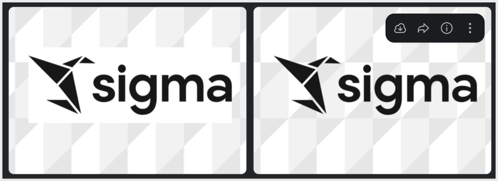

author: pballai
id: 05_2026_first_friday_features
summary: 05_2026_first_friday_features
categories: firstfridayfeatures
environments: web
status: Published
feedback link: https://github.com/sigmacomputing/sigmaquickstarts/issues
tags: first_friday_features
lastUpdated: 2026-06-06

# (05-2026) May
<!-- The above name is what appears on the website and is searchable. 

 08 changes: 7 (Administration: 1, AI: 1, API: 1, Workbooks: 4)
 15 changes: 7 (Administration: 3, API: 1, Charts: 1, Bug Fixes: 1, Workbooks: 1)
 22 changes:
 29 changes:

Publish on June 5

-->

## Overview 
Duration: 5 

This QuickStart lists all the new and public beta features released, as well as bugs fixed in May 2026.

It is summary in nature, and you should refer to the specific Sigma documentation links provided for more information.

**Public beta features will carry the section text "Beta".**

All other features are considered released (**GA** or generally available).

Sigma actually has feature and bug fix releases weekly, and high-priority bug fixes on demand. We felt it was best to keep these QuickStarts to a summary of the previous month for your convenience.

New first Friday features QuickStarts will be published on the first Friday of each month, and will include information for the previous month.

### Subscribe to What's New in Sigma
For those wanting to see what Sigma is doing on each week, release notes are now also available on the [Sigma Community site](https://community.sigmacomputing.com/). There, you can **opt in to receive notifications about future release notes** in order to stay on top of everything new happening at Sigma. You can also subscribe to automated updates in any Slack channel using the Sigma Community release notes RSS feed. 

For more information on how to subscribe to release note notifications, see [About the release notes](https://community.sigmacomputing.com/t/about-the-release-notes-category/5517) 

<aside class="positive">
<strong>IMPORTANT:</strong>  Some screens in Sigma may appear slightly different from those shown in QuickStarts. This is because Sigma continuously adds and enhances functionality. Rest assured, Sigma’s intuitive interface ensures that any differences will not prevent you from successfully completing any QuickStart.
</aside>

For more information on Sigma's product release strategy, see [Sigma product releases](https://help.sigmacomputing.com/docs/sigma-product-releases)

If something is not working as you expect, here's how to [contact Sigma support](https://help.sigmacomputing.com/docs/sigma-support)

<!-- END OF SECTION-->

## Actions
Duration: 20

### Action Button Column Formatting
Format table columns that trigger action sequences to display as buttons, making interactivity visually explicit for end users.

For more information, see [Action Button Column Formatting](https://help.sigmacomputing.com/docs/format-and-customize-a-table#format-action-button-columns)

### Call API Action (GA) 
Call API Action is now generally available. Create actions that call API endpoints directly within Sigma workbooks to trigger workflows, enrich data, and integrate external systems. Supports diverse authentication methods, dynamic parameters, and typed request bodies.

**WHY IT MATTERS:**
GA status means this is production-ready for enterprise use. Teams can reliably trigger external workflows, push data to downstream systems, and orchestrate multi-step processes without leaving Sigma — a meaningful capability for operational analytics at scale.

For more information, see [Call API Action](https://help.sigmacomputing.com/docs/create-actions-that-call-api-endpoints)

There is also a QuickStart, [API Actions - Getting Started](https://quickstarts.sigmacomputing.com/guide/developers_api_actions_getting_started/index.html?index=..%2F..index#0)

### Download Reports as PDF 
Create workbook actions that download entire reports in PDF format for distribution and offline access.

**WHY IT MATTERS:**
PDF export via workbook actions closes a common gap for stakeholders who need polished, shareable reports outside the browser — useful for scheduled distributions, executive reviews, and compliance documentation.

For more information, see [Download Reports as PDF](https://help.sigmacomputing.com/docs/create-actions-that-send-notifications-and-export-data#download-a-report)

<!-- END OF SECTION-->

## Administration
Duration: 20

### Audit Logs for Tenant Organizations in Other Regions (Beta) 
Parent organization administrators can now view audit logs across tenant organizations deployed in different cloud regions by accessing separate connections for each region.

**WHY IT MATTERS:** 
Multi-region tenant deployments are common in enterprise contexts, and centralized audit visibility is a frequent compliance requirement. This closes a gap for parent org admins managing tenants across regions.

For more information, see [Review audit logs from tenant organizations](https://help.sigmacomputing.com/docs/create-and-manage-tenant-organizations#review-audit-logs-from-tenant-organizations)

### Databricks Sample Connection
The `Sigma Sample Catalog,` a sample Databricks connection, is now available to all Sigma organizations upon request for testing and development purposes. This gives teams a ready-made environment to explore Sigma's Databricks integration without needing to configure their own connection.

For more information, see [Databricks Sample Connection](https://help.sigmacomputing.com/docs/sigmas-sample-connection)

### Multiple Identity Providers Support (GA) 
Organizations can now enable multiple identity providers (IdPs) for enhanced authentication flexibility.

**WHY IT MATTERS:** 
Large enterprises often need to authenticate different user populations through separate IdPs — for example, employees through one provider and contractors or partners through another. GA support removes a common blocker in enterprise rollouts and security reviews.

For more information, see [Using multiple identity providers for your Sigma organization](https://help.sigmacomputing.com/docs/using-multiple-identity-providers-for-your-sigma-organization)

### Sigma Templates Refinement
To ensure that the available Sigma templates shared to every organization are relevant and high quality, some Sigma-provided templates are now hidden from the list. The following templates owned by Sigma Templates remain available:

- Dynamic Profit and Loss Statement
- Fivetran Usage Template
- Google Analytics 4
- Loan Analysis
- Snowflake Cost Monitoring
- Snowflake Cost Per Query
- Snowflake Performance Monitoring
- Snowflake Security Monitoring
- Tasty Bytes Fleet Performance

Any workbooks created from the templates are unaffected.

<!-- END OF SECTION-->

## AI
Duration: 20

### Agent Skills for Sigma 
Install agent skills to enable AI assistants to authenticate to the Sigma REST API and create Sigma documents as code. Skills are available through the public skills repository.

**WHY IT MATTERS:** 
This opens Sigma to AI-driven automation workflows — agents can authenticate and build Sigma content programmatically, extending what's possible for teams embedding AI assistants into their development and analytics pipelines.

For more information, see [Agent Skills for Sigma](https://help.sigmacomputing.com/docs/install-skills-for-ai-assistants)

<!-- END OF SECTION-->

## AI Apps
Duration: 20

<!-- END OF SECTION-->

## API
Duration: 20

### Custom SQL Elements in List Sources Endpoints
The `List data model sources`, `List workbook sources`, and `List report sources` endpoints now include custom SQL elements in their responses. 

These elements are identified with a `custom-sql` type and contain a `customSqlId` field.

For more information, see [List data model sources](https://help.sigmacomputing.com/reference/listdatamodelsources), [List workbook sources](https://help.sigmacomputing.com/reference/getworkbooksources), and [List report sources](https://help.sigmacomputing.com/reference/listreportsources)

### New API Endpoints for Managing Credentials and Connectors
Ten new endpoints provide programmatic management of API credentials and connectors:

- Five endpoints for API credentials (list, retrieve, create, update, delete) via [v2/api-credentials](https://help.sigmacomputing.com/reference/listapicredentials)
- Five endpoints for API connectors (list, retrieve, create, update, delete) via [v2/api-connectors](https://help.sigmacomputing.com/reference/listapiconnectors)

<!-- END OF SECTION-->

## Bug Fixes
Duration: 20

### Invalid Image URL Warning
The editor now displays an `Invalid image URL` alert when background image URLs are malformed.

<!-- END OF SECTION-->

## Charts
Duration: 20

### Data Labels for Geography Maps
Users can now configure custom data labels on geography maps through the `Properties` tab's `Label` option.

<!-- END OF SECTION-->

## Data Modeling
Duration: 20

<!-- END OF SECTION-->

## Embedding
Duration: 20

<!-- END OF SECTION-->

## Functions / Calculations
Duration: 20

<!-- END OF SECTION-->

## Input Tables
Duration: 20

<!-- END OF SECTION-->

## New QuickStarts in May
Duration: 20

<!-- END OF SECTION-->

## Security
Duration: 20

<!-- END OF SECTION-->

## Workbooks
Duration: 20

### Terminology Change - Your Documents
We have revised the UI to consistently reference `Your documents` instead of `Documents` and `My documents` to make ownership more clear.

### True Transparency for Element Backgrounds
Setting an element's background color to `None` now renders as genuine transparency, allowing page and container background images to show through rather than defaulting to the background color.

For example, the image on the left is using a white background while the other is transparent:

<!-- END OF SECTION-->

## Additional Information
Duration: 20

**Additional Resource Links**

[Blog](https://www.sigmacomputing.com/blog/) 
[Community](https://community.sigmacomputing.com/) 
[Help Center](https://help.sigmacomputing.com/hc/en-us) 
[QuickStarts](https://quickstarts.sigmacomputing.com/) 
 

<button>[Sigma Free Trial](https://www.sigmacomputing.com/free-trial/)</button>

&emsp;
&emsp;

<!-- END OF SECTION-->
