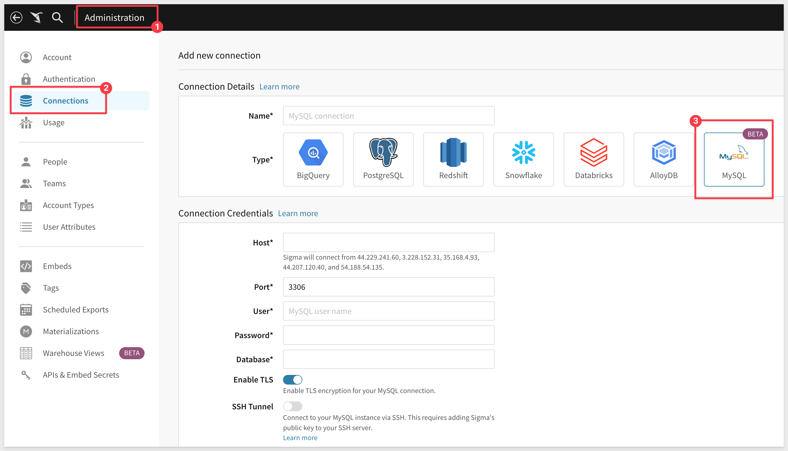
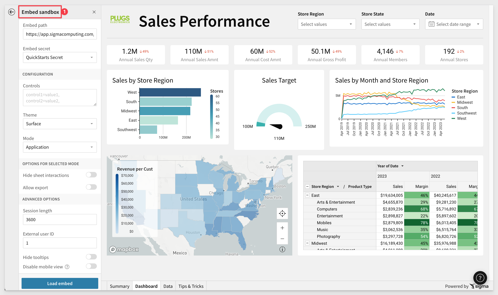
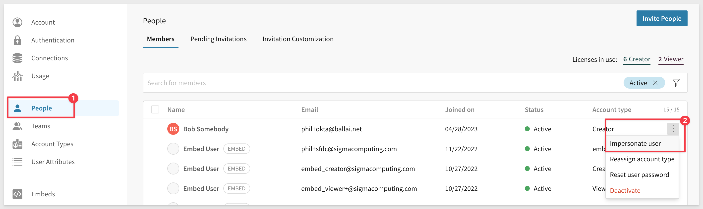
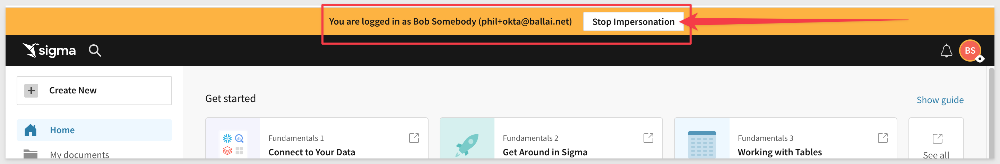
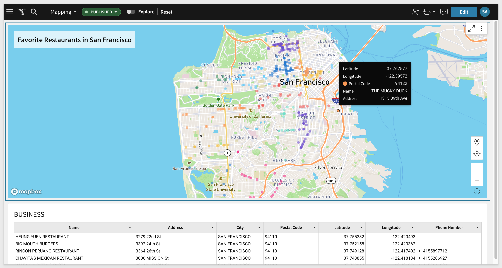
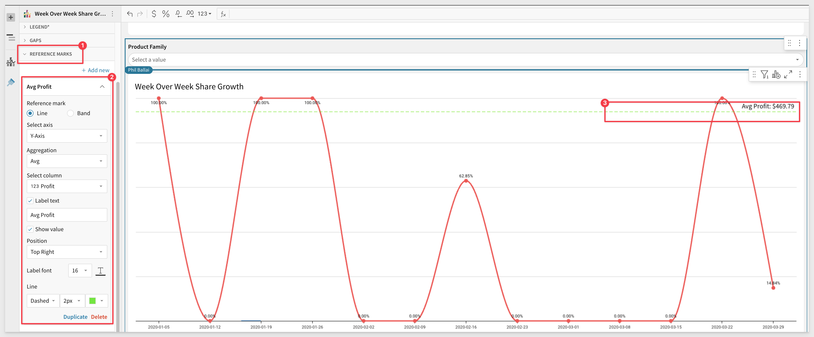

author: pballai
id: 06_2023_first_friday_features
summary: 06_2023_first_friday_features
categories: Administration
environments: web
status: Published
feedback link: https://github.com/sigmacomputing/sigmaquickstarts/issues
tags: first_friday_features

<!-- 
Weeks Added so far:
Release notes for the month of June 2023 features, published on first Friday of July
6.2.2023
6.9.2023
6.16.2023
6.23.2023
6.30.2023
-->

# (06-2023) June

## Overview 
Duration: 5 

This QuickStart lists all the new and public beta features released, as well as bugs fixed in June 2023. 

It is summary in nature and you should refer to the specific [Sigma documentation](https://help.sigmacomputing.com) links provided for more information.

**Public beta features will carry the section text "BETA".** 

All other features are considered released (GA or generally available).
 
Sigma actually has feature and bug fix releases weekly, and high-priority bug fixes on demand. We felt is was best to keep these QuickStarts to a summary of the previous month for your convenance.

New QuickStarts will be published on the first Friday of each month, and will include information for the previous month. 


<!-- END OF SECTION-->

## Admin Features

### Remove Team Members in Bulk
Admins can now remove multiple members of a team using a bulk action. To remove team members in bulk, go to your `Administration` > `Teams` > select a team > select members to remove > and click the `Remove` from team button.

For more information about managing teams, [see Manage Teams.](https://help.sigmacomputing.com/docs/manage-teams)

### Reset Password for Users in Bulk
Admins can now initiate a password reset for multiple users with a bulk action setting. The selected users receive an email alerting them to reset their password. 


<!-- END OF SECTION-->

## API
A new parameter, `userKind`, is now available for the `Update a Member in Your Organization` endpoint. This parameter defines the type of user. 

The three possible values are `guest`, `internal`, or `embed`. 

### Changes to existing methods

The **/v2/workbooks/{workbookId}/queries** endpoint now returns elementName. 

The **/v2/workbooks/{workbookId}/pages/{pageId}/elements** endpoint now returns name and columns.   

The **/v2/workbooks/{workbookId}/pages/{pageId}/elements** now returns visualization Type.  


<!-- END OF SECTION-->

## Connect to MySQL (BETA)
Duration: 20

You can now connect Sigma directly to your data in a MySQL data warehouse. Learn how to create and manage the connection in Connect to MySQL.




<!-- END OF SECTION-->

## Dynamic Connection & Role Switching (Snowflake)
Duration: 20

Dynamic Connection & Role Switching (DRS) allows run-time swapping of the Snowflake Warehouse and Role for a Sigma connection. There are ways to leverage this using one or both Warehouse and/or Role along with different methods to restrict data access in Snowflake itself.

[Please refer to this QuickStart on how to implement dynamic role switching with Snowflake](https://quickstarts.sigmacomputing.com/guide/embedding_7_dynamic_role_switching_snowflake/index.html?index=..%2F..index#0) using User Attributes defined in Sigma, with an Application Embed.

To learn more about dynamic role switching with Snowflake, [click here.](https://help.sigmacomputing.com/docs/configure-user-attributes-on-a-snowflake-connection#role-attribute)


<!-- END OF SECTION-->

## Embedding 
Duration: 20

**Embed Sandbox** is now generally available. For more information, [see Embed Sandbox.](https://help.sigmacomputing.com/docs/embed-sandbox)



### New optional parameter
The parameter, **disable_mobile_view** for user-backed embeds is available. If this parameter is set to yes, workbooks won't automatically resize to the mobile layout.

<aside class="negative">
<strong>NOTE:</strong><br> The optional parameter "disable_mobile_view" is only available after upgrading a workbook to the new grid layouts and is not supported in the Classic layouts.
</aside>


<!-- END OF SECTION-->

## New Functions

### ArrayDistinct function added: 
 <strong>[ArrayDistinct](https://help.sigmacomputing.com/docs/arraydistinct)</strong> - Returns the array without duplicate values.<br>

To learn more about array functions, [click here](hhttps://help.sigmacomputing.com/docs/array-functions-overview)


### Financial functions added:
Sigma has added support (based on customer feedback) for a few specific functions that are critical for financial calculations. They include:

 <strong>[CAGR](https://help.sigmacomputing.com/docs/cagr)</strong> - Returns the compound annual growth rate of an investment.<br>
 <strong>[Effect](https://help.sigmacomputing.com/docs/effect)</strong> - Returns the effective annual interest rate.<br>
 <strong>[FV](https://help.sigmacomputing.com/docs/fv)</strong> - Returns the future value of an investment.<br>
 <strong>[Nominal](https://help.sigmacomputing.com/docs/nominal)</strong> - Returns the nominal annual interest rate.<br>
 <strong>[NPer](https://help.sigmacomputing.com/docs/nper)</strong> - Returns the number of periods for a loan or investment based on known amount, interest rate, and periodic payment amount.<br>
 <strong>[Pmt](https://help.sigmacomputing.com/docs/pmt)</strong> - Returns the periodic payment for a loan based on the amount, number of periods, and constant interest rate.<br>
 <strong>[PV](https://help.sigmacomputing.com/docs/pv)</strong> - Returns the present value of a loan or an investment, when using constant and regular periodic payments.<br>
 <strong>[XNPV](https://help.sigmacomputing.com/docs/xnpv)</strong> - Returns the net present value of an investment for payments or incomes at irregular intervals.<br>


### Geographic functions added:
Sigma added support for the Geography data type, and the corresponding set of 

 <strong>[Area](https://help.sigmacomputing.com/docs/area)</strong> - Calculates the area of a geography, in specified units.<br>
 <strong>[Centroid](https://help.sigmacomputing.com/docs/centroid)</strong> - Calculates the geographic center of a geography.<br>
 <strong>[Distance](https://help.sigmacomputing.com/docs/distance)</strong> - Calculates the minimum distance between two geographies, in specified units.<br>
 <strong>[Intersects](https://help.sigmacomputing.com/docs/intersects)</strong> - Determines if one geography intersects another geography.<br>
 <strong>[Latitude](https://help.sigmacomputing.com/docs/latitude)</strong> - Returns the latitude component of a point.<br>
 <strong>[Longitude](https://help.sigmacomputing.com/docs/longitude)</strong> - Returns the longitude component of a point.<br>
 <strong>[Geography](https://help.sigmacomputing.com/docs/geography-functions-overview)</strong> - Converts data in GeoJSON or WKT formats into the Geography data type.<br>
 <strong>[Json](https://help.sigmacomputing.com/docs/json)</strong> - Converts the Geography data type into GeoJSON format.<br>
 <strong>[MakePoint](https://help.sigmacomputing.com/docs/makepoint)</strong> - Constructs a point from latitude and longitude data.<br>
 <strong>[MakeLine](https://help.sigmacomputing.com/docs/makeline)</strong> - Constructs a line from a series of points and line segments.<br>
 <strong>[Perimeter](https://help.sigmacomputing.com/docs/perimeter)</strong> - Calculates the perimeter of a geography, in specified units.<br>
 <strong>[Text](https://help.sigmacomputing.com/docs/text)</strong> - Converts the Geography data type into WKT format.<br>
 <strong>[Within](https://help.sigmacomputing.com/docs/within)</strong> - Determines if one geography is fully within another geography.<br>

 [Geography functions overview](https://help.sigmacomputing.com/docs/geography-functions-overview)


### Passthrough functions added
You can also use two new Passthrough functions to support the Geography data type:

 <strong>[AggGeography](https://help.sigmacomputing.com/docs/agggeography)</strong> - Calls a warehouse aggregate function that returns a Logical data type; aggregation version of CallGeography.<br>
 <strong>[CallGeography](https://help.sigmacomputing.com/hc/en-us/articles/17798618502931-CallGeography)</strong> - Calls a warehouse function that returns a Geography data type.<br>


### Repeat Function Added:
The Repeat function returns the results of repeating a string a specified number of times.

For example, adding these five new columns:
```plaintext
Repeat([Product Type],0)
Repeat([Product Type],1)
Repeat([Product Type],2)
Repeat([Product Type],3)
Repeat([Product Type],-1)
```

...will return the following values for the Product Type column:


Repeat is one of the [Text functions](https://help.sigmacomputing.com/docs/callgeography) supported by Sigma.


<!-- END OF SECTION-->

## Materialization (BETA)
Duration: 20

You can now suspend the scheduled refresh of materializations if they are not accessed for an extended period of time.

For more information, see [pause scheduled materializations.](https://help.sigmacomputing.com/hc/en-us/articles/4408785054611-Materialization#h_01H1PW0J5X5MBBE26MYB2QVHPF)

To review the [Materialization with Sigma QuickStart](https://quickstarts.sigmacomputing.com/guide/administration_materialization/index.html?index=..%2F..index#0) click here.


<!-- END OF SECTION-->

## Scheduled Exports
Duration: 20

Scheduled exports now provide the option to select which tagged version of the workbook you want to include in the export.


<!-- END OF SECTION-->

## User Impersonation
Duration: 20

Administrators can now impersonate users from the Team page in the Admin portal. 

Previously, admins could only impersonate a user from the People page. 

The Impersonate Users feature provides admins with ability to impersonate a user and view, edit, access Sigma resources based on the user's account type.

<aside class="negative">
<strong>NOTE:</strong><br> Impersonate users is unavailable for organizations that use OAuth for authentication.  
</aside>



To stop impersonation:



To learn more about user impersonation [click here.](https://help.sigmacomputing.com/docs/impersonate-users)


<!-- END OF SECTION-->

## Version Tagging
Duration: 20

Version Tagging is now generally available. For more information, see [Version Tagging](https://help.sigmacomputing.com/docs/version-tagging)

**Summary:**<br>
Version tagging allows you to employ a software development cycle to control workbook versions using tags. For example, orgs can have a development, staging, and production version of a workbook and migrate changes as needed. This allows you to control which workbook versions are viewable by your users. 

When you create a tag and assign it to a workbook, you essentially freeze the state of that workbook. The process of tagging a workbook creates a duplicate that can be shared with other stakeholders and users.  

For example, you can create a Production tag and assign it to a workbook that's used by embed users, guests, or other Sigma end users. Moreover, you can tag additional versions of the same workbook such as Development or Staging. These versions can be used by different stakeholders in your org for review purposes. Once reviewed, you can migrate this copy to Production for your users. 

One of the benefits of this solution is your org can modify a Development workbook without affecting the experience of your customers who use the Production version. Once you complete your developmental changes, you can easily update the Production version of the workbook.

If you are interested in Version Tagging in an embedded scenario, [please refer to this QuickStart.](https://quickstarts.sigmacomputing.com/guide/embedding_8_version_tagging/index.html?index=..%2F..index#0)


<!-- END OF SECTION-->

## Visualizations
Duration: 20

### Chart Legend Header Visibility
You are now able to configure the visibility of chart legend headers.

In the `Element format` > `Legend` section, the new `Show legend header` setting is enabled by default. Disable the setting to hide the header. When the element features two chart legends (i.e., color and size), the setting applies to both legend headers.

### Geography map (BETA)
Illustrate geospatial objects on a map with the new Map - Geography visualization. Create a connection map to display spatial networks, correlations, and relationships, or build a choropleth map to identify variability and patterns across distinct geographic areas.

For example:


### Map - Geography replaces the Map - GeoJSON visualization 
Now supports for [geography data is in WKT format](https://help.sigmacomputing.com/docs/geography) **(using Snowflake and BigQuery connections only)** and variant data in GeoJSON format.

For more information, [see Build a geography map.](https://sigma.bi/build-a-geography-map)

### Reference Marks
Visualizations that support reference marks now include the ability to customize the reference mark label font size and color. 

See `Label font` options in `Element formatting` > `Reference marks`.



### Scatter Plot Legend Header Visibility
When a scatter plot features two chart legends (i.e., color and size), you can now configure the visibility of each legend individually. Previously, only the Show legend setting was available, which allows you to show or hide both legends. 

To configure individual legend visibility, go to Element format > Legend and enable or disable the Show color legend and Show size legend settings.

### Stacked 100% Data Label Customization
Customize data labels in Stacked 100% bar charts with new number formatting options.

In the `Element format` > `Data labels` section, the new `Display value as a percent` setting is enabled by default. Disable the setting to display the labels as absolute values. When displaying percentages, you can use the percent decimal precision tool to increase or decrease decimal places.

### Table Summary KPI
Quickly highlight summarized totals by creating KPI visualizations directly from table summaries. To add a KPI, right-click a table summary to open the menu, then select Create KPI element.

### Theme Palette & Hex Color Picker
Customize chart mark colors with more flexibility and control using the enhanced color selector. Select the  and  icons to toggle between the color palette—now featuring a Theme palette—and the new hex color picker.

Theme palette: provides a predefined set of colors based on the selected workbook theme (`Workbook settings` > `Workbook formatting` > `Theme`).

**Hex color picker** allows you to enter a hex value or select the tint, tone, or shade of a specific hue.


<!-- END OF SECTION-->

## Workbooks
Users can now send workbook error reports with trace IDs that facilitate improved, targeted error investigations.
### Controls
You can use the new Create list from preset option to easily create a drill down control for a visualization that has year, month, and day categories, without manually creating them. 

### Grid Layout
Grid Layout mobile view has been enhanced with the following updates:

   <ul>
      <li>New option to enable/disable responsive layout.</li>
      <li>Updated viewport control design.</li>
      <li>Ability to auto-arrange elements in synced mode.</li>
   </ul>

### Grid layout PDF export
Workbooks with Grid Layout (BETA) enabled now support PDF exports. A scheduled export PDF attachment can capture an individual element, a single workbook page, or the entire workbook, and you can choose between portrait or landscape orientation.

### Keyboard shortcuts
We added new keyboard shortcuts to help you work with input tables. See `Keyboard shortcuts` > `Input tables`.

### Multi-element delete confirmation
When you select multiple elements to delete, the confirmation modal now lists all dependencies. View names of elements to be deleted alongside the impacted elements that currently use them as sources.

### Others
You can now detach a control directly from its element without having to go to the control first.

Custom options for number formatting now includes “pp”, for percentage point, a formatting option for values and value comparisons. 


<!-- END OF SECTION-->


## **Bug Fixes**
Duration: 20

Bug releases are broken down by week for specificity.

### Week ending 6.30.2023
 <ul>
      <li>Resolved an input table issue that caused the Data validation modal to close when a date was selected from the date picker.</li>
      <li>Resolved an input table issue that appended numbers to unique key column names (e.g., Account ID (1)).</li>
</ul>

### Week ending 6.23.23
 <ul>
      <li>When allow_export_boolean isn't set or is set to false in an application embed, users no longer see an option to export in the workbook. </li>
      <li>The POST /v2/members endpoint for orgs using OAuth now functions correctly.</li>
      <li>Resolved an issue that prevented column auto-select when additional targets were added to controls. When one or more targets exist, new targets now default to the same column applied to the first target element.</li>
</ul>

### Week ending 6.15.23
 <ul>
      <li>Resolved an issue that changed the height of table elements when the browser width was adjusted.</li>
      <li>Resolved an issue that added excess empty canvas space in page-level PNG images attached to scheduled exports.</li>
</ul>

### Week ending 6.9.23
 <ul>
      <li>Resolved an issue that caused some embeds to display in mobile mode rather than desktop.</li>
      <li>Materialization status updates correctly when clicking Materialize now in the Materialization schedules page.</li>
      <li>Resolved an issue that caused unintentional duplicate records in linked input tables when one or more users edited the same input table row in multiple browser tabs.</li>
      <li>Resolved an issue that intermittently prevented input table cell edits from persisting.</li>
      <li>Resolved an issue that caused the active input table cell to appear beneath the element’s horizontal scrollbar when a user edited a row towards the bottom of the table.</li>
</ul>

### Week ending 6.2.23
 <ul>
      <li>Resolved an issue with pivot table rows not displaying.</li>
      <li>Resolved an issue when using Send Now in the Schedule Export modal screen.</li>
      <li>The show_footer parameter failed for encoded single-page embeds. </li>
      <li>Added column re-sizers to the first row in pivot tables to resolve issues preventing column resizing when no header row exists.</li>
      <li>Resolved issue causing pivot table titles to be hidden when the element was resized to an arbitrary height.</li>
      <li>Resolved issue that disabled pivot table title editing after the value placement was moved from the Pivot columns property to the Pivot rows property.</li>
</ul>


<!-- END OF SECTION-->

## **Additional Information**
Duration: 20
<!-- THE FOLLOWING ADDITIONAL RESOURCES IS REQUIRED AS IS FOR ALL QUICKSTARTS -->
**Additional Resource Links**

[Help Center Home](https://help.sigmacomputing.com/hc/en-us)<br>
[Sigma Community](https://community.sigmacomputing.com/)<br>
[Sigma Blog](https://www.sigmacomputing.com/blog/)<br>
<br>

[](https://twitter.com/sigmacomputing)&emsp;
[](https://www.linkedin.com/company/sigmacomputing)&emsp;
[](https://www.facebook.com/sigmacomputing)


<!-- END OF WHAT WE COVERED -->
<!-- END OF QUICKSTART -->
