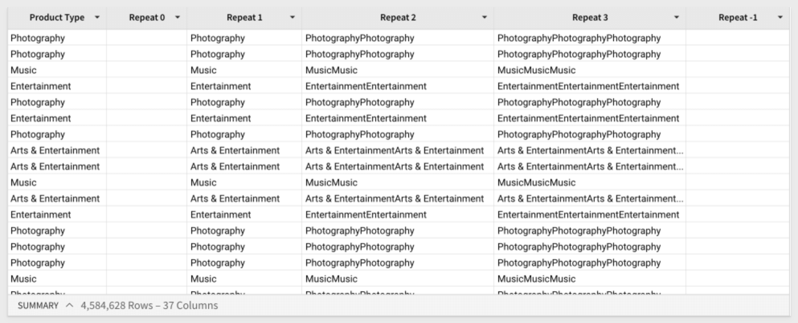

author: pballai
id: 06_2023_first_friday_features
summary: 06_2023_first_friday_features
categories: Administration
environments: web
status: Hidden
feedback link: https://github.com/sigmacomputing/sigmaquickstarts/issues
tags: first_friday_features

<!-- 
Weeks Added so far:
Release notes for the month of June 2023 features, published on first Friday of July
6.2.2023
6.9.2023
-->

# 07-2023 (for June)

## Overview 
Duration: 5 

This QuickStart lists all the new and public beta features released, as well as bugs fixed in June 2023. 

It is summary in nature and you should refer to the specific Sigma documentation links provided for more information.

**Public beta features will carry the section text "BETA".** 

All other features are considered released (GA or generally available).
 
Sigma actually has feature and bug fix releases weekly and high-priority bug fixes on demand. We felt is was best to keep these QuickStarts to a summary of the previous monthly for your convenance.

New QuickStarts will be published on the first Friday of each month, for the previous month information. 

## Version Tagging
Duration: 20

Version Tagging is now generally available. For more information, see [Version Tagging](https://help.sigmacomputing.com/hc/en-us/articles/13310865519507-Version-Tagging)

**Summary:**<br>
Version tagging allows you to employ a software development cycle to control workbook versions using tags. For example, orgs can have a development, staging, and production version of a workbook and migrate changes as needed. This allows you to control which workbook versions are viewable by your users. 

When you create a tag and assign it to a workbook, you essentially freeze the state of that workbook. The process of tagging a workbook creates a duplicate that can be shared with other stakeholders and users.  

For example, you can create a Production tag and assign it to a workbook that's used by embed users, guests, or other Sigma end users. Moreover, you can tag additional versions of the same workbook such as Development or Staging. These versions can be used by different stakeholders in your org for review purposes. Once reviewed, you can migrate this copy to Production for your users. 

One of the benefits of this solution is your org can modify a Development workbook without affecting the experience of your customers who use the Production version. Once you complete your developmental changes, you can easily update the Production version of the workbook.

If you are interested in Version Tagging in an embedded scenario, [please refer to this QuickStart.](https://quickstarts.sigmacomputing.com/guide/embedding_8_version_tagging/index.html?index=..%2F..index#0)


<!-- END OF SECTION-->

## Dynamic Connection & Role Switching (Snowflake)
Duration: 20

Dynamic Connection & Role Switching (DRS) allows run-time swapping of the Snowflake Warehouse and Role for a Sigma connection. There are ways to leverage this using one or both Warehouse and/or Role along with different methods to restrict data access in Snowflake itself.

[Please refer to this QuickStart on how to implement RDS](https://quickstarts.sigmacomputing.com/guide/embedding_7_dynamic_role_switching_snowflake/index.html?index=..%2F..index#0) using User Attributes defined in Sigma, with an Application Embed.

[Documentation is here.](https://help.sigmacomputing.com/hc/en-us/articles/12717103444755-Configure-User-Attributes-on-a-Snowflake-Connection-)


<!-- END OF SECTION-->

## Financial Functions
Duration: 20

Sigma has added support (based on customer feedback) for a few specific functions that are critical for financial calculations. They include:

 <strong>1: [CAGR](https://help.sigmacomputing.com/hc/en-us/articles/360056173174-CAGR)</strong>: Returns the compound annual growth rate of an investment.<br>

 <strong>2: [Effect](https://help.sigmacomputing.com/hc/en-us/articles/16999064431635-Effect)</strong>: Returns the effective annual interest rate.<br>

 <strong>3: [FV](https://help.sigmacomputing.com/hc/en-us/articles/16960835395987-FV)</strong>: Returns the future value of an investment.<br>

 <strong>4: [Nominal](https://help.sigmacomputing.com/hc/en-us/articles/16997965150483-Nominal)</strong>: Returns the nominal annual interest rate.<br>

 <strong>5: [NPer](https://help.sigmacomputing.com/hc/en-us/articles/16960962742675-NPer)</strong>: Returns the number of periods for a loan or investment based on known amount, interest rate, and periodic payment amount.<br>

 <strong>6: [Pmt](https://help.sigmacomputing.com/hc/en-us/articles/16960642952723-Pmt)</strong>: Returns the periodic payment for a loan based on the amount, number of periods, and constant interest rate.<br>

 <strong>7: [PV](https://help.sigmacomputing.com/hc/en-us/articles/17009080477203-PV)</strong>: Returns the present value of a loan or an investment, when using constant and regular periodic payments.<br>

 <strong>8: [XNPV](https://help.sigmacomputing.com/hc/en-us/articles/16992978432915-XNPV)</strong>: Returns the net present value of an investment for payments or incomes at irregular intervals.<br>


<!-- END OF SECTION-->

## New Function: Repeat

The Repeat function returns the results of repeating a string a specified number of times.

For example, adding these five new columns:
```plaintext
Repeat([Product Type],0)
Repeat([Product Type],1)
Repeat([Product Type],2)
Repeat([Product Type],3)
Repeat([Product Type],-1)
```

...will return the following values for the Product Type column:



Repeat is one of the [Text functions](https://help.sigmacomputing.com/hc/en-us/articles/17422239058835) supported by Sigma.


<!-- END OF SECTION-->

## User Impersonation
Duration: 20

Administrators can now impersonate users from the Team page in the Admin portal. 

Previously, admins could only impersonate a user from the People page. 

The Impersonate Users feature provides admins with ability to impersonate a user and view, edit, access Sigma resources based on the user's account type.

<aside class="negative">
<strong>NOTE:</strong><br> Impersonate users is unavailable for organizations that use OAuth for authentication.  
</aside>

[For more information, please refer here.](https://help.sigmacomputing.com/hc/en-us/articles/15747532813715-Impersonate-users)


<!-- END OF SECTION-->

## Workbooks (general)

You can now detach a control directly from its element without having to go to the control first.

Custom options for number formatting now includes “pp”, for percentage point, a formatting option for values and value comparisons. 


<!-- END OF SECTION-->

## Admin Features

### Remove Team Members in Bulk
Admins can now remove multiple members of a team using a bulk action. To remove team members in bulk, go to your `Administration` > `Teams` > select a team > select members to remove > and click the `Remove` from team button.

For more information about managing teams, [see Manage Teams.](https://help.sigmacomputing.com/hc/en-us/articles/360037430333-Manage-Teams)

### Reset Password for Users in Bulk
Admins can now initiate a password reset for multiple users with a bulk action setting. The selected users receive an email alerting them to reset their password. 

For more information, see [Manage Authentication.](https://help.sigmacomputing.com/hc/en-us/articles/360036944534-Manage-authentication
)


<!-- END OF SECTION-->

## API
A new parameter, `userKind`, is now available for the `Update a Member in Your Organization` endpoint. This parameter defines the type of user. 

The three possible values are `guest`, `internal`, or `embed`. 

For more information, [see Organization Member API.])(https://help.sigmacomputing.com/hc/en-us/articles/4408555573267-Organization-Member-API)


<!-- END OF SECTION-->


## Scheduled Exports
Duration: 20

Scheduled exports now provide the option to select which tagged version of the workbook you want to include in the export.

For more information, see [Apply Control Values to Scheduled Reports](https://help.sigmacomputing.com/hc/en-us/articles/4409004286739).


<!-- END OF SECTION-->

## Visualizations (multiple changes)
Duration: 20

There are multiple items in this category this month.

### Table Summary KPI
Quickly highlight summarized totals by creating KPI visualizations directly from table summaries. To add a KPI, right-click a table summary to open the menu, then select Create KPI element.

### Theme Palette & Hex Color Picker
Customize chart mark colors with more flexibility and control using the enhanced color selector. Select the  and  icons to toggle between the color palette—now featuring a Theme palette—and the new hex color picker.

Theme palette: provides a predefined set of colors based on the selected workbook theme (Workbook settings > Workbook formatting > Theme).
Hex color picker: allows you to enter a hex value or select the tint, tone, or shade of a specific hue.

### Stacked 100% Data Label Customization
Customize data labels in Stacked 100% bar charts with new number formatting options.

In the Element format > Data labels section, the new Display value as a percent setting is enabled by default. Disable the setting to display the labels as absolute values. When displaying percentages, you can use the Percent decimal precision tool to increase or decrease decimal places.

### Chart Legend Header Visibility
Configure the visibility of chart legend headers.

In the Element format > Legend section, the new Show legend header setting is enabled by default. Disable the setting to hide the header. When the element features two chart legends (i.e., color and size), the setting applies to both legend headers.

### Scatter Plot Legend Header Visibility
When a scatter plot features two chart legends (i.e., color and size), you can now configure the visibility of each legend individually. Previously, only the Show legend setting was available, which allows you to show or hide both legends. 

To configure individual legend visibility, go to Element format > Legend and enable or disable the Show color legend and Show size legend settings.


<!-- END OF SECTION-->

## Materialization (BETA)
Duration: 20

You can now suspend the scheduled refresh of materializations if they are not accessed for an extended period of time.

For more information, see [Pause scheduled materializations.](https://help.sigmacomputing.com/hc/en-us/articles/4408785054611-Materialization#h_01H1PW0J5X5MBBE26MYB2QVHPF)

PB TO ADD LINK TO MAT...QUICKSTART WHICH IS IN DRAFT NOW


<!-- END OF SECTION-->

## **Bug Fixes**
Duration: 20

Bug releases are broken down by week for specificity.

### Week ending 6.9.23
 <ul>
      <li>Resolved an issue that caused some embeds to display in mobile mode rather than desktop. </li>
      <li>Materialization status updates correctly when clicking Materialize now in the Materialization schedules page.</li>
      <li>Resolved an issue that caused unintentional duplicate records in linked input tables when one or more users edited the same input table row in multiple browser tabs.</li>
      <li>Resolved an issue that intermittently prevented input table cell edits from persisting.</li>
      <li>Resolved an issue that caused the active input table cell to appear beneath the element’s horizontal scrollbar when a user edited a row towards the bottom of the </li>
</ul>
### Week ending 6.2.23
 <ul>
      <li>Resolved an issue with pivot table rows not displaying.</li>
      <li>Resolved an issue when using Send Now in the Schedule Export modal screen.</li>
      <li>The show_footer parameter failed for encoded single-page embeds. </li>
      <li>Added column re-sizers to the first row in pivot tables to resolve issues preventing column resizing when no header row exists.</li>
      <li>Resolved issue causing pivot table titles to be hidden when the element was resized to an arbitrary height.</li>
      <li>Resolved issue that disabled pivot table title editing after the value placement was moved from the Pivot columns property to the Pivot rows property.</li>
</ul>

### Week ending 6.9.23


<!-- END OF SECTION-->
<!-- THE FOLLOWING ADDITIONAL RESOURCES IS REQUIRED AS IS FOR ALL QUICKSTARTS -->

## **Additional Information**
Duration: 20
<!-- THE FOLLOWING ADDITIONAL RESOURCES IS REQUIRED AS IS FOR ALL QUICKSTARTS -->
**Additional Resource Links**

[Help Center Home](https://help.sigmacomputing.com/hc/en-us)<br>
[Sigma Community](https://community.sigmacomputing.com/)<br>
[Sigma Blog](https://www.sigmacomputing.com/blog/)<br>
<br>

[](https://twitter.com/sigmacomputing)&emsp;
[](https://www.linkedin.com/company/sigmacomputing)
[](https://www.facebook.com/sigmacomputing)


<!-- END OF WHAT WE COVERED -->
<!-- END OF QUICKSTART -->