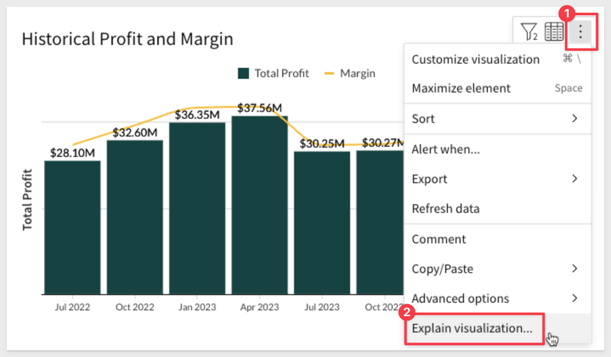
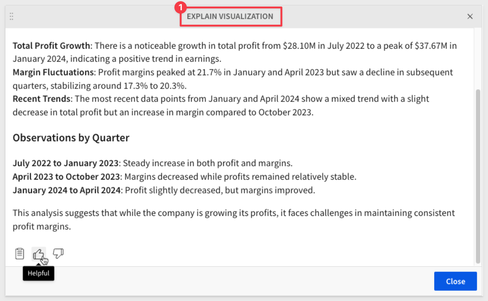
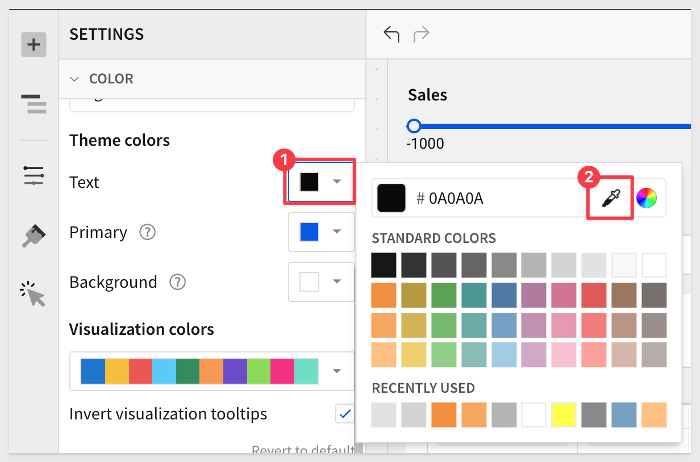
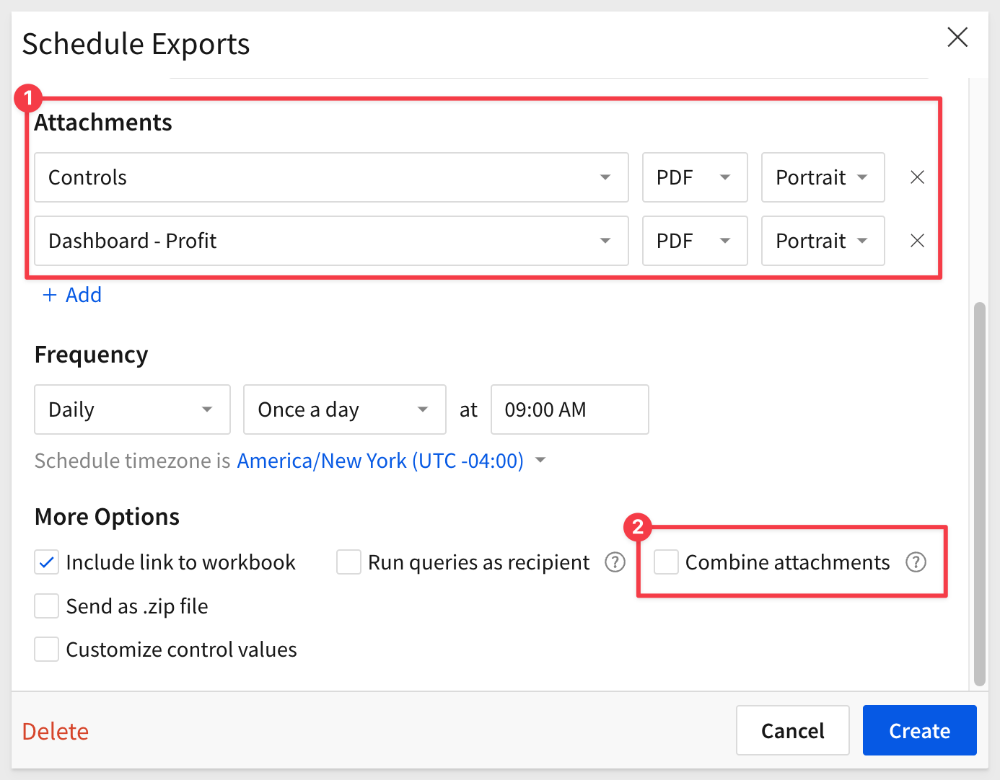
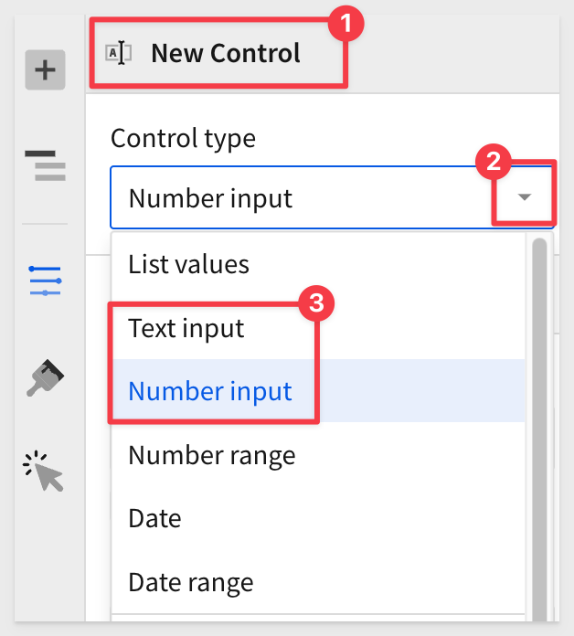
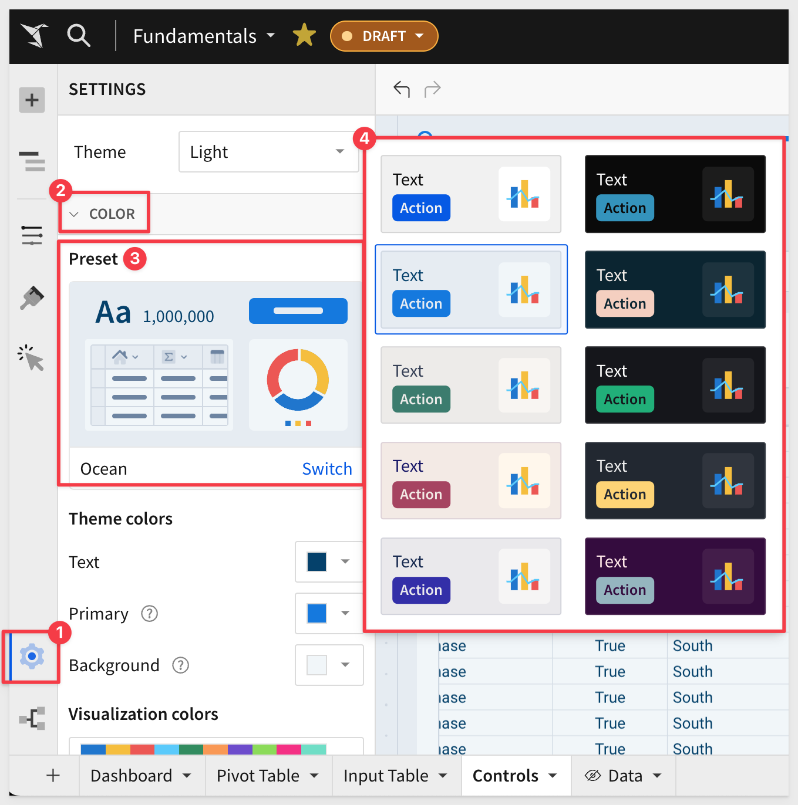
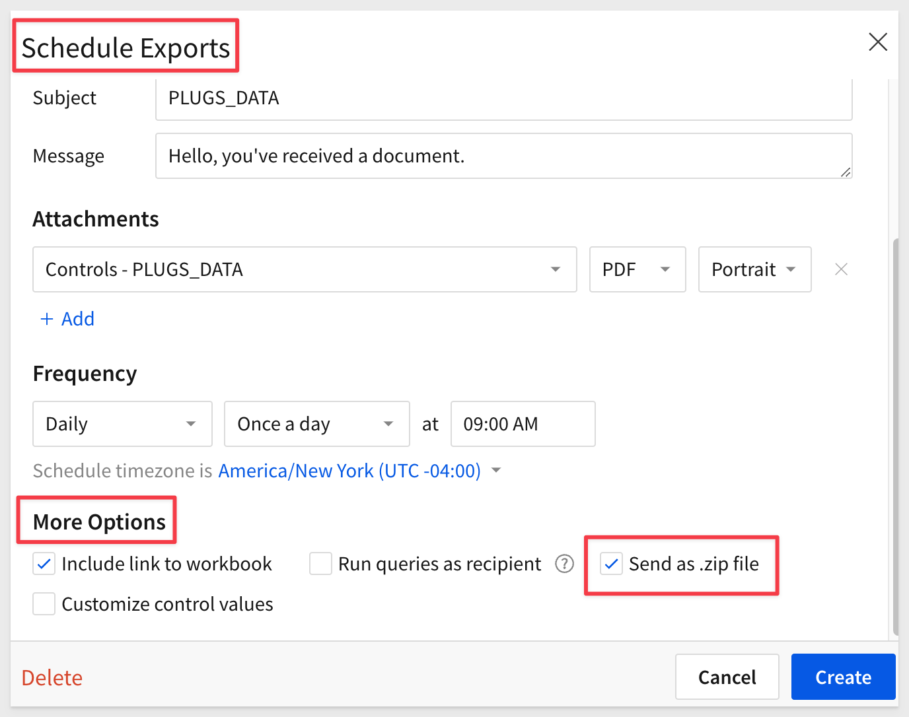

author: pballai
id: 06_2024_first_friday_features
summary: 06_2024_first_friday_features
categories: Administration
environments: web
status: Published
feedback link: https://github.com/sigmacomputing/sigmaquickstarts/issues
tags: first_friday_features
lastUpdated: 2024-06-31

<-- 
June 7 - done
June 14 - done
June 21-
June 28-
!-->

# (06-2024) June
<!-- The above name is what appears on the website and is searchable. -->

## Overview 
Duration: 5 

This QuickStart lists all the new and public beta features released, as well as bugs fixed in June 2024.

It is summary in nature, and you should refer to the specific Sigma documentation links provided for more information.

**Public beta features will carry the section text "Beta".**

All other features are considered released (**GA** or generally available).

Sigma actually has feature and bug fix releases weekly, and high-priority bug fixes on demand. We felt it was best to keep these QuickStarts to a summary of the previous month for your convenience.

New first Friday features QuickStarts will be published on the first Friday of each month, and will include information for the previous month.


## Administration
Duration: 20


## AI
Duration: 20

### Explain visualizations with AI (Beta)
Instantly generate a description of any chart with the AI Explain visualization feature. Details can include key insights, observations, data distribution summaries, and other context that can enhance your understanding of the visualized data and help drive informed decisions.

For example, once configured users can click on any visualization and select `Explain visualization`:



The results will appear as:



This is the first of many AI enabled features that Sigma is innovating into the product.

<aside class="positive">
<strong>IMPORTANT:</strong><br> The OpenAI integration must be configured for your organization.
</aside>

[Click here to learn how to configure the OpenAI integration in Sigma.](https://help.sigmacomputing.com/docs/manage-openai-integration)

For more information, [see Explain a visualization with AI.](https://help.sigmacomputing.com/docs/explain-visualizations-with-ai)


## API
Duration: 20

## New folder and document "favoriting" endpoints
We have added operations for managing favorite documents and folders for a user:

```code
GET /v2/favorites/member/{memberId} lists documents and folders favorited by a user.
POST /v2/favorites favorites a document or folder for a user.
DELETE /v2/favorites/member/{memberId}/file/{inodeId} unfavorites a document or folder for a user.
```

### New workbook template endpoints
We have added operations for managing workbook templates:

```code
POST /v2/templates/{templateId}/swapSources swaps the data sources of a template.
POST /v2/workbooks/{workbookId}/saveTemplate saves an existing workbook as a template.
```


## Bug Fixes
Duration: 20

**1:** <br><br>
**2:** 


## Input Tables
Duration: 20


## Embedding
Duration: 20

### Self-service embed usage analytics
Use a third-party tool, like [Pendo.io](https://www.pendo.io/), to track inbound and outbound events implemented in your embedded analytics.

By tracking iframe events, you can gain a better understanding of how customers are using your embedded data. 

For more information, [see Implement inbound and outbound events in embeds.](https://help.sigmacomputing.com/docs/inbound-and-outbound-events-in-embeds)

For a tutorial that walks you through sending and receiving events from a parent application and Sigma, [see QuickStart: Embedding 07: Events.](https://quickstarts.sigmacomputing.com/guide/embedding_07_events/index.html?index=..%0F..index&_gl=1*y059mb*_gcl_aw*R0NMLjE3MTgwMzM3NTkuQ2p3S0NBand5SnF6QmhCYUVpd0FXRFJKVkJXejR0S3dYS2x4LWhIWXNZc0RPM2xCYVdOMTZ5UWt1VDlUazBhRE1yYWxZb1VTT1BjS3pCb0NOT1lRQXZEX0J3RQ..*_gcl_au*MTU3OTYwODI3NC4xNzEzNTc1NDQ4LjEzMjQ1MTQxMTUuMTcxNzE3MTI2Ni4xNzE3MTcxMjY1*_ga*MjAyNzIyMDcwLjE3MTcxODQ4Nzk.*_ga_PMMQG4DCHC*MTcxODM5NDcwOS40MS4xLjE3MTgzOTU2MTEuMzUuMC4w#0)


## New QuickStarts in May
Duration: 20


## Visualizations
Duration: 20


## Workbooks
Duration: 20

### Color picker now available
A small but very useful usability addition is the color picker, which is available anywhere there is a choice of single colors.

For example:



### Combined file option for PDF attachments in scheduled exports
It is now possible to combine multiple PDF attachments when configuring ad hoc and scheduled exports.

The `Combine attachments` option expands the previous ability to merge Excel attachments into one file. 



<aside class="negative">
<strong>NOTE:</strong><br> The checkbox to combine attachments will not appear until there at least two PDF attachments configured to send.
</aside>

For more information, [see Merge PDF or Excel files.](https://help.sigmacomputing.com/docs/configure-additional-options-for-exports#merge-pdf-or-excel-files)

### Control element naming updates
For consistency and clarity, the control elements formerly labeled `Text control` and `Number` are now labeled `Text input` and `Number input`.



### Enhanced color formatting for workbook themes
Edit your workbook color settings directly from the `Color` section of the `Workbook settings` panel. 

The element panel provides a real-time preview of your workbook colors that automatically updates as you adjust the settings.

There are currently ten beautify presets to choose from!

Here is how to access it:



### Zip file option for attachments in scheduled exports
When scheduling exports it is now optional to compress export attachments into a single zip file. This will result in smaller attachments and more reliable delivery over email.



For more information, [see Compress attachments to a zip file.](https://help.sigmacomputing.com/docs/configure-additional-options-for-exports#compress-attachments-to-a-zip-file)


## Additional Information
Duration: 20

**Additional Resource Links**

[Blog](https://www.sigmacomputing.com/blog/)<br>
[Community](https://community.sigmacomputing.com/)<br>
[Help Center](https://help.sigmacomputing.com/hc/en-us)<br>
[QuickStarts](https://quickstarts.sigmacomputing.com/)<br>
<br>

[](https://twitter.com/sigmacomputing)&emsp;
[](https://www.linkedin.com/company/sigmacomputing)&emsp;
[](https://www.facebook.com/sigmacomputing)


