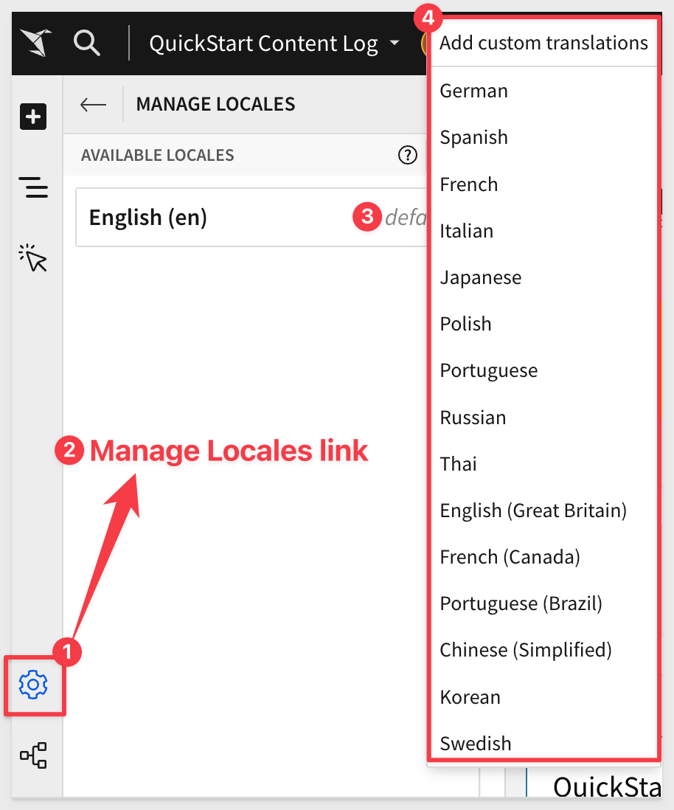
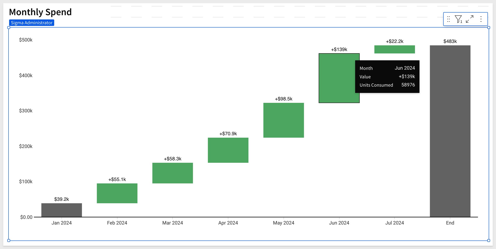
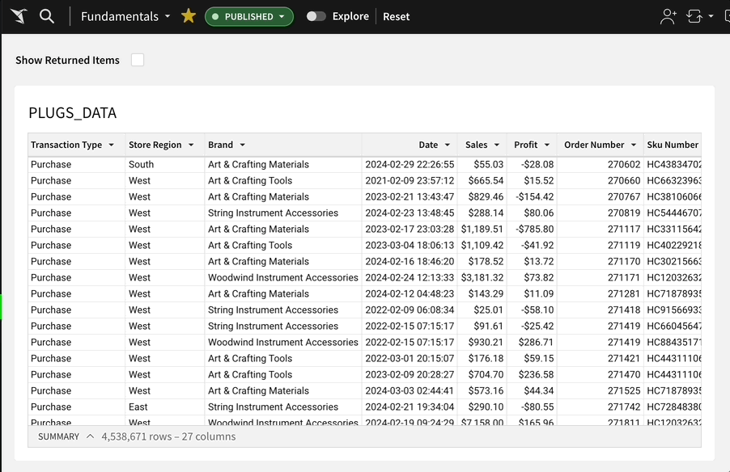
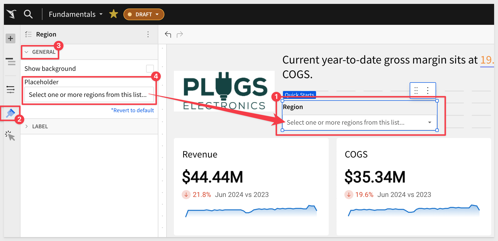
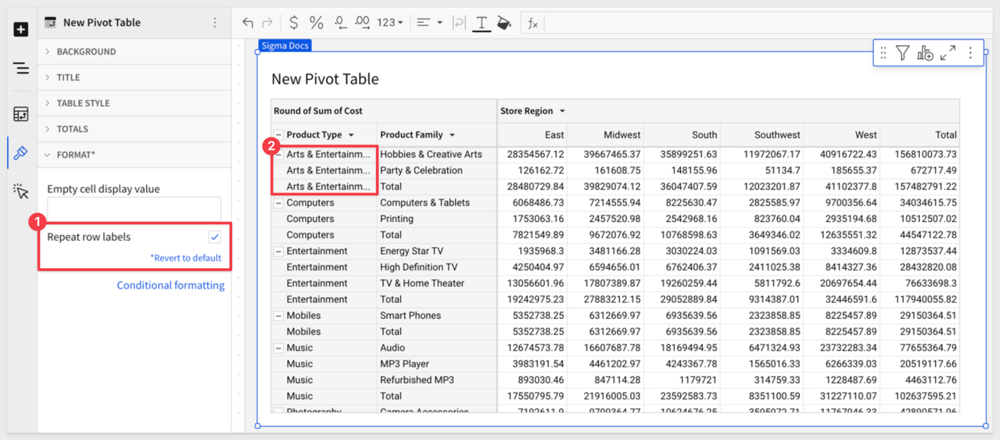
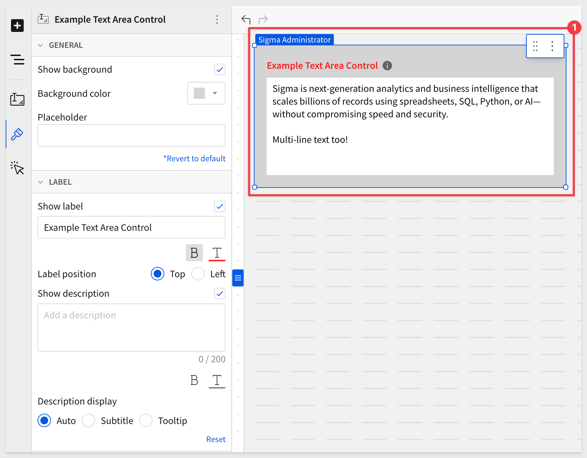

author: pballai
id: 06_2024_first_friday_features
summary: 06_2024_first_friday_features
categories: Administration
environments: web
status: Published
feedback link: https://github.com/sigmacomputing/sigmaquickstarts/issues
tags: first_friday_features
lastUpdated: 2024-06-31

<-- 
June 7 - done
June 14 - done
June 21- done
June 28-
!-->

# (06-2024) June
<!-- The above name is what appears on the website and is searchable. -->

## Overview 
Duration: 5 

This QuickStart lists all the new and public beta features released, as well as bugs fixed in June 2024.

It is summary in nature, and you should refer to the specific Sigma documentation links provided for more information.

**Public beta features will carry the section text "Beta".**

All other features are considered released (**GA** or generally available).

Sigma actually has feature and bug fix releases weekly, and high-priority bug fixes on demand. We felt it was best to keep these QuickStarts to a summary of the previous month for your convenience.

New first Friday features QuickStarts will be published on the first Friday of each month, and will include information for the previous month.


## Administration
Duration: 20

### OAuth write access
OAuth with write access is now generally available (GA). For customers using the Beta version, that have been no changes since May 2024.

Configure an OAuth connection with write access to leverage the benefits of OAuth permission management with Sigma’s write-access features, including input tables, warehouse views, workbook materializations, and CSV uploads.

For more information, see [Configure OAuth with write access.](https://help.sigmacomputing.com/docs/configure-oauth-with-write-access)


## AI
Duration: 20

### Explain visualizations with AI (Beta)
Instantly generate a description of any chart with the AI Explain visualization feature. Details can include key insights, observations, data distribution summaries, and other context that can enhance your understanding of the visualized data and help drive informed decisions.

For example, once configured users can click on any visualization and select `Explain visualization`:


The results will appear as:


This is the first of many AI enabled features that Sigma is innovating into the product.

<aside class="positive">
<strong>IMPORTANT:</strong><br> The OpenAI integration must be configured for your organization.
</aside>

[Click here to learn how to configure the OpenAI integration in Sigma.](https://help.sigmacomputing.com/docs/manage-openai-integration)

For more information, [see Explain a visualization with AI.](https://help.sigmacomputing.com/docs/explain-visualizations-with-ai)


## API
Duration: 20

### Connection sync endpoint
This endpoint provide a method to "sync" the connection to a specific database, schema, or table, so that the data Sigma displays is the most recent.

For more information, see [POST /v2/connections/{connectionId}/sync.](https://help.sigmacomputing.com/reference/syncconnectionpath)

### New folder and document "favoriting" endpoints
We have added operations for managing favorite documents and folders for a user:

```code
GET /v2/favorites/member/{memberId} lists documents and folders favorited by a user.
POST /v2/favorites favorites a document or folder for a user.
DELETE /v2/favorites/member/{memberId}/file/{inodeId} unfavorites a document or folder for a user.
```

#### New workbook template endpoints
We have added operations for managing workbook templates:

```code
POST /v2/templates/{templateId}/swapSources swaps the data sources of a template.
POST /v2/workbooks/{workbookId}/saveTemplate saves an existing workbook as a template.
```


## Bug Fixes
Duration: 20

**1:** <br><br>
**2:** 


## Input Tables
Duration: 20


## Embedding
Duration: 20

### Additional language support for workbook localization
You can now localize workbook text into Simplified Chinese, Korean, and Swedish.

For more information, see [Manage workbook localization.](https://help.sigmacomputing.com/docs/manage-workbook-localization)



### Self-service embed usage analytics
Use a third-party tool, like [Pendo.io](https://www.pendo.io/), to track inbound and outbound events implemented in your embedded analytics.

By tracking iframe events, you can gain a better understanding of how customers are using your embedded data. 

For more information, [see Implement inbound and outbound events in embeds.](https://help.sigmacomputing.com/docs/inbound-and-outbound-events-in-embeds)

For a tutorial that walks you through sending and receiving events from a parent application and Sigma, [see QuickStart: Embedding 07: Events.](https://quickstarts.sigmacomputing.com/guide/embedding_07_events/index.html?index=..%0F..index&_gl=1*y059mb*_gcl_aw*R0NMLjE3MTgwMzM3NTkuQ2p3S0NBand5SnF6QmhCYUVpd0FXRFJKVkJXejR0S3dYS2x4LWhIWXNZc0RPM2xCYVdOMTZ5UWt1VDlUazBhRE1yYWxZb1VTT1BjS3pCb0NOT1lRQXZEX0J3RQ..*_gcl_au*MTU3OTYwODI3NC4xNzEzNTc1NDQ4LjEzMjQ1MTQxMTUuMTcxNzE3MTI2Ni4xNzE3MTcxMjY1*_ga*MjAyNzIyMDcwLjE3MTcxODQ4Nzk.*_ga_PMMQG4DCHC*MTcxODM5NDcwOS40MS4xLjE3MTgzOTU2MTEuMzUuMC4w#0)


## Functions / Calculations
Duration: 20

### ArrayJoin function
The ArrayJoin function joins elements of an array into a single text string.

For more information, [see ArrayJoin.]()


## New QuickStarts in June
Duration: 20

### All new Sigma fundamentals series
After over a year in service, it was time to retire the existing series and replace it with an updated one.

Each QuickStart in the series has been rewritten and screenshots have been updated.

The series has changed somewhat and now contains the following QuickStarts:
Fundamental 1 - Getting Around
Fundamental 2 - Working with Tables
Fundamentals 3: Working with Visualizations
Fundamentals 4: Working with Pivot Tables
Fundamentals 5: Input Tables
Fundamentals 6: Controls
Fundamentals 7: Administration

You can access the [new series here.](https://quickstarts.sigmacomputing.com/?cat=fundamentals)

## Visualizations
Duration: 20

### Waterfall chart (Beta)
Waterfall charts in Sigma are perfect for illustrating changes in data over a period of time. 

They are particularly useful in financial analytics use cases, such as tracking revenue and expenditures for a project, department, or entire organization. 

Additionally, you can format the shape, start, and end values of a waterfall chart to better tailor the visualization to your specific needs.



For more information, see [Build a waterfall chart.](https://help.sigmacomputing.com/docs/build-a-waterfall-chart)


## Workbooks
Duration: 20

### Checkbox control element
Use the `Checkbox control` element to allow users to select or deselect an option.

The `Checkbox control` element is similar to the [Switch control](https://help.sigmacomputing.com/docs/intro-to-control-elements#switch) element but in a different format, which users may prefer.

For example, it can used to simply toggle a boolean column to show purchases or returns only:



### Color picker now available
A small but very useful usability addition is the color picker, which is available anywhere there is a choice of single colors.

For example:


### Combined file option for PDF attachments in scheduled exports
It is now possible to combine multiple PDF attachments when configuring ad hoc and scheduled exports.

The `Combine attachments` option expands the previous ability to merge Excel attachments into one file. 


<aside class="negative">
<strong>NOTE:</strong><br> The checkbox to combine attachments will not appear until there at least two PDF attachments configured to send.
</aside>

For more information, [see Merge PDF or Excel files.](https://help.sigmacomputing.com/docs/configure-additional-options-for-exports#merge-pdf-or-excel-files)

### Control element naming updates
For consistency and clarity, the control elements formerly labeled `Text control` and `Number` are now labeled `Text input` and `Number input`.


### Enhanced color formatting for workbook themes
Edit your workbook color settings directly from the `Color` section of the `Workbook settings` panel. 

The element panel provides a real-time preview of your workbook colors that automatically updates as you adjust the settings.

There are currently ten beautify presets to choose from!

Here is how to access it:


### Placeholder text in control elements
You can now customize placeholder text for any input-based control element (List values, Text input, Number input, Date, and Date range) to provide context about the expected user input.

Go to `Element format` > `General` and update the `Placeholder` field. 

Placeholder text displays directly in the control’s input field and clears when the field contains user input:



### Repeat row labels in pivot tables
In pivot tables with multiple pivot rows, you can format your table to repeat row labels.

For example, `Arts & Entertainment` in `Product Types` is repeated for each additional row having a `Product Family` in that grouping:



For more information, see [Working with pivot tables.](https://help.sigmacomputing.com/docs/working-with-pivot-tables)

### Text area control element
The `Text area` control element in Sigma allows for multi-line text input, making it ideal for forms and other scenarios requiring larger amounts of text.

With customizable input field height and vertical scrolling to view text overflow, it more effectively supports extensive text input compared to the `Text input` control element.



### Zip file option for attachments in scheduled exports
When scheduling exports it is now optional to compress export attachments into a single zip file. This will result in smaller attachments and more reliable delivery over email.


For more information, [see Compress attachments to a zip file.](https://help.sigmacomputing.com/docs/configure-additional-options-for-exports#compress-attachments-to-a-zip-file)


## Additional Information
Duration: 20

**Additional Resource Links**

[Blog](https://www.sigmacomputing.com/blog/)<br>
[Community](https://community.sigmacomputing.com/)<br>
[Help Center](https://help.sigmacomputing.com/hc/en-us)<br>
[QuickStarts](https://quickstarts.sigmacomputing.com/)<br>
<br>

[](https://twitter.com/sigmacomputing)&emsp;
[](https://www.linkedin.com/company/sigmacomputing)&emsp;
[](https://www.facebook.com/sigmacomputing)


