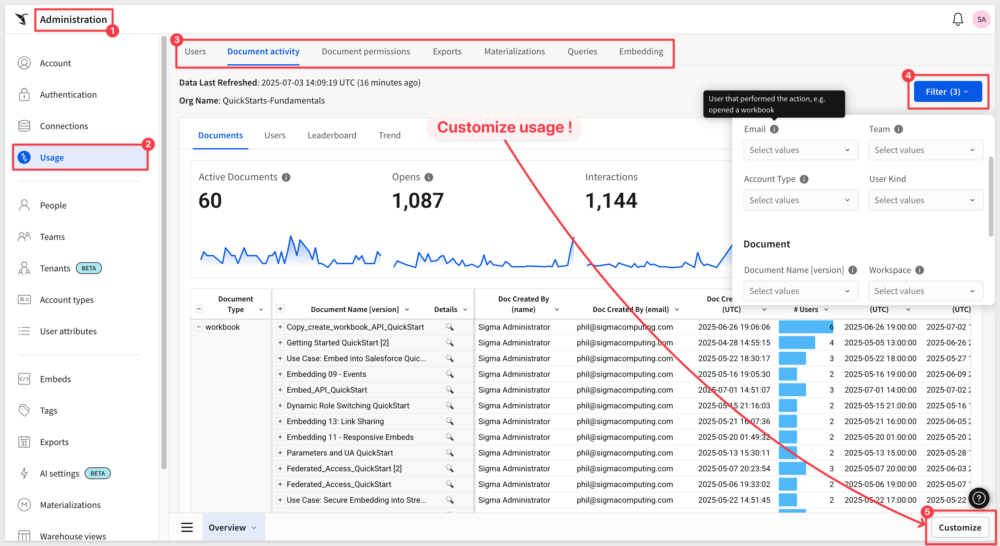
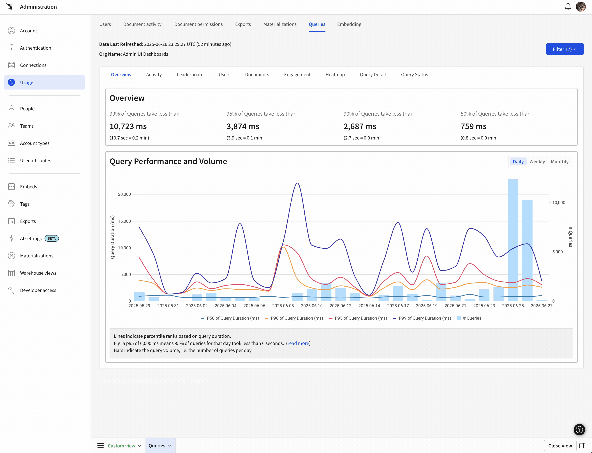
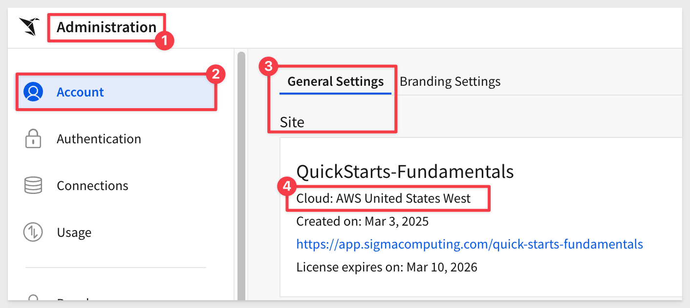
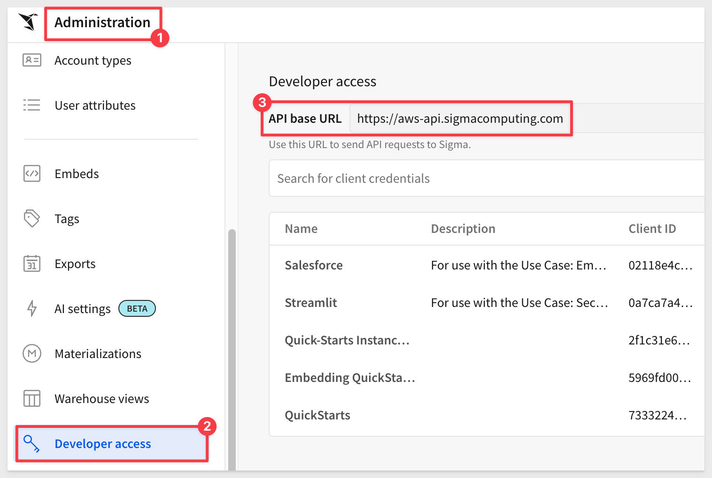
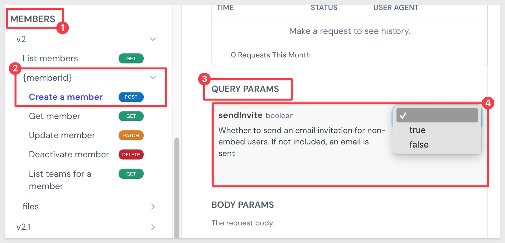

author: pballai
id: 06_2025_first_friday_features
summary: 06_2025_first_friday_features
categories: Administration
environments: web
status: Published
feedback link: https://github.com/sigmacomputing/sigmaquickstarts/issues
tags: first_friday_features
lastUpdated: 2025-07-05

# (06-2025) June
<!-- The above name is what appears on the website and is searchable. 

06 June changes: done
13 June changes: done
20 June changes: done
27 June changes: 

Publish on 3 July

 
-->

## Overview 
Duration: 5 

This QuickStart lists all the new and public beta features released, as well as bugs fixed in June 2025.

It is summary in nature, and you should refer to the specific Sigma documentation links provided for more information.

**Public beta features will carry the section text "Beta".**

All other features are considered released (**GA** or generally available).

Sigma actually has feature and bug fix releases weekly, and high-priority bug fixes on demand. We felt it was best to keep these QuickStarts to a summary of the previous month for your convenience.

New first Friday features QuickStarts will be published on the first Friday of each month, and will include information for the previous month.

<aside class="positive">
<strong>IMPORTANT:</strong>  Some screens in Sigma may appear slightly different from those shown in QuickStarts. This is because Sigma continuously adds and enhances functionality. Rest assured, Sigma’s intuitive interface ensures that any differences will not prevent you from successfully completing any QuickStart.
</aside>

For more information on Sigma's product release strategy, see [Sigma product releases](https://help.sigmacomputing.com/docs/sigma-product-releases)

If something is not working as you expect, here's how to [contact Sigma support](https://help.sigmacomputing.com/docs/sigma-support)

<!-- END OF SECTION-->

## Administration
Duration: 20

### Azure Canada region
Sigma is now deployed in Azure Canada. Located in `Toronto`, this deployment gives customers in Canada more control over data storage while enabling compliance with internal policies and external data residency requirements.

For more information, see [Supported cloud platforms and regions](https://help.sigmacomputing.com/docs/region-warehouse-and-feature-support#supported-cloud-platforms-and-regions)

### Improved usage dashboards
Usage dashboards have been improved to provide better performance and easier navigation. 

To view insights into how your organization uses Sigma and data on your queries, embeds, materializations, and more, go to `Administration` > `Usage`. 

Just a few of the long list of changes are:

**Custom Views:** 
Users can customize their view of a usage dashboard, save it, and go back to it on their next visit. You can have as many views as you'd like. A view can be simple like saving a customer filter, sorting, or adding a new column. A view can also include adding an entirely new page of visualizations directly against the official Usage data model. You can effectively build and save your own usage dashboards now!

**Fresh design:** 
No more scrolling and searching for filters. Everything has been moved into a tabbed layout and filters are tucked away to reduce clutter.

**The latest Sigma features included:** 
    - Tabbed Containers**
    - Modals
    - Popovers
    - Actions

**Overall performance improvements** 

You can also now create and save custom views of your usage dashboards, which allows you to customize the appearance, layout, sorting, and filters of your existing dashboards, or even create new ones of your own.

For more information, see [Usage overview](https://help.sigmacomputing.com/docs/usage-overview) 

### Scheduled Exports for usage dashboards
Related to the effort or overhaul the usage dashboards. usage users can now create their own views/bookmarks, and can also schedule those views.

### Manage upgrade requests in the Administration portal (GA)
The ability to view and respond to account upgrade requests in the Administration portal is now generally available. When a user requests an upgrade to their account type to explore or create workbooks, an admin can review the request in Administration.

<aside class="negative">
<strong>NOTE:</strong>  When an admin responds to an email requesting an upgrade, the link from the email opens the "Reassign account type" modal.
</aside>

For more information, see [Respond to account upgrade requests](https://help.sigmacomputing.com/docs/respond-to-account-upgrade-requests)

### User-friendly names for cloud platforms in the Administration portal
Friendly names are now used for cloud platforms in the Administration portal. To view your cloud platform, go to `Administration` > `Account` > `General Settings`, then locate the `Site` section. The Cloud field identifies the platform hosting your organization:

For more information, see [Supported regions, data platforms, and features](https://help.sigmacomputing.com/docs/region-warehouse-and-feature-support)

<!-- END OF SECTION-->

## AI
Duration: 20

### Configure a usage dashboard for Ask Sigma (Beta)
Admins can now configure a usage dashboard to view data about how Ask Sigma is used in their Sigma organization.

For more information, see [Configure a usage dashboard for Ask Sigma (Beta)](https://help.sigmacomputing.com/docs/configure-a-usage-dashboard-for-ask-sigma)

There is also a QuickStart: [Ask Sigma usage](https://quickstarts.sigmacomputing.com/guide/administration_ask_sigma_usage_dashboard/index.html?index=..%2F..index#0) to make it easy to deploy.

<!-- END OF SECTION-->

## API
Duration: 20

### API request URLs now visible in the Administration portal
You can now view the base URL required for authenticating to the Sigma REST API in the Administration portal. 

Go to `Administration` > `Developer Access`: 

For more information, see [Get started with the Sigma REST API](https://help.sigmacomputing.com/reference/get-started-sigma-api)

### New option for the Create a member API endpoint
When creating a member using the API, choose whether to send an invitation email to a non-embed user. 

The [Create a member](https://help.sigmacomputing.com/reference/createmember) endpoint now includes the `sendInvite` query parameter:

For more information, see [Create a member](https://help.sigmacomputing.com/reference/createmember)

<!-- END OF SECTION-->

## Bug Fixes
Duration: 20

**1:** An error where workbook level custom translation files did not show up in workbook settings is now fixed.

**2:** Plugins now load initial control values as expected on refresh for version 1.0.9 or higher.

**3:** The workbook header no longer displays an `Edit` button when viewing a tagged version, which cannot be edited directly.

**4:** A `Return home` option no longer appears for users after a secure embed is deleted.

**5:** After copying and pasting a workbook or data model element with one or more columns that use metrics, those columns display correctly.

**6:** You can now successfully tag and swap the sources of a workbook version that uses a data model with data from multiple connections.

**7:** When the signature of a stored procedure used in a stored procedure action is changed, the action now validates that the signature is the same and uses the new signature if possible.

**8:** When viewing a workbook lineage in an embed, the `Shared with me` link now launches the embed modal instead of the native Sigma modal.

**9:** When you disable automatic user creation for embeds, you can now manage embed users in the `Administration` portal.

**10:** When Sigma encounters errors during a data source swap involving custom SQL and input tables, Sigma now show the error messages at the bottom of the page.

**11:** Formulas in action configurations were previously limited to functions supported by all compatible data platforms. You can now use any function supported by your connection's data platform.

<!-- END OF SECTION-->

## Charts
Duration: 20

### Configure data labels per series on Cartesian charts (GA)
If your Cartesian (bar, line, area, or scatter) or combo chart visualizes multiple series of data, you can configure different data label settings for each series.

For more information, see [Format and show data labels](https://help.sigmacomputing.com/docs/display-chart-data-labels#format-and-show-data-labels)

<!-- END OF SECTION-->

## Data Modeling
Duration: 20

### Improved data model overview
The status of elements in the model overview panel is more visible when you open a data model for editing but have not yet selected any elements. Elements enabled as a source show with a  icon and elements disabled as a source show with a  icon.

### Improved management of data model source visibility
Instead of managing the visibility of an element in a data model with a  on the element, now you manage the visibility of a table as a source from the Modeling tab.

For more information, see [Enable or disable an element as a data source](https://help.sigmacomputing.com/docs/create-and-manage-data-models#enable-or-disable-an-element-as-a-data-source)

### Materialization for data models (GA)
Scheduling materialization for elements in data models is now generally available. 

If you have data sources that use expensive or long-running queries, such as a complex join between data elements, or a dataset with high cardinality and multiple grouping levels and calculated columns, setting up materialization enhances query performance and can help reduce compute costs.

For more information, see [About materialization](https://help.sigmacomputing.com/docs/materialization) and [Create a data element materialization schedule](https://help.sigmacomputing.com/docs/schedule-materialization-for-a-data-model-or-workbook#create-a-data-element-materialization-schedule) for a data model or workbook.

### Materialization support for version-tagged data models (GA)
Schedule materialization for each tagged version of a data model. If the published version already has a materialization schedule for one or more elements, you can choose to reuse the same schedule for the tagged version.

When you promote a tag to a new version of the data model, such as moving a tag from an older version of the data model to the latest published version, a new materialization run is started. While the materialization runs for the newly tagged version, the materialized data for the previously tagged version of the data model is used.

For more information, see [Schedule materialization for a version-tagged data model](https://help.sigmacomputing.com/docs/schedule-materialization-for-a-version-tagged-data-model)

<!-- END OF SECTION-->

## Embedding
Duration: 20

### Change to email notifications for embed user account type changes
Email notifications are no longer sent to embed users when an admin makes changes to those users’ account type.

### QuickStart series has been refactored
The entire [QuickStart embedding series](https://quickstarts.sigmacomputing.com/?cat=embedding) has been redone to incorporate new embed functionality, sample source code in GitHub, design changes related to horizon and license changes.

Did I mention there are 17 in total!

- Embedding 01: Getting Started - This one anchors them all and needs to be completed first.
- Embedding 02–03: Federated Access, JWTs & Parameters
- Embedding 04: Isolation Solutions
- Embedding 06: Creating a Premium Service
- Embedding 08: Ask Sigma Integration
- Embedding 10: Version Tagging
- Embedding 13–16: Link Sharing, Public Access, React SDK, and more
- Use Cases: Salesforce (using Lightning Web Components), Streamlit

Embedding 05 is missing by design- a placeholder for a new feature coming soon.

<aside class="negative">
<strong>NOTE:</strong>  The older embed series QuickStarts are moved but still available by link. There is also mentioned on the QuickStart homepage. 
</aside>

### New outbound event emitted for saved workbooks
When a workbook is successfully saved using the `Save as` option from the embed menu, an outbound `workbook:saveas` event is emitted. The event returns the `worbookId` of the new workbook.

Developers can use this event to implement custom messages or workflows.

For more information, see [workbook:saveas](https://help.sigmacomputing.com/docs/outbound-event-reference#workbooksaveas)

### Removed links to Sigma pages in embedded application workbooks
In embedded applications, Sigma no longer includes links that reference Sigma processes or link to Sigma documentation. Sigma links in these sections of a workbook do not appear in embeds:

- Column details
- Functions bar, specifically the Function icon
- Lineage / query history
- Metric tab

<!-- END OF SECTION-->

## Functions / Calculations
Duration: 20

### New DayOfYear function and day_of_year DatePart argument
Return the day of the year as a number (1-365, or 1-366 in leap years) from a date using the [DayOfYear](https://help.sigmacomputing.com/docs/dayofyear) function. 

You can also return the day of the year as a number using day_of_year in the precision argument of the [DatePart](https://help.sigmacomputing.com/docs/datepart) function.

### Three new functions
Sigma has enabled three functions that are useful in any situation where you want to quantify the relationship between two numeric variables, particularly in exploratory data analysis, trend evaluation, or predictive modeling.

#### RegressionSlope function
The RegressionSlope function calculates the slope of the linear regression line. The function is now supported for Databricks, Snowflake, and PostgreSQL.

For more information, see [RegressionSlope](https://help.sigmacomputing.com/docs/regressionslope)

#### RegressionIntercept function
The RegressionIntercept function calculates the `y-intercept` of the linear regression line. The function is now supported for Databricks, Snowflake, and PostgreSQL.

For more information, see [RegressionIntercept](https://help.sigmacomputing.com/docs/regressionintercept)

#### RegressionR2 function
The RegressionR2 function calculates the `R2 value`, or coefficient of determination, of the linear regression line. The function is now supported for Databricks, Snowflake, and PostgreSQL.

For more information, see [RegressionR2](https://help.sigmacomputing.com/docs/regressionr2)

<!-- END OF SECTION-->

## Input Tables
Duration: 20

### Input table error handling
The following changes to input tables have been implemented to improve data integrity and prevent unexpected data loss:

- Input table edits that are unsuccessful due to configuration or availability issues in the connection or data platform (which must be resolved by the customer) are now treated as fatal errors and will no longer be retried.

- When Sigma detects a configuration or availability issue in the connection or data platform, it blocks edits to relevant input tables and displays an “Unable to edit” message directly on the input table elements until the configuration issue is resolved.

- Sigma sends admins an email alert that identifies the misconfigured or unavailable connection, displays the error message, and provides troubleshooting guidance.

<!-- END OF SECTION-->

## New QuickStarts in June
Duration: 20

### Create an Ask Sigma Usage Dashboard
In this QuickStart, we explore how to securely enable and monitor [Ask Sigma usage](https://quickstarts.sigmacomputing.com/guide/administration_ask_sigma_usage_dashboard/index.html?index=..%2F..index#0) in your organization.

### Embedding Series Refactoring
The entire [QuickStart embedding series](https://quickstarts.sigmacomputing.com/?cat=embedding) has been redone to incorporate new embed functionality, sample source code in GitHub, design changes related to horizon and license changes.

Did I mention there are 17 in total!

- Embedding 01: Getting Started - This one anchors them all and needs to be completed first.
- Embedding 02–03: Federated Access, JWTs & Parameters
- Embedding 04: Isolation Solutions
- Embedding 06: Creating a Premium Service
- Embedding 08: Ask Sigma Integration
- Embedding 10: Version Tagging
- Embedding 13–16: Link Sharing, Public Access, React SDK, and more
- Use Cases: Salesforce (using Lightning Web Components), Streamlit

Embedding 05 is missing by design- a placeholder for a new feature coming soon.

<aside class="negative">
<strong>NOTE:</strong>  The older embed series QuickStarts are moved but still available by [this link](https://quickstarts.sigmacomputing.com/deprecated/) There is also mentioned on the QuickStart homepage. 
</aside>

<!-- END OF SECTION-->

## Workbooks
Duration: 20

### Export to Microsoft Teams and SharePoint (Beta)
You can now export a workbook, workbook page, or element from Sigma to a `Microsoft Teams channel` or a `Microsoft SharePoint folder`.

To start exporting to `Teams` or `SharePoint`, a user with the Admin account type must set up a [Microsoft integration](https://help.sigmacomputing.com/docs/manage-microsoft-integration) and the relevant account type permission must be enabled for users.

For more information, see [Export to Microsoft Teams](https://help.sigmacomputing.com/docs/export-to-microsoft-teams) and [Export to Microsoft SharePoint](https://help.sigmacomputing.com/docs/export-to-microsoft-sharepoint)

### Export PDFs to larger page sizes (Beta)
When you export a workbook, page, or element to a `PDF`, you can now choose the page size. 

In addition to the previously supported Letter size, you can now export to Legal, Tabloid, A0, A1, A2, A3, and A4 page sizes.

### Limit display values in a data element (GA)
Limit the number of values displayed in a grouped table, pivot table, or chart, and group the remaining values in an "Others" category. You can transform an existing column or use the `VisibilityLimit` function with a sorted table.

For more information, see [Limit displayed values in a data element](https://help.sigmacomputing.com/docs/limit-displayed-values-in-a-data-element)

### New supported workbook locales
English (Canada), English (Ireland), Spanish (Mexico) and Chinese (Traditional) are now supported workbook locales. This includes language, date format, number format, and currency. You can preview a workbook in
en-ca, en-ie, es-mx, or zh-tw.

For more information, see [Manage workbook localization](https://help.sigmacomputing.com/docs/manage-workbook-localization)

<!-- END OF SECTION-->

## Additional Information
Duration: 20

**Additional Resource Links**

[Blog](https://www.sigmacomputing.com/blog/) 
[Community](https://community.sigmacomputing.com/) 
[Help Center](https://help.sigmacomputing.com/hc/en-us) 
[QuickStarts](https://quickstarts.sigmacomputing.com/) 
 

&emsp;
&emsp;

<!-- END OF SECTION-->
