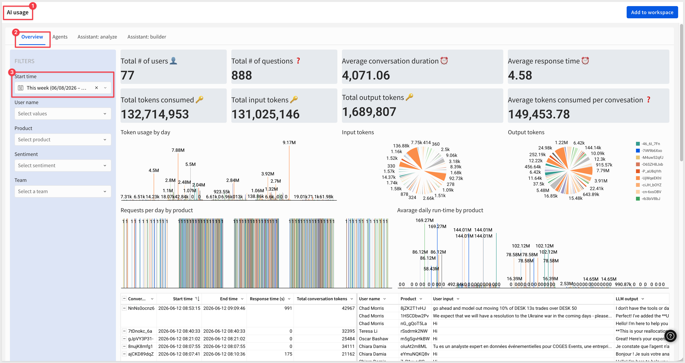
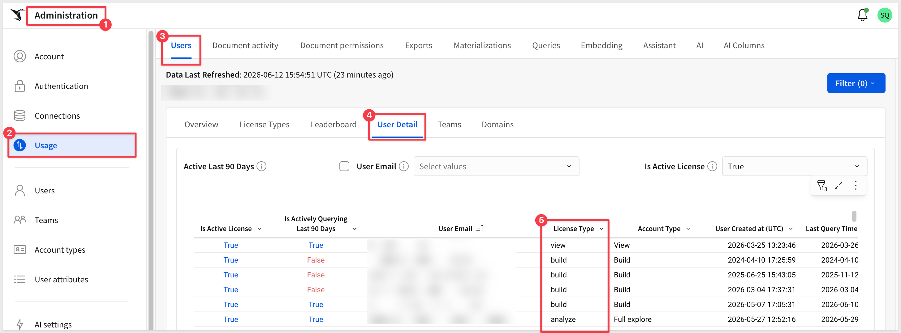
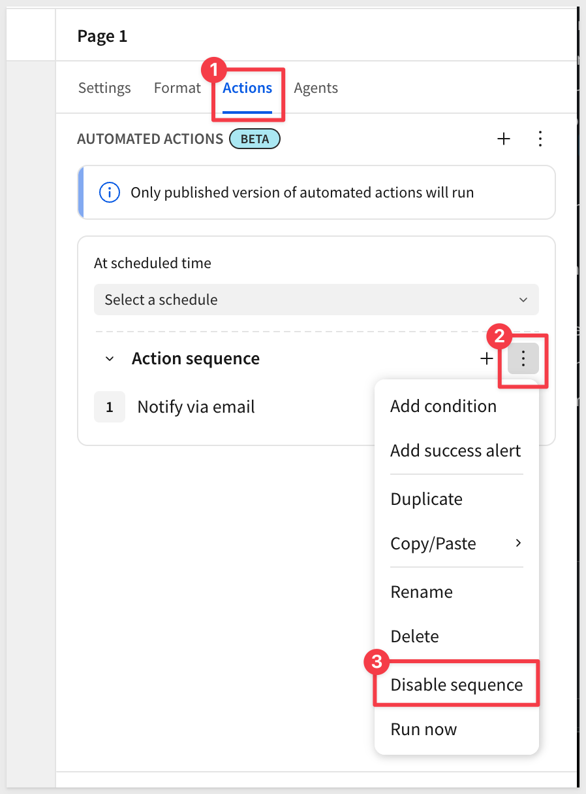

author: pballai
id: 06_2026_first_friday_features
summary: 06_2026_first_friday_features
categories: firstfridayfeatures
environments: web
status: Published
feedback link: https://github.com/sigmacomputing/sigmaquickstarts/issues
tags: first_friday_features
lastUpdated: 2026-07-05

# (06-2026) June
<!-- The above name is what appears on the website and is searchable.

June 5, 2026 changes: done
June 12, 2026 changes: done
June 18, 2026 changes: done
June 26, 2026 changes: done
June 29-30, 2026 changes: rolling into July FFF

Publish on July 3

 
-->

## Overview 
Duration: 5 

This QuickStart lists all the new and public beta features released, as well as bugs fixed in June 2026.

It is summary in nature, and you should refer to the specific Sigma documentation links provided for more information.

**Public beta features will carry the section text "Beta".**

All other features are considered released (**GA** or generally available).

Sigma actually has feature and bug fix releases weekly, and high-priority bug fixes on demand. We felt it was best to keep these QuickStarts to a summary of the previous month for your convenience.

New first Friday features QuickStarts will be published on the first Friday of each month, and will include information for the previous month.

### Subscribe to What's New in Sigma
For those wanting to see what Sigma is doing on each week, release notes are now also available on the [Sigma Community site](https://community.sigmacomputing.com/). There, you can **opt in to receive notifications about future release notes** in order to stay on top of everything new happening at Sigma. You can also subscribe to automated updates in any Slack channel using the Sigma Community release notes RSS feed. 

For more information on how to subscribe to release note notifications, see [About the release notes](https://community.sigmacomputing.com/t/about-the-release-notes-category/5517) 

<aside class="positive">
<strong>IMPORTANT:</strong>  Some screens in Sigma may appear slightly different from those shown in QuickStarts. This is because Sigma continuously adds and enhances functionality. Rest assured, Sigma’s intuitive interface ensures that any differences will not prevent you from successfully completing any QuickStart.
</aside>

For more information on Sigma's product release strategy, see [Sigma product releases](https://help.sigmacomputing.com/docs/sigma-product-releases)

If something is not working as you expect, here's how to [contact Sigma support](https://help.sigmacomputing.com/docs/sigma-support)

<!-- END OF SECTION-->

## Administration
Duration: 20

### AI usage dashboard (GA) 
Monitor token consumption, data sources, tool calls, and user feedback for AI features from a single admin dashboard.

**WHY IT MATTERS:** 
Cost visibility and governance are blockers for rolling AI features out broadly. The AI usage dashboard gives admins one place to track token spend, which data sources AI is querying, which tools agents are calling, and where users are flagging quality issues — the inputs you need to manage AI as a budget line, not a black box.

For example, looking at the `Overview` page of the `AI Usage` dashboard for the current week we can see  all the key metrics of interest and drill into anything that interests us:

For more information, see [AI usage](https://help.sigmacomputing.com/docs/ai-usage)

### Assistant Usage Dashboard (Deprecated)
The Sigma Assistant usage dashboard is deprecated and will be unavailable after September 15, 2026. Configure the AI usage dashboard instead.

For more information, see [Configure the AI usage dashboard](https://help.sigmacomputing.com/docs/configure-a-usage-dashboard-for-assistant)

### Cc/Bcc Allowlist When Run Queries as Recipient is Enabled (GA)
For security reasons, if `Run queries as recipient` is enabled, either as an organization requirement or for specific exports, admins must add recipients to an allowlist in export settings before they can be listed as `Cc` or `Bcc` recipients.

For more information, see [Manage export frequency and authentication settings](https://help.sigmacomputing.com/docs/restrict-export-recipients)

### Deployment policies deploy documents referenced in Open Sigma document actions (GA)
Deployed documents that include `Open Sigma document` actions now automatically deploy the referenced target documents and update the action references accordingly.

For more information, see [What gets deployed to a tenant](https://help.sigmacomputing.com/docs/deploy-content-to-tenant-organizations#what-gets-deployed-to-a-tenant)

### License type column in the Administration > Users table (GA)
The `Administration` > `Usage` > `Users` > `User Detail` table now includes a dedicated `License type` column that indicates the license tier associated with each user's account type.

### Manage tenant attributes from the parent organization (Beta)
Organizations using Sigma Tenants can now manage tenant organization attributes from the parent organization by creating and assigning attributes through the `Tenants` section of the Administration portal.

For more information, see [Create and manage tenant organizations](https://help.sigmacomputing.com/docs/create-and-manage-tenant-organizations)

### Sigma now supports the Azure Australia region (GA)
Sigma deployment now includes Azure Australia (`australiaeast`) in New South Wales, providing lower latency and improved performance for Australian customers, with a disaster recovery region in `australiasoutheast`.

### Support for OpenAI GPT 5.4 (GA)
Sigma now uses `GPT 5.4` instead of `GPT 5.1` if your OpenAI or Azure OpenAI account supports it.

<!-- END OF SECTION-->

## AI
Duration: 20

### AI column support for Databricks connections (Beta)
You can now create and use AI columns on Databricks connections. AI columns let you construct dynamic prompts that reference specific table columns, useful for tasks like enriching, summarizing, and classifying data.

For more information, see [Create AI columns (Beta)](https://help.sigmacomputing.com/docs/create-ai-columns)

### Build and interact with Sigma agents (Beta) 
Build agentic solutions natively in Sigma with Sigma agents. Agents provide AI capabilities to a dashboard or application based on a predefined context of the data elements in a workbook.

**WHY IT MATTERS:** 
Sigma agents bring agent-style AI into the place where the data, governance, and audit trail already live — no separate orchestration layer, no shuttling context between systems. Builders define what an agent can see and do inside the workbook itself, so the agent inherits Sigma's permissions, lineage, and version history by default.

For more information, see [Sigma agents](https://help.sigmacomputing.com/docs/sigma-agents), [Build Sigma agents](https://help.sigmacomputing.com/docs/build-sigma-agents), and [Example agent implementations](https://help.sigmacomputing.com/docs/example-agent-implementations)

There are also two QuickStarts on this topic: 
[Unlocking Insights from Unstructured Text with a Sigma Agent](https://quickstarts.sigmacomputing.com/guide/aiapps_gong_call_analysis/index.html?index=..%2F..index#0)
 
[Build Conversational AI Apps with Chat Elements and Snowflake Cortex](https://quickstarts.sigmacomputing.com/guide/aiapps_chat_element/index.html?index=..%2F..index#0)

### Configure MCP tools to use with Sigma agents (Beta) 
Use MCP servers for third-party services with Sigma agents by adding them to Sigma as MCP tools.

**WHY IT MATTERS:** 
MCP tools let Sigma agents reach into the systems your team already uses — ticketing, CRM, custom internal APIs — without writing connector code. Open MCP support keeps Sigma compatible with the broader agent ecosystem rather than locking customers into a single AI stack.

For more information, see [Configure MCP tools](https://help.sigmacomputing.com/docs/configure-mcp-tools)

### Create AI Columns (Beta) 
You can now create AI columns to enrich your data using natural language prompts. AI columns let you construct dynamic prompts that reference specific table columns, and are useful for tasks like enriching, summarizing, and classifying data.

**WHY IT MATTERS:** 
AI columns turn enrichment, classification, and summarization into a one-step workflow inside Sigma — no separate pipeline, no Python, no waiting on data engineering. Analysts can attach language model intelligence directly to existing tables, which is the fastest path from raw operational data to ready-to-analyze attributes.

For more information, see [Create AI columns (Beta)](https://help.sigmacomputing.com/docs/create-ai-columns)

### Monitor MCP queries (GA)
You can now apply the `"kind":"mcp"` tag to monitor queries sent by the Sigma MCP server — useful for tracking costs or usage associated with the MCP server.

For more information, see [Monitor MCP queries](https://help.sigmacomputing.com/docs/use-sigma-mcp-server#monitor-mcp-queries)

### Sigma Assistant in the workbook: plan and build modes (Beta) 
Sigma Assistant can now help design and build workbooks using natural language prompts. While editing a workbook, Assistant can explore any data source you have access to and assemble dashboards with charts, tables, KPIs, and filters, set up structured data entry, and scaffold AI-powered apps.

**WHY IT MATTERS:** 
This shifts Assistant from answering questions to building the workbook with you — charts, tables, KPIs, filters, data-entry flows, and AI apps all generated from natural-language prompts against a permitted data source. For analysts and builders who already know what they want, it removes the click-by-click assembly step that takes the longest in dashboard work.

For more information, see [Use AI to build dashboards and apps](https://help.sigmacomputing.com/docs/use-ai-to-build-dashboards-and-apps)

<aside class="positive">
<strong>NOTE:</strong>  Available to customers who meet certain conditions. For more information, contact your Account Executive.
</aside>

### Upcoming changes to documentation MCP server (Beta)
Starting July 6, 2026, the documentation MCP server will provide only the `searchDocs` tool, which searches Sigma documentation and returns relevant content sections and source URLs. The existing URL continues to function, with availability at both `https://help.sigmacomputing.com/mcp` and `https://help.sigmacomputing.com/_mcp/server`.

### Use warehouse agents with Assistant and agents (Beta) 
Integrate Snowflake Cortex Agents or Databricks Genie Spaces for use with Sigma Assistant and Sigma agent workflows.

**WHY IT MATTERS:** 
This is the collaborative AI pattern — Sigma calls into Snowflake Cortex and Databricks Genie rather than competing with them. Customers keep their AI investments in the warehouse, while Sigma supplies the governed runtime, audit trail, and collaboration layer on top.

For more information, see [Use warehouse agents with Sigma](https://help.sigmacomputing.com/docs/use-warehouse-agents-sigma)

<!-- END OF SECTION-->

## API
Duration: 20

### New API endpoint for updating deployment policies (GA)
The `Update a deployment policy` endpoint (`PATCH /v2/deploymentPolicies/{deploymentPolicyId}`) is now available to update an existing deployment policy in Sigma.

For more information, see [Update a deployment policy](https://help.sigmacomputing.com/reference-link/updatedeployment)

### New option for Sync a connection by path endpoint (GA)
The `Sync a connection by path` endpoint (`POST /v2/connections/{connectionId}/sync`) now supports syncing all connection objects by providing an empty path parameter.

For more information, see [Sync a connection by path](https://help.sigmacomputing.com/reference-link/syncconnectionpath)

### New option included in API endpoint response (GA)
The `List files` and `List member files` endpoints now include a `parentSourceUrlId` in the response when returning details about documents deployed to a tenant organization.

For more information, see [List files](https://help.sigmacomputing.com/reference-link/fileslist) and [List member files](https://help.sigmacomputing.com/reference-link/listaccessibleinodes)

<!-- END OF SECTION-->

## Bug Fixes
Duration: 20

**1:** Collapsed and expanded row and column groupings now export as they appear in the workbook. Previously, all rows and columns exported fully expanded.

**2:** Tagging a workbook version that contained custom SQL failed with the error `Cannot read properties of null (reading 'connectionId')`.

**3:** License tier usage counts in `Administration` > `Users` now align with the metrics shown on the Usage dashboard.

**4:** The value column position in pivot table exports now always matches how it appears in the workbook.

**5:** After making edits in a securely embedded workbook or a Sigma Public app and leaving the draft without publishing, edits were no longer visible in the draft.

**6:** After releasing warehouse agents for Sigma Assistant, asking questions of data source tables with Sigma Assistant was no longer available.

**7:** Editing a scheduled email or Slack export no longer displays an error that prevented the scheduled export from being edited.

**8:** Swapping sources with the `v2/workbooks/swapSources` endpoint with the `copyInputTableData` option set to `True` did not copy input table data successfully.

**9:** When editing or customizing elements in a container, tabbed container, or repeated container, you can now select the parent container from the context menu.

**10:** When modifying export schedules, only the owner of the schedule or an admin can make changes to the schedule.

**11:** Documents containing custom SQL elements failed to deploy when the source swap policy associated with the deployment policy defined specific paths in the connection to swap to or from.

**12:** Improved the loading time for KPI charts when opening a workbook for the first time.

**13:** When using warehouse agents with Sigma Assistant, the name and email address of the user is now shared with the agent.

<!-- END OF SECTION-->

## AI Apps
Duration: 20

### Disable/Enable Action Sequences (GA)
Disable a sequence to prevent it from running, then enable it to run again. The disabled state persists across workbook refreshes and user sessions until you manually re-enable the sequence:

For more information, see [Disable and enable sequences](https://help.sigmacomputing.com/docs/create-and-manage-action-sequences#disable-or-enable-sequences)

### Pause/Resume Action Sequences (Deprecated)
The pause/resume option for action sequences has been deprecated and replaced by disable/enable controls. Because the pause state was session-based and not saved, no migration is needed. New and existing sequences automatically reflect the updated controls.

<!-- END OF SECTION-->

## New QuickStarts in June
Duration: 20

[Build Conversational AI Apps with Chat Elements and Snowflake Cortex](https://quickstarts.sigmacomputing.com/guide/aiapps_chat_element/index.html?index=..%2F..index#0) 
End-to-end pattern: a Sigma agent in a workbook calls a Snowflake Cortex Agent as a warehouse tool, with an optional input-table write-back flow.

[Fundamentals 01: Overview (revised content)](https://quickstarts.sigmacomputing.com/guide/fundamentals_1_getting_around_v3/index.html?index=..%2F..index#4) 
The AI section is now split into dedicated sections (AI in Sigma, Sigma Assistant, Sigma agents,  chat element, Formula Assistant and MCP Server).

[Unlocking Insights from Unstructured Text with a Sigma Agent](https://quickstarts.sigmacomputing.com/guide/aiapps_gong_call_analysis/index.html?index=..%2F..index#0) 
Eight-step build walkthrough using a Sigma agent against Gong call transcripts in Snowflake. No code, no NLP pipeline.

<!-- END OF SECTION-->

## Security
Duration: 20

### Configure Mutual Transport Layer Security (mTLS) for API Connectors (GA)
You can add client and server certificates to Sigma, allowing you to configure mutual transport layer security (mTLS) for API connectors.

**WHY IT MATTERS:** 
mTLS strengthens the trust chain between Sigma and customer-managed APIs, satisfying enterprise security review and compliance requirements where one-way TLS is not enough. This is a foundational capability for regulated industries and customers running Sigma against private, sensitive API endpoints.

For more information, see [Configure mutual transport layer security for API connectors](https://help.sigmacomputing.com/docs/configure-mutual-transport-layer-security-for-api-connectors-in-sigma)

### Manually Specify an OAuth Provider for Organization-Level OAuth (GA)
You can now manually specify an OAuth provider when configuring OAuth as the single sign-on (SSO) method for authenticating to Sigma. This enables the use of custom domain names.

### Select Snowflake role for a connection (GA)
You can now select which Snowflake role to use when performing tasks in Sigma via OAuth connections.

For more information, see [Choose a Snowflake role](https://help.sigmacomputing.com/docs/choose-snowflake-role)

<!-- END OF SECTION-->

## Workbooks
Duration: 20

### Ad hoc calculated column support (GA) 
Adding ad hoc calculated columns in pivot tables is now supported, enabling one-off calculations in a pivot table column without modifying the underlying dataset or restructuring the pivot.

An [example: Calculating the average price of a product category](Example: Calculating the average price of a product category)

**WHY IT MATTERS:** 
Ad hoc calcs are the fastest way to test a "what if I had this column?" idea without touching the underlying dataset or restructuring the pivot. Bringing them to pivot tables unblocks one of the most common asks in operational analytics — derive a metric, see it side-by-side with the existing rollups, and move on if it doesn't pan out.

For more information, see [Create ad hoc calculations](https://help.sigmacomputing.com/docs/create-ad-hoc-calculations)

### Create tables from an array with unnest (Beta)
The `Unnest` feature lets you create a table from an array of values. After selecting a data source and identifying a column with array data, `Unnest` creates a new table element with one row for each array item.

For more information, see [Create a table from an array](https://help.sigmacomputing.com/docs/create-a-table-from-an-array)

### Custom Page Sidebar (GA) 
You can enable custom page sidebars to appear on one or more workbook pages. Page sidebars allow you to repeat contents like filters or navigation options across multiple pages.

**WHY IT MATTERS:** 
Custom page sidebars give builders a clean way to keep filters, navigation, or contextual content visible across multiple pages without rebuilding it each time. The result is faster workbook authoring and a more consistent reading experience for end users.

Here is a short demo (there is no audio on this one):
<video src="assets/sidebar.mp4"></video>

For more information, see [Add custom page panels to a workbook](https://help.sigmacomputing.com/docs/add-custom-page-panels-to-a-workbook)

### Hierarchy Columns (GA) 
Hierarchy columns are now generally available.

**WHY IT MATTERS:** 
Drill paths and parent/child rollups are core to operational reporting — finance hierarchies, org charts, product taxonomies. Bringing hierarchy columns to GA gives every builder a stable, supported way to model these structures directly in Sigma instead of pre-flattening them upstream.

For more information, see [Work with hierarchies](https://help.sigmacomputing.com/docs/hierarchies) and [RaggedHierarchy](https://help.sigmacomputing.com/docs/raggedhierarchy)

### Navigation element text color configuration
You can now configure text color options on navigation elements for finer styling control.

For more information, see [Use the navigation element to guide user exploration](https://help.sigmacomputing.com/docs/use-the-navigation-element-to-guide-user-exploration)

### Progress bars and progress rings (Beta) 
Build a progress bar or progress ring to display a value as a percentage or proportion of a target value.

<video src="assets/progress_bars.mp4"></video>

**WHY IT MATTERS:** 
Goal and target tracking shows up everywhere — pipeline coverage, OKRs, fundraising, capacity. Progress bars and rings replace the usual "calc a percentage and explain it" pattern with a clear visual that immediately communicates how close you are to a target.

For more information, see [Build a progress bar](https://help.sigmacomputing.com/docs/build-a-progress-bar) and [Build a progress ring](https://help.sigmacomputing.com/docs/build-a-progress-ring)

### Responsive segmented controls (GA)
When segmented control values are too long to display fully when viewing or editing a document, the control converts to a drop-down menu instead of truncating the text.

For more information, see [Segmented control](https://help.sigmacomputing.com/docs/segmented-control)

### Swap MCP tools, warehouse agents, and API connectors (GA)
When tagging a workbook version, you can swap the API connectors used by `Call API` actions and the MCP tools and warehouse agents used by Sigma agents.

For more information, see [Tag a document version](https://help.sigmacomputing.com/docs/tag-a-document-version)

### Terminology updates: "My" is now "Your"
Several UI strings have shifted from first-person to second-person to make ownership clearer. 

`My workspaces` is now `Your workspaces` 

`My last activity` column in the `Recent` view is now `Your last activity` 

The saved-view options `Set as my default view` and `Remove as my default view` are now `Set as your default view` and `Remove as your default view`. 

Embed customers should review any custom UI references to these strings.

### Use dynamic text in email exports (GA)
You can now use dynamic text when formatting the `Subject` and `Message` fields in ad hoc and scheduled email exports.

For more information, see [Export to email](https://help.sigmacomputing.com/docs/export-to-email)

### Using #raw in SQL Statements (Deprecated)
The `#raw` directive in custom SQL is deprecated. On December 1, 2026, Sigma will no longer support the `#raw` directive. Update any custom SQL that uses `#raw` to use the `#identifier` directive before that date to avoid query errors.

For more information, see [Replace the #raw directive in custom SQL](https://help.sigmacomputing.com/docs/replace-the-raw-directive-in-custom-sql)

<!-- END OF SECTION-->

## Additional Information
Duration: 20

**Additional Resource Links**

[Blog](https://www.sigmacomputing.com/blog/) 
[Community](https://community.sigmacomputing.com/) 
[Help Center](https://help.sigmacomputing.com/hc/en-us) 
[QuickStarts](https://quickstarts.sigmacomputing.com/) 
 

<button>[Sigma Free Trial](https://www.sigmacomputing.com/free-trial/)</button>

&emsp;
&emsp;

<!-- END OF SECTION-->
