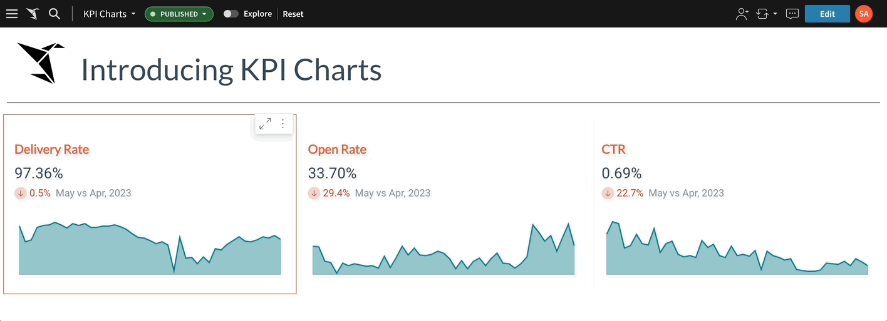
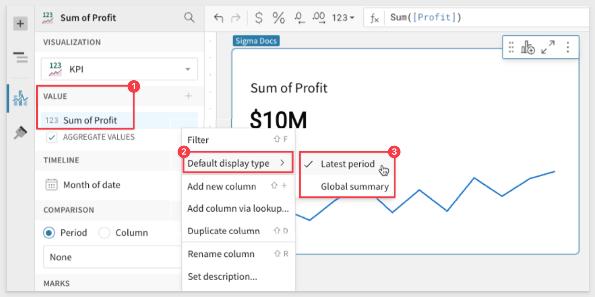
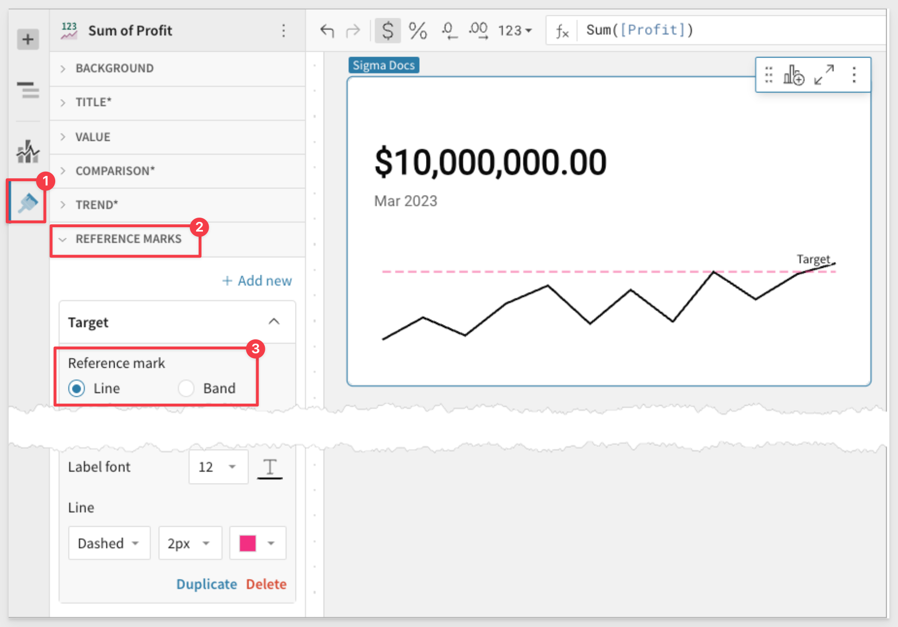
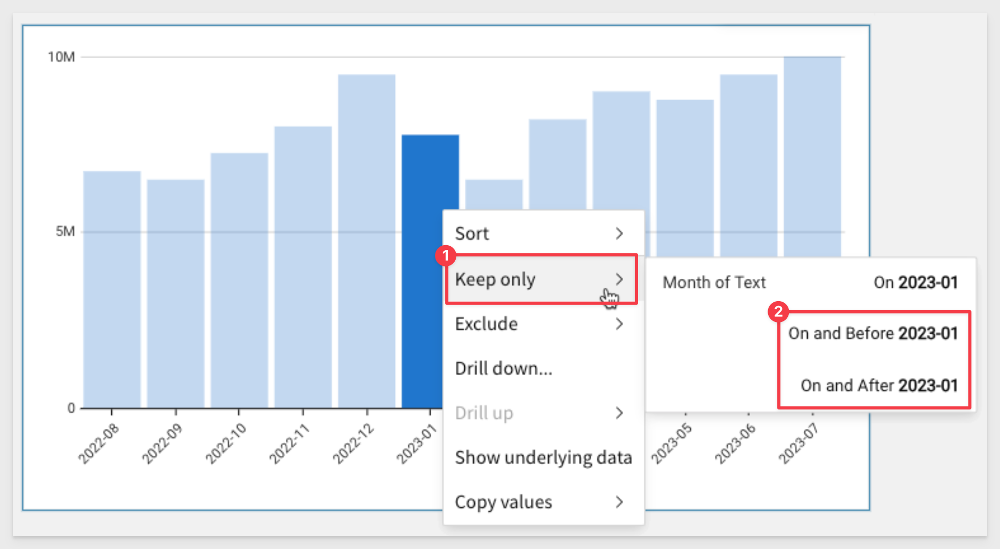
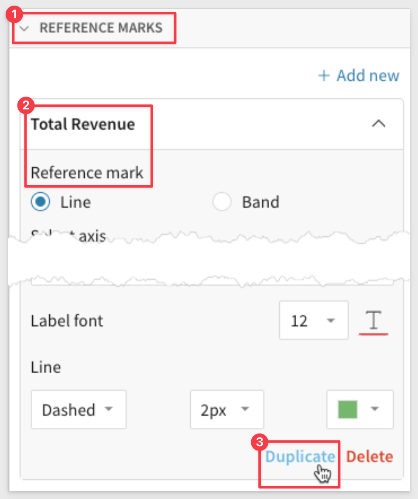
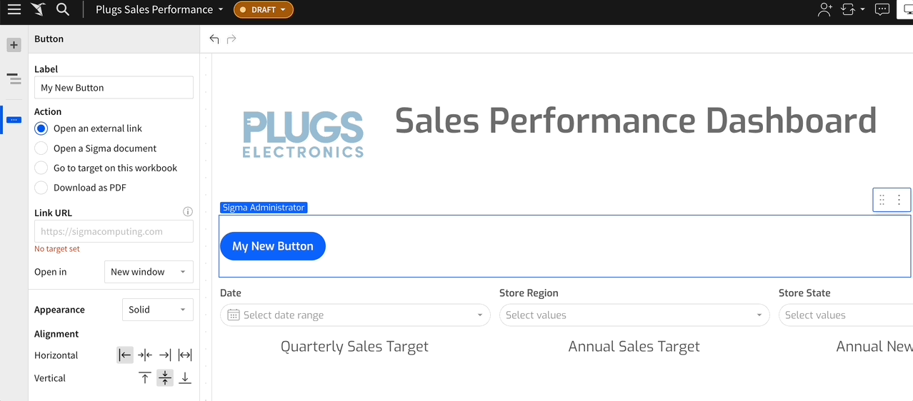
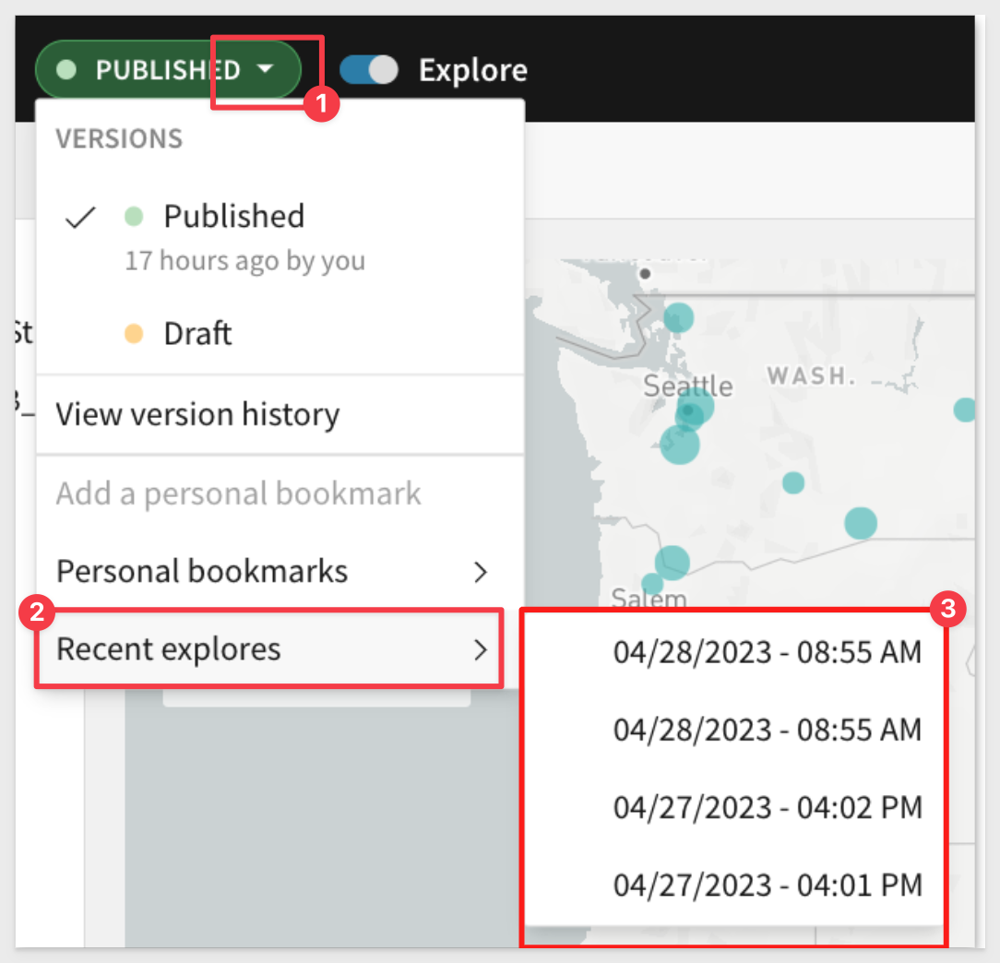

author: pballai
id: 07_2023_first_friday_features
summary: 07_2023_first_friday_features
categories: Administration
environments: web
status: Published
feedback link: https://github.com/sigmacomputing/sigmaquickstarts/issues
tags: first_friday_features_2023

<!-- 
Weeks Added so far:
Release notes for the month of June 2023 features, published on first Friday of July
7.7.2023 (no release notes for this short week)
7.14.23
7.21.23
7.28.23
-->

# (07-2023) July

## Overview 
Duration: 5 

This QuickStart lists all the new and public beta features released, as well as bugs fixed in July 2023.

It is summary in nature, and you should refer to the specific Sigma documentation links provided for more information.

**Public beta features will carry the section text "BETA".**

All other features are considered released (GA or generally available).

Sigma actually has feature and bug fix releases weekly, and high-priority bug fixes on demand. We felt it was best to keep these QuickStarts to a summary of the previous month for your convenience.

New QuickStarts will be published on the first Friday of each month, and will include information for the previous month.


<!-- END OF SECTION-->

## Admin Features
Duration: 20

### Connections

**Native JSON support for BigQuery:**<br>
Sigma provides full native support for the JSON data type in BigQuery connections. This enables you to process and analyze semi-structured data effectively. For details on how to use JSON, see Google documentation on [Working with JSON data in GoogleSQL](https://cloud.google.com/bigquery/docs/json-data).

### Warehouse Views
Workbook warehouse views are now generally available **(GA)**. 

Warehouse views are **virtual tables in Snowflake** that you can query using Sigma or any other application in your data ecosystem. 

Instead of storing data in a Snowflake database table, a view saves a SQL statement that expresses specific query logic defined by the data element or input table in Sigma.

Warehouse views can be very useful, depending on the use case:

 <li>
    <ol type="n"> 
      <li><strong>Simplification:</strong> They can simplify complex queries. You can create a view that presents a subset of your data or pre-aggregates data, so users can run simpler queries.</li>
      <li><strong>Security:</strong> You can use views to restrict the data that users can access. For example, you can create a view that excludes sensitive data and gives users access to the view instead of the base tables.</li>
      <li><strong>Consistency:</strong> If you have a complex calculation that is used in many queries, you can include that calculation in a view to ensure it's consistently applied.</li>
      <li><strong>Performance:</strong> In some cases, views can improve performance. For example, if you regularly run a complex, resource-intensive query, you would materialize that data and use a warehouse view to fetch the results of the query, reducing the computational load for subsequent runs.</li>
    </ol>
  </li>

[Review the FAQ for common questions.](https://www.sigmacomputing.com/product-faqs)


<aside class="positive">
<strong>IMPORTANT:</strong><br> When you create a warehouse view, you establish a live link between Snowflake and Sigma. The view references the data element or input table as the source of truth and automatically updates to reflect the most recent version of the element’s underlying data.
</aside>


The warehouse view is created and you are able to check the status [See Warehouse view status](https://help.sigmacomputing.com/docs/review-warehouse-view-details#warehouse-view-statuses)


You are able to access all of the available warehouse views under `Administration`:


For more information, see [Create and manage workbook warehouse views](https://sigma.bi/create-and-manage-workbook-warehouse-views) and [Review warehouse view details](https://sigma.bi/review-warehouse-view-details)


<!-- END OF SECTION-->

## API
Duration: 20
### Members
You can now use the `PATCH /v2/members/{memberId}` endpoint to reassign specific documents when you archive a member. In the request body, set `isArchived`` to `true`, and set `newOwnerId` to the member who will receive the documents from the archived member.

### Workbooks
Workbooks enable you to manage specific tasks within your system. When you create a new workbook using the `POST /v2/workbooks` endpoint, you can assign an owner by passing the `ownerId` in the request body. 

If you don't include this, the owner is the user whose token was used to call the API.

A new query parameter is also available for this endpoint: `versionTagId`. For more information on using Sigma version tagging, [click here](https://quickstarts.sigmacomputing.com/guide/embedding_8_version_tagging/index.html?index=..%2F..index#0)
### Connections
The `/v2/connections` endpoint now returns the following connection metadata fields:
```plaintext
{
  "account": "string",
  "warehouse": "string",
  "user": "string",
  "role": "string",
  "timeout": {
    "default": 0,
    "worksheet": 0,
    "dashboard": 0,
    "download": 0
  },
  "poolSizes": {
    "adhocPoolSize": 0,
    "catalogPoolSize": 0,
    "resultPoolSize": 0,
    "schedulePoolSize": 0
  },
  "writeAccess": boolean,
  "friendlyName": boolean,
  "writeDatabase": "string",
  "writeSchema": "string",
  "materializationWarehouse": "string"
}
```


<!-- END OF SECTION-->

## Embedding 
Duration: 20

### Convert Embed Users to Standard
Admins can now convert Embed users to Standard, or vice versa. If you convert an Embed user to Standard, you must define their Account Type. 


### Embed Parameters
The following optional user-backed embed parameters are now available:
<ul>
      <li><strong>show_workbook_name:</strong> A boolean value that displays the workbook name near the folder icon.</li>
      <li><strong>menu_position:</strong> Allows you to change the position of the toolbar to top, bottom, or none.</li>
</ul>

The `:show_footer` embed parameter is now case-insensitive, for example: `allow :show_footer=False`.

### Enhancements
 <ul>
      <li>When a user downloads a CSV from an embed, a status bar now appears at the bottom of the screen.</li>
      <li>Users can now copy and paste elements in an embed.</li>
</ul>


<!-- END OF SECTION-->


## Input Tables
Duration: 20

**"Fill range" keyboard shortcut:**
Use the `fill range` keyboard shortcut to overwrite selected cells with the value in the first (top-left) cell of the range. Select a range and apply the applicable keyboard shortcut based on your operating system:

**For macOS:**
⌘ + return

**For Windows:**
ctrl + enter


<!-- END OF SECTION-->

## Templates
Duration: 20

### Share Templates with different orgs
You can share Sigma templates with other organizations. 

This functionality is particularly useful for customers who manage multiple Sigma organizations or need to create new Sigma organizations for their customers. 

By allowing you to share templates across different organizations, it streamlines the process of providing consistent tools and resources, enhancing collaboration with your customers.

<aside class="positive">
<strong>IMPORTANT:</strong><br> When you share a template, no actual data is shared with the recipient organization.
</aside>

### Templates tab
The templates tab is now split between `External` and `Internal`. 

 <ul>
      <li><strong>Internal:</strong> Templates created by members of your organization.</li>
      <li><strong>External:</strong> Templates shared with your organization.</li>
</ul>


<!-- END OF SECTION-->

## Visualizations
Duration: 20

### KPI Charts
KPI chart elements are now generally available (GA). 

These new elements add a new level of visual interactivity to your Sigma workbooks, enhancing user engagement and encouraging repeated visits.



For more information about KPI charts, see [Build a KPI chart](https://sigma.bi/build-a-kpi-chart).

### Time series KPI updates:

Change the default display type (the value displayed when not interacting with the trend line) in the **Value** property:
<ul>
      <li><strong>Latest period:</strong> Display the aggregate value for the most recent period in the time series.</li>
      <li><strong>Global summary:</strong> Display the aggregate value for all periods in the time series.<li>
</ul>


 
You can now add reference lines and bands to the trend line in `Element format` > `Reference marks`.


 
### Centered reference mark labels
Chart reference marks now support center-positioned labels. In the `Element format` > `Reference marks` section, click the `Position` field and select `Top center` or `Bottom center` to display the label above or below the line.


### Chart color scales
When you apply color scales to charts (in the `Element properties` > `Marks` > `Color tab`), the color menu now displays all options in various sequential and diverging color scale categories. The menu also offers new color scales, including color-blind accessible options.

The full palette:


### Data point filters
Charts now include additional date filtering options in the data point menu, which can be accessed by right-clicking any data point. 

Previously, the `Keep only` and `Exclude` filters allowed you to filter based on the single date value associated with a data point. Now, you can filter a date range that starts or ends with the data point's date value by selecting the `On and after` or `On and before` options:



### Duplicate reference marks
Charts that support references marks now allow you to duplicate existing reference lines or bands in the `Element format` > `Reference marks` section:



### Double-click chart legend values
Chart legends in Sigma now support double-click actions. 

Before this update, a rapid double-click was interpreted as two separate inputs, selecting the value with the first click and deselecting it with the second. Now, Sigma treats a rapid double-click as a single input.

### Stretchable buttons
You can now stretch your button elements to take up the entire width of the element. 

This adjustment allows you to align your buttons regardless of the text length. It's a small but useful user interface improvement that some users will certainly appreciate.




<!-- END OF SECTION-->

## Workbooks
Duration: 20

### Copy + Paste Full Workbook Pages (Beta)

<aside class="positive">
<strong>IMPORTANT:</strong><br> This feature is currently in Beta and subject to quick, iterative changes. As a result, the latest product version may differ from the contents of this document.
</aside>

You can copy a page from one workbook to another, and from one page to another. 

This feature will save users time by allowing easy reuse of existing, full pages. This eliminates the need to copy individual page elements, one at a time.

[Link to documentation](https://help.sigmacomputing.com/docs/copy-a-page-within-and-between-workbooks)

### Multi-tab Excel Exports (GA)
The Multi-tab Excel export feature has been promoted to general availability (GA), for all Sigma customers.

You can now merge your Excel exports to be in a single file, with one element in each excel tab through `Scheduled Exports` and `Send Now`.

There are three ways to get multi-tab excel exports:

1. Individual elements can be selected and merged into a single Excel file, with one element per tab. Users can select multiple individual elements and choose Excel for “Format as”. Once they select more than one element for Excel format, a “Merge Excel Files” check box appears.

2. Entire page can be selected, and each element from that page will automatically be merged into a single Excel file with one element per tab.

3. Entire workbook can be selected, and each element will automatically be merged into a single excel file with one element per tab regardless of what page it was on.

Users can also do a combination of these. 

For example: if you have an attachment for an entire workbook, entire page, and four other elements, and I checked the `merge Excel`` option, three Excel files will be sent in the email, one for the workbook, one for the entire page, and one for the four combined elements.

### Personal Bookmarks (Beta)
<aside class="positive">
<strong>IMPORTANT:</strong><br> This feature is currently in Beta and subject to quick, iterative changes. As a result, the latest product version may differ from the contents of this document.
</aside>

Bookmarks now provide a notification when changes made (such as changing a filter’s value) for the bookmark are no longer relevant in the workbook. In other words, someone changed the base workbook such that the bookmark is no longer accurate. A modal gives the option of updating or deleting the bookmark.

**Background:**
Up until now, copying a workbook URL with some changes captured a snapshot in time. It was a static asset, decoupled from the published version.

This proved to be problematic because when the "original" workbook is updated, those changes are not propagated such that the bookmarked URLs users had made still referred to the old workbook.

For example, creators would publish a workbook, apply some filters, then share that link out to their users. Later, the creator would make updates to their workbook, and get complaints that their viewers that the still had an old draft since they were using a "stale" url. 

Many customers thought something was broken in Sigma and this wasn’t an intuitive experience.

Personal bookmarks address this issue by making the URL dynamic, and update with the original workbook. Explore URLs capture the individual edits on top of a published version. 

In the case where you do just want a static snapshot of a workbook, you can still simply choose the `Save As` option.

**Recent Explores**
Often users make multiple explorations but do not save them, only to discover later that they wished the had. 
Recent explores address this but keeping track of all your unsaved explorations:



### Table cell images (Beta)
<aside class="positive">
<strong>IMPORTANT:</strong><br> This feature is currently in Beta and subject to quick, iterative changes. As a result, the latest product version may differ from the contents of this document.
</aside>

Tables can now display images in cells. When a column contains image URLs, you can render the images by selecting `Transform` > `Set image` in the column menu.


Image columns have some display options:


<!-- END OF SECTION-->

## Bug Fixes
Duration: 20

Bug releases are broken down by week for specificity.

### Week ending 7.07.2023
No release notes during this period.

### Week ending 7.14.2023
 
 <ul>
      <li>Images in emails sent using Sigma are improved and more readable.</li>
      <li>Keyboard navigation in input tables is no longer disabled after the Hide column keyboard shortcut (shift+H) is applied. </li>
      <li>Linked input tables no longer create duplicate records when one or more users edit the same row in multiple browser tabs.</li>
      <li>Custom domain settings in region maps now modify color scales as intended.</li>
</ul>

### Week ending 7.21.2023
 
 <ul>
      <li>We resolved an embed issue where visualizations failed to render in certain scenarios.</li>
 </ul>

### Week ending 7.28.2023

 <ul>
      <li>In some cases, setting up dynamic roles in a Snowflake connection resulted in an error. </li>
      <li>If you copy an element in an embed document, it no longer returns an error. </li>
      <li>Resolved an issue with expanding rows and single element exports.</li>
      <li>Resolved an issue where choosing Edit Join in the source of the join deselected all selected columns.</li>
      <li>Resolved an issue where Display Values for Boolean list controls did not show by enabling users to create a manual list of display values for Boolean controls and adding their own interpretation of True and False.</li>
      <li>Resolved an issue causing input table elements to continuously display the "Saving" spinner after input table edits were successfully saved in the workbook's Published version. Users no longer need to reload the browser page to clear the spinner</li>
</ul>


<!-- END OF SECTION-->

## Additional Information
Duration: 20
<!-- THE FOLLOWING ADDITIONAL RESOURCES IS REQUIRED AS IS FOR ALL QUICKSTARTS -->
**Additional Resource Links**

[Help Center Home](https://help.sigmacomputing.com)<br>
[Sigma Community](https://community.sigmacomputing.com/)<br>
[Sigma Blog](https://www.sigmacomputing.com/blog/)<br>
<br>

[](https://twitter.com/sigmacomputing)&emsp;
[](https://www.linkedin.com/company/sigmacomputing)&emsp;
[](https://www.facebook.com/sigmacomputing)


<!-- END OF WHAT WE COVERED -->
<!-- END OF QUICKSTART -->
