author: pballai
id: 07_2023_first_friday_features
summary: 07_2023_first_friday_features
categories: Administration
environments: web
status: Published
feedback link: https://github.com/sigmacomputing/sigmaquickstarts/issues
tags: first_friday_features

<!-- 
Weeks Added so far:
Release notes for the month of June 2023 features, published on first Friday of July
7.7.2023 (no release notes for this short week)
7.14.23
7.21.23

Slack Call Outs:

FFF is now "In Product"....screenshot

Copy + Paste Full Workbook Pages is now in Public Beta :sigma-new: :sigma-new:
https://help.sigmacomputing.com/hc/en-us/articles/17802897614739-Copy-a-page-within-and-between-workbooks-Beta-

the Column Level Security on dataset is ready for beta.
Here is the link to CLS dataset demo video:
https://www.loom.com/share/de9d25b374db4a03aaab22cba34de16b

For org to onboard to beta, we will need to add the org id to this feature flag:
tps://console.statsig.com/7q6eRauyxm9jEhv935p0uP/gates/user_attributes_cls_dataset

Multi-tab Excel Export is now GA:
You can now Merge your excel exports to be in a single file with one element in each excel tab through Scheduled Exports and Send Now!
There are 3 ways to get multi-tab excel exports
1. Individual elements can be selected and merged into a single excel file with one element per tab. Users can select multiple individual elements and choose Excel for “Format as”. Once they select more than 1 element for Excel format a “Merge Excel Files” check box appears.
2. Entire Page can be selected and each element from that page will automatically be merged into a single excel file with one element per tab
3. Entire Workbook can be selected and each element will automatically be merged into a single excel file with one element per tab regardless of what page it was on.
Users can do a combination of these. Example: if I have an attachment for the entire workbook, entire page, and 4 other elements and I checked the merge excel option, then I would get 3 Excel files in the email, one for the workbook, one for the entire page, and one for the 4 combined elements
https://help.sigmacomputing.com/hc/en-us/articles/4409017989907-Send-a-Workbook-to-Email
https://help.sigmacomputing.com/hc/en-us/articles/4409010016019-Send-Slack-notifications
https://help.sigmacomputing.com/hc/en-us/articles/13139937361427-Schedule-Exports-to-Google-Sheets-or-Drive

Bookmarks have been launched to public beta for all customers (what's new in sigma / Dillon Morrison)

-->


# (07-2023) July Highlights

## Overview 
Duration: 5 

This QuickStart lists all the new and public beta features released, as well as bugs fixed in July 2023. 

It is summary in nature and you should refer to the specific [Sigma documentation](https://help.sigmacomputing.com/hc/en-us) links provided for more information.

**Public beta features will carry the section text "BETA".** 

All other features are considered released (GA or generally available).
 
Sigma actually has feature and bug fix releases weekly, and high-priority bug fixes on demand. We felt is was best to keep these QuickStarts to a summary of the previous month for your convenance.

New QuickStarts will be published on the first Friday of each month, and will include information for the previous month. 


<!-- END OF SECTION-->

## Admin Features
Duration: 20

### Connections

**Native JSON support for BigQuery:**
Sigma provides full native support for the JSON data type in BigQuery connections. This enables you to process and analyze semi-structured data effectively. For details on how to use JSON, see Google documentation on [Working with JSON data in GoogleSQL](https://cloud.google.com/bigquery/docs/json-data).
### Warehouse Views
Workbook warehouse views are now generally available. 

Warehouse views are **virtual tables in Snowflake** that you can query using Sigma or any other application in your data ecosystem. 

Instead of storing data in a Snowflake database table, a view saves a SQL statement that expresses specific query logic defined by the data element or input table in Sigma.

Warehouse views can be very useful, depending on the use case:

 <li>
    <ol type="n"> 
      <li><strong>Simplification:</strong> They can simplify complex queries. You can create a view that presents a subset of your data or pre-aggregates data, so users can run simpler queries.</li>
      <li><strong>Security:</strong> You can use views to restrict the data that users can access. For example, you can create a view that excludes sensitive data and gives users access to the view instead of the base tables.</li>
      <li><strong>Consistency:</strong> If you have a complex calculation that is used in many queries, you can include that calculation in a view to ensure it's consistently applied.</li>
      <li><strong>Performance:</strong> In some cases, views can improve performance. For example, if you regularly run a complex, resource-intensive query, you would materialize that data and use a warehouse view to fetch the results of the query, reducing the computational load for subsequent runs.</li>
    </ol>
  </li>

[Review the FAQ for common questions.](https://help.sigmacomputing.com/hc/en-us/articles/15802549297171#h_01GY47C2DDVG4CCHKYR7MG5WKG)

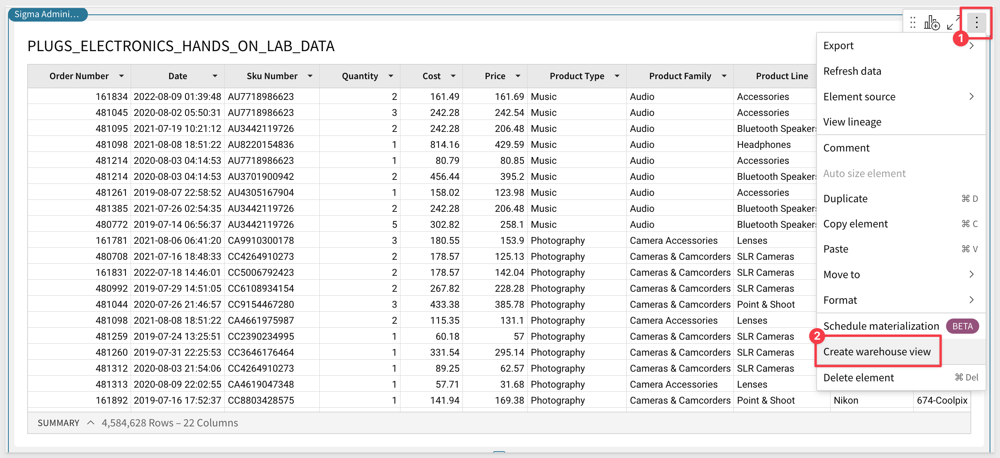

<aside class="positive">
<strong>IMPORTANT:</strong><br> When you create a warehouse view, you establish a live link between Snowflake and Sigma. The view references the data element or input table as the source of truth and automatically updates to reflect the most recent version of the element’s underlying data.
</aside>

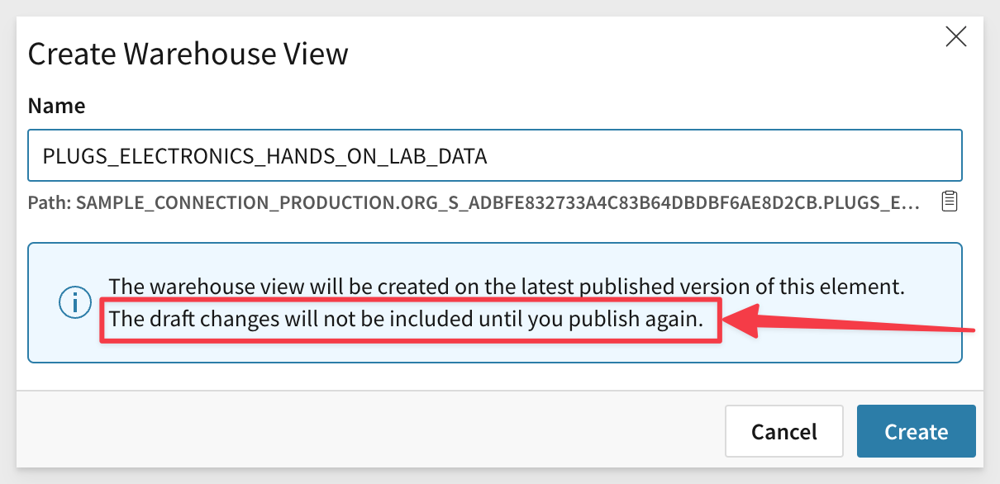

The warehouse view is created and you are able to check the status [See Warehouse view status](https://help.sigmacomputing.com/hc/en-us/articles/15802549297171#h_01GZPSFH3VD38P9ZF6EMZHMXTP):

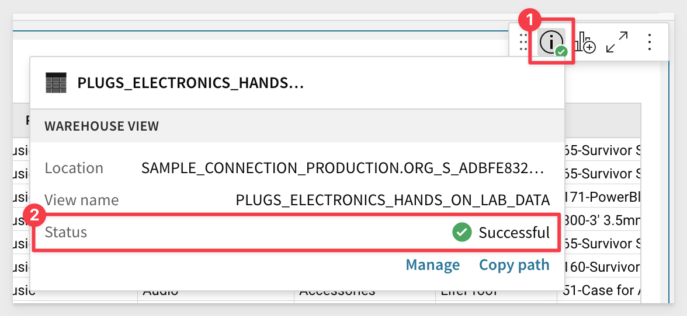

You are able to access all of the available warehouse views under `Administration`:

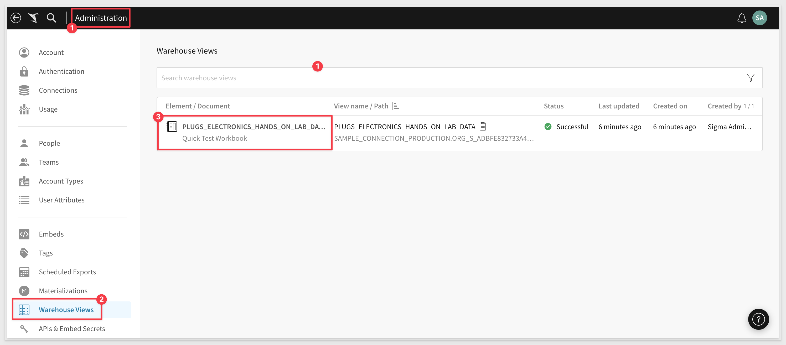


For more information, see [Create and manage workbook warehouse views](https://sigma.bi/create-and-manage-workbook-warehouse-views) and [Review warehouse view details](https://sigma.bi/review-warehouse-view-details).


<!-- END OF SECTION-->

## API
Duration: 20
### Members
You can now use the ***PATCH /v2/members/{memberId}*** endpoint to reassign documents when you archive a member. In the request body, set ***isArchived*** to ***true*** and set ***newOwnerId*** to the member who will receive the docs from the archived member.

### Workbooks
When you create a new workbook using ***POST /v2/workbooks*** endpoint, you can assign an owner by passing ***ownerId*** in the request body. If you don't include this, the owner is the user whose token was used to call the API.

A new query parameter is also available for  this endpoint, ***versionTagId***.

### Connections
The /v2/connections endpoint now returns the following Connection metadata fields:
```plaintext
{
  "account": "string",
  "warehouse": "string",
  "user": "string",
  "role": "string",
  "timeout": {
    "default": 0,
    "worksheet": 0,
    "dashboard": 0,
    "download": 0
  },
  "poolSizes": {
    "adhocPoolSize": 0,
    "catalogPoolSize": 0,
    "resultPoolSize": 0,
    "schedulePoolSize": 0
  },
  "writeAccess": boolean,
  "friendlyName": boolean,
  "writeDatabase": "string",
  "writeSchema": "string",
  "materializationWarehouse": "string"
}
```


<!-- END OF SECTION-->

## Embedding 
Duration: 20

### Convert Embed Users to Standard
Admins can now convert Embed users to Standard, or vice versa. If you convert an Embed user to Standard, you must define their Account Type. 

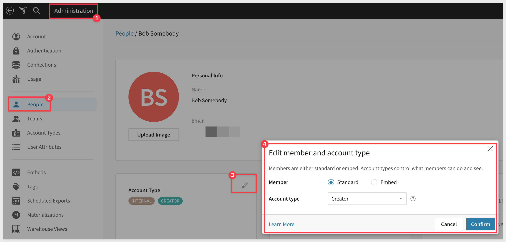

### Embed Parameters
The following optional user-backed embed parameters are now available:
<ul>
      <li><strong>show_workbook_name:</strong> A boolean value that displays the workbook name near the folder icon.</li>
      <li><strong>menu_position:</strong> Allows you to change the position of the toolbar to top, bottom, or none.</li>
</ul>

### Enhancements
 <ul>
      <li>When a user downloads a CSV from an embed, a status bar now appears at the bottom of the screen.</li>
      <li>Users can now copy and paste elements in an embed.</li>
</ul>

For more information on copy and paste elements, [click here](https://help.sigmacomputing.com/hc/en-us/articles/13531340202003-Copy-and-paste-elements)


<!-- END OF SECTION-->


## Input Tables
Duration: 20

**"Fill range" keyboard shortcut:**
Use the `fill range` keyboard shortcut to overwrite selected cells with the value in the first (top-left) cell of the range. Select a range and apply the applicable keyboard shortcut based on your operating system:

**For macOS:**
⌘ + return

**For Windows:**
ctrl + enter

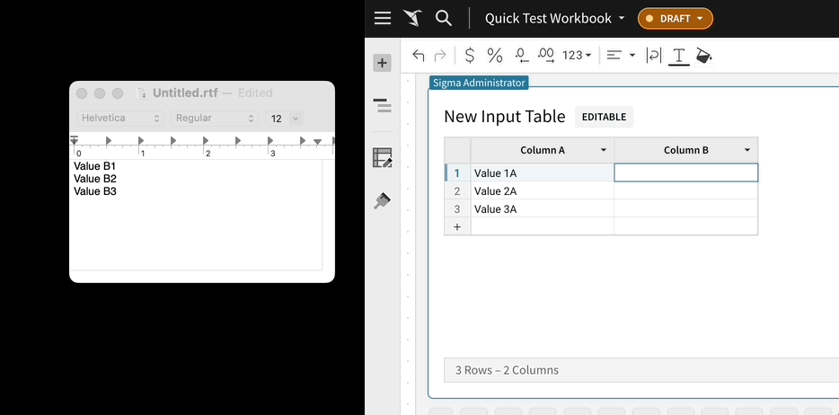


<!-- END OF SECTION-->

## Templates
Duration: 20

### Share Templates with different orgs
You can share Sigma templates with other organizations.  This functionality is useful for customers who control multiple Sigma orgs and to create new Sigma orgs for their customers, allowing you to share templates with your customers.

<aside class="positive">
<strong>IMPORTANT:</strong><br> When you share a template, no actual data is shared with the recipient organization.
</aside>

### Templates tab
The Templates tab is now split between External and Internal. 

 <ul>
      <li><strong>Internal:</strong> Templates created by members of your organization.</li>
      <li><strong>External:</strong> Templates shared with your organization.</li>
</ul>

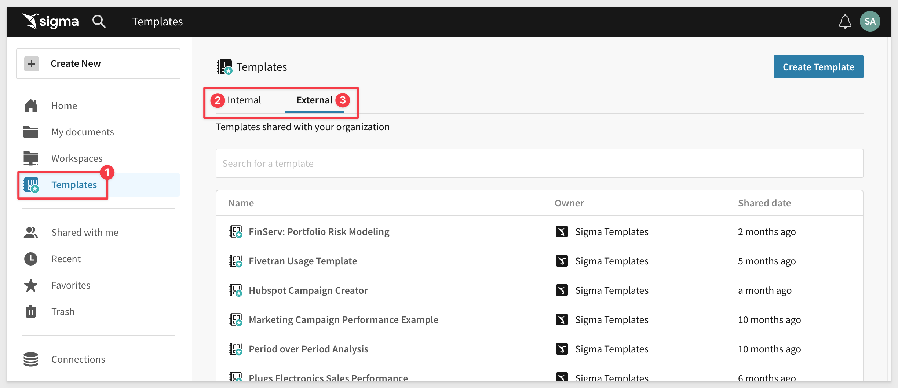


<!-- END OF SECTION-->

## Visualizations
Duration: 20

### Centered reference mark labels
Chart reference marks now support center-positioned labels. In the `Element format` > `Reference marks` section, click the `Position` field and select `Top center` or `Bottom center` to display the label above or below the line.

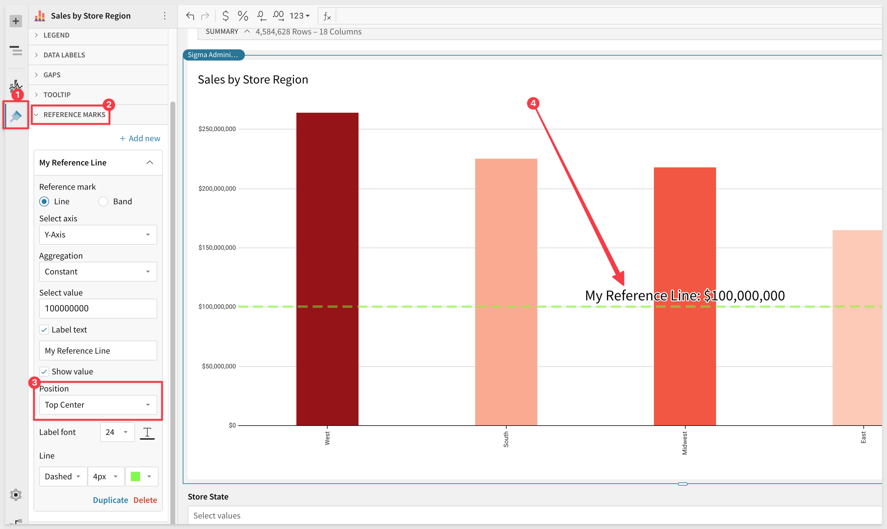

### Chart color scales
When you apply color scales to charts (in the `Element properties` > `Marks` > `Color tab`), the color menu now displays all options in various sequential and diverging color scale categories. The menu also offers new color scales, including color-blind accessible options.

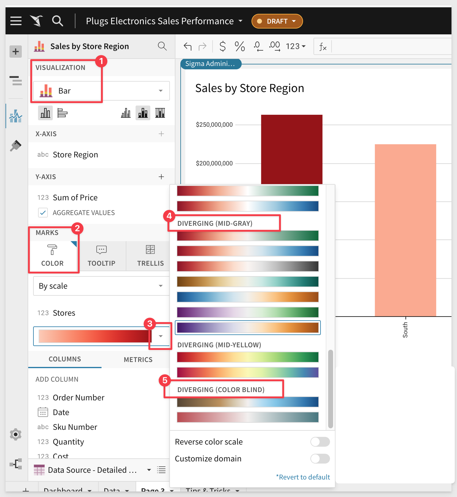

The full palette:

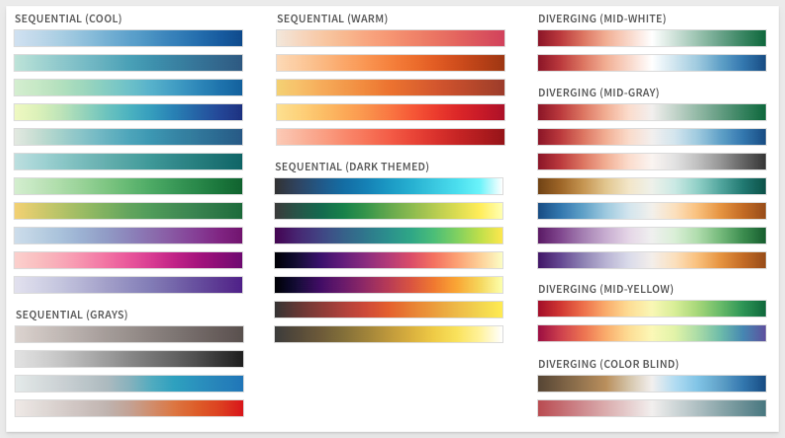

### Double-click chart legend values
Chart legends now support double-click actions. Prior to this update, Sigma interpreted a rapid double-click as two separate inputs that would select the value on the first click and deselect it on the second. Sigma now interprets a rapid double-click as a single input.


<!-- END OF SECTION-->

## Workbooks
Duration: 20

### Bookmarks (BETA)
Bookmarks now provide a notification when changes made (such as changing a filter’s value) for the bookmark are no longer relevant in the workbook. In other words, someone changed the base workbook such that the bookmark is no longer accurate. A modal gives the option of updating or deleting the bookmark.

### Table cell images (BETA)
Tables can now display images in cells. When a column contains image URLs, you can render the images by selecting `Transform` > `Set image` in the column menu.

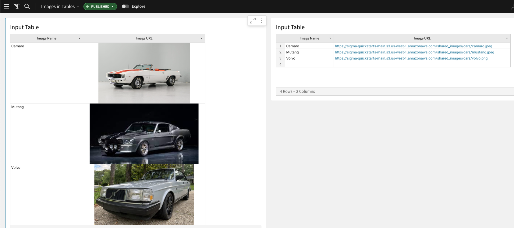

Image columns have some display options:

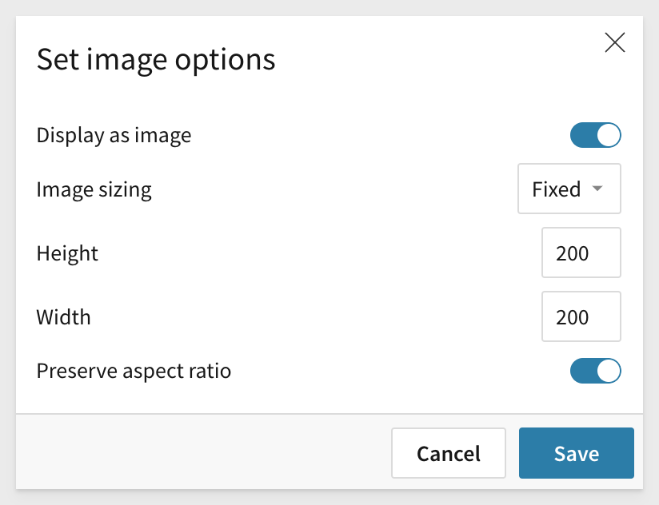


<!-- END OF SECTION-->

## Bug Fixes
Duration: 20

Bug releases are broken down by week for specificity.

### Week ending 7.07.2023
No release notes during this period.

### Week ending 7.14.2023
 
 <ul>
      <li>Images in emails sent using Sigma are improved and more readable.</li>
      <li>Keyboard navigation in input tables is no longer disabled after the Hide column keyboard shortcut (shift+H) is applied. </li>
      <li>Linked input tables no longer create duplicate records when one or more users edit the same row in multiple browser tabs.</li>
      <li>Custom domain settings in region maps now modify color scales as intended.</li>
</ul>

### Week ending 7.21.2023
 
 <ul>
      <li>We resolved an embed issue where visualizations failed to render in certain scenarios.</li>
 </ul>

### Week ending 7.xx.2023
 
 <ul>
      <li></li>
      <li></li>
      <li></li>
      <li></li>
      <li></li>
</ul>


<!-- END OF SECTION-->

## Additional Information
Duration: 20
<!-- THE FOLLOWING ADDITIONAL RESOURCES IS REQUIRED AS IS FOR ALL QUICKSTARTS -->
**Additional Resource Links**

[Help Center Home](https://help.sigmacomputing.com/hc/en-us)<br>
[Sigma Community](https://community.sigmacomputing.com/)<br>
[Sigma Blog](https://www.sigmacomputing.com/blog/)<br>
<br>

[](https://twitter.com/sigmacomputing)&emsp;
[](https://www.linkedin.com/company/sigmacomputing)
[](https://www.facebook.com/sigmacomputing)


<!-- END OF WHAT WE COVERED -->
<!-- END OF QUICKSTART -->
