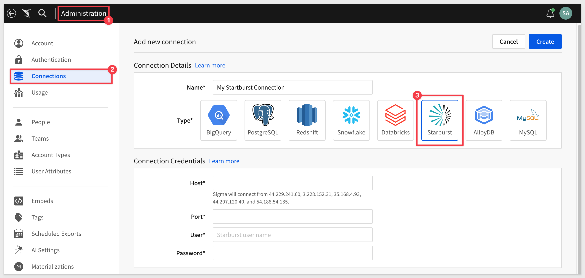
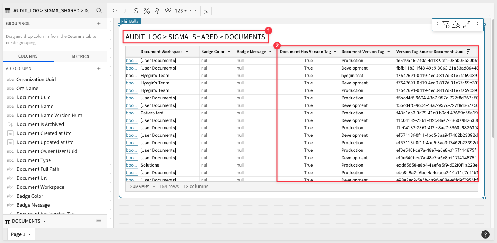
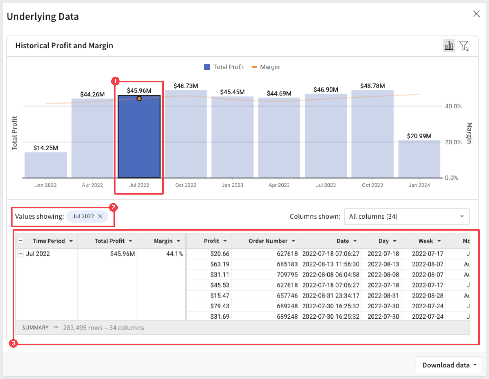
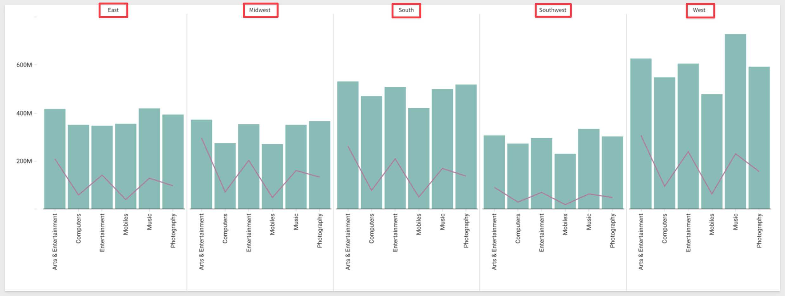
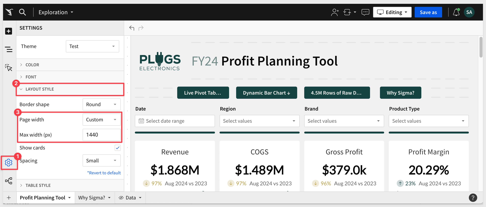
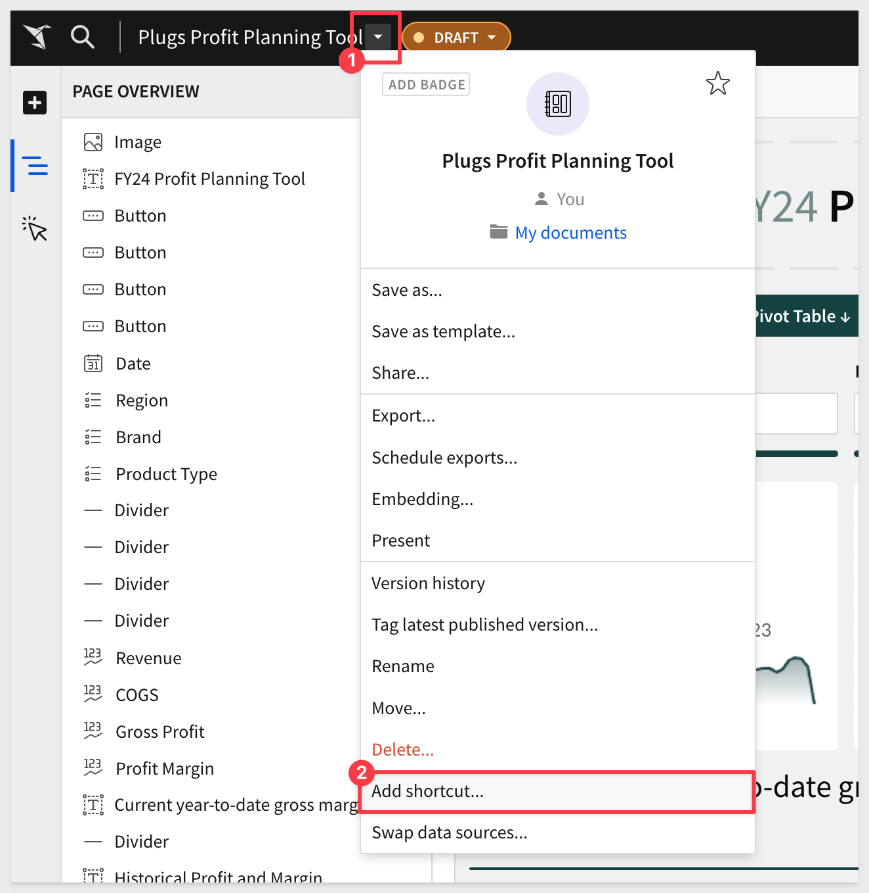
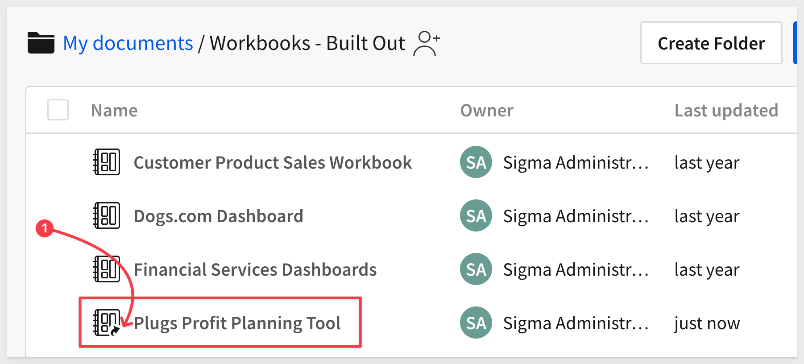

author: pballai
id: 07_2024_first_friday_features
summary: 07_2024_first_friday_features
categories: Administration
environments: web
status: Published
feedback link: https://github.com/sigmacomputing/sigmaquickstarts/issues
tags: first_friday_features
lastUpdated: 2024-08-02

# (07-2024) July
<!-- The above name is what appears on the website and is searchable. 
6 - Done
12 - Done
19 - Done
26 -  Done
Publish on Aug 2.
-->

## Overview 
Duration: 5 

This QuickStart lists all the new and public beta features released, as well as bugs fixed in July 2024.

It is summary in nature, and you should refer to the specific Sigma documentation links provided for more information.

**Public beta features will carry the section text "Beta".**

All other features are considered released (**GA** or generally available).

Sigma actually has feature and bug fix releases weekly, and high-priority bug fixes on demand. We felt it was best to keep these QuickStarts to a summary of the previous month for your convenience.

New first Friday features QuickStarts will be published on the first Friday of each month, and will include information for the previous month.

## Administration
Duration: 20

### Connection added: Starburst Galaxy
Sigma now supports connecting to your Snowflake, Databricks, BigQuery, or PostgreSQL cloud data warehouse through [Starburst Galaxy](https://docs.starburst.io/introduction/index.html), a SaaS distribution of [Trino.](https://trino.io/)

For more information, see [Connect to Starburst.](https://help.sigmacomputing.com/docs/connect-to-starburst)

### New version tag metadata in audit log (Beta)
The `AUDIT_LOG` > `SIGMA_SHARED` > `DOCUMENTS` dimension table now contains the following columns:

This metadata enables you to obtain information related to both the source workbook and the tagged version when referencing audit log entries for events like exports and downloads.

## API
Duration: 20

Lots of API changes and updates this month.

### Additional workbooks and shared templates endpoints
We have added some additional API endpoints to the [REST API](https://help.sigmacomputing.com/reference/get-started-sigma-api).

#### Share a workbook or template with another organization: 

***POST /v2/workbooks/{workbookId}/shareCrossOrg***

[Documentation](https://help.sigmacomputing.com/reference/get-started-sigma-api)

#### List templates shared with your organization: 

***GET /v2/shared_templates/shared_with_you***

[Documentation](https://help.sigmacomputing.com/reference/listtemplatessharedwithyou)

#### Accept a pending template share: 

***POST /v2/shared_templates/accept***

[Documentation](https://help.sigmacomputing.com/reference/accepttemplateshare)

#### New option for create a connection endpoint
The `Create a connection` endpoint now includes the option to connect to MySQL:

***POST /v2/connections***

#### New query parameter for List connections endpoint
The `List connections` endpoint now includes the includeArchived query parameter to return archived and inactive connections. If your request doesn't use this parameter, the response output is unchanged:

***GET /v2/connections***

### Pagination required for List endpoints
List endpoints that did not already require pagination will start requiring pagination on **September 4, 2024.**

**Specific Endpoints:** 
[List members](https://help.sigmacomputing.com/reference/listmembers) 
[List teams](https://help.sigmacomputing.com/reference/listteams) 
[List workspaces](https://help.sigmacomputing.com/reference/listworkspaces) 
[List materialization schedules for a workbook](https://help.sigmacomputing.com/reference/listmaterializationschedules) 
[List scheduled exports for a workbook](https://help.sigmacomputing.com/reference/listworkbookschedules) 

<aside class="positive">
<strong>IMPORTANT:</strong>  If you use these endpoints, update your API requests to include the limit query parameter to return a paginated response. After the change, requests without the limit parameter return a paginated response of the default page size (50).
</aside>

### New file type for List files and List member files endpoints
The `typeFilter` query parameter for the [List files](https://help.sigmacomputing.com/reference/fileslist) and [List member](https://help.sigmacomputing.com/reference/listaccessibleinodes) files endpoints now includes a symlink option that you can use to filter shortcuts in your request. 

Shortcuts are also included in the response of requests that do not include a typeFilter.

### New option for Update an inode endpoint
The [Update an inode](https://help.sigmacomputing.com/reference/filesupdate) endpoint now includes the restore option. Include the `restore` option in your request to restore previously deleted files.

## Bug Fixes
Duration: 20

*1:* The `Administration` > `Account Types` > `Create new account type` page now correctly shows the `Create, edit, and publish workbooks` permission as auto-enabled (checkbox selected) when the `Apply tags` permission is enabled.

*2:* The `Administration` > `Authentication` > `Authentication Settings and Options` section now correctly allows an admin to edit the `Company Domain Sign-up` field regardless of the configured authentication method.

*3:* `Conditional formatting` for pivot tables now applies to cells containing `Total` labels. For more information, see [Apply conditional formatting.](https://help.sigmacomputing.com/docs/working-with-pivot-tables#apply-conditional-formatting)

## Embedding
Duration: 20

### Enhanced underlying data exploration
Embedded workbooks now support the enhanced underlying data modal, which is accessible from individual data points in visualization elements.

`Right-` or `left-click` a data point and select `Show underlying data`, then explore the underlying data by modifying filters, adding and removing columns, and interacting directly with the chart and data table:

## Functions / Calculations
Duration: 20

### Sequence function
The Sequence function returns an arithmetic sequence as an array of integers based on a specified range and increment.

For more information, see [Sequence.](https://help.sigmacomputing.com/docs/sequence)

## New QuickStarts in July
Duration: 20

### Security: Open Authorization (OAuth)
In this QuickStart, we discuss and demonstrate OAuth, what it is, and why our customers want to use it. This can be a complex topic, so we break it down into easily digestible sections, including Write-back.

In simple language, OAuth provides a secure and efficient way to manage access and permissions between Sigma and Snowflake, leveraging a third-party identity management provider.

Security is on every customers mind these days. To that end, we provide some educational content upfront to help those who are less familiar get acquainted.

[Link to QuickStart](https://quickstarts.sigmacomputing.com/guide/security_oauth/index.html?index=..%2F..index#0)

### Embedding 14: Parameterized Queries
In this QuickStart, we discuss and demonstrate Sigma embedding using parameterized queries and user attributes.

Parameterized queries are quite useful when embedded customers have per-customer databases with the same schema.

[Link to QuickStart](https://quickstarts.sigmacomputing.com/guide/embedding_14_parameterized_queries/index.html?index=..%2F..index#0)

## Visualizations
Duration: 20

### Trellis formatting for combo charts

Combo charts now support trellis formatting. You can add a column as a trellis row or column to split a combo chart into a trellis.

## Workbooks
Duration: 20

### Custom workbook page width
Set a custom page width for a workbook. Specify a pixel width to constrain the elements on workbook pages to a maximum width. See [Workbook settings overview.](https://help.sigmacomputing.com/docs/workbook-settings-overview#layout-style-settings)

If you export workbook pages to PDF, use this setting to approximate the layout size of a PDF page. See [Format PDF page export layout.](https://help.sigmacomputing.com/docs/configure-additional-options-for-exports#format-pdf-export-page-layout)

### Document shortcuts (Beta)
Customers have requested that we add the ability to save links to documents in more than one location. To support this, Sigma has added shortcuts to make specific data sources easier to find in the source picker, or to organize documents to make key workbooks and data models easier to access.

It is really simple to add a shortcut to any published workbook:

The new workbook shortcut has a different icon that a standard workbook:

See [Add shortcuts to documents](https://help.sigmacomputing.com/docs/add-shortcuts-to-documents) for more details.

### Support for emailing exports to organization users and teams
When configuring an email export, the `Recipients` field now features an autocomplete dropdown that helps you search for and select an organization team or user. 

You can also continue to input specific email addresses for non-organization members with authorized domains.

For example, searching to find a specific team:

For more information about emailing workbook content , see [Export to email.](https://help.sigmacomputing.com/docs/export-to-email)

## Additional Information
Duration: 20

**Additional Resource Links**

[Blog](https://www.sigmacomputing.com/blog/) 
[Community](https://community.sigmacomputing.com/) 
[Help Center](https://help.sigmacomputing.com/hc/en-us) 
[QuickStarts](https://quickstarts.sigmacomputing.com/) 
 

&emsp;
&emsp;

