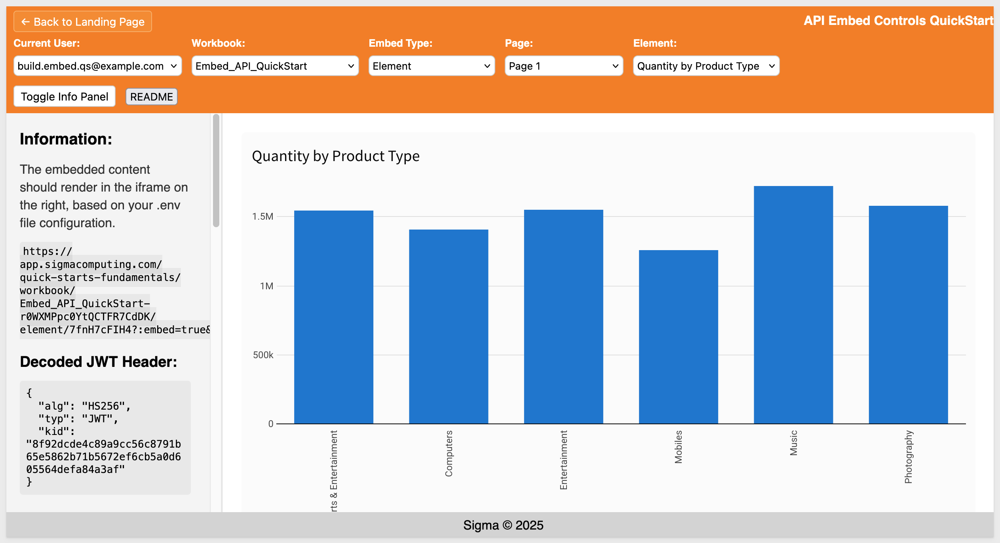
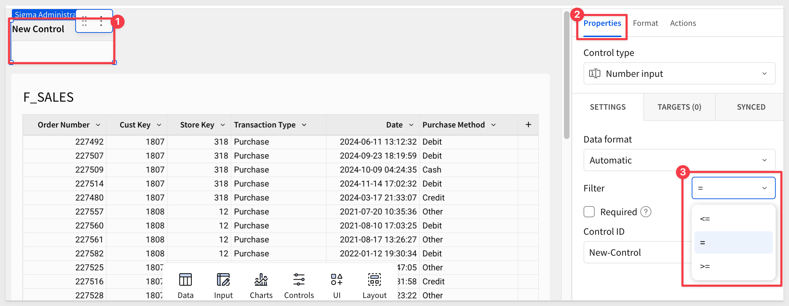

author: pballai
id: 07_2025_first_friday_features
summary: 07_2025_first_friday_features
categories: firstfridayfeatures
environments: web
status: Published
feedback link: https://github.com/sigmacomputing/sigmaquickstarts/issues
tags: first_friday_features
lastUpdated: 2025-08-01

# (07-2025) July
<!-- The above name is what appears on the website and is searchable. 


-->

## Overview 
Duration: 5 

This QuickStart lists all the new and public beta features released, as well as bugs fixed in July 2025.

It is summary in nature, and you should refer to the specific Sigma documentation links provided for more information.

### Subscribe to What's New in Sigma
For those wanting to see what Sigma is doing on each week, release notes are now also available on the [Sigma Community site](https://community.sigmacomputing.com/). There, you can **opt in to receive notifications about future release notes** in order to stay on top of everything new happening at Sigma. You can also subscribe to automated updates in any Slack channel using the Sigma Community release notes RSS feed. 

For more information on how to subscribe to release note notifications, see [About the release notes](https://community.sigmacomputing.com/t/about-the-release-notes-category/5517) 

**Public beta features will carry the section text "Beta".**

All other features are considered released (**GA** or generally available).

Sigma actually has feature and bug fix releases weekly, and high-priority bug fixes on demand. We felt it was best to keep these QuickStarts to a summary of the previous month for your convenience.

New first Friday features QuickStarts will be published on the first Friday of each month, and will include information for the previous month.

<aside class="positive">
<strong>IMPORTANT:</strong><br> Some screens in Sigma may appear slightly different from those shown in QuickStarts. This is because Sigma continuously adds and enhances functionality. Rest assured, Sigma’s intuitive interface ensures that any differences will not prevent you from successfully completing any QuickStart.
</aside>

For more information on Sigma's product release strategy, see [Sigma product releases](https://help.sigmacomputing.com/docs/sigma-product-releases)

If something is not working as you expect, here's how to [contact Sigma support](https://help.sigmacomputing.com/docs/sigma-support)


<!-- END OF SECTION-->

## Administration
Duration: 20

### Azure SQL Database, SQL Server 2022 and Azure SQL Managed Instance connections (GA)
Sigma now supports secure connections to Azure SQL Database, SQL Server 2022 and Azure SQL Managed Instances.

For more information, see [Connect to Azure SQL Database](https://help.sigmacomputing.com/docs/connect-to-azure-sql-database) and [Connect to SQL Server and Azure SQL Managed Instance.](https://help.sigmacomputing.com/docs/connect-to-sql-server-2022)

### Azure UK region
Sigma is now deployed in **Azure UK (Located in London)**, this deployment gives customers in the United Kingdom more control over data storage while enabling compliance with internal policies and external data residency requirements.

For more information, see [Supported regions, data platforms and features](https://help.sigmacomputing.com/docs/region-warehouse-and-feature-support)

### Email template changes (roll-out underway)
The default email templates used for scheduled exports, invitations to join an organization, are receiving and updated design.  

The changes are already available to some customers and will gradually become available over the next two weeks, with **full availability planned for August 8, 2025.**

<aside class="negative">
<strong>NOTE:</strong><br> Custom email templates are unaffected by this change.
</aside>

Example email:


### New events captured in audit logs
You can now view audit log `enabling` and `storage integration` events in your audit logs.

### New help page on troubleshooting input table connection issues
This page covers troubleshooting steps, error messages and resolutions and can be very useful to review prior to contacting support.

For more information, see [Input table error handling](https://help.sigmacomputing.com/docs/troubleshoot-input-table-connection-issues#input-table-error-handling)

### New supported organization locales
English (Canada) and English (Ireland) are now supported organization locales. Setting `en-ca` or `en-ie` as your organization's locale will allow for `en-ca` or `en-ie` number formatting, currency, and date formatting to be used as a default across the organization. 

For more information, see [Manage organization locale.](https://help.sigmacomputing.com/docs/manage-organization-locale)

### Restrict export frequency (GA)
Sigma admins can now restrict the frequency of scheduled exports for their organization. If this setting is enabled, users also cannot set custom cron schedules. 

For more information, see [Restrict export recipients and frequency](https://help.sigmacomputing.com/docs/restrict-export-recipients)

### Restrict export recipients to the same team (GA) 
Sigma admins can now restrict email recipients so that users can only email exports to other members of their Sigma teams.

For more information, see [Restrict export recipients and frequency](https://help.sigmacomputing.com/docs/restrict-export-recipients)

### Set up Key Pair authentication for OAuth service accounts 
You can now set up Key Pair authentication for Snowflake OAuth service accounts. 

For more information, see [Connect to Snowflake with OAuth](https://help.sigmacomputing.com/docs/connect-to-snowflake#connect-to-snowflake-with-oauth)

### Version tag metadata available in Document activity and Queries Usage dashboards.
You can now filter by version tags in the `Document activity` and `Queries Usage` dashboards. This allows you to see activity or query data only for documents with a specified version tag, such as `Production` or `Development`.

Document creation metadata is also now available in the `Queries Usage` dashboard.


<!-- END OF SECTION-->

## AI
Duration: 20

### Configure a Usage Dashboard for Ask Sigma (GA) 
Admins can now configure a usage dashboard to view data about how Ask Sigma is used in their Sigma organization.

For more information, see [Configure a usage dashboard for Ask Sigma](https://help.sigmacomputing.com/docs/configure-a-usage-dashboard-for-ask-sigma#create-a-schema-in-snowflake)

### Ask Sigma question sharing
You can now share queries you enter into Ask Sigma as a custom URL with users in your organization. When other users access the URL, Ask Sigma automatically populates the query and produces a response. For example, we can ask a question and copy the link to share:


Example link:
```code
https://app.sigmacomputing.com/XXXXX/ask?search=Which+region+had+the+highest+sales+last+year%3F
```

**You can use this feature to:**<br>
- Preconfigure an Ask Sigma experience to get new users started with the correct question.
- Save questions you want to reuse to consistently access new data insights for recurring analysis.
- Generate URLs to access Ask Sigma and embed them anywhere in your organization, for example:
    - Workbooks
    - Embed environments
    - Internal documentation

Also, if users modify the original query, Ask Sigma automatically updates the custom URL to share.

For more information, see [Share questions in a custom URL](https://help.sigmacomputing.com/docs/ask-natural-language-queries-with-ask-sigma#share-questions-in-a-custom-url)

### Automatic URL updates for Ask Sigma question sharing
There is no longer an option to manually copy a question into a custom URL. Now, when you enter a question into Ask Sigma, the URL is automatically updated with that question.

For more information, see [Ask natural language queries with Ask Sigma](https://help.sigmacomputing.com/docs/ask-natural-language-queries-with-ask-sigma)

### Explore with related charts in Ask Sigma (GA) 
After you receive an initial answer from Ask Sigma, you can continue your exploration!

Ask Sigma provides related charts underneath its primary answer to offer avenues to analyze related data:


For more information, see [Continue exploring with related charts](https://help.sigmacomputing.com/docs/ask-natural-language-queries-with-ask-sigma#continue-exploring-with-related-charts)

### Highlighted data sources for Ask Sigma
Available AI data sources are now displayed as `Highlighted data sources` in Ask Sigma. 

<aside class="positive">
<strong>IMPORTANT:</strong><br> Ask Sigma only uses highlighted data sources when you ask a question without choosing a source.
</aside>


### Observations from Ask Sigma
Ask Sigma now provides an `Observations `section as part of the output for your queries, that helps highlight relevant data and information from your query results. For example, an observation will appear like this, and give us insight into what the AI considered (Don't just trust the response from any AI!):


### Warehouse AI model integration (GA) 
If your organization is connected to Snowflake or Databricks, you can use warehouse-hosted AI models to power Sigma AI features. 

For information, see [Configure warehouse AI model integration](https://help.sigmacomputing.com/docs/configure-warehouse-ai-model-integration)


<!-- END OF SECTION-->

## API
Duration: 20

### New API endpoints to list account types and account type permissions
The following endpoints to list account types and account type permissions are now available:

`List account types` [GET /v2/accountTypes](https://help.sigmacomputing.com/docs/listaccounttypes)
`List account type permissions` [GET /v2/accountTypes/{accountTypeId}/permissions](https://help.sigmacomputing.com/docs/listaccounttypepermissions)

### New API endpoints to list and get details for data models
The following endpoints to list data models and get details for a data model are now available:

`List data models` [GET /v2/dataModels](https://help.sigmacomputing.com/reference/listdatamodels)
`Get a data model` [GET /v2/dataModels/{dataModelId}](https://help.sigmacomputing.com/reference/getdatamodel)

### New API endpoint to update tag details
The following endpoint to update tag descriptions is now available:

`Update a tag` [PATCH /v2/tags/{tagId}](https://help.sigmacomputing.com/reference/updateversiontag)


<!-- END OF SECTION-->

## Bug Fixes
Duration: 20

**1:** The Azure SCIM `PatchGroup` operation now allows for team updates for deactivated users.

**2:** The `, character` within columns is now correctly escaped for Snowflake CSV exports to cloud storage.

**3:** Coachmarks are no longer visible in exports, embed, or when using `Present`.

**4:** When editing tab names in a workbook, the & character now behaves as intended.

**5:** When multiple user avatars are visible in the header, they now overlap correctly.

**6:** You can now nest a popover element inside of a modal. Previously, this would cause an error. Popovers cannot be nested inside of popovers.

**7:** The `workbook:saveas` outbound event now returns the ID of the original workbook and the ID of the newly saved workbook. Previously, the event only returned the ID of the newly saved workbook. 

For more information, see [Outbound event reference](https://help.sigmacomputing.com/docs/outbound-event-reference#workbooksaveas)


<!-- END OF SECTION-->

## Charts
Duration: 20

### Show longer chart axis labels
In Cartesian (bar, line, combo, area, scatter, box and waterfall) charts with an `ordinal axis`, **you can now show longer axis labels.** To allocate more space for longer labels, select the` Allow longer labels` checkbox under` Data labels`.

### Show strokes for all marks within a combo chart
You can now select the `Show strokes` options `On, Off or Auto` for data labels of line, area and scatter marks in a combo chart. 

Previously, only bar marks had these options. You can also now show or hide label strokes for all series in a combo chart using `Data labels` > `Apply to all series` > `Show stroke`.


<!-- END OF SECTION-->

## Data Apps
Duration: 20

### Option to remove control selections with actions
In addition to replacing and adding control value selections, the `Set a control value` action now supports the ability to remove selections. 

When you configure separate `Set control value` actions using `Add to existing selection `and the new `Remove from existing selection option`, you can enable users to easily add and remove values from filter controls. For example:


### Pause or resume action sequences 
Pause or resume action sequences to debug and test actions. You can control the pause/resume state of individual sequences or globally change the state of all sequences in the workbook. 

To prevent stale paused states and avoid workflow disruptions, paused sequences automatically resume when the workbook is refreshed.

For more information, see [Create and manage action sequences](https://help.sigmacomputing.com/docs/create-and-manage-action-sequences#pause-or-resume-sequences)

### Set range values with actions
The Set control value action now supports `Number range` and` Range slider` controls as target elements. You can configure the action to execute the following effects:

- Set or clear the min and max values of a Number range control
- Set the range start and end values of a Range slider control


<!-- END OF SECTION-->

## Data Modeling
Duration: 20

### Additional metadata for dbt jobs
If you run dbt jobs, you can see additional metadata about the dbt models and dbt jobs in the data catalog for a connection in Sigma. View the SQL used to create the model, the last run time, the job ID and run ID, and more.

For more information, see [Manage dbt Integration](https://help.sigmacomputing.com/docs/manage-dbt-integration)

### Reference Sigma workbook elements when writing Custom SQL in data models (Beta)
When writing custom SQL in data models, you can now use the `sigma_element()` syntax to reference Sigma workbook elements. 

For more information, see [Reference existing Sigma workbook elements](https://help.sigmacomputing.com/docs/write-custom-sql#reference-existing-sigma-workbook-elements)


<!-- END OF SECTION-->

## Embedding
Duration: 20

### Ask Sigma now supported in secure embeds signed with JWT (GA) 
Secure embedding with JWTs now extends to the Ask Sigma page. 

Embed Ask Sigma in your own application to offer your end users the ability to ask natural language queries of the data they have permission to access. Apply custom theming and remove Sigma branding for seamless integration.

For more information, see [Embed Ask Sigma](https://help.sigmacomputing.com/docs/embed-ask-sigma) and [Ask natural language queries with Ask Sigma](https://help.sigmacomputing.com/docs/ask-natural-language-queries-with-ask-sigma)

There is also a QuickStart: [Embedding 08: Embedding Ask Sigma](https://quickstarts.sigmacomputing.com/guide/embedding_08_ask_sigma_v3/index.html?index=..%2F..index#0)

### Dynamic text for embed element URLs
Embed elements now accept dynamic text in the URL field. You can now press `=` while editing the URL field to open the formula bar and configure a dynamic entry. This can be used to make embed contents responsive to control values, as well as changes to other workbook elements.

### Hide bookmarks URL parameters
Sigma now provides a new `hide_bookmarks` URL parameter that enable you to hide saved views from the embed menu. This is also available in the embed sandbox.

For more information, see [Embed URL parameters](https://help.sigmacomputing.com/docs/embed-url-parameters)


<!-- END OF SECTION-->

## New QuickStarts in July
Duration: 20

### REST API use case QuickStarts Series: 
This new series demonstrate common API methods in the host application, using sample code provided in the QuickStarts public git repo. Perfect for developers embedding Sigma into SaaS apps or internal tools who want to deliver a more dynamic, personalized experience between their app and the Sigma embed.

The first one, "Getting Started" is mandatory for the others in this series, so start there to set up your local environment.

**[REST API Usage 01: Getting Started](https://quickstarts.sigmacomputing.com/guide/embedding_rest_api_usage_01_getting%20started_started/index.html?index=..%2F..index#0)**<br>
- Embed workbooks using Sigma's REST API
- Switch between Build and View users
- Dynamically load workbook, page and element options

Example of what you will build:


**[Rest API Usage 02: Bookmarks](https://quickstarts.sigmacomputing.com/guide/embedding_rest_api_usage_02_bookmarks/index.html?index=..%2F..index#0)**<br>
- Build users can save filtered views as bookmarks
- View users can apply bookmarks from a dropdown

Example of what you will build:



**[REST API Usage 03 – Bookmark Sharing with a Local DB](https://quickstarts.sigmacomputing.com/guide/embedding_rest_api_usage_03_bookmark_sharing_with_a_local_db/index.html?index=..%2F..index#0)**<br>
- Save bookmarks with user/team share settings
- Manage or delete bookmarks across both Sigma and a local DB
- Restrict bookmark access to specific roles (e.g., View vs Build users)

Example of what you will build:


<!-- END OF SECTION-->


## Workbooks
Duration: 20

### Deprecation: {{ }} format
Previously, control values could be referenced in image and embed elements using the format `{{control-id}}`. This format has been deprecated, and existing elements using this format have been migrated to use dynamic text. 

Press `=` on your keyboard to open the formula bar and reference control values via dynamic text.

### Copy/Paste improvement
Pasted elements previously appeared at the default size for that element. Now, pasted elements match the size of the copied element.

### Custom banding colors for table and pivot table rows
When formatting a table or pivot table, you can now use custom colors for row banding.

For more information, see [Banding](https://help.sigmacomputing.com/docs/format-and-customize-a-table#banding)

### Double-click to rename tabs in tabbed containers
You can now double-click the name of a tab in a tabbed container to rename it. This is in addition to the previously available rename options in the editor panel.

### Excel-formatted exports include empty cell display value
If your pivot table has an empty cell display value set, scheduled and on demand exports to Excel (XLSX) of that pivot table now include the display value.

### Export to cloud storage (GA) 
If your workbook has elements from a Snowflake or Redshift connection, exporting the data for those elements to cloud storage associated with those connections is now generally available.

### Export to Microsoft Teams and SharePoint (GA) 
You can now export a workbook, workbook page, or element from Sigma to a Microsoft Teams channel or a Microsoft SharePoint folder.

To start exporting to Teams or SharePoint, a user assigned the Admin account type must set up a [Microsoft integration](https://help.sigmacomputing.com/docs/manage-microsoft-integration)and the relevant account type permission must be enabled for users.

For more information, see [Export to Microsoft Teams](https://help.sigmacomputing.com/docs/export-to-microsoft-teams) or [Export to Microsoft SharePoint](https://help.sigmacomputing.com/docs/export-to-microsoft-sharepoint)

### Export PDFs to larger page sizes (GA)
When you export a workbook, page, or element to a PDF, you can now choose the page size. In addition to the previously supported Letter size, you can now export to Legal, Tabloid, A0, A1, A2, A3, and A4 page sizes.

### Improved details in data source selection 
When browsing for a data source in Sigma, such as when choosing or changing the source for a data element, you can see the connection name, full path to the table, and any usage statistics for the table. For example:


### Number input control operators
You can now configure a `number input` control to filter the targeted data differently. Other filter operators besides the default of `=` (equal to) to show data that is `greater than or equal to (>=)` or `less than or equal to (<=)` the inputted number value. The new functionality is shown below:



For more information, see [Intro to control elements](https://help.sigmacomputing.com/docs/intro-to-control-elements)

### Optional version tag descriptions
When you create a version tag you are no longer required to enter a description for it.

### Pivot table totals changes
The placement of pivot table totals has changed to be up one level in the table. For row totals, the change is only visible when displaying rows as separate columns. This change will be available gradually over the next week.


### Reference data elements in custom SQL statements (GA)
You can reference data elements and other custom SQL elements in SQL statements in Sigma using the `sigma_element` syntax. Creating a warehouse view from a table created using custom SQL that uses this syntax is also now supported.

For more information, see [Write custom SQL](https://help.sigmacomputing.com/docs/write-custom-sql)

### Tabbed containers (GA) 
Sigma now supports tabbed container elements. 

Add a tabbed container to your workbook pages when you want to offer multiple sets of content in the same section of your workbook canvas. A tabbed container has multiple tabs at the top of the container, which can either be visible or hidden for end users. 

By placing content on different tabs and configuring logic about which tab should display, you can allow users to experience different views in the same space without scrolling or navigating elsewhere. 


For more information, see [Use tabbed containers to organize workbook content](https://help.sigmacomputing.com/docs/use-tabbed-containers-to-organize-workbook-content)

### View column descriptions in pivot tables
If your pivot table contains columns with descriptions set, you can now hover over the column header to view the column description.

### Warehouse view support for transposed tables
You can now create a warehouse view for a transposed table.

To transpose a table, see [Transpose a table](https://help.sigmacomputing.com/docs/transpose-a-table) 

To create a warehouse view, see [Create and manage warehouse views](https://help.sigmacomputing.com/docs/create-and-manage-workbook-warehouse-views)

### Workbook descriptions 
You can now add descriptions to a workbook. Describe what the workbook is for, how it can be used, and other useful information. Workbook descriptions can be viewed by anyone with access to view the workbook.

**To add a description:**<br>
- Select the workbook name to open the document menu, then select `About this workbook.`
- In the text box below the workbook name, type a description. The description saves automatically.


<!-- END OF SECTION-->

## Additional Information
Duration: 20

**Additional Resource Links**

[Blog](https://www.sigmacomputing.com/blog/)<br>
[Community](https://community.sigmacomputing.com/)<br>
[Help Center](https://help.sigmacomputing.com/hc/en-us)<br>
[QuickStarts](https://quickstarts.sigmacomputing.com/)<br>
<br>

[](https://twitter.com/sigmacomputing)&emsp;
[](https://www.linkedin.com/company/sigmacomputing)&emsp;
[](https://www.facebook.com/sigmacomputing)


<!-- END OF SECTION-->
