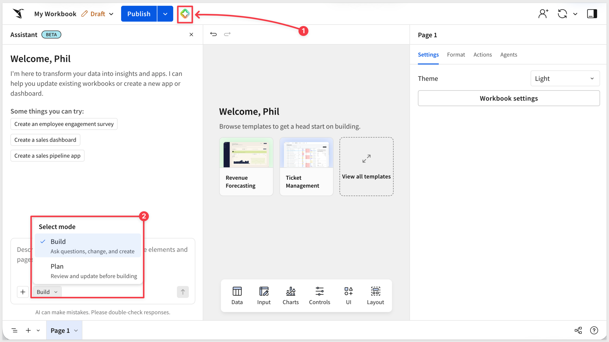
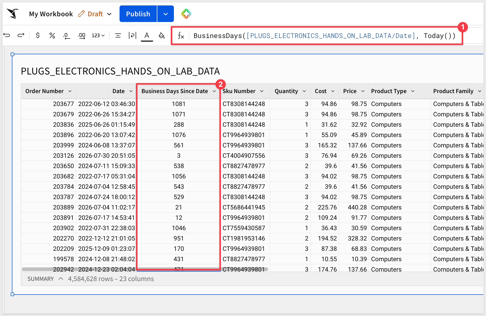
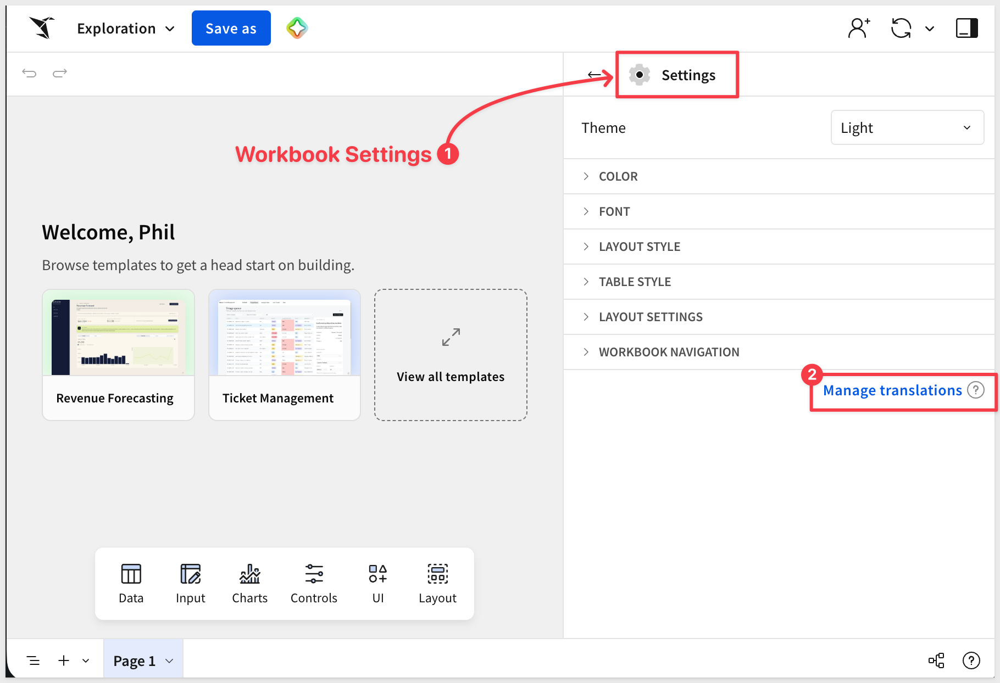
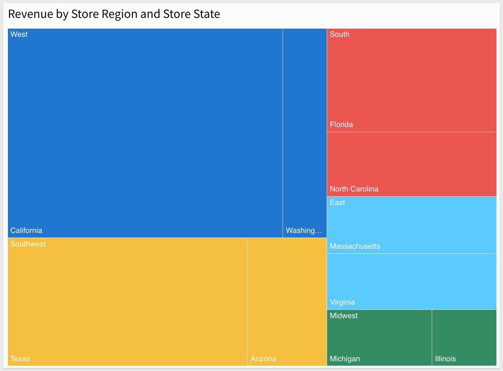

author: pballai
id: 07_2026_first_friday_features
summary: 07_2026_first_friday_features
categories: firstfridayfeatures
environments: web
status: Published
feedback link: https://github.com/sigmacomputing/sigmaquickstarts/issues
tags: first_friday_features
lastUpdated: 2026-08-07

# (07-2026) July
<!-- The above name is what appears on the website and is searchable.

June 26, 2026 changes: done (rolled over from June FFF)
July 3, 2026 changes: n/a (docs platform migration)
July 10, 2026 changes: done
July 17, 2026 changes: done
July 24, 2026 changes: done
July 31, 2026 changes: done

Publish on August 7

-->

## Overview 
Duration: 5 

This QuickStart lists all the new and public beta features released, as well as bugs fixed in July 2026.

It is summary in nature, and you should refer to the specific Sigma documentation links provided for more information.

**Public beta features will carry the section text "Beta".**

All other features are considered released (**GA** or generally available).

Sigma actually has feature and bug fix releases weekly, and high-priority bug fixes on demand. We felt it was best to keep these QuickStarts to a summary of the previous month for your convenience.

New first Friday features QuickStarts will be published on the first Friday of each month, and will include information for the previous month.

### Subscribe to What's New in Sigma
For those wanting to see what Sigma is doing on each week, release notes are now also available on the [Sigma Community site](https://community.sigmacomputing.com/). There, you can **opt in to receive notifications about future release notes** in order to stay on top of everything new happening at Sigma. You can also subscribe to automated updates in any Slack channel using the Sigma Community release notes RSS feed. 

For more information on how to subscribe to release note notifications, see [About the release notes](https://community.sigmacomputing.com/t/about-the-release-notes-category/5517)

### Sigma help documentation redesign
Sigma's help documentation site has been updated with a new homepage, a dedicated function reference section, and an enhanced API explorer with code representation views. The site also supports markdown export for any page.

<aside class="positive">
<strong>IMPORTANT:</strong>  Some screens in Sigma may appear slightly different from those shown in QuickStarts. This is because Sigma continuously adds and enhances functionality. Rest assured, Sigma’s intuitive interface ensures that any differences will not prevent you from successfully completing any QuickStart.
</aside>

For more information on Sigma's product release strategy, see [Sigma product releases](https://help.sigmacomputing.com/docs/sigma-product-releases)

If something is not working as you expect, here's how to [contact Sigma support](https://help.sigmacomputing.com/docs/sigma-support)

<!-- END OF SECTION-->

## Administration
Duration: 20

### Azure Australia region support (GA)
Sigma now supports the Azure Australia region, with new deployments hosted in `australiaeast` and disaster recovery in `australiasoutheast`, reducing latency for customers in Australia.

For more information, see [Supported regions, data platforms, and features](https://help.sigmacomputing.com/docs/region-warehouse-and-feature-support)

### Custom email branding and SMTP configuration relocation (GA)
Email branding settings and SMTP configuration have moved to the **Email customization** tab under `Administration` > `Scheduled exports & actions`. Functionality is unchanged.

For more information, see [Customize email branding](https://help.sigmacomputing.com/docs/custom-email-branding)

### Delete connection sessions (GA)
Users can now sign out of active connection sessions from their profile, giving individuals direct control over live connection credentials without administrator intervention.

For more information, see [Delete a current connection session](https://help.sigmacomputing.com/refresh-connection-sign-in-sessions#delete-a-current-connection-session)

### Deploy folders to tenants (Beta) 
Deploy a folder and all its contents — workbooks, reports, and data models — to tenant organizations in a single operation.

**WHY IT MATTERS:** 
For teams managing content across multiple tenant organizations, folder-level deployment replaces a series of individual document deployments with one governed action — reducing the overhead of keeping tenant environments in sync as content evolves.

For more information, see [Deploy content to tenant organizations](https://help.sigmacomputing.com/docs/deploy-content-to-tenant-organizations)

### Deploy reports to tenant organizations (Beta)
Reports can now be included in deployment policies, allowing them to be pushed to tenant organizations alongside workbooks and data models.

For more information, see [Deploy content to tenant organizations](https://help.sigmacomputing.com/docs/deploy-content-to-tenant-organizations)

### Embed user export destinations (Beta)
Embed users can now export directly to organization-configured Slack and Microsoft Teams integrations, without requiring access to a full Sigma account.

For more information, see [Manage embed user settings (Beta)](https://help.sigmacomputing.com/docs/manage-embed-user-settings)

### Hide sender information in export emails (GA)
A new setting lets administrators obscure which user scheduled or sent an export in the email body, giving organizations more control over how automated emails are presented to recipients.

For more information, see [Customize your organization’s email branding](https://help.sigmacomputing.com/docs/custom-email-branding#customize-your-organizations-email-branding)

### Localization settings renamed (GA)
The **Locale** section in account settings has been renamed to **Localization**, and **Account locale** has been renamed to **Account language**. Functionality is unchanged.

For more information, see [Manage workbook localization](https://help.sigmacomputing.com/docs/manage-workbook-localization)

### Manage tenant attributes from parent organization (Beta)
Parent organization administrators can now create and assign custom attributes for tenant organizations directly from the Administration portal, without switching into each tenant.

For more information, see [Create and manage tenant organizations](https://help.sigmacomputing.com/docs/create-and-manage-tenant-organizations)

### Redeploy documents to tenants (Beta)
Documents within an existing deployment policy can now be manually redeployed to tenant organizations without recreating the full policy.

For more information, see [Create and manage tenant organizations](https://help.sigmacomputing.com/docs/create-and-manage-tenant-organizations)

### Sigma Tenants (GA) 
Sigma Tenants is now generally available, allowing organizations to set up a multitenant architecture with multiple Sigma organizations under a single account. Designed for enterprises and ISVs managing separate business units, regions, or customer deployments, Sigma Tenants is a premium feature.

**WHY IT MATTERS:** 
Multitenancy has historically required separate Sigma instances or complex shared-infrastructure workarounds. Sigma Tenants gives enterprises and ISVs a governed, first-class path to isolate organizations, manage content deployment centrally, and audit activity per tenant — without the overhead of maintaining multiple accounts.

For more information, see [Multitenancy at Sigma](https://help.sigmacomputing.com/docs/multitenancy-at-sigma)

### Tenant Audit Log Storage Integrations (Beta)
Administrators can now export tenant audit logs to cloud storage, enabling centralized log management across tenant organizations.

For more information, see [Configure tenant audit log storage integrations](https://help.sigmacomputing.com/docs/create-and-manage-tenant-organizations#configure-tenant-audit-log-storage-integrations)

### Tenant Deployment Audit Events (GA)
A new `TENANTS` event category is now available in the Audit Logs connection, tracking deployment management, policy changes, and capability grants across tenant organizations.

For more information, see [Audit log events and metadata](https://help.sigmacomputing.com/docs/audit-log-events-and-metadata)

### Universal result cache (Beta)
Recent queries can now be cached in external storage, reducing warehouse compute consumption and improving response times for repeated or similar queries.

For more information, see [Manage universal result cache (Beta)](https://help.sigmacomputing.com/docs/manage-universal-result-cache)

### Universal result cache: OAuth support (GA)
The universal result cache now supports connections using OAuth authentication, extending query caching to all warehouse authentication types.

### Visualize dependencies in deployment policy (GA)
Deployment policies now display which dependent documents will be deployed alongside the primary content, giving administrators visibility into the full deployment scope before pushing changes.

For more information, see [Example: Software development lifecycle](https://help.sigmacomputing.com/docs/deployment-use-cases-and-examples#example-software-development-lifecycle)

<!-- END OF SECTION-->

## AI
Duration: 20

### AI spend templates (GA) 
Three new workbook templates — Claude, OpenAI, and Snowflake — visualize the costs associated with AI tool usage across your organization. Use them as a starting point for internal AI cost tracking and governance reporting:

**WHY IT MATTERS:** 
AI spend is increasingly showing up in IT and finance conversations — and right now most teams have no easy way to see where it's going. These templates give you a working cost dashboard on day one, built on live data, without starting from scratch.

### AI usage dashboard (GA) 
A new dashboard tracks token consumption, conversations, engagement, and model usage across your organization. Includes an AI analyst agent for querying usage data in natural language:

**WHY IT MATTERS:** 
As AI usage scales across teams, cost visibility becomes a governance requirement. The AI usage dashboard gives administrators a live view of consumption by model, user, and feature — the audit trail enterprises need before expanding AI access broadly.

For more information, see [AI usage dashboard](https://help.sigmacomputing.com/docs/ai-usage)

### Amazon Bedrock AI provider support (GA)
Amazon Bedrock is now a supported AI provider, allowing Sigma's AI-powered features to run on Anthropic foundation models through your existing Bedrock configuration.

**WHY IT MATTERS:** 
Enterprises with AWS infrastructure can now route Sigma's AI requests through their own Bedrock account — keeping AI workloads inside their AWS boundary and satisfying data residency or compliance requirements.

For more information, see [Add Amazon Bedrock as an AI provider](https://help.sigmacomputing.com/docs/manage-external-ai-integrations#add-amazon-bedrock-as-an-ai-provider)

### Anthropic as an AI provider (Beta)
Add an Anthropic API key to connect Sigma's AI features directly to Anthropic's models, without routing through Amazon Bedrock.

For more information, see [Manage external AI integrations](https://help.sigmacomputing.com/docs/manage-external-ai-integrations)

### Improved AI columns support for Databricks (Beta)
AI columns on Databricks connections now support configurable response formats and include usage visibility for monitoring token consumption.

For more information, see [Create AI columns (Beta)](https://help.sigmacomputing.com/docs/create-ai-columns)

### Monitor MCP queries (GA)
Tag Sigma MCP server queries with `"kind":"mcp"` to track costs and usage in the AI usage dashboard, giving administrators visibility into LLM consumption from MCP-based workflows.

For more information, see [Use the Sigma MCP server](https://help.sigmacomputing.com/docs/use-sigma-mcp-server)

### Natural language questions about usage data (GA)
The Users and Document Activity dashboards now support AI agent queries, letting administrators ask questions about usage patterns in plain language. Requires a configured AI provider:

<video src="assets/ai_user2.mp4"></video>

### Sigma Plugin for ChatGPT (GA) 
A one-click installation connects Sigma's MCP server to ChatGPT, letting users query Sigma workbooks, data models, and live data directly from their ChatGPT workflow.

**WHY IT MATTERS:** 
Analysts who live in ChatGPT can now access live Sigma data without switching context — with access governed by Sigma's existing permissions and audit logging intact.

For more information, see [Set up the Sigma MCP server in ChatGPT](https://help.sigmacomputing.com/docs/use-sigma-mcp-server#set-up-the-sigma-mcp-server-in-chatgpt)

<!-- END OF SECTION-->

## API
Duration: 20

### API connector from cURL (GA)
Import an API connector configuration directly from a cURL command, reducing manual setup when converting existing API calls into Sigma connectors.

For more information, see [Create an API connector based on a cURL request](https://help.sigmacomputing.com/docs/configure-api-credentials-and-connectors-in-sigma#create-an-api-connector-based-on-a-curl-request)

### Connection-level OAuth options (GA)
Connections can now be configured with independent OAuth settings — client ID, client secret, and scopes — per connection, enabling different OAuth configurations across environments.

For more information, see [Manage connections](https://help.sigmacomputing.com/docs/manage-connections)

### CSV files in lineage endpoints (GA)
List lineage endpoints now include uploaded CSV files as data sources. CSV entries display with a `csv-upload` type and include a `csvId` field.

For more information, see [List lineage tree](https://help.sigmacomputing.com/reference/list-lineage-tree) and [List data model lineage tree](https://help.sigmacomputing.com/reference/list-data-model-lineage-tree)

### Dataset to Data Model migration endpoint (Beta)
A new `POST /v2/datasets/:datasetId/migrate` endpoint supports programmatic migration of datasets to data models, including a dry-run option to validate the migration before committing.

For more information, see [Migrate a dataset to a data model](https://help.sigmacomputing.com/reference/migrate-dataset-to-data-model)

### Enhanced connection API responses (GA)
Connection API responses now include write destination information for OAuth connections, giving programmatic workflows access to writeback configuration details.

For more information, see [List connections](https://help.sigmacomputing.com/reference/list-connections)

### Enhanced connection configuration (GA)
The connection creation and update endpoints now support additional options including queue size, writeback descriptions, dynamic table configuration, and Python warehouse settings.

For more information, see [Create a connection](https://help.sigmacomputing.com/reference/create-connection)

### Export endpoint enhancements (GA)
The workbook and report send/schedule endpoints now support Cc and Bcc recipients, adding flexibility to automated report distribution.

For more information, see [Send workbook](https://help.sigmacomputing.com/reference/send-workbook) and [Send report](https://help.sigmacomputing.com/reference/send-report)

### Export report pages (GA)
The data export endpoint now accepts a `pageId` parameter, enabling programmatic export of specific report pages.

For more information, see [Export data](https://help.sigmacomputing.com/reference/export-data)

### List connection paths filtering (GA)
The connection paths endpoint now supports filtering by `connectionId`, making it easier to scope path queries to a specific connection.

For more information, see [List connection paths](https://help.sigmacomputing.com/reference/list-connection-paths)

### Report endpoints suite (GA)
Nineteen new report endpoints add programmatic control over version history, duplication, source swapping, SQL queries, controls, lineage, columns, grants, pages, and tags.

For more information, see the [API reference](https://help.sigmacomputing.com/reference)

### Revoke user OAuth tokens endpoint (GA)
A new `POST /v2/members/:memberId/revoke` endpoint allows administrators to revoke a member's OIDC and warehouse connection tokens without interrupting active sessions.

For more information, see [Revoke member tokens](https://help.sigmacomputing.com/reference/revoke-member-tokens)

### Semantic views in lineage (GA)
Snowflake semantic views now appear in lineage endpoint responses, enabling complete lineage tracing for workbooks sourcing data from semantic layer definitions.

For more information, see [List lineage tree](https://help.sigmacomputing.com/reference/list-lineage-tree)

### Starburst and Azure SQL DB connection support (GA)
The connection creation endpoint now supports Starburst and Azure SQL DB as connection types.

For more information, see [Create a connection](https://help.sigmacomputing.com/reference/create-connection)

### Workbook to report conversion endpoint (GA)
A new `POST /v2/workbooks/{workbookId}/convertToReport` endpoint enables programmatic conversion of workbooks to reports.

For more information, see [Convert a workbook to a report](https://help.sigmacomputing.com/docs/convert-workbooks-to-reports#convert-a-workbook-to-a-report)

### Workbook version restore endpoint (GA)
A new `POST /v2/workbooks/:workbookId/restoreVersion` endpoint enables restoring a workbook to a previous version programmatically.

For more information, see [Restore workbook version](https://help.sigmacomputing.com/reference/restore-workbook-version)

<!-- END OF SECTION-->

## AI Apps
Duration: 20

### Add data model tables as data sources for agents (Beta)
Data model tables can now be used as sources for Sigma agents, giving builders access to governed, semantic-layer data when configuring agent capabilities:

For more information, see [Build Sigma agents](https://help.sigmacomputing.com/docs/build-agents)

### Assistant in build mode: balance sheet creation (Beta)
Sigma Assistant in build mode now supports guided balance sheet creation, with adaptive data structure support and snapshot and comparative layouts for financial analysis.

### Assistant in build mode: formula join keys (Beta)
Sigma Assistant in build mode can now join tables on formulas and expressions, not just raw columns, enabling more flexible data assembly during workbook construction.

### Assistant Multiple Choice Prompts (Beta)
Sigma Assistant in build mode can now offer users predefined response options, guiding them through structured workflows and capturing consistent input.

### Assistant Proposed Feedback (Beta)
Sigma Assistant in build mode now detects when a user may be dissatisfied and proactively suggests sending feedback. Users can review, edit, or dismiss the proposal before it's sent.

### Customize first agent message (Beta)
Builders can now set a fixed greeting message for agents rather than relying on an AI-generated response. Configure agents to open every conversation with a specific, controlled message — such as "Welcome to Sigma!"

For more information, see [Build agents](https://help.sigmacomputing.com/docs/build-agents#customize-the-first-agent-message)

### GraphQL endpoint support in API connectors (GA)
API connectors now support GraphQL endpoints, allowing agents and actions to execute queries and mutations against GraphQL APIs in addition to REST.

### Insert row(s) action (Beta)
A new action type allows agents and actions to insert one or more rows into an input table. Rows can contain new defined values or data pulled from existing workbook sources.

For more information, see [Create actions that modify input table data](https://help.sigmacomputing.com/docs/create-actions-that-modify-input-table-data)

### Parse API responses to tables (Beta)
API connector call actions can now insert multiple rows by parsing array structures from API responses, turning list and paginated responses into table data.

### Sigma Assistant plan and build modes (Beta)
Sigma Assistant now supports plan and build modes in the workbook, enabling natural language construction of dashboards, charts, tables, KPIs, forms, and AI-powered apps.

**WHY IT MATTERS:** 
Plan and build modes shift Sigma Assistant from answering questions to constructing workbooks. Describe what you want to build, review the plan before a single element is created, and end up with a governed, publishable workbook — live on real data, with version history and permissions intact from the start.

For more information, see [Build Dashboards and Apps with Sigma Assistant](https://quickstarts.sigmacomputing.com/guide/aiapps_build_with_assistant/index.html?index=..%2F..index#0)

<!-- END OF SECTION-->

## App Templates
Duration: 20

### App templates (Beta)
A growing library of pre-built app templates is now available, covering common business scenarios including Project Management, Revenue Forecasting, Demand Planning, and seven additional use cases. Use templates as a starting point and customize them to your data and workflows:

<!-- END OF SECTION-->

## Bug Fixes
Duration: 20

**1:** Restored documentation MCP server functionality.

**2:** Fixed inactive version tag timestamps to show correct dates.

**3:** Preserved element layout positions when copying/pasting multiple elements.

**4:** Resolved Snowflake Cortex Agent warehouse selection issues.

**5:** Improved tooltip theme setting compliance.

**6:** Preserved code representation `id` values in data model creation endpoint.

**7:** Linked input table creation now validates write-back schema compatibility before proceeding.

**8:** Improved document deployment with custom page visibility for tenant organizations.

**9:** Resolved deployment of tagged documents in policy folders.

**10:** Assistant now preserves Top-N SQL results in charts.

**11:** API credentials dropdown is now searchable.

**12:** Source swap policy lists now display completely.

**13:** Conditional formatting can now remove bold from totals and subtotals.

**14:** Sigma agents now support Snowflake Cortex Agent names that contain spaces.

**15:** Fixed an error when granting stored procedure access.

**16:** MCP server details have moved from the Profile screen to the Integrations screen.

**17:** AI usage dashboard no longer fails when archival errors are present.

**18:** Custom SQL elements now deploy successfully with source swap policies and specific connection paths.

**19:** Improved KPI chart loading performance on initial workbook open.

**20:** User name and email are now shared with warehouse agents when using Sigma Assistant.

<!-- END OF SECTION-->

## Data Modeling
Duration: 20

### Databricks Unity Catalog metric views (Beta)
Databricks Unity Catalog metric views are now browsable in Sigma's data catalog. Use metric views as sources for tables, pivots, and charts, and write custom SQL queries against them.

For more information, see [Sigma integration with Databricks Unity Catalog](https://www.sigmacomputing.com/blog/sigma-integration-with-databricks-unity-catalog) and [Unity Catalog metric views](https://docs.databricks.com/aws/en/uc-semantics/metric-views/)

<!-- END OF SECTION-->

## Functions / Calculations
Duration: 20

### BusinessDays function (GA) 
The new `BusinessDays` function calculates the number of weekdays between two dates, including both the start and end dates and excluding weekends.

**WHY IT MATTERS:** 
Date calculations in business contexts — SLA tracking, payment terms, project timelines — routinely need to exclude weekends. A dedicated function makes these calculations accurate and readable without workarounds.

For more information, see [BusinessDays](https://help.sigmacomputing.com/docs/businessdays)

<!-- END OF SECTION-->

## New QuickStarts in July
Duration: 20

### Automate Sigma from the Command Line with the Sigma CLI
[This QuickStart](https://quickstarts.sigmacomputing.com/guide/developers_sigma_cli/index.html?index=..%2F..index#0) shows how to install and use the Sigma CLI (`sigcli`), a typed command-line wrapper over Sigma's REST API, to turn repetitive administrative work into repeatable, auditable automation.

It walks through how to:
* Install and configure `sigcli` with a named authentication profile
* Map CLI commands to the underlying REST API and discover resources with built-in help
* Read JSON output and reshape it with `jq`
* Export a governance snapshot of members, connections, and workbooks to CSV
* Wrap the inventory in a script you can run on a schedule

**WHY IT MATTERS:** 
Anything you can do in the Sigma REST API, you can now do from a script — turning one-off administrative clicks into repeatable automation for inventory, provisioning, and deployment. Because every command runs through the same API, permissions, and audit logging as the rest of Sigma, that automation stays governed.

### Build Dashboards and Apps with Sigma Assistant
[This QuickStart](https://quickstarts.sigmacomputing.com/guide/aiapps_build_with_assistant/index.html?index=..%2F..index#0) shows how to use Sigma Assistant's `Plan` and `Build` modes to design and construct dashboards and AI apps from scratch, then refine them conversationally — all live on your data.

It walks through how to:
* Use Assistant's `Plan` and `Build` modes, and switch between them
* Start from a governed data model and let semantic search find the right source
* Plan a build from a design image, and have Assistant question the plan before building
* Build a revenue forecast with actuals, a projection, KPIs, and COGS/margin views
* Refine the result conversationally, adding controls and adjusting the forecast

**WHY IT MATTERS:** 
This moves Assistant from analysis to construction — describe what you want in plain language and get a governed, publishable workbook rather than a throwaway mockup. Builders design and iterate faster while the result stays live on real data, with Sigma's permissions and version history intact.

### Sigma Starter Apps
Sigma Starter Apps are fully built, production-ready applications covering common business workflows across finance, sales, operations, and support. Each app is built entirely on Sigma's native capabilities — input tables, AI agents, actions, and live warehouse data — and comes with a QuickStart that walks through the design patterns so you can adapt it to your own data.

* [Budget Variance](https://quickstarts.sigmacomputing.com/guide/starter_apps_budget_variance/index.html?index=..%2F..index#0)
* [Demand Planning](https://quickstarts.sigmacomputing.com/guide/starter_apps_demand_planning/index.html?index=..%2F..index#0)
* [Headcount Planning](https://quickstarts.sigmacomputing.com/guide/starter_apps_headcount_planning/index.html?index=..%2F..index#0)
* [Marketing Analytics](https://quickstarts.sigmacomputing.com/guide/starter_apps_marketing_analytics/index.html?index=..%2F..index#0)
* [Pipeline Forecasting](https://quickstarts.sigmacomputing.com/guide/starter_apps_pipeline_forecasting/index.html?index=..%2F..index#0)
* [Project Management](https://quickstarts.sigmacomputing.com/guide/starter_apps_project_management/index.html?index=..%2F..index#0)
* [Revenue Forecasting](https://quickstarts.sigmacomputing.com/guide/starter_apps_revenue_forecasting/index.html?index=..%2F..index#0)
* [Shift Management](https://quickstarts.sigmacomputing.com/guide/starter_apps_shift_management/index.html?index=..%2F..index#0)
* [Territory Management](https://quickstarts.sigmacomputing.com/guide/starter_apps_territory_management/index.html?index=..%2F..index#0)
* [Ticket Management](https://quickstarts.sigmacomputing.com/guide/starter_apps_ticket_management/index.html?index=..%2F..index#0)

<!-- END OF SECTION-->

## Workbooks
Duration: 20

### Ad hoc calculated columns in pivot tables (GA)
Pivot tables now support one-off calculated columns for analysis without modifying the underlying dataset.

### Array unnesting for tables (GA)
The new Unnest feature creates table rows from array data, expanding nested arrays into a flat, analyzable table structure.

For more information, see [Create a table from an array](https://help.sigmacomputing.com/docs/create-a-table-from-an-array)

### Button element icons (GA)
Button and navigation elements now support icons alongside labels, or as a standalone replacement for text, giving interactive controls and navigation a more visual and compact appearance:

<video src="assets/icons.mp4"></video>

For more information, see [Button elements](https://help.sigmacomputing.com/docs/button-elements#customize-button-properties)

### Cancel materializations in progress (GA)
Users can now request cancellation of in-progress element materializations, giving more control over long-running operations without waiting for them to complete.

### Configure data loading (GA)
A new data loading configuration option lets builders manage prefetch queries for specific elements, optimizing performance for pages with multiple or complex data sources.

### Convert workbooks to reports (GA) 
Existing workbooks can now be converted to reports, enabling pixel-level formatting control and more reliable export behavior:

**WHY IT MATTERS:** 
Builders who already have a workbook no longer need to rebuild it as a separate report asset to get pixel-perfect formatting and reliable exports. Convert in place and keep everything you've already built.

For more information, see [Convert workbooks to reports](https://help.sigmacomputing.com/docs/convert-workbooks-to-reports)

### Enhanced export formatting (GA)
Excel and Google Sheets exports now preserve cell background color, text color, row banding, and font properties from the source workbook.

**WHY IT MATTERS:** 
Export fidelity has long been a gap between what analysts see in Sigma and what stakeholders receive. Preserving formatting in Excel and Sheets exports means reports land polished and ready to share — without manual cleanup.

### Find in table (GA) 
Find in table is now generally available, letting users search for specific values within tables and input tables directly in the workbook.

<video src="assets/findintable.mp4"></video>

**WHY IT MATTERS:** 
For analysts working with large datasets, locating a specific row or value without sorting or filtering reduces friction — especially in input tables where pinpointing a record before editing is a common step.

### Locale-based number and date formatting (GA)
Append `:lng=<language-code>` to a workbook URL to apply locale-specific number and date formatting without changing account-level localization settings.

### Mailto link support in text elements (GA)
Text elements now support `mailto:` links, allowing builders to add clickable email links directly in workbook text.

<video src="assets/send.mp4"></video>

For more information, see [Text elements](https://help.sigmacomputing.com/docs/text-elements)

### Manage translations panel (GA)
The **Manage locales** panel has been renamed to **Manage translations**. Functionality is unchanged:

### New homepage sections (Beta)
The Sigma homepage now includes **Popular activity** and **Your Work** sections, surfacing frequently accessed and recently visited content for faster navigation.

### Responsive segmented controls (GA)
Segmented controls with long display values now automatically convert to dropdown menus, preventing text truncation in compact layouts.

### Treemaps (Beta)
A new treemap element displays values as proportional nested boxes grouped by category, providing an alternative visualization for hierarchical or part-to-whole data.

For example:

For more information, see [Build a treemap (Beta)](https://help.sigmacomputing.com/docs/build-a-treemap)

<!-- END OF SECTION-->

## Additional Information
Duration: 20

**Additional Resource Links**

[Blog](https://www.sigmacomputing.com/blog/) 
[Community](https://community.sigmacomputing.com/) 
[Help Center](https://help.sigmacomputing.com/hc/en-us) 
[QuickStarts](https://quickstarts.sigmacomputing.com/) 
 

<button>[Sigma Free Trial](https://www.sigmacomputing.com/free-trial/)</button>

&emsp;
&emsp;

<!-- END OF SECTION-->
