author: pballai
id: 08_2023_first_friday_features
summary: 08_2023_first_friday_features
categories: Administration
environments: web
status: Published
feedback link: https://github.com/sigmacomputing/sigmaquickstarts/issues
tags: first_friday_features
lastUpdated: 2023_08-31

<!-- 
Weeks Added so far:
Release notes for the month of August 2023 features, published on first Friday of Sept
8.4.2023 
8.11.2023
8.18.2023
8.25.23

Make sure to include:
2: QuickStarts embedded into custom homepages
3: Create custom home pages for your users (in What's new in Sigma)
4: Hierarchies
5: Input tables with AI (beta????)
--->

# (08-2023) August Highlights

## Overview 
Duration: 5 

This QuickStart lists all the new and public beta features released, as well as bugs fixed in August 2023.

It is summary in nature, and you should refer to the specific Sigma documentation links provided for more information.

**Public beta features will carry the section text "BETA".**

All other features are considered released (GA or generally available).

Sigma actually has feature and bug fix releases weekly, and high-priority bug fixes on demand. We felt it was best to keep these QuickStarts to a summary of the previous month for your convenience.

New QuickStarts will be published on the first Friday of each month, and will include information for the previous month.

<!-- END OF SECTION-->

## Administration
Duration: 20

### Audit Logging (BETA)
<aside class="positive">
<strong>IMPORTANT:</strong>  This feature is currently in Beta and subject to quick, iterative changes. As a result, the latest product version may differ from the contents of this document.
</aside>

**New connection schema and dimension tables**
The Sigma Audit Logs connection now features a `SIGMA_SHARED` schema with dimension tables containing information about your Sigma organization's resources, objects, assets, etc.

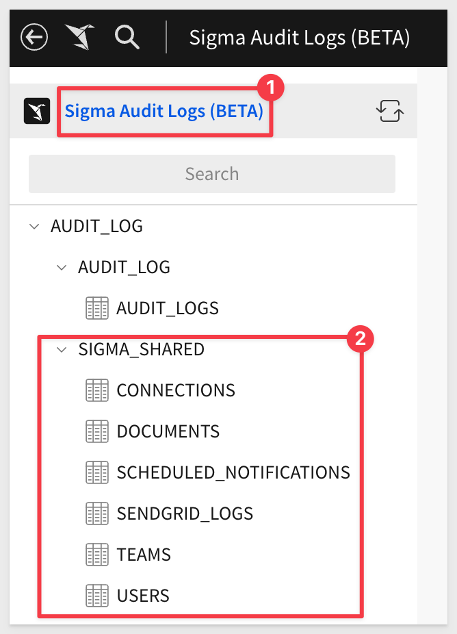

The dimension tables can be joined with the AUDIT_LOGS table to add context to audit log events. 

For example, join AUDIT_LOGS with the DOCUMENTS table to add document attributes (e.g., creation date, document path, and archive status) to event entries related to user interactions with workbooks, datasets, etc.

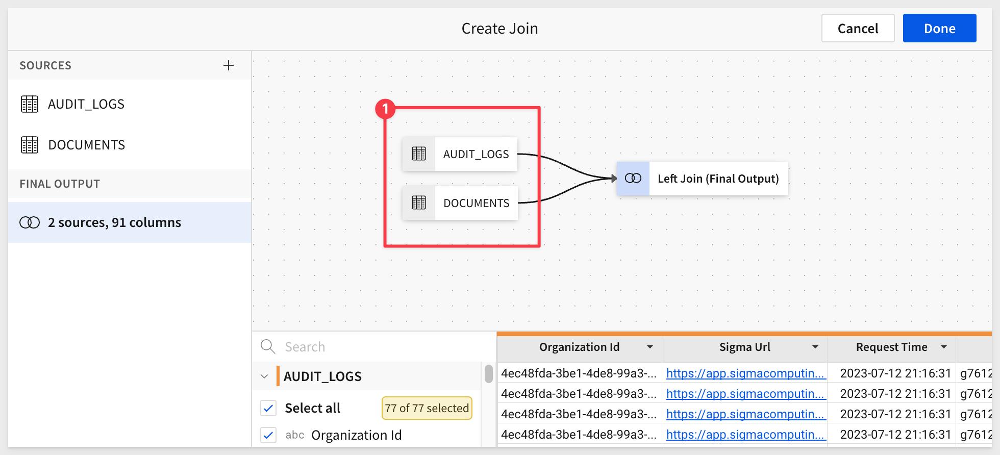

**List of New Dimension tables:**
  <ul>
     <li><Strong>CONNECTIONS:</Strong> Connection attributes</li>
     <li><Strong>DOCUMENTS:</Strong> Document attributes (for folders, workbooks, datasets, etc.)</li>
     <li><Strong>SCHEDULED_NOTIFICATIONS:</Strong> Notification attributes for scheduled exportss</li>
     <li><Strong>SENDGRID_LOGS:</Strong> Email attributes for exports</li>
     <li><Strong>TEAMS:</Strong> Organization team attributes</li>
     <li><Strong>USERS:</Strong> Organization user attributes</li>
</ul>

### Bulk actions for admins

In order to improve the admin experience and provide admin functionality at scale, numerous actions can now be performed in bulk. 

  <li></li>
    <li><Strong>User Management:</Strong> </li>
    <li>
        <ul>
           <li>Bulk password reset</li>
           <li>Bulk invite resend</li>
           <li>Bulk invite delete</li>
           <li>Bulk reactivate disabled users</li>
        </ul>
    </li>
</ul>

  <li></li>
    <li><Strong>Team Management:</Strong> </li>
    <li>
        <ul>
           <li>Bulk add team members</li>
           <li>Bulk team member transfer</li>
           <li>Bulk remove members from team</li>
           <li>Bulk team delete</li>
        </ul>
    </li>
</ul>

  <li></li>
    <li><Strong>User Attributes and Exports:</Strong> </li>
    <li>
        <ul>
           <li>Bulk delete of User Attributes</li>
           <li>Bulk delete of Scheduled Exports</li>
        </ul>
    </li>
</ul>

### Column-Level Security (Beta)
<aside class="positive">
<strong>IMPORTANT:</strong>  This feature is currently in Beta and subject to quick, iterative changes. As a result, the latest product version may differ from the contents of this document.
</aside>

Column-Level Security provides granular control over data access allowing you the flexibility to restrict or grant access to column-level data. This ensures that the security of sensitive or confidential information is only accessible to authorized users.  Column-Level Security (CLS) is managed through team membership and user attributes.  

**Column-Level Security provides the following benefits:**

 <ul>
      <li><strong>Data Protection:</strong> Secures columns that contain sensitive information.</li>
      <li><strong>Data sharing and collaboration:</strong> Organizations can share specific columns with external parties or partners without exposing the entire dataset.</li>
      <li><strong>Data Confidentiality in Multi-Tenant Environments:</strong> In multi-tenant systems or cloud-based environments, where multiple clients or orgs share the same infrastructure, CLS ensures that each tenant's data remains isolated and protected from other tenants.</li>
      <li><strong>Data Masking and Anonymization:</strong> Combine CLS with data masking and anonymization techniques to protect sensitive data, while allowing certain authorized users to work with pseudo or obfuscated values.</li>
</ul>

[Documentation Link:](https://help.sigmacomputing.com/hc/en-us/articles/18744762013843--Column-Level-Security-Beta-)

### Custom Home Pages

### New permission in Account Types
You are now able to set the ability for a user to create new folders in `Administration` > `Account Types.` 

This permission provides the option to restrict or grant folder creation permissions. To configure this in the Admin Portal, go to Account Types > Create New Account Type.

For more information, [see User Account Types.](https://help.sigmacomputing.com/hc/en-us/articles/360037430633-User-Account-Types)

To learn how to configure federated access in Sigma, [refer to this QuickStart.](https://quickstarts.sigmacomputing.com/guide/embedding_how_to_federate_access_with_sigma/index.html?index=..%2F..index#0)

<!-- END OF SECTION-->

## Embedding
Duration: 20

### New parameters available
We added the following optional parameters for user-backed embeds. 

<ul>
      <li><strong>hide_menu:</strong> If set to True, hides the menu in the bottom-left for saved workbooks.</li>
      <li><strong>hide_send:</strong> If set to True, hides the Send now option in the menu for saved workbooks.</li>
      <li><strong>hide_schedule:</strong> If set to True, hides the Schedule exports option in the menu for saved workbooks.</li>
</ul>

[For more information about using embed parameters with Sigma, please refer to this QuickStart.](https://quickstarts.sigmacomputing.com/guide/embedding_howto_leverage_parameters_and_ua/index.html?index=..%2F..index#0)

<!-- END OF SECTION-->

## Functions
Duration: 20

### Custom Functions (Beta)
<aside class="positive">
<strong>IMPORTANT:</strong>  This feature is currently in Beta and subject to quick, iterative changes. As a result, the latest product version may differ from the contents of this document.
</aside>

Use custom functions in your Sigma practice to encode business logic centrally, instead of repeating it, or have users create their own (potentially with errors). Encapsulate complex calculations that are common business use cases for easier use, and to expose your proprietary warehouse functions and make them more consumable. 

Custom functions are part of Sigma `Administration`, and under `Account` > `Custom Functions`:

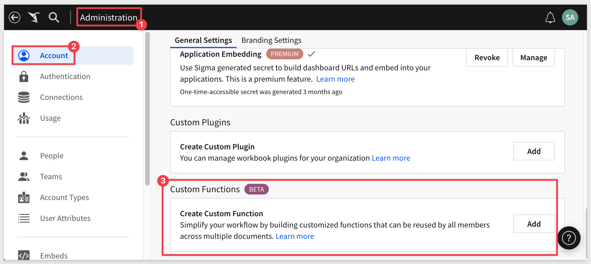

For a simple example, let's say we want to create a standard way to calculate margin that all Sigma's users (who have the appropriate rights) can use.

We simply `Add` a new `Custom Function` and define it as:

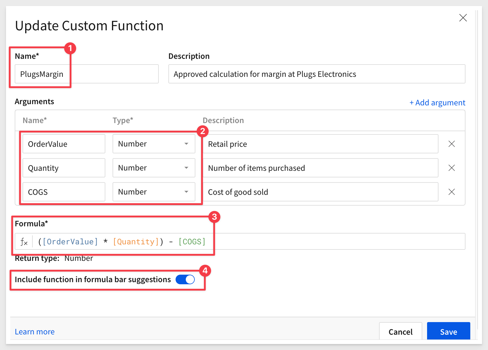

Setting the slide control to `On` (shown in blue) for `Include function in formula bar suggestions` will give users the same functionality when creating new calculations as if this new custom function was Sigma standard.

The user can simply start typing the function name in the formula bar as usual (in this case, the name is `PlugsMargin`). 

Sigma prompts the user to identify which column should be used for each required value in the custom function, but the user does not need to know or worry about the details of the underlying calculation; it just works. The column names selected do not even have to have matching names.

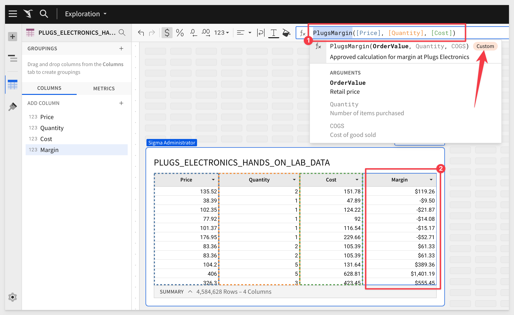

The user is made aware that this is a custom function by the bubble with the title "Custom" in the function help, as shown above.

<aside class="positive">
<strong>IMPORTANT:</strong>  Custom functions unlock the world of capabilities for Sigma users. For example, let's say your data science team has create User Defined Functions in Snowflake using Python. Custom functions can be created to leverage those into functions that are accessible to Sigma users in the same way we just demonstrated above, but without any knowledge of the underlying complexity. This can be extremely powerful.
</aside>

[Documentation Link:](https://help.sigmacomputing.com/hc/en-us/articles/18886053392531-Custom-functions-Beta-)

### New Financial Functions
To complement the Pmt (payment) function that calculates the size of a loan repayment with a constant interest rate and equal installments, Sigma added two more financial functions:

  <ul>
    <li><strong>IPmt (interest payment):</strong> calculates the part of a loan payment that is allocated to the compounding interest on the loan.</li>
    <li><strong>PPmt (principal payment):</strong> calculates the part of a loan payment that is allocated to reducing the principal owed.</li>
  </ul>

Documentation Links: 
[IPmt (interest payment)](https://help.sigmacomputing.com/hc/en-us/articles/19557454545427-IPmt) 
[PPmt (principal payment)](https://help.sigmacomputing.com/hc/en-us/articles/19557505447187-PPmt)

<!-- END OF SECTION-->

## Hierarchies (Beta)
Duration: 20
<aside class="positive">
<strong>IMPORTANT:</strong>  This feature is currently in Beta and subject to quick, iterative changes. As a result, the latest product version may differ from the contents of this document.
</aside>

Use the hierarchy feature for grouping the data and calculations at various category levels, and to keep track of the order between the coarsest and finest granularity of data. See Hierarchies (beta)

NEEDS WORK and HELP LINK

<!-- END OF SECTION-->

## Input tables (Now with AI!)
Duration: 20

Input tables now support AI-generated columns. Use structured AI prompts to perform data classification, sentiment analysis (opinion mining), and column fill (data synthesis).

AI-enhanced input tables utilize the OpenAI integration, which allows Sigma to leverage OpenAI language models (e.g., GPT-3.5 and GPT-4 models that power ChatGPT).
For more information, see Create AI-enhanced input tables.

NEEDS WORK and is this GA? or BETA?

<!-- END OF SECTION-->

## MySQL (GA release)
Duration: 20
MySQL connector is now generally available (GA) to all Sigma customers. 

Sigma supports connections to the MySQL database, for release 8.0 or higher.

[Documentation Link:](https://help.sigmacomputing.com/hc/en-us/articles/16500957079059-Connect-to-MySQL)

<!-- END OF SECTION-->

## New QuickStarts in August
Duration: 20

In case you missed them, here are the QuickStarts that we published last in August.

[How to: Federate Access with Sigma Embedding](https://quickstarts.sigmacomputing.com/guide/embedding_how_to_federate_access_with_sigma/index.html?index=..%2F..index#0)

[How to: Responsive iframes with Sigma](https://quickstarts.sigmacomputing.com/guide/embedding_dynamic_iframes/index.html?index=..%2F..index#0)

[How To: Leverage Parameters and User-Attributes with Sigma Embedding](https://quickstarts.sigmacomputing.com/guide/embedding_howto_leverage_parameters_and_ua/index.html?index=..%2F..index#0)

<!-- END OF SECTION-->

## Visualizations
Duration: 20

### KPI chart replaces "Single Value" visualization element
Sigma's KPI visualization element has replaced the Single Value visualization (SVV) option. 

While you can no longer create new SVV elements, you can instead build KPI charts for improved single metric analyses. 

<aside class="positive">
<strong>VERY IMPORTANT:</strong>  To preserve your saved workbooks and explorations, Sigma will not automatically upgrade existing SVV elements to KPI charts.
</aside>

For more information about the SVV deprecation and benefits of KPI charts, [see the Sigma Community post.](https://community.sigmacomputing.com/t/kpi-chart-to-replace-single-value-visualization-chart/2533)

[Documentation Link:](https://help.sigmacomputing.com/hc/en-us/articles/16233707698707-Build-a-KPI-chart)

### Sankey diagrams (GA release) 
Sankey visualization elements are now available for general use (GA).

Sankey diagrams are typically used to assess the flow and change of data between stages in a process or system. Create simple Sankey diagrams to demonstrate data distribution, workflows, networks, etc., or build advanced multi-level diagrams to analyze complex data relationships and identify changes in variables across stages, categories, or periods.

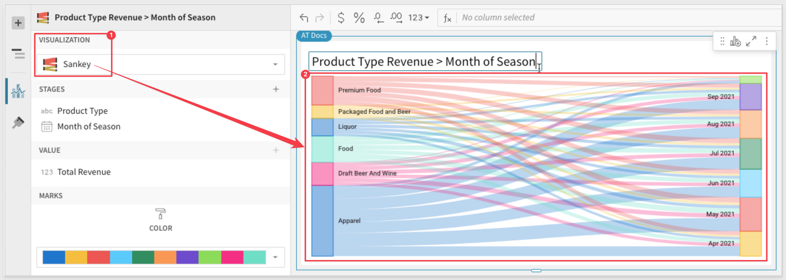

[Documentation Link:](https://sigma.bi/buiid-a-sankey-diagram)

<!-- END OF SECTION-->

## Workbooks
Duration: 20

### Attach images to annotations
Users can now attach annotated screenshots to their comments in Sigma. 

This allows `Creators` and `Admins` to capture an image of a workbook element, draw on it, and save it with a comment in the element's comments. 

An annotated picture is worth a thousand words!

For example, let's say you notice that new customer orders are off this month. 

You may want to share a comment, directed at a co-worker to investigate, so you open the comment sidebar:

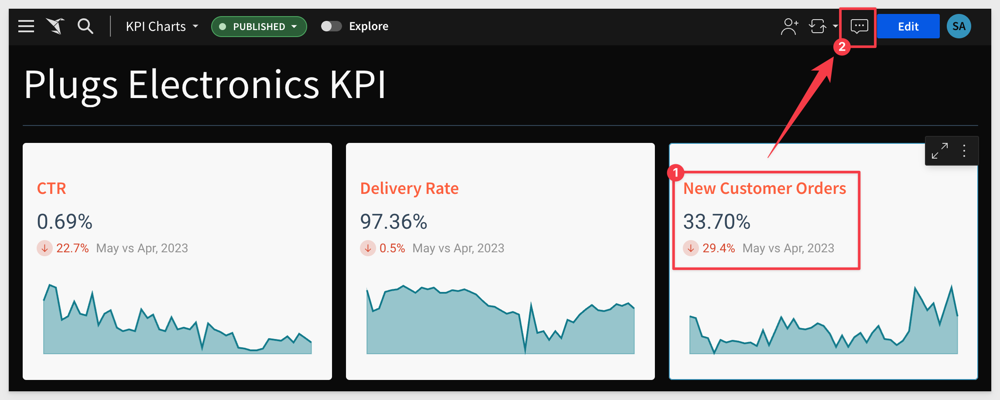

Now you can select the Workbook Element you want to include, click the camera icon:

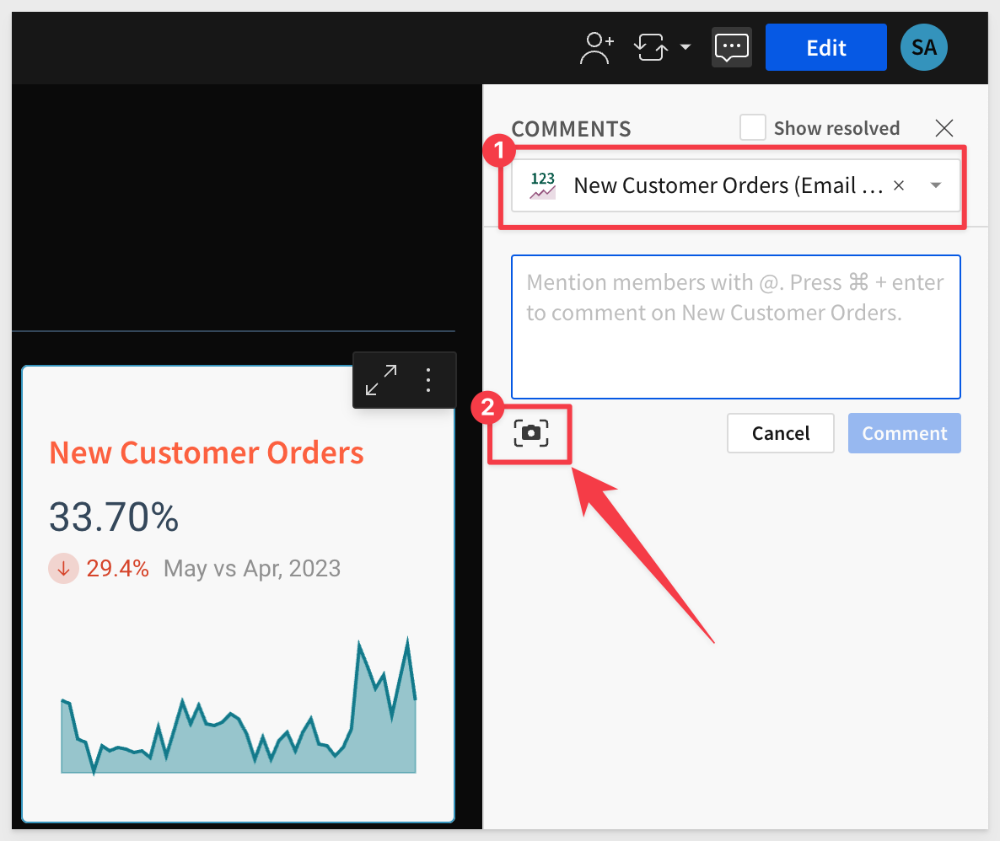

Select a color, annotate it, and add your comment:

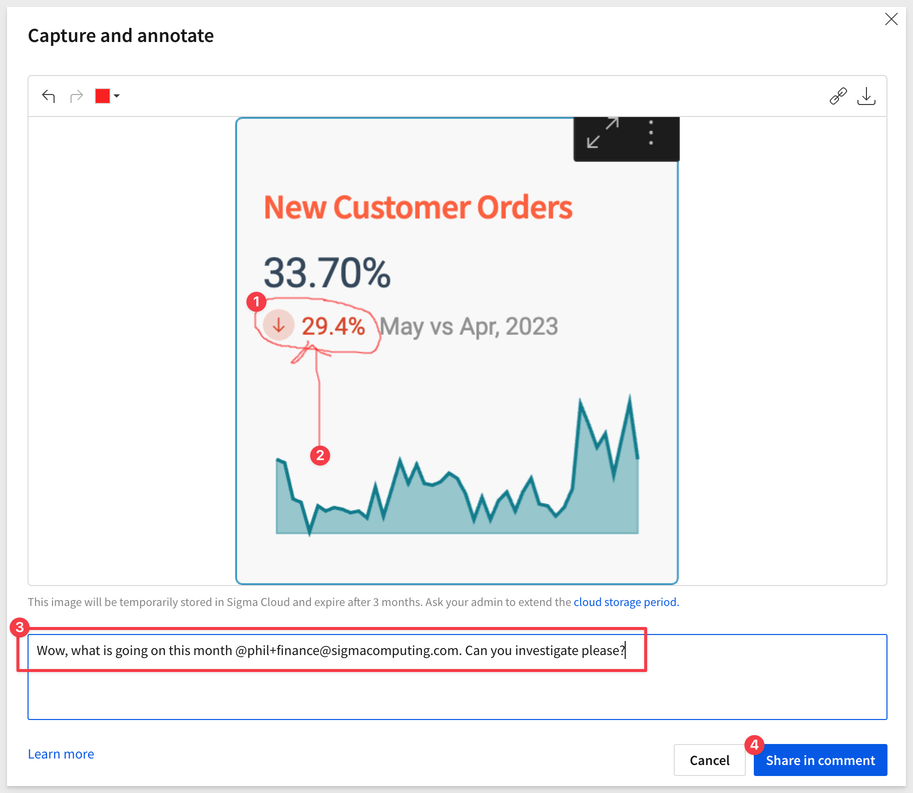

This is a **great** way to communicate and collaborate inside Sigma. 

Use the `@` character to direct your comment to any valid Sigma user:

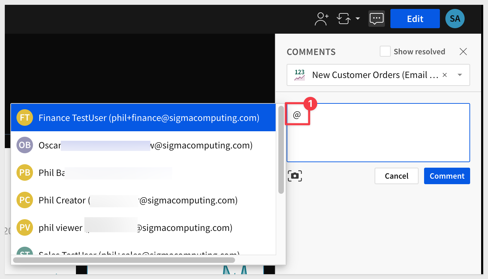

[Documentation Link:](https://help.sigmacomputing.com/hc/en-us/articles/18441838570259-Annotate-element-images-as-comments)

### Default blue in custom themes
Sigma now features a new default blue (#0059EB) across the product. 

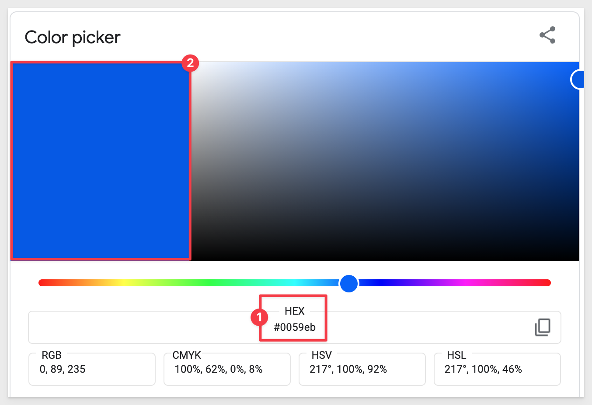

To preserve the appearance of existing workbooks, **the color change has not been applied to custom workbook themes** that utilized the previous default blue as the primary color. 

You must manually update custom workbook themes to change the primary color to the new default blue. 

<!-- END OF SECTION-->

## Bug Fixes
Duration: 20

Bug releases are broken down by week for specificity.

### Week ending 8.04.2023
 <ul>
      <li>Embeds no longer display bookmarks or document versions in the scheduled exports modal.</li>
 </ul>

### Week ending 8.11.2023
 <ul>
      <li>The footer is now hidden for embedded workbooks, including tagged versions, if you set the "show_footer" parameter to "false".</li>
 </ul>

### Week ending 8.18.2023
<ul>
      <li>Circular markers in scatter plot size legends are no longer distorted.</li>
 </ul>

### Week ending 8.25.2023
<ul>
      <li>none</li>
 </ul>

<!-- END OF SECTION-->

## Additional Information
Duration: 20

**Additional Resource Links**

[Help Center Home](https://help.sigmacomputing.com/hc/en-us) 
[Sigma Community](https://community.sigmacomputing.com/) 
[Sigma Blog](https://www.sigmacomputing.com/blog/) 
 

&emsp;

<!-- END OF WHAT WE COVERED -->
<!-- END OF QUICKSTART -->