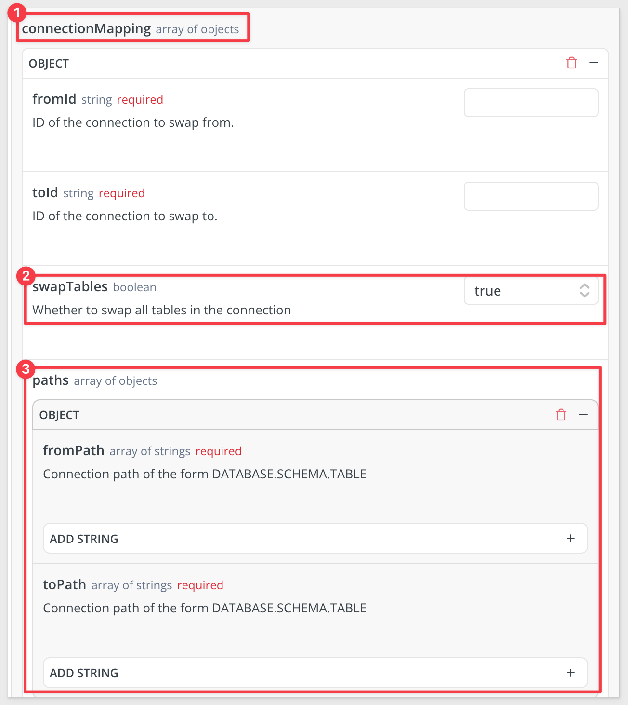
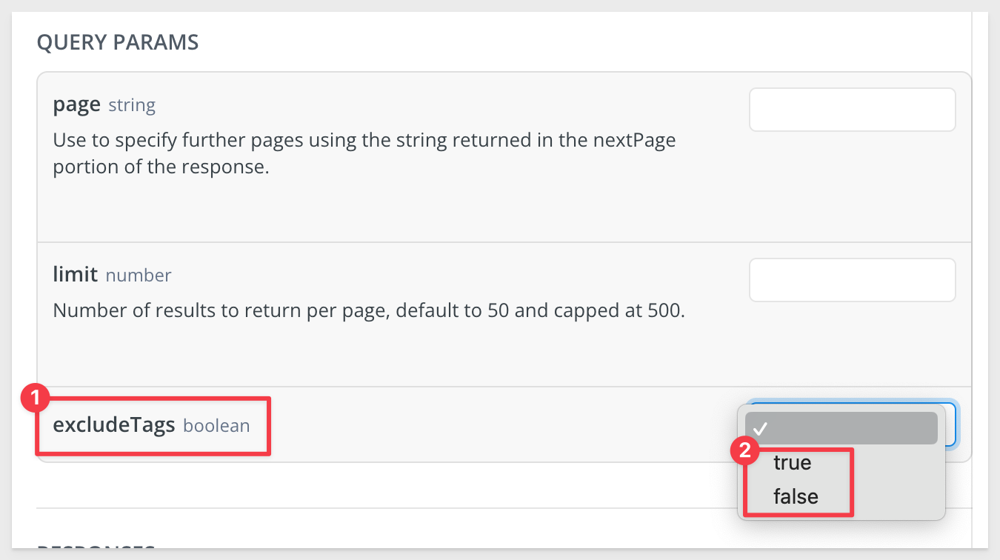
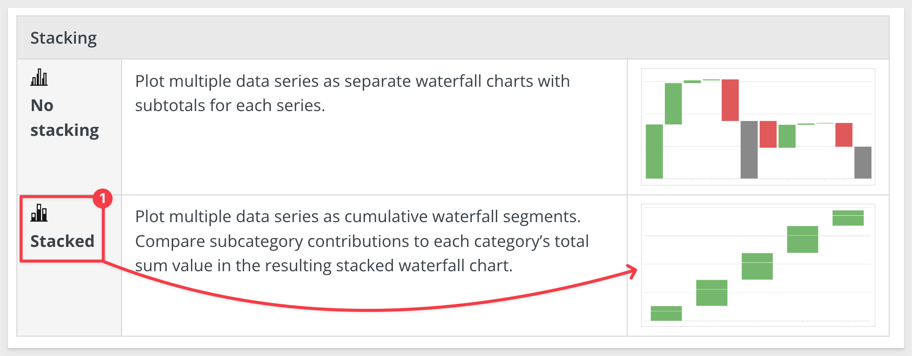
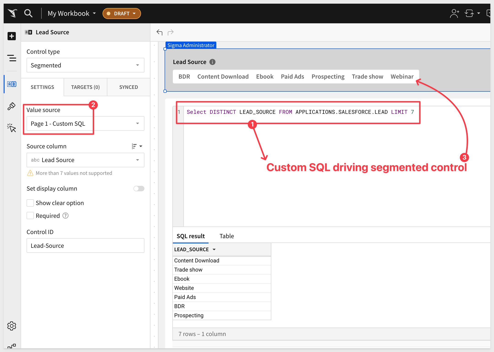

author: pballai
id: 08_2024_first_friday_features
summary: 08_2024_first_friday_features
categories: Administration
environments: web
status: Hidden
feedback link: https://github.com/sigmacomputing/sigmaquickstarts/issues
tags: 
lastUpdated: 2024-09-06

# (08-2024) August
<!-- The above name is what appears on the website and is searchable. 
Aug 9 changes: done
Aug 16 changes: done
Aug 23 changes: done
Aug 30 changes: done

Publish on Sept 6.
-->

## Overview 
Duration: 5 

This QuickStart lists all the new and public beta features released, as well as bugs fixed in August 2024.

It is summary in nature, and you should refer to the specific Sigma documentation links provided for more information.

**Public beta features will carry the section text "Beta".**

All other features are considered released (**GA** or generally available).

Sigma actually has feature and bug fix releases weekly, and high-priority bug fixes on demand. We felt it was best to keep these QuickStarts to a summary of the previous month for your convenience.

New first Friday features QuickStarts will be published on the first Friday of each month, and will include information for the previous month.


## Actions
Duration: 5 

If you haven't discovered [Actions in Sigma](https://help.sigmacomputing.com/docs/intro-to-actions) yet, **you need to check them out.** Actions are evolving really quickly now, and we are adding more functionality all the time.

Actions are user-defined interactivity that you can configure within and across workbook elements. By automating responses to specific user interactions, you can create efficient workbook workflows that produce quick and relevant data insights.

### Use actions to insert rows into input tables (Beta)
Use the [Insert row action](https://help.sigmacomputing.com/changelog#:~:text=Use%20the-,Insert%20row,-action%20to%20insert) to insert a row into an input table based on a user’s interaction with another workbook element. 


## Administration
Duration: 20

### New permission for AI features
Manage access to new AI features in Sigma with the Use AI features permission. Users must have a `Pro license` to be granted this permission.

See [License and account type overview.](https://help.sigmacomputing.com/docs/license-and-account-type-overview)


## AI
Duration: 20

### Import data from an image (Beta)
If you have an OpenAI integration configured, you can now import data from an image of a table or a simple chart. The data is parsed and uploaded to a connection with Write-back support. Then you can start exploring the data in a workbook.

For more information and recommendations, see [Import data from an image.](https://help.sigmacomputing.com/docs/import-data-from-an-image)


## API
Duration: 20

### New option for swap workbook data sources endpoint
The Swap workbook data sources endpoint `POST /v2/workbooks/{workbookId}/swapSources` now includes the `swapTables` and `paths` options.

Set the `swapTables` option to `true` in your request to change all tables in the workbook to use the new connection.

Use the `paths` option to specify connection paths to map from the original connection to the new connection. 

The options for this method are available to test in our public [API Reference:](https://help.sigmacomputing.com/reference/sourceswapworkbook)



### New query parameter for List workbooks endpoint
The `List workbooks` endpoint [GET /v2/workbooks](https://help.sigmacomputing.com/reference/listworkbooks) now includes the `excludeTags` query parameter. 

Set `excludeTags` to `true` to improve query performance in cases where you do not need version tag information in the response.



### New response output for Get embeds for a workbook endpoint:
The entries array includes two additional properties in the response for the [Get embeds for a workbook](https://help.sigmacomputing.com/reference/listworkbookembeds) 

- sourceType: Whether the source of the embed is a workbook, page or element.
- sourceId: The ID of the workbook, page, or element that is the source of the embed.
- sourceName: The name of the workbook, page, or element that is the source of the embed.

An example response for this method will look like this:
```code
{
  "entries": [
    {
      "embedId": "5123ee04-6a27-451d-a7ea-165b434e8a2b",
      "embedUrl": "https://app.sigmacomputing.com/embed/1-2t6NvaaMfGT5cVxec3xklt",
      "public": true,
      "sourceType": "page",
      "sourceId": "H9cAxKfnXP",
      "sourceName": "Dashboard"
    },
    {
      "embedId": "fa3cecb4-a9b5-4d81-9bcf-1bea81678fec",
      "embedUrl": "https://app.sigmacomputing.com/embed/1-7CbVjjUMMTKQpYa2E7NwkI",
      "public": false,
      "sourceType": "workbook",
      "sourceId": null,
      "sourceName": null
    }
  ],
  "hasMore": false,
  "total": 2,
  "nextPage": null
}
```


## Bug Fixes
Duration: 20

*1:* When a specific version of a workspace has been shared with a user or team using both a direct grant and an inherited grant, Sigma no longer lists the same version tag multiple times in the `Share Folder` modal.

*2:* Sorting pivot columns in a pivot table with more than `25,000 cells` of data now works as expected.


## Data Modeling
Duration: 20

### Version tagging support for data models (Beta)
Version tag data models to support version tagged workbooks and manage access to specific versions of a data model. You can also swap sources between different tagged data model versions.

A tagged version of a workbook that uses a data model as the source stays in sync with the latest published version of the data model. If you want the tagged version of a workbook to use a specific version of a data model, tag that data model version and use it as the source for the tagged workbook version.

For more details, see [Create and manage version tags](https://help.sigmacomputing.com/docs/create-and-manage-version-tags) and [Add version tags to workbooks and data models.](https://help.sigmacomputing.com/docs/add-version-tags-to-workbooks-and-data-models)


## Embedding
Duration: 20

### Authenticate secure embeds using JSON Web Tokens (JWTs) (Beta)
Sigma supports authenticating secure embeds using JSON Web Tokens (JWTs). JWTs are compact, URL-safe tokens that can be digitally signed, ensuring that the data they contain is tamper-proof. Using JWT-signed URLs for your embeds offers several advantages, including offering a secure way to embed content that can be accessed by both external users and internal users.

For more information, see [Create an embed API with JSON web tokens.](https://help.sigmacomputing.com/docs/create-an-embed-api-with-json-web-tokens)

There is also a [QuickStart: Embedding 16: Secure Embedding with JWT.](https://quickstarts.sigmacomputing.com/guide/embedding_16_jwt/index.html?index=..%2F..index#0)


## Functions / Calculations
Duration: 20


## Input Tables
Duration: 20

### CSV input tables
Pre-populate a new input table with uploaded CSV data that you can edit at the cell level.

Like empty input tables, CSV input tables support data entry independent of existing data, enabling you to add editable rows and columns to construct the table as you see fit.

For more information, see [Intro to input tables](https://help.sigmacomputing.com/docs/intro-to-input-tables) and [Create new input tables.](https://help.sigmacomputing.com/docs/create-new-input-tables)

For those of you who have not discovered Sigma Input Tables yet, check out some of the [common use cases here](https://quickstarts.sigmacomputing.com/guide/input_tables_use_cases/index.html?index=..%2F..index#0) The possibilities are endless!


## New QuickStarts in August
Duration: 20

### Embedding 16: Secure Embedding with JWT

Many customers want a simple, but secure way to embed content that can be accessed by both external (users who do not have a registered account in Sigma) and internal user (users who access Sigma only through an embed, inside a parent application).

To enable this, Sigma supports authenticating secure embeds using JSON Web Tokens (JWTs). Signing your secure embed URLs with JWTs has several advantages, but a few limitations too.

Read all about it [here.](https://quickstarts.sigmacomputing.com/guide/embedding_16_jwt/index.html?index=..%2F..index#0) 


## Visualizations
Duration: 20

### Stacking support for waterfall charts (Beta)
Waterfall charts now support stacking. With stacked waterfall charts, you can plot multiple data series as cumulative waterfall segments and compare subcategory contributions to each category’s total sum value.

For example:



For more information, see [Build a waterfall chart (Beta).](https://help.sigmacomputing.com/docs/build-a-waterfall-chart)

### Waterfall chart (GA)
Waterfall charts are now generally available (GA). Build a waterfall chart to show changes in data over a period of time. Waterfall charts are perfect for financial analytics use cases where you track revenue and spend for a project, department, or an entire organization, and other use cases. You can format the shape, start, and end values of a waterfall chart as well.

For more information, see [Build a waterfall chart.](https://help.sigmacomputing.com/docs/build-a-waterfall-chart)


## Workbooks
Duration: 20

### New option for export to email - workbook action
By default, the `Export to email` workbook action now runs as the user who performs the action instead of as the recipient of the email. 

You can optionally select to `run as recipient` instead.

See [Create actions that download and export data](https://help.sigmacomputing.com/docs/create-actions-that-download-and-export-data#export-to-email) for more details.

### Paste 2,000 rows in input tables on Snowflake connections
Customers asked for larger row limits when populating data in input tables on a Snowflake connection, so now you can now paste up to `50,000 cells` at once (2,000 rows and 25 columns).

If you want this be even larger, so do we!

For more information, [see Intro to input tables.](https://help.sigmacomputing.com/docs/intro-to-input-tables#input-tables-overview)

### View parameters referenced by a custom SQL element in a data model
Custom SQL elements in a data model that reference a control as a parameter in the SQL syntax are now visible from the Targets section of the Element properties for the control.



### Updated file names for Google Sheet and Google Drive exports
The default file name used for `Google Sheet` and `Google Drive` exports has been updated from:
```code
date time - workbook name
```

to:

```code
workbookName_elementName_timestamp
```

This change makes these export naming conventions consistent with Sigma's other export file name patterns.

For example, for a workbook with the name workbookName, exported on `August 2nd`, the file name changes from `2024-08-02 10:07 - workbookName` to `workbookName_elementName_20240802T1007`.


## Additional Information
Duration: 20

**Additional Resource Links**

[Blog](https://www.sigmacomputing.com/blog/)<br>
[Community](https://community.sigmacomputing.com/)<br>
[Help Center](https://help.sigmacomputing.com/hc/en-us)<br>
[QuickStarts](https://quickstarts.sigmacomputing.com/)<br>
<br>

[](https://twitter.com/sigmacomputing)&emsp;
[](https://www.linkedin.com/company/sigmacomputing)&emsp;
[](https://www.facebook.com/sigmacomputing)


