author: pballai
id: 08_2025_first_friday_features
summary: 08_2025_first_friday_features
categories: Administration
environments: web
status: Published
feedback link: https://github.com/sigmacomputing/sigmaquickstarts/issues
tags: first_friday_features
lastUpdated: 2025-08-31

# (08-2025) August

<!--

-->

## Overview 
Duration: 5 

This QuickStart lists all the new and public beta features released, as well as bugs fixed in August 2025.

It is summary in nature, and you should refer to the specific Sigma documentation links provided for more information.

**Public beta features will carry the section text "Beta".**

All other features are considered released (**GA** or generally available).

Sigma actually has feature and bug fix releases weekly, and high-priority bug fixes on demand. We felt it was best to keep these QuickStarts to a summary of the previous month for your convenience.

New First Friday Features QuickStarts will be published on the first Friday of each month, and will include information for the previous month.

### Subscribe to What's New in Sigma
For those wanting to see what Sigma is doing on each week, release notes are now also available on the [Sigma Community site](https://community.sigmacomputing.com/). There, you can **opt in to receive notifications about future release notes** in order to stay on top of everything new happening at Sigma. You can also subscribe to automated updates in any Slack channel using the Sigma Community release notes RSS feed. 

For more information on how to subscribe to release note notifications, see [About the release notes](https://community.sigmacomputing.com/t/about-the-release-notes-category/5517) 

<aside class="positive">
<strong>IMPORTANT:</strong>  Some screens in Sigma may appear slightly different from those shown in QuickStarts. This is because Sigma continuously adds and enhances functionality. Rest assured, Sigma’s intuitive interface ensures that any differences will not prevent you from successfully completing any QuickStart.
</aside>

For more information on Sigma's product release strategy, see [Sigma product releases](https://help.sigmacomputing.com/docs/sigma-product-releases)

If something is not working as you expect, here's how to [contact Sigma support](https://help.sigmacomputing.com/docs/sigma-support)

<!-- END OF SECTION-->

## Administration
Duration: 20

### Disable audit logging
You can now disable audit logging in Sigma. 

<aside class="positive">
<strong>IMPORTANT:</strong>  This will delete any storage integrations and cancel any scheduled exports. Sigma retains your audit log data for 30 days after disabling
</aside>

For more information, see: [Enable or disable audit logging](https://help.sigmacomputing.com/docs/enable-audit-logging)

### Input table audit logging (Beta) 
Audit logs now record events and metadata related to input table activity. 

Admins can parse input table audit log data to understand the type of edit performed (e.g., create input table, add row, update row, delete row, etc.), who was responsible, and when the activity occurred. 

The metadata identifies the edited input table as well as the number of affected rows and columns, but it does not record the content of the edits.

For more information about input table audit log events and metadata, see the INPUT_TABLES event category in [Audit events reference](https://help.sigmacomputing.com/docs/audit-log-events-and-metadata#audit-events-reference):

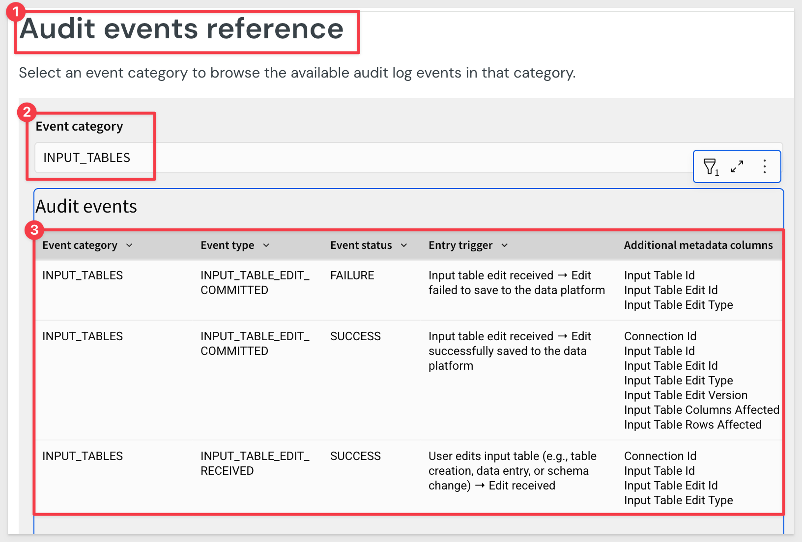

### Set up Key Pair authentication for OAuth service accounts (GA) 
You can now set up Key Pair authentication for Snowflake OAuth service accounts. 

For more information, see [Connect to Snowflake with OAuth](https://help.sigmacomputing.com/docs/connect-to-snowflake#connect-to-snowflake-with-oauth)

### Restrict access to copying data 
If you want to restrict the ability of Sigma users to copy more than one cell of data at a time, a user assigned the Admin account type can turn off the Bulk copy from tables toggle for your organization.

By default, the toggle is turned on, maintaining the existing behavior of allowing users to copy multiple cells from tables, pivot tables, input tables, and the underlying data of a chart.

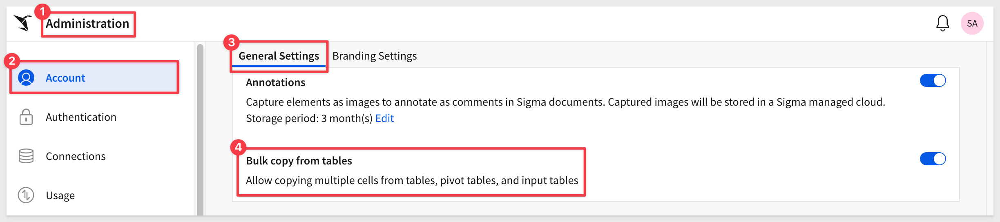

### Infrastructure (for new trial account)
When creating a new Sigma organization as a free trial, you can now select your preferred cloud provider and region during the sign up process.

For more information, see [Supported regions, data platforms, and features](https://help.sigmacomputing.com/docs/region-warehouse-and-feature-support)

<!-- END OF SECTION-->

## AI
Duration: 20

### Ask Sigma Discovery 
Now, when you access the Ask Sigma page, Ask Sigma automatically compiles expandable data collections based on the highlighted data sources for your organization. 

For example:

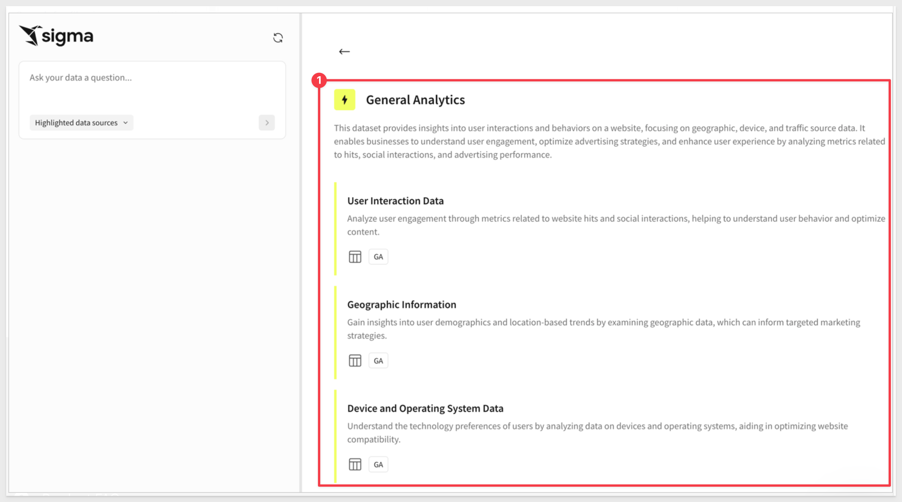

For more information, see [Ask Sigma Discovery](https://help.sigmacomputing.com/docs/ask-sigma-discovery)

### Ask Sigma for data source tables
When you view a data source table on the `Connections` page, you can now ask a question of the data source from the Ask Sigma option on the `Overview` tab. 

You can ask a question of any data source table visible to you, not just sources highlighted for Ask Sigma. 

When you enter a question, Sigma opens Ask Sigma in a new browser tab, populated with the question that you asked.

### Gemini and Vertex AI integration (Beta)
You can now configure an external AI integration with `Google Gemini`, or a warehouse AI integration with `BigQuery` through `Google’s Vertex AI API`.

For more information, see [Configure warehouse AI model integration](https://help.sigmacomputing.com/docs/configure-warehouse-ai-model-integration) and [Manage external AI integrations](https://help.sigmacomputing.com/docs/manage-external-ai-integrations)

<!-- END OF SECTION-->

## API
Duration: 20

### Custom SQL support for swap workbook data sources endpoint (Beta)
The [Swap workbook data sources endpoint](https://help.sigmacomputing.com/reference/sourceswapworkbook) now supports workbooks that use custom SQL statements, in addition to standard table-based sources.

This enables users to update and maintain workbooks without needing to manually rewrite custom SQL queries.

### New API endpoint: list sources of a data model
The following endpoint to list sources of a data model is now available:

[List data model sources](https://help.sigmacomputing.com/reference/listdatamodelsources) will return a list of data sources of a data model given the `dataModelId`. The response can be a dataset, table, or the data model document and specific elements used as a source. 

### New options for the sync connection by path endpoint
The [Sync a connection by path](https://help.sigmacomputing.com/reference/syncconnectionpath) endpoint includes a new `useServiceAccount` query string parameter. 

When used with a connection that uses OAuth, the new option lets you use the service account credentials, instead of the user credentials associated with the API token, to sync the connection. When used with a connection that doesn't use OAuth, the new option has no effect.

### New output included in the List team members endpoint
The **List team members** [GET /v2/teams/{teamId}/members](https://help.sigmacomputing.com/reference/getteammembers) endpoint includes a new `addedBy` option in the response that provides the user ID of the person that added a user to a team.

### New options to swap data model sources for the Tag a workbook endpoint
The **Tag a workbook** [POST /v2/workbooks/tag](https://help.sigmacomputing.com/reference/tagworkbook) endpoint includes a new option to swap from or to a data model, including a tagged version of a data model. Similar to the UI, you can only swap a data model source to another version of the same data model.

<!-- END OF SECTION-->

## Bug Fixes
Duration: 20

**1:** The `tag` parameter in the [Export data from a workbook](https://help.sigmacomputing.com/reference/exportworkbook) endpoint now works as expected.

**2:** The [Add workbook schedule](https://help.sigmacomputing.com/reference/postworkbookschedule) endpoint no longer fails when attempting to create a schedule that exports to Slack. To fix this issue, the nonfunctional `slackChannelName` option was changed to `slackConversationId`.

**3:** Dynamically changing the source of a table in a data element using custom SQL no longer stops related columns from being available in child elements of the source table.

**4:** Column descriptions added in a data model are now available in workbooks.

**5:** When adding a data element that uses SQL as the source, the connection now correctly defaults to one that the user has access to use for SQL queries.

**6:** Mobile view now includes a profile menu that provides users with the option to sign out of their Sigma account on a mobile device.

**7:** Time chart axes now align with chart data across all timespans and timezones as expected, with more intuitive tick markings across all organization timezones.

**8:** When writing SQL to query a BigQuery connection, project ID, dataset, and table names, and column names now autocomplete.

**9:** The [Download an exported file](https://help.sigmacomputing.com/reference/downloadquery) now no longer fails when downloading a workbook.

**10:** Previously, selecting a text element would arbitrarily resize the element by adding rows. Now, this is less likely to happen.

**11:** The files endpoint no longer only returns workbooks owned by the specified user that are located in the My Documents folder. All workbooks owned by the user, including those located across different workspaces, are now returned.

**12:** The `Data sources` tab of the `Select source` modal now shows options as expected even in smaller viewports.

**13:** Referencing a data element in SQL using sigma_element() syntax now correctly handles element titles that contain quotes.

**14:** The [Add workbook schedule](https://help.sigmacomputing.com/reference/postworkbookschedule) endpoint no longer displays invalid request errors when scheduling an export.

<!-- END OF SECTION-->

## Charts
Duration: 20

### Create and format sparklines (Beta)
Sigma now supports creating and formatting `sparklines` in tables and pivot tables. 

You can add `sparklines` from a grouped column in a table (Add column via… > Sparkline), or using the SparklineAgg and Sparkline (JSON data only) functions.

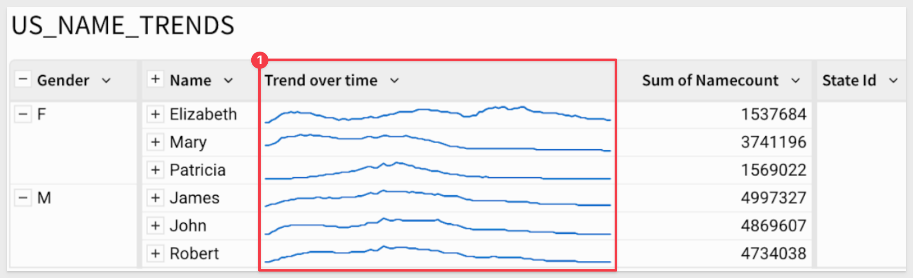

For more information, see [Create sparklines in a table (Beta)](https://help.sigmacomputing.com/docs/create-sparklines-in-a-table)

<!-- END OF SECTION-->

## Data Apps
Duration: 20

### App notification actions (Beta) 
Sigma is rolling out app notification actions to public beta for all customers. You can use app notification actions to notify users and channels via email and Slack, independent of an export or download. 

The feature enables interesting workflows, alerting users to information in real-time (or email) so that they may respond appropriately.

For more information, see [Create actions that send notifications and export data](https://help.sigmacomputing.com/docs/create-actions-that-send-notifications-and-export-data)

The Notify and export action replaces the existing Download and export action. Existing Download and export actions will be migrated without changes to functionality.

### Call stored procedures with actions (GA) 
Call stored procedures defined in a Snowflake, BigQuery, or Amazon Redshift connection using an action is now GA. 

If the stored procedure returns non-tabular results like a string, number, or Boolean value, you can work with the output as an action variable and display the values in dynamic text or a control element.

For example, if you have an existing stored procedure to calculate project timelines based on several variables, you can set up a data app with input control elements to collect the variables, pass them as arguments to a stored procedure action that calls the stored procedure, then display the results in a control element and store them in an input table in Sigma.

For more information, see [Create actions that call stored procedures](https://help.sigmacomputing.com/docs/create-actions-that-call-stored-procedures)

There are also QuickStarts: 
[Integrate 3rd Party REST API via Stored Procedure](https://quickstarts.sigmacomputing.com/guide/dataapps_calling_external_api_procedure/index.html?index=..%2F..index#0)

[Snapshotting with Stored Procedures](https://quickstarts.sigmacomputing.com/guide/dataapps_snapshotting_with_sp/index.html?index=..%2F..index#0)

### Custom context menu actions (GA) 
You can now add custom context menu items in tables, pivot tables, input tables, and charts to provide clear, discoverable triggers for actions relevant to selected cells and data points.

You can add standalone menu items or create nested submenus that execute any action effect, including calling stored procedures, generating iframe events, and opening modals.

This feature enables a whole new level of customization that is both simple to implement, powerful and will accerlate end user adoption:

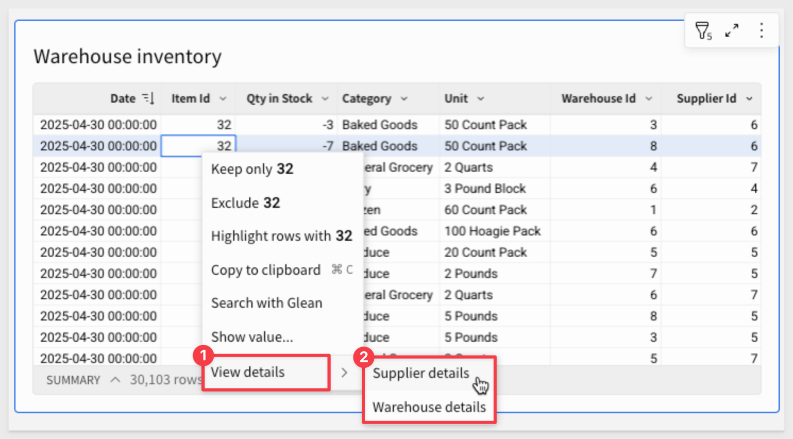

For more information, see [Create custom context menu actions](https://help.sigmacomputing.com/docs/create-custom-context-menu-actions)

### Dependent action notification for element deletion
When you delete an element that’s the target of an action, you’re notified of the dependency when confirming the element deletion. 

In the confirmation modal, you can select the `Delete impacted actions` checkbox to delete the dependent action along with the element. 

Alternatively, if you don’t select the checkbox, the broken action is retained, and you can reconfigure it as needed.

### Success alerts for action sequences
Add a custom success alert that displays after an action sequence runs successfully. The alert appears temporarily at the bottom of the window and can include a static or dynamic message.

For example:

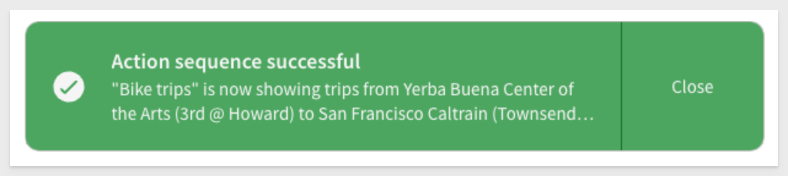

For more information, see [Add or edit a success alert](https://help.sigmacomputing.com/docs/create-and-manage-action-sequences#add-or-edit-a-success-alert)

<!-- END OF SECTION-->

## Data Modeling
Duration: 20

### Column-level security in data models with user attributes (Beta) 
Set column-level security (CLS) rules in a data model according to the assigned value of a user attribute. 

Users and team members assigned a user attribute value that matches the value specified in the CLS rule can view the contents of the protected column. 

Users assigned other user attribute values, or not assigned a user attribute value, cannot view the contents of the protected column.

For more information, see [Configure column-level security in a data model](https://help.sigmacomputing.com/docs/column-level-security#configure-column-level-security-in-a-data-model)

### New tutorial content: Intro to data models
A new tutorial covering the basics of creating a data model and preparing it for use as a data source in downstream analyses is now available. See [Tutorial: Intro to data modeling](https://help.sigmacomputing.com/docs/data-modeling-tutorial) to follow along and learn to create a data model with step-by-step instructions.

There is also a QuickStart: [Fundamentals 10: Data Modeling](https://quickstarts.sigmacomputing.com/guide/fundamentals_10_data_modeling/index.html?index=..%2F..index#0)

### More options for managing source visibility
You can enable or disable a table as a data source in a data model from the data model overview using `Show as source ()`, or the toggle on the modeling tab of the editor panel. 

For more information, see [Enable or disable an element as a data source](https://help.sigmacomputing.com/docs/create-and-manage-data-models#enable-or-disable-an-element-as-a-data-source)

<!-- END OF SECTION-->

## Embedding
Duration: 20

### Secure embed URLs signed with client credentials (Deprecated)
Secure embeds with URLs that are secured with client credentials, formerly known as `user-backed` embeds, are **deprecated as of August 4, 2025** and will reach end of support early next year. 

Instead, migrate to secure embed URLs signed with JSON Web Token (JWT).

For guidance, see [Migrate to JWT-signed secure embed URLs](https://help.sigmacomputing.com/docs/migrate-to-jwt-signed-secure-embed-urls)

All the [embed QuickStarts](https://quickstarts.sigmacomputing.com/?cat=embedding) have been revised in support of JWT. 

For questions and additional details, **contact your Customer Success Manager.**

<!-- END OF SECTION-->

## Functions / Calculations
Duration: 20

### IsEven and IsOdd functions
You can now use the `IsEven` and `IsOdd` functions to check whether the integer part of a number is even or odd. 

For more information, see [IsEven](https://help.sigmacomputing.com/docs/iseven) and [IsOdd](https://help.sigmacomputing.com/docs/isodd)

### SplitToArray function
The `SplitToArray` function splits a specified string by a given delimiter and returns an array of substrings. 

For more information, see [SplitToArray](https://help.sigmacomputing.com/docs/splittoarray)

### New video tutorial series: Getting started with functions and groupings in Sigma
A new series of video tutorial content is now available covering the basics of grouping data in Sigma and performing calculations with grouped data using aggregate and window functions. 

See [Create and manage tables](https://help.sigmacomputing.com/docs/create-and-manage-tables#video-introduction-to-functions-and-groupings) to view the first video in the series or go to the [Sigma training videos page](https://www.sigmacomputing.com/resources/training-videos/table-grouping-and-functions?_gl=1*sxz9ax*_gcl_au*MTI4MzM4NjQwLjE3NTAwMzc3NzI.*_ga*MTAzMjQzMDMwNC4xNzQyMjI4NzA5*_ga_PMMQG4DCHC*czE3NTUwOTUyMzMkbzQwNCRnMSR0MTc1NTEwMTQzOCRqNjAkbDAkaDA.) to watch the entire five-part series.

<!-- END OF SECTION-->

## New QuickStarts in August
Duration: 20

### REST API use case QuickStarts Series: 
This new series demonstrate common API methods in the host application, using sample code provided in the QuickStarts public git repo. Perfect for developers embedding Sigma into SaaS apps or internal tools who want to deliver a more dynamic, personalized experience between their app and the Sigma embed.

The first one, "Getting Started" is mandatory for the others in this series, so start there to set up your local environment.

[REST API Usage 04: – Scheduling Exports](https://quickstarts.sigmacomputing.com/guide/embedding_rest_api_usage_04_export_modal/index.html?index=..%2F..index#0) 
This new QuickStart demonstrates how to extend an embedded Sigma experience by enabling scheduled exports—directly from a host application.

Using our API, you’ll learn how to:
- Create and manage exports operations from a host application.
- Schedule recurring exports with configurable format, timing, and recipients.
- Manage existing schedules, including edit, delete, and run now options

This approach is especially useful for SaaS and internal applications where users need to share Sigma content via email—without accessing the full Sigma UI.

Example of what you will build:

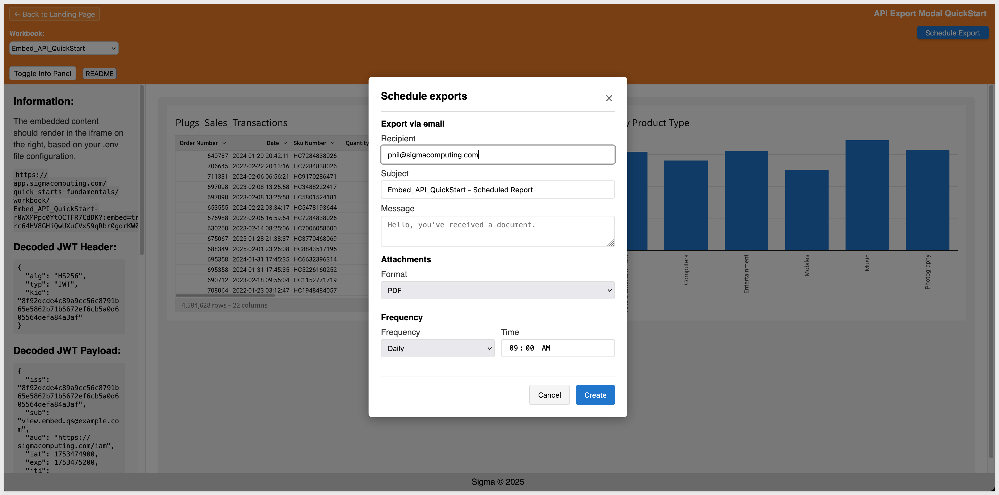

[REST API Usage 05: – Workbook Descriptions](https://quickstarts.sigmacomputing.com/guide/embedding_rest_api_usage_05_wb_descriptions/index.html?index=..%2F..index#0) 
This QuickStart demonstrates how to enhance embedded Sigma workbooks by enabling custom metadata entry through the host application. In this example, we use workbook descriptions—but the same pattern can support usage notes, business context, lineage details, and more.

Using our API, you’ll learn how to:
- Let users add, update, or remove descriptive context for embedded workbooks
- Store metadata in a lightweight local DB (lowdb) for flexibility
- Display that metadata directly, without modifying the Sigma UI

Example of what you will build:
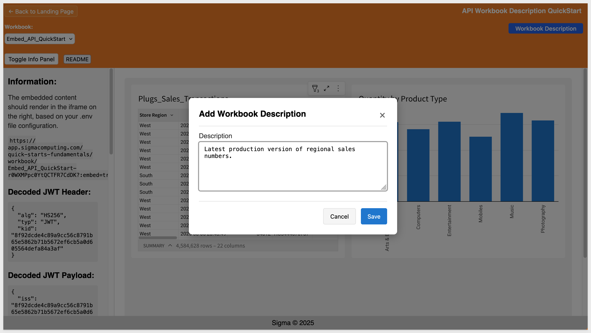

[REST API Usage 06: – Copy or Create a New Workbook](https://quickstarts.sigmacomputing.com/guide/embedding_rest_api_useage_06_copy_or_new_wb/index.html?index=..%2F..index#0) 
This new QuickStart demonstrates how to extend an embedded application—supporting workflows for creating and copying workbooks from the host application using Sigma’s REST API.

Using our API, you’ll learn how to:
- Create new workbooks in the user’s My Documents folder
- Copy existing workbooks with optional renaming and team sharing
- Auto-handle naming conflicts and refresh the embed on success

Example of what you will build:
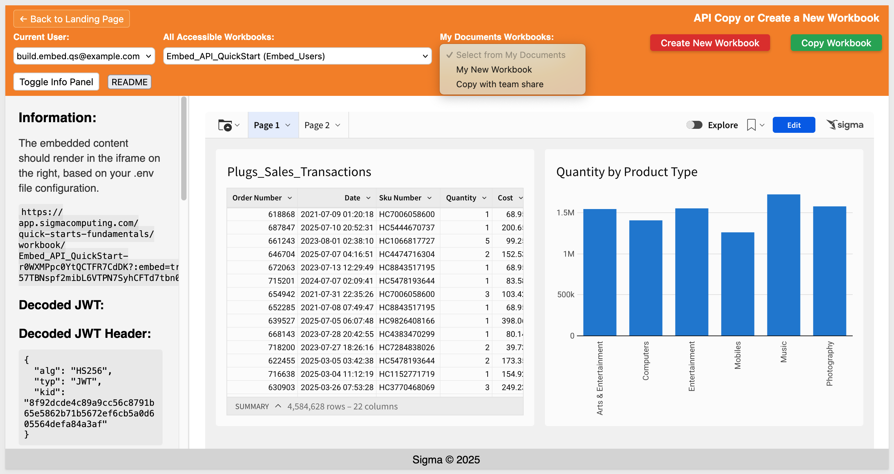

[REST API Usage 07: - Custom Loading Indicators](https://quickstarts.sigmacomputing.com/guide/embedding_rest_api_useage_07_custom_loader/index.html?index=..%2F..index#0) 
This QuickStart shows how to improve your embedded Sigma experience by adding a custom loading indicator while a workbook is initializing.

You’ll learn how to:
- Display a CSS-based overlay during embed loading
- Listen for the workbook:dataLoaded event to hide the loader at the right time
- Handle timeouts gracefully if the embed doesn’t load

This pattern is simple but important—it gives you complete control over the user experience and helps eliminate “blank screen” confusion in embedded deployments.

Example of what you will build:
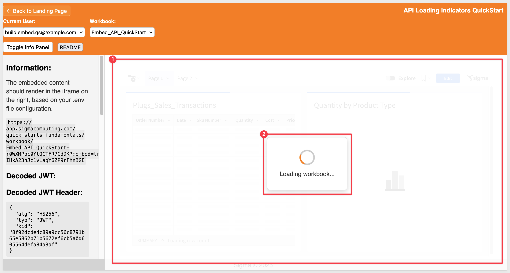

[REST API Usage 08: Filters ](https://quickstarts.sigmacomputing.com/guide/embedding_rest_api_useage_08_filters/index.html?index=..%2F..index#0) 

This QuickStart shows how to keep filters in sync between the host application and an embedded Sigma workbook—so filter changes in the host instantly update the embedded content.

You’ll learn how to:
- Add matching List and Date Range controls in Sigma to respond to host‑side filter updates
- Use a jQuery date range picker for flexible date selection
- Hide workbook‑side controls while still driving them from the host application

The result: A seamless, user‑friendly filter experience with centralized logic in the host app.

Example of what you will build:
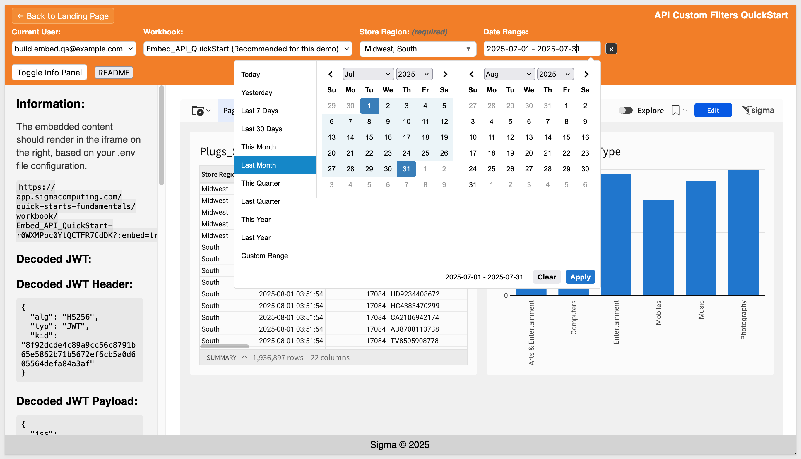

[REST API Usage 10: Hide Menus & Page Navigation](https://quickstarts.sigmacomputing.com/guide/embedding_rest_api_useage_09_hide_menus/index.html?index=..%2F..index#0) 

This QuickStart demonstrates how to hide Sigma’s built-in menus and control workbook page navigation directly from your host application.

Key takeaways:
- Use JWT and .env parameters to hide Sigma’s folder nav, page controls, and menus
- Fetch Workbook pages dynamically using the Sigma Embedding API
- Allow embed page control from the host application

Whether you're embedding a single workbook or managing multi-page, role-aware navigation, this pattern helps keep the experience native to the host application.

Example of what you will build:

[REST API Usage 10: Hide Menus & Page Navigation](https://quickstarts.sigmacomputing.com/guide/embedding_rest_api_useage_09_hide_menus/index.html?index=..%2F..index#0) 

This QuickStart demonstrates filter synchronization between a host application and Sigma embeds. It uses `Store Region` and `Date Range` filters in the host application that stay in sync with matching controls in the embedded Sigma workbook—creating a seamless experience where filter changes instantly update the embedded content

You’ll learn how to:
Let users select a preferred workbook that auto-loads when their account is chosen
Change or clear the default at any time
Store preferences in local storage for a tailored embed experience

Example of what you will build:
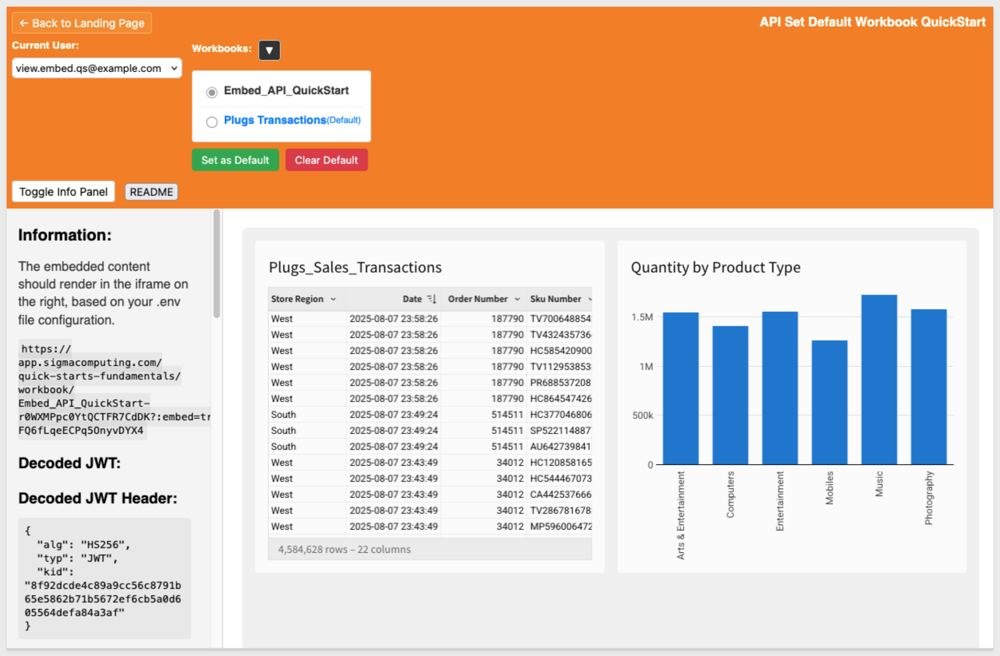

[REST API Usage 11 – Custom Workbook List](https://quickstarts.sigmacomputing.com/guide/embedding_rest_api_useage_11_custom_workbook_list/index.html?index=..%2F..index#0)
This QuickStart shows how to create a visual, interactive workbook selection experience for embedded Sigma apps using a simple carousel interface.

We discuss how to:
- Use the List Member Files API to fetch accessible workbooks for a user
- Display them as clickable thumbnails for easy browsing
- Apply best practices for secure organization, such as dedicated workspaces for embed users
- Extend the pattern to filter results by path or team membership for tighter access control

Example of what you will build:
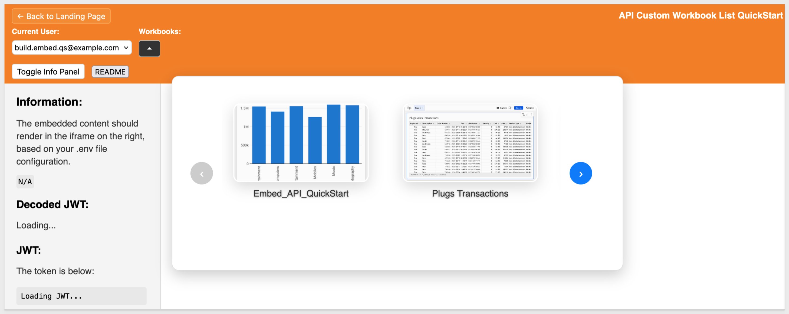

<!-- END OF SECTION-->

## Workbooks
Duration: 20

### Additional options and new default handling for null values in filters and controls
When filtering data with null values using a data element filter or a control element, you now have three options to handle null values:
**1:** Always, to always include null values, regardless of whether a filter value is set. Equivalent to the previous functionality where `Include nulls` is selected.

**2:** Never, to never include null values, regardless of whether a filter value is set. Equivalent to the previous functionality where `Include nulls` is deselected.

**3:** When no value is selected, to include null values only if the filter or control has no selected value.

The `When no value `is selected option is the new default for filters and controls created after Thursday, August 7th. **Existing filters or controls are unaffected by this change.**

### Change the layout grid density of a container (GA)
You can change the layout grid density of a container or tabbed container. 

In the `Properties panel` for a container or tabbed container, set the `Layout grid density` setting as either Low, Medium, or High. 

Containers made from a group of selected elements have a Medium density by default if the selected elements cover 12 or fewer columns on the workbook page. 

If the selected elements cover more than 12 columns, the container defaults to High density.

For more information, see [Change the layout grid density of a container](https://help.sigmacomputing.com/docs/use-containers-to-organize-workbook-layouts#change-the-layout-grid-density-of-a-container)

### Conditional exports no longer list the condition in the email message
Any export scheduled to send an email when a condition is met **no longer lists the condition** in the email message.

If you still want to include the condition in the export, update the message included in the scheduled export to include the condition. 

For more information, see [Schedule a conditional export or alert](https://help.sigmacomputing.com/docs/schedule-a-conditional-export-or-alert)

### Email template - updated design
The default email templates used for scheduled exports, invitations to join an organization, and more now have an updated design. Custom email branding still applies to the default email templates.

In response to customer feedback, the updated email template for scheduled exports now correctly references the schedule creator instead of the workbook owner.

### Export elements from saved views and version tags from the export modal
When sending ad hoc or scheduled exports, you can now select elements that are unique to saved views or version tags from the export modal, `Share and export` > `Export…/Schedule exports`. 

When exporting elements that are only on a saved view, and not in the published workbook, you must open the export modal from the saved view.

For more information, see [Send or schedule workbook exports](https://help.sigmacomputing.com/docs/send-or-schedule-workbook-exports)

### Popovers (GA) 
You can now use popovers to display information in containers anchored to specific button elements. 

Popovers allow you to present relevant content (tables, charts, controls, etc.) only when needed, creating a more efficient and simplified workbook interface.

For example, use them to create a compact way to display multiple filters:

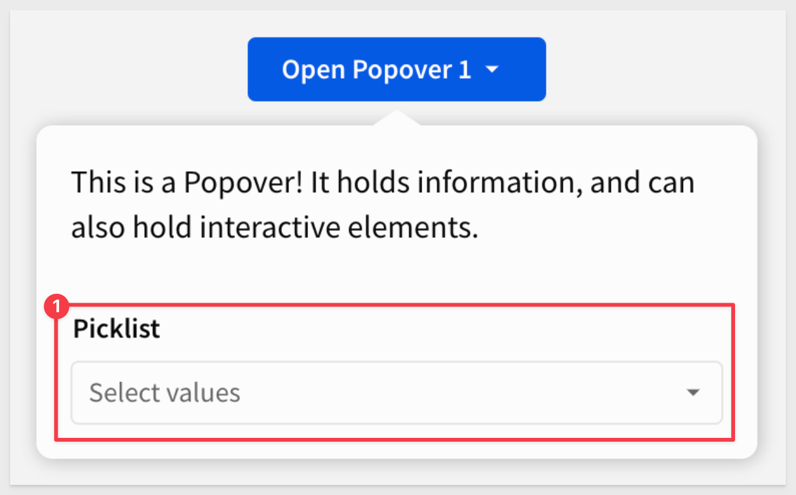

For more information, see [Use popovers to simplify a workbook interface](https://help.sigmacomputing.com/docs/use-popovers-to-simplify-a-workbook-interface)

### Stretch to fit sizing option for image elements
You can now select a `Stretch to fit` sizing option for image elements. When selected, images stretch to match the dimensions of the image element on the workbook page.

For more information, see [Image elements](https://help.sigmacomputing.com/docs/image-elements)

### Updated scheduled export limitation
Previously, scheduled exports would be automatically suspended if there were 5 consecutive failures within 5 calendar days, or if there were 10 consecutive export failures. 

Now, they will only be suspended if there are 10 consecutive export failures.

### Updated UI for unavailable export options
When configuring additional options for exports, options in the export modal that are not applicable based on your export configurations will now be greyed out.

For more information, see [Configure additional options for exports](https://help.sigmacomputing.com/docs/configure-additional-options-for-exports)

### Updated workbook URL format
In workbook URLs, the `:explore` and `:bookmark` parameters have been renamed to `:customView` and `:savedView` respectively. 

This update aligns the UI redesign that introduced custom views and saved views in place of explore capabilities and bookmarks.

URLs for existing workbooks have been automatically reformatted, and navigating to a previous URL that uses `:explore` or `:bookmark` parameters will redirect to a current URL that uses `:customView `and `:savedView`. **This change does not apply to embed events or public APIs.**

<!-- END OF SECTION-->

## Additional Information
Duration: 20

**Additional Resource Links**

[Blog](https://www.sigmacomputing.com/blog/) 
[Community](https://community.sigmacomputing.com/) 
[Help Center](https://help.sigmacomputing.com/hc/en-us) 
[QuickStarts](https://quickstarts.sigmacomputing.com/) 
 

&emsp;
&emsp;

<!-- END OF SECTION-->
