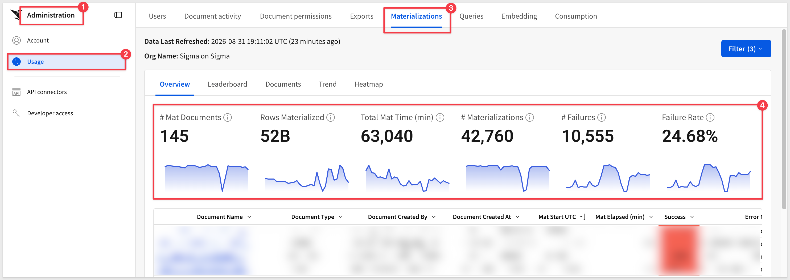
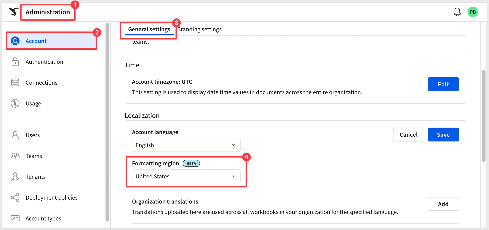
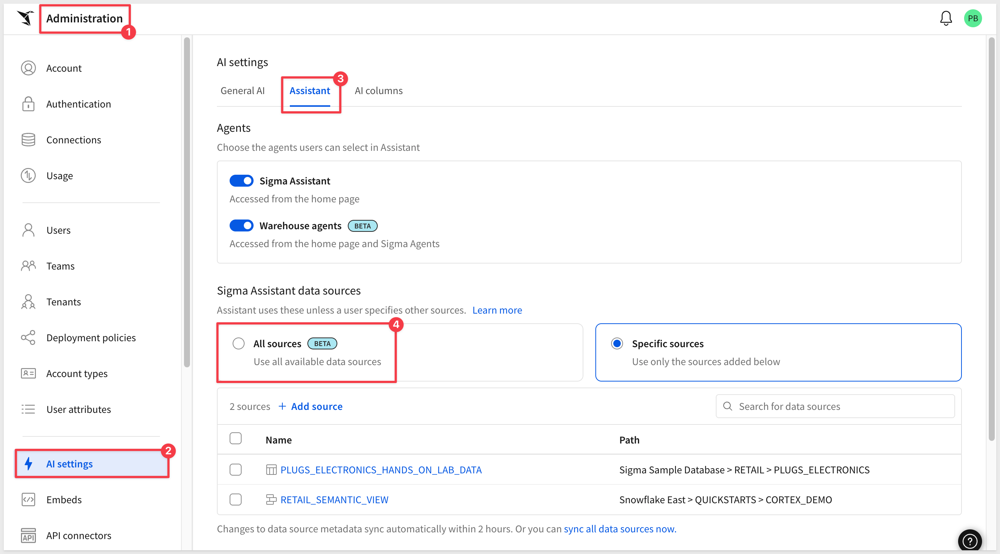
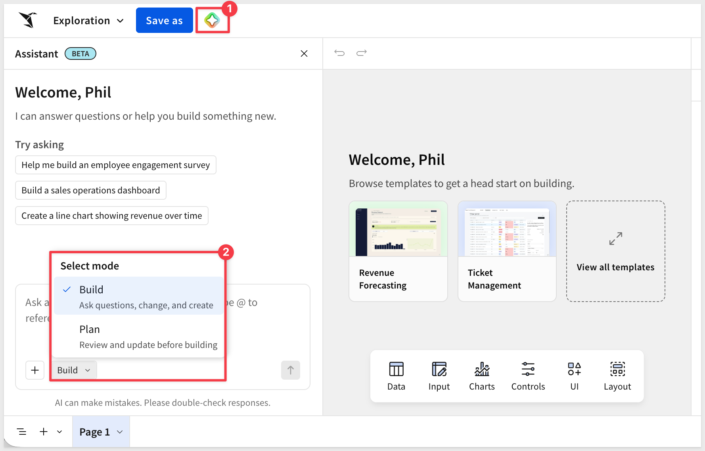
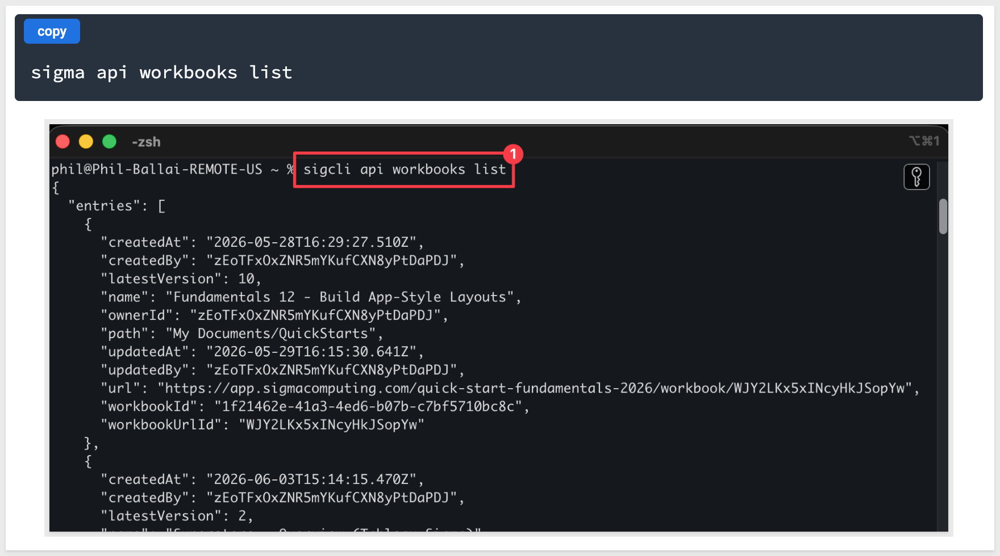
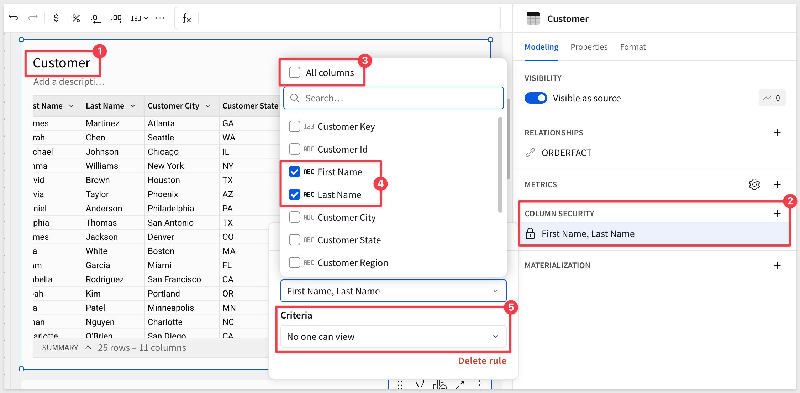

author: pballai
id: 08_2026_first_friday_features
summary: 08_2026_first_friday_features
categories: firstfridayfeatures
environments: web
status: Published
feedback link: https://github.com/sigmacomputing/sigmaquickstarts/issues
tags: first_friday_features
lastUpdated: 2026-09-04

# (08-2026) August
<!-- The above name is what appears on the website and is searchable.

August 7, 2026 changes: done
August 14, 2026 changes: done
August 21, 2026 changes: done
August 28, 2026 changes: done

Publish on September 4

-->

## Overview 
Duration: 5 

This QuickStart lists all the new and public beta features released, as well as bugs fixed in August 2026.

It is summary in nature, and you should refer to the specific Sigma documentation links provided for more information.

**Public beta features will carry the section text "Beta".**

All other features are considered released (**GA** or generally available).

Sigma actually has feature and bug fix releases weekly, and high-priority bug fixes on demand. We felt it was best to keep these QuickStarts to a summary of the previous month for your convenience.

New first Friday features QuickStarts will be published on the first Friday of each month, and will include information for the previous month.

### Subscribe to What's New in Sigma
For those wanting to see what Sigma is doing on each week, release notes are now also available on the [Sigma Community site](https://community.sigmacomputing.com/). There, you can **opt in to receive notifications about future release notes** in order to stay on top of everything new happening at Sigma. You can also subscribe to automated updates in any Slack channel using the Sigma Community release notes RSS feed. 

For more information on how to subscribe to release note notifications, see [About the release notes](https://community.sigmacomputing.com/t/about-the-release-notes-category/5517) 

<aside class="positive">
<strong>IMPORTANT:</strong>  Some screens in Sigma may appear slightly different from those shown in QuickStarts. This is because Sigma continuously adds and enhances functionality. Rest assured, Sigma’s intuitive interface ensures that any differences will not prevent you from successfully completing any QuickStart.
</aside>

For more information on Sigma's product release strategy, see [Sigma product releases](https://help.sigmacomputing.com/docs/sigma-product-releases)

If something is not working as you expect, here's how to [contact Sigma support](https://help.sigmacomputing.com/docs/sigma-support)

<!-- END OF SECTION-->

## Administration
Duration: 20

### Allow embed users to interact with each other (Beta)
Administrators can enable interactions among embed users in organizations, including commenting with @-mentions, sharing documents, creating shared views, and viewing team information.

For more information, see [Manage embed user settings (Beta)](https://help.sigmacomputing.com/docs/manage-embed-user-settings)

### Materialization usage dashboard updates (GA)
The Materializations tab now displays utilization ratio metrics, tracking average queries served per refresh, with the data surfaced in a new Leaderboard chart and two new Documents table columns.

### Set formatting region in Administration portal (Beta)
Organizations can now specify an account formatting region that affects how numbers, dates, and currency display for all users.

For more information, see [Set organization language](https://help.sigmacomputing.com/docs/manage-organization-language)

<!-- END OF SECTION-->

## AI
Duration: 20

### Agent skill for the Sigma CLI (GA)
The `sigma-cli` skill enables AI assistants to call the Sigma REST API from the command line using the Sigma CLI.

There is a QuickStart: [Automate Sigma from the Command Line with the Sigma CLI](https://quickstarts.sigmacomputing.com/guide/developers_sigma_cli/index.html?index=..%2F..index#0)

For more information, see [Install skills for AI assistants](https://help.sigmacomputing.com/docs/install-skills-for-ai-assistants#sigma-cli)

### Allow Assistant to search all sources (Beta) 
Administrators can configure whether Sigma Assistant can access all available data sources or only specific configured ones. Users retain the ability to manually select sources they have access to, and performance is optimized when using data models.

**WHY IT MATTERS:** 
Locking Assistant to a curated list of sources is safer to start with, but it also means someone has to keep that list current as new data models ship. Opening it up to everything a user already has access to removes that maintenance burden without loosening any actual permissions — Assistant still only sees what the user is allowed to see.

For more information, see [Configure AI features for your organization](https://help.sigmacomputing.com/docs/configure-ai-features-for-your-organization)

### Assistant in build mode: complex dashboards (Beta) 
Sigma Assistant can now generate multi-page dashboards sourced from related warehouse tables or existing data models, with plan mode for previewing the layout before building.

**WHY IT MATTERS:** 
Multi-page dashboards have traditionally meant building each page by hand. Extending build mode to generate a full multi-page structure — with a preview step before anything is actually built — lets builders describe a complete reporting experience in plain language and get a governed starting point on real data, not just a single chart.

### New model used for Gemini and BigQuery AI providers (GA)
Sigma now uses Gemini 3.6 Flash as the LLM for the Gemini and BigQuery AI providers.

For more information, see [Set up an AI provider](https://help.sigmacomputing.com/docs/configure-ai-features-for-your-organization#set-up-an-ai-provider)

### New model used for Snowflake (AWS) AI provider (GA)
Sigma now uses Claude Sonnet 5 as the LLM for Snowflake accounts hosted on AWS, falling back to Claude Sonnet 4.5 when using Assistant in workbooks (Beta) or if Sonnet 5 is unavailable.

For more information, see [Supported AI models](https://help.sigmacomputing.com/docs/supported-ai-models)

### Snowflake Cortex AI spend template (GA)
A new template visualizes the costs associated with Snowflake Cortex AI tool usage.

For more information, see [Snowflake Cortex cost template](https://help.sigmacomputing.com/docs/snowflake-cortex-cost-template)

<!-- END OF SECTION-->

## API
Duration: 20

### Access Sigma from the command line using the Sigma CLI (GA) 
The Sigma CLI is now generally available, giving administrators and developers programmatic access to the Sigma REST API with authentication management, typed commands, and profile-based configuration.

**WHY IT MATTERS:** 
Anything you can do in the Sigma REST API, you can now do from a script — turning one-off administrative clicks into repeatable, auditable automation, governed by the same permissions and audit logging as the rest of Sigma.

For more information, see [Sigma CLI](https://help.sigmacomputing.com/docs/sigma-cli) and [Automate Sigma from the Command Line with the Sigma CLI](https://quickstarts.sigmacomputing.com/guide/developers_sigma_cli/index.html?index=..%2F..index#0)

### Allow users with a Build license to generate client credentials (Beta)
Non-administrators with Build licenses can now generate client credentials through the new `Create API key` account permission.

For more information, see [Generate Sigma API client credentials](https://help.sigmacomputing.com/reference/generate-client-credentials), [Generate embed client credentials](https://help.sigmacomputing.com/docs/generate-embed-client-credentials), and [Account type permission availability matrix](https://help.sigmacomputing.com/docs/account-type-and-license-overview#account-type-permission-availability-matrix)

### Databricks HTTP path included in connection API responses (GA)
The Get connection details and List connections endpoints now include `httpPath` in responses for Databricks connections, providing the SQL warehouse HTTP path.

For more information, see [Get connection details](https://help.sigmacomputing.com/reference/get-connection) and [List connections](https://help.sigmacomputing.com/reference/list-connections)

### New API endpoint for creating shortcuts (GA)
A new endpoint enables surfacing documents and other items in other folders or workspaces without duplicating them.

For more information, see [Create a shortcut](https://help.sigmacomputing.com/reference/create-shortcut) and [Add shortcuts to documents](https://help.sigmacomputing.com/docs/add-shortcuts-to-documents)

### New API endpoints for managing materialization schedules (Beta)
Six new endpoints support creating, updating, and deleting scheduled materializations of workbook and data model elements.

For more information, see [Schedule materialization for a data model or workbook (Beta)](https://help.sigmacomputing.com/docs/schedule-materialization-for-a-data-model-or-workbook)

### New API endpoints for managing organization settings (GA)
Six new endpoints enable programmatic management of bulk copy, license upgrade requests, and public embed settings.

For more information, see the [API reference](https://help.sigmacomputing.com/reference)

### New API endpoints for managing plugins (GA)
Five new endpoints support create, read, update, and delete operations for plugin management.

For more information, see the [API reference](https://help.sigmacomputing.com/reference)

### New options for the Get a workbook endpoint (GA)
The Get a workbook (`GET /v2/workbooks/{workbookId}`) endpoint includes a new `includeTaggedSourceUrlId` query string parameter, enabling identification of source documents for deployed workbooks from parent or other tenant organizations.

For more information, see [Get a workbook](https://help.sigmacomputing.com/reference/get-workbook)

### Trigger workbook action sequences with webhooks (Beta)
Action sequences can now be triggered by an incoming webhook, using a new POST endpoint that supports passing variables into the sequence.

For more information, see [Create a webhook-triggered action sequence](https://help.sigmacomputing.com/docs/configure-action-sequences-to-run-automatically#create-a-webhook-triggered-action-sequence) and [Send to a webhook](https://help.sigmacomputing.com/reference/webhooks)

<!-- END OF SECTION-->

## Bug Fixes
Duration: 20

**1:** CSV uploads with 150+ columns now save correctly as data sources.

**2:** Improved Sigma Assistant stability in build mode across varied question types.

**3:** Repositioned the element crumb menu to avoid obscuring workbook contents.

**4:** Enhanced warehouse agent conversation detail for step validation.

**5:** Child table transposition now respects column-level security rules.

**6:** Simplified materialization cancellation to a single click.

**7:** Data model relationship columns no longer display as errors when swapping to a different tagged version of a data model used as a workbook source.

**8:** The Sigma MCP connector can now query elements from data models.

**9:** Updated icons to better distinguish data models from their internal elements.

**10:** Corrected Azure AU region tenant organization provisioning.

**11:** Duplicate action tools no longer share configuration references with source actions.

**12:** Date-returning formulas now display correctly in columns and list controls.

**13:** Improved Sigma Assistant stability in workbook build mode.

**14:** Fixed waterfall chart hover behavior for numeric x-axis categories.

<!-- END OF SECTION-->

## Data Modeling
Duration: 20

### Migrate warehouse views in datasets to data models (GA)
Warehouse views are now included when migrating datasets to data models, with original view names preserved for continued functionality.

For more information, see [How warehouse views are migrated](https://help.sigmacomputing.com/docs/migrate-a-dataset-to-a-data-model#how-warehouse-views-are-migrated)

### Restrict access to data model elements (Beta) 
Column-level security now supports restricting access to entire data model elements, by selecting all columns or individual columns.

**WHY IT MATTERS:** 
Column-level security previously had to be applied one column at a time, which gets tedious for a data model with many restricted elements. Selecting an entire element at once lets governance teams lock down access in bulk, without scaling the effort to every column inside it.

For more information, see [Restrict access to data model elements using CLS (Beta)](https://help.sigmacomputing.com/docs/column-level-security#restrict-access-to-data-model-elements-using-cls-beta)

### Update selected references when migrating a dataset to a data model (GA)
After migration, documents can now be selectively updated to use the new data model instead of updating all of them at once.

For more information, see [Update selected references after a migration](https://help.sigmacomputing.com/docs/migrate-a-dataset-to-a-data-model#update-selected-references-after-a-migration)

<!-- END OF SECTION-->

## Embedding
Duration: 20

### Inbound event to refresh workbook data in embeds (GA)
The new `workbook:refresh` JavaScript event allows refreshing data in one or all workbook elements from the embedding page.

For more information, see [Inbound event reference](https://help.sigmacomputing.com/docs/inbound-event-reference)

<!-- END OF SECTION-->

## New QuickStarts in August
Duration: 20

### Snowflake Object Usage template (GA)
[This QuickStart](https://quickstarts.sigmacomputing.com/guide/snowflake_object_usage_template_setup/index.html) sets up the new Snowflake Object Usage template, which tracks usage of Snowflake tables, views, and columns to answer usage and visibility questions.

For more information, see [Get started with templates](https://help.sigmacomputing.com/docs/get-started-with-templates)

### Migration QuickStarts

The Migrations category has grown considerably since it launched — catching up here on the full set of QuickStarts it now covers.

Each one walks through a `Claude Code` skill that automates a BI tool migration into Sigma: rebuilding the source dashboard's visualizations, translating its expressions into Sigma formulas, and verifying the numbers match.

* [Migrating from AWS QuickSight Made Easy](https://quickstarts.sigmacomputing.com/guide/developers_migrating_from_quicksight_made_easy/index.html)
* [Migrating from Cognos Made Easy](https://quickstarts.sigmacomputing.com/guide/developers_migrating_from_cognos_made_easy/index.html)
* [Migrating from Domo Made Easy](https://quickstarts.sigmacomputing.com/guide/developers_migrating_from_domo_made_easy/index.html)
* [Migrating from Hex Made Easy](https://quickstarts.sigmacomputing.com/guide/developers_migrating_from_hex_made_easy/index.html)
* [Migrating from Looker Made Easy](https://quickstarts.sigmacomputing.com/guide/developers_migrating_looker_made_easy/index.html)
* [Migrating from Metabase Made Easy](https://quickstarts.sigmacomputing.com/guide/developers_migrating_from_metabase_made_easy/index.html)
* [Migrating from MicroStrategy Made Easy](https://quickstarts.sigmacomputing.com/guide/developers_migrating_from_microstrategy_made_easy/index.html)
* [Migrating From Power BI Made Easy](https://quickstarts.sigmacomputing.com/guide/developers_migrating_power_bi_made_easy/index.html)
* [Migrating from Qlik Made Easy](https://quickstarts.sigmacomputing.com/guide/developers_migrating_qlik_made_easy/index.html)
* [Migrating from Sisense Made Easy](https://quickstarts.sigmacomputing.com/guide/developers_migrating_from_sisense_made_easy/index.html)
* [Migrating from Tableau Made Easy](https://quickstarts.sigmacomputing.com/guide/developers_migrating_from_tableau_made_easy/index.html)
* [Migrating From ThoughtSpot Made Easy](https://quickstarts.sigmacomputing.com/guide/developers_migrating_from_thoughtspot_made_easy/index.html)

<!-- END OF SECTION-->

## Workbooks
Duration: 20

### Ad hoc email burst exports (Beta)
Users can now export email bursts on demand, rather than relying on a scheduled export.

For more information, see [Send an ad hoc email burst (Beta)](https://help.sigmacomputing.com/docs/export-as-email-burst#send-an-ad-hoc-email-burst-beta)

### Convert deprecated hierarchies to hierarchy columns (GA)
Hierarchies created in the deprecated Manage hierarchies popover can now be easily converted to hierarchy columns.

For more information, see [Work with hierarchies](https://help.sigmacomputing.com/docs/hierarchies)

### Drawers (Beta) 
Side panels that slide in to overlay workbook content temporarily, for displaying information at specific points in a workflow.

**WHY IT MATTERS:** 
Builders have long had to choose between cluttering a page with detail or sending readers elsewhere to see it. Drawers give you a place to put that detail — instructions, drill-downs, forms — that slides in on demand and out of the way otherwise, without breaking up the main layout.

<video src="assets/drawers2.mp4"></video>

For more information, see [Use drawers to manage complex workflows](https://help.sigmacomputing.com/docs/use-drawers-to-manage-complex-workflows)

### Incremental data fetching for plugins (GA)
Plugin SDK version 1.3.2 and later supports batching data in 25,000-row increments, sending only new rows per batch, using `useIncrementalElementData` or `subscribeToIncrementalElementData`.

For more information, see the [Plugin development API on GitHub](https://github.com/sigmacomputing/plugin/blob/main/packages/plugin-sdk/README.md#useincrementalelementdata)

### Move report elements to a new page (GA)
Report elements can now be relocated to new pages while maintaining their original positioning.

For more information, see [Move elements to a new page](https://help.sigmacomputing.com/docs/customize-element-size-position-and-layering#move-elements-to-a-new-page)

### Rename report pages (GA)
Report pages can now be renamed for improved identification.

For more information, see [Rename report pages](https://help.sigmacomputing.com/docs/edit-report-page-setup-headers-and-footers#rename-report-pages)

### Stack layout for containers (Beta) 
Containers now support a responsive stack layout that automatically arranges elements by direction, distribution, and alignment, without manual grid placement.

**WHY IT MATTERS:** 
Manual grid placement breaks the moment content changes size, forcing builders to babysit layout on every edit. A stack that re-flows its own elements means a workbook keeps looking right as data and screen sizes change, without rework.

<video src="assets/stacks.mp4"></video>

For more information, see [Use stacks to make responsive layouts](https://help.sigmacomputing.com/docs/use-stacks-to-make-responsive-layouts)

### Updated region data for maps (GA)
Region maps include updated boundary data and now support US territories as states, including Puerto Rico.

For more information, see [Maps - Region](https://help.sigmacomputing.com/docs/maps#map---region)

<!-- END OF SECTION-->

## Additional Information
Duration: 20

**Additional Resource Links**

[Blog](https://www.sigmacomputing.com/blog/) 
[Community](https://community.sigmacomputing.com/) 
[Help Center](https://help.sigmacomputing.com/hc/en-us) 
[QuickStarts](https://quickstarts.sigmacomputing.com/) 
 

<button>[Sigma Free Trial](https://www.sigmacomputing.com/free-trial/)</button>

&emsp;
&emsp;

<!-- END OF SECTION-->
