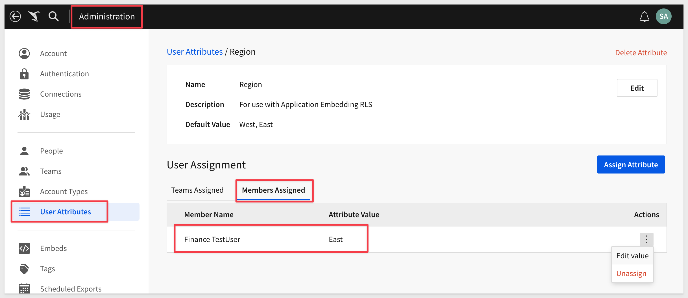
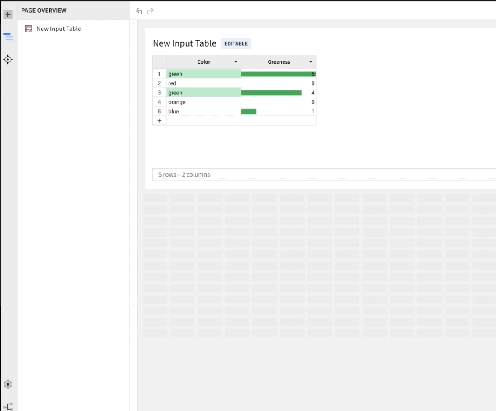
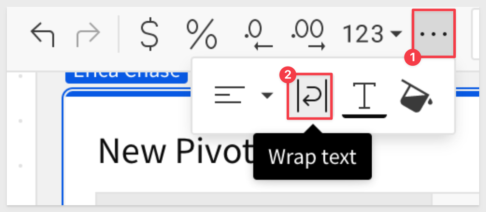
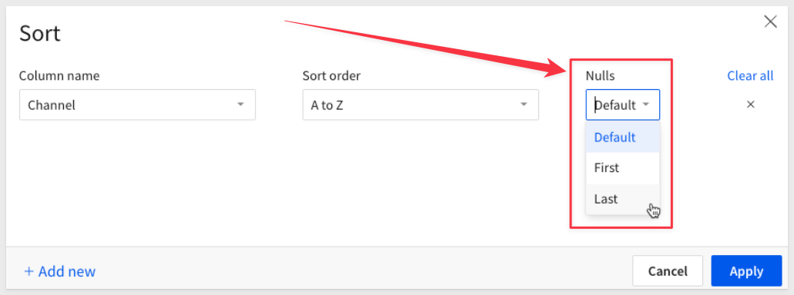
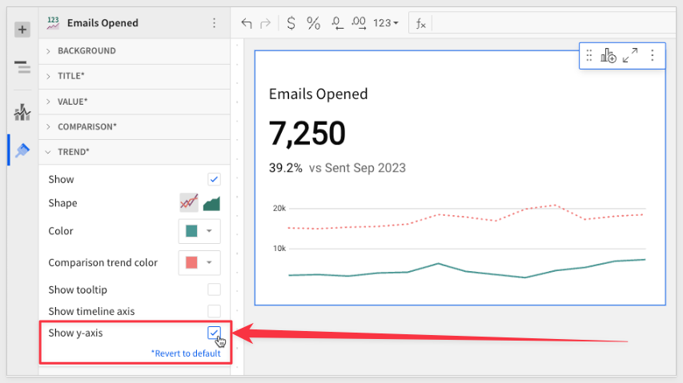
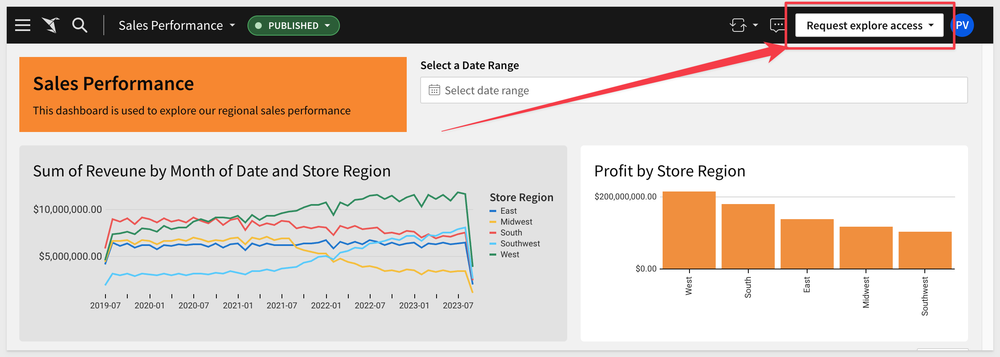
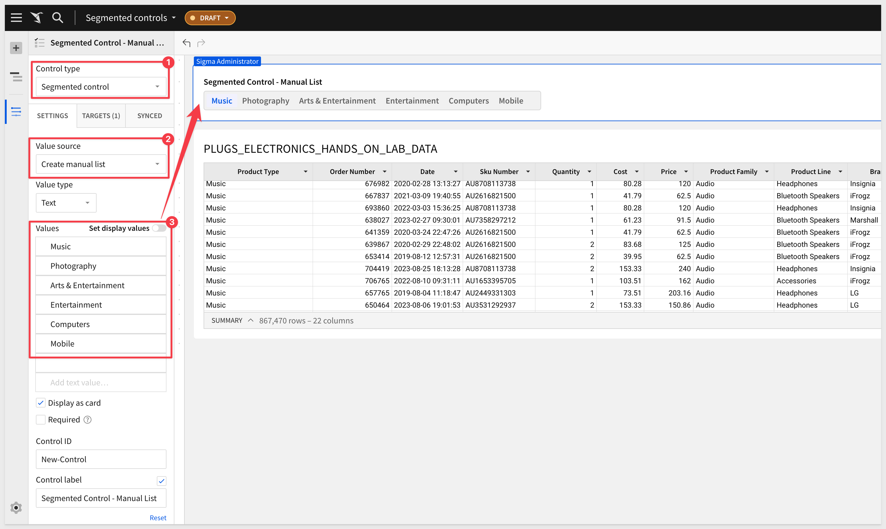
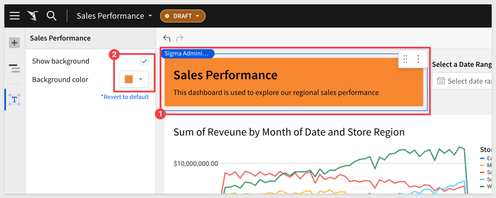

author: pballai
id: 09_2023_first_friday_features
summary: 09_2023_first_friday_features
categories: Administration
environments: web
status: Published
feedback link: https://github.com/sigmacomputing/sigmaquickstarts/issues
tags: first_friday_features
lastUpdated: 2023_10-05

# (09-2023) September

## Overview 
Duration: 5 

This QuickStart lists all the new and public beta features released, as well as bugs fixed in September 2023.

It is summary in nature, and you should refer to the specific Sigma documentation links provided for more information.

**Public beta features will carry the section text "Beta".**

All other features are considered released (**GA** or generally available).

Sigma actually has feature and bug fix releases weekly, and high-priority bug fixes on demand. We felt it was best to keep these QuickStarts to a summary of the previous month for your convenience.

New QuickStarts will be published on the first Friday of each month, and will include information for the previous month.


<!-- END OF SECTION-->

## Administration
Duration: 20

### User Attribute assignment for org members:
Prior to this feature, administrators had to create a Sigma Team in order to assign specific attributes to users, who needed to be a member of this team.

Sigma now supports assigning specific user attribute values directly to users. 

For example, the user `Finance TestUser` has the Attribute `Region` set to the value `East`. This attribute will be used to filter data automatically, to the "East" region.



[For information on how to implement user attributes, click here.](https://help.sigmacomputing.com/hc/en-us/articles/6709896696979#rsua)


<!-- END OF SECTION-->

## API
Duration: 10

### New endpoint: Teams
Returns a paginated list of team members and can be used to identify team admins, based on a unique identifier (teamId)

GET /v2/teams/{teamId}/members

```code
curl -X GET "https://api.sigmacomputing.com/v2/teams//members" \
 -H "accept: application/json" \
```

[Try it in Swagger](https://docs.sigmacomputing.com/?_gl=1*1clytiy*_ga*MTAyNTE4NzQ5NC4xNjg3NTUxNjQ5*_ga_PMMQG4DCHC*MTY5NjU0NzIxMy4yNDkuMS4xNjk2NTQ3MjI3LjQ2LjAuMA..#get-/v2/teams/-teamId-/members)


<!-- END OF SECTION-->

## Embedding
Duration: 20

### Auto-select input table connection and schema:
When an embed user creates an input table, Sigma **automatically** selects the connection and write schema if the user only has access to a single connection with one schema. 

This update bypasses the `Select a connection` requirement when applicable, providing a more simple and streamlined user workflow. 


<!-- END OF SECTION-->`

## Input Tables
Duration: 20

### Checkbox column type in input tables:
Input tables now support a checkbox column type in place of the logical type. 

To update these to the Checkbox type, open the `column menu` and select `Change column type` > `Checkbox.` 

`True` values convert to selected checkboxes, while `False` values convert to cleared checkboxes. 

Checkboxes enable additional workflow capabilities by simply capturing a "yes/no" response from a Sigma user. For example, record approvals, validations and enabling data triggers based on the user's response.


For more information about changing column types and checkbox data entry, see [Create and manage input table](https://help.sigmacomputing.com/hc/en-us/articles/15802569936275)


### Conditional formatting is now available for input tables:
You may now apply conditional formatting to Input Tables in a similar fashion as you would typical tables, using conditional formatting rules.


<br>
<br>


### Databricks Support:
Input tables are now compatible with Databricks connections. These dynamic workbook elements support structured data entry that allows you to integrate new data points into your analysis and augment existing data from Snowflake or Databricks. 

For more information about input tables and how to use them, see the following documentation:<br>
[Intro to input tables](https://help.sigmacomputing.com/hc/en-us/articles/15802499663507)<br>
[Create and manage input tables](https://help.sigmacomputing.com/hc/en-us/articles/15802569936275)<br>
[Edit existing input table columns](https://help.sigmacomputing.com/hc/en-us/articles/15802547665171)<br>

To review how Input Tables solves several common use cases, [check out this QuickStart](https://quickstarts.sigmacomputing.com/guide/input_tables_use_cases/index.html?index=..%2F..index#0)


<!-- END OF SECTION-->

## New QuickStarts in September
Duration: 20

[Fundamentals 6: Administration](https://quickstarts.sigmacomputing.com/guide/fundamentals_6_administration/index.html?index=..%2F..index#0)


<!-- END OF SECTION-->

## Tables / Pivots
Duration: 20

### Pivot Table wrap text:
Users now have the ability to wrap the text in their pivot tables. By default, we truncate text that is too long to fit in a cell. 

Users now have the option to expand the line height and see the entire content of the header or cell.



[Documentation:](https://help.sigmacomputing.com/hc/en-us/articles/20626146425619-Wrap-text)


### Option to sort null values first or last:
When sorting a table column, you can force nulls to be ordered first or last regardless of the selected sort order (descending or ascending). 

To customize null value sorting, right-click the column header and select `Custom sort`, then select an option in the Nulls field:



<strong>Nulls field options:</strong>
 <ul>
      <li><strong>Default:</strong> Orders nulls based on the CDW or DBMS method.</li>
      <li><strong>First:</strong> Orders nulls at the top of the column.</li>
      <li><strong>Last:</strong> Orders nulls at the bottom of the column.<li>
</ul>


<!-- END OF SECTION-->

## Version Tagging
Duration: 20

### Version Tag Connection Swapping with Input Tables:
Organizations can now swap the connection source when applying version tags to workbooks containing input tables.

Connection swapping allows you to move the workbook through the development process.

[Documentation:](https://help.sigmacomputing.com/hc/en-us/articles/13310865519507-Version-Tagging#h_01HAB848CR0M1Q2N901DH3EYJ0)


### Tag Permissions (Beta):

<aside class="positive">
<strong>IMPORTANT:</strong><br> This feature is currently in Beta and subject to quick, iterative changes. As a result, the latest product version may differ from the contents of this document.
</aside>

When you create a version tag, you can now select a permission level for users or teams: `Public` or `Protected`. 

This allows org's greater control over who can publish updates to important workbooks that are exposed to stakeholders and embed customers.

Protected tags allow you to restrict access and select the users or teams that can apply a tag on a workbook. 

The users must have `Can edit` permissions for the workbook. 

Public tags are unprotected, and the user must have `Can edit` permissions for the workbook as well.

[Documentation:](https://help.sigmacomputing.com/hc/en-us/articles/13310865519507-Version-Tagging)


### Version Tag Requests:
Users (the "requestor") without permission to use a protected tag can now submit a request to set that tag on a specific workbook version.

After the request is made, an email is sent to all the members (the "approvers") with explicit access to the protected tag. 

After reviewing the workbook, the approver then can apply the requested tag to the workbook in question.

[Documentation:](https://help.sigmacomputing.com/hc/en-us/articles/13310865519507-Version-Tagging#h_01HAD6953P0BDK4NSFP6PTH4RH)


<!-- END OF SECTION-->

## Visualizations
Duration: 20

### Cartesian chart default value formatting:
Cartesian charts (bar, line, area, scatter, box, and combo) now display the value axis and data labels with metric abbreviations or SI units when the `Automatic format` option is applied by default or through manual selection. 

For example, the value 10,000,000,000 is displayed as 10B. However, if a chart’s source element uses a specific format (number, currency, financial, etc.), the `Automatic` option inherits the source format. 


### Y-axis in KPI chart trend lines:
KPI chart trend lines can now display y-axis grid lines and value labels. 

To enable the y-axis, go to `icon Element format` > `Trend` and select the `Show y-axis` checkbox.



For more information about formatting KPI chart trend lines,[ see Build a KPI chart.](https://help.sigmacomputing.com/hc/en-us/articles/16233707698707#h_01GZBDEM8V5D4EAFP5QZY8KH4X)


<!-- END OF SECTION-->

## Workbooks
Duration: 20

###  Allow users to request permission to explore workbooks:
Users with `Viewer` licenses can now request permission to explore workbooks by clicking `Request explore access` in any workbook header. 

Sigma administrators will receive the request. They can upgrade a user’s license by reassigning them to an account type with the 'Explore workbooks' permission enabled.

For example, this is what a user with `Viewer` rights would see when a workbook is shared to them:




### Segmented controls:

A segmented control provides a "linear strip" of two or more named segments. 

Each segment acts exactly like a radio button, selecting the matches and excluding other data records. 

When you have to make selections from a long list of values, segmented controls can be a better option because they provide a smaller subset of relevant values, a more economical dashboard layout, and a nicer overall experience for viewers.

**There are two types of segmented controls:**
Based on a manually-entered list. You must have values that select data on the target of the control.



Based on a column in the data source or workbook element. These controls can have a maximum of 5 distinct values, sorted on record count or alphabetically.


### Text element background options:
We have added the ability to change the background color in text elements. 

In the  Element properties panel, choose to show or hide the text element background area. 

Enabling the background creates a card display and adds padding around the text content for consistency with data elements and input tables. 

You can then select a custom background color from the color palette or picker, or you can keep the default selection based on the workbook theme. 

For example:




<!-- END OF SECTION-->

## Additional Information
Duration: 20

**Additional Resource Links**

[Blog](https://www.sigmacomputing.com/blog/)<br>
[Community](https://community.sigmacomputing.com/)<br>
[Help Center](https://help.sigmacomputing.com/hc/en-us)<br>
[QuickStarts](https://quickstarts.sigmacomputing.com/)<br>
<br>

[](https://twitter.com/sigmacomputing)&emsp;
[](https://www.linkedin.com/company/sigmacomputing)&emsp;
[](https://www.facebook.com/sigmacomputing)


<!-- END OF WHAT WE COVERED -->
<!-- END OF QUICKSTART -->
