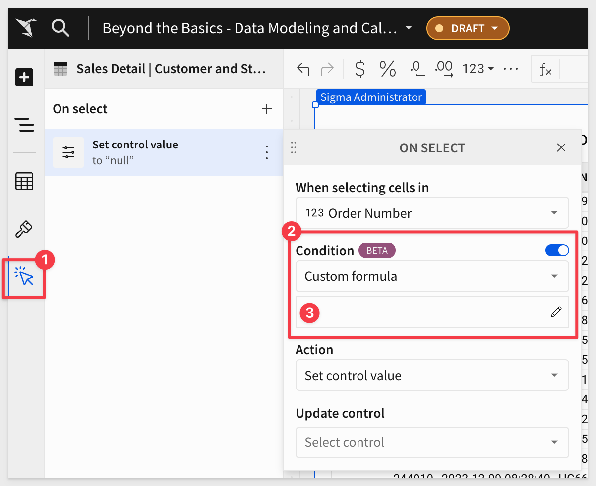
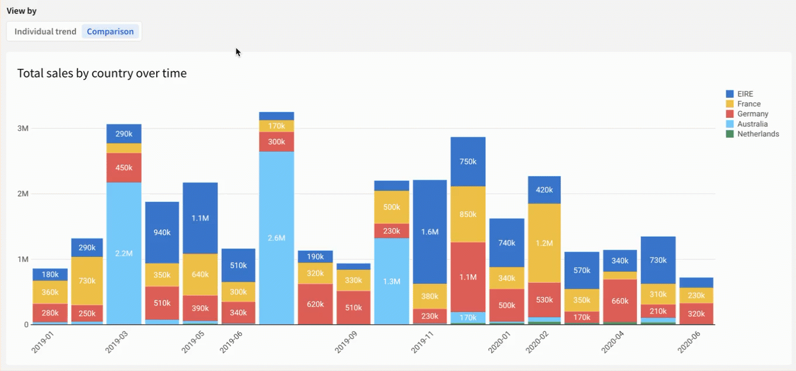
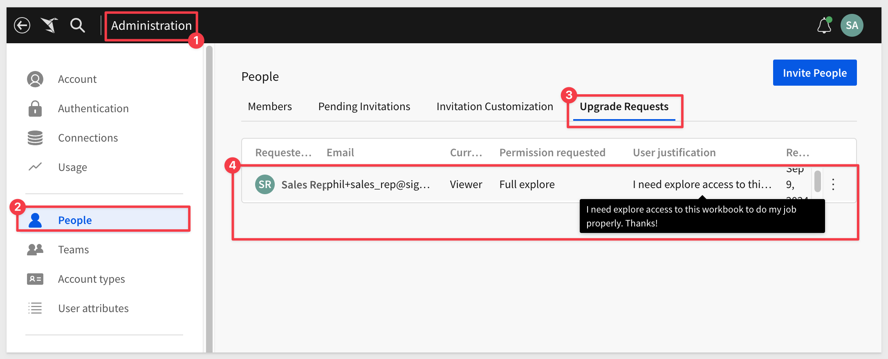
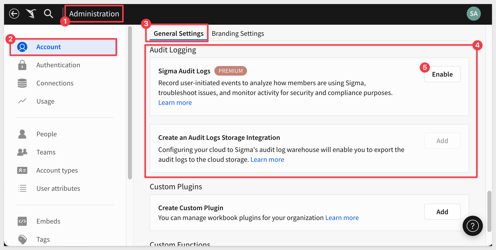
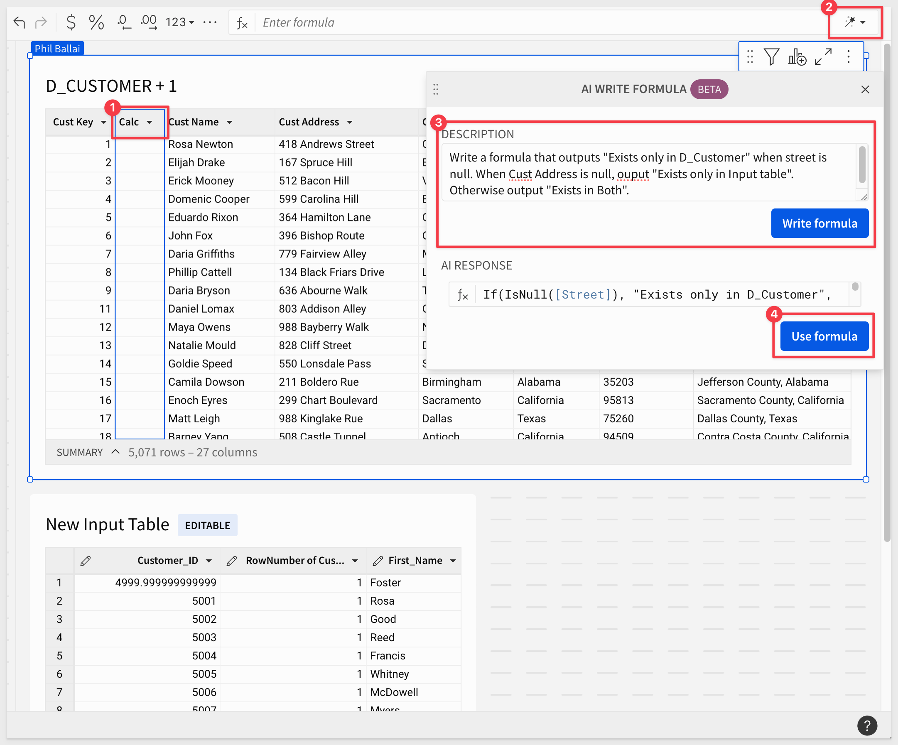
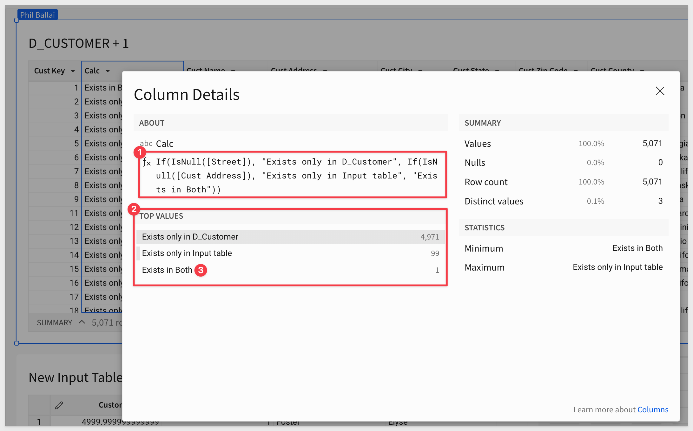
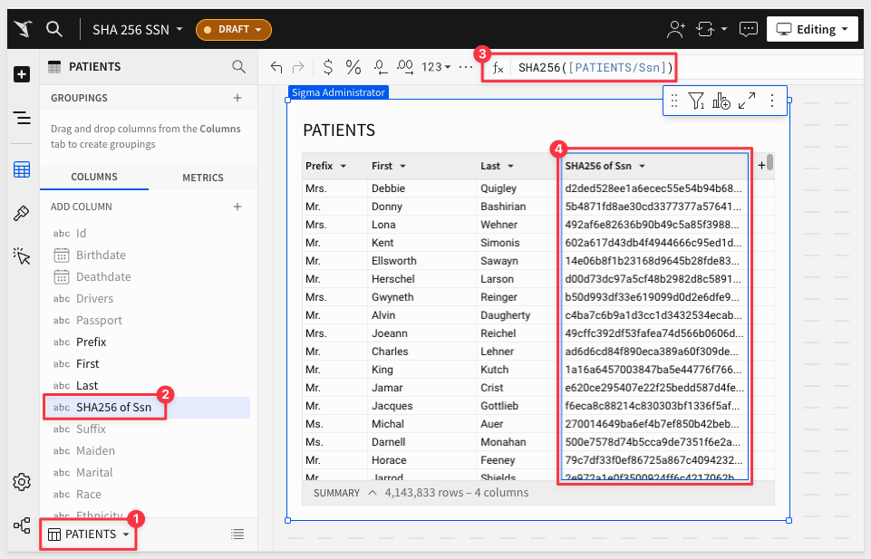

author: pballai
id: 09_2024_first_friday_features
summary: 09_2024_first_friday_features
categories: Administration
environments: web
status: Published
feedback link: https://github.com/sigmacomputing/sigmaquickstarts/issues
tags: first_friday_features
lastUpdated: 2024-09-27

# (09-2024) September
<!-- The above name is what appears on the website and is searchable. 

September 6th, 2024 - Done
September 13th, 2024 - Done
September 20th, 2024 - Done
September 27th, 2024 - Done
Publish on Sept 27th due to vacation
-->

## Overview 
Duration: 5 

This QuickStart lists all the new and public beta features released, as well as bugs fixed in September 2024.

It is summary in nature, and you should refer to the specific Sigma documentation links provided for more information.

**Public beta features will carry the section text "Beta".**

All other features are considered released (**GA** or generally available).

Sigma actually has feature and bug fix releases weekly, and high-priority bug fixes on demand. We felt it was best to keep these QuickStarts to a summary of the previous month for your convenience.

New first Friday features QuickStarts will be published on the first Friday of each month, and will include information for the previous month.

Features carrying the  are customer favorites!

## Actions
Duration: 5 

### Make actions conditional (Beta) 
When you define an action for a workbook element, you can now define an optional condition for that action. Customize the trigger behavior of your action based on the value of a control element or using a custom formula.

Enable conditional actions:

Below is a GIF showing a visualization of `Total sales by country over time` and a control with two values, `Individual trend` and `Comparison`.

In the animation, a user clicks each of the two values, demonstrating that the chart visualization switches between a trellis view of each country and a combined view in a stacked bar chart.

For more information, see [Make an action conditional (Beta).](https://help.sigmacomputing.com/docs/make-an-action-conditional)

## Administration
Duration: 20

### Authenticate Databricks connections with OAuth (Beta)
You can now connect to Databricks using OAuth and inherit all security policies from Databricks. 

Databricks connections authenticated with OAuth allow your users to read data and use write-back features like input tables, warehouse views, materializations, and CSV uploads with their own individual credentials instead of a service account.

See [Configure OAuth with Databricks (Beta).](https://help.sigmacomputing.com/docs/configure-oauth-with-databricks)

### Manage upgrade requests in the Administration portal (Beta):
Admins can now view and respond to account upgrade requests in the Administration portal. 

When a user requests an upgrade to their account type to explore or create workbooks, an admin can review the request in the Administration portal. Admins still receive emails about these requests.

For example:

For more information, see [Respond to account upgrade requests (Beta)](https://help.sigmacomputing.com/docs/respond-to-account-upgrade-requests).

### Audit logging (GA) 
The Administration portal now includes an `Account` > `General Settings` > `Audit Logging` section that supports the following self-serve features:

- Sigma Audit Logs: Enable audit logging by activating the Sigma Audit Logs connection.
Create, update, or delete an Audit Logs Storage Integration: Add, update, or delete a cloud storage integration specifically for exporting audit log data to AWS, Azure, or GCP

- Audit logs functionality also has improved SLIs for data freshness and delivery. Fresh event data is available within an hour 99.9% of the time, and new audit log events are available at least once 99.9% of the time.

<aside class="positive">
<strong>IMPORTANT:</strong>  Once enabled, it may take a few minutes for the logging to start. While this is being setup, the feature will display "Feature Pending". Once ready, the new connection can be browsed.
</aside>

For more information, see [Enable audit logging and Create, update](https://help.sigmacomputing.com/docs/enable-audit-logging), and [delete an audit logs storage integration.](https://help.sigmacomputing.com/docs/create-update-and-delete-an-audit-logs-storage-integration)

Sigma Audit Logs stores entries for 30 days by default, but you can retain audit log data for extended periods by exporting it to cloud storage.

For more information, see [Create, update or delete an audit logs storage integration (Beta)](https://help.sigmacomputing.com/docs/create-update-and-delete-an-audit-logs-storage-integration).

### Team provisioning for SAML SSO
Team provisioning for SAML SSO is now supported. Team assignments for a SAML user are synced when logging into Sigma. 

For more information, see [Single sign-on with SAML.](https://help.sigmacomputing.com/docs/single-sign-on-with-saml)

## AI
Duration: 20

### Write, correct, and explain formulas using the AI formula assistant (Beta) 
Sigma’s formula assistant uses AI to write new formulas, correct formula errors, and explain existing formulas applied to elements in workbooks and data models. These AI capabilities can help enhance productivity and accuracy, ensuring you get the most out of custom calculations and available functions.

For example, lets assume we have create a union on two tables of customer names and addresses. We need to derive which customers exist in both tables.

We can add a new column and use Sigma's `AI formula assistant` to write it for us, saving us time.

Looking at the `Column details` for the new column, we can see that the formula produced to expected results:

We can just filter the table to show rows that `Exists in Both`.

For more information, see [Use AI with formulas (Beta).](https://help.sigmacomputing.com/docs/use-ai-with-formulas)

## API
Duration: 20

Lots of new endpoints and changes to consider this month!

### New endpoint for workbook version history
The following endpoint for retrieving the version history of a workbook is now available:

- [Get version history for a workbook:](https://help.sigmacomputing.com/reference/getversionhistory) (GET /v2/workbooks/{workbookId}/version-history)

### New response output for List templates shared with your organization endpoint
The `entries` array includes one additional property in the response for the [List templates shared with your organization:](https://help.sigmacomputing.com/reference/listtemplatessharedwithyou) (GET /v2/shared_templates/shared_with_you) endpoint:

- **createdAt:** When the template was shared with your organization

### New workbook bookmarks API endpoints
The following endpoints to work with bookmarks in workbooks, including version tagged workbooks, are now available:

- [List bookmarks in a workbook:](https://help.sigmacomputing.com/reference/getworkbookbookmarks) (GET /v2/workbooks/{workbookId}/bookmarks)
- [Add a bookmark to a workbook:](https://help.sigmacomputing.com/reference/postworkbookbookmarks) (POST /v2/workbooks/{workbookId}/bookmarks)
- [Get a bookmark:](https://help.sigmacomputing.com/reference/getworkbookbookmark) (GET /v2/workbooks/{workbookId}/bookmarks/{bookmarkId})
- [Update a workbook bookmark:](https://help.sigmacomputing.com/reference/updateworkbookbookmark) (PATCH /v2/workbooks/{workbookId}/bookmarks/{bookmarkId})
- [Delete a bookmark from a workbook:](https://help.sigmacomputing.com/reference/deleteworkbookbookmarks) (DELETE /v2/workbooks/{workbookId}/bookmarks/{bookmarkId})

The same endpoints are available for tagged workbooks:

- [List bookmarks in a tagged workbook](https://help.sigmacomputing.com/reference/gettaggedworkbookbookmarks) (GET /v2/workbooks/{workbookId}/tags/{tagName}/bookmarks)
- [Add a bookmark to a tagged workbook](https://help.sigmacomputing.com/reference/createtaggedworkbookbookmark) (POST /v2/workbooks/{workbookId}/tags/{tagName}/bookmarks/)
- [Get a bookmark in a tagged workbook](https://help.sigmacomputing.com/reference/gettaggedworkbookbookmark) (GET /v2/workbooks/{workbookId}/tags/{tagName}/bookmarks/{bookmarkId})
- [Update a bookmark in a tagged workbook](https://help.sigmacomputing.com/reference/updatetaggedworkbookbookmark) (PATCH /v2/workbooks/{workbookId}/tags/{tagName}/bookmarks/{bookmarkId})
- [Delete a bookmark from a tagged workbook](https://help.sigmacomputing.com/reference/deletetaggedworkbookbookmark) (DELETE /v2/workbooks/{workbookId}/tags/{tagName}/bookmarks/{bookmarkId})

### Pagination required for list endpoints:
List endpoints that did not already require pagination **now require pagination as of September 4, 2024.**

- [List members:](https://help.sigmacomputing.com/reference/listmembers)
(GET /v2/members)
- [List teams:](https://help.sigmacomputing.com/reference/listteams) (GET /v2/teams)
- [List workspaces:](https://help.sigmacomputing.com/reference/listworkspaces) (GET /v2/workspaces)
- [List materialization schedules for a workbook:](https://help.sigmacomputing.com/reference/listmaterializationschedules) (GET /v2/workbooks/{workbookId}/materialization-schedules)
- [List scheduled exports for a workbook:](https://help.sigmacomputing.com/reference/listworkbookschedules) (GET /v2/workbooks/{workbookId}/schedules)

If you use these endpoints, update your API requests to include the limit query parameter to return a paginated response. 

<aside class="positive">
<strong>IMPORTANT:</strong>  Requests without the limit parameter now return a paginated response of the default page size (50).
</aside>

### Reorganized API endpoint documentation:
The API endpoint documentation is now organized in logical subsections to make endpoints easier to find and use.

Access the [API reference here.](https://help.sigmacomputing.com/reference/get-started-sigma-api)

## Bug Fixes
Duration: 20

**1:** Copying and pasting an input table element no longer results in the error “Unfortunately, something went wrong. Pasting failed.”

**2:** Insert row action (beta) now prohibits row insertion into tables with protected columns.

**3:** Modifying the permissions for a nested folder that inherited its permissions from the parent folder no longer affects the parent folder permissions.

**4:** Tagging a workbook after removing a version tag no longer results in an error indicating "Failed to tag workbook, $workbookname$ is archived."

**5:** When tagging a version of a workbook that contains only input tables, you can now swap data sources successfully.

## Embedding
Duration: 20

### Embed SDK for React (Beta)
The Embed SDK for React offers a developer-friendly interface that simplifies integration into applications. Developers can access detailed installation and usage guides on [Github.](https://github.com/sigmacomputing/embed-sdk)

See [Embed SDK for React](https://help.sigmacomputing.com/docs/embed-sdk-for-react) or follow this [QuickStart](https://quickstarts.sigmacomputing.com/guide/embedding_15_embed_sdk/index.html?index=..%2F..index&_gl=1*kllv3*_gcl_au*NDE1NjcyODMyLjE3MjEzOTgwOTA.*_ga*MjAyNzIyMDcwLjE3MTcxODQ4Nzk.*_ga_PMMQG4DCHC*MTcyNjg0NTgzMy4yMjQuMS4xNzI2ODQ2MjM4LjYwLjAuMA..#0) for an in-depth guide to using the SDK.

### Link sharing for secure embeds: 
Embedded Link Sharing, when enabled, allows users to share specific workbooks, explorations, or bookmarks through URLs generated within an embed as they work in Sigma.

These links can be copied and pasted into user-created emails (or other systems), allowing recipients to access the relevant content directly from their emails without needing to navigate back to Sigma.

These links will also be included in any scheduled exports created by the user, allowing recipients to click a link to access the shared content.

Alternatively, customer developers can use these links to enhance their application's functionality.

To review the documentation, see [Configure a shareable link for an embed.](https://help.sigmacomputing.com/changelog#:~:text=Configure%20shareable%20links,an%20embed.)

For a detailed demonstration of embedded link sharing, there is a [QuickStart.](https://quickstarts.sigmacomputing.com/guide/embedding_17_link_sharing/index.html?index=..%2F..index#0)

## Functions / Calculations
Duration: 20

### ArrayIntersection function
The `ArrayIntersection` function compares two arrays and returns an array of all overlapping elements, without duplicates. 

A business user can gain significant value this simple function, by leveraging it to identify common elements between two datasets, which is a common need in various business scenarios. Just a few examples are listed;

- Identify customers who have purchased both Product A and Product B by intersecting purchase lists.
- Find customers who are both high spenders and frequent shoppers to offer them exclusive rewards.
- Determine which products are available in multiple warehouses by intersecting inventory lists. This aids in efficient stock redistribution.
- Find common products supplied by multiple vendors to negotiate better pricing or consolidate suppliers.
- Identify duplicate records across datasets when merging databases, ensuring data accuracy and consistency.

The function is now supported for BigQuery, Snowflake, and PostgreSQL.

For more information, see [ArrayIntersection.](https://help.sigmacomputing.com/docs/arrayintersection)

### SHA256 function
The `SHA256` function transforms text input into a 256-bit hash value. 

The function is supported for all databases except for PostgreSQL.

In the example below, patient data contains social security number and we obfuscated it, using this new function as:

For more information, see [SHA256.](https://help.sigmacomputing.com/docs/sha256)

## New QuickStarts in September
Duration: 20

[Embedding 15: Embed-SDK for React:](https://quickstarts.sigmacomputing.com/guide/embedding_15_embed_sdk/index.html?index=..%2F..index#0  
) 
Sigma provides many methods to allow users and developers to interact with its systems including web-ui, REST API, Javascript Embed API and an SDK for the React framework.

The Embed-SDK for React offers a higher-level, developer-friendly interface that simplifies integration into applications, in contrast to Sigma's lower-level JavaScript Embed-API, which provides more granular control but may require additional coding.

[Build and Secure Multi-Tenant Data Applications with Snowflake and Sigma](https://quickstarts.sigmacomputing.com/guide/snowflake_build_secure_multitenant_data_applications_snowflake_sigma/index.html?index=..%2F..index#0) 
This Sigma and Snowflake lab is designed to teach you how to build customer facing analytics applications that allow your end users to dive deeper and go further with data.

[Fundamentals 8: Beyond the Basics](https://quickstarts.sigmacomputing.com/guide/fundamentals_8_beyond_the_basics_1/#0)  
This QuickStart covers some of the more common questions we receive from Sigma customers. It is not comprehensive but is intended to present topics that often arise after users have completed the [QuickStart Fundamentals](https://quickstarts.sigmacomputing.com/?cat=fundamentals) and begin using Sigma with their own data.

## Workbooks
Duration: 20

### Containers (Beta) 
Sigma's container feature allows you to organize workbook pages by grouping elements within a customizable container.

This provides an intuitive way to manage layouts, ensuring that related elements remain visually cohesive. Containers not only streamline the design process by enabling you to adjust and style grouped components collectively but also enhance flexibility when rearranging or resizing elements on the canvas. This powerful feature simplifies complex workbook structures, making it easier to maintain consistency in both functionality and appearance.

By using containers, workbook design takes on a whole new meaning.

In the animation below, we show how containers are dramatically improve the appearance of existing Sigma workbooks.

For more information, see [Organize workbook layouts with containers (Beta).](https://help.sigmacomputing.com/docs/organize-workbook-layouts-with-containers)

### Custom sort null values in pivot tables
Specify the sort order of null values in a pivot row or pivot column using custom sort. Choose from the default option, which mimics your data warehouse sort order for null values, listing all null values first, or listing all null values last.

For more information, see [Customize the sort order of data elements.](https://help.sigmacomputing.com/docs/configure-custom-sort)

### Customize element styles in a workbook layout (Beta)
You can now customize the styling of data elements such as tables, input tables, visualizations, and UI elements. 

This provides users a great deal of flexibility to make their work visually appealing, which helps with end-user adoption.

Add or remove padding, change the corner style, add a border, and change the text alignment for text elements.

Set default styles in an organization theme, customize styles for an entire workbook in the workbook settings, or style individual elements.

For more information, see [Customize element background and styles](https://help.sigmacomputing.com/docs/customize-element-background-and-styles) and [Workbook settings overview.](https://help.sigmacomputing.com/docs/workbook-settings-overview)

### Pivot table changes

#### Copy pivot table contents
You can now copy cells, rows, and columns in pivot tables to your clipboard.

#### Highlight the selected row and column for the pivot table
When you select a cell in a pivot table, the corresponding pivot rows and columns are highlighted.

### New version of plugins available
Enhancements include:

- Plugins can now trigger actions in other workbook elements.
- User-defined functions can now be called in plugins through workbook actions.
- Paginated data fetching, allowing you to fetch more than 25,000 data points.
- Warning messages if configuration items are passed into functions/hooks before they are registered

Developers can access detailed installation and usage guides on [GitHub.](https://github.com/sigmacomputing/plugin)

There is also a [QuickStart on Plugins.](https://quickstarts.sigmacomputing.com/guide/administration_plugins/index.html?index=..%2F..index#0)

### Send bug reports from error messages
For select errors, you can now send a bug report to Sigma from a link in the error message.

### Specify color palette with hex codes
To more precisely specify the visualization color palette for your workbook, you can specify a custom color palette with hex codes.

For more information, see [Workbook settings overview.](https://help.sigmacomputing.com/docs/workbook-settings-overview)

### Updated Geography map visualization
The Geography map visualization now uses [Mapbox.](https://www.mapbox.com/) The existing Point and Region map visualizations had already been using Mapbox.

As part of this change, the default zoom of your map might be different. 

Use the `Pin viewport` option on a map to persist the desired zoom level.

### Updated workbook theme colors and settings 
The colors used for organization and workbook themes have been updated, and there are new settings to override the canvas color or element background color for a workbook theme.

Workbooks using existing themes have been migrated to the new colors. As a result, existing theme colors might have an override canvas color or override element background color already set. If your workbook does not look as expected, review the following known issues and workarounds:

- If your background is no longer white or black, set override colors for both the Canvas and Element.
- If your workbook is oddly pastel and bright, adjust the Surface color. Open the color picker and drag the color picker to the bottom of the color field.
- If your workbook has a tinted color instead of gray, adjust the Surface color. Open the color picker and drag the color picker all the way to the left of the color field.
- If your theme was originally based on a preset theme, reapply the preset and adjust the Primary color.
- If the colors in your workbook appear overly saturated, adjust the Theme colors to use less saturated colors.

For more information, see [Theme settings for more details.](https://help.sigmacomputing.com/docs/workbook-settings-overview#theme-settings)

### Workbook elements

#### Format segmented control alignment
You can now format the alignment of a segmented control. Align the control to the left or right, or stretch the control to the full width of the control element.

For more details, see [Create and configure a segmented control.](https://help.sigmacomputing.com/docs/segmented-control)

#### Expanded text formatting options for conditional formatting
When you apply conditional formatting to a table or pivot table, you can format the style of the text. Conditionally apply underline, italics, or a specific text color to text.

## Additional Information
Duration: 20

**Additional Resource Links**

[Blog](https://www.sigmacomputing.com/blog/) 
[Community](https://community.sigmacomputing.com/) 
[Help Center](https://help.sigmacomputing.com/hc/en-us) 
[QuickStarts](https://quickstarts.sigmacomputing.com/) 

Be sure to check out all the latest developments at [Sigma's First Friday Feature page!](https://quickstarts.sigmacomputing.com/firstfridayfeatures/)
 

&emsp;
&emsp;

<!-- END OF WHAT WE COVERED -->
<!-- END OF QUICKSTART -->
