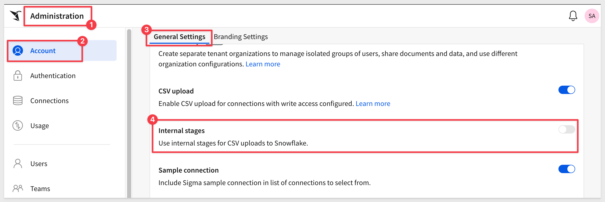
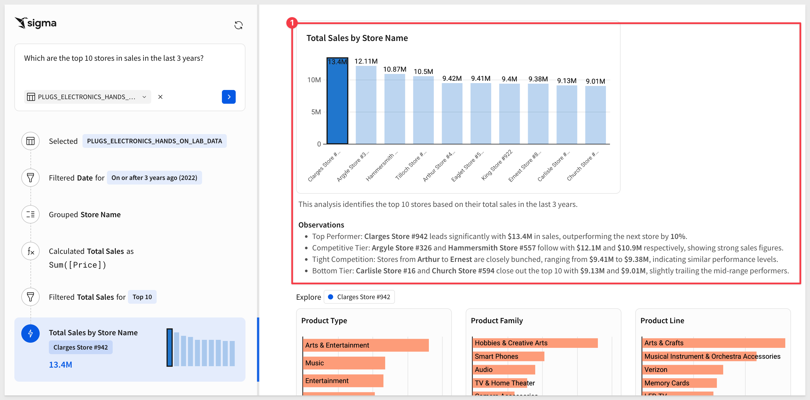
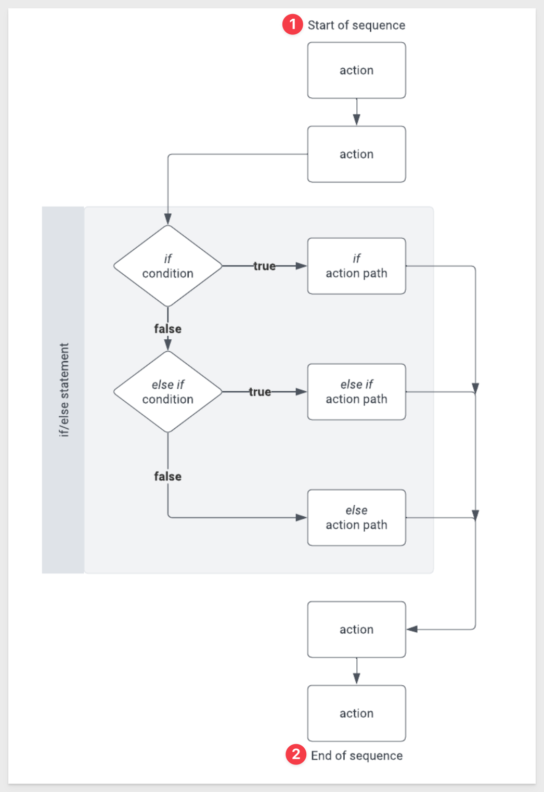
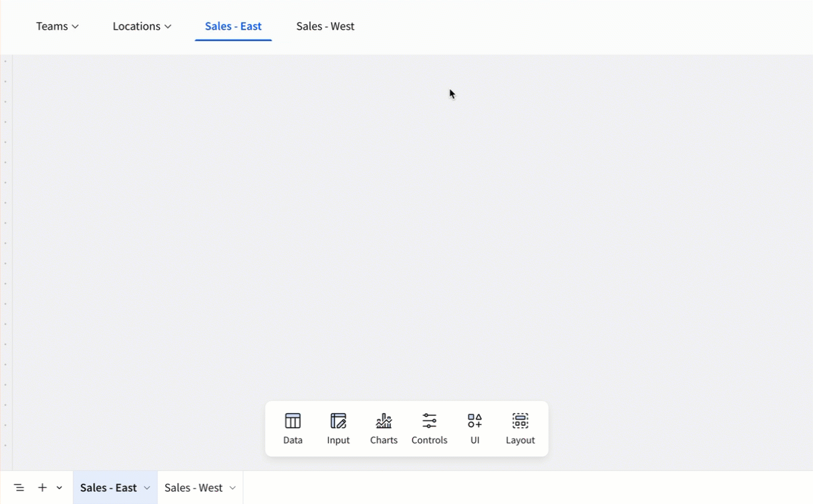

author: pballai
id: 09_2025_first_friday_featuresfirst_friday_features
summary: 09_2025_first_friday_features
categories: firstfridayfeatures
environments: web
status: Published
feedback link: https://github.com/sigmacomputing/sigmaquickstarts/issues
tags: first_friday_features
lastUpdated: 2025-09-31ßß

# (09-2025) September
<!-- The above name is what appears on the website and is searchable. 

 
-->

## Overview 
Duration: 5 

This QuickStart lists all the new and public beta features released, as well as bugs fixed in September 2025.

It is summary in nature, and you should refer to the specific Sigma documentation links provided for more information.

**Public beta features will carry the section text "Beta".**

All other features are considered released (**GA** or generally available).

Sigma actually has feature and bug fix releases weekly, and high-priority bug fixes on demand. We felt it was best to keep these QuickStarts to a summary of the previous month for your convenience.

New first Friday features QuickStarts will be published on the first Friday of each month, and will include information for the previous month.

### Subscribe to What's New in Sigma
For those wanting to see what Sigma is doing on each week, release notes are now also available on the [Sigma Community site](https://community.sigmacomputing.com/). There, you can **opt in to receive notifications about future release notes** in order to stay on top of everything new happening at Sigma. You can also subscribe to automated updates in any Slack channel using the Sigma Community release notes RSS feed. 

For more information on how to subscribe to release note notifications, see [About the release notes](https://community.sigmacomputing.com/t/about-the-release-notes-category/5517) 

<aside class="positive">
<strong>IMPORTANT:</strong>  Some screens in Sigma may appear slightly different from those shown in QuickStarts. This is because Sigma continuously adds and enhances functionality. Rest assured, Sigma’s intuitive interface ensures that any differences will not prevent you from successfully completing any QuickStart.
</aside>

For more information on Sigma's product release strategy, see [Sigma product releases](https://help.sigmacomputing.com/docs/sigma-product-releases)

If something is not working as you expect, here's how to [contact Sigma support](https://help.sigmacomputing.com/docs/sigma-support)

<!-- END OF SECTION-->

## Administration
Duration: 20

### Allowlist new IP address for email burst exports
If your organization restricts email traffic sent from specific IP addresses, add 134.128.103.81 to the allowlist by September 22, 2025. 

This IP address is in addition to the 198.37.153.185 address that Sigma currently uses. 

<aside class="positive">
<strong>IMPORTANT:</strong>  Organizations without this new IP address allowlisted might have issues receiving email burst exports after September 22, 2025.
</aside>

Alternatively, you can configure a custom SMTP server to use instead. For more information, see [Custom SMTP server](https://help.sigmacomputing.com/docs/customize-welcome-and-invite-emails#custom-smtp-server)

### App-based two-factor authentication for users (Beta)
You can now enable app based authentication for two factor authentication for individual user profiles in Sigma. 

Admins can reset app based authentication enrollment for users in their organization who have enabled it.

For more information, see [App-based authentication for users](https://help.sigmacomputing.com/docs/app-based-authentication-for-users)

### Audit logging events for app-based two-factor authentication (Beta)
You can now view app-based two-factor authentication login events in the audit logs.

### Internal stages for CSV uploads
For Snowflake connections, you can now elect to import CSV files via internal or external stages after the files are processed in Sigma’s infrastructure. 

This is set at the organization level in Sigma:

For more information, see [Enable internal or external stages for CSV uploads](https://help.sigmacomputing.com/docs/enable-or-disable-csv-upload#enable-internal-or-external-stages-for-csv-uploads-snowflake)

### New columns on SUPPORT_CHATS table for audit logs
We have added several new columns to the `SUPPORT_CHATS` table providing greater insight into the conversations you’re having with support:

- Feature Group
- Main Question
- Problem Statement
- Product Classification
- Solution

This information can be found in your `AUDIT_LOG` > `SIGMA_SHARED` > `SUPPORT_CHATS` table and can be used to share questions and outcomes to other users as well, perhaps as part of a FAQ. 

For more information, see [Sigma Shared metadata reference](https://help.sigmacomputing.com/docs/audit-log-events-and-metadata#sigma-shared-metadata-reference)

### New IP address for email burst exports
If your organization restricts email traffic sent from specific IP addresses, add `134.128.103.81` to the allowlist by **September 22, 2025.** 

This IP address is in addition to the 198.37.153.185 address that Sigma currently uses. 

Organizations without this new IP address allowlisted might have issues receiving email burst exports after September 22, 2025.

Alternatively, you can configure a custom SMTP server to use instead. For more information, see [Custom SMTP server](https://help.sigmacomputing.com/docs/customize-welcome-and-invite-emails#custom-smtp-server)

### PNG file type now supported for webhook exports
When exporting to a webhook endpoint, the PNG file type is now supported. 

Individual elements can be exported to webhooks as CSV, JSON, PDF or PNG.

For more information, see [Export to webhook](https://help.sigmacomputing.com/docs/export-to-webhook)

<!-- END OF SECTION-->

## AI
Duration: 20

### AI export schedule names (Beta)
For all organizations that have an AI provider assigned, Sigma now uses AI to generate export schedule names based on your export attachment name, export destination type and format, and set conditions. 

These names are visible when viewing all your or your organization's scheduled exports in Sigma, and do not affect the contents of the export itself.

For more information, see [Use AI export schedule names (Beta)](https://help.sigmacomputing.com/docs/manage-organization-schedules#/use-ai-export-schedule-names-beta)

### Ask Sigma for data source tables
When you view a data source table on the `Connections` page, you can now ask a question of the data source from the `Ask Sigma` option on the `Overview` tab. 

You can ask a question of any data source table visible to you, not just sources highlighted for Ask Sigma:

When you enter a question, Ask Sigma runs with it and in seconds we have a result we can use to answer the question, iterate on or explore in a workbook:

For more information, see [Ask a question on a data source table](https://help.sigmacomputing.com/docs/ask-natural-language-queries-with-ask-sigma#ask-a-question-on-a-data-source-table)

### New account type permissions for exports, user attributes, and branding settings
The following admin feature permissions are now available for the `Build` account type and can be granted to custom account types:

- Manage users
- Manage user attributes
- Manage teams
- Manage export integrations

The `Branding` settings permission is now the `Manage email branding` permission and now only control access to the `Customize your email settings` for your organization. Branding settings for workbook themes and custom fonts are restricted under the `Manage all workbook themes and fonts` permission.

For more information, see [Account type and license overview](https://help.sigmacomputing.com/docs/account-type-and-license-overview)

<!-- END OF SECTION-->

## API
Duration: 20

### Notice of deprecation; unpaginated responses from list endpoints
Returning unpaginated responses from list endpoints is now deprecated. 

**On March 15, 2026, this functionality will reach end of support and the following list endpoints that did not return a paginated response will only return a paginated response:**

- List members (GET /v2/members)
- List teams (GET /v2/teams)
- List workspaces (GET /v2/workspaces)
- List materialization schedules for a workbook (GET /v2/workbooks/{workbookId}/materialization-schedules)
- List scheduled exports for a workbook (GET /v2/workbooks/{workbookId}/schedules)

If you use these endpoints, update your API requests to include the limit query parameter to return a paginated response. 

After the end of support date, requests without the limit parameter return a paginated response of the default page size (50).

**If you are already using the paginated response from list endpoints, no action is needed.**

### New response output for the list columns for a workbook endpoint
The [List columns for a workbook element](https://help.sigmacomputing.com/reference/getelementcolumns) endpoint now includes the column formula in the response output.

### New endpoint to swap data model sources
The following endpoint to [Swap the sources of a data model](https://help.sigmacomputing.com/reference/swapdatamodelsources) is now available.

The endpoint supports swapping datasets and tables from your data platform, or swapping the connection used by the data model.

<!-- END OF SECTION-->

## Bug Fixes
Duration: 20

**1:** When exporting explorations, unavailable export options are now no longer shown, instead of throwing an error message.

**2:** Filtering and sorting now work as expected in `Administration` > `Materializations`.

**3:** In the published version of a workbook, data elements no longer show an outline on hover.

**4:** Users with Can explore workbook access can now trigger an Open modal action when a formula-based condition on the sequence references elements on hidden pages.

**5:** Previously, text elements sometimes snapped to fit the length of their contents when resizing. Now, text elements can be resized regardless of the length of their contents.

**6:** When swapping the source of a workbook with the API, a joined table no longer displays an `Invalid argument` error and has its sources swapped successfully.

**7:** When creating a linked input table, the modal now displays the write-back destination selection field first (above the list of columns) for improved visibility.

**8:** After deleting a materialization schedule on a published workbook, the workbook no longer opens a custom view.ß

<!-- END OF SECTION-->

## Data Apps
Duration: 20

### If/else control flow in action sequences (Beta) 
Use `if/else` statements to create dynamic workflows within action sequences. 

If/else control flow adds flexibility to a sequence by allowing it to check one or more conditions and execute actions for the first condition that evaluates to `true`.

Key advantages of using an if/else control flow:

- Simplify action workflows by consolidating multiple conditions into a single sequence. See an example use case with and without if/else.
- Set conditions that reference results of previous actions in the sequence, including called stored procedures. See an example sequence that calls a stored procedure then uses the returned value to apply different logic in the if/else statement.
- Prevent workflow errors and incomplete logic by using an else component to define a default action path.

An typical workflow looks like this:

For more information, see [Build if/else control flow in an action sequence](https://help.sigmacomputing.com/docs/build-if-else-control-flow-in-an-action-sequence)

### Input table editing on mobile
Users can now edit input table data on mobile devices. This update enables mobile data app workflows, including direct data input and row updates via actions.

### Input table support on BigQuery connections (GA)
Input tables are now compatible with `BigQuery` connections. 

The dynamic workbook elements support structured data entry, allowing you to integrate new data points into your analysis and augment existing data from your data platform.

For more information about input tables and how to use them, see the following documentation:

[Intro to input tables](https://help.sigmacomputing.com/docs/intro-to-input-tables)
[Create new input tables](https://help.sigmacomputing.com/docs/create-new-input-tables)
[Edit existing input table columns](https://help.sigmacomputing.com/docs/edit-existing-input-table-columns)

### Show actions targeted by element
You can now quickly view and navigate to elements with actions that target the selected element. This makes it easier to identify and navigate in the actions workflow.

In the `action sequence` menu, select `Show actions targeting this element` to view a list of trigger elements sorted by page, then select an element to open its action sequences:

<!-- END OF SECTION-->

## Data Modeling
Duration: 20

### dbt Semantic Layer integration (GA) 
You can configure and query a dbt Semantic Layer integration, allowing you to leverage your predefined dbt metrics in Sigma workbooks. 

To filter your queries, or pass other data to your queries, you can also reference control values.

To set up the dbt Semantic Layer integration, see [Configure a dbt Semantic Layer integration](https://help.sigmacomputing.com/docs/configure-a-dbt-semantic-layer-integration)

For details about query syntax, see [Query a dbt Semantic Layer integration](https://help.sigmacomputing.com/docs/query-a-dbt-semantic-layer-integration)

### Python element in data models (Beta)
If your organization is connected to Databricks, you can add `Python elements` in data models to write and run Python code. 

For more information, see [Set up a Databricks connection for Python](https://help.sigmacomputing.com/docs/set-up-a-databricks-connection-for-python) and [Write and run Python code in Sigma](https://help.sigmacomputing.com/docs/write-and-run-python-code)

<!-- END OF SECTION-->

## Embedding
Duration: 20

### New option to disable the explore button
You can now use the `hide_explore_toggle` URL parameter to hide the `Explore` toggle from the embed menu for JWT embeds.

For more information, see [Embed URL parameters](https://help.sigmacomputing.com/changelog#:~:text=Embed%20URL%20parameters)

<!-- END OF SECTION-->

## Functions / Calculations
Duration: 20

### Azure SQL connections now support record formulas and the ArrayAgg function
You can now use record formulas and the `ArrayAg` function on an Azure SQL connection.

For more information, see [Generate and access structured objects](https://help.sigmacomputing.com/docs/generate-and-access-structured-objects) and [ArrayAgg](https://help.sigmacomputing.com/docs/arrayagg)

### Geography functions on Databricks (Beta)
All geography functions except for Centroid, Intersects, and Within are now available on Databricks connections. This includes the passthrough functions CallGeography and AggGeography. 

For more information, see [Geography functions](https://help.sigmacomputing.com/docs/geography-functions#/)

### NullIf function
You can use the `NullIf` function to return "null" if the first argument is equal to the second. Otherwise, it returns the first argument. 

For more information, see [NullIf](https://help.sigmacomputing.com/docs/nullif)

### SparklineAgg support for Azure SQL Database and SQL Server (Beta)
The `SparklineAgg` function is now supported for Azure SQL Database and SQL Server.

For more information, see [SparklineAgg](https://help.sigmacomputing.com/docs/sparklineagg)

### UrlPart Function
You can now extract specified components (host, port, path, etc.) from a URL, making it much easier to parse the data.

For more information and examples, see [UrlPart](https://help.sigmacomputing.com/docs/urlpart)

<!-- END OF SECTION-->

## Input Tables
Duration: 20

### Input table audit logging (GA) 
Audit logs now record events and metadata related to input table activity. Admins can parse input table audit log data to understand the type of edit performed (e.g., create input table, add row, update row, delete row, etc.), who was responsible, and when the activity occurred. The metadata identifies the edited input table as well as the number of affected rows and columns, but it does not record the content of the edits.

For more information, see the [Audit log events and metadata](https://help.sigmacomputing.com/docs/audit-log-events-and-metadata#audit-events-reference)

### Change to data validation on percentage-based columns
Percentage-formatted input table columns with data validation have been updated with the following behavior to make it easier for users to understand:

- In the data validation range configuration, integer input is now treated as a percentage. For example, if a user enters 80 as the minimum value, the input is converted to 80% instead of scaling to 8000%.

- In the column, integer input is now treated as a percentage and is accepted when it meets the validation criteria. For example, if the validation range is 75%–100% and a user enters 85, the input is converted to 85% and passes validation.

- In the column, percentage input (value with % suffix) is no longer rescaled. For example, if a user enters85%, the input is interpreted literally as 85% instead of scaling to 8500% (as a conversion from 85). When input fails validation, the tooltip message now displays the range as percentages. For example, if the validation range is 75%–100%, the tooltip indicates `Input must be between 75.00% and 100.00%` instead of `Input must be between 75 and 100.`

<!-- END OF SECTION-->

## New QuickStarts in September
Duration: 20

### QuickStarts API Toolkit
This new QuickStart introduces the `QuickStarts API Toolkit` — a lightweight, self-contained portal for experimenting with Sigma API recipes and common operations on your local machine.

**What it can do:**

- Save authentication settings to encrypted local storage, making it simple to test across multiple Sigma instances

- Run API recipes directly, view/copy responses, and even copy the script itself

- Run “Quick API” operations, a small set of the most common operations to GET information fast

- Supports “smart parameters”; select users, teams, or workbooks from a list when Sigma makes them available, instead of hunting for IDs manually

**NOTE:** The API Toolkit is not intended to replace or provide all the operations available in our API Reference and never will.

**How it fits with existing tools (with links):**

**Swagger / API Reference:** this is the full list of endpoints & parameters. THE SOURCE OF TRUTH

**QuickStarts API Recipes:** reusable JS samples in your IDE

**Postman:** team-friendly 3rd-party API tool that is very popular with developers

**QuickStarts API Toolkit:** quick experiments with a web UI & smart parameter pickers

For more information, see [QuickStarts API Toolkit](https://quickstarts.sigmacomputing.com/guide/developers_quickstarts_api_tookit/index.html?index=..%2F..index#0)

### Embed Sigma into Microsoft SharePoint
Bring Sigma right into SharePoint Online—securely and seamlessly—with this [QuickStart](https://quickstarts.sigmacomputing.com/guide/embedding_use_case_sharepoint/index.html?index=..%2F..index#0)

This approach leverages Microsoft 365 authentication, flows the correct user identity into Sigma, and eliminates extra logins—making it the production-ready pattern most customers use.

**Great for:** IT admins, SharePoint devs, and BI teams embedding analytics in M365.

### New API Recipe (Reassign Ownership by Email)ß
This recipe will change the owner of all workbooks owned by a specified email address to a new email address.

For more information, see [Workbook: Reassign Ownership by Email](https://quickstarts.sigmacomputing.com/guide/developers_api_code_samples/index.html?index=..%2F..index#23)

<!-- END OF SECTION-->

## Workbooks
Duration: 20

### Custom page headers (Beta) 
Custom page headers supports the display of common information on one or more workbook pages. 

Page headers allow you to repeat contents like titles, filters, or navigation options across multiple pages in a single configuration. 

Scroll options allow you to create a sticky header that moves with the user as they scroll. 

For more information, see [Add custom page headers to a workbook](https://help.sigmacomputing.com/docs/add-custom-page-headers-to-a-workbook#/)

### Error notifications when exporting to a deleted Google Drive folder
Previously, if a Google Drive folder that is targeted in a export job was deleted, the user would not be informed. To address this potential situation, an error is now shown if there are exports scheduled to deliver to a deleted Google Drive folder.

### Hide or show fixed pivot table headers (Beta)
You can now hide or show fixed row and column headers in pivot tables.

For more information, see [Hide or show fixed pivot table headers (Beta)](https://help.sigmacomputing.com/docs/working-with-pivot-tables#hide-or-show-fixed-pivot-table-headers-beta)

### Navigation element (Beta) 
You can use the navigation element to display a list of destinations users can visit. 

The navigation element shows each option is an individual button, which you can configure to send users to a workbook page, workbook element, or external link when clicked. 

Submenus allow you to nest additional navigation options under a top-level option. 

For more information, see [Use the navigation element to guide user exploration](https://help.sigmacomputing.com/docs/use-the-navigation-element-to-guide-user-exploration#/)

### Linked references in workbook template shares
Linked references to datasets are now included when you share a workbook template between organizations

### New design for date and date range controls
`Date` and `Date range` controls have a new design that enables navigating the controls with your keyboard, improving accessibility and usability.

### Organize columns into folders (GA) 
When working with data elements in data models and workbooks you can organize columns into folders, letting you nest columns into relevant groups. 

Folders that you create in a data model or parent element are available to downstream elements, like a data element that uses a data model as a data source, or a child element.

This is really useful there there are a large number of columns that make sense to logically group together and will make it easier on users too.

For more information, see [Organize columns into folders](https://help.sigmacomputing.com/docs/organize-columns-into-folders)

### Run Python code in a workbook (Beta) 
For organizations with a connection to Databricks, you can now add a Python element to any workbook to write and run Python code directly in Sigma. 

This is awesome for complex tasks like data transformation, data analysis, forecasting, prediction, or retrieve and send data to third-party API endpoints. 

When writing Python in Sigma, you can also:
- Reference data elements like tables, pivot tables, and input tables as DataFrames.
- Incorporate user input into your code by referencing control values.
- Build tables and charts with the output from your Python code.
- Use autocomplete to reference data sources available in your connection.
- Import libraries, including custom libraries, available in your Databricks instance.
- Run Python code directly on the Python element, or trigger the code to run from an action. Workbooks with a Python element can be exported and embedded. 

This is SUPER POWERFUL!

For more information, see [Write and run Python code in Sigma](https://help.sigmacomputing.com/docs/write-and-run-python-code)

### Search for documents shared with you by link
Documents that you have previously accessed through a shared link are now returned in search results.

### Three digit zip codes on region maps
Three digit US zip codes are now supported when creating map visualizations. This allows for less granular visualizations in maps to be created.

For more information, see [Maps](https://help.sigmacomputing.com/docs/maps#/map---region)

### Transpose a table (GA)
The ability to transpose a table from rows to columns and columns to rows is now generally available. This feature allows you to pivot or unpivot data according to your use case and is really easy to use.

For more information, see [Transpose a table](https://help.sigmacomputing.com/docs/transpose-a-table)

### Updated default export notification names
When scheduling exports, the default naming now follows this format:

- When exporting an entire workbook: 
[Destination] [Format Type]

- When exporting a specific page or element in a workbook: 
[Attachment Name] [Destination] [Format Type]

<!-- END OF SECTION-->

## Additional Information
Duration: 20

**Additional Resource Links**

[Blog](https://www.sigmacomputing.com/blog/) 
[Community](https://community.sigmacomputing.com/) 
[Help Center](https://help.sigmacomputing.com/hc/en-us) 
[QuickStarts](https://quickstarts.sigmacomputing.com/) 
 

&emsp;
&emsp;

<!-- END OF SECTION-->
