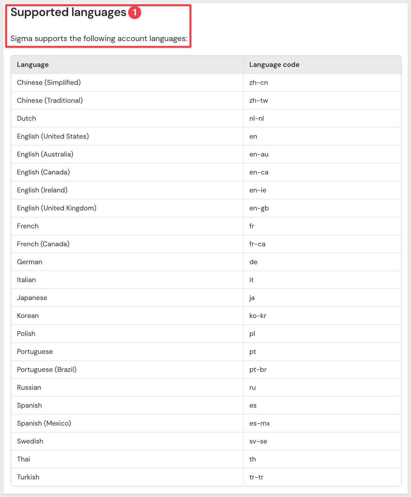
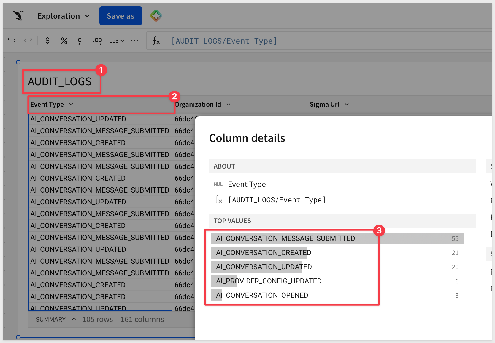
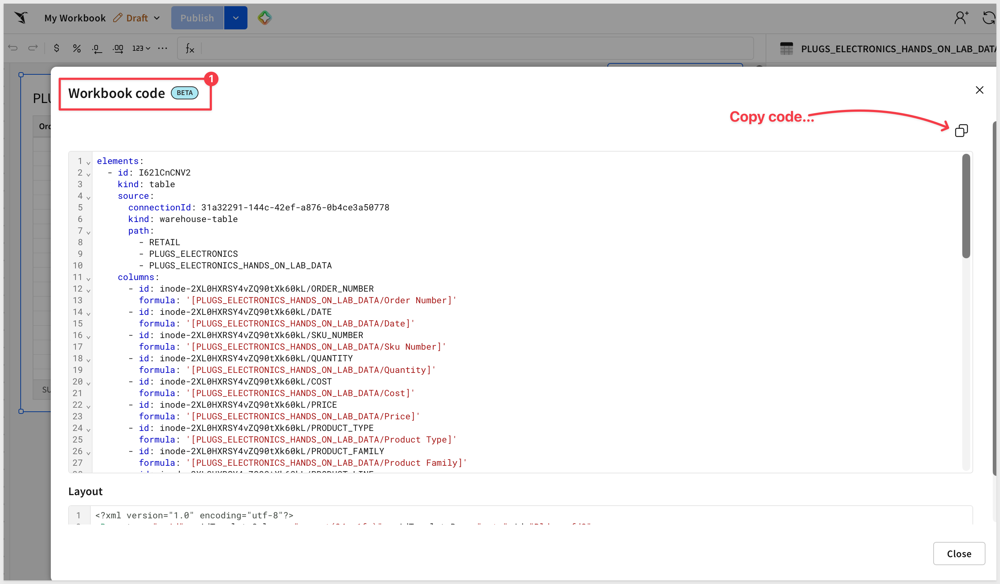

author: pballai
id: 09_2026_first_friday_features
summary: Summarizes new features, updates, and bug fixes released across Sigma in September 2026, with links to the relevant documentation for each.
categories: firstfridayfeatures
environments: web
status: Published
feedback link: https://github.com/sigmacomputing/sigmaquickstarts/issues
tags: first_friday_features
lastUpdated: 2026-10-02

# (09-2026) September
<!-- The above name is what appears on the website and is searchable. 

September 4, 2026 changes: done
September 11, 2026 changes: done
September 18, 2026 changes: done
September 25, 2026 changes: done
October 2, 2026 changes (final Sept days): done

Publish on October 2

 
-->

## Overview 
Duration: 5 

This QuickStart lists all the new and public beta features released, as well as bugs fixed in September 2026.

It is summary in nature, and you should refer to the specific Sigma documentation links provided for more information.

**Public beta features will carry the section text "Beta".**

All other features are considered released (**GA** or generally available).

Sigma actually has feature and bug fix releases weekly, and high-priority bug fixes on demand. We felt it was best to keep these QuickStarts to a summary of the previous month for your convenience.

New first Friday features QuickStarts will be published on the first Friday of each month, and will include information for the previous month.

### Subscribe to What's New in Sigma
For those wanting to see what Sigma is doing on each week, release notes are now also available on the [Sigma Community site](https://community.sigmacomputing.com/). There, you can **opt in to receive notifications about future release notes** in order to stay on top of everything new happening at Sigma. You can also subscribe to automated updates in any Slack channel using the Sigma Community release notes RSS feed. 

For more information on how to subscribe to release note notifications, see [About the release notes](https://community.sigmacomputing.com/t/about-the-release-notes-category/5517) 

<aside class="positive">
<strong>IMPORTANT:</strong>  Some screens in Sigma may appear slightly different from those shown in QuickStarts. This is because Sigma continuously adds and enhances functionality. Rest assured, Sigma’s intuitive interface ensures that any differences will not prevent you from successfully completing any QuickStart.
</aside>

For more information on Sigma's product release strategy, see [Sigma product releases](https://help.sigmacomputing.com/docs/sigma-product-releases)

If something is not working as you expect, here's how to [contact Sigma support](https://help.sigmacomputing.com/docs/sigma-support)

<!-- END OF SECTION-->

## Administration
Duration: 20

### Additional account languages available (GA) 
Sixteen new languages are now available for the organization account language setting, including additional Chinese, Dutch, French, German, Italian, Japanese, Korean, Polish, Portuguese, Russian, Spanish, Swedish, Thai, and Turkish variants.

**WHY IT MATTERS:** 
Global rollouts often stall on a single unsupported language for one region's team. Broader language coverage removes that as a blocker for multinational deployments, letting more of an organization work in Sigma in the language they're most comfortable with.

 

For more information, see [Set organization language and formatting region](https://help.sigmacomputing.com/docs/manage-organization-language#supported-languages)

### Audit log events for AI conversations (GA)
The Sigma Audit Logs connection now includes an `AI_CONVERSATIONS` event category that records events related to AI interactions when chat history is enabled.

For more information, see [Audit log events and metadata](https://help.sigmacomputing.com/docs/audit-log-events-and-metadata)

### Audit log events for AI settings (GA)
The Sigma Audit Logs connection now includes an `AI_SETTINGS` event category that records events related to AI provider and source configuration.

For more information, see [Audit log events and metadata](https://help.sigmacomputing.com/docs/audit-log-events-and-metadata)

### Connect multiple Sigma organizations to one Slack workspace (GA)
Multiple Sigma organizations can now connect to the same Slack workspace.

For more information, see [Manage Slack integration](https://help.sigmacomputing.com/docs/manage-slack-integration)

### Query variables support for Cortex Agents (Beta)
Row-level security from row access policies is now enforced when using Snowflake Cortex Agents, via immutable session attributes on configured query variables.

For more information, see [Specify query variables for a Snowflake connection (Beta)](https://help.sigmacomputing.com/docs/specify-query-variables-for-a-snowflake-connection)

### Restrict Can contribute access to specific version tags (GA)
Users granted `Can contribute` access to a folder can now be limited to specific version tags instead of all versions and documents.

For more information, see [Restrict access to a folder using a version tag](https://help.sigmacomputing.com/docs/share-a-folder#restrict-access-to-a-folder-using-a-version-tag)

### Select Microsoft integration permission levels (Beta)
Administrators can now choose between write-only and read/write access when setting up a Microsoft integration.

For more information, see [Manage Microsoft integration](https://help.sigmacomputing.com/docs/manage-microsoft-integration#permission-levels-beta)

### View the code representation of a document (Beta)
The code representation of a workbook, data model, or report can now be viewed directly in the Sigma UI from the document menu's `File` > `View code...` option.

There is a QuickStart: [Manage Sigma Workbooks as Code with Git and CI/CD](https://quickstarts.sigmacomputing.com/guide/developers_workbooks_as_code/index.html?index=..%2F..index#0)

For more information, see [Manage data models as code](https://help.sigmacomputing.com/docs/manage-data-models-as-code), [Manage workbooks as code (Beta)](https://help.sigmacomputing.com/docs/manage-workbooks-as-code), and [Manage reports as code (Beta)](https://help.sigmacomputing.com/docs/manage-reports-as-code)

<!-- END OF SECTION-->

## AI
Duration: 20

### Assistant in build mode: cohort retention tables (GA)
Sigma Assistant in build mode can now generate styled cohort retention pivot tables, with automatic heatmap styling to help identify retention patterns.

For more information, see [Use Sigma Assistant to build dashboards and apps](https://help.sigmacomputing.com/docs/use-ai-to-build-dashboards-and-apps)

### Assistant in build mode: pivot table styling (GA)
Sigma Assistant in build mode now applies automatic heatmap and matrix styling to pivot tables based on the type of measure.

For more information, see [Use Sigma Assistant to build dashboards and apps](https://help.sigmacomputing.com/docs/use-ai-to-build-dashboards-and-apps)

### Assistant in build mode: reuse data model metrics (GA)
Sigma Assistant in build mode now preserves data model sources and reuses their governed metrics instead of recreating underlying tables and calculations, so KPIs and charts it builds use existing metric definitions.

For more information, see [Use Sigma Assistant to build dashboards and apps](https://help.sigmacomputing.com/docs/use-ai-to-build-dashboards-and-apps)

### Build workbooks and analyze data in ChatGPT using the Sigma plugin (GA) 
The Sigma plugin for ChatGPT can now create and share Sigma workbooks directly from a natural-language analysis, in addition to searching, exploring, and analyzing data.

**WHY IT MATTERS:** 
July's launch of the ChatGPT plugin let users query Sigma data from a conversation. This extends that same conversation into a governed, shareable workbook — the analysis doesn't have to stay locked in a chat transcript to be useful to the rest of a team.

For more information, see [Use the Sigma plugin for AI assistants](https://help.sigmacomputing.com/docs/use-the-sigma-plugin-for-ai-assistants)

### Call Sigma agents from the Sigma MCP server (GA)
Two new tools available exclusively in the Sigma MCP server let users list the agents they can access and call an agent from any connected AI tool.

There is a QuickStart: [Agents 06: Connect a Sigma Agent to GitHub with MCP Tools](https://quickstarts.sigmacomputing.com/guide/agents_06_mcp_tools/index.html?index=..%2F..index#0)

For more information, see [Use the Sigma MCP server](https://help.sigmacomputing.com/docs/use-sigma-mcp-server)

### Chat history for Assistant and agents (GA) 
Chat history is now available for conversations with Sigma Assistant, warehouse agents, and Sigma agents, letting users revisit previous conversations. Admins can configure storage and retention for organizations that meet certain conditions, including a choice between Sigma-owned bucket storage or a customer-owned bucket via external storage integrations.

**WHY IT MATTERS:** 
Without persistence, every AI conversation starts from zero, limiting it to a single-turn interaction. Chat history now covers Assistant, warehouse agents, and Sigma agents alike, carrying context across sessions and giving compliance-minded organizations one consistent retention story instead of three separate ones — including the option to keep that data in storage they control.

There is a QuickStart: [Agents 03: Giving Agents Memory](https://quickstarts.sigmacomputing.com/guide/agents_03_agent_memory/index.html?index=..%2F..index#0)

For more information, see [Configure chat history](https://help.sigmacomputing.com/docs/configure-chat-history) and [Chat with Sigma agents](https://help.sigmacomputing.com/docs/chat-with-agent)

### Improved Sigma Assistant (GA) 
Sigma Assistant has improved reasoning, faster performance, and higher-quality responses, including clarifying questions, more flexible data source access, visible reasoning, and the ability to export a conversation.

**WHY IT MATTERS:** 
Conversation export and visible reasoning turn Assistant's output into something a reader can verify and hand off, rather than a black-box answer you either trust or don't. Paired with faster, higher-quality responses, this closes the gap between "an AI answer" and something you'd actually put in front of a stakeholder.

For more information, see [Ask natural language queries with Sigma Assistant](https://help.sigmacomputing.com/docs/ask-natural-language-queries-with-assistant)

### MCP connectors for Sigma agents (GA) 
Admins can add MCP servers as connectors, enabling Sigma agents to retrieve context, fetch data, and perform actions in third-party tools.

**WHY IT MATTERS:** 
An agent is only as useful as what it can reach. MCP connectors let an agent pull in and act on whatever third-party tools an organization already runs, governed the same way as every other connector in Sigma, instead of being limited to data already sitting in the warehouse.

For more information, see [Configure MCP connectors](https://help.sigmacomputing.com/docs/configure-mcp-connectors)

### Migrate to Sigma with an AI assistant (Beta) 
Migration skills for Sigma let an AI assistant rebuild source content — the dashboards, reports, and data models in another BI tool — as a Sigma document.

**WHY IT MATTERS:** 
This is the same AI-driven migration pattern behind the Migration QuickStarts family — Sigma now documents and supports it directly instead of leaving it as an unofficial pattern. It gives prospects and partners a sanctioned starting point for moving dashboards, reports, and data models off another BI tool without a full manual rebuild.

There are vendor-specific QuickStarts: [Migration category](https://quickstarts.sigmacomputing.com/?cat=migrations)

For more information, see [Migrate to Sigma with an AI assistant](https://help.sigmacomputing.com/docs/migrate-to-sigma-with-an-ai-assistant)

### New models used for AI providers (GA)
LLM model updates across providers: OpenAI now uses GPT 5.6, Databricks uses Claude Sonnet 5, and Anthropic uses Claude Sonnet 5.

For more information, see [Supported AI models](https://help.sigmacomputing.com/docs/supported-ai-models)

### New skills for creating workbooks and reports with an AI assistant (GA)
The `sigma-workbooks` and `sigma-reports` agent skills give AI assistants reference materials and instructions for authoring the code representation of a workbook or report.

For more information, see [Install skills for AI assistants](https://help.sigmacomputing.com/docs/install-skills-for-ai-assistants)

### Sigma agents (GA) 
Sigma agents are now generally available. Build an agent using instructions, data sources, actions, warehouse agents, search services, and MCP connectors, then chat with it, schedule automated runs, or call it via the REST API or MCP server. Chat history resumption, task approval, and embedding are all supported, and admins can review token usage, owners, data sources, access grants, feedback, and execution logs.

**WHY IT MATTERS:** 
This is the full agent platform landing at once — build, govern, call, and embed, with the same admin oversight (token usage, access grants, execution logs) expected of anything else running in Sigma. Agents aren't a bolted-on chat feature anymore; they're an audited, first-class part of the platform, reachable from a workbook, the REST API, or an MCP server.

There are eight QuickStarts on Agents: [Agent category](https://quickstarts.sigmacomputing.com/?cat=agents)

For more information, see [Build agents](https://help.sigmacomputing.com/docs/build-agents), [Chat with agents](https://help.sigmacomputing.com/docs/chat-with-agent), [Create actions that interact with agents](https://help.sigmacomputing.com/docs/create-actions-that-interact-with-agents), [Call agents with the API](https://help.sigmacomputing.com/docs/call-agents-with-the-api), [Embed an agent chat interface](https://help.sigmacomputing.com/docs/embed-agent), [Example use cases](https://help.sigmacomputing.com/docs/example-agent-implementations), [Manage agents](https://help.sigmacomputing.com/docs/manage-agents-for-your-organization), [Build evaluation suite](https://help.sigmacomputing.com/docs/build-agent-evaluation-suite), and [About Sigma agents](https://help.sigmacomputing.com/docs/sigma-agents)

### Sigma Assistant in the workbook (GA) 
Sigma Assistant in the workbook is now generally available. Natural-language prompts support data exploration, insight analysis, and dashboard or app creation, running on a code-first architecture with broader element support (maps, combo charts, navigation, drawers, single row containers), in-chat chart formatting, and improved design defaults.

**WHY IT MATTERS:** 
A code-first architecture means Assistant's output in the workbook is something you can read and understand, not just trust blindly. Combined with broader element coverage and in-chat chart formatting, Assistant now builds and edits more of what a workbook actually needs, instead of a narrow slice of chart types.

For more information, see [Use Sigma Assistant to explore and analyze workbook data](https://help.sigmacomputing.com/docs/sigma-assistant-in-the-workbook) and [Use Sigma Assistant to build dashboards and apps](https://help.sigmacomputing.com/docs/use-ai-to-build-dashboards-and-apps)

### Use warehouse agents with Assistant and agents (GA) 
Sigma Assistant and Sigma agents can now use Snowflake Cortex Agents or Databricks Genie Agents as tools, bringing warehouse-native agent capabilities directly into Sigma.

**WHY IT MATTERS:** 
This isn't Sigma building a competing warehouse agent — it's Sigma's AI layer calling out to whatever agent ecosystem you've already invested in on Snowflake or Databricks, and folding the result back into a governed Sigma conversation. You get one consistent interface over both Sigma-native and warehouse-native AI, instead of switching tools depending on which agent has the answer.

For more information, see [Use warehouse agents with Sigma](https://help.sigmacomputing.com/docs/use-warehouse-agents-sigma)

<!-- END OF SECTION-->

## API
Duration: 20

### Databricks connection endpoint additions (GA)
Databricks connection endpoints now include `enableHiveMetastore`, `usePython`, and `pythonComputeClusterId` fields for programmatic configuration.

For more information, see [Get connection details](https://help.sigmacomputing.com/reference/get-connection), [List connections](https://help.sigmacomputing.com/reference/list-connections), [Create a connection](https://help.sigmacomputing.com/reference/create-connection), and [Update a connection](https://help.sigmacomputing.com/reference/update-connection)

### Impersonate a user in API calls (GA) 
A user assigned the Admin account type can impersonate other users in API calls — for example, to retrieve and display the contents of their Documents folder in embedded content.

**WHY IT MATTERS:** 
Embedded experiences often need to act on behalf of the end user rather than a shared service account. Admin-level impersonation makes that possible without provisioning and managing a credential for every embedded user.

For more information, see [Impersonate users](https://help.sigmacomputing.com/docs/impersonate-users#impersonate-users-for-api-calls)

### Manage workbooks from a code representation (Beta)
The Sigma API can now retrieve, update, and create workbooks based on a JSON or YAML representation.

For more information, see [Manage workbooks as code (Beta)](https://help.sigmacomputing.com/docs/manage-workbooks-as-code) and [Workbook representation example library](https://help.sigmacomputing.com/docs/workbook-representation-example-library)

### New account type permissions update endpoint (GA)
Account type permissions can now be updated via a new endpoint to control feature access, with the response including license type.

For more information, see [Update account type permissions](https://help.sigmacomputing.com/reference/update-account-type-permissions)

### New AI provider configuration endpoint (GA)
A new endpoint configures an organization's AI provider programmatically.

For more information, see [Configure the organization's AI provider](https://help.sigmacomputing.com/reference/create-ai-config)

### New API credentials listing endpoint (GA)
A new endpoint lists API credentials, returning client ID, owner ID, and scopes, with the client secret excluded from the response.

For more information, see [List API credentials](https://help.sigmacomputing.com/reference/list-credentials)

### New API endpoints for managing AI chat history settings (Beta)
Two new endpoints get and update an organization's AI chat history settings.

For more information, see [Get the chat history settings](https://help.sigmacomputing.com/reference/get-ai-chat-history-setting) and [Update the chat history settings](https://help.sigmacomputing.com/reference/update-ai-chat-history-setting)

### New API endpoints to manage audit logging for an organization (GA)
Two new endpoints support getting and updating an organization's audit logging setting.

For more information, see [Get the audit logging setting for an organization](https://help.sigmacomputing.com/reference/get-audit-logging-setting) and [Enable or disable audit logging for an organization](https://help.sigmacomputing.com/reference/update-audit-logging-setting)

### New API endpoints to manage CSV upload settings (GA)
Two new endpoints support getting and updating an organization's CSV upload settings.

For more information, see [Get the CSV upload settings](https://help.sigmacomputing.com/reference/get-csv-upload-settings) and [Update the CSV upload settings](https://help.sigmacomputing.com/reference/update-csv-upload-settings)

### New API endpoints to manage email branding (GA)
Three new endpoints get, update, and reset an organization's email branding settings.

For more information, see [Get the email branding settings for an organization](https://help.sigmacomputing.com/reference/get-email-branding-setting), [Update the email branding settings for an organization](https://help.sigmacomputing.com/reference/update-email-branding-setting), and [Reset the email branding settings for an organization](https://help.sigmacomputing.com/reference/delete-email-branding-setting)

### New comment settings management endpoints (GA)
Two new endpoints get and update an organization's comment settings, controlling commenting and image annotation functionality.

For more information, see [Get comment settings](https://help.sigmacomputing.com/reference/get-comments-settings) and [Update comment settings](https://help.sigmacomputing.com/reference/update-comments-settings)

### New option for the List datasets endpoint (GA)
The List datasets endpoint can now filter results to datasets owned by a specific user using `ownerId`.

For more information, see [List datasets](https://help.sigmacomputing.com/reference/list-datasets)

### New options for some workbook endpoints (GA)
The `tags` array returned by workbook endpoints now includes an `isArchived` option to indicate inactive workbook tags.

For more information, see [List workbooks](https://help.sigmacomputing.com/reference/list-workbooks), [Get a workbook](https://help.sigmacomputing.com/reference/get-workbook), and [Get tags for a workbook](https://help.sigmacomputing.com/reference/get-workbook-tags)

### New options for the Create a deployment policy endpoint (GA)
A new `useDependenciesWorkspace` option specifies a separate workspace for deploying dependent documents.

For more information, see [Create a deployment policy](https://help.sigmacomputing.com/reference/create-deployment) and [How dependencies are deployed](https://help.sigmacomputing.com/docs/deploy-content-to-tenant-organizations#how-dependencies-are-deployed)

### New options for the List workbooks endpoint (GA)
A new `includeTaggedSourceUrlId` query parameter identifies source documents for deployed version-tagged workbooks.

For more information, see [List workbooks](https://help.sigmacomputing.com/reference/list-workbooks)

### New sample connection management endpoints (GA)
Two new endpoints get and update an organization's sample connection settings.

For more information, see [Get sample connection settings](https://help.sigmacomputing.com/reference/get-sample-connection-settings) and [Update sample connection settings](https://help.sigmacomputing.com/reference/update-sample-connection-settings)

### New team admins management endpoint (GA)
A new endpoint updates the administrators assigned to a team.

For more information, see [Update team admins](https://help.sigmacomputing.com/reference/update-team-admins)

### New timezone management endpoints (GA)
Two new endpoints get and update an organization's timezone configuration.

For more information, see [Get timezone setting](https://help.sigmacomputing.com/reference/get-timezone-setting) and [Update timezone setting](https://help.sigmacomputing.com/reference/update-timezone-setting)

### New user attribute update endpoints (GA)
A user attribute's name, description, or default value can now be updated via a new endpoint.

For more information, see [Update a user attribute](https://help.sigmacomputing.com/reference/update-user-attribute)

### Represent CSV tables in the code representation of a data model (GA)
CSV source tables can now be represented when reading and updating a data model's code representation.

For more information, see [Manage data models as code](https://help.sigmacomputing.com/docs/manage-data-models-as-code#limitations) and [Example: representing a data model with a CSV table](https://help.sigmacomputing.com/docs/example-representation-data-model-with-a-csv-table)

### Request and grant access to API connectors (GA)
Users can now view all API connectors in their organization and request access to specific ones, with admins or users with appropriate permissions able to approve or deny requests.

For more information, see [Manage API credential and connection access](https://help.sigmacomputing.com/docs/manage-api-credential-and-connection-access)

### Sending and scheduling exports using the API on behalf of another user (Deprecated)
The `sendAsUser` option on the send-export endpoint and the `ownerId` option for scheduling are deprecated in favor of token-based impersonation.

For more information, see [Impersonate users to send and schedule exports](https://help.sigmacomputing.com/docs/impersonate-users#impersonate-users-to-send-and-schedule-exports)

### Tag endpoint enhancements (GA)
The Update a tag endpoint now supports updating version tag descriptions and colors.

For more information, see [Update a tag](https://help.sigmacomputing.com/reference/update-version-tag)

<!-- END OF SECTION-->

## Bug Fixes
Duration: 20

**1:** The Update a data model from a code representation endpoint now validates that the `documentVersion` field matches the most recent version before updating.

**2:** Users with the `Manage users` permission can now invite guest users.

**3:** Document deployment now respects existing team and user attributes for column-level security enforcement across tenant organizations.

**4:** Failed materializations blocked by in-progress operations now display as skipped rather than failed.

**5:** Improved performance when editing large input tables.

**6:** MCP tools used by Sigma agents have been renamed MCP connectors.

**7:** Templates shared with an entire organization using `Share with everyone in your organization` now appear in the `Shared with you` template gallery.

**8:** Users can now swap tables, schemas, and databases/catalogs when tagging a document version without `Can use` access to the entire connection.

**9:** Fixed an error that prevented setting up Azure OpenAI as an AI provider with certain temperature values.

**10:** Version-tagging or swapping sources on workbooks with broken connections now returns clear error messaging instead of a generic failure.

**11:** Fixed the List workbooks for a tag endpoint returning no results for non-admin users with access only to tagged versions.

**12:** Fixed a 400 error occurring in conversations with Claude Sonnet 5 as the reasoning model after a dozen or more messages.

**13:** Fixed agent calls failing during automated actions when using OpenAI GPT-5.4 or GPT-5.1 models.

**14:** Any user with edit access to a dataset can now migrate it to a data model.

**15:** Resolved an error preventing Properties tab selection after switching editor panel tabs.

**16:** Corrected OpenAI external provider configuration to expect GPT 5.4 instead of GPT 4.0.

**17:** Agent automated actions now retry on incomplete or incorrect responses and preserve null value types for downstream action compatibility.

**18:** Fixed Azure OpenAI agent and Assistant chats terminating prematurely with response cutoff errors.

<!-- END OF SECTION-->

## Data Modeling
Duration: 20

### Choose related datasets when migrating a dataset to a data model (GA)
Migrating a dataset to a data model now lets you select which related datasets to combine, rather than automatically pulling in every linked, joined, or referenced dataset.

For more information, see [Migrate a dataset to a data model](https://help.sigmacomputing.com/docs/migrate-a-dataset-to-a-data-model)

### Revert migrated dataset references (GA)
After migrating datasets to data models, references can now be reverted to use the original datasets again, for troubleshooting or testing an alternative migration approach.

For more information, see [Migrate a dataset to a data model](https://help.sigmacomputing.com/docs/migrate-a-dataset-to-a-data-model)

<!-- END OF SECTION-->

## Embedding
Duration: 20

### Embed Sigma Assistant (Deprecated)
Embedding Sigma Assistant as a standalone experience is deprecated and will reach end of support on March 16, 2027. Consider embedding a customized Sigma agent, or Sigma Assistant in the workbook, instead.

There is a QuickStart: [Embedding 08: Embedding Sigma Assistant](https://quickstarts.sigmacomputing.com/guide/embedding_08_ask_sigma_v3/index.html?index=..%2F..index#0)

For more information, see [Embed Sigma Assistant](https://help.sigmacomputing.com/docs/embed-assistant)

Also see: [REST API Usage 12: Call Sigma Agents from Your Application](https://quickstarts.sigmacomputing.com/guide/embedding_rest_api_useage_12_calling_agents/index.html)

<!-- END OF SECTION-->

## Functions / Calculations
Duration: 20

### Match on null values when performing a lookup (GA)
Lookups now support a `Match null values` option so rows with a null join key on both sides can match, using the new `LookupMatchNulls` function.

For more information, see [LookupMatchNulls](https://help.sigmacomputing.com/docs/lookupmatchnulls) and [Add columns through lookup](https://help.sigmacomputing.com/docs/add-columns-through-lookup)

### TextJoin function (GA)
The `TextJoin` function joins multiple strings of text using a common delimiter.

For more information, see [Textjoin](https://help.sigmacomputing.com/docs/textjoin)

<!-- END OF SECTION-->

## New QuickStarts in September
Duration: 20

### Agents
September also introduces a new Agents category — an 8-part series building up a Sigma agent from a single grounded answer through actions, memory, scheduling, custom tools, and warehouse-native AI.

* [Agents 01: Building Your First Sigma Agent](https://quickstarts.sigmacomputing.com/guide/agents_01_building_your_first_agent/index.html)
* [Agents 02: Agent-Driven Actions & Writeback](https://quickstarts.sigmacomputing.com/guide/agents_02_actions_writeback/index.html)
* [Agents 03: Giving Agents Memory](https://quickstarts.sigmacomputing.com/guide/agents_03_agent_memory/index.html)
* [Agents 04: Scheduling Unattended Agent Runs](https://quickstarts.sigmacomputing.com/guide/agents_04_scheduling_agents/index.html)
* [Agents 05: Build Web Search for a Sigma Agent](https://quickstarts.sigmacomputing.com/guide/agents_05_api_actions/index.html)
* [Agents 06: Connect a Sigma Agent to GitHub with MCP Tools](https://quickstarts.sigmacomputing.com/guide/agents_06_mcp_tools/index.html)
* [Agents 07: Running Python from an Agent](https://quickstarts.sigmacomputing.com/guide/agents_07_python_from_agent/index.html)
* [Agents 08: Give Your Sigma Agent a Snowflake Cortex Specialist](https://quickstarts.sigmacomputing.com/guide/agents_08_warehouse_experts/index.html)

### Manage Sigma Workbooks as Code with Git and CI/CD
[This QuickStart](https://quickstarts.sigmacomputing.com/guide/developers_workbooks_as_code/index.html) shows how to define a Sigma workbook as a single YAML file and move it through the same git-based review, validation, and CI/CD pipeline as the rest of your application code.

### REST API Usage 12: Call Sigma Agents from Your Application
[This QuickStart](https://quickstarts.sigmacomputing.com/guide/embedding_rest_api_useage_12_calling_agents/index.html) shows how to call a Sigma agent directly over the REST API — from your own chat interface, a scheduled job, or another application — while inheriting the same governance and permissions configured in the workbook.

<!-- END OF SECTION-->

## Templates
Duration: 20

### App templates (GA)
App templates let you start building an app in Sigma from an interactive preview before adding it to your organization as a workbook, with ten templates available including Project Management and Revenue Forecasting.

There are QuickStarts for Templates: [Templates category](https://quickstarts.sigmacomputing.com/?cat=apptemplates)

For more information, see [Get started with templates](https://help.sigmacomputing.com/docs/get-started-with-templates)

<!-- END OF SECTION-->

## Workbooks
Duration: 20

### Apply translations in workbook or report export attachments (Beta)
After adding translations to a workbook or report, one of those translations can now be applied when exporting content.

For more information, see [Apply translations in workbook or report export attachments (Beta)](https://help.sigmacomputing.com/docs/manage-workbook-localization#apply-translations-in-workbook-or-report-export-attachments-beta)

### Databricks support for stored procedure actions (GA)
Creating actions that call stored procedures is now supported for Databricks connections.

### Date support for slider and range slider controls (GA)
Slider and range slider controls now support both Date and Number value types.

For more information, see [Slider](https://help.sigmacomputing.com/docs/intro-to-control-elements#slider), [Range slider](https://help.sigmacomputing.com/docs/intro-to-control-elements#range-slider), and [Intro to control elements](https://help.sigmacomputing.com/docs/intro-to-control-elements)

### Drawers (GA) 
Drawers — side panels that slide in to overlay workbook content temporarily — are now generally available.

**WHY IT MATTERS:** 
Builders have long had to choose between cluttering a page with detail or sending readers elsewhere to see it. Drawers give you a place to put that detail — instructions, drill-downs, forms — that slides in on demand and out of the way otherwise, without breaking up the main layout. Now that it's GA, it's ready for production workbooks rather than just evaluation.

<video src="assets/drawers2.mp4"></video>

For more information, see [Use drawers to manage complex workflows](https://help.sigmacomputing.com/docs/use-drawers-to-manage-complex-workflows)

### Export reports in PowerPoint format (GA)
Reports can now be exported and downloaded as PowerPoint (.pptx) files.

For more information, see [Share and export reports](https://help.sigmacomputing.com/docs/share-and-export-reports)

### Export specific report pages (GA)
Users can now select one or more specific report pages to export, instead of exporting the entire report.

For more information, see [Share and export reports](https://help.sigmacomputing.com/docs/share-and-export-reports)

### Manage reports from a code representation (Beta)
The Sigma API can now retrieve, update, and create reports based on a JSON or YAML representation.

For more information, see [Manage reports as code (Beta)](https://help.sigmacomputing.com/docs/manage-reports-as-code) and [Report representation example library](https://help.sigmacomputing.com/docs/report-representation-example-library)

There is a QuickStart: [Manage Sigma Workbooks as Code with Git and CI/CD](https://quickstarts.sigmacomputing.com/guide/developers_workbooks_as_code/index.html?index=..%2F..index#0)

### Manually trigger an AI column or cell run (Beta)
AI columns can now be configured with a `Don't run automatically` option, so they only run when manually prompted instead of on every change.

For more information, see [Create AI columns (Beta)](https://help.sigmacomputing.com/docs/create-ai-columns)

<!-- END OF SECTION-->

## Additional Information
Duration: 20

**Additional Resource Links**

[Blog](https://www.sigmacomputing.com/blog/) 
[Community](https://community.sigmacomputing.com/) 
[Help Center](https://help.sigmacomputing.com/hc/en-us) 
[QuickStarts](https://quickstarts.sigmacomputing.com/) 
 

<button>[Sigma Free Trial](https://www.sigmacomputing.com/free-trial/)</button>

&emsp;
&emsp;

<!-- END OF SECTION-->
