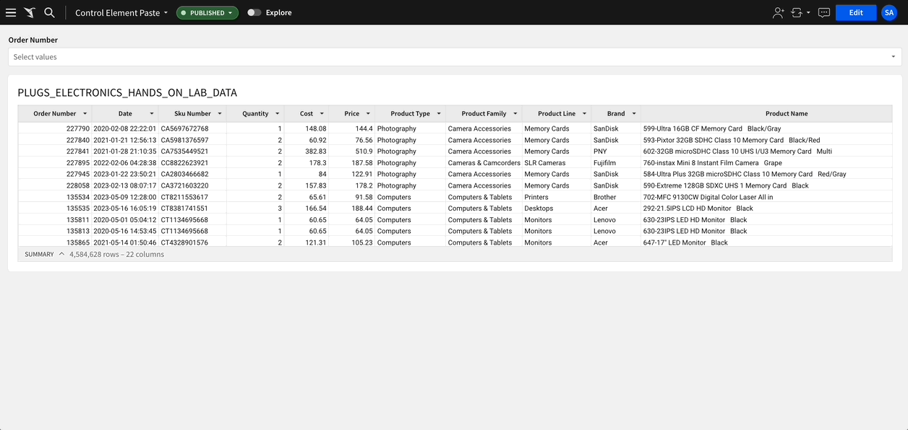
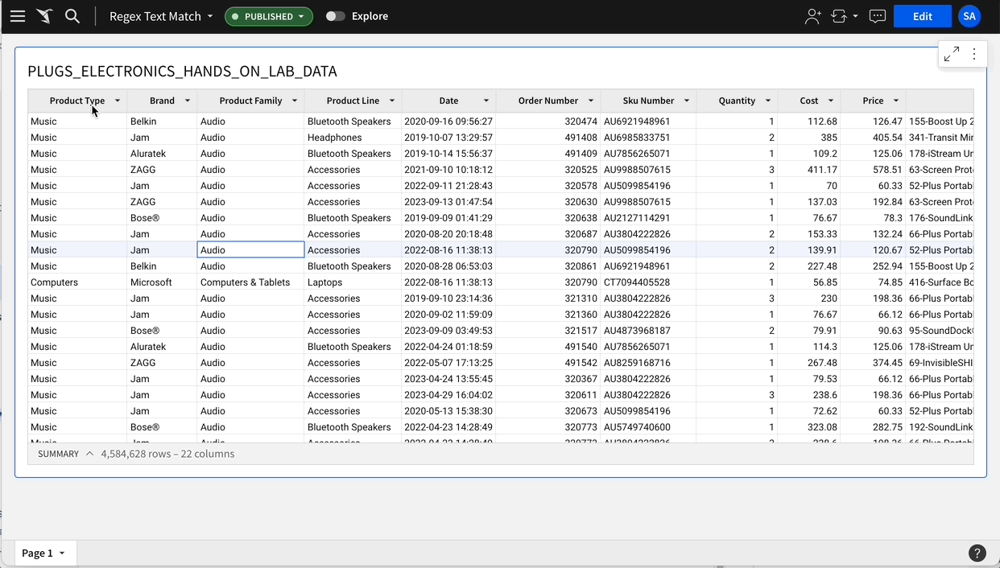
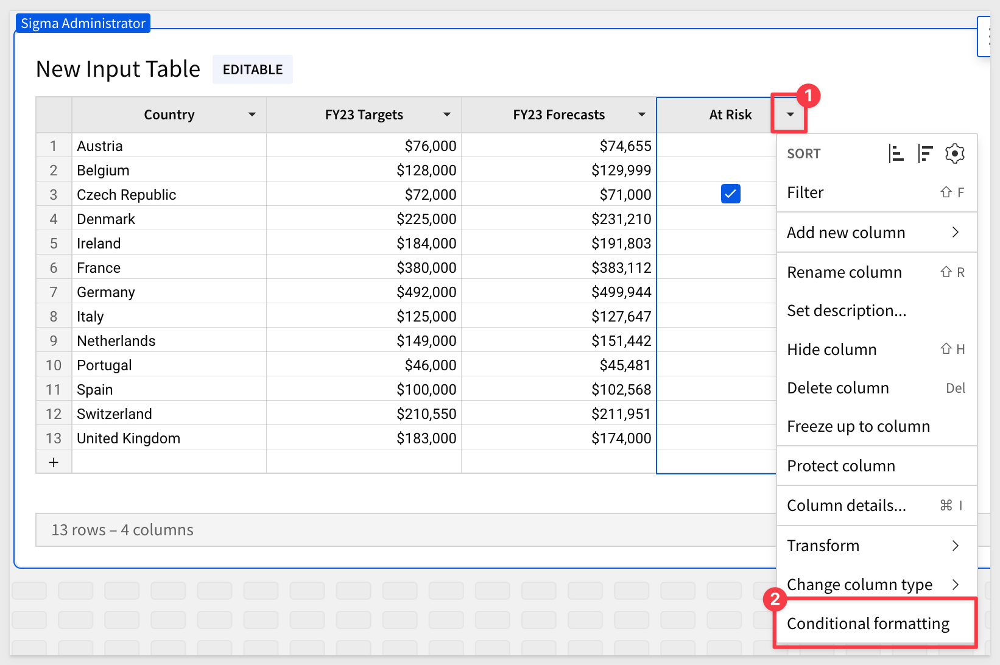
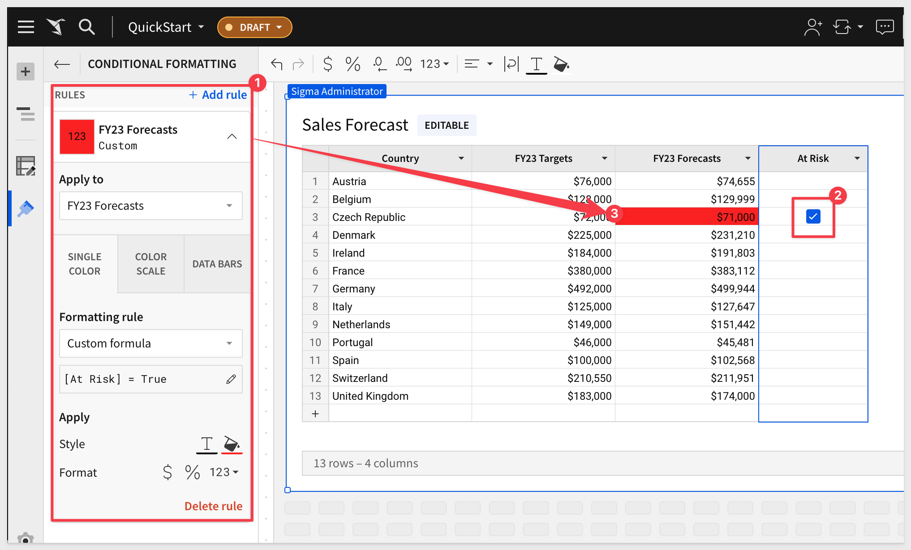
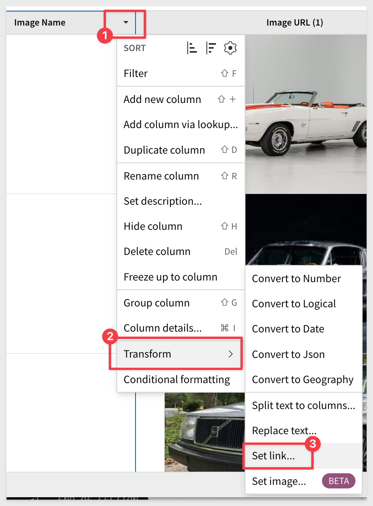
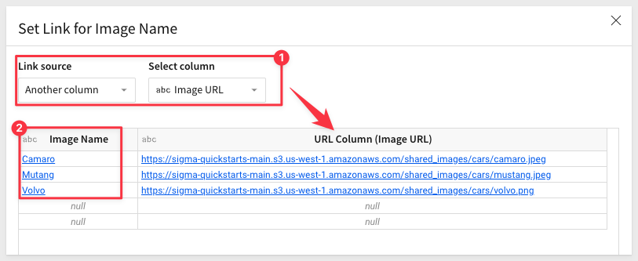
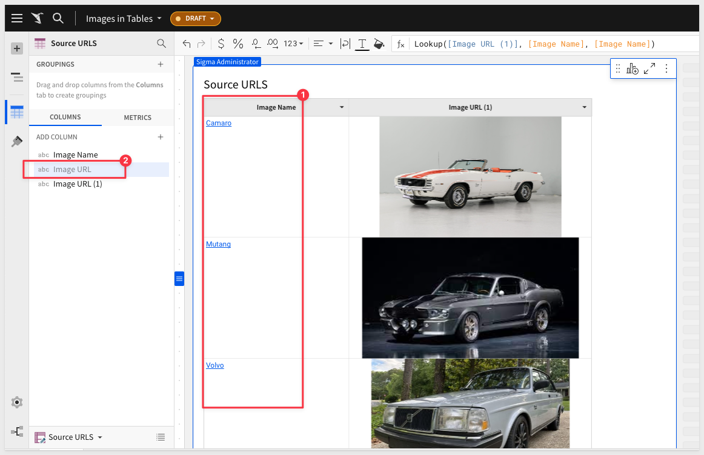
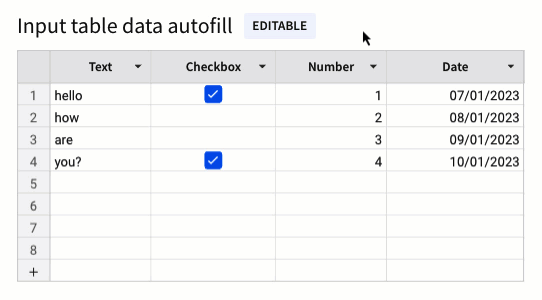

author: pballai
id: 10_2023_first_friday_features
summary: 10_2023_first_friday_features
categories: Administration
environments: web
status: Published
feedback link: https://github.com/sigmacomputing/sigmaquickstarts/issues
tags: first_friday_features
lastUpdated: 2023-11-08

<!-- 
10/6/23: done
10/13/23: done

<aside class="positive">
<strong>IMPORTANT:</strong>  This feature is currently in Beta and subject to quick, iterative changes. As a result, the latest product version may differ from the contents of this document.
</aside>

Stipo Josipovic: GA announcement: Drag-to-select and Autofill for Input Tables are now available for :celebrate:everyone!!:celebrate:
We’ve integrated this classic and beloved spreadsheet feature into Input Tables to make augmenting data for ad hoc analysis that much easier and fun!
With drag-to-select, you can now click and drag to select cells in input tables and level tables!
With autofill in Input Tables, cell selections will now have a fill handle: click and drag the fill handle to extend the selection and fill the new cell values based on the initial selection!
:sparkles: NEW: :sparkles: Horizontal autofill! You can now extend a selection horizontally to fill values in columns to the right of the original selection

Hao Xu: Pasting table values into filter/control is now available
Users can now copy paste cell values from excel/gsheet/sigma table into filters/controls. This solves for a big pain point users currently have where they need to first convert values into CSV and then pasting into filter which can take minutes.

 -->

# (10-2023) October
<!-- The above name is what appears on the website and is searchable. -->

## Overview 
Duration: 5 

This QuickStart lists all the new and public beta features released, as well as bugs fixed in September 2023.

It is summary in nature, and you should refer to the specific Sigma documentation links provided for more information.

**Public beta features will carry the section text "Beta".**

All other features are considered released (**GA** or generally available).

Sigma actually has feature and bug fix releases weekly, and high-priority bug fixes on demand. We felt it was best to keep these QuickStarts to a summary of the previous month for your convenience.

New QuickStarts will be published on the first Friday of each month, and will include information for the previous month.

## Administration
Duration: 20

<!-- END OF SECTION-->

## API
Duration: 10

<!-- END OF SECTION-->

## Embedding
Duration: 20

#### Bug Fixes
When swapping the source of a tagged workbook version, the `Sources` of tagged workbook dropdown now excludes connections with a different Cloud Data Warehouse or Database Management System provider as the initial source.

#### Embed sandbox URL syntax
Sigma no longer automatically adds colons (:) to separate parameters in the embed sandbox URL. 

For example, if you enter `param1=value1 param2=value2` in the `Other Parameters` field, the URL is appended with `?param1=value1&`   
`param2=value2` 

Previously, the URL would be appended with `?:param1=value1&:param2=value2`.

<!-- END OF SECTION-->

## Filters and Controls
Duration: 10

#### Tabular data in list filters and controls

List filters and controls now support input copied from tabular formats! 

You are now able to copy multiple cell values from Excel, Google Sheets, Sigma tables, etc., and paste them in the Search field. 

The input is automatically comma-delimited, enabling you to filter it as multiple distinct values.

This feature will save users lots of time when the need to search for a long list of items is required.

Suppose we want to search a 4M row table for just a list of target `Order Numbers`. Instead of using the order number filter, and picking them one at a time (really impractical), you can just paste the list into the search field and you are done!. VERY COOL time saver for sure:

<!-- END OF SECTION-->

## Functions
Duration: 20

#### Regular expression (RegExp) text match filtering:
We have added a new RegExp text match filter to enable you to filter text columns, based on specified patterns. 

These included text strings, character classes, ranges, etc. 

These filters support the RegExp syntax and behavior of the connected CDW or DBMS.

You can either match or not match:

**Matches RegExp:** Includes values that match one or more specified patterns.

**Does not match RegExp:** Excludes values that match one or more specified patterns.

For example, if you want to only see items in the `Product Line` that contain the text `TV` or `4K`:

<aside class="negative">
<strong>NOTE:</strong>  You can use the "disjunction operator (|)" to filter multiple values. For example, abc|xyz filters values that contain “abc” or “xyz.”
</aside>

<!-- END OF SECTION-->

## Input Tables
Duration: 20

#### Conditional formatting in input tables:
We have added the ability to apply rules based on specified conditions to format single colors, color scales, or data bars in input table columns. 

Conditional formatting is accessed in the  `Element` format panel, or open a `column menu` and select `Conditional formatting`:

 

#### Hyperlinks in input tables:
You can now add hyperlinks to Input Table columns. 

In the column menu, select `Transform` > `Set link`, then choose a column as the link source or create URLs with a custom formula:

Let's say that we have a table called that has the name of an image in one column, a picture and the URL to that image in another. 

We prefer not to show the ugly URLs but do want the user to be able to click on the `Image Name` to open the picture in a new browser tab, full size. 

We just have to transform the `Image Name` column to `link` and then link the `Image URL` column to it:

 

 

Now the `Image Name` column is a hyperlink and we can just hide the `Image URL column`:

 

<aside class="positive">
<strong>IMPORTANT:</strong>  You can also get URLs from another column using Sigma's Lookup feature.
</aside>

[For more information on using Lookups, click here:](https://help.sigmacomputing.com/hc/en-us/articles/4409911623571-Add-columns-through-Lookup)

#### Data autofill in input tables
Input tables (and individual columns) now support autofill, which will save users time in certain use cases.

Select a cell or range of cells, then drag the fill handle (blue box in the lower right corner of the selection) to highlight adjacent cells you want to populate. 

Sigma automatically fills the highlighted cell or range with data based on the selected values and patterns. 

For text and checkbox columns, Sigma repeats the selected cell values. 

For number and date columns, Sigma projects values to continue a patterned sequence (like consecutive numbers or incremental dates). 

If no pattern is detected, it repeats the selected cell values.

<!-- END OF SECTION-->

## New QuickStarts in October
Duration: 20

[Implementing Row Level Security](https://quickstarts.sigmacomputing.com/guide/security_row_level_security/index.html?index=..%2F..index#0):

This QuickStart provides insight into the different methods available for content creators to limit data access to a user, based on an implementation of row level security (RLS) in Sigma.

<!-- END OF SECTION-->

## Tables / Pivots
Duration: 20

<!-- END OF SECTION-->

## Version Tagging
Duration: 20

<!-- END OF SECTION-->

## Visualizations
Duration: 20

<!-- END OF SECTION-->

## Workbooks
Duration: 20

#### Classic layout feature sunset
While not techically a new feature, we want to make you are aware that as part of Sigma’s plan to sunset the classic workbook layout and transition to exclusive use of the newer grid layout, the `Revert to Classic Layout` option has been removed from `Workbook` settings > `Layout` settings. For more information about this update, [see the Sigma Community post.](https://community.sigmacomputing.com/t/goodbye-to-classic-layout-and-embrace-grid-layout/2631)

<!-- END OF SECTION-->

## Additional Information
Duration: 20

**Additional Resource Links**

[Blog](https://www.sigmacomputing.com/blog/) 
[Community](https://community.sigmacomputing.com/) 
[Help Center](https://help.sigmacomputing.com/hc/en-us) 
[QuickStarts](https://quickstarts.sigmacomputing.com/) 
 

&emsp;

<!-- END OF WHAT WE COVERED -->
<!-- END OF QUICKSTART -->
