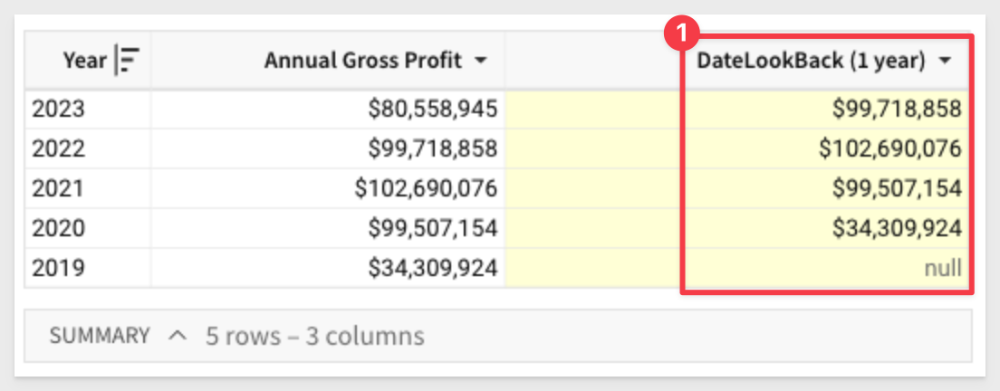
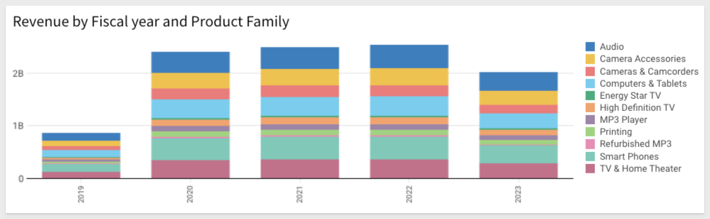
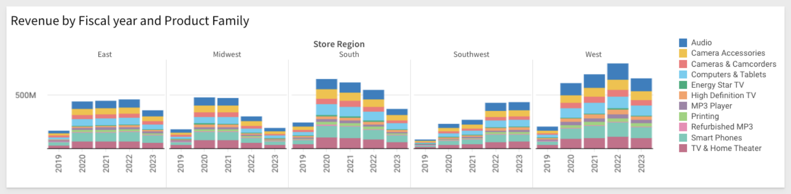
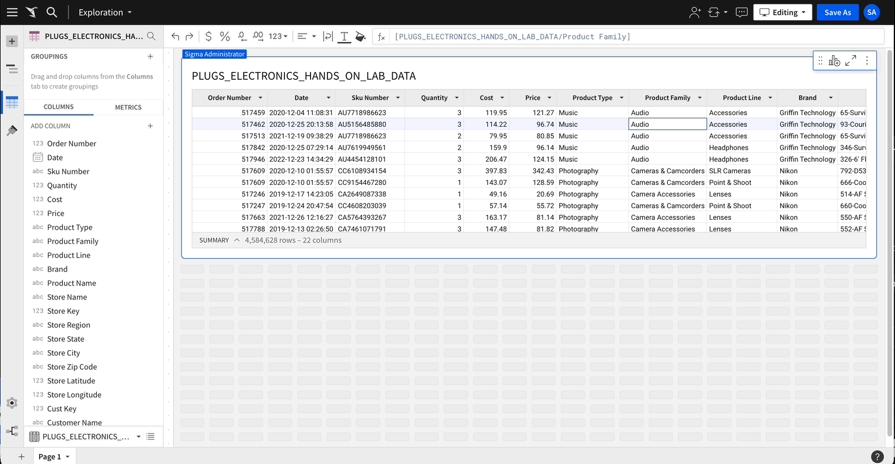
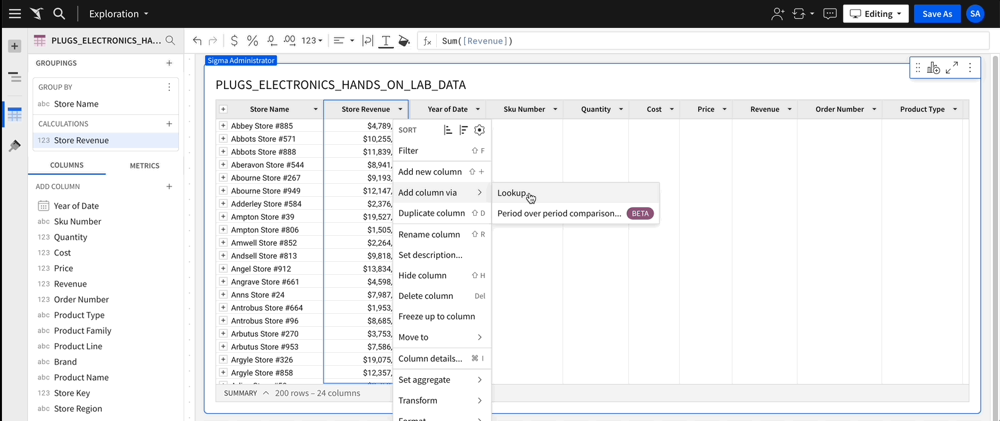

author: pballai
id: 10_2023_first_friday_features
summary: 10_2023_first_friday_features
categories: Administration
environments: web
status: Published
feedback link: https://github.com/sigmacomputing/sigmaquickstarts/issues
tags: first_friday_features
lastUpdated: 2023-11-03

<!-- 
10/6/23: done
10/13/23: done
10/20/23: done
11/03/23: done
-->

# (10-2023) October
<!-- The above name is what appears on the website and is searchable. -->

## Overview 
Duration: 5 

This QuickStart lists all the new and public beta features released, as well as bugs fixed in October 2023.

It is summary in nature, and you should refer to the specific Sigma documentation links provided for more information.

**Public beta features will carry the section text "Beta".**

All other features are considered released (**GA** or generally available).

Sigma actually has feature and bug fix releases weekly, and high-priority bug fixes on demand. We felt it was best to keep these QuickStarts to a summary of the previous month for your convenience.

New first Friday features QuickStarts will be published on the first Friday of each month, and will include information for the previous month.


## Embedding
Duration: 20

### Bug Fixes:
When swapping the source of a tagged workbook version, the `Sources` of tagged workbook dropdown now excludes connections with a different Cloud Data Warehouse or Database Management System provider as the initial source.

### Embed sandbox URL syntax:
Sigma no longer automatically adds colons (:) to separate parameters in the embed sandbox URL. 

For example, if you enter `param1=value1 param2=value2` in the `Other Parameters` field, the URL is appended with `?param1=value1&`   
`param2=value2` 

Previously, the URL would be appended with `?:param1=value1&:param2=value2`.


<!-- END OF SECTION-->

## Filters and Controls
Duration: 10

### Tabular data in list filters and controls:

List filters and controls now support input copied from tabular formats! 

You are now able to copy multiple cell values from Excel, Google Sheets, Sigma tables, etc., and paste them in the Search field. 

The input is automatically comma-delimited, enabling you to filter it as multiple distinct values.

This feature will save users lots of time when the need to search for a long list of items is required.

Suppose we want to search a 4M row table for just a list of target `Order Numbers`. Instead of using the order number filter, and picking them one at a time (really impractical), you can just paste the list into the search field and you are done!. **VERY COOL** time saver:


<!-- END OF SECTION-->

## Functions
Duration: 20

### DateLookback function (Beta):
Sigma has added a new function that makes it easy to compare one column's value with another when working with dates.

For example, let's assume we have a table that includes an `Annual Gross Profit` column containing the gross profit for each year between 2019 and 2023. 

We can use the `DateLookback` function to return the previous year’s gross profit and facilitate a period-over-period analysis. 

We simply use this formula in a new column:

```code
DateLookback([Annual Gross Profit], [Year], 1, "year")
```

The formula above determines a one-year offset from the period in the `Year` column, then references the offset period and returns the corresponding value from the Annual Gross Profit column. 

The results look like this:



The `DateLookBack` > `Period` can be and of these values:

"year", "quarter", "month", "week", "day", "hour", "minute", or "second"

### Regular expression (RegExp) text match filtering:
We have added a new RegExp text match filter to enable you to filter text columns, based on specified patterns. 

These included text strings, character classes, ranges, etc. 

These filters support the RegExp syntax and behavior of the connected CDW or DBMS.

You can either match or not match:

**Matches RegExp:** Includes values that match one or more specified patterns.

**Does not match RegExp:** Excludes values that match one or more specified patterns.

For example, if you want to only see items in the `Product Line` that contain the text `TV` or `4K`:


<aside class="negative">
<strong>NOTE:</strong><br> You can use the "disjunction operator (|)" to filter multiple values. For example, abc|xyz filters values that contain “abc” or “xyz.”
</aside>


<!-- END OF SECTION-->

## Input Tables
Duration: 20

### Conditional formatting in input tables:
We have added the ability to apply rules based on specified conditions to format single colors, color scales, or data bars in input table columns. 

Conditional formatting is accessed in the  `Element` format panel, or open a `column menu` and select `Conditional formatting`:

<br>

In this example, `FY23Forecasts` cell is red when the `At Risk` checkbox in the corresponding cell is checked on:


### Hyperlinks in input tables:
You can now add hyperlinks to Input Table columns. 

In the column menu, select `Transform` > `Set link`, then choose a column as the link source or create URLs with a custom formula:

Let's say that we have a table called that has the name of an image in one column, a picture and the URL to that image in another. 

We prefer not to show the ugly URLs but do want the user to be able to click on the `Image Name` to open the picture in a new browser tab, full size. 

We just have to transform the `Image Name` column to `link` and then link the `Image URL` column to it:

<br>

<br>

Now the `Image Name` column is a hyperlink and we can just hide the `Image URL column`:

<br>

<aside class="positive">
<strong>IMPORTANT:</strong><br> You can also get URLs from another column using Sigma's Lookup feature.
</aside>

### Data autofill in input tables:
Input tables (and individual columns) now support autofill, which will save users time in certain use cases.

Select a cell or range of cells, then drag the fill handle (blue box in the lower right corner of the selection) to highlight adjacent cells you want to populate. 

Sigma automatically fills the highlighted cell or range with data based on the selected values and patterns. 

For text and checkbox columns, Sigma repeats the selected cell values. 

For number and date columns, Sigma projects values to continue a patterned sequence (like consecutive numbers or incremental dates). 

If no pattern is detected, it repeats the selected cell values.


<!-- END OF SECTION-->

## New QuickStarts in October
Duration: 20

[Implementing Row Level Security](https://quickstarts.sigmacomputing.com/guide/security_row_level_security/index.html?index=..%2F..index#0):

This QuickStart provides insight into the different methods available for content creators to limit data access to a user, based on an implementation of row level security (RLS) in Sigma.


<!-- END OF SECTION-->

## Visualizations
Duration: 20

### KPI chart correction:
When the `Comparison` property is configured in a KPI chart, both the comparison value and label are now hidden if the referenced benchmark or target value is null. 

### Trellis chart enhancements:
Trellis charts (also known as small multiples or panel charts) have been enhanced with the following upgrades:

 <ul>
      <li> Improved performance with large datasets.</li>
      <li> Better column and row spacing.</li>
      <li> Scrollable charts and legends.</li>
      <li> Larger minimum panel size.</li>
      <li> Tooltip bug fixes.</li>          
</ul>

If you never used trellising to enhance a visualization, here is why you may find them useful.

**Without trellis:**<br>
This initial chart shows a basic view that compares total revenue per fiscal year from 2019 to 2023. The stacked bars differentiate revenue for each product family, providing an additional dimension to explore within and across each year.

<br>

**With trellis:**<br>
By incorporating trellis columns to our example, we deepen the analysis. We can still analyze total revenue by fiscal year and product family, but the additional dimension allows us to compare these data points within and across smaller data subsets based on store region.

<br>

This is just a quick example, and there is much more we can do by using a trellis.


<!-- END OF SECTION-->

## Workbooks
Duration: 20

### Bulk column relocation:
Sigma has added this very useful enhancement to make your workflows even faster.

When interacting with a data element or input table, we can now bulk relocate multiple columns using the `Move to` action in the `Columns` menu. 

This functionality is available in the `Element properties` panel and directly in the element.

In the animation below, take note that the order of the columns we select to move is maintained when they are moved to the `start` using this new feature:



### Classic layout feature sunset:
We want to make you are aware that as part of Sigma’s plan to sunset the classic workbook layout and transition to exclusive use of the newer grid layout, the `Revert to Classic Layout` option has been removed from `Workbook` settings > `Layout` settings. 

The feature requires the following:

 <ul>
      <li> You must be assigned an account type with the `Edit Workbook` and/or `Explore Workbook` permission enabled.</li>
      <li> You must be the workbook owner or be granted `Can explore` or `Can edit` workbook permission.</li>
</ul>

For more information about this update, [see the Sigma Community post.](https://community.sigmacomputing.com/t/goodbye-to-classic-layout-and-embrace-grid-layout/2631)

### Period-over-period workflow (Beta)
Sigma has added a **guided workflow** (think "wizard") for building period-over-period analyses. This new functionality provides a quick and convenient way to evaluate performance over time. 

This allows users to generate dynamic period comparisons without entering complex custom formulas, then easily visualize the results to identify trends, patterns, and anomalies.




<!-- END OF SECTION-->

## Additional Information
Duration: 20

**Additional Resource Links**

[Blog](https://www.sigmacomputing.com/blog/)<br>
[Community](https://community.sigmacomputing.com/)<br>
[Help Center Home](https://help.sigmacomputing.com)<br>
[QuickStarts](https://quickstarts.sigmacomputing.com/)<br>
<br>

[](https://twitter.com/sigmacomputing)&emsp;
[](https://www.linkedin.com/company/sigmacomputing)&emsp;
[](https://www.facebook.com/sigmacomputing)


<!-- END OF WHAT WE COVERED -->
<!-- END OF QUICKSTART -->
