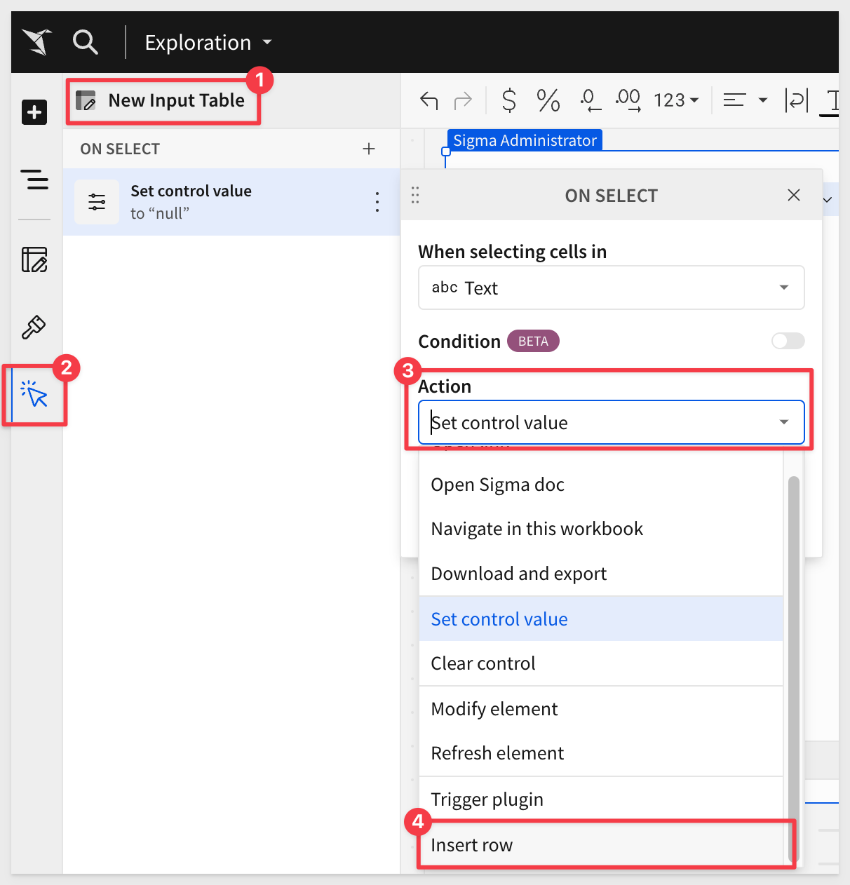
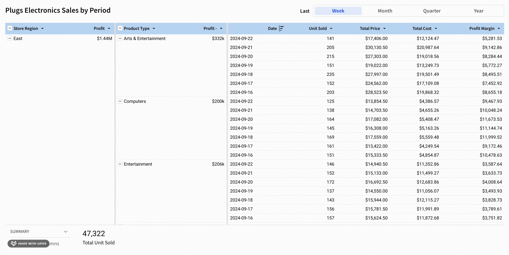
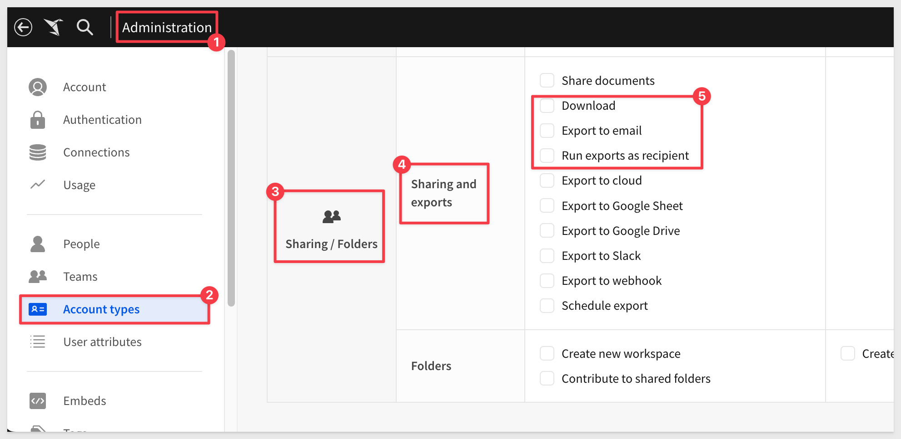
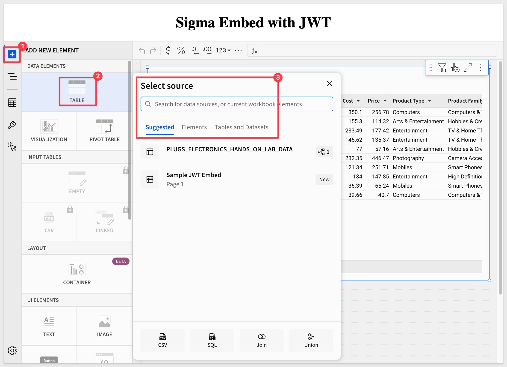
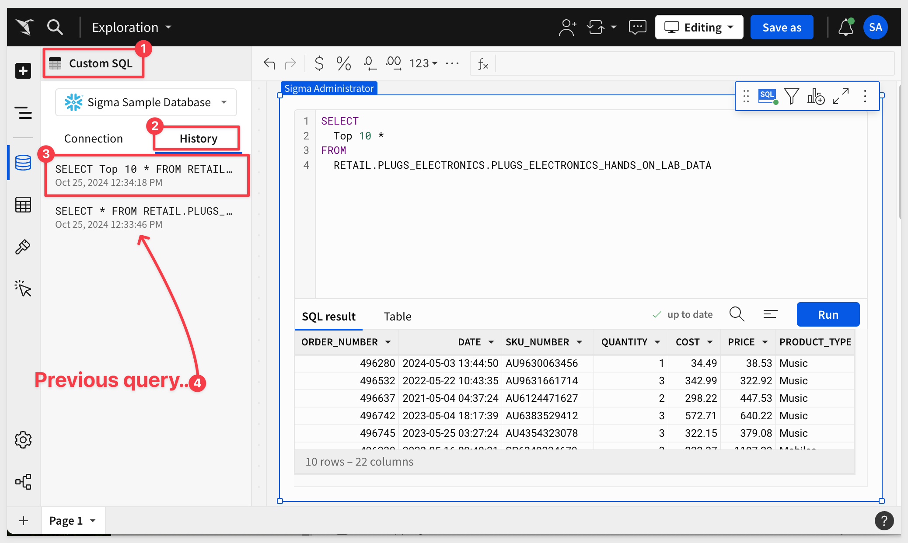
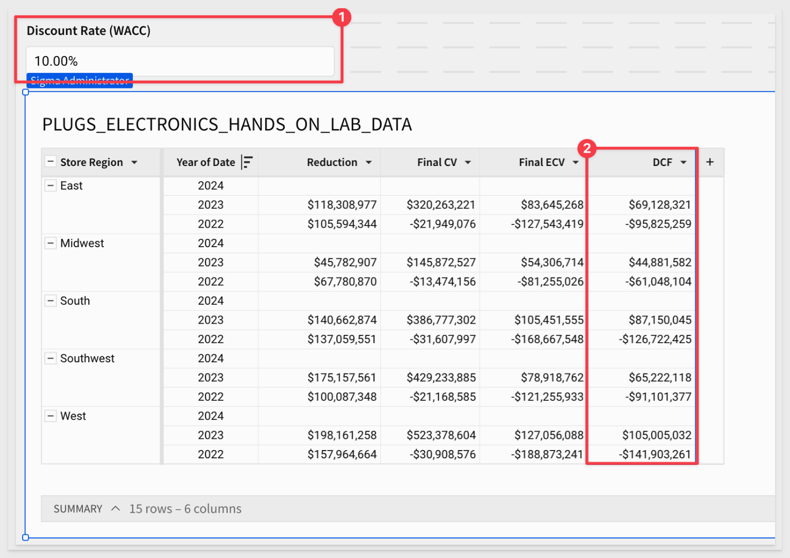
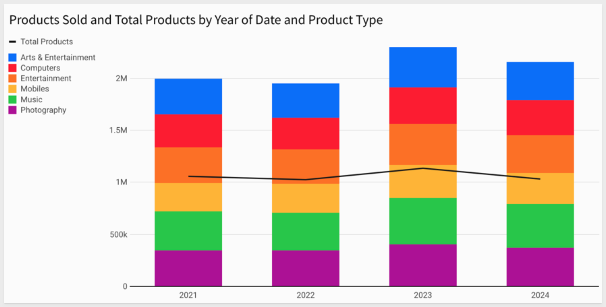
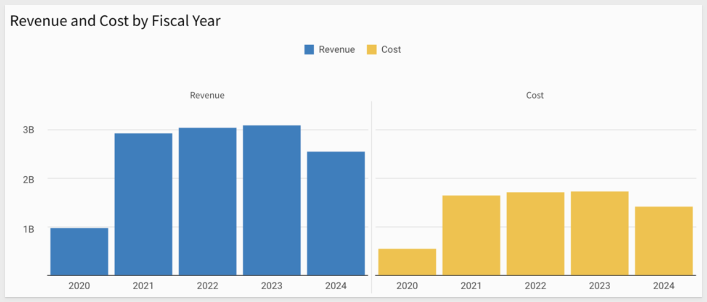
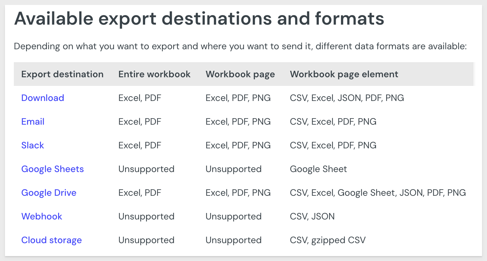
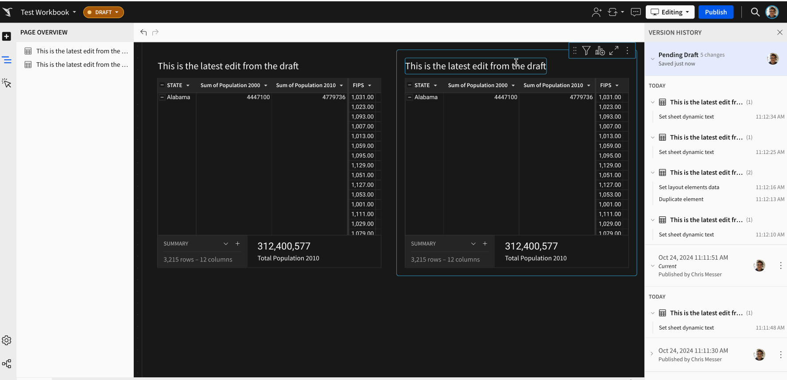

author: pballai
id: 10_2024_first_friday_features
summary: 10_2024_first_friday_features
categories: Administration
environments: web
status: Published
feedback link: https://github.com/sigmacomputing/sigmaquickstarts/issues
tags: first_friday_features
lastUpdated: 2024-11-01

# (10-2024) October

## Overview 
Duration: 5 

This QuickStart lists all the new and public beta features released, as well as bugs fixed in October 2024.

It is summary in nature, and you should refer to the specific Sigma documentation links provided for more information.

**Public beta features will carry the section text "Beta".**

All other features are considered released (**GA** or generally available).

Sigma actually has feature and bug fix releases weekly, and high-priority bug fixes on demand. We felt it was best to keep these QuickStarts to a summary of the previous month for your convenience.

New first Friday features QuickStarts will be published on the first Friday of each month, and will include information for the previous month.

Features carrying the  are customer favorites!

<!-- END OF SECTION-->

## Actions
Duration: 5 

### Use actions to insert rows into input tables (GA) 
The `Insert row action` to insert a row into an input table based on a user’s interaction with another workbook element is now **GA.**

The feature can be found here:

For more information about actions in Sigma, see [Intro to actions.](https://help.sigmacomputing.com/docs/intro-to-actions)

### Use workbook actions to set a date range control
The date range control is now a valid target for workbook actions that target controls.

There are many possibilities with this new action. 

For example, a segmented control can be used to allow users to easily click on common date ranges. This saves time for the user, and keeps them focused on the data:

<!-- END OF SECTION-->

## Administration
Duration: 20

### Updated and new permissions for exports
Export permissions are now more granular. The `Download `or `Send Now` permission is now two permissions, `Download` and `Export to email`:

The functionality managed by these permissions has not changed, and existing account types have been migrated to use the new permissions.

In addition, the ability to have an export run as the recipient is managed by a new permission, `Run exports as recipient.`

For more information, see [License and account type overview.](https://help.sigmacomputing.com/docs/license-and-account-type-overview) 

<!-- END OF SECTION-->

## API
Duration: 20

### New API rate limit
The `v2/auth/toke`n endpoint is now rate limited to **one request per second.**

For more information, see [Get started with the Sigma REST API.](https://help.sigmacomputing.com/reference/get-started-sigma-api#api-limits)

### New parameter for Tag a workbook endpoint
The [Tag a workbook](https://help.sigmacomputing.com/reference/tagworkbook) (POST v2/workbooks/tag) endpoint now supports the `isDefault` parameter. 

If you want users that only have access to tagged versions of the document to open this tagged version by default, set `isDefault` to `true`.

<!-- END OF SECTION-->

## Bug Fixes
Duration: 20

**1:** When a workbook action is configured to set a control value on click in a visualization element, clicking on the white space outside the chart now clears the control value as expected.

**2:** Workbook actions triggered from interactions with tables which have columns that either do not have a type or an error type now run as expected.

**3:** When users send a request to their admins for a tag to be applied to their workbook, the resulting email notifications now use custom branding settings configured for the organization.

**4:** Copying a single element with a configured action or clicking Copy page on a workbook page containing actions now copies action configurations between elements on the page.

**5:** Theme fonts are now applied to all embed modal views.

**6:** The Get a team API endpoint now returns an error message when trying to retrieve an unexpected team.

**7:** Users can now export from embeds authenticated with client ID and secret when eval_connection_id is set.

**8:** When including a PNG file in an scheduled or ad hoc email export, the resulting image now uses the full width of the email body.

**9:** Swapping data sources when promoting a workbook from one tag to another tag now works as expected.

**10:** When creating a dynamic title, the type ahead suggestions in the formula bar in the overlay now include the available table columns as well as controls.

**11:** When responsive height is enabled in an embedded object, opening a modal in the embedded content now displays the modal at the current scroll position.

**12:** When using the embed sandbox UI in an organization with a high number of teams, the left navigation now loads teams progressively on scroll without throwing a RESOURCE_EXHAUSTED error.

**13:** When you specify a text alignment for a row header or column header, all header values are aligned instead of the lowest level header.

<!-- END OF SECTION-->

## Embedding
Duration: 20

### Improved data source selection UI in embeds
Select data sources for workbook elements using a new popover UI. 

With the new experience, you can search for data sources, review a list of suggested sources, and preview data sources. Preview a data source to review the source data and choose specific columns to apply to the element.

For example:

This allows an embed user (with the appropriate permission) to access the new experience.

For more information, see [Create a data element.](https://help.sigmacomputing.com/docs/create-a-data-element)

### New inbound events in embeds
Use two new inbound events, `workbook:bookmark:delete` and `workbook:bookmark:select` to display, clear, or delete bookmarks.

For more information, see [Implement inbound and outbound events in embeds.](https://help.sigmacomputing.com/docs/inbound-and-outbound-events-in-embeds)

There is also a [QuickStart that covers eventing in Sigma embeds.](https://quickstarts.sigmacomputing.com/guide/embedding_07_events/index.html?index=..%2F..index#0)

<!-- END OF SECTION-->

## Functions / Calculations
Duration: 20

### Create time series forecasts (Beta)
In a Sigma workbook, you can use `historical time series data` to predict and visualize future values and trends, leveraging [Snowflake’s forecasting ML function](https://docs.snowflake.com/en/user-guide/ml-functions/forecasting). 

Forecasting employs a machine learning algorithm to predict future numeric data based on historical time series data. A common use case is to forecast sales by item for the next two weeks.

No prior SQL knowledge us required to make this work.

For more information, see [Create time series forecasts (Beta).](https://help.sigmacomputing.com/docs/create-time-series-forecasts)  

<!-- END OF SECTION-->

## Infrastructure
Duration: 20

### Sigma now supports Azure Western Europe region
Sigma is now deployed in Azure West Europe in compliance with [EU GDPR.](https://commission.europa.eu/law/law-topic/data-protection/data-protection-eu_en) 

Located in the `Netherlands`, this deployment gives customers in the EU more control over data storage while enabling compliance with internal policies and external data residency requirements.

<!-- END OF SECTION-->

## New QuickStarts in October
Duration: 20

[Discounted cash flow use case:](https://quickstarts.sigmacomputing.com/guide/use_cases_finance_discounted_cash_flow/index.html?index=..%2F..index#0)

This QuickStart describes and demonstrations how to handle a discounted cash flow (DCF) in Sigma. DCF is a common financial analysis that values some type of asset over a period of time. More simply put, it allows someone to understand how much future money is worth in today's terms.

An example of what is built is shown below:

<!-- END OF SECTION-->

## Visualizations
Duration: 5

### Bars in combo charts support color by category (Beta) 
If your combo chart includes a bar chart, you can add a column to split the color of the bar series by category.

For example:

For more information, see [Configure a chart color by category. (Beta)](https://help.sigmacomputing.com/docs/combo-charts#configure-a-chart-color-by-category-beta)
 
### Cartesian charts support trellis by series (Beta)
If your bar, line, area, or scatter chart has multiple series, you can create a trellis chart for each series.

**This approach provides several advantages:**
 <ul>
      <li><strong>Enhanced Comparisons:</strong> By breaking down the data into series-based subsets, analysts can easily compare patterns across different categories, time periods, or groups within the same chart type.</li>
      <li><strong>Focused Insights:</strong> Each segment within the trellis isolates a single series, reducing clutter and helping analysts focus on specific relationships or trends relevant to each subset.</li>
      <li><strong>Detailed Multi-Dimensional Analysis:</strong> </li>
      <li><strong></strong> Trellising enables the analysis of multiple variables at once. For example, in a scatter trellis, each pane could represent a different product or location, showing how variables interact within each distinct category.</li>
      <li><strong>Efficient Data Exploration:</strong> Trellis charts streamline the comparison of segmented data without needing separate charts, improving efficiency in exploratory data analysis.</li>
</ul>

For example:

For more information, see [Create a trellis chart with multiple series. (Beta)](https://help.sigmacomputing.com/docs/create-and-format-trellis-charts#create-a-trellis-chart-with-multiple-series-beta)
 

<!-- END OF SECTION-->

## Workbooks
Duration: 20

### Export any supported format to Google Drive 
You can now export one or more workbook elements, workbook pages, or an entire workbook to a new folder in Google Drive. 

Additional file format types are now supported, such as `PDF` and `PNG.`

The current list of supported types are:

For more information, see [Send or schedule workbook exports for details on supported file types.](https://help.sigmacomputing.com/docs/send-or-schedule-workbook-exports)  

### Improved pivot table performance 
Pivot tables are no longer limited to 100,000 points of data. 

In addition, pivot table rows support infinite scroll!

### Restore a workbook to a previous change
You can now restore a workbook to a previous change in the edit history for a draft or previously published version.

This can be really useful if something you are working on stopped working and you are not sure what change caused the issue. Now you can quickly revert versions to see what changed caused the issue.

For example:

For more details, see [Workbook versions and version history](https://help.sigmacomputing.com/docs/workbook-versions-and-version-history)

### Updated file names for scheduled element exports
For scheduled exports of elements that use **dynamic text in the title,** the file name now reflects the value of the dynamic text when the export was performed.

<!-- END OF SECTION-->

## Additional Information
Duration: 20

**Additional Resource Links**

[Blog](https://www.sigmacomputing.com/blog/) 
[Community](https://community.sigmacomputing.com/) 
[Help Center](https://help.sigmacomputing.com/hc/en-us) 
[QuickStarts](https://quickstarts.sigmacomputing.com/) 

Be sure to check out all the latest developments at [Sigma's First Friday Feature page!](https://quickstarts.sigmacomputing.com/firstfridayfeatures/)
 

&emsp;
&emsp;

<!-- END OF SECTION-->
<!-- END OF WHAT WE COVERED -->
<!-- END OF QUICKSTART -->
