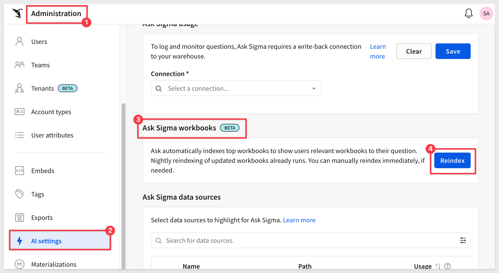
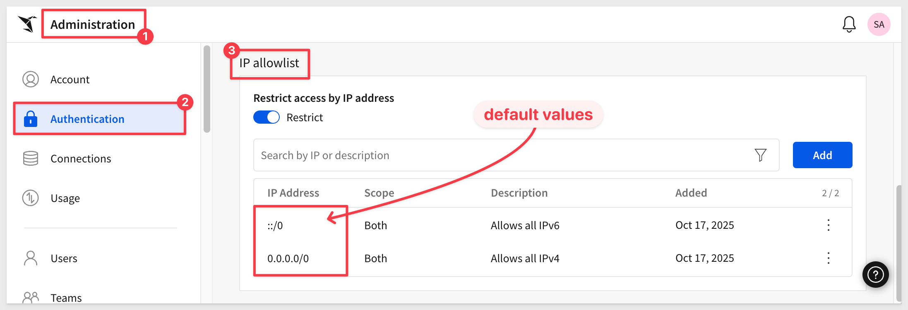

author: pballai
id: 10_2025_first_friday_features
summary: 10_2025_first_friday_features
categories: Administration
environments: web
status: Published
feedback link: https://github.com/sigmacomputing/sigmaquickstarts/issues
tags: first_friday_features
lastUpdated: 2025-10-31

# (10-2025) October
<!-- The above name is what appears on the website and is searchable. 

-->

## Overview 
Duration: 5 

This QuickStart lists all the new and public beta features released, as well as bugs fixed in October 2025.

It is summary in nature, and you should refer to the specific Sigma documentation links provided for more information.

**Public beta features will carry the section text "Beta".**

All other features are considered released (**GA** or generally available).

Sigma actually has feature and bug fix releases weekly, and high-priority bug fixes on demand. We felt it was best to keep these QuickStarts to a summary of the previous month for your convenience.

New first Friday features QuickStarts will be published on the first Friday of each month, and will include information for the previous month.

### Subscribe to What's New in Sigma
For those wanting to see what Sigma is doing on each week, release notes are now also available on the [Sigma Community site](https://community.sigmacomputing.com/). There, you can **opt in to receive notifications about future release notes** in order to stay on top of everything new happening at Sigma. You can also subscribe to automated updates in any Slack channel using the Sigma Community release notes RSS feed. 

For more information on how to subscribe to release note notifications, see [About the release notes](https://community.sigmacomputing.com/t/about-the-release-notes-category/5517) 

<aside class="positive">
<strong>IMPORTANT:</strong>  Some screens in Sigma may appear slightly different from those shown in QuickStarts. This is because Sigma continuously adds and enhances functionality. Rest assured, Sigma’s intuitive interface ensures that any differences will not prevent you from successfully completing any QuickStart.
</aside>

For more information on Sigma's product release strategy, see [Sigma product releases](https://help.sigmacomputing.com/docs/sigma-product-releases)

If something is not working as you expect, here's how to [contact Sigma support](https://help.sigmacomputing.com/docs/sigma-support)

<!-- END OF SECTION-->

## Administration
Duration: 20

### Audit log support for AWS UK region
Sigma now supports audit log events for organizations hosted in the AWS UK region.

### Enable a unique SAML SP entity ID (Beta)
When setting up SAML-based authentication for a Sigma organization, you can now assign a unique service provider (SP) entity ID for the SAML configuration. With the unique entity ID for Sigma as an SP, you can configure your IdP to allow SAML authentication to multiple Sigma organizations.

### Dutch is now supported as a workbook locale
You can now set Dutch (nl-nl) as your workbook locale. Apply the Dutch language, date format, and currency can to workbook previews and embedded workbooks.

For more information, see [Manage workbook localization](https://help.sigmacomputing.com/docs/manage-workbook-localization)

### Protect data with customer-managed keys in AWS and Azure
For Sigma organizations hosted in AWS or Azure cloud regions, you can now protect your data in Sigma with customer-managed keys. 

**Why it matters:** 
This capability meets enterprise compliance requirements and gives organizations complete control over their encryption keys — essential for regulated industries and security-conscious enterprises.

For more information, see [About using customer-managed keys in Sigma](https://help.sigmacomputing.com/docs/customer-managed-keys-cmk-faqs) 

For setup instructions, see [Set up customer-managed keys](https://help.sigmacomputing.com/docs/set-up-customer-managed-keys-cmk)

### Sigma now supports the Google Cloud Platform in the Kingdom of Saudi Arabia
Sigma is now deployed in GCP KSA (me-central2). 

This deployment delivers significantly lower latency and enhanced performance for Middle East customers when connecting to Sigma.

### Use Snowflake as your OAuth authorization server (Beta) 
When you connect to Snowflake using OAuth, you can choose to authenticate directly with Snowflake functioning as the OAuth authorization server instead of configuring an external identity provider (IdP) to access Snowflake. 

You can only use Snowflake as your OAuth authorization server to authenticate to a Snowflake connection.

**Why it matters:** 
This simplifies authentication architecture by eliminating the need for external identity providers — reducing complexity and setup time for Snowflake customers while maintaining secure OAuth flows.

For more information, see [Use the Snowflake authorization server for connection-level OAuth](https://help.sigmacomputing.com/docs/connect-to-snowflake-oauth#use-the-snowflake-authorization-server-for-connection-level-oauth)

<!-- END OF SECTION-->

## AI
Duration: 20

### Ask Sigma returns best match workbooks (Beta) 
Ask Sigma now suggests workbook matches to user questions by automatically cataloging workbook usage data on a daily basis. Users assigned the Admin account type can manually update the workbooks cataloged at any time using the Reindex option on the Administrator > AI Settings page.

**Why it matters:** 
This update improves discovery and relevance by connecting user questions to the most used and contextually appropriate workbooks — helping teams find trusted answers faster.

<!-- END OF SECTION-->

## API
Duration: 20

### Impersonate a user in API calls (Beta)
You can now impersonate other users in API calls when assigned the `Admin` account type, for example to retrieve and display the contents of their `My Documents` folder in embedded content.

**Why it matters:** 
This solves complex embedding scenarios where admins need to access user-specific content programmatically — enabling seamless customer support and advanced integration patterns without compromising security.

For more details and an example test Python script, see [Impersonate users](https://help.sigmacomputing.com/docs/impersonate-users)

### New endpoint to assign multiple user attributes to a team
You can now programmatically assign user attributes to a team in bulk via [Assign user attributes to a team](https://help.sigmacomputing.com/reference/assignuserattributestoteam)

<!-- END OF SECTION-->

## Bug Fixes
Duration: 20

**1:** When an action with an On select trigger is configured on a bar chart, selecting an axis label of an unaggregated value no longer generates column rank instead of the defined value.

**2:** When a Set control value action is triggered by selecting any column in a table, pivot table, or input table, pressing the up arrow key to select the column header (consequently selecting the entire column) no longer clears the control value.

**3:** The list of database or catalog objects visible when browsing a connection in Sigma can now be expanded to view more information without hovering, such as long table names.

**4:** Sigma now correctly displays the selected state for a workbook page based on the selected Customize page visibility setting.

**5:** The `Last sync` date visible when browsing connection objects reflects the last time Sigma attempted to sync an object, even if a sync was not performed because no data had changed.

**6:** Workbooks created using the [Create workbook from template](https://help.sigmacomputing.com/reference/saveworkbookfromtemplate) endpoint with `updateAutomatically` set to `true` now update properly for cases when the template was shared from another organization.

**7:** When changing the visibility of a column in a dataset, an invalid value that caused errors is no longer set.

**8:** When calling the [List bookmarks](https://help.sigmacomputing.com/reference/getworkbookbookmarks) for a workbook endpoint, the `isDefault` option is correctly returned for saved views set as the default for the workbook.

**9:** When calling the [Update a workbook bookmark](https://help.sigmacomputing.com/reference/updateworkbookbookmark) endpoint, setting the `isDefault` option for a saved view that was not previously set as the default correctly succeeds.

**10:** When adding a table in an embedded workbook, previewing a dataset resulted in an error. Now, the dataset can be previewed as expected.

**11:** Date-truncated bar charts with a time scale type are now correctly labeled. Previously, mismatches between organization and user timezones could sometimes cause labels for time axes to be incorrect.

**12:** Opening a tagged workbook now logs an `OBJECT_OPENED` event on the tagged version, as opposed to logging it on the untagged version.

**13:** In localized workbooks, actions that show or hide columns with names matching control values (dynamic show/hide) now correctly reference the translated labels. Previously, the actions were referencing the source labels, resulting in no matches with manually entered control values.

<!-- END OF SECTION-->

## Charts
Duration: 20

### Configure chart axis marks
Configuring custom chart axis marks, like `ticks` and `grid lines`, is now supported. 

You can change the count or step size of both major (labeled) and minor (unlabeled) chart axis marks.

For more information, see [Configure chart axis marks](https://help.sigmacomputing.com/docs/configure-chart-axis-marks)

<!-- END OF SECTION-->

## Data Apps
Duration: 20

### App notifications (GA) 
You can now create actions that send notifications to users via email, Slack, and Microsoft Teams using the notify and export action. 

These actions can be configured independently of an export or attachment. 

Notification actions support dynamic messages and lists of recipients based on workbook data. 

**Why it matters:** 
This transforms a Sigma workbook from a passive analytics tool into an active business process driver — enabling automated alerts, approvals, and data-driven workflows that keep teams aligned and responsive.

For more information, see [Create actions that send notifications and export data](https://help.sigmacomputing.com/docs/create-actions-that-send-notifications-and-export-data)

### Dynamic recipients and messages for notify and export actions to MS Teams
You can now configure a list of dynamic recipients and dynamic message contents for notify and export actions sent to Microsoft Teams. 

For more information, see [Send notifications by Microsoft Teams](https://help.sigmacomputing.com/docs/create-actions-that-send-notifications-and-export-data#send-notifications-or-export-data-to-microsoft-teams)

### Single-select columns in input tables (Beta)
Add a single-select column to an input table to allow users to select one value per row from a predefined list of values (text, number, or date). You can manually create and manage a list of distinct and repeatable values, or you can populate the list from an existing data source or element in the workbook. 

Values can then be formatted as pills and assigned different colors for visual differentiation and clarity.

**Why it matters:** 
This enhancement makes input tables more interactive and controlled, enabling structured data entry and consistent user selections that can drive downstream logic or metrics.

For more information, see [Configure single-select or multi-select columns on input tables](https://help.sigmacomputing.com/docs/configure-single-select-and-multi-select-columns-on-input-tables)

<!-- END OF SECTION-->

## Data Modeling
Duration: 20

### View available columns for a source
When working with a data element in a workbook or data model, you can quickly discover and access the available columns from the data source, including related columns from a data model.

<!-- END OF SECTION-->

## Functions / Calculations
Duration: 20

### ArrayConcat function 
You can use the ArrayConcat function to combine multiple arrays, maintaining all items and their order.

**Why it matters:** 
This function simplifies array manipulation by letting you merge multiple lists without complex formulas — improving readability and efficiency in calculated columns or custom elements.

For more information, see [ArrayConcat](https://help.sigmacomputing.com/docs/arrayconcat)

<!-- END OF SECTION-->

## New QuickStarts in October
Duration: 20

### Plugin Use Case 01: Dashboard Builder (Embedding Series)
A brand-new developer QuickStart shows how to build a configurable, embed-ready dashboard experience using Sigma’s plugin framework, a locally hosted Angular plugin, and a lightweight JavaScript host app.

- Users pick KPIs and layout areas, then save setups with Sigma bookmarks; extra metadata persists in a local JSON db (lowdb).
- Includes a Sigma workbook template with curated KPIs and control wiring for fast setup.

**Why it matters:** 
Gives product teams a governed, self-service way to let end users “assemble” dashboards inside your app—no heavy front-end rebuild. You keep Sigma’s security/governance, gain rapid customization, and can proof-out plugin patterns for larger embedded experiences.

[Plugin Use Case 01: Dashboard Builder QuickStart](https://quickstarts.sigmacomputing.com/guide/embedding_plugin_useage_01_dashboard_builder/index.html?index=..%2F..index#0) 
[Project README (code + steps)](https://github.com/sigmacomputing/quickstarts-public/blob/main/plugin_use_cases/public/dashboard-builder/README.md)  
[Prereq: REST API Usage 01 — Getting Started](https://quickstarts.sigmacomputing.com/guide/embedding_rest_api_usage_01_getting%20started_started/index.html?index=..%2F..index#0)

<!-- END OF SECTION-->

## Security
Duration: 20

### IP Allowlist for UI/Application (GA) 
You can configure an IP allowlist for the Sigma UI. After enabling the allowlist, you can add individual IP addresses or ranges of addresses in CIDR notation. Only users in the allowlist are able to access the Sigma application through the user interface. For more information, see Restrict access to Sigma by IP.

Previously, the IP allowlist applied only to the API. Existing IP allowlists for the API have been preserved with a Scope of API.

For more information, see [Restrict access to Sigma by IP](https://help.sigmacomputing.com/docs/restrict-access-to-sigma-by-ip-address)

**Why it matters:** 
This enhancement strengthens security by allowing admins to restrict UI access to trusted networks — ensuring Sigma access policies align with enterprise perimeter controls.

<!-- END OF SECTION-->

## Workbooks
Duration: 20

### Configure global BCC email addresses
You can now configure global BCC recipients for all emails in your custom email branding settings.

**Why it matters:** 
This ensures compliance teams and auditors automatically receive copies of all Sigma communications — critical for maintaining audit trails and meeting regulatory oversight requirements.

For more information, see [Custom email branding](https://help.sigmacomputing.com/docs/custom-email-branding)

### Format plugin background colors
You can now use the `Format` tab to set a background color for your plugin. 

This includes an `Auto` setting to automatically match the background color to the color of your workbook theme. 

For more information, see [Use your organization’s plugins](https://help.sigmacomputing.com/docs/use-your-organizations-plugins)

There is also a QuickStart on using plugins, [Extend Sigma with Plugins](https://quickstarts.sigmacomputing.com/guide/developers_plugins/index.html?index=..%2F..index#0)

### Option to unshare a shared view of a workbook
In the `Saved views` panel, you can quickly change a shared view to a personal view to remove visibility for other users with access to the workbook. Click `More` next to the name of a shared view, then select `Set as personal view` to make it only visible to you.

**Why it matters:** 
This update gives users finer control over workbook visibility, making it easy to convert shared content back to private when needed for draft or personal use.

### Copy and paste multiple elements at once 
You can now copy and paste more than one element at a time in a workbook or data model.

**Why it matters:** 
This enhancement speeds up workbook and data model design by allowing bulk duplication of layout elements, reducing repetitive setup work.

For more information, see [Copy and paste workbook elements](https://help.sigmacomputing.com/docs/copy-and-paste-elements#/)

<!-- END OF SECTION-->

## Additional Information
Duration: 20

**Additional Resource Links**

[Blog](https://www.sigmacomputing.com/blog/) 
[Community](https://community.sigmacomputing.com/) 
[Help Center](https://help.sigmacomputing.com/hc/en-us) 
[QuickStarts](https://quickstarts.sigmacomputing.com/) 
 

<button>[Sigma Free Trial](https://www.sigmacomputing.com/free-trial/)</button>

&emsp;
&emsp;

<!-- END OF SECTION-->
