author: pballai
id: 11_2023_first_friday_features
summary: 11_2023_first_friday_features
categories: Administration
environments: web
status: Hidden
feedback link: https://github.com/sigmacomputing/sigmaquickstarts/issues
tags: 
lastUpdated: 2023-11-03

<!-- 
11/10/23: done
11/17/23: done

-->

# (11-2023) November
<!-- The above name is what appears on the website and is searchable. -->

## Overview 
Duration: 5 

This QuickStart lists all the new and public beta features released, as well as bugs fixed in November 2023.

It is summary in nature, and you should refer to the specific Sigma documentation links provided for more information.

**Public beta features will carry the section text "Beta".**

All other features are considered released (**GA** or generally available).

Sigma actually has feature and bug fix releases weekly, and high-priority bug fixes on demand. We felt it was best to keep these QuickStarts to a summary of the previous month for your convenience.

New first Friday features QuickStarts will be published on the first Friday of each month, and will include information for the previous month.

## Embedding
Duration: 20

### Bug Fixes:
1: The PDF export feature now executes successfully in user-backed embeds.

2: Administrators can now view all scheduled exports for published and tagged versions at the workbook level. Schedule views are no longer impacted by version permissions granted to users who create the schedules.

3: When a user configures an export for a tagged workbook version and doesn’t have access to the source workbook, the document version or bookmark field in the `Send Now` or `Schedule Exports` modal now defaults to the current version. The field no longer defaults to “Invalid selection.”

4: Use of the API to generate a public embed for workbook elements no longer results in a broken link.

### New Optional Interface Parameters:
We have added three new parameters to the embedding API. 

[You can review all the available parameters here.](https://quickstarts.sigmacomputing.com/guide/embedding_howto_leverage_parameters_and_ua/index.html?index=..%2F..index#0)

 <ul>
      <li><strong>use_user_name:</strong> Displays the workbook creator’s name (instead of email) in embed menus and system-generated emails.</li>
      <li><strong>first_name:</strong> Sets the first name of the current embed user.</li>
      <li><strong>last_name:</strong> Sets the last name of the current embed user.</li>
</ul>

**use_user_name** displays the workbook creator's name (instead of email) in embed menus and system-generated emails.

The **first_name and last_name** (have to use both) parameters replace the default name (“Embed User”) that is shown in Administrative and other interfaces.

If both `first_name` and `last_name` parameters are absent, the current user keeps their current name (or, if a new user is created, their first name will be set to Embed, last name to User)

<!-- END OF SECTION-->

## Input Tables
Duration: 20

### Input table edit versioning:
Sigma supports multiple users working on content at the same time. This functionality is great for collaboration and efficiency but in the case of input tables, can create a problem too when saves are happening at nearly the same time. 

For example, if one user is editing an input table in a workbook’s published version (in `View` or `Explore` mode) and another user concurrently publishes an updated version of that workbook, what happens to the input table data that is "in-flight"?

We have addressed this edge use case to prevent input table data loss without impacting collaboration.

When you click `Save` in the input table element, Sigma informs the user that there has been an update by another user.Sigma provides the option to load and apply your changes to the latest workbook version, so that nothing is lost. 

Granted, this is an edge use-case, but we have taken action to address it so that no data is potentially lost.

### Input table lineage summary card:
In the workbook lineage, input table summary cards now include a `Connection` field that identifies the connection Sigma uses to write the input table data to the CDW/DBMS. This makes it easier to determine the input table's destination for the added data.

<!-- END OF SECTION-->

## Metrics
Duration: 20

Metrics are custom aggregate calculations that you can reuse across workbook data elements that share the same data source: a dataset or a connection table

We have added search functionality to find reusable metrics saved to datasets and connection tables, to save your valuable time.

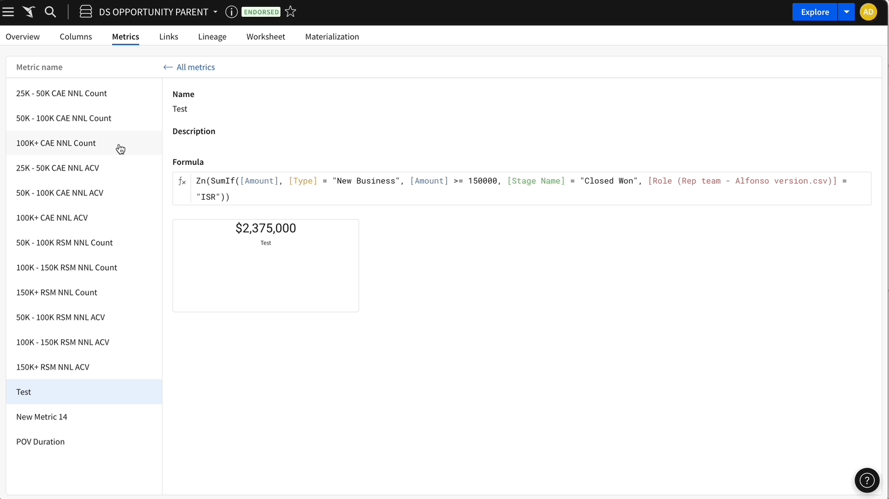

For more information, [see Using Metrics](https://help.sigmacomputing.com/hc/en-us/articles/14430050820499).

<!-- END OF SECTION-->

## New QuickStarts in November
Duration: 20

[Secure Your Organization with Security Analytics Using Snowflake and Sigma](https://quickstarts.sigmacomputing.com/guide/secure_your_organization_with_security_analytics_using_snowflake_and_sigma/index.html?index=..%2F..index#0):

This QuickStart walks you through the process of connecting to a Sigma template, exploring security data, customizing the template for more interactivity, and connecting the template to your Snowflake environment's data (optional).

<!-- END OF SECTION-->

## Visualizations
Duration: 20

### Bug Fixes:
1: Dynamic text now reflects date or number formatting changes applied to the source column.

### Color by category in region and geography maps:
You can now add chart mark colors by category in the `Map` - `Region` and `Map` - `Geography` visualizations. Previously, these were not available in these map types.

This update brings parity in color configurations across all map types.

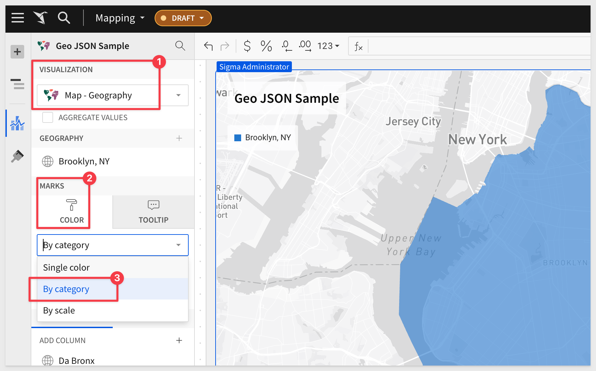 

<!-- END OF SECTION-->

## Workbooks
Duration: 20

### Conditional alerts for data elements and input tables:
The element menu now features an `Alert` action that opens the `Schedule exports` modal and auto-populates select fields based on the corresponding data element or input table. 

This allows users to quickly create a recurring export as a conditional alert to monitor a specific element.

For example, we may want to set an alert when a specific KPI falls below a threshold:

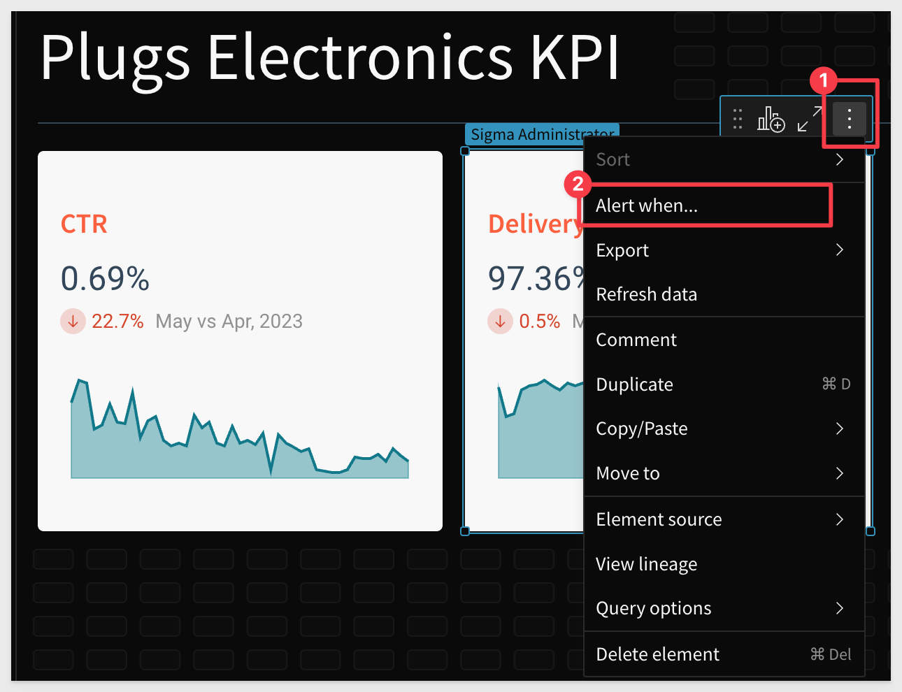 

Selecting `Alert when` from an elements menu will then allow the user to configure a schedule for delivery, using the existing schedule exports modal:

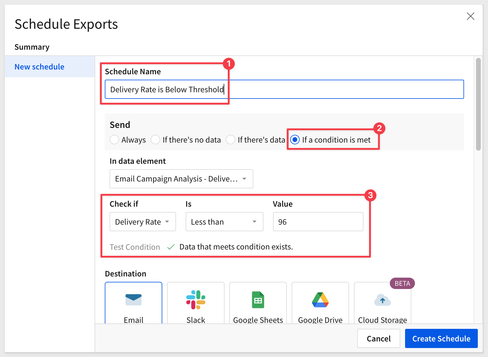 

For more information, [see Schedule a conditional export or alert.](https://help.sigmacomputing.com/hc/en-us/articles/22641293217555)

### Control element label formatting:
Label configurations for control elements are now consolidated in the `Element format` > `Label` section with the following new options:

 <ul>
      <li><strong>Label position:</strong>  Display the element above (Top) or beside (Left) the interactive control UI.</li>
      <li><strong>Label width:</strong> When Left position is selected, customize the width of the label relative to the full element area.</li>
</ul>

### Shared bookmarks:
In addition to [personal bookmarks](https://help.sigmacomputing.com/hc/en-us/articles/16694837590803-Bookmarks), you can now create **shared bookmarks** that are available to all users with access to the workbook.

Any time a workbook has controls where multiple different configurations are common, shared bookmarks can be used to make the user experience of navigating to those configurations easier.

For example, a sales workbook can have pre-filtered bookmarks for each sales region; a Quarterly Business Review workbook can have bookmarks set up for each quarter; a Product workbook can have bookmarks set up for each product area -- the possibilities are endless.

Shared bookmarks are always available to everyone who has access to a Workbook.

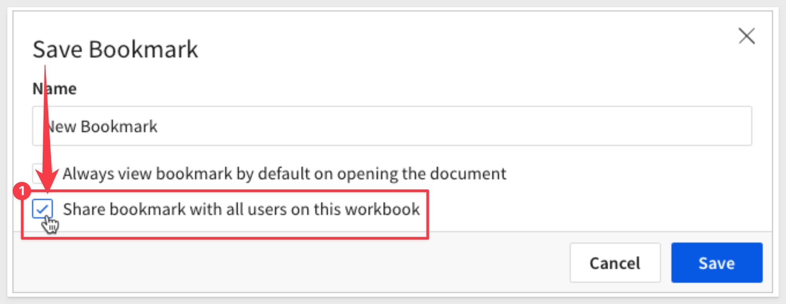 

### Warehouse views with row-level security:
Users can now create warehouse views from workbooks that use row level security. 

When they do so, the warehouse view popup will contain a `Data permissions` row displaying the user who configured the warehouse view, whose permissions are used to create the view. 

Additionally, if any of the user’s system functions values change, the view will automatically get updated.

**Creating a new warehouse view:**
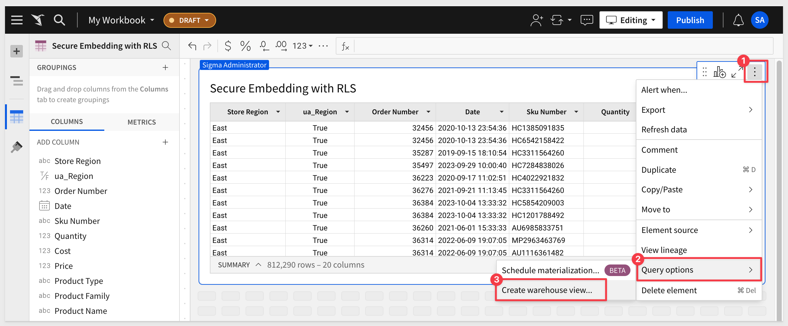 

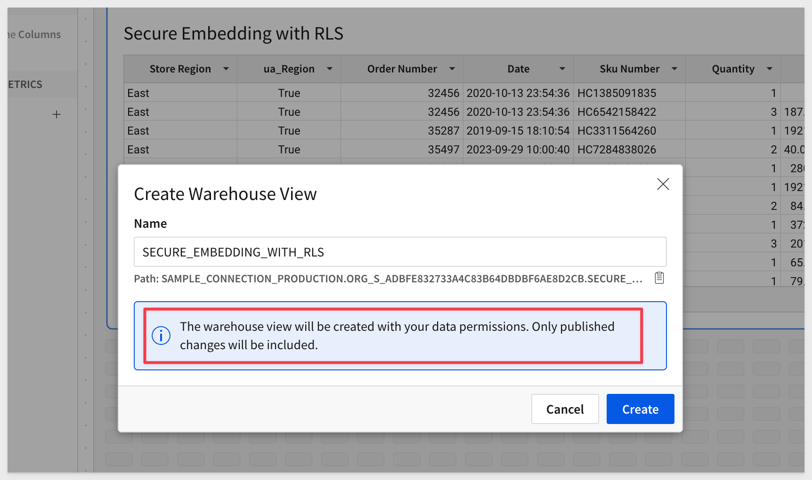 

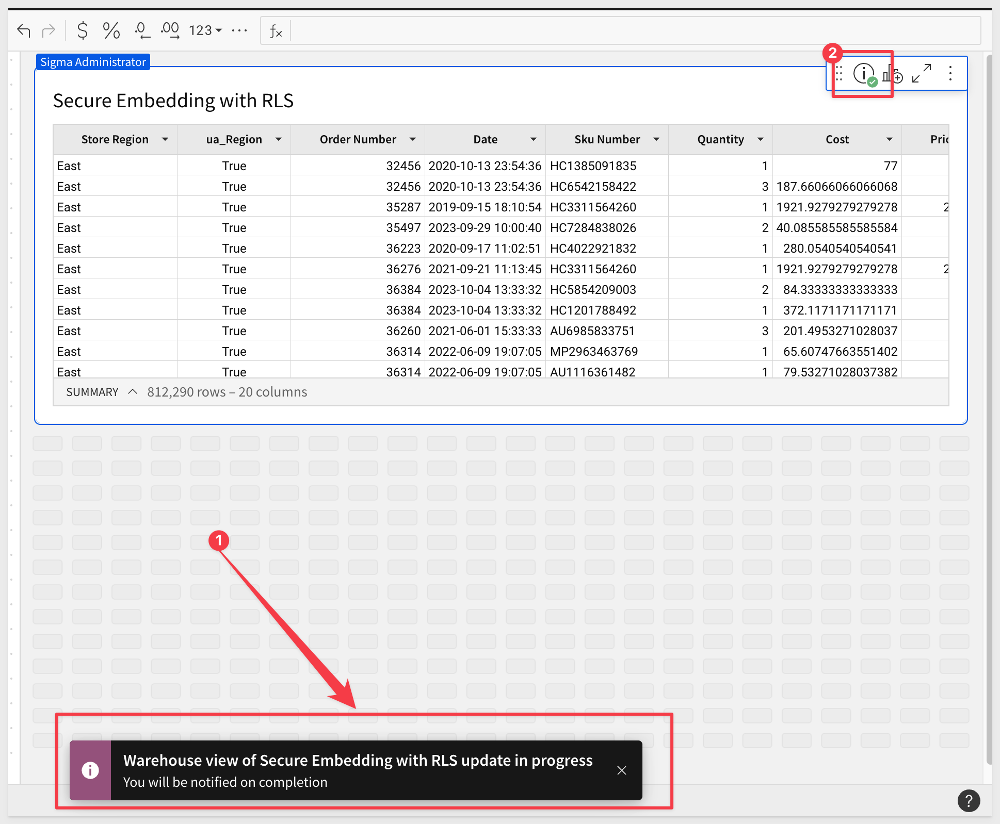 

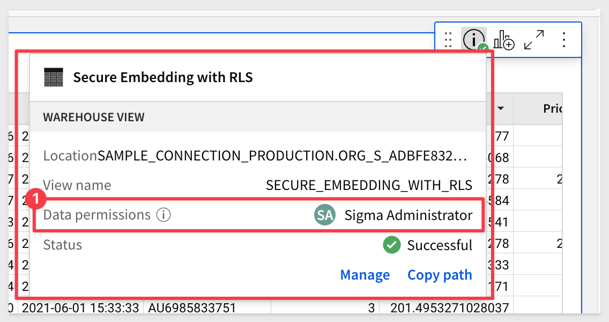 

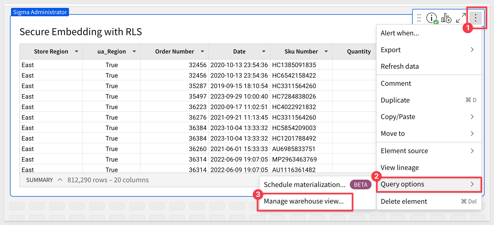 

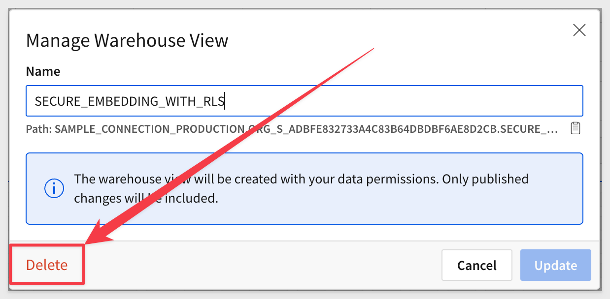

<!-- END OF SECTION-->

## Additional Information
Duration: 20

**Additional Resource Links**

[Blog](https://www.sigmacomputing.com/blog/) 
[Community](https://community.sigmacomputing.com/) 
[Help Center](https://help.sigmacomputing.com/hc/en-us) 
[QuickStarts](https://quickstarts.sigmacomputing.com/) 
 

&emsp;
&emsp;

<!-- END OF WHAT WE COVERED -->
<!-- END OF QUICKSTART -->
