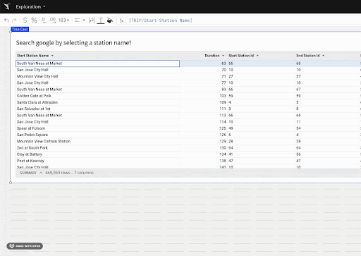

author: pballai
id: 11_2024_first_friday_features
summary: 11_2024_first_friday_features
categories: Administration
environments: web
status: Published
feedback link: https://github.com/sigmacomputing/sigmaquickstarts/issues
tags: first_friday_features
lastUpdated: 2024-12-06

# (11-2024) November
<!-- The above name is what appears on the website and is searchable. 

November 8th changes: done
November 15th changes: done
November 22nd changes: done
November 29th changes: holiday week, no release notes

Publish on Dev 6
-->

## Overview 
Duration: 5 

This QuickStart lists all the new and public beta features released, as well as bugs fixed in November 2024.

It is summary in nature, and you should refer to the specific Sigma documentation links provided for more information.

**Public beta features will carry the section text "Beta".**

All other features are considered released (**GA** or generally available).

Sigma actually has feature and bug fix releases weekly, and high-priority bug fixes on demand. We felt it was best to keep these QuickStarts to a summary of the previous month for your convenience.

New first Friday features QuickStarts will be published on the first Friday of each month, and will include information for the previous month.

Features carrying the  are customer favorites!

<!-- END OF SECTION-->

## Actions
Duration: 5 

### Clear controls with a single action 
The `clear control` action now offers the option to clear controls at four levels of granularity: 

 -  Single control 
 -  All controls in a container 
 -  All controls in a page
 -  All controls in the workbook

For more information, see [Clear one or more control values.](https://help.sigmacomputing.com/docs/create-actions-that-manage-control-values#clear-one-or-more-control-values)

### Action variables
Action variables enable users to create formulas that reference rows selected in a table or visualization, as well as data returned from other actions. These variables exist only during the execution of a sequence.

Workbook builders may want to execute different logic based on the data a user selects. Action variables allow workbook builders to define conditions based on the value in a selected column or to calculate data within the user’s selection. Additionally, workbook builders can configure actions to return information that can be used by subsequent actions.

You can use action variables in any custom formula for an action, including conditions. When referencing these variables, you can apply all the standard functions supported by tables, such as aggregations, conditions, and lookups.

For more informationm see [Use variables in actions.](https://help.sigmacomputing.com/docs/use-variables-in-actions)

### Configure workbook actions in sequences (Beta)
Organize multiple actions into a sequence to run them in a specified order. You can have multiple sequences on a single element, each with an optional condition.

With action sequences, you can:

-   Ensure that multiple actions on an element execute in the intended order.
-   Drag and drop individual actions within or between sequences to quickly change the order.
-   Duplicate entire sequences of actions.

If you previously configured multiple actions on an element, the introduction of sequences places each of those actions in its own sequence by default. If you keep those actions in separate sequences, your configuration is unchanged and the action execution will behave as it did before.

For more information, see [Configure actions in sequences (Beta).](https://help.sigmacomputing.com/docs/configure-actions-in-sequences)

### Make actions conditional (GA) 
When you define an action for a workbook element, you can now define an optional condition for that action. Customize the trigger behavior of your action based on the value of a control element or using a custom formula.

For more informationm see [Make an action conditional.](https://help.sigmacomputing.com/docs/make-an-action-conditional)

### Reset to last published value when clearing a control with an action
The `clear control` action now supports a `Reset to published` value checkbox. 

Checking this box resets the control value to the last published value. On a tagged version of a workbook, this setting resets to the tagged version's value.

For more information, see [Clear a control value.](https://help.sigmacomputing.com/docs/create-actions-that-manage-control-values#clear-a-control-value)

<!-- END OF SECTION-->

## Administration
Duration: 20

### Authenticate Databricks connections with OAuth (GA)
You can now connect to Databricks using OAuth and inherit all security policies from Databricks. 

Databricks connections authenticated with OAuth allow your users to read data and use write-back features like input tables, warehouse views, materializations, and CSV uploads with their own individual credentials instead of a service account.

For more information, see [Configure OAuth with Databricks](https://help.sigmacomputing.com/docs/configure-oauth-with-databricks)

### Set inactivity timeouts (Beta)
You can now configure inactivity timeouts to ensure users are automatically logged out after a certain length of inactivity in the product.

For more information, see [Set up inactivity timeouts (Beta).](https://help.sigmacomputing.com/docs/set-up-inactivity-timeouts)

<!-- END OF SECTION-->

## API
Duration: 20

### New endpoint: Create a user attribute  (POST /v2/user-attributes)
The following endpoint to create a user attribute is now available:

`POST /v2/user-attributes`

For more information, see [Create a user attribute](https://help.sigmacomputing.com/reference/createuserattribute)

### New endpoint: Duplicate a version tagged workbook
The following endpoint to duplicate a version tagged workbook is now available:

`POST /v2/workbooks/{workbookId}/tag/{versionTag}/copy`

For more information, see [Duplicate a tagged workbook](https://help.sigmacomputing.com/reference/copytaggedworkbook) 

### New endpoint: Get the full path for a table
The following endpoint to retrieve the full path to a table in a connection is now available:

`GET /v2/connections/paths/{inodeId}`

For more information, see [Get connection path for a table](https://help.sigmacomputing.com/reference/getinodeconnectionpath)

### New endpoints:  Get document sources
The following endpoints to get the source of a workbook or get the source of a dataset are now available:

`GET /v2/workbooks/{workbookId}/sources`
For more information, see [Get workbook source](https://help.sigmacomputing.com/reference/getworkbooksources)

`GET /v2/datasets/{datasetId}/source`
For more information, see [Get dataset source](https://help.sigmacomputing.com/reference/getdatasetsource)

### New endpoints: Post/Delete API credentials
The following endpoints to create and delete API credentials are now available:

`POST /v2/credentials`
For more information, see [Create API credentials](https://help.sigmacomputing.com/reference/createcredentials)

`DELETE /v2/credentials/{clientId}`
For more information, see [Delete API credentials](https://help.sigmacomputing.com/reference/deletecredentials)

### New API Recipe: Workbook: Get Column Names by Page and Element
This script automates the process of retrieving column names for all elements in each page of a workbook in Sigma.

For more information, see [Get Column Names by Page and Element (Javascript](https://help.sigmacomputing.com/recipes/get-column-names-by-page-and-element-javascript)

It is also referenced in the QuickStart, [Sigma REST API Recipes](https://quickstarts.sigmacomputing.com/guide/administration_api_code_samples/index.html?_gl=1*1sjorgy*_gcl_au*NzIyMTMyNjkwLjE3MjkxODg5MzQ.*_ga*MjAyNzIyMDcwLjE3MTcxODQ4Nzk.*_ga_PMMQG4DCHC*MTczMjI4ODE1My4zMjkuMS4xNzMyMjg4NDY0LjM1LjAuMA..#15)

### Use OAuth override tokens in API calls
The Sigma API now supports the use of `OAuth override tokens` in API calls. 

These tokens allow you to temporarily use the OAuth permissions of another user when making API calls.

For more information, see [Use OAuth override tokens.](https://help.sigmacomputing.com/reference/use-oauth-override-tokens)

<!-- END OF SECTION-->

## Bug Fixes
Duration: 20

**1:** In the embed sandbox, the verification of the `URL signature `no longer fails when the user attribute name contains spaces.

**2:** The Embeds page in the `Administration` portal now allows searching for embeds by URL.

**3:** Tables now auto-scroll as expected when holding the `Shift key` and using the `arrow keys` to expand or contract the previous selection.

**4:** Users no longer see incorrect `Permissions denied` errors on workbooks with custom page visibility.

**5:** Clicking the `More` icon associated with a version tag in the `Version history` menu no longer reloads the page.

**6:** In embedded workbooks with themes applied, the theme now applies to the side panel of the workbook as expected.

**7:** In pivot tables with multiple pivot columns, centering column headers now centers all headers.

**8:** When configuring actions based on `When selecting cells” trigger`, holding `⌘ Command` (Mac OS) or `Ctrl` (Windows) on your keyboard to select multiple values or spans of values now correctly passes the discrete values to the action configuration instead of including all cells between the selections.

**9:** When multiple action sequences have been configured on an element, Sigma now evaluates the condition of each sequence before beginning any action execution, as expected.

**10:** Emails about failed exports now include the name of the export schedule.

**11:** The system generated `Row ID` column can no longer be added to linked input tables.

<!-- END OF SECTION-->

## Embedding
Duration: 20

### Test JWT-signed embed URLs in the embed sandbox 
You can now test embed URLs signed with JSON Web Tokens (JWTs) in the embed sandbox. 

In addition, the embed sandbox now allows users who have been granted embedding credentials to use the embed sandbox even if they are not assigned the Admin account type.

For more information, see [Test an embed URL in the embed sandbox.](https://help.sigmacomputing.com/docs/test-an-embed-url-in-the-embed-sandbox)

There is also a QuickStart, [Embedding 16: Secure Embedding with JWT](https://quickstarts.sigmacomputing.com/guide/embedding_16_jwt/index.html?index=..%2F..index#0)

### Use actions to trigger outbound embed iframe events
You can now configure an action to send an `iframe event` from your embedded content to your host application, which can then react to this event with some outcome. 

For example, you can use these events to add custom tracking, change the UI of your application, or trigger your own application APIs.

For more information, see [Create actions that trigger embed iframe events.](https://help.sigmacomputing.com/docs/create-actions-that-trigger-embed-iframe-events)

There is also a QuickStart, [Embedding 07: Events](https://quickstarts.sigmacomputing.com/guide/embedding_07_events/index.html?index=..%2F..index#5)

<!-- END OF SECTION-->

## Input Tables
Duration: 20

### Input tables now supported on Amazon Redshift connections (Beta)
Input tables are now compatible with Amazon Redshift connections. 

These dynamic workbook elements support structured data entry that allows you to integrate new data points into your analysis and augment existing data.

For more information about input tables and how to use them, see the following documentation:

[Intro to input tables](https://help.sigmacomputing.com/docs/intro-to-input-tables)
[Create new input tables](https://help.sigmacomputing.com/docs/create-new-input-tables)
[Edit existing input table columns](https://help.sigmacomputing.com/docs/edit-existing-input-table-columns)
[Configure data governance options in input tables](https://help.sigmacomputing.com/docs/configure-data-governance-options-in-input-tables)

There is a QuickStart that demonstrates some [common input table use cases.](https://quickstarts.sigmacomputing.com/guide/input_tables_use_cases/index.html?index=..%2F..index#0)

### Paste 2,000 rows in input tables on Databricks connections
When populating data in input tables on a Databricks connection, you can now paste up to `50,000 cells` at once (2,000 rows and 25 columns).

For more information, see [Intro to input tables.](https://help.sigmacomputing.com/docs/intro-to-input-tables)

<!-- END OF SECTION-->

## New QuickStarts in November
Duration: 20

### Export bursting
Export bursting ("bursting") is a powerful feature that enables automated distribution of personalized or filtered report content to a dynamic list of recipients as scheduled email bursts. With this feature, users no longer need to create or customize reports for different audiences manually. Instead, reports are generated automatically and securely sent to the appropriate stakeholders, streamlining data delivery across teams.

[QuickStart: Export Bursting](https://quickstarts.sigmacomputing.com/guide/administration_export_bursting/index.html?index=..%2F..index#0)

### Other releated changes:

**1:** Updated Git repository for embedding samples to be more uniform code patterns and folder structure.

[Link to QuickStarts Github repository](https://github.com/sigmacomputing/quickstarts-public/tree/main)

**2:** Revised React SDK for embedding to support server side API and remove async methods.

[Embedding 15: Embed-SDK for React](https://quickstarts.sigmacomputing.com/guide/embedding_15_embed_sdk/index.html?index=..%2F..index#6)

**3:** Created a new QuickStart category for `Developers` and migrated four QuickStarts into it. These four were formally in the `Administration` category.

**4:** Collapsed all past First Friday Feature QuickStarts from 2023 into a single QuickStart for that year. The same will be done for 2024, after the month of the year is released in 2025. [Link to FFF Archive](https://quickstarts.sigmacomputing.com/archive/) 

**5:** Updated [Embedding into Salesforce QuickStart](https://quickstarts.sigmacomputing.com/guide/embedding_11_embedding_into_salesforce/index.html?index=..%2F..index#4) to show how to pass a Salesforce value to Sigma.

<!-- END OF SECTION-->

## Partners
Duration: 20

### dbt Semantic Layer integration (Beta) 
You can now configure and query a `dbt Semantic Layer` integration, allowing you to leverage your predefined dbt metrics in Sigma workbooks.

For more information, see [Configure a dbt Semantic Layer integration (Beta)](https://help.sigmacomputing.com/docs/configure-a-dbt-semantic-layer-integration) and [Query a dbt Semantic Layer integration (Beta)](https://help.sigmacomputing.com/docs/query-a-dbt-semantic-layer-integration)

<!-- END OF SECTION-->

## Workbooks
Duration: 20

### Organize workbook layouts with containers (GA) 
You can add containers to your workbook pages to organize elements on the canvas and visually group elements together. With containers, you can more easily manage layouts and style elements as a group.

Some before/after examples:

For more information, see [Organize workbook layouts with containers.](https://help.sigmacomputing.com/docs/organize-workbook-layouts-with-containers)

### Pivot tables support column-specific custom sort order
You can now quickly sort pivot table columns using the context menu, and specify custom sort orders for specific columns. For example, you can now choose to sort a specific pivot table column by the values in a different column. 

For more information, see the section on `Customize the sort order of pivot tables` in [Customize the sort order of data elements.](https://help.sigmacomputing.com/docs/configure-custom-sort)

### Schedule exports as an email burst (Beta) 
You can send a custom-filtered report to a dynamic list of recipients as a scheduled email burst. 

Send a workbook, workbook pages, and individual workbook elements as supported attachment types, such as PDF, Excel, or PNG files.

For more information, see [Export as email burst (Beta).](https://help.sigmacomputing.com/docs/export-as-email-burst)

There is also a QuickStart, [Export Bursting](https://quickstarts.sigmacomputing.com/guide/administration_export_bursting/index.html?index=..%2F..index#0)

<!-- END OF SECTION-->

## Additional Information
Duration: 20

**Additional Resource Links**

[Blog](https://www.sigmacomputing.com/blog/) 
[Community](https://community.sigmacomputing.com/) 
[Help Center](https://help.sigmacomputing.com/hc/en-us) 
[QuickStarts](https://quickstarts.sigmacomputing.com/) 
 

&emsp;
&emsp;

<!-- END OF SECTION-->
