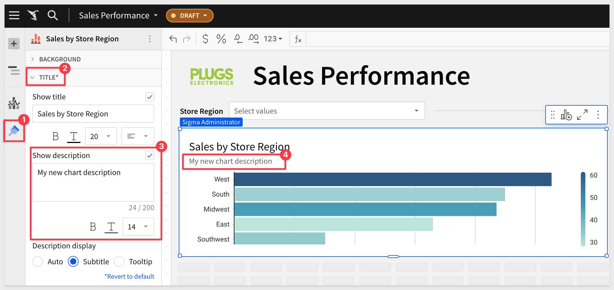
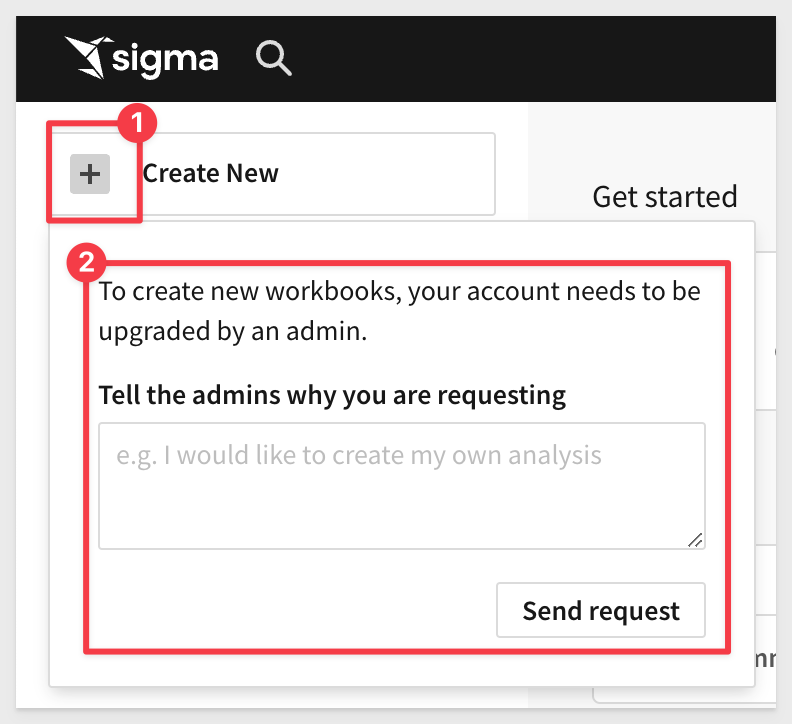

author: pballai
id: 12_2023_first_friday_features
summary: 12_2023_first_friday_features
categories: Administration
environments: web
status: Published
feedback link: https://github.com/sigmacomputing/sigmaquickstarts/issues
tags: first_friday_features
lastUpdated: 2024-01-01

<!-- 
12.08.2023: Done

--->

# (12-2023) December

## Overview 
Duration: 5 

This QuickStart lists all the new and public beta features released, as well as bugs fixed in December 2023.

It is summary in nature, and you should refer to the specific Sigma documentation links provided for more information.

**Public beta features will carry the section text "Beta".**

All other features are considered released (**GA** or generally available).

Sigma actually has feature and bug fix releases weekly, and high-priority bug fixes on demand. We felt it was best to keep these QuickStarts to a summary of the previous month for your convenience.

New first Friday features QuickStarts will be published on the first Friday of each month, and will include information for the previous month.

## Audit Logging (Beta)
Duration: 20

## Embedding
Duration: 20

### Bug Fixes:
Sigma now verifies user account type permissions and only sends version tag email requests to users granted the `Create`, `edit`, and `publish` workbooks and `Apply tag` permissions. 

Viewer-licensed users (who cannot edit workbooks or apply tags) no longer receive the requests.

Initial clicks on list control elements in embedded workbooks no longer cause the iframe display to jump to the top of the workbook.

### New postMessage event for element errors:
Elements that fail to load in embedded workbooks now trigger a postMessage event that includes the element ID, message, and API error code.

{
      type: 'workbook:chart:error';
      nodeId: string;
      message: string | undefined;
      code: string;
}

Where nodeId refers to the id of the element that failed to load in the embedded workbook, and the message and error code provide more info as to why. 

The errorCode will be one of the API error codes: 
"EEXIST" | "EPERM" | "ENOENT" | "EACCES" | "EINVAL" | "ESTALE" | "ETIMEDOUT" | "EAGAIN" | "EFBIG" | "NETWORK" | "UNKNOWN"

## Input Tables
Duration: 20

## Metrics
Duration: 20

## New QuickStarts in December
Duration: 20

### Implementing Column Level Security
[In this QuickStart](https://quickstarts.sigmacomputing.com/guide/security_column_level_security/index.html?index=..%2F..index#0), we discuss column level security and demonstrate how to apply it in Sigma, using the administrative user interface.

## Visualizations
Duration: 20

### Chart and table element descriptions:
Add descriptions to chart and table elements and display them as subtitles or tooltips. 

Navigate to to `Element format` > `Title` and select the `Show description` checkbox to enable and configure the element description:

For more information about element descriptions, see the [Sigma Community post](https://community.sigmacomputing.com/t/introducing-chart-descriptions-element-subtitles-and-tooltips/2851)

Not a member of the Sigma Community? [Sign up today!](https://community.sigmacomputing.com/)

### Vertical alignment in text elements:
Control the vertical alignment of content in text elements for improved text display. 

Go to `Element` properties and choose `top`, `center`, or `bottom` alignment.

## Workbooks
Duration: 20

### Additional entry point to license upgrade request:
When a Viewer-licensed user clicks `Create New` in the side panel, Sigma notifies them that the ability to create workbooks requires an account upgrade. 

The user can send a request to organization admins, who can then upgrade the user’s license by reassigning them to an account type with `Create`, `edit`, and `publish` workbooks permission.

## Additional Information
Duration: 20

**Additional Resource Links**

[Blog](https://www.sigmacomputing.com/blog/) 
[Community](https://community.sigmacomputing.com/) 
[Help Center](https://help.sigmacomputing.com/hc/en-us) 
[QuickStarts](https://quickstarts.sigmacomputing.com/) 
 

&emsp;
&emsp;

