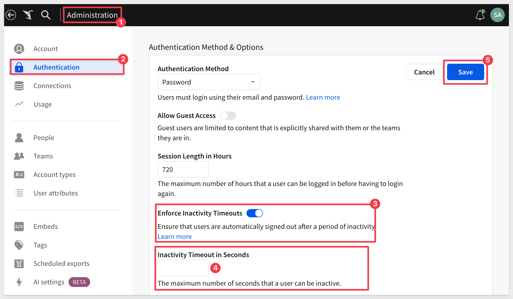

author: pballai
id: 12_2024_first_friday_features
summary: 12_2024_first_friday_features
categories: Administration
environments: web
status: Published
feedback link: https://github.com/sigmacomputing/sigmaquickstarts/issues
tags: first_friday_features
lastUpdated: 2026-01-03

# (12-2024) December 2024

## Overview 
Duration: 5 

This QuickStart lists all the new and public beta features released, as well as bugs fixed in December 2024.

It is summary in nature, and you should refer to the specific Sigma documentation links provided for more information.

**Public beta features will carry the section text "Beta".**

All other features are considered released (**GA** or generally available).

Sigma actually has feature and bug fix releases weekly, and high-priority bug fixes on demand. We felt it was best to keep these QuickStarts to a summary of the previous month for your convenience.

New first Friday features QuickStarts will be published on the first Friday of each month, and will include information for the previous month.

<!-- END OF SECTION-->

## Actions
Duration: 20

### Expanded options for actions that set control values
When configuring the `Set control value` action to update a list values control, the set control selection to setting allows you to determine whether the action replaces or adds values to the existing control selection. 

This enhancement brings flexibility to the action in support of list controls that allow multiple value selections.

For more information, see [Set control value.](https://help.sigmacomputing.com/docs/create-actions-that-manage-control-values#set-a-control-value)

<!-- END OF SECTION-->

## Administration
Duration: 20

### Mandatory two-factor authentication for accounts 
Starting **December 11, 2024**, two-factor authentication (2FA) via email will be **enabled by default for all new and existing users** that use password-based authentication. 

<aside class="positive">
<strong>IMPORTANT:</strong>  Users with SAML or OAuth authentication methods (without password options enabled) are not affected.
</aside>

This change is being implemented to protect against security threats. 2FA enhances security by adding an extra layer of protection to customer accounts.

As this is a mandatory requirement, you cannot apply for an exception to 2FA. After 2FA is enabled, it cannot be disabled.

There is no additional cost associated with enabling 2FA.

For more information, see [Mandatory two-factor authentication for accounts.](https://help.sigmacomputing.com/docs/mandatory-two-factor-authentication-for-accounts)

### Permission to restrict workbook data refresh settings
You are now able to restrict access to set an automatic refresh schedule for a workbook with a new permission, `Set workbook data refresh`. 

**Automatic refresh schedules rerun queries in an open workbook**, such as when displaying a workbook on a screen viewed without interaction. 

For more information, see [Manage workbook refresh options.](https://help.sigmacomputing.com/docs/workbook-refresh-options)

Enable the permission for account types associated with a Pro license.

For more information, see  [License and account type overview.](https://help.sigmacomputing.com/docs/license-and-account-type-overview)

### Restrict export frequency (Beta)
A new setting allows Sigma admins to restrict the frequency of scheduled exports for their organization. 

**If this setting is enabled, users also cannot set custom cron schedules.**

For more information, see [Restrict export recipients and frequency.](https://help.sigmacomputing.com/docs/restrict-export-recipients)

### Restrict export recipients to the same team (Beta)
A new setting allows Sigma admins to restrict export recipients to the same Sigma team as the user scheduling or performing the export.

For more information, see [Restrict export recipients and frequency.](https://help.sigmacomputing.com/docs/restrict-export-recipients)

### Set inactivity timeouts (GA)
You can now configure inactivity timeouts to ensure users are automatically logged out after a certain length of inactivity in the product.

For more information, see [Set up inactivity timeouts.](https://help.sigmacomputing.com/docs/set-up-inactivity-timeouts)

### Set up materialization to use dynamic tables (Beta)
If your Sigma organization has a Snowflake connection, you can configure materialization to use dynamic tables for materialization. 

**New connections to Snowflake use dynamic tables for materialization by default.**

Using dynamic tables enables incremental materialization, because dynamic tables use change tracking to determine which rows have changed, enabling Sigma to update only the rows that have changed instead of rebuilding the entire materialization. If there are no changes in the materialized table, the materialization is not run.

To set this up for an existing connection, see [Connect to Snowflake.](https://help.sigmacomputing.com/docs/connect-to-snowflake#configure-write-access) 

For more information on materialization, see [About materialization.](https://help.sigmacomputing.com/docs/materialization#incremental-materialization-with-dynamic-tables)

<!-- END OF SECTION-->

## API
Duration: 20

### New endpoint to get dataset sources
The following endpoint to get the sources associated with a dataset is now available:

[Get dataset sources](https://help.sigmacomputing.com/reference/getdatasetsources) (GET /v2/datasets/{datasetId}/sources)

### New endpoint to get version tags for a workbook
The following endpoint to get the version tags assigned to a given workbook is now available:

GET /v2/workbooks/{workbookId}/tags

[Get version tags for a workbook](https://help.sigmacomputing.com/reference/getworkbooktags) (GET /v2/workbooks/{workbookId}/tags)

### New endpoint to delete a shared template
The following endpoint to delete a shared template is now available:

DELETE /v2/shared_templates/{shareId}

[Delete a template share](https://help.sigmacomputing.com/reference/deleteexternalshare) 

<!-- END OF SECTION-->

## Bug Fixes
Duration: 20

**1:** The workbook owner’s name and the rename, move, and delete options are now no longer displayed in the embed menu to users who do not have `Can edit` access to the workbook.

**2:** All users with `Full explore` permissions can now access the `Templates` page.

**3:** Users with access to the `Templates` page can now list and search all templates and sort templates by name, owner, or last updated date.

**4:** When exporting a page or single element embed to PDF with a tag passed as part of the embed URL, the export now uses the tagged version as expected.

**5:** Modify element actions now allow you to move or swap metrics on your table or chart.

**6:** The Create a member [(POST /v2/members)](https://help.sigmacomputing.com/reference/createmember) endpoint now returns an error if the email address is not in a valid format.

**7:** Improved data label positioning for bar charts. Bar charts that use a label style of Auto see fewer overlapping labels.

**8:** The appearance of KPI charts at smaller sizes is improved.

**9:** Showing or hiding totals on a grouped table now hides the totals row for the entire grouping level, instead of only removing the total value from the row.

**10:** When hiding totals in a pivot table, totals can now be hidden if the pivot values were placed above rows or columns.

<!-- END OF SECTION-->

## Embedding
Duration: 20

### Inbound event for changing between supported workbook modes in an embed
Use the` workbook:mode:update` inbound event to change between `Explore` mode and `View mode in an embed.

For more information, see [Implement inbound and outbound events in embeds.](https://help.sigmacomputing.com/docs/inbound-and-outbound-events-in-embeds#workbookmodeupdate)

### New Inbound event for opening or closing export modals in an embed
Use the` workbook:modal:toggle` inbound event to open or close a modal in an embed. 

Currently supported modals are the `Export` modal and the `Schedule` exports modal.

For more information, see [Implement inbound and outbound events in embeds.](https://help.sigmacomputing.com/docs/inbound-and-outbound-events-in-embeds#workbookmodaltoggle)

<!-- END OF SECTION-->

## Functions / Calculations
Duration: 20

### Custom digit grouping sizes supported
You can now set custom digit grouping sizes for numerical columns, to accommodate variances between number systems.

For more information, see [Custom number formats.](https://help.sigmacomputing.com/docs/data-types-and-formats#custom-number-format)

## Visualizations
Duration: 20

### Updated default data label settings for line and area charts
When formatting `data labels` for line and area charts, a new `Auto` option is the default.

This option displays all non-overlapping labels. The `All` option displays all labels, even overlapping labels. 

Existing charts using the default option update to use the new `Auto` setting.

<!-- END OF SECTION-->

## Workbooks
Duration: 20

### Search and discovery
Any user can now recover their own deleted documents without the involvement of an admin.

For more information, see the following help pages:

[Recover deleted documents](https://help.sigmacomputing.com/docs/recover-deleted-documents)
[Recover a deleted workbook](https://help.sigmacomputing.com/docs/edit-draft-and-publish-a-workbook#recover-a-deleted-workbook)
[Recover a deleted data model](https://help.sigmacomputing.com/docs/create-and-manage-data-models#recover-a-deleted-data-model)
[Recover a deleted dataset](https://help.sigmacomputing.com/docs/create-models#recover-a-deleted-dataset)

<!-- END OF SECTION-->

## Additional Information
Duration: 20

**Additional Resource Links**

[Blog](https://www.sigmacomputing.com/blog/) 
[Community](https://community.sigmacomputing.com/) 
[Help Center](https://help.sigmacomputing.com/hc/en-us) 
[QuickStarts](https://quickstarts.sigmacomputing.com/) 
 

&emsp;
&emsp;

<!-- END OF SECTION-->
