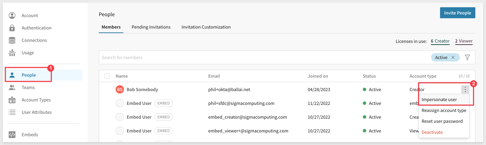

author: pballai
id: 2023_first_friday_features
summary: 2023_first_friday_features
categories: Administration
environments: web
status: Published
feedback link: https://github.com/sigmacomputing/sigmaquickstarts/issues
tags: end_of_year_compilations
lastUpdated: 2024-11-01

# 2023 Compliation

## Overview 
Duration: 5 

This QuickStart lists all the new and public beta features released, as well as bugs fixed for the year 2023.

It is summary in nature, and you should always refer to the specific [Sigma documentation](https://help.sigmacomputing.com/) links provided for more information.

**Although features may carry a "Beta" tag, they may be released by now.**

All other features are considered released (**GA** or generally available).


<!-- END OF SECTION-->

## Administration
Duration: 20

### Audit Logging (Beta)

**New connection schema and dimension tables:**<br>
The Sigma Audit Logs connection now features a `SIGMA_SHARED` schema, with dimension tables containing information about your Sigma organization's resources, objects, assets, etc.


The dimension tables can be joined with the AUDIT_LOGS table to add context to audit log events. 

For example, join AUDIT_LOGS with the DOCUMENTS table to add document attributes (e.g., creation date, document path, and archive status) to event entries related to user interactions with workbooks, datasets, etc.


**List of New Dimension tables:**
  <ul>
     <li><Strong>CONNECTIONS:</Strong> Connection attributes</li>
     <li><Strong>DOCUMENTS:</Strong> Document attributes (for folders, workbooks, datasets, etc.)</li>
     <li><Strong>SCHEDULED_NOTIFICATIONS:</Strong> Notification attributes for scheduled exportss</li>
     <li><Strong>SENDGRID_LOGS:</Strong> Email attributes for exports</li>
     <li><Strong>TEAMS:</Strong> Organization team attributes</li>
     <li><Strong>USERS:</Strong> Organization user attributes</li>
</ul>

### Audit Log `SIGMA_SHARED` schema additions
The `SIGMA_SHARED` schema in the Sigma Audit Logs connection now features the following dimension tables containing information about your organization:

**TEAM_MEMBERS:**<br>
Organization team member attributes


**DOCUMENT_ELEMENTS:**<br>
Workbook element and page attributes


These new tables can be joined with the AUDIT_LOGS table to add context to audit log events.

[Documentation on Audit Logging is here:](https://help.sigmacomputing.com/docs/access-and-explore-audit-logs)

[There is a QuickStart on using Audit Logs here:](https://quickstarts.sigmacomputing.com/guide/administration_audit_logging/index.html?index=..%2F..index#0)

### Bulk actions for admins
In order to improve the admin experience and provide admin functionality at scale, numerous actions can now be performed in bulk. 

  <li></li>
    <li><Strong>User Management:</Strong> </li>
    <li>
        <ul>
           <li>Bulk password reset</li>
           <li>Bulk invite resend</li>
           <li>Bulk invite delete</li>
           <li>Bulk reactivate disabled users</li>
        </ul>
    </li>
</ul>

  <li></li>
    <li><Strong>Team Management:</Strong> </li>
    <li>
        <ul>
           <li>Bulk add team members</li>
           <li>Bulk team member transfer</li>
           <li>Bulk remove members from team</li>
           <li>Bulk team delete</li>
        </ul>
    </li>
</ul>

  <li></li>
    <li><Strong>User Attributes and Exports:</Strong> </li>
    <li>
        <ul>
           <li>Bulk delete of User Attributes</li>
           <li>Bulk delete of Scheduled Exports</li>
        </ul>
    </li>
</ul>

### Column-Level Security (Beta)

<aside class="positive">
<strong>IMPORTANT:</strong><br> This feature is currently in Beta and subject to quick, iterative changes. As a result, the latest product version may differ from the contents of this document.
</aside>

Column-Level Security provides granular control over data access allowing you the flexibility to restrict or grant access to column-level data. This ensures that the security of sensitive or confidential information is only accessible to authorized users.  Column-Level Security (CLS) is managed through team membership and user attributes.  

**Column-Level Security provides the following benefits:**

 <ul>
      <li><strong>Data Protection:</strong> Secures columns that contain sensitive information.</li>
      <li><strong>Data sharing and collaboration:</strong> Organizations can share specific columns with external parties or partners without exposing the entire dataset.</li>
      <li><strong>Data Confidentiality in Multi-Tenant Environments:</strong> In multi-tenant systems or cloud-based environments, where multiple clients or orgs share the same infrastructure, CLS ensures that each tenant's data remains isolated and protected from other tenants.</li>
      <li><strong>Data Masking and Anonymization:</strong> Combine CLS with data masking and anonymization techniques to protect sensitive data, while allowing certain authorized users to work with pseudo or obfuscated values.</li>
</ul>

### Connect to MySQL (BETA)
You can now connect Sigma directly to your data in a MySQL data warehouse. Learn how to create and manage the connection in Connect to MySQL.


### Custom Home Pages (Beta)

<aside class="positive">
<strong>IMPORTANT:</strong><br> This feature is currently in Beta and subject to quick, iterative changes. As a result, the latest product version may differ from the contents of this document.
</aside>

Sigma Admins can designate a workbook to use as a custom homepage for an organization or team. The first page of the workbook becomes the custom homepage. 

A custom homepage functions as a landing page for its viewers. 

Think of this like an embedded Sigma workbook on your landing page, inside Sigma!

An organization can have multiple custom homepages, assigned to different teams.

Use a custom homepage to provided targeted content, educate, link to other content and more.

For example, when you are first rolling out Sigma to your users, you may want everyone to see some training content or other important information. A custom homepage is a great way to do this and can be changed later, as your needs evolve. 

For example, let's say you want all users to see Sigma's foundational QuickStarts on the homepage. 

First, we need to create a new Workbook in Sigma, with buttons that link to each QuickStart we want. 

That workbook might look something like this:


In this workbook, each blue button links to a different workbook, and each of those has the `Embed` element on the page. 

The embed element is configured to load the desired QuickStart. For example, for the `Getting Started` button, the configuration looks like this:


The other workbook that is being loaded for the `Page` looks like this (in edit mode). 


There is one additional workbook for each button.

Last, we need to tell Sigma which users we want to assign this new custom home page to. 

Navigate to `Administration` > `Account` and click the `Enable` button for `Custom Home Pages`:


In this example, we will just assign it to `All members of your Sigma organization`:


When a user clicks on one of the buttons, they stay inside Sigma, but can review external content. In this case, the external content is a Sigma QuickStart:


<aside class="negative">
<strong>NOTE:</strong><br> Anything you can create in a Sigma workbook can be used in a custom home page. Let your imagination run wild!
</aside>

### New permission in Account Types
This new permission provides the option to restrict or grant folder creation permissions. To configure this go to `Administration` > `Account Types` > `Create New Account Type`.

To learn how to configure federated access in Sigma, [refer to this QuickStart.](https://quickstarts.sigmacomputing.com/guide/embedding_how_to_federate_access_with_sigma/index.html?index=..%2F..index#0)

### Native JSON support for BigQuery
Sigma provides full native support for the JSON data type in BigQuery connections. This enables you to process and analyze semi-structured data effectively. For details on how to use JSON, see Google documentation on [Working with JSON data in GoogleSQL](https://cloud.google.com/bigquery/docs/json-data).

### Remove Team Members in Bulk
Admins can now remove multiple members of a team using a bulk action. To remove team members in bulk, go to your `Administration` > `Teams` > select a team > select members to remove > and click the `Remove` from team button.

For more information about managing teams, [see Manage Teams.](https://help.sigmacomputing.com/docs/manage-teams)

### Reset Password for Users in Bulk
Admins can now initiate a password reset for multiple users with a bulk action setting. The selected users receive an email alerting them to reset their password. 

### User Attribute assignment for org members:
Prior to this feature, administrators had to create a Sigma Team in order to assign specific attributes to users, who needed to be a member of this team.

Sigma now supports assigning specific user attribute values directly to users. 

For example, the user `Finance TestUser` has the Attribute `Region` set to the value `East`. This attribute will be used to filter data automatically, to the "East" region.


### User Impersonation
Administrators can now impersonate users from the Team page in the Admin portal. 

Previously, admins could only impersonate a user from the People page. 

The Impersonate Users feature provides admins with ability to impersonate a user and view, edit, access Sigma resources based on the user's account type.

<aside class="negative">
<strong>NOTE:</strong><br> Impersonate users is unavailable for organizations that use OAuth for authentication.  
</aside>



To stop impersonation:


To learn more about user impersonation [click here.](https://help.sigmacomputing.com/docs/impersonate-users)

### Warehouse Views
Workbook warehouse views are now generally available **(GA)**. 

Warehouse views are **virtual tables in Snowflake** that you can query using Sigma or any other application in your data ecosystem. 

Instead of storing data in a Snowflake database table, a view saves a SQL statement that expresses specific query logic defined by the data element or input table in Sigma.

Warehouse views can be very useful, depending on the use case:

 <li>
    <ol type="n"> 
      <li><strong>Simplification:</strong> They can simplify complex queries. You can create a view that presents a subset of your data or pre-aggregates data, so users can run simpler queries.</li>
      <li><strong>Security:</strong> You can use views to restrict the data that users can access. For example, you can create a view that excludes sensitive data and gives users access to the view instead of the base tables.</li>
      <li><strong>Consistency:</strong> If you have a complex calculation that is used in many queries, you can include that calculation in a view to ensure it's consistently applied.</li>
      <li><strong>Performance:</strong> In some cases, views can improve performance. For example, if you regularly run a complex, resource-intensive query, you would materialize that data and use a warehouse view to fetch the results of the query, reducing the computational load for subsequent runs.</li>
    </ol>
  </li>

[Review the FAQ for common questions.](https://www.sigmacomputing.com/product-faqs)


<aside class="positive">
<strong>IMPORTANT:</strong><br> When you create a warehouse view, you establish a live link between Snowflake and Sigma. The view references the data element or input table as the source of truth and automatically updates to reflect the most recent version of the element’s underlying data.
</aside>


The warehouse view is created and you are able to check the status [See Warehouse view status](https://help.sigmacomputing.com/docs/review-warehouse-view-details#warehouse-view-statuses)


You are able to access all of the available warehouse views under `Administration`:


For more information, see [Create and manage workbook warehouse views](https://sigma.bi/create-and-manage-workbook-warehouse-views) and [Review warehouse view details](https://sigma.bi/review-warehouse-view-details)


<!-- END OF SECTION-->

## API
Duration: 20

### Auto-select input table connection and schema:
When an embed user creates an input table, Sigma **automatically** selects the connection and write schema if the user only has access to a single connection with one schema. 

This update bypasses the `Select a connection` requirement when applicable, providing a more simple and streamlined user workflow. 

### Bug Fixes

`POST /v2/teams` API no longer limits the number of team members returned.

### Connections
The `/v2/connections` endpoint now returns the following connection metadata fields:
```plaintext
{
  "account": "string",
  "warehouse": "string",
  "user": "string",
  "role": "string",
  "timeout": {
    "default": 0,
    "worksheet": 0,
    "dashboard": 0,
    "download": 0
  },
  "poolSizes": {
    "adhocPoolSize": 0,
    "catalogPoolSize": 0,
    "resultPoolSize": 0,
    "schedulePoolSize": 0
  },
  "writeAccess": boolean,
  "friendlyName": boolean,
  "writeDatabase": "string",
  "writeSchema": "string",
  "materializationWarehouse": "string"
}
```

### New endpoint: Teams
Returns a paginated list of team members and can be used to identify team admins, based on a unique identifier (teamId)

GET /v2/teams/{teamId}/members

```code
curl -X GET "https://api.sigmacomputing.com/v2/teams//members" \
 -H "accept: application/json" \
```

[Try it in Swagger](https://docs.sigmacomputing.com/?_gl=1*1clytiy*_ga*MTAyNTE4NzQ5NC4xNjg3NTUxNjQ5*_ga_PMMQG4DCHC*MTY5NjU0NzIxMy4yNDkuMS4xNjk2NTQ3MjI3LjQ2LjAuMA..#get-/v2/teams/-teamId-/members)

### Changes to endpoints

**1:** The `GET /v2/workbooks/{workbookId}/embeds` method now includes `public` in the response to indicate if the embed is an application or public workbook.

[Documentation Link:](https://docs.sigmacomputing.com/api/v2/#get-/v2/workbooks/-workbookId-/embeds)


**2:** The `GET /v2/workbooks/{workbookId}/controls` method returns the name and value-type for all Sigma `Controls` present in the specified workbook:


[Documentation Link:](https://docs.sigmacomputing.com/api/v2/#get-/v2/workbooks/-workbookId-/controls)

**3:** A new parameter, `userKind`, is now available for the `Update a Member in Your Organization` endpoint. This parameter defines the type of user. 

The three possible values are `guest`, `internal`, or `embed`. 

**4:** The **/v2/workbooks/{workbookId}/queries** endpoint now returns elementName. 

**5:** The **/v2/workbooks/{workbookId}/pages/{pageId}/elements** endpoint now returns name and columns.   

**6:** The **/v2/workbooks/{workbookId}/pages/{pageId}/elements** now returns visualization Type.  

### Members
You can now use the `PATCH /v2/members/{memberId}` endpoint to reassign specific documents when you archive a member. In the request body, set `isArchived`` to `true`, and set `newOwnerId` to the member who will receive the documents from the archived member.

### Workbooks
Workbooks enable you to manage specific tasks within your system. When you create a new workbook using the `POST /v2/workbooks` endpoint, you can assign an owner by passing the `ownerId` in the request body. 

If you don't include this, the owner is the user whose token was used to call the API.

A new query parameter is also available for this endpoint: `versionTagId`. For more information on using Sigma version tagging, [click here](https://quickstarts.sigmacomputing.com/guide/embedding_8_version_tagging/index.html?index=..%2F..index#0)


## Bug Fixes
Duration: 20

Bug releases are broken down by week for specificity.

### Week ending 8.04.2023
<ul>
      <li>Embeds no longer display bookmarks or document versions in the scheduled exports modal.</li>
</ul>

### Week ending 8.11.2023
<ul>
      <li>The footer is now hidden for embedded workbooks, including tagged versions, if you set the "show_footer" parameter to "false".</li>
</ul>

### Week ending 8.18.2023
<ul>
      <li>Circular markers in scatter plot size legends are no longer distorted.</li>
</ul>

### Week ending 8.25.2023
<ul>
      <li>none</li>
</ul>

### Week ending 8.31.2023
<ul>
      <li>Resolved an issue with page tab names exported to Excel.</li>
</ul>

### Week ending 7.07.2023
No release notes during this period.

### Week ending 7.14.2023
 
 <ul>
      <li>Images in emails sent using Sigma are improved and more readable.</li>
      <li>Keyboard navigation in input tables is no longer disabled after the Hide column keyboard shortcut (shift+H) is applied. </li>
      <li>Linked input tables no longer create duplicate records when one or more users edit the same row in multiple browser tabs.</li>
      <li>Custom domain settings in region maps now modify color scales as intended.</li>
</ul>

### Week ending 7.21.2023
 
 <ul>
      <li>We resolved an embed issue where visualizations failed to render in certain scenarios.</li>
 </ul>

### Week ending 7.28.2023

 <ul>
      <li>In some cases, setting up dynamic roles in a Snowflake connection resulted in an error. </li>
      <li>If you copy an element in an embed document, it no longer returns an error. </li>
      <li>Resolved an issue with expanding rows and single element exports.</li>
      <li>Resolved an issue where choosing Edit Join in the source of the join deselected all selected columns.</li>
      <li>Resolved an issue where Display Values for Boolean list controls did not show by enabling users to create a manual list of display values for Boolean controls and adding their own interpretation of True and False.</li>
      <li>Resolved an issue causing input table elements to continuously display the "Saving" spinner after input table edits were successfully saved in the workbook's Published version. Users no longer need to reload the browser page to clear the spinner</li>
</ul>

### Week ending 6.30.2023
 <ul>
      <li>Resolved an input table issue that caused the Data validation modal to close when a date was selected from the date picker.</li>
      <li>Resolved an input table issue that appended numbers to unique key column names (e.g., Account ID (1)).</li>
</ul>

### Week ending 6.23.23
 <ul>
      <li>When allow_export_boolean isn't set or is set to false in an application embed, users no longer see an option to export in the workbook. </li>
      <li>The POST /v2/members endpoint for orgs using OAuth now functions correctly.</li>
      <li>Resolved an issue that prevented column auto-select when additional targets were added to controls. When one or more targets exist, new targets now default to the same column applied to the first target element.</li>
</ul>

### Week ending 6.15.23
 <ul>
      <li>Resolved an issue that changed the height of table elements when the browser width was adjusted.</li>
      <li>Resolved an issue that added excess empty canvas space in page-level PNG images attached to scheduled exports.</li>
</ul>

### Week ending 6.9.23
 <ul>
      <li>Resolved an issue that caused some embeds to display in mobile mode rather than desktop.</li>
      <li>Materialization status updates correctly when clicking Materialize now in the Materialization schedules page.</li>
      <li>Resolved an issue that caused unintentional duplicate records in linked input tables when one or more users edited the same input table row in multiple browser tabs.</li>
      <li>Resolved an issue that intermittently prevented input table cell edits from persisting.</li>
      <li>Resolved an issue that caused the active input table cell to appear beneath the element’s horizontal scrollbar when a user edited a row towards the bottom of the table.</li>
</ul>

### Week ending 6.2.23
 <ul>
      <li>Resolved an issue with pivot table rows not displaying.</li>
      <li>Resolved an issue when using Send Now in the Schedule Export modal screen.</li>
      <li>The show_footer parameter failed for encoded single-page embeds. </li>
      <li>Added column re-sizers to the first row in pivot tables to resolve issues preventing column resizing when no header row exists.</li>
      <li>Resolved issue causing pivot table titles to be hidden when the element was resized to an arbitrary height.</li>
      <li>Resolved issue that disabled pivot table title editing after the value placement was moved from the Pivot columns property to the Pivot rows property.</li>
</ul>


<!-- END OF SECTION-->

## Embedding
Duration: 20

### Bug Fixes:
**1** Sigma now verifies user account type permissions and only sends version tag email requests to users granted the `Create`, `edit`, and `publish` workbooks and `Apply tag` permissions. 

**2** Viewer-licensed users (who cannot edit workbooks or apply tags) no longer receive the requests.


**3** Initial clicks on list control elements in embedded workbooks no longer cause the iframe display to jump to the top of the workbook.


**4** The PDF export feature now executes successfully in user-backed embeds.

**5** Administrators can now view all scheduled exports for published and tagged versions at the workbook level. Schedule views are no longer impacted by version permissions granted to users who create the schedules.

**6** When a user configures an export for a tagged workbook version and doesn’t have access to the source workbook, the document version or bookmark field in the `Send Now` or `Schedule Exports` modal now defaults to the current version. The field no longer defaults to “Invalid selection.”

**7** Use of the API to generate a public embed for workbook elements no longer results in a broken link.

**8** The embed menu now updates the workbook owner when ownership is reassigned.

**9** Resolved an issue that prevented users from deleting hidden pages in workbooks.

**10** When swapping the source of a tagged workbook version, the `Sources` of tagged workbook dropdown now excludes connections with a different Cloud Data Warehouse or Database Management System provider as the initial source.

### Dynamic Connection & Role Switching (DRS) 
allows run-time swapping of the Snowflake Warehouse and Role for a Sigma connection. There are ways to leverage this using one or both Warehouse and/or Role along with different methods to restrict data access in Snowflake itself.

[Please refer to this QuickStart on how to implement dynamic role switching with Snowflake](https://quickstarts.sigmacomputing.com/guide/embedding_7_dynamic_role_switching_snowflake/index.html?index=..%2F..index#0) using User Attributes defined in Sigma, with an Application Embed.

To learn more about dynamic role switching with Snowflake, [click here.](https://help.sigmacomputing.com/docs/configure-user-attributes-on-a-snowflake-connection#role-attribute)

### Convert Embed Users to Standard
Admins can now convert Embed users to Standard, or vice versa. If you convert an Embed user to Standard, you must define their Account Type. 


### Enhancements
 <ul>
      <li>When a user downloads a CSV from an embed, a status bar now appears at the bottom of the screen.</li>
      <li>Users can now copy and paste elements in an embed.</li>
</ul>

### Embed Parameters
The following optional user-backed embed parameters are now available:
<ul>
      <li><strong>show_workbook_name:</strong> A boolean value that displays the workbook name near the folder icon.</li>
      <li><strong>menu_position:</strong> Allows you to change the position of the toolbar to top, bottom, or none.</li>
</ul>

The `:show_footer` embed parameter is now case-insensitive, for example: `allow :show_footer=False`.


### Embed Sandbox is now generally available. 

For more information, [see Embed Sandbox.](https://help.sigmacomputing.com/docs/embed-sandbox)


### Embed sandbox URL syntax:
Sigma no longer automatically adds colons (:) to separate parameters in the embed sandbox URL. 

For example, if you enter `param1=value1 param2=value2` in the `Other Parameters` field, the URL is appended with `?param1=value1&`   
`param2=value2` 

Previously, the URL would be appended with `?:param1=value1&:param2=value2`.

### New optional interface parameters:
We have added three new parameters to the embedding API. 

[You can review all the available parameters here.](https://quickstarts.sigmacomputing.com/guide/embedding_howto_leverage_parameters_and_ua/index.html?index=..%2F..index#0)

 <ul>
      <li><strong>use_user_name:</strong> Displays the workbook creator’s name (instead of email) in embed menus and system-generated emails.</li>
      <li><strong>first_name:</strong> Sets the first name of the current embed user.</li>
      <li><strong>last_name:</strong> Sets the last name of the current embed user.</li>
</ul>

**use_user_name** displays the workbook creator's name (instead of email) in embed menus and system-generated emails.

The **first_name and last_name** (have to use both) parameters replace the default name (“Embed User”) that is shown in Administrative and other interfaces.

If both `first_name` and `last_name` parameters are absent, the current user keeps their current name (or, if a new user is created, their first name will be set to Embed, last name to User)

### New optional parameter
The parameter, **disable_mobile_view** for user-backed embeds is available. If this parameter is set to yes, workbooks won't automatically resize to the mobile layout.

<aside class="negative">
<strong>NOTE:</strong><br> The optional parameter "disable_mobile_view" is only available after upgrading a workbook to the new grid layouts and is not supported in the Classic layouts.
</aside>

### New postMessage event for element errors:
Elements that fail to load in embedded workbooks now trigger a postMessage event that includes the element ID, message, and API error code.

{
      type: 'workbook:chart:error';
      nodeId: string;
      message: string | undefined;
      code: string;
}

Where nodeId refers to the id of the element that failed to load in the embedded workbook, and the message and error code provide more info as to why. 

The errorCode will be one of the API error codes:<br>
"EEXIST" | "EPERM" | "ENOENT" | "EACCES" | "EINVAL" | "ESTALE" | "ETIMEDOUT" | "EAGAIN" | "EFBIG" | "NETWORK" | "UNKNOWN"

### New parameters available:
We added the following optional parameters for user-backed embeds. 

<ul>
      <li><strong>hide_menu:</strong> If set to True, hides the menu in the bottom-left for saved workbooks.</li>
      <li><strong>hide_send:</strong> If set to True, hides the Send now option in the menu for saved workbooks.</li>
      <li><strong>hide_schedule:</strong> If set to True, hides the Schedule exports option in the menu for saved workbooks.</li>
</ul>

[For more information about using embed parameters with Sigma, please refer to this QuickStart.](https://quickstarts.sigmacomputing.com/guide/embedding_05_leverage_parameters_and_ua/index.html?index=..%2F..index#0)

### Version Tagging
Version Tagging is now generally available. For more information, see [Version Tagging](https://help.sigmacomputing.com/docs/version-tagging)

**Summary:**<br>
Version tagging allows you to employ a software development cycle to control workbook versions using tags. For example, orgs can have a development, staging, and production version of a workbook and migrate changes as needed. This allows you to control which workbook versions are viewable by your users. 

When you create a tag and assign it to a workbook, you essentially freeze the state of that workbook. The process of tagging a workbook creates a duplicate that can be shared with other stakeholders and users.  

For example, you can create a Production tag and assign it to a workbook that's used by embed users, guests, or other Sigma end users. Moreover, you can tag additional versions of the same workbook such as Development or Staging. These versions can be used by different stakeholders in your org for review purposes. Once reviewed, you can migrate this copy to Production for your users. 

One of the benefits of this solution is your org can modify a Development workbook without affecting the experience of your customers who use the Production version. Once you complete your developmental changes, you can easily update the Production version of the workbook.

If you are interested in Version Tagging in an embedded scenario, [please refer to this QuickStart.](https://quickstarts.sigmacomputing.com/guide/embedding_8_version_tagging/index.html?index=..%2F..index#0)


### Version Tagging for Embed Sandbox

Admins can now use version tags with embeds, in the embed sandbox. 

This allows you to test before using them in your production environment.

For example:


### Write-only data permission:
Sigma provides access and capabilities based on a cumulative set of permissions inherited or granted at different levels of the data architecture (connection, schema, database table) and organizational structure (organization, team, user).

We have added an additional permission level to the list of permissions that already exist.

The `Can write only` permission restricts access to data while enabling users to create input tables and CSV upload that write data to the connection’s write-back destination. This permission type is ideal for enabling input tables and CSV uploads in embedded workbooks with restricted data access.

For more information about the new permission type, see [Data permissions overview.](https://help.sigmacomputing.com/hc/en-us/articles/24087589760659)


<!-- END OF SECTION-->

## Filters and Controls
Duration: 10

### Segmented controls:
A segmented control provides a "linear strip" of two or more named segments. 

Each segment acts exactly like a radio button, selecting the matches and excluding other data records. 

When you have to make selections from a long list of values, segmented controls can be a better option because they provide a smaller subset of relevant values, a more economical dashboard layout, and a nicer overall experience for viewers.

**There are two types of segmented controls:**
Based on a manually-entered list. You must have values that select data on the target of the control.


Based on a column in the data source or workbook element. These controls can have a maximum of 5 distinct values, sorted on record count or alphabetically.


### Tabular data in list filters and controls:

List filters and controls now support input copied from tabular formats! 

You are now able to copy multiple cell values from Excel, Google Sheets, Sigma tables, etc., and paste them in the Search field. 

The input is automatically comma-delimited, enabling you to filter it as multiple distinct values.

This feature will save users lots of time when the need to search for a long list of items is required.

Suppose we want to search a 4M row table for just a list of target `Order Numbers`. Instead of using the order number filter, and picking them one at a time (really impractical), you can just paste the list into the search field and you are done!. **VERY COOL** time saver:


### Controls
You can use the new `Create list` from preset option to easily create a drill down control for a visualization that has year, month, and day categories, without manually creating them. 


<!-- END OF SECTION-->

## Functions / Calculations
Duration: 20

### ArraySlice Function
ArraySlice takes any array  and extracts a subarray given starting location/index and desired length. The length is optional field here. So if this is absent, then the entire array starting at start location will be returned.

It can take dynamic values, meaning you can choose different starting indices and different lengths for each row.

If you specify starting location negative then it will consider it from the back of the array. So if you want to extract last element, just type ArraySlice([array], -1)

### ArrayDistinct function added
 <strong>[ArrayDistinct](https://help.sigmacomputing.com/docs/arraydistinct)</strong> - Returns the array without duplicate values.<br>

To learn more about array functions, [click here](hhttps://help.sigmacomputing.com/docs/array-functions-overview)


### Custom Functions (Beta)
<aside class="positive">
<strong>IMPORTANT:</strong><br> This feature is currently in Beta and subject to quick, iterative changes. As a result, the latest product version may differ from the contents of this document.
</aside>

Use custom functions in your Sigma practice to encode business logic centrally, instead of repeating it, or have users create their own (potentially with errors). Encapsulate complex calculations that are common business use cases for easier use, and to expose your proprietary warehouse functions and make them more consumable. 

Custom functions are part of Sigma `Administration`, and under `Account` > `Custom Functions`:


For a simple example, let's say we want to create a standard way to calculate margin that all Sigma's users (who have the appropriate rights) can use.

We simply `Add` a new `Custom Function` and define it as:


Setting the slide control to `On` (shown in blue) for `Include function in formula bar suggestions` will give users the same functionality when creating new calculations, as if this new custom function was Sigma standard.

The user can simply start typing the function name in the formula bar as usual (in this case, the name is `PlugsMargin`). 

Sigma prompts the user to identify which column should be used for each required value in the custom function, but the user does not need to know or worry about the details of the underlying calculation; it just works. The column names selected do not even have to have matching names.


The user is made aware that this is a custom function by the bubble with the title "Custom" in the function help, as shown above.

<aside class="positive">
<strong>IMPORTANT:</strong><br> Custom functions unlock the world of capabilities for Sigma users. For example, let's say your data science team has created User Defined Functions in Snowflake, using Python. Custom functions can be created to leverage those into functions that are accessible to Sigma users in the same way we just demonstrated above, but without any knowledge of the underlying complexity. This can be extremely powerful.
</aside>

### DateLookback function (Beta)
Sigma has added a new function that makes it easy to compare one column's value with another when working with dates.

For example, let's assume we have a table that includes an `Annual Gross Profit` column containing the gross profit for each year between 2019 and 2023. 

We can use the `DateLookback` function to return the previous year’s gross profit and facilitate a period-over-period analysis. 

We simply use this formula in a new column:

```code
DateLookback([Annual Gross Profit], [Year], 1, "year")
```

The formula above determines a one-year offset from the period in the `Year` column, then references the offset period and returns the corresponding value from the Annual Gross Profit column. 

The results look like this:


The `DateLookBack` > `Period` can be and of these values:

"year", "quarter", "month", "week", "day", "hour", "minute", or "second"

### Financial functions added
Sigma has added support (based on customer feedback) for a few specific functions that are critical for financial calculations. They include:

 <strong>[CAGR](https://help.sigmacomputing.com/docs/cagr)</strong> - Returns the compound annual growth rate of an investment.<br>
 <strong>[Effect](https://help.sigmacomputing.com/docs/effect)</strong> - Returns the effective annual interest rate.<br>
 <strong>[FV](https://help.sigmacomputing.com/docs/fv)</strong> - Returns the future value of an investment.<br>
 <strong>[Nominal](https://help.sigmacomputing.com/docs/nominal)</strong> - Returns the nominal annual interest rate.<br>
 <strong>[NPer](https://help.sigmacomputing.com/docs/nper)</strong> - Returns the number of periods for a loan or investment based on known amount, interest rate, and periodic payment amount.<br>
 <strong>[Pmt](https://help.sigmacomputing.com/docs/pmt)</strong> - Returns the periodic payment for a loan based on the amount, number of periods, and constant interest rate.<br>
 <strong>[PV](https://help.sigmacomputing.com/docs/pv)</strong> - Returns the present value of a loan or an investment, when using constant and regular periodic payments.<br>
 <strong>[XNPV](https://help.sigmacomputing.com/docs/xnpv)</strong> - Returns the net present value of an investment for payments or incomes at irregular intervals.<br>


### Geographic functions added
Sigma added support for the Geography data type, and the corresponding set of 

 <strong>[Area](https://help.sigmacomputing.com/docs/area)</strong> - Calculates the area of a geography, in specified units.<br>
 <strong>[Centroid](https://help.sigmacomputing.com/docs/centroid)</strong> - Calculates the geographic center of a geography.<br>
 <strong>[Distance](https://help.sigmacomputing.com/docs/distance)</strong> - Calculates the minimum distance between two geographies, in specified units.<br>
 <strong>[Intersects](https://help.sigmacomputing.com/docs/intersects)</strong> - Determines if one geography intersects another geography.<br>
 <strong>[Latitude](https://help.sigmacomputing.com/docs/latitude)</strong> - Returns the latitude component of a point.<br>
 <strong>[Longitude](https://help.sigmacomputing.com/docs/longitude)</strong> - Returns the longitude component of a point.<br>
 <strong>[Geography](https://help.sigmacomputing.com/docs/geography-functions-overview)</strong> - Converts data in GeoJSON or WKT formats into the Geography data type.<br>
 <strong>[Json](https://help.sigmacomputing.com/docs/json)</strong> - Converts the Geography data type into GeoJSON format.<br>
 <strong>[MakePoint](https://help.sigmacomputing.com/docs/makepoint)</strong> - Constructs a point from latitude and longitude data.<br>
 <strong>[MakeLine](https://help.sigmacomputing.com/docs/makeline)</strong> - Constructs a line from a series of points and line segments.<br>
 <strong>[Perimeter](https://help.sigmacomputing.com/docs/perimeter)</strong> - Calculates the perimeter of a geography, in specified units.<br>
 <strong>[Text](https://help.sigmacomputing.com/docs/text)</strong> - Converts the Geography data type into WKT format.<br>
 <strong>[Within](https://help.sigmacomputing.com/docs/within)</strong> - Determines if one geography is fully within another geography.<br>

 [Geography functions overview](https://help.sigmacomputing.com/docs/geography-functions-overview)


### Metrics
Metrics are custom aggregate calculations that you can reuse across workbook data elements that share the same data source: a dataset or a connection table

We have added search functionality to find reusable metrics saved to datasets and connection tables, to save your valuable time.


For more information, [see Using Metrics](https://help.sigmacomputing.com/docs/create-and-manage-metrics).

### New financial functions
To complement the Pmt (payment) function that calculates the size of a loan repayment with a constant interest rate and equal installments, Sigma added two more financial functions:

  <ul>
    <li><strong>IPmt (interest payment):</strong> calculates the part of a loan payment that is allocated to the compounding interest on the loan.</li>
    <li><strong>PPmt (principal payment):</strong> calculates the part of a loan payment that is allocated to reducing the principal owed.</li>
  </ul>


### Passthrough functions added
You can also use two new Passthrough functions to support the Geography data type:

 <strong>[AggGeography](https://help.sigmacomputing.com/docs/agggeography)</strong> - Calls a warehouse aggregate function that returns a Logical data type; aggregation version of CallGeography.<br>
 <strong>[CallGeography](https://help.sigmacomputing.com/hc/en-us/articles/17798618502931-CallGeography)</strong> - Calls a warehouse function that returns a Geography data type.<br>


### Regular expression (RegExp) text match filtering
We have added a new RegExp text match filter to enable you to filter text columns, based on specified patterns. 

These included text strings, character classes, ranges, etc. 

These filters support the RegExp syntax and behavior of the connected CDW or DBMS.

You can either match or not match:

**Matches RegExp:** Includes values that match one or more specified patterns.

**Does not match RegExp:** Excludes values that match one or more specified patterns.

For example, if you want to only see items in the `Product Line` that contain the text `TV` or `4K`:


<aside class="negative">
<strong>NOTE:</strong><br> You can use the "disjunction operator (|)" to filter multiple values. For example, abc|xyz filters values that contain “abc” or “xyz.”
</aside>

### Repeat Function Added
The Repeat function returns the results of repeating a string a specified number of times.

For example, adding these five new columns:
```plaintext
Repeat([Product Type],0)
Repeat([Product Type],1)
Repeat([Product Type],2)
Repeat([Product Type],3)
Repeat([Product Type],-1)
```

...will return the following values for the Product Type column:


Repeat is one of the [Text functions](https://help.sigmacomputing.com/docs/callgeography) supported by Sigma.

### VariancePop
The VariancePop function calculates **population variance**, which determines the spread of distribution or degree to which the column or grouped values deviate from the mean. 

The addition of this function complements the existing Variance function, which estimates sample variance. For more information about these functions and when to use each, see [VariancePop](https://help.sigmacomputing.com/hc/en-us/articles/23724296595859) and [Variance.](https://help.sigmacomputing.com/hc/en-us/articles/23724255727123)

For example, assuming a table contains the average temperature recorded for each month in 2021 and 2022, the following formula will calculate the temperature variance for each year (years being grouped):
```code
VariancePop([Avg monthly temp])
```


<!-- END OF SECTION-->

## Input Tables
Duration: 20

### Calculation Columns
Input tables now support `Calculation Columns`.

Calculation columns allow you to use formulas to populate input table column data. 

To utilize a calculation column, open the element menu, select `Add new column` > `Calculation`, then enter a formula in the formula bar.


### Checkbox column type in input tables
Input tables now support a checkbox column type in place of the logical type. 

To update these to the Checkbox type, open the `column menu` and select `Change column type` > `Checkbox.` 

`True` values convert to selected checkboxes, while `False` values convert to cleared checkboxes. 

Checkboxes enable additional workflow capabilities by simply capturing a "yes/no" response from a Sigma user. For example, record approvals, validations and enabling data triggers based on the user's response.


### Conditional formatting in input tables
We have added the ability to apply rules based on specified conditions to format single colors, color scales, or data bars in input table columns. 

Conditional formatting is accessed in the  `Element` format panel, or open a `column menu` and select `Conditional formatting`:

<br>

In this example, `FY23Forecasts` cell is red when the `At Risk` checkbox in the corresponding cell is checked on:


### Conditional formatting is now available for input tables
You may now apply conditional formatting to Input Tables in a similar fashion as you would typical tables, using conditional formatting rules.


<br>
<br>


### Data autofill in input tables
Input tables (and individual columns) now support autofill, which will save users time in certain use cases.

Select a cell or range of cells, then drag the fill handle (blue box in the lower right corner of the selection) to highlight adjacent cells you want to populate. 

Sigma automatically fills the highlighted cell or range with data based on the selected values and patterns. 

For text and checkbox columns, Sigma repeats the selected cell values. 

For number and date columns, Sigma projects values to continue a patterned sequence (like consecutive numbers or incremental dates). 

If no pattern is detected, it repeats the selected cell values.


### Databricks Support
Input tables are now compatible with Databricks connections. These dynamic workbook elements support structured data entry that allows you to integrate new data points into your analysis and augment existing data from Snowflake or Databricks. 

To review how Input Tables solves several common use cases, [check out this QuickStart](https://quickstarts.sigmacomputing.com/guide/input_tables_use_cases/index.html?index=..%2F..index#0)

### Duplicate Columns
You are now able to duplicate columns in input table elements the same way you can in table and pivot table elements.

Click the caret () in the column header to open the column menu, then select `Duplicate column.`


### Fill range keyboard shortcut
Use the `fill range` keyboard shortcut to overwrite selected cells with the value in the first (top-left) cell of the range. Select a range and apply the applicable keyboard shortcut based on your operating system:

**For macOS:**
⌘ + return

**For Windows:**
ctrl + enter


### Hyperlinks in input tables
You can now add hyperlinks to Input Table columns. 

In the column menu, select `Transform` > `Set link`, then choose a column as the link source or create URLs with a custom formula:

Let's say that we have a table called that has the name of an image in one column, a picture and the URL to that image in another. 

We prefer not to show the ugly URLs but do want the user to be able to click on the `Image Name` to open the picture in a new browser tab, full size. 

We just have to transform the `Image Name` column to `link` and then link the `Image URL` column to it:

<br>

<br>

Now the `Image Name` column is a hyperlink and we can just hide the `Image URL column`:

<br>

<aside class="positive">
<strong>IMPORTANT:</strong><br> You can also get URLs from another column using Sigma's Lookup feature.
</aside>

### Input table edit versioning
Sigma supports multiple users working on content at the same time. This functionality is great for collaboration and efficiency but in the case of input tables, can create a problem too when saves are happening at nearly the same time. 

For example, if one user is editing an input table in a workbook’s published version (in `View` or `Explore` mode) and another user concurrently publishes an updated version of that workbook, what happens to the input table data that is "in-flight"?

We have addressed this edge use case to prevent input table data loss without impacting collaboration.

When you click `Save` in the input table element, Sigma informs the user that there has been an update by another user.Sigma provides the option to load and apply your changes to the latest workbook version, so that nothing is lost. 

Granted, this is an edge use-case, but we have taken action to address it so that no data is potentially lost.

### Input table lineage summary card
In the workbook lineage, input table summary cards now include a `Connection` field that identifies the connection Sigma uses to write the input table data to the CDW/DBMS. This makes it easier to determine the input table's destination for the added data.


### Input tables - mow with AI! (Beta)

<aside class="positive">
<strong>IMPORTANT:</strong><br> This feature is currently in Beta and subject to quick, iterative changes. As a result, the latest product version may differ from the contents of this document.
</aside>

<aside class="negative">
<strong>NOTE:</strong><br> This feature is not enabled by default. Contact your Sigma account team or open a support ticket requesting that it be enabled for your organization.
</aside>

Input tables support AI-generated columns that allow you to augment your data and derive valuable insights for improved data-driven analysis and decision-making. 

Sigma helps you accurately convey your data requirements through structured AI prompts that create the following types of AI-generated columns:

 <ul>
      <li><strong>Classification:</strong> Assigns existing column data to distinct categories or groups.</li>
      <li><strong>Sentiment analysis (opinion mining):</strong> Determines emotion and tone expressed by textual data.</li>
      <li><strong>Column fill (data synthesis):</strong> Generates data based on existing and provided context.</li>
</ul>

Once enabled, OpenAI functionality (as described above) is made available in Input Tables:


AI-enhanced input tables utilize the OpenAI integration, which allows Sigma to leverage OpenAI language models (e.g., GPT-3.5 and GPT-4 models that power ChatGPT).

### Version tag connection swapping with input yables:
Organizations can now swap the connection source when applying version tags to workbooks containing input tables.

Connection swapping allows you to move the workbook through the development process.


<!-- END OF SECTION-->

## New QuickStarts in 2023
Duration: 20

### Embedding for "Superuser" Row Level Security:
We have updated the existing "Embedding 4: Application Row Level Security" QuickStart for a "superuser" use case.

In many cases, customers have one (or more) users who will need to see all the data ("superuser"), while others only see the data permitted. We demonstrate how to do this in the Sigma UI as well as with custom SQL.

[Allowing For "Superuser" Access](https://quickstarts.sigmacomputing.com/guide/embedding_4_row_level_security/index.html?index=..%2F..index#4)

[Implementing Row Level Security](https://quickstarts.sigmacomputing.com/guide/security_row_level_security/index.html?index=..%2F..index#0):

This QuickStart provides insight into the different methods available for content creators to limit data access to a user, based on an implementation of row level security (RLS) in Sigma.

[How to: Federate Access with Sigma Embedding](https://quickstarts.sigmacomputing.com/guide/embedding_how_to_federate_access_with_sigma/index.html?index=..%2F..index#0)

[How to: Responsive iframes with Sigma](https://quickstarts.sigmacomputing.com/guide/embedding_dynamic_iframes/index.html?index=..%2F..index#0)

[How To: Leverage Parameters and User-Attributes with Sigma Embedding](https://quickstarts.sigmacomputing.com/guide/embedding_05_leverage_parameters_and_ua/index.html?index=..%2F..index#0)

[Fundamentals 6: Administration](https://quickstarts.sigmacomputing.com/guide/fundamentals_6_administration/index.html?index=..%2F..index#0)

### Embed Parameters
[You can review all the available parameters here.](https://quickstarts.sigmacomputing.com/guide/embedding_howto_leverage_parameters_and_ua/index.html?index=..%2F..index#0)

### Extend Sigma with Plugins
[In this QuickStart](https://quickstarts.sigmacomputing.com/guide/administration_plugins/index.html?index=..%2F..index#0) we discuss and demonstrate how to extend Sigma's functionality by crating their own plugins.

[There is a QuickStart on using Audit Logs here:](https://quickstarts.sigmacomputing.com/guide/administration_audit_logging/index.html?index=..%2F..index#0)

### Implementing Column Level Security
[In this QuickStart](https://quickstarts.sigmacomputing.com/guide/security_column_level_security/index.html?index=..%2F..index#0), we discuss column level security and demonstrate how to apply it in Sigma, using the administrative user interface.


### Secure Your Organization with Security Analytics Using Snowflake and Sigma:
This QuickStart walks you through the process of connecting to a Sigma template, exploring security data, customizing the template for more interactivity, and connecting the template to your Snowflake environment's data (optional).

[Secure Your Organization with Security Analytics Using Snowflake and Sigma](https://quickstarts.sigmacomputing.com/guide/secure_your_organization_with_security_analytics_using_snowflake_and_sigma/index.html?index=..%2F..index#0)

### Snowflake Key-pair Authorization
[In this QuickStart](https://quickstarts.sigmacomputing.com/guide/security_snowflake_keypair_rotation/index.html?index=..%2F..index#0), we will cover the recently added support for the key pair authentication method (public key + private key) for Snowflake connections.


### Templates
We have added an additional QuickStart category called "Templates" that will cover how to take advantage of all the amazing Sigma templates that are included for free, for all Sigma customers.

The first QuickStart in this category is [Snowflake Cost per Query Template Setup](https://quickstarts.sigmacomputing.com/guide/snowflake_cost_per_query_template_setup/index.html?index=..%2F..index#0) 

This QuickStart provides instructions on how to set up Sigma's Snowflake Cost per Query template.

[For more information on Sigma Templates, click here.](https://help.sigmacomputing.com/docs/get-started-with-workbook-templates)


<!-- END OF SECTION-->

## Templates
Duration: 20

### Share Templates with different orgs
You can share Sigma templates with other organizations. 

This functionality is particularly useful for customers who manage multiple Sigma organizations or need to create new Sigma organizations for their customers. 

By allowing you to share templates across different organizations, it streamlines the process of providing consistent tools and resources, enhancing collaboration with your customers.

<aside class="positive">
<strong>IMPORTANT:</strong><br> When you share a template, no actual data is shared with the recipient organization.
</aside>

### Templates tab
The templates tab is now split between `External` and `Internal`. 

 <ul>
      <li><strong>Internal:</strong> Templates created by members of your organization.</li>
      <li><strong>External:</strong> Templates shared with your organization.</li>
</ul>


<!-- END OF SECTION-->

## Visualizations
Duration: 5

### Bug Fixes:
1: Dynamic text now reflects date or number formatting changes applied to the source column.

### Cartesian chart default value formatting:
Cartesian charts (bar, line, area, scatter, box, and combo) now display the value axis and data labels with metric abbreviations or SI units when the `Automatic format` option is applied by default or through manual selection. 

For example, the value 10,000,000,000 is displayed as 10B. However, if a chart’s source element uses a specific format (number, currency, financial, etc.), the `Automatic` option inherits the source format. 


### Centered reference mark labels
Chart reference marks now support center-positioned labels. In the `Element format` > `Reference marks` section, click the `Position` field and select `Top center` or `Bottom center` to display the label above or below the line.


### Chart color scales
When you apply color scales to charts (in the `Element properties` > `Marks` > `Color tab`), the color menu now displays all options in various sequential and diverging color scale categories. The menu also offers new color scales, including color-blind accessible options.

The full palette:


### Chart and table element descriptions:
Add descriptions to chart and table elements and display them as subtitles or tooltips. 

Navigate to to `Element format` > `Title` and select the `Show description` checkbox to enable and configure the element description:


For more information about element descriptions, see the [Sigma Community post](https://community.sigmacomputing.com/t/introducing-chart-descriptions-element-subtitles-and-tooltips/2851)

Not a member of the Sigma Community? [Sign up today!](https://community.sigmacomputing.com/)

### Chart Legend Header Visibility
You are now able to configure the visibility of chart legend headers.

In the `Element format` > `Legend` section, the new `Show legend header` setting is enabled by default. Disable the setting to hide the header. When the element features two chart legends (i.e., color and size), the setting applies to both legend headers.

### Geography map (BETA)
Illustrate geospatial objects on a map with the new Map - Geography visualization. Create a connection map to display spatial networks, correlations, and relationships, or build a choropleth map to identify variability and patterns across distinct geographic areas.

For example:


### Color by category in region and geography maps:
You can now add chart mark colors by category in the `Map` - `Region` and `Map` - `Geography` visualizations. Previously, these were not available in these map types.

This update brings parity in color configurations across all map types.

### Data Label Upgrades to Radial Charts:
Data label placements, responsiveness, and overlapping for Radial charts (like donut and pie charts) have been improved to be much more readable.

Here are some examples:

<br>

### Data point filters
Charts now include additional date filtering options in the data point menu, which can be accessed by right-clicking any data point. 

Previously, the `Keep only` and `Exclude` filters allowed you to filter based on the single date value associated with a data point. Now, you can filter a date range that starts or ends with the data point's date value by selecting the `On and after` or `On and before` options:


### Double-click chart legend values
Chart legends in Sigma now support double-click actions. 

Before this update, a rapid double-click was interpreted as two separate inputs, selecting the value with the first click and deselecting it with the second. Now, Sigma treats a rapid double-click as a single input.

### Duplicate reference marks
Charts that support references marks now allow you to duplicate existing reference lines or bands in the `Element format` > `Reference marks` section:


### KPI Charts
KPI chart elements are now generally available (GA). 

These new elements add a new level of visual interactivity to your Sigma workbooks, enhancing user engagement and encouraging repeated visits.


For more information about KPI charts, see [Build a KPI chart](https://sigma.bi/build-a-kpi-chart).

### KPI chart correction:
When the `Comparison` property is configured in a KPI chart, both the comparison value and label are now hidden if the referenced benchmark or target value is null. 

### KPI chart replaces "Single Value" visualization element
Sigma's KPI visualization element has replaced the Single Value visualization (SVV) option. 

While you can no longer create new SVV elements, you can instead build KPI charts for improved single metric analyses. 

<aside class="positive">
<strong>VERY IMPORTANT:</strong><br> To preserve your saved workbooks and explorations, Sigma will not automatically upgrade existing SVV elements to KPI charts.
</aside>

For more information about the SVV deprecation and benefits of KPI charts, [see the Sigma Community post.](https://community.sigmacomputing.com/t/kpi-chart-to-replace-single-value-visualization-chart/2533)

### Map - Geography replaces the Map - GeoJSON visualization 
Now supports for [geography data is in WKT format](https://help.sigmacomputing.com/docs/geography) **(using Snowflake and BigQuery connections only)** and variant data in GeoJSON format.

For more information, [see Build a geography map.](https://sigma.bi/build-a-geography-map)

### Reference Marks
Visualizations that support reference marks now include the ability to customize the reference mark label font size and color. 

See `Label font` options in `Element formatting` > `Reference marks`.


### Sankey diagrams (GA release) 
Sankey visualization elements are now available for general use (GA).

Sankey diagrams are typically used to assess the flow and change of data between stages in a process or system. Create simple Sankey diagrams to demonstrate data distribution, workflows, networks, etc., or build advanced multi-level diagrams to analyze complex data relationships and identify changes in variables across stages, categories, or periods.


### Scatter Plot Legend Header Visibility
When a scatter plot features two chart legends (i.e., color and size), you can now configure the visibility of each legend individually. Previously, only the Show legend setting was available, which allows you to show or hide both legends. 

To configure individual legend visibility, go to Element format > Legend and enable or disable the Show color legend and Show size legend settings.

### Stacked 100% Data Label Customization
Customize data labels in Stacked 100% bar charts with new number formatting options.

In the `Element format` > `Data labels` section, the new `Display value as a percent` setting is enabled by default. Disable the setting to display the labels as absolute values. When displaying percentages, you can use the percent decimal precision tool to increase or decrease decimal places.

### Stretchable buttons
You can now stretch your button elements to take up the entire width of the element. 

This adjustment allows you to align your buttons regardless of the text length. It's a small but useful user interface improvement that some users will certainly appreciate.


### Table Summary KPI
Quickly highlight summarized totals by creating KPI visualizations directly from table summaries. To add a KPI, right-click a table summary to open the menu, then select Create KPI element.

### Time series KPI updates:

Change the default display type (the value displayed when not interacting with the trend line) in the **Value** property:
<ul>
      <li><strong>Latest period:</strong> Display the aggregate value for the most recent period in the time series.</li>
      <li><strong>Global summary:</strong> Display the aggregate value for all periods in the time series.<li>
</ul>


 
You can now add reference lines and bands to the trend line in `Element format` > `Reference marks`.


### Theme Palette & Hex Color Picker
Customize chart mark colors with more flexibility and control using the enhanced color selector. Select the  and  icons to toggle between the color palette—now featuring a Theme palette—and the new hex color picker.

Theme palette: provides a predefined set of colors based on the selected workbook theme (`Workbook settings` > `Workbook formatting` > `Theme`).

**Hex color picker** allows you to enter a hex value or select the tint, tone, or shade of a specific hue.

### Trellis chart enhancements:
Trellis charts (also known as small multiples or panel charts) have been enhanced with the following upgrades:

 <ul>
      <li> Improved performance with large datasets.</li>
      <li> Better column and row spacing.</li>
      <li> Scrollable charts and legends.</li>
      <li> Larger minimum panel size.</li>
      <li> Tooltip bug fixes.</li>          
</ul>

If you never used trellising to enhance a visualization, here is why you may find them useful.

### Y-axis in KPI chart trend lines:
KPI chart trend lines can now display y-axis grid lines and value labels. 

To enable the y-axis, go to `icon Element format` > `Trend` and select the `Show y-axis` checkbox.


For more information about formatting KPI chart trend lines,[ see Build a KPI chart.](https://help.sigmacomputing.com/hc/en-us/articles/16233707698707#h_01GZBDEM8V5D4EAFP5QZY8KH4X)

### Vertical alignment in text elements:
Control the vertical alignment of content in text elements for improved text display. 

Go to `Element` properties and choose `top`, `center`, or `bottom` alignment.

**Without trellis:**<br>
This initial chart shows a basic view that compares total revenue per fiscal year from 2019 to 2023. The stacked bars differentiate revenue for each product family, providing an additional dimension to explore within and across each year.

<br>

**With trellis:**<br>
By incorporating trellis columns to our example, we deepen the analysis. We can still analyze total revenue by fiscal year and product family, but the additional dimension allows us to compare these data points within and across smaller data subsets based on store region.

<br>

This is just a quick example, and there is much more we can do by using a trellis.


<!-- END OF SECTION-->

## Workbooks
Duration: 20

### Allow users to request permission to explore workbooks:
Users with `Viewer` licenses can now request permission to explore workbooks by clicking `Request explore access` in any workbook header. 

Sigma administrators will receive the request. They can upgrade a user’s license by reassigning them to an account type with the 'Explore workbooks' permission enabled.

For example, this is what a user with `Viewer` rights would see when a workbook is shared to them:


### Attach images to annotations
Users can now attach annotated screenshots to their comments in Sigma. 

This allows `Creators` and `Admins` to capture an image of a workbook element, draw on it, and save it with a comment in the element's comments. 

An annotated picture is worth a thousand words!

For example, let's say you notice that new customer orders are off this month. 

You may want to share a comment, directed at a co-worker to investigate, so you open the comment sidebar:


Now you can select the Workbook Element you want to include, click the camera icon:


Select a color, annotate it, and add your comment:


**This is a great way to communicate and collaborate inside Sigma.**

Use the `@` character to direct your comment to any valid Sigma user:


### Bug Fixes
Badges are now applied to the source workbook and visible on all tagged versions of the workbook.

### Additional entry point to license upgrade request:
When a Viewer-licensed user clicks `Create New` in the side panel, Sigma notifies them that the ability to create workbooks requires an account upgrade. 


The user can send a request to organization admins, who can then upgrade the user’s license by reassigning them to an account type with `Create`, `edit`, and `publish` workbooks permission.

### Bulk column relocation:
Sigma has added this very useful enhancement to make your workflows even faster.

When interacting with a data element or input table, we can now bulk relocate multiple columns using the `Move to` action in the `Columns` menu. 

This functionality is available in the `Element properties` panel and directly in the element.

In the animation below, take note that the order of the columns we select to move is maintained when they are moved to the `start` using this new feature:


### Classic layout feature sunset:
We want to make you are aware that as part of Sigma’s plan to sunset the classic workbook layout and transition to exclusive use of the newer grid layout, the `Revert to Classic Layout` option has been removed from `Workbook` settings > `Layout` settings. 

The feature requires the following:

 <ul>
      <li> You must be assigned an account type with the `Edit Workbook` and/or `Explore Workbook` permission enabled.</li>
      <li> You must be the workbook owner or be granted `Can explore` or `Can edit` workbook permission.</li>
</ul>

For more information about this update, [see the Sigma Community post.](https://community.sigmacomputing.com/t/goodbye-to-classic-layout-and-embrace-grid-layout/2631)

### Conditional alerts for data elements and input tables:
The element menu now features an `Alert` action that opens the `Schedule exports` modal and auto-populates select fields based on the corresponding data element or input table. 

This allows users to quickly create a recurring export as a conditional alert to monitor a specific element.

For example, we may want to set an alert when a specific KPI falls below a threshold:

<br>

Selecting `Alert when` from an elements menu will then allow the user to configure a schedule for delivery, using the existing schedule exports modal:

<br>

For more information, [see Schedule a conditional export or alert.](hhttps://help.sigmacomputing.com/docs/schedule-a-conditional-export-or-alert)

### Control element label formatting:
Label configurations for control elements are now consolidated in the `Element format` > `Label` section with the following new options:

 <ul>
      <li><strong>Label position:</strong>  Display the element above (Top) or beside (Left) the interactive control UI.</li>
      <li><strong>Label width:</strong> When Left position is selected, customize the width of the label relative to the full element area.</li>
</ul>


### Copy + Paste Full Workbook Pages (Beta)

<aside class="positive">
<strong>IMPORTANT:</strong><br> This feature is currently in Beta and subject to quick, iterative changes. As a result, the latest product version may differ from the contents of this document.
</aside>

You can copy a page from one workbook to another, and from one page to another. 

This feature will save users time by allowing easy reuse of existing, full pages. This eliminates the need to copy individual page elements, one at a time.

[Link to documentation](https://help.sigmacomputing.com/docs/copy-a-page-within-and-between-workbooks)

### CSV upload on Azure and AWS-EU:
CSV upload is now available to Sigma organizations hosted on Microsoft Azure and Amazon Web Services Europe (AWS-EU). 

[For more information, see Upload CSVs.](https://help.sigmacomputing.com/docs/upload-csvs)

### Customizable table styles (BETA)
Enhance visual appeal and table readability with pre-configured table styles with customizable configurations. Easily personalize the appearance of tables to seamlessly align with branding preferences and personal aesthetics.

Sigma provides style presets for out-of-the-box aesthetics and readability, and you can customize all style components independently for more personalized table designs. 

For more information about table style options and how to customize them, see [Customize table styles.](https://help.sigmacomputing.com/docs/customize-table-styles)

This is also covered in the QuickStart, [Fundamentals 2: Working with Tables](https://quickstarts.sigmacomputing.com/guide/fundamentals-2-working-with-tables/index.html?index=..%2F..index#6)


The highlight functionality allows you to quickly identify rows with a common value. Right-click any cell containing the value you want to highlight, then click Highlight rows with {value}. Sigma automatically creates a conditional formatting rule that can be modified or deleted in the  Element format panel.

### Default blue in custom themes
Sigma now features a new default blue (#0059EB) across the product. 


**To preserve the appearance of existing workbooks, the color change has not been applied to custom workbook themes that utilized the previous default blue as the primary color.** 

You must manually update custom workbook themes to change the primary color to the new default blue. 

### Enhanced version tag review workflow
Tags are a way to support continuous workbook development without affecting what outside audiences see. 

We have added approval workflows into the existing version tagging functionality.

When a user doesn’t have permission to use a protected tag, they can submit a request for an authorized user to review and apply the tag 

Authorized users include all Admin users and any user who’s granted permission to use the tag and also assigned to an account type with the `Create`, `edit`, and `publish` workbooks permission enabled. 

This action triggers the following improved review and approval workflow:

 <ul>
      <li> Sigma notifies authorized users of the request by email and directly in the application.</li>
      <li> Authorized users can review the request in the workbook’s version history.</li>
      <li> Sigma provides a reviewer with the option to approve or deny the request. If the reviewer approves the request, they can set the requested tag or choose a different one.</li>
      <li> Sigma removes the request from the version history and notifies the requesting user of the reviewer’s action by email and directly in Sigma.</li>
      <li> While the request is pending, the user who submitted it can return to the version tag feature and update their request.</li>
</ul>

### Grid Layout
Grid Layout mobile view has been enhanced with the following updates:

   <ul>
      <li>New option to enable/disable responsive layout.</li>
      <li>Updated viewport control design.</li>
      <li>Ability to auto-arrange elements in synced mode.</li>
   </ul>

### Grid layout PDF export
Workbooks with Grid Layout (BETA) enabled now support PDF exports. A scheduled export PDF attachment can capture an individual element, a single workbook page, or the entire workbook, and you can choose between portrait or landscape orientation.

### Highlight rows with {value}
The highlight functionality allows you to quickly identify rows with a common value. 

Right-click any cell containing the value you want to highlight, then click `Highlight rows with {value}.` 

Sigma automatically creates a conditional formatting rule that can be modified or deleted in the `Element format` panel.

This is a real time-saver.


### Hierarchies (Beta)

<aside class="positive">
<strong>IMPORTANT:</strong><br> This feature is currently in Beta and subject to quick, iterative changes. As a result, the latest product version may differ from the contents of this document.
</aside>

We are introducing the concept of grouping data and calculations at various category levels, to keep track of the order between the coarsest and finest granularity of data.

This can be very useful and time-saving when there is a preferred way that data should be organized. 

Some examples of hierarchies are:

 <ul>
      <li><strong>Product:</strong> type, family, name</li>
      <li><strong>Location:</strong> continent, country, region, state, city </li>
      <li><strong>Time:</strong> year, month, week, day</li>
      <li><strong>Taxonomy:</strong> kingdom, phylum, class, order, family, genus, species</li>
</ul>

For example, let's say we always prefer that pivot tables show data using "Store Region" and "Product Type".

We could start by creating a new Workbook, adding some data to a page called `Data`:


We can add a hierarchy to this table by clicking on the `+` and selecting `Manage hierarchies`:


Now we click `+ New =hierarchy` and select the `Store Region` and `Product Type` columns. We gave it the name `Product Hierarchy` and that is what we will refer to later.


When we create a new pivot table, we can directly add `Product Hierarchy` as a `Pivot Row`:


The rest of the pivot is configured as normally and the results are:


While this was a simple example, hierarchies can save you time and effort when there are many columns to choose from.

### Keyboard shortcuts
We added new keyboard shortcuts to help you work with input tables. See `Keyboard shortcuts` > `Input tables`.

### Materialization (BETA) 
You can now suspend the scheduled refresh of materializations if they are not accessed for an extended period of time.

For more information, see [pause scheduled materializations.](https://help.sigmacomputing.com/hc/en-us/articles/4408785054611-Materialization#h_01H1PW0J5X5MBBE26MYB2QVHPF)

To review the [Materialization with Sigma QuickStart](https://quickstarts.sigmacomputing.com/guide/administration_materialization/index.html?index=..%2F..index#0) click here.

Users can now send workbook error reports with trace IDs that facilitate improved, targeted error investigations.

### Multi-element delete confirmation
When you select multiple elements to delete, the confirmation modal now lists all dependencies. View names of elements to be deleted alongside the impacted elements that currently use them as sources.

### Option to sort null values first or last:
When sorting a table column, you can force nulls to be ordered first or last regardless of the selected sort order (descending or ascending). 

To customize null value sorting, right-click the column header and select `Custom sort`, then select an option in the Nulls field:


<strong>Nulls field options:</strong>
 <ul>
      <li><strong>Default:</strong> Orders nulls based on the CDW or DBMS method.</li>
      <li><strong>First:</strong> Orders nulls at the top of the column.</li>
      <li><strong>Last:</strong> Orders nulls at the bottom of the column.<li>
</ul>

### Others
You can now detach a control directly from its element without having to go to the control first.

Custom options for number formatting now includes “pp”, for percentage point, a formatting option for values and value comparisons.

### Period-over-period workflow (Beta)
Sigma has added a **guided workflow** (think "wizard") for building period-over-period analyses. This new functionality provides a quick and convenient way to evaluate performance over time. 

This allows users to generate dynamic period comparisons without entering complex custom formulas, then easily visualize the results to identify trends, patterns, and anomalies.


### Pivot Table wrap text:
Users now have the ability to wrap the text in their pivot tables. By default, we truncate text that is too long to fit in a cell. 

Users now have the option to expand the line height and see the entire content of the header or cell.


### Scheduled exports
Scheduled exports now provide the option to select which tagged version of the workbook you want to include in the export.

### Search results improvements
Sigma has been making lots of improvements to the search result rankings over the last few months to make your search experience even better! Sometimes it’s difficult to notice search improvements since they’re typically released incrementally over time, but we want to let you know that we are constantly improving your Sigma experience.

### Shared bookmarks:
In addition to [personal bookmarks](hhttps://help.sigmacomputing.com/docs/bookmarks), you can now create **shared bookmarks** that are available to all users with access to the workbook.

Any time a workbook has controls where multiple different configurations are common, shared bookmarks can be used to make the user experience of navigating to those configurations easier.

For example, a sales workbook can have pre-filtered bookmarks for each sales region; a Quarterly Business Review workbook can have bookmarks set up for each quarter; a Product workbook can have bookmarks set up for each product area -- the possibilities are endless.

Shared bookmarks are always available to everyone who has access to a Workbook.

<br>

### Multi-tab Excel Exports (GA)
The Multi-tab Excel export feature has been promoted to general availability (GA), for all Sigma customers.

You can now merge your Excel exports to be in a single file, with one element in each excel tab through `Scheduled Exports` and `Send Now`.

There are three ways to get multi-tab excel exports:

1. Individual elements can be selected and merged into a single Excel file, with one element per tab. Users can select multiple individual elements and choose Excel for “Format as”. Once they select more than one element for Excel format, a “Merge Excel Files” check box appears.

2. Entire page can be selected, and each element from that page will automatically be merged into a single Excel file with one element per tab.

3. Entire workbook can be selected, and each element will automatically be merged into a single excel file with one element per tab regardless of what page it was on.

Users can also do a combination of these. 

For example: if you have an attachment for an entire workbook, entire page, and four other elements, and I checked the `merge Excel`` option, three Excel files will be sent in the email, one for the workbook, one for the entire page, and one for the four combined elements.

### Personal Bookmarks (Beta)
<aside class="positive">
<strong>IMPORTANT:</strong><br> This feature is currently in Beta and subject to quick, iterative changes. As a result, the latest product version may differ from the contents of this document.
</aside>

Bookmarks now provide a notification when changes made (such as changing a filter’s value) for the bookmark are no longer relevant in the workbook. In other words, someone changed the base workbook such that the bookmark is no longer accurate. A modal gives the option of updating or deleting the bookmark.

**Background:**
Up until now, copying a workbook URL with some changes captured a snapshot in time. It was a static asset, decoupled from the published version.

This proved to be problematic because when the "original" workbook is updated, those changes are not propagated such that the bookmarked URLs users had made still referred to the old workbook.

For example, creators would publish a workbook, apply some filters, then share that link out to their users. Later, the creator would make updates to their workbook, and get complaints that their viewers that the still had an old draft since they were using a "stale" url. 

Many customers thought something was broken in Sigma and this wasn’t an intuitive experience.

Personal bookmarks address this issue by making the URL dynamic, and update with the original workbook. Explore URLs capture the individual edits on top of a published version. 

In the case where you do just want a static snapshot of a workbook, you can still simply choose the `Save As` option.

**Recent Explores**
Often users make multiple explorations but do not save them, only to discover later that they wished the had. 
Recent explores address this but keeping track of all your unsaved explorations:


### Table cell images (Beta)
<aside class="positive">
<strong>IMPORTANT:</strong><br> This feature is currently in Beta and subject to quick, iterative changes. As a result, the latest product version may differ from the contents of this document.
</aside>

Tables can now display images in cells. When a column contains image URLs, you can render the images by selecting `Transform` > `Set image` in the column menu.


Image columns have some display options:


### Tag Permissions (Beta)
When you create a version tag, you can now select a permission level for users or teams: `Public` or `Protected`. 

This allows org's greater control over who can publish updates to important workbooks that are exposed to stakeholders and embed customers.

Protected tags allow you to restrict access and select the users or teams that can apply a tag on a workbook. 

The users must have Can edit permissions for the workbook. Public tags are unprotected, but the user must have Can edit permissions for the workbook as well.

### Text element background options:
We have added the ability to change the background color in text elements. 

In the  Element properties panel, choose to show or hide the text element background area. 

Enabling the background creates a card display and adds padding around the text content for consistency with data elements and input tables. 

You can then select a custom background color from the color palette or picker, or you can keep the default selection based on the workbook theme. 

For example:


### Version Tag Requests:
Users (the "requestor") without permission to use a protected tag can now submit a request to set that tag on a specific workbook version.

After the request is made, an email is sent to all the members (the "approvers") with explicit access to the protected tag. 

After reviewing the workbook, the approver then can apply the requested tag to the workbook in question.

### Version tag filter in version history
You are now able to filter a workbook’s version history by `applied` or `requested` version tag. This results in a a more focused list of records.

### Warehouse views with row-level security:
Users can now create warehouse views from workbooks that use row level security. 

When they do so, the warehouse view popup will contain a `Data permissions` row displaying the user who configured the warehouse view, whose permissions are used to create the view. 

Additionally, if any of the user’s system functions values change, the view will automatically get updated.

**Creating a new warehouse view:**
<br>

<br>

<br>

<br>

<br>


## Additional Information
Duration: 20

**Additional Resource Links**

[Blog](https://www.sigmacomputing.com/blog/)<br>
[Community](https://community.sigmacomputing.com/)<br>
[Help Center](https://help.sigmacomputing.com/hc/en-us)<br>
[QuickStarts](https://quickstarts.sigmacomputing.com/)<br>


Be sure to check out all the latest developments at [Sigma's First Friday Feature page!](https://quickstarts.sigmacomputing.com/firstfridayfeatures/)
<br>

[](https://twitter.com/sigmacomputing)&emsp;
[](https://www.linkedin.com/company/sigmacomputing)&emsp;
[](https://www.facebook.com/sigmacomputing)


<!-- END OF SECTION-->
<!-- END OF QUICKSTART -->
