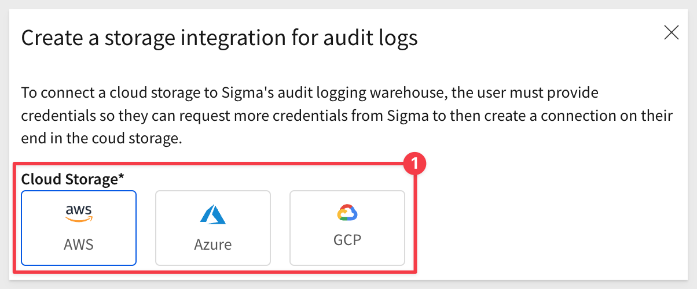
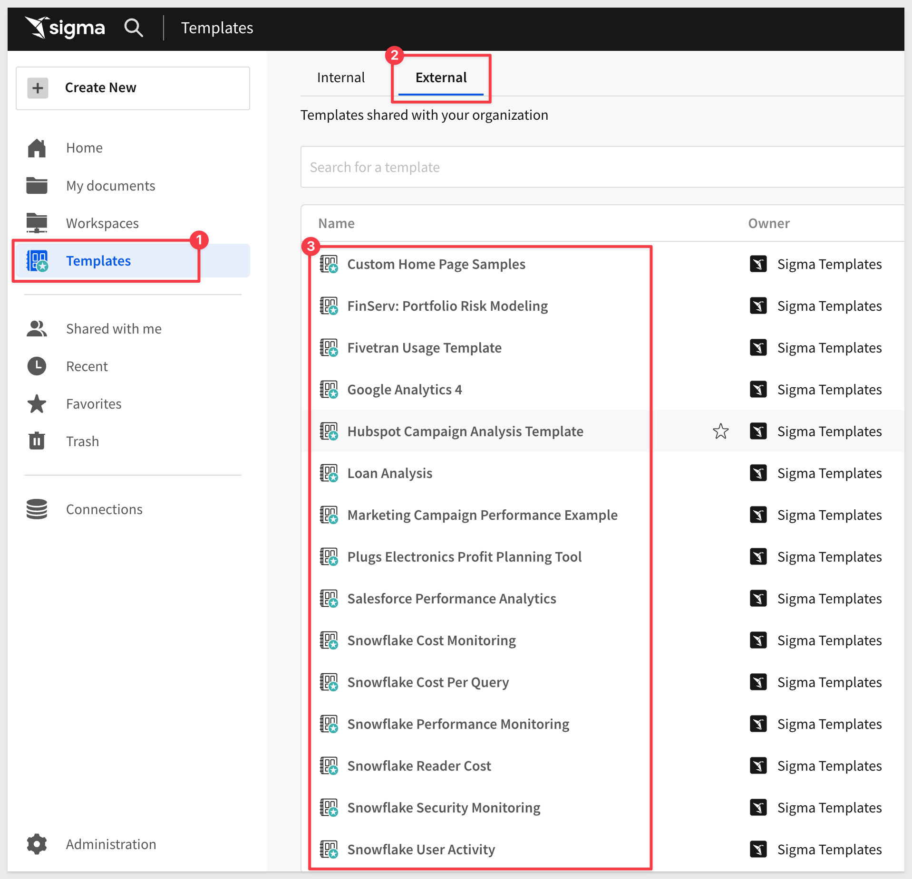

author: pballai
id: 2024_first_friday_features
summary: 2024_first_friday_features
categories: Administration
environments: web
status: Published
feedback link: https://github.com/sigmacomputing/sigmaquickstarts/issues
tags: archive
lastUpdated: 2024-11-01

# 2024 Compliation

## Overview 
Duration: 5 

This QuickStart lists all the new and public beta features released, as well as bugs fixed for the year 2024.

It is summary in nature, and you should always refer to the specific [Sigma documentation](https://help.sigmacomputing.com/) links provided for more information.

**Although features may carry a "Beta" tag, they may be released by now.**

All other features are considered released (**GA** or generally available).


<!-- END OF SECTION-->

## Administration
Duration: 20

### Account type permissions for export destinations
The [Account types](https://help.sigmacomputing.com/docs/license-and-account-type-overview) feature separates permissions for individual export destinations, enabling granular control over members’ ability to export workbook content to Google Sheets, Google Drive, Slack, cloud storage, and webhooks.

For more information, see the account type permission availability matrix (Sharing and exports section) in [License and account type overview.](https://help.sigmacomputing.com/docs/license-and-account-type-overview)

### Audit Logging

<aside class="negative">
<strong>NOTE:</strong><br> This is a premium beta feature that’s subject to quick, iterative changes. As a result, the latest product version may differ from the contents of this document.
</aside>

There is also the QuickStart[Audit Logging](https://quickstarts.sigmacomputing.com/guide/administration_audit_logging/index.html?index=..%2F..index#0)

The Administration portal now includes an `Account` > `General Settings` > `Audit Logging` section that supports the following self-serve features:

#### Enable audit logging
Enable audit logging by activating the Sigma Audit Logs connection.

This feature requires `Admin` access and is located in Sigma under `Administration` > `Account` > `General Settings` > `Audit logging`:


The Sigma Audit Logs connection stores entries for 30 days, but you can retain audit log data for extended periods by exporting it to cloud storage

For more information, see [Enable audit logging](https://help.sigmacomputing.com/docs/enable-audit-logging)  

#### Create an Audit Logs Storage Integration 
Audit log cloud storage integration provides exporting log data to AWS, Azure, or GCP.

<aside class="negative">
<strong>NOTE:</strong><br> Exporting audit logs to third party services requires configuration work in those services, in order to provide the appropriate permissions and storage type.
</aside>



For more information, see [Create an audit logs storage integration](https://help.sigmacomputing.com/docs/create-an-audit-logs-storage-integration).

### New version tag metadata in audit log (Beta)
The `AUDIT_LOG` > `SIGMA_SHARED` > `DOCUMENTS` dimension table now contains the following columns:


This metadata enables you to obtain information related to both the source workbook and the tagged version when referencing audit log entries for events like exports and downloads.

### Cross-org template sharing
Send and accept workbook templates across different Sigma organizations.

With secure cross-org sharing, a receiving organization must choose its own data source to populate the shared template, ensuring no data from the sharing organization is disclosed.


For more information, see [Share and accept cross-org workbook templates.](https://help.sigmacomputing.com/docs/share-and-accept-cross-org-workbook-templates)

### Customizable session length

If your organization uses password or SAML authentication, you can customize the session length to control how long internal and guest users stay logged in before Sigma requires re-authentication.

**By default, the session length is set to 720 hours, meaning users must log in every 30 days.** 

Adjust the session length to align with internal security policies and external regulatory requirements.

For more information, see [Manage authentication method and options.](https://help.sigmacomputing.com/docs/manage-authentication#manage-authentication-method-and-options)

### New permission for AI features
Manage access to new AI features in Sigma with the Use AI features permission. Users must have a `Pro license` to be granted this permission.

See [License and account type overview.](https://help.sigmacomputing.com/docs/license-and-account-type-overview)

### OAuth write access (Beta)
Configure an OAuth connection with write access to leverage the benefits of OAuth permission management with Sigma’s write-access features, including input tables, warehouse views, workbook materializations, and CSV uploads.

For more information, see [Configure OAuth with write access.](https://help.sigmacomputing.com/docs/configure-oauth-with-write-access)

### Organization translation files
We have made it easier to serve Sigma users in your organization and consumers of embedded analytics with content in their preferred language.

Sigma admins can create organization-wide `translation files` to translate custom strings that are common across workbooks in an organization, saving time and ensuring a consistent experience. 


Workbook owners inherit the organization-level translations and can override and supplement them with translations unique to an individual workbook. For more information, see:

[Manage organization translation files](https://help.sigmacomputing.com/docs/manage-organization-translation-files)
[Manage workbook localization](https://help.sigmacomputing.com/docs/manage-workbook-localization)
[New translations API endpoints](https://help.sigmacomputing.com/reference/change-log#new-translations-api-endpoints)

### Redshift Connections - SUPER data type support
Sigma now natively supports the `SUPER` data type to seamlessly handle semi-structured data from Redshift connections.

For more information, see [SUPER type](https://docs.aws.amazon.com/redshift/latest/dg/r_SUPER_type.html) in the AWS developer documentation.

### Separate export warehouse
If your Sigma organization is connected to Snowflake, you can run all scheduled, direct, and on-demand exports through a separate warehouse. 

This practice isolates export operations to optimize performance and reduce computing costs.

In the `Administration` > `Connection` > `Connection Features` section, locate the `Export Warehouse` field and enter the name of the virtual warehouse created for export queries:


For more information, see [Configure an export warehouse.](https://help.sigmacomputing.com/docs/configure-an-export-warehouse)

### Snowflake key pair authentication and rotation
Create a Snowflake connection using the key pair authentication method, and protect your data with key rotation.

Key pair authentication offers enhanced security through the use of a private key (secured by Sigma) and a public key (shared with Snowflake) for encryption and decryption. By implementing periodic key rotation, you can further protect your data from threats of exposure and compromised keys.

For more information, see Sigma’s [Snowflake Key-pair Authorization QuickStart.](https://quickstarts.sigmacomputing.com/guide/security_snowflake_keypair_rotation?_gl=1*tpxaou*_ga*MTM0MjUwMjM2Ny4xNzAwMjQxMDE5*_ga_PMMQG4DCHC*MTcxMzU0ODkyNS42NDAuMS4xNzEzNTU2MzUyLjM3LjAuMA..)

### Starburst Galaxy connection
Sigma now supports connecting to your Snowflake, Databricks, BigQuery, or PostgreSQL cloud data warehouse through [Starburst Galaxy](https://docs.starburst.io/introduction/index.html), a SaaS distribution of [Trino.](https://trino.io/)


For more information, see [Connect to Starburst.](https://help.sigmacomputing.com/docs/connect-to-starburst)

### Updated account type permissions for explore access
Account types now support two permissions that enable users to be granted `Can explore` workbook permission. These account type permissions determine how users interact with workbooks in specific modes.

**Basic explore:** Enables users to access View mode with additional capabilities when granted Can explore workbook permission.

**Full explore:** (formerly named Explore workbooks) Enables Basic explore capabilities in View mode as well as the full scope of user interactions in Explore mode.

For a detailed comparison of user interactions supported by each permission, [see Basic explore vs. Full explore.](https://help.sigmacomputing.com/docs/basic-explore-vs-full-explore)

### Updated licensing model
Sigma’s license tiers are now labeled `Lite`, `Essential`, and `Pro` to bring clarity and simplicity to the licensing model.

<aside class="positive">
<strong>IMPORTANT:</strong><br> No action is required to accommodate the update, as all user functionality and experiences will continue seamlessly.
</aside>

**Here’s what you need to know:**

1: No action is required from your end. Your Sigma experience will continue seamlessly.<br>

2: Default account names will be automatically updated to reflect the new license names.<br>

3: If your organization was previously subscribed to the two-license model, it will continue using two license tiers: Lite (formerly Viewer) and Pro (formerly Creator).<br>

4: Custom account names will remain unchanged.<br>

5: All Embed URLs will continue to function as usual. The old default account names will automatically map to the new names.<br>

6: SCIM processes will continue to function as normal and old license names will continue to work.<br>

7: Your Admin Portal and Usage Dashboards will be updated to reflect the new license names.<br>

8: Existing licensing agreements and terms will remain unchanged.

For more information, [see the Sigma Community post.](https://community.sigmacomputing.com/t/sigma-license-name-changes-no-action-needed/3332?_gl=1*1gugfu2*_ga*MTM0MjUwMjM2Ny4xNzAwMjQxMDE5*_ga_PMMQG4DCHC*MTcwOTkyMTA5My41NTIuMS4xNzA5OTI1MDE1LjYwLjAuMA..)


<!-- END OF SECTION-->

## Actions (BETA)
Duration: 20

Workbook actions allow you to configure interactivity within and across elements in a workbook.

By automating responses to specific user interactions, you can create efficient workbook workflows that produce quick and relevant data insights.

Workbook actions also support dynamic cross-element filtering, which enables user interactions with one element to automatically filter the data of other elements in the same workbook. 

For example, when a user clicks a data point in one chart (the trigger element), Sigma automatically applies a filter to another chart (the target element) using the dimension value of the clicked data point (see the interactive demo).

<ul>
      <li><strong>Navigational Actions:</strong>  Users can configure dashboard elements to act as links, enabling navigation to specific destinations based on the displayed data, which facilitates seamless integration with other tools or detailed reports.</li>
      <li><strong>Control Management:</strong> These actions allow users to dynamically manage control values such as filters and parameters directly from the dashboard, enhancing user interaction and data exploration flexibility.</li>
      <li><strong>Element Modification:</strong> Users can set actions to modify or refresh dashboard elements in real-time, ensuring data visualizations are always current and relevant.</li>
      <li><strong>Download and Export:</strong> This feature enables the automatic downloading and exporting of data or reports directly from the dashboard, streamlining data handling and reporting processes.</li>
</ul>

Each of these functionalities adds significant value by making dashboards more interactive, user-friendly, and efficient in handling complex data workflows.

An ***simple example*** of this can be found in the free Sigma Loan Analysis template. In this example, there are three action buttons on the page and the "Performance" button has a click-action that will take the user to a specific workbook page. 

For more information about workbook actions, see [Create and manage workbook actions](https://help.sigmacomputing.com/docs/create-and-manage-workbook-actions) and [Configure a cross-element filter.](https://help.sigmacomputing.com/docs/configure-a-cross-element-filter)

### Use actions to insert rows into input tables (Beta)
Use the [Insert row action](https://help.sigmacomputing.com/changelog#:~:text=Use%20the-,Insert%20row,-action%20to%20insert) to insert a row into an input table based on a user’s interaction with another workbook element. 


For more information, see [Intro to Actions](https://help.sigmacomputing.com/docs/intro-to-actions)


<!-- END OF SECTION--

## AI
Duration: 20

### Explain visualizations with AI (Beta)
Instantly generate a description of any chart with the `AI Explain visualization` feature. 

Details can include key insights, observations, data distribution summaries, and other context that can enhance your understanding of the visualized data and help drive informed decisions.

For example, once configured users can click on any visualization and select `Explain visualization`:


The results will appear as:


This is the first of many AI enabled features that Sigma is innovating into the product.

<aside class="positive">
<strong>IMPORTANT:</strong><br> The OpenAI integration must be configured for your organization.
</aside>

[Click here to learn how to configure the OpenAI integration in Sigma.](https://help.sigmacomputing.com/docs/manage-openai-integration)

For more information, [see Explain a visualization with AI.](https://help.sigmacomputing.com/docs/explain-visualizations-with-ai)

### Import data from an image (Beta)
If you have an OpenAI integration configured, you can now import data from an image of a table or a simple chart. The data is parsed and uploaded to a connection with Write-back support. Then you can start exploring the data in a workbook.

For more information and recommendations, see [Import data from an image.](https://help.sigmacomputing.com/docs/import-data-from-an-image)


<!-- END OF SECTION--

## API
Duration: 20

### Connection sync endpoint
This endpoint provide a method to "sync" the connection to a specific database, schema, or table, so that the data Sigma displays is the most recent.

For more information, see [POST /v2/connections/{connectionId}/sync.](https://help.sigmacomputing.com/reference/syncconnectionpath)

### Additional workbooks and shared templates endpoints
We have added some additional API endpoints to the [REST API](https://help.sigmacomputing.com/reference/get-started-sigma-api).

#### Share a workbook or template with another organization: 

***POST /v2/workbooks/{workbookId}/shareCrossOrg***

[Documentation](https://help.sigmacomputing.com/reference/get-started-sigma-api)


#### List templates shared with your organization: 

***GET /v2/shared_templates/shared_with_you***

[Documentation](https://help.sigmacomputing.com/reference/listtemplatessharedwithyou)


#### Accept a pending template share: 

***POST /v2/shared_templates/accept***

[Documentation](https://help.sigmacomputing.com/reference/accepttemplateshare)


#### New option for create a connection endpoint
The `Create a connection` endpoint now includes the option to connect to MySQL:

***POST /v2/connections***


#### New query parameter for List connections endpoint
The `List connections` endpoint now includes the includeArchived query parameter to return archived and inactive connections. If your request doesn't use this parameter, the response output is unchanged:

***GET /v2/connections***

### New API reference and recipes
We have migrated to a new API Reference platform that is far more feature rich while being easier to use.

All API reference documentation has moved [here.](https://help.sigmacomputing.com/reference/get-started-sigma-api)

The new structure for the API reference offers better in-line documentation for endpoints and interactive code samples in a variety of languages:


In addition, we have published API code samples ([Recipes](https://help.sigmacomputing.com/recipes)) and a [corresponding QuickStart](https://quickstarts.sigmacomputing.com/guide/administration_api_code_samples/index.html?_gl=1*2dnp9q*_ga*ODgwOTI4NTIyLjE3MTM1NjI2OTE.*_ga_PMMQG4DCHC*MTcxNjU3MzM1OC4yOC4xLjE3MTY1NzM0MTMuNS4wLjA.#0) that walks you through real-world code examples using the API. 

All the current "Recipes" are written in JavaScript today. The recipes can be downloaded individually from the [Recipes page]() and are also available in a public [Git repository]().

The following Recipes are available today:


### New file type for List files and List member files endpoints
The `typeFilter` query parameter for the [List files](https://help.sigmacomputing.com/reference/fileslist) and [List member](https://help.sigmacomputing.com/reference/listaccessibleinodes) files endpoints now includes a symlink option that you can use to filter shortcuts in your request. 

Shortcuts are also included in the response of requests that do not include a typeFilter.

### New folder and document "favoriting" endpoints
We have added operations for managing favorite documents and folders for a user:

```code
GET /v2/favorites/member/{memberId} lists documents and folders favorited by a user.
POST /v2/favorites favorites a document or folder for a user.
DELETE /v2/favorites/member/{memberId}/file/{inodeId} unfavorites a document or folder for a user.
```

#### New workbook template endpoints
We have added operations for managing workbook templates:

```code
POST /v2/templates/{templateId}/swapSources swaps the data sources of a template.
POST /v2/workbooks/{workbookId}/saveTemplate saves an existing workbook as a template.
```

### New option for swap workbook data sources endpoint
The Swap workbook data sources endpoint `POST /v2/workbooks/{workbookId}/swapSources` now includes the `swapTables` and `paths` options.

Set the `swapTables` option to `true` in your request to change all tables in the workbook to use the new connection.

Use the `paths` option to specify connection paths to map from the original connection to the new connection. 

The options for this method are available to test in our public [API Reference:](https://help.sigmacomputing.com/reference/sourceswapworkbook)


### New option for update an inode endpoint
The [Update an inode](https://help.sigmacomputing.com/reference/filesupdate) endpoint now includes the restore option. Include the `restore` option in your request to restore previously deleted files.

### New response output for Get embeds for a workbook endpoint:
The entries array includes two additional properties in the response for the [Get embeds for a workbook](https://help.sigmacomputing.com/reference/listworkbookembeds) 

- sourceType: Whether the source of the embed is a workbook, page or element.
- sourceId: The ID of the workbook, page, or element that is the source of the embed.
- sourceName: The name of the workbook, page, or element that is the source of the embed.

An example response for this method will look like this:
```code
{
  "entries": [
    {
      "embedId": "5123ee04-6a27-451d-a7ea-165b434e8a2b",
      "embedUrl": "https://app.sigmacomputing.com/embed/1-2t6NvaaMfGT5cVxec3xklt",
      "public": true,
      "sourceType": "page",
      "sourceId": "H9cAxKfnXP",
      "sourceName": "Dashboard"
    },
    {
      "embedId": "fa3cecb4-a9b5-4d81-9bcf-1bea81678fec",
      "embedUrl": "https://app.sigmacomputing.com/embed/1-7CbVjjUMMTKQpYa2E7NwkI",
      "public": false,
      "sourceType": "workbook",
      "sourceId": null,
      "sourceName": null
    }
  ],
  "hasMore": false,
  "total": 2,
  "nextPage": null
}
```

### Pagination required for List endpoints
List endpoints that did not already require pagination will start requiring pagination on **September 4, 2024.**

**Specific Endpoints:**<br>
[List members](https://help.sigmacomputing.com/reference/listmembers)<br>
[List teams](https://help.sigmacomputing.com/reference/listteams)<br>
[List workspaces](https://help.sigmacomputing.com/reference/listworkspaces)<br>
[List materialization schedules for a workbook](https://help.sigmacomputing.com/reference/listmaterializationschedules)<br>
[List scheduled exports for a workbook](https://help.sigmacomputing.com/reference/listworkbookschedules)<br>

<aside class="positive">
<strong>IMPORTANT:</strong><br> If you use these endpoints, update your API requests to include the limit query parameter to return a paginated response. After the change, requests without the limit parameter return a paginated response of the default page size (50).
</aside>

### Scoped API keys
This update provides more control over API privileges to ensure developers are granted relevant feature access.

You are now able to define the scope of an API key to permit access to APIs only, embeds only, or both:


For more information about client credentials, see [Generate API client credentials](https://help.sigmacomputing.com/docs/generate-api-client-credentials) and [Generate embed client credentials.](https://help.sigmacomputing.com/docs/generate-embed-client-credentials)

### SUPPORT_CHATS audit log dimension table
We have added a new log table that provides reference information about user interactions with Sigma's live chat support feature.

The `SIGMA_SHARED` schema in the Sigma `Audit Logs` connection now features a `SUPPORT_CHATS` dimension table containing information about individual live chat conversations, including timestamp, user name, user email, and the full chat transcript.

Customers can build a dashboard or report that includes this information to allow others to access or be updated on support status.


<!-- END OF SECTION-->

## Bug Fixes
Duration: 20

**1:** The `Can write only` permission set at the connection level no longer blocks additive permissions set at the schema or database table levels.

**2:** Selecting the `Impersonate user` function for a user assigned the `Embed` member type no longer redirects admins to the `Home` page.

**3:** Admins can now successfully update a user’s member type from `Internal` to `Guest.`

**4:** Sigma now emits the `workbook:error` JavaScript event when an embed user is logged out, due to a session timeout.

**5:** To preserve data integrity, Sigma no longer converts `Yes/No` and `0/1` values to `True/False` boolean values in CSV uploads.<br><br>

**6:** In embeds, the `workbook:chart:onvalueselect` event no longer sends an empty value property.<br><br>

**7:** Users no longer encounter false permission errors when accessing permitted tagged workbook versions.<br><br>

**8:** Sigma now displays an error when an admin attempts to generate a signed embed URL for a public embed.<br><br>

**9:** Bookmark selection for exports is now available only when all attachments are PDF or PNG files.<br>

**10:** Administrators can no longer circumvent UI restrictions to raise privileges of guest and embed users.<br><br>

**11:** Sigma no longer throws an error when multiple embeds attempt to add a new user at the same time.<br><br>

**12:** In the `Administration` > `Embeds` page, you can now successfully preview an embed in the `Embed Sandbox` when you click `More` and select `Test embed`.<br><br>

**13:** When viewing an individual embed user's profile in the `Administration` > `People` page, the `Edit member` and account type modal now displays "Embed user" in the Account type field instead of “Invalid selection.”<br><br>

**14:**A user’s Sigma access token now expires when the OAuth access token expires, ensuring the user is logged out when the OAuth session has ended.<br><br>

**15:**Updates to filters and sorting in tagged workbook versions are now reflected in exports and no longer trigger errors.

**16:** The `Administration` > `Account Types` > `Create new account type` page now correctly shows the `Create, edit, and publish workbooks` permission as auto-enabled (checkbox selected) when the `Apply tags` permission is enabled.

**17:** The `Administration` > `Authentication` > `Authentication Settings and Options` section now correctly allows an admin to edit the `Company Domain Sign-up` field regardless of the configured authentication method.

**18:** `Conditional formatting` for pivot tables now applies to cells containing `Total` labels. For more information, see [Apply conditional formatting.](https://help.sigmacomputing.com/docs/working-with-pivot-tables#apply-conditional-formatting)

**19:** When a specific version of a workspace has been shared with a user or team using both a direct grant and an inherited grant, Sigma no longer lists the same version tag multiple times in the `Share Folder` modal.

**20:** Sorting pivot columns in a pivot table with more than `25,000 cells` of data now works as expected.


<!-- END OF SECTION-->

## Data models (BETA)
Duration: 20

Sigma Data Models represent the next iteration of Datasets and their introduction is a **foundational change that offers significant benefits** over the existing Dataset functionality. We’re investing heavily in Data Models over the coming months and years, with plans to add a whole suite of functionality, coupled with the ease-of-use that you have come to expect from Sigma.


This is large topic, and we will be providing a ton of resources for customers to take advantage of, including a new QuickStart. 

For now, we strongly recommend reading this post in [Sigma Community on DataModels.](https://community.sigmacomputing.com/t/data-model-faqs/3481)

There is also some documentation (with more to come) [here.](https://help.sigmacomputing.com/docs/intro-to-data-models)

### Version tagging support for data models (Beta)
Version tag data models to support version tagged workbooks and manage access to specific versions of a data model. You can also swap sources between different tagged data model versions.

A tagged version of a workbook that uses a data model as the source stays in sync with the latest published version of the data model. If you want the tagged version of a workbook to use a specific version of a data model, tag that data model version and use it as the source for the tagged workbook version.

For more details, see [Create and manage version tags](https://help.sigmacomputing.com/docs/create-and-manage-version-tags) and [Add version tags to workbooks and data models.](https://help.sigmacomputing.com/docs/add-version-tags-to-workbooks-and-data-models)


## Embedding
Duration: 20

### Additional language support for workbook localization
You can now localize workbook text into Simplified Chinese, Korean, and Swedish.

For more information, see [Manage workbook localization.](https://help.sigmacomputing.com/docs/manage-workbook-localization)


### Authenticate secure embeds using JSON Web Tokens (JWTs) (Beta)
Sigma supports authenticating secure embeds using JSON Web Tokens (JWTs). JWTs are compact, URL-safe tokens that can be digitally signed, ensuring that the data they contain is tamper-proof. Using JWT-signed URLs for your embeds offers several advantages, including offering a secure way to embed content that can be accessed by both external users and internal users.

For more information, see [Create an embed API with JSON web tokens.](https://help.sigmacomputing.com/docs/create-an-embed-api-with-json-web-tokens)

There is also a [QuickStart: Embedding 16: Secure Embedding with JWT.](https://quickstarts.sigmacomputing.com/guide/embedding_16_jwt/index.html?index=..%2F..index#0)

### Embed API Code Samples (signing packages)
Sigma has previously provided code samples based on node.js and Javascript. 

Now you can see sample code for additional languages, for signing embed URLs to reduce time to deploy embedded applications.

For sample code in Go, Python, Ruby, and JavaScript, see the [Embed Signing Packages Github repository.](https://github.com/sigmacomputing/embed-signing-packages)

### Embed Events (formally known as Action and Events):
To avoid confusion with Sigma's new [Actions feature](https://help.sigmacomputing.com/docs/intro-to-actions), we have renamed embedded Actions and Events to `Embed Events`. 

There are two types:
**Inbound Events:**
Are variables sent from the Parent application to Sigma. There is no "listener" to code into the iframe; Sigma handles that out-of-the-box. Sigma can use these messages to update control values. For example, passing a new value to a Sigma control that is used to filter table data.

Inbound events can be passed using either JavaScript or URL.

**Out-bound Events:**
Are variables sent from Sigma to the Parent application which must have a "listener" coded into the Parent application to receive and react to the message as desire

For more information, see [Implement inbound and outbound events in embeds.](https://help.sigmacomputing.com/docs/inbound-and-outbound-events-in-embeds)

Embed Events are discussed and demonstrated in this [QuickStart.](https://quickstarts.sigmacomputing.com/guide/embedding_07_events/index.html?index=..%2F..index#0)

### Embedding workflows UI refresh
The following UI changes have been applied to the embedding workflows in Sigma:

1: Embed types now include `Secure` or `Public`. 
2: All references to `Application` and `User-backed` embedding have been removed.
3: The former `APIs & Embed Secrets` page in the Administration portal is now labeled `Developer Access`. 
    - This page displays existing credentials and allows you to create new ones.
4: The former Application Embedding Secret modal (accessible from the Developer Access page) is now labeled `Secure Embedding Credentials`. 
    - This modal displays the client ID and embed secret upon creation.

In support of this, the [help documentation](https://help.sigmacomputing.com/docs/workbook-embedding-overview) and [Embed QuickStart series](https://quickstarts.sigmacomputing.com/?cat=embedding) have been refresh.

### Explore mode and bookmarks in embeds
Explore mode is now available in embedded workbooks.

Embed users can perform ad hoc analysis, save the explored state as a personal bookmark, and manage existing bookmarks.

For more information, [see Explore a published workbook](https://help.sigmacomputing.com/docs/explore-a-published-workbook) and [Bookmarks in embedded workbooks.](https://help.sigmacomputing.com/docs/create-and-manage-bookmarks#bookmarks-in-embedded-workbooks)

### Enhanced underlying data exploration
Embedded workbooks now support the enhanced underlying data modal, which is accessible from individual data points in visualization elements.

`Right-` or `left-click` a data point and select `Show underlying data`, then explore the underlying data by modifying filters, adding and removing columns, and interacting directly with the chart and data table:


### Hide run as recipient
Embeds now support a `hide_run_as_recipient` parameter that allows you to hide the Run queries as recipient option in the `Send Now` and `Schedule Exports` modals. 

This removes the ability for embed users to configure exports that run queries using the recipient’s permissions and data access. 

A `Hide run as recipient` option has also been added to the Embed configurations panel in the embed sandbox.

### JavaScript event for saved bookmark
Sigma now listens for the following JavaScript event sent by a user to save a bookmark on an embedded workbook:
```code
{
      type: 'workbook-bookmark-current';
      bookmarkName: string;
      isDefault: boolean;
      isShared: boolean;
}
```

Read more about Sigma Actions and Events in this [QuickStart](https://quickstarts.sigmacomputing.com/guide/embedding_07_actions_events/index.html?index=..%2F..index#0).

### New Embedded Events
Sigma has added many new events to support existing and new functionality.

#### New Inbound events:
```code
workbook:bookmark:create
workbook:fullscreen:update
workbook:selectednodeid:update
workbook:variables:list
workbook:variables:update
```

#### New Outbound events:
```code
url:onchange
workbook:bookmark:oncreate
workbook:bookmark:update
workbook:chart:error
workbook:dataloaded
workbook:error
workbook:fullscreen:onchange
workbook:id:onchange
workbook:pageheight:onchange
workbook:pivottable:oncellselect
workbook:published
```

For more information, see [Implement inbound and outbound events in embeds.](https://help.sigmacomputing.com/docs/inbound-and-outbound-events-in-embeds)

There is also a [QuickStart for using events with Sigma embedding.](https://quickstarts.sigmacomputing.com/guide/embedding_07_events/index.html?index=..%2F..index#0)

### New JavaScript Event Type
We we have added the ability to create bookmarks via a postMessage event.

Below is sample code:

```code
{
    type: 'workbook:bookmark:oncreate';
    bookmarkName: string;
    workbookId: string;
    versionTagName: string | null;
    bookmarkId: string;
 };
 ```

To learn how to use actions and events in Sigma, please refer to this [QuickStart: Embedding 07: Actions and Events.](https://quickstarts.sigmacomputing.com/guide/embedding_07_actions_events/index.html?index=..%2F..index#0)

### nodeType property for workbook:selectednodeid:update
We have added the ability to programmatically determine whether a selected node is a page or an element by referencing the nodeType property in the inbound event.

```code 
workbook:selectednodeid:update
```

For more information, see [Available inbound events.](https://help.sigmacomputing.com/docs/inbound-and-outbound-events-in-embeds#workbookselectednodeidupdate)

### Self-service embed usage analytics
Use a third-party tool, like [Pendo.io](https://www.pendo.io/), to track inbound and outbound events implemented in your embedded analytics.

By tracking iframe events, you can gain a better understanding of how customers are using your embedded data. 

For more information, [see Implement inbound and outbound events in embeds.](https://help.sigmacomputing.com/docs/inbound-and-outbound-events-in-embeds)

For a tutorial that walks you through sending and receiving events from a parent application and Sigma, [see QuickStart: Embedding 07: Events.](https://quickstarts.sigmacomputing.com/guide/embedding_07_events/index.html?index=..%0F..index&_gl=1*y059mb*_gcl_aw*R0NMLjE3MTgwMzM3NTkuQ2p3S0NBand5SnF6QmhCYUVpd0FXRFJKVkJXejR0S3dYS2x4LWhIWXNZc0RPM2xCYVdOMTZ5UWt1VDlUazBhRE1yYWxZb1VTT1BjS3pCb0NOT1lRQXZEX0J3RQ..*_gcl_au*MTU3OTYwODI3NC4xNzEzNTc1NDQ4LjEzMjQ1MTQxMTUuMTcxNzE3MTI2Ni4xNzE3MTcxMjY1*_ga*MjAyNzIyMDcwLjE3MTcxODQ4Nzk.*_ga_PMMQG4DCHC*MTcxODM5NDcwOS40MS4xLjE3MTgzOTU2MTEuMzUuMC4w#0)

### View embed URL in Embed Sandbox
When an embed is loaded in the sandbox environment, you can now click a View Url option to display the embed URL.

There are two options:

**Usable URL:** Clicking this, copies a URL to your clickboard that can then be pasted into any browser window and will generate the embed. Each time you click it, the clipboard is updated with a working URL as a new NONCE will be included.

**Copy:** Provides a copy of the URL to the clipboard for detailed inspection of it's constructions. This is useful in debugging URLs manually.


<!-- END OF SECTION-->

## Filters and Controls
Duration: 10


<!-- END OF SECTION-->

## Functions / Calculations
Duration: 20

### Advanced calculation options for metrics
Quickly convert metrics to cumulative aggregates (grand total) or relative aggregates (percent of total) in tables, pivot tables, and visualizations. 

Open the relevant metric column menu, then hover over `Advanced calculations` and select an option to show the `grand total` or `percent of total`. 

Available percentage breakdowns (by grand total, x-axis, row, column, etc.) depend on the element type.

For example:


### ArrayAggDistinct function
The `ArrayAggDistinct` function identifies distinct non-null row values of a column or group and aggregates them into a single array.

<aside class="negative">
<strong>NOTE:</strong><br> This function is supported by AlloyDB, BigQuery, Databricks, PostgreSQL and Snowflake connections.
</aside>

For more information see [ArrayAggDistinct.](https://help.sigmacomputing.com/docs/arrayaggdistinct)

### Array function
The Array function returns an array containing specified values.

This function allows users to create and manipulate arrays, which are collections of elements that can store various types of data, such as numbers, strings, and even other arrays. With the "Array" function, users can perform a wide range of operations, including adding or removing elements, accessing specific items, and iterating over the elements for processing.

<aside class="negative">
<strong>NOTE:</strong><br> This function is currently supported by Snowflake, PostgreSQL, BigQuery, and MySQL connections only.
</aside>

For more information, [see the Array documentation.](https://help.sigmacomputing.com/docs/array)

### ArrayJoin function
The ArrayJoin function joins elements of an array into a single text string.

For more information, [see ArrayJoin.](https://help.sigmacomputing.com/docs/arrayjoin)

### ConvertTimezone function improvement
The ConvertTimezone function now supports an optional from_timezone argument that allows you to specify the time zone from which the datetime value is converted. 

This argument can be used when the data’s originating time zone differs from [your organization’s configured account time zone.](https://help.sigmacomputing.com/docs/account-time-zone)

For example, adding a column to display another columns date into the US Pacific Timezone:


For more information, [see ConvertTimezone.](https://help.sigmacomputing.com/docs/converttimezone)

### DateFormat function enhancement
The `DateFormat` function now supports the `%q` specifier that allows you to extract the **quarter** component from a datetime value.

For more information about the function and supported format specifiers, [see DateFormat.](https://help.sigmacomputing.com/docs/dateformat)


### Misc. New Functions
We have added to new system functions to allow more personalization for users.

For example, you may want to display the user's first name in a dashboard element.

When "Jim Smith" logs into Sigma and views the Sales Performance workbook, the text element displays “Hey there, Jim!”


[CurrentUserFirstName:](https://help.sigmacomputing.com/docs/currentuserfirstname)
Returns the current (signed-in) user’s first name as configured in the user’s profile.

[CurrentUserFullName:](https://help.sigmacomputing.com/docs/currentuserfullname)
Returns the current (signed-in) user’s first and last name as configured in the user’s profile.

### MakeDate function improvements
The MakeDate function now supports optional hour, minute, and second arguments that enable more precision when specifying the datetime components.

For more information, [see MakeDate.](https://help.sigmacomputing.com/docs/makedate)

### Record formula support
Record formulas enhances data processing and user interaction. Record formulas allow you to create structured objects, such as JSON, directly within your workbooks and data models.

**Key Benefits:**
     <ul>
      <li><strong>Data Type Preservation:</strong> When Sigma processes these structured objects, it maintains the specific data types of each field. This not only preserves data integrity and accuracy but also simplifies data manipulation by eliminating the need for type conversions.</li>
      <li><strong>Ease of Access:</strong> The structured format ensures that you can easily access and manipulate the values within these objects.</li>
</ul>
 
For more information, see [Generate and access structured objects.](https://help.sigmacomputing.com/docs/generate-and-access-structured-objects)

### Sequence function
The Sequence function returns an arithmetic sequence as an array of integers based on a specified range and increment.

For more information, see [Sequence.](https://help.sigmacomputing.com/docs/sequence)


<!-- END OF SECTION-->

## Infrastructure

Sigma is now deployed in AWS UK in compliance with UK GDPR ([Data Protection Act 2018](https://www.gov.uk/data-protection)). 

Located in London, United Kingdom, the deployment gives customers in the UK more control over data storage while enabling compliance with internal policies and external data residency requirements.

To accompany the region expansion, Sigma now supports the English (United Kingdom) (en-gb) locale for enhanced localization. When enabled, dates display as DD/MM/YYYY or Day Month Year, and time displays in the 24-hour format.


## Input Tables
Duration: 20

### CSV input tables
Pre-populate a new input table with uploaded CSV data that you can edit at the cell level.

Like empty input tables, CSV input tables support data entry independent of existing data, enabling you to add editable rows and columns to construct the table as you see fit.

For more information, see [Intro to input tables](https://help.sigmacomputing.com/docs/intro-to-input-tables) and [Create new input tables.](https://help.sigmacomputing.com/docs/create-new-input-tables)

For those of you who have not discovered Sigma Input Tables yet, check out some of the [common use cases here](https://quickstarts.sigmacomputing.com/guide/input_tables_use_cases/index.html?index=..%2F..index#0) The possibilities are endless!

### Input table row deletion
You can now delete any row (saved or unsaved) when editing an input table in the permitted workbook version (based on element’s data entry permission).

The ability to delete saved rows was previously restricted when the [data entry permission](https://help.sigmacomputing.com/docs/create-and-manage-input-tables#set-data-entry-permission) was set to `Only on Published` version. Therefore, users could only delete unsaved rows while editing an input table in a workbook’s published version. This update removes the restriction and allows users to delete any row while editing the draft (via `Edit` mode) or published version (via `View` or `Explore` mode).


<!-- END OF SECTION-->

## New QuickStarts in 2024
Duration: 20

### All new Sigma fundamentals series
After over a year in service, it was time to retire the existing series and replace it with an updated one.

Each QuickStart in the series has been rewritten and screenshots have been updated.

The series has changed somewhat and now contains the following QuickStarts:<br>

Fundamental 1 - Getting Around<br>
Fundamental 2 - Working with Tables<br>
Fundamentals 3: Working with Visualizations<br>
Fundamentals 4: Working with Pivot Tables<br>
Fundamentals 5: Input Tables<br>
Fundamentals 6: Controls<br>
Fundamentals 7: Administration

You can access the [new series here.](https://quickstarts.sigmacomputing.com/?cat=fundamentals)


### API Recipes

This [QuickStart](https://quickstarts.sigmacomputing.com/guide/administration_api_code_samples/index.html?_gl=1*2dnp9q*_ga*ODgwOTI4NTIyLjE3MTM1NjI2OTE.*_ga_PMMQG4DCHC*MTcxNjU3MzM1OC4yOC4xLjE3MTY1NzM0MTMuNS4wLjA.#0) is designed to support Sigma's API Recipes and demonstrates many common operations that customers may use the REST API for.

### Develop a Predictive Model using Snowflake and Sigma
This QuickStart discusses and demonstrates creating a machine learning-driven price prediction tool, integrating the perspectives of both a business analyst and a data scientist using Snowflake and Sigma.

[Develop a Predictive Model using Snowflake and Sigma](https://quickstarts.sigmacomputing.com/guide/partner_snowflake_predictive_model_using_sigma/index.html?index=..%2F..index#0).

### Embedding 14: Parameterized Queries
In this QuickStart, we discuss and demonstrate Sigma embedding using parameterized queries and user attributes.

Parameterized queries are quite useful when embedded customers have per-customer databases with the same schema.

[Link to QuickStart](https://quickstarts.sigmacomputing.com/guide/embedding_14_parameterized_queries/index.html?index=..%2F..index#0)

### Embedding 16: Secure Embedding with JWT
Many customers want a simple, but secure way to embed content that can be accessed by both external (users who do not have a registered account in Sigma) and internal user (users who access Sigma only through an embed, inside a parent application).

To enable this, Sigma supports authenticating secure embeds using JSON Web Tokens (JWTs). Signing your secure embed URLs with JWTs has several advantages, but a few limitations too.

Read all about it [here.](https://quickstarts.sigmacomputing.com/guide/embedding_16_jwt/index.html?index=..%2F..index#0) 

### Embedding Series
In support of some announced changes to embed terminology, we also took the opportunity to completely update the entire series, adding any recent "goodness" related to embedding.

[Embed QuickStart series](https://quickstarts.sigmacomputing.com/?cat=embedding)

**Getting Started with Period Over Period Analysis in Sigma:** <br>
In this [QuickStart](https://quickstarts.sigmacomputing.com/guide/functions_period_over_period_analysis/index.html?index=..%2F..index#0), we will focus on the PoP analysis scenarios, where two specific time periods are selected and compared, against key metrics or data points between these periods.

### Google Analytics 4 Template Setup
This template gives you a prebuilt analytics package for Google Analytics 4 events data, including detailed page-level metrics for every page and the ability to dive into event-level details, and is based on reports from Universal Analytics/GA3.

[Link to QuickStart](https://quickstarts.sigmacomputing.com/guide/google_analytics_4_template_setup/index.html?index=..%2F..index#0)

### Security: Open Authorization (OAuth)
In this QuickStart, we discuss and demonstrate OAuth, what it is, and why our customers want to use it. This can be a complex topic, so we break it down into easily digestible sections, including Write-back.

In simple language, OAuth provides a secure and efficient way to manage access and permissions between Sigma and Snowflake, leveraging a third-party identity management provider.

Security is on every customers mind these days. To that end, we provide some educational content upfront to help those who are less familiar get acquainted.

[Link to QuickStart](https://quickstarts.sigmacomputing.com/guide/security_oauth/index.html?index=..%2F..index#0)

### Sigma Health Check Native App
The Sigma Health Check Native App is designed to provide insights into the overall health and performance of your Snowflake environment. This native app includes insights into architecture, user and role grants, as well as warehouse performance and sizing recommendation.

[Getting Started with the Sigma Health Check Native App for Snowflake](https://quickstarts.sigmacomputing.com/guide/partners_snowflake_health_check_app/index.html?index=..%2F..index#0)

### Version Tagging with Sigma (non-embed use cases)
[In this QuickStart](https://quickstarts.sigmacomputing.com/guide/administration_version_tagging/index.html?index=..%2F..index#0), we cover how Sigma version tagging can be used (inside Sigma itself) to provide a controlled release experience, which should result in less reported issues and happier end-users.


<!-- END OF SECTION-->

## Templates
Duration: 20

Sigma provides a `Templates gallery` for every customer which includes a set of Sigma-created examples. There are 15 standard templates (as of this QuickStart), and we are adding more all the time:



Templates allow users to create standard models (or Templates!) and share workbook structures for quick and consistent reuse.

### New templates
The following templates are now available in the `Template`s > `External` tab:

**Google Analytics 4:** Offers visibility into GA4 events data not provided by the Google Analytics platform. There is a QuickStart that [details the functionality here.](https://quickstarts.sigmacomputing.com/guide/google_analytics_4_template_setup/index.html?index=..%2F..index#0)

**Plugs Electronics Profit Planning Tool:** Leverages Sigma’s latest design features for an improved look and feel.

**Loan Analysis:** Analyzes loan portfolio performance using publicly available loan data from `Lending Club`.


<!-- END OF SECTION-->

## Version Tagging
Duration: 20

### Bug Fixes

**1:** Sigma successfully exports a tagged workbook version when recipients have access to the tagged version. The export no longer relies on recipient's access to the source workbook.

**2:** Resolved an issue that periodically caused the `Move tag to` functionality to incorrectly apply the selected tag to a previous workbook version.

**3:** Sigma now exports a tagged workbook version to Google Drive without requiring recipients to have access to the source workbook.


<!-- END OF SECTION-->

## Visualizations
Duration: 5

### Interactive chart legends
Interact with chart legend entries to quickly focus on specific data subsets. 

Charts containing legends that represent qualitative segments (like categories or series) support the following interactive filtering capabilities:

<ul>
      <li><strong> Hover over a legend entry to highlight corresponding data points.</strong></li>
      <li><strong> Click a legend entry label to isolate corresponding data points.</strong></li>
      <li><strong> Select or clear the checkbox of one or more legend entries to show or hide corresponding data points.</strong></li>
      <li><strong> Click anywhere (within the element) outside of the plot area or legend to reset the chart display.</strong></li>
</ul>

<aside class="negative">
<strong>NOTE:</strong><br> Changes resulting from chart legend interactions persist when you switch between workbook modes; however, they don’t persist across user sessions and aren’t saved when the workbook is published.
</aside>


### Dynamic button text
You can now add dynamic values to button elements. 

When configuring the button text, enter `=` to include a dynamic value defined by a formula expression.


For more information about buttons, see [Create a button element.](https://help.sigmacomputing.com/docs/create-a-button-element)

### Stacking support for waterfall charts (Beta)
Waterfall charts now support stacking. With stacked waterfall charts, you can plot multiple data series as cumulative waterfall segments and compare subcategory contributions to each category’s total sum value.

For example:


For more information, see [Build a waterfall chart (Beta).](https://help.sigmacomputing.com/docs/build-a-waterfall-chart)

### Trellis formatting for combo charts
Combo charts now support trellis formatting. You can add a column as a trellis row or column to split a combo chart into a trellis.


### Underlying data enhancements for visualizations (Beta)
Underlying data is now accessible from individual data points in visualization elements. 

`Right-click` and `left-click` menus for data points both feature `Show underlying data` options that open an enhanced Underlying Data modal. 

You can explore the underlying data for specific data points or the entire chart by modifying filters, adding and removing columns, and interacting directly with the chart and data table.


### Waterfall chart (GA)
Waterfall charts are now generally available (GA). Build a waterfall chart to show changes in data over a period of time. Waterfall charts are perfect for financial analytics use cases where you track revenue and spend for a project, department, or an entire organization, and other use cases. You can format the shape, start, and end values of a waterfall chart as well.

For more information, see [Build a waterfall chart.](https://help.sigmacomputing.com/docs/build-a-waterfall-chart)


<!-- END OF SECTION-->

## Workbooks
Duration: 20

### Bulk column drag-and-drop
When interacting with a visualization, table, pivot table, or input table elements, you can now `bulk drag-and-drop columns` in the `Element properties` > `Columns` tab to reorder multiple columns or add them to groupings, calculations, or other properties.


### Button element formatting
Sigma is continuing to deliver polish and customization to our workbooks and in this case has improved the styling options for buttons.

Users now have more options to adjust the look-and-feel of their button elements, including new `styles`, `shapes`, and `sizes` in the `Element properties` panel:


### Checkbox control element
Use the `Checkbox control` element to allow users to select or deselect an option.

The `Checkbox control` element is similar to the [Switch control](https://help.sigmacomputing.com/docs/intro-to-control-elements#switch) element but in a different format, which users may prefer.

For example, it can used to simply toggle a boolean column to show purchases or returns only:


### Clear segmented control selection
Segmented control elements now feature a `Show clear option` setting in the `Element properties` > `Settings` tab. 

Enable this and customize the display label (default “None”) to add an option that allows users to clear the selected control value.


### Color picker now available
A small but very useful usability addition is the color picker, which is available anywhere there is a choice of single colors.

For example:


### Column Level Security (CLS)
Column-level security is now generally available.

The feature provides admins with the flexibility to restrict or grant access to column-level data. This granular control over data access allows your organization to secure sensitive or confidential information, ensuring it’s accessible to authorized users only.

For more information, [see Column-level security.](https://help.sigmacomputing.com/docs/column-level-security)

There is also a [QuickStart on CLS here.](https://quickstarts.sigmacomputing.com/guide/security_column_level_security/index.html?index=..%2F..index#0)

### Combined file option for PDF attachments in scheduled exports
It is now possible to combine multiple PDF attachments when configuring ad hoc and scheduled exports.

The `Combine attachments` option expands the previous ability to merge Excel attachments into one file. 


<aside class="negative">
<strong>NOTE:</strong><br> The checkbox to combine attachments will not appear until there at least two PDF attachments configured to send.
</aside>

For more information, [see Merge PDF or Excel files.](https://help.sigmacomputing.com/docs/configure-additional-options-for-exports#merge-pdf-or-excel-files)

### Control element naming updates
For consistency and clarity, the control elements formerly labeled `Text control` and `Number` are now labeled `Text input` and `Number input`.


### Conditional formatting using hidden controls
Conditional formatting rules referencing hidden controls are now applied reliably to visible data elements in embeds and published workbook versions (`View` and `Explore` mode).

For more information about hidden controls and filter accessibility, see [Create a hidden control.](https://help.sigmacomputing.com/docs/create-a-hidden-control)

### Custom formula aggregations in chart reference marks
You can now specify a `custom formula aggregation` when configuring reference marks in charts.

For more information about reference marks, see [Display chart reference marks.](https://help.sigmacomputing.com/docs/display-chart-reference-marks)

### Customizable page tab color
You can now customize the color of individual page tabs for added clarity and organization in workbooks.

On a workbooks's `Page` menu, click `Change color` and select an option from the color palette:


### Custom workbook page width
Set a custom page width for a workbook. Specify a pixel width to constrain the elements on workbook pages to a maximum width. See [Workbook settings overview.](https://help.sigmacomputing.com/docs/workbook-settings-overview#layout-style-settings)


If you export workbook pages to PDF, use this setting to approximate the layout size of a PDF page. See [Format PDF page export layout.](https://help.sigmacomputing.com/docs/configure-additional-options-for-exports#format-pdf-export-page-layout)


### Data labels in maps
Add one or more columns to generate data labels in point and region maps. This update makes it easier to quickly view at-a-glance details directly in the element.

For more information, see [Display chart data labels.](https://help.sigmacomputing.com/docs/display-chart-data-labels)

### Default table styling
You can now configure a default table style for an **entire workbook** (in the Workbook settings panel), or an organization theme (in the Administration portal).

This allows users to make bulk styling changes across their entire workbook (or theme), rather than making adjustments one by one, saving lots of time.

For more information, see [Customize table styles](https://help.sigmacomputing.com/docs/customize-table-style) and [Create and manage workbook themes.](https://help.sigmacomputing.com/docs/create-and-manage-workbook-themes)

### Default value for empty pivot table cells
When there’s no corresponding source data for a pivot table value cell to reference (no record exists for the particular combination of dimensions), the cell is empty by default. 

To customize the value for all empty cells, go to  `Element format` > `Format` and enter the preferred value in the `Empty cell` display value field.

### Default version tags
Users with `Can edit` workbook permission can now designate a tag as the default tag for a workbook. As a result, any user who does not have access to the `Published` workbook will see the default tagged version. 

Applying default tags to workbooks with multiple tags results in a more consistent viewing experience.

For more information, see [Set a default tag for a workbook.](https://help.sigmacomputing.com/docs/version-tagging#set-a-default-tag-for-a-workboo)

### Design improvements for scheduled exports
The [Schedule Exports](https://help.sigmacomputing.com/docs/send-and-schedule-exports-from-workbooks) modal has been redesigned to make it easier for users to find it, and the overall user experience when scheduling an export.


### Display or hide legends in maps

Map elements now support the ability to display or hide legends. In the  `Element properties` > `Legend` section, select the `Show legend` checkbox to display the legend or clear the checkbox to hide it:


### Document shortcuts (Beta)
Customers have requested that we add the ability to save links to documents in more than one location. To support this, Sigma has added shortcuts to make specific data sources easier to find in the source picker, or to organize documents to make key workbooks and data models easier to access.

It is really simple to add a shortcut to any published workbook:


The new workbook shortcut has a different icon that a standard workbook:


See [Add shortcuts to documents](https://help.sigmacomputing.com/docs/add-shortcuts-to-documents) for more details.

### Donut hole value in donut charts
Display an aggregate value within the hole of a donut chart to add more context to your visualization.


For details about adding a donut hole value, see [Pie and donut charts.](https://help.sigmacomputing.com/docs/pie-and-donut-charts)

### Dynamic element titles
Workbook element titles now support dynamic values. This update allows you to create more relevant and detailed element titles that adapt to selected control values.

For more information, see [Create a dynamic title](https://help.sigmacomputing.com/docs/customize-element-title#create-a-dynamic-title) in [Customize element title.](https://help.sigmacomputing.com/docs/customize-element-title)

### Dynamic page visibility (BETA)
Dynamic page visibility allows you to restrict the visibility of individual workbook pages based on specific users and teams. By default, pages are visible to all users with permission to view, explore, or edit the workbook, but you can now choose from three options:

 <ul>
      <li><strong>Hide page from all users:</strong> Hides page from all users when the workbook is open in View or Explore mode.</li>
      <li><strong>Show page to all users (default):</strong> Shows page to all users when the workbook is open in any mode.</li>
      <li><strong>Only show to select users or teams:</strong> Shows page to select users and teams when the workbook is open in any mode. Hides page from unselected users when the workbook is open in View or Explore mode.</li>
</ul>

<aside class="negative">
<strong>NOTE:</strong><br> Page visibility settings apply to View and Explore mode only. The workbook owner and all users with Can edit access to the particular workbook can access all pages in Edit mode, regardless of page visibility settings.
</aside>

For more information, [see Customize workbook page visibility.](https://help.sigmacomputing.com/docs/customize-workbook-page-visibility)

### Dynamic text style update
In workbook Edit mode, the pill-style display of dynamic text has been updated to a more sleek and simple underlined format to enhance readability.


### Embedding Sigma's documentation now supported
Many customers provide useful information on how to best use Sigma workbooks directly in the workbook itself. 

There are time when it can be used to embed specific Sigma documentation content from the Sigma help pages. 

This is quite easy to do now using the [Embed element](https://help.sigmacomputing.com/docs/intro-to-ui-elements#embed-element)

For example, you may want to provide a basic introduction to your new users on how to get started with Sigma:


Another example is to provide the list of popular functions that are available:


Users will appreciate the time saved by avoiding opening another browser page to access documentation.

### Enhanced color formatting for workbook themes
Edit your workbook color settings directly from the `Color` section of the `Workbook settings` panel. 

The element panel provides a real-time preview of your workbook colors that automatically updates as you adjust the settings.

There are currently ten beautiful presets to choose from!

Here is how to access it:


### Enhanced SQL editor (Beta)
We have added a new, in-line SQL editor that allows SQL users to write their code directly in the workbook, and reference / build on top of other elements in the workbook.

Use the new SQL editor—featuring a more integrated and collaborative experience—to build workbooks, datasets, and elements (tables, pivot tables, and visualizations) with custom SQL.

<aside class="positive">
<strong>IMPORTANT:</strong><br> The new SQL editor replaces a previous, more limited SQL editing feature. This is a public beta feature that’s subject to quick, iterative changes. As a result, the latest product version may differ from the contents of this document.
</aside>

The `Beta` release includes the following enhanced capabilities:

 <ul>
      <li> Toggle to an inline SQL editor view within any SQL-based workbook element, and expand the element to enter full screen mode.</li>
      <li> Collaborate with other workbook developers in a live editing environment.</li>
      <li> Use search and replace functionality within the custom SQL.</li>
      <li> Apply autocomplete suggestions featuring improved performance.</li>
      <li> View and access custom SQL from the workbook Lineage view.</li>

</ul>

For more information about using custom SQL directly in Sigma, see [Write custom SQL.](https://help.sigmacomputing.com/docs/write-custom-sql)

For a video demonstration, [click here.](https://www.loom.com/share/4ae2e65a1d18447b867e209d7f6e1887?sid=bd5366a2-a372-4396-b437-e8b6f7e43bef)

<aside class="positive">
<strong>IMPORTANT:</strong><br> Sigma is continually working to improve usability for our customers. We want Sigma to not only be simple to use, but also beautiful looking.
</aside>

### Improved data source selection UI
Select data sources for workbook elements using a new popover UI. 

With the new experience, you can `search` for data sources, `review` a list of suggested sources, and `preview` data sources. 


Preview a data source to review the source data and choose specific columns to apply to the element:


For more information, see [Create a data element.](https://help.sigmacomputing.com/docs/create-a-data-element)

### Map region improvements
Sigma now uses `Mapbox` to render regions in map elements.

This update contributes **overall performance improvements**, including **more precise boundaries** for mapped regions.

For example:


<aside class="positive">
<strong>IMPORTANT:</strong><br> Due to updated place name specifications, Mapbox may not render some regions in existing maps. Update place names in map element data sources if needed.
</aside>

### New option for export to email - workbook action
By default, the `Export to email` workbook action now runs as the user who performs the action instead of as the recipient of the email. 

You can optionally select to `run as recipient` instead.

See [Create actions that download and export data](https://help.sigmacomputing.com/docs/create-actions-that-download-and-export-data#export-to-email) for more details.

### Paste 2,000 rows in input tables on Snowflake connections
Customers asked for larger row limits when populating data in input tables on a Snowflake connection, so now you can now paste up to `50,000 cells` at once (2,000 rows and 25 columns).

If you want this be even larger, so do we!

For more information, [see Intro to input tables.](https://help.sigmacomputing.com/docs/intro-to-input-tables#input-tables-overview)

### Permanent filter icon display
The inline toolbar for data elements now includes a filter icon at all times, regardless of whether a filter or control is already applied. 

<aside class="positive">
<strong>IMPORTANT:</strong><br> This update enables quick access to filtering options for every data element added to the workbook.
</aside>


### Placeholder text in control elements
You can now customize placeholder text for any input-based control element (List values, Text input, Number input, Date, and Date range) to provide context about the expected user input.

Go to `Element format` > `General` and update the `Placeholder` field. 

Placeholder text displays directly in the control’s input field and clears when the field contains user input:


### Repeat row labels in pivot tables
In pivot tables with multiple pivot rows, you can format your table to repeat row labels.

For example, `Arts & Entertainment` in `Product Types` is repeated for each additional row having a `Product Family` in that grouping:


For more information, see [Working with pivot tables.](https://help.sigmacomputing.com/docs/working-with-pivot-tables)

### Repeat pivot values in exports
When sending or scheduling an export, you now have the option to repeat pivot values in Excel or CSV output.

In the Send Now or Schedule Exports modal, go to More options and select the Repeat pivot values checkbox. This ensures the pivot header values are populated in every applicable row or column:


### Support for emailing exports to organization users and teams
When configuring an email export, the `Recipients` field now features an autocomplete dropdown that helps you search for and select an organization team or user. 

You can also continue to input specific email addresses for non-organization members with authorized domains.

For example, searching to find a specific team:


For more information about emailing workbook content , see [Export to email.](https://help.sigmacomputing.com/docs/export-to-email)

### Text area control element
The `Text area` control element in Sigma allows for multi-line text input, making it ideal for forms and other scenarios requiring larger amounts of text.

With customizable input field height and vertical scrolling to view text overflow, it more effectively supports extensive text input compared to the `Text input` control element.


### Text input control type
The former Text box control element has been renamed to Text input to differentiate it from the Text UI element.


### View parameters referenced by a custom SQL element in a data model
Custom SQL elements in a data model that reference a control as a parameter in the SQL syntax are now visible from the Targets section of the Element properties for the control.


### Updated file names for Google Sheet and Google Drive exports
The default file name used for `Google Sheet` and `Google Drive` exports has been updated from:
```code
date time - workbook name
```

to:

```code
workbookName_elementName_timestamp
```

This change makes these export naming conventions consistent with Sigma's other export file name patterns.

For example, for a workbook with the name workbookName, exported on `August 2nd`, the file name changes from `2024-08-02 10:07 - workbookName` to `workbookName_elementName_20240802T1007`.


### Zip file option for attachments in scheduled exports
When scheduling exports it is now optional to compress export attachments into a single zip file. This will result in smaller attachments and more reliable delivery over email.


For more information, [see Compress attachments to a zip file.](https://help.sigmacomputing.com/docs/configure-additional-options-for-exports#compress-attachments-to-a-zip-file)


<!-- END OF SECTION-->

## Additional Information
Duration: 20

**Additional Resource Links**

[Blog](https://www.sigmacomputing.com/blog/)<br>
[Community](https://community.sigmacomputing.com/)<br>
[Help Center](https://help.sigmacomputing.com/hc/en-us)<br>
[QuickStarts](https://quickstarts.sigmacomputing.com/)<br>


Be sure to check out all the latest developments at [Sigma's First Friday Feature page!](https://quickstarts.sigmacomputing.com/firstfridayfeatures/)
<br>

[](https://twitter.com/sigmacomputing)&emsp;
[](https://www.linkedin.com/company/sigmacomputing)&emsp;
[](https://www.facebook.com/sigmacomputing)


<!-- END OF SECTION-->
<!-- END OF QUICKSTART -->
