author: pballai
id: 2025_first_friday_features
summary: 2025_first_friday_features
categories: Administration
environments: web
status: Published
feedback link: https://github.com/sigmacomputing/sigmaquickstarts/issues
tags: archive
lastUpdated: 2026-02-06

# 2025 Compilation

## Overview 
Duration: 5 

This QuickStart lists all the new and public beta features released, as well as bugs fixed for the year 2025.

It is summary in nature, and you should always refer to the specific [Sigma documentation](https://help.sigmacomputing.com/) links provided for more information.

**Although features may carry a "Beta" tag, they may be released by now.**

All other features are considered released (**GA** or generally available).


<!-- END OF SECTION-->

## Actions
Duration: 20

### Action trigger configurations for tables, pivot tables, and input tables
Tables, pivot tables, and input tables now support more ways to determine when and how user interaction triggers action sequences:

**1:** In the When selecting cells in column field, select `Any column` to trigger an action sequence when a user selects a cell in any column.


**2:** In the element’s `Action panel`, click the "three dots" to open the menu, then select or deselect `Allow keyboard to trigger actions` to control whether keyboard navigation within the element can trigger action sequences.

When the option displays a checkmark, keyboard navigation and pointer events (e.g., mouse clicks) can trigger the action sequences. When the option doesn’t display a checkmark, only pointer events can trigger them.

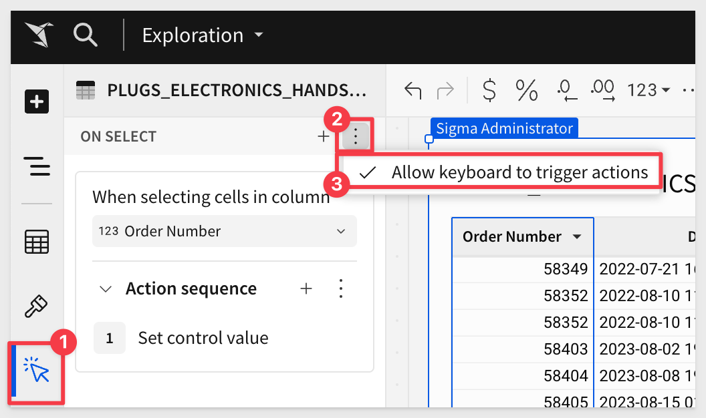

<aside class="negative">
<strong>NOTE:</strong><br> Keyboard navigation as a trigger interaction can disrupt the user experience. For example, if the element's action sequences include actions that open links or other workbooks, a user can be unintentionally navigated away from their current task. This can be particularly disruptive if the action sequence can be triggered by selecting a cell in any column.

Consider allowing keyboard navigation to trigger actions only when it facilitates the configured action sequences and is unlikely to interfere with usability.
</aside>


### Bulk clear controls in a tabbed container
You can now set the `Clear control` action to bulk clear all controls in a tabbed container element or a specific tab. 

When configuring the action, select the tabbed container element, then choose the `All tabs` option or select a specific tab that contains the controls you want the action to clear.

For more information, see [Clear one or more control values](https://help.sigmacomputing.com/docs/create-actions-that-manage-control-values#clear-one-or-more-control-values)


### Call stored procedures with actions (Beta) 
Call stored procedures defined in a Snowflake, BigQuery, or Amazon Redshift connection using an action. 

If the stored procedure returns non-tabular results like a string, number, or Boolean value, you can work with the output as an action variable. 

With this release, you can also grant users and teams access to use existing stored procedures from a specific schema without granting those users access to the entire connection.

For example, if you have an existing stored procedure in your data platform that you use to perform a complex calculation, rather than recreating the logic in a Sigma custom function or formula, you can call the stored procedure and use the output in Sigma.

This feature opens up a whole new world of possibilities. For example, in the QuickStart [](), call call a Snowflake procedure and pass it a few values from Sigma contol elements for processing:

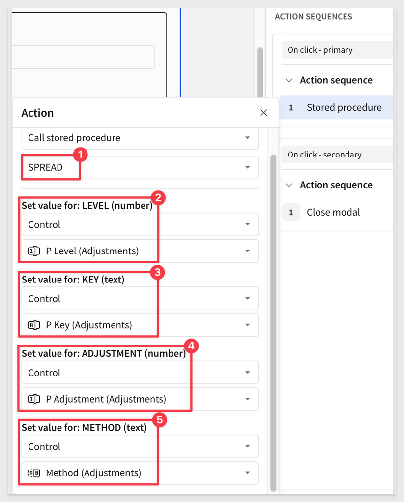

For more details, including detailed end-to-end examples, see [Create actions that call stored procedures (Beta).](https://help.sigmacomputing.com/docs/create-actions-that-call-stored-procedures)


### Copy and paste actions and sequences 
Individual actions or entire sequences can now be copy/pasted to allow rapid reuse configurations across your organization. 

You can paste a copied action or sequence to the same element, a different element in the same workbook, or an element in a different workbook.

In the action or sequence menu, click `Copy action` or `Copy sequence`, then use the `Paste` action within a sequence, `Paste` action below another action, or `Paste` sequence option to paste the configuration to a specific location:

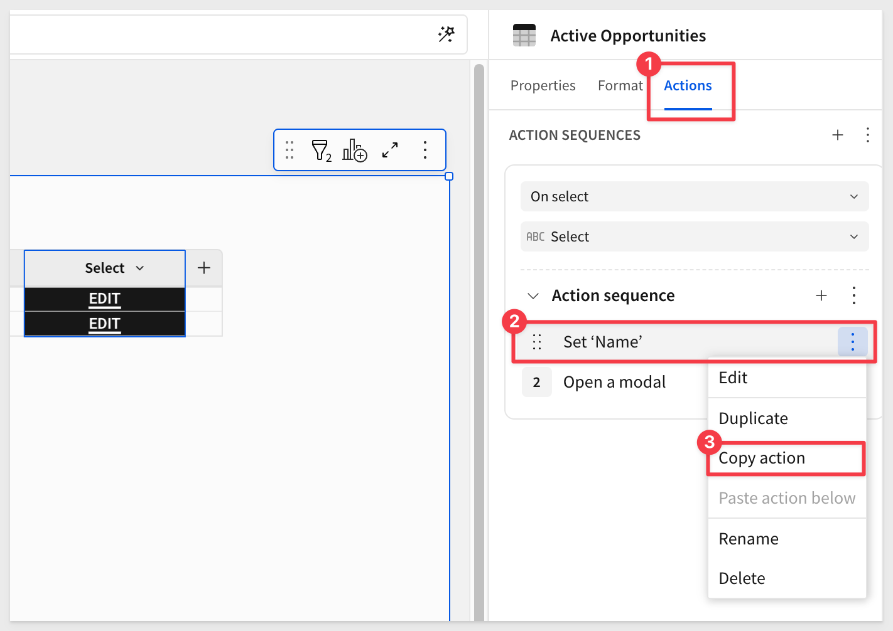


### Modal element (GA) 
Modals help simplify workbook design and allow you to build a streamlined, app-like experience. 

An open modal overlays and obscures a workbook page to provide a focused view of the modal content. This reduces visual clutter and allows you to present form fields, provide customized drill-downs, display controls and filters in a dedicated container, etc.

To incorporate a modal into a workbook, you must configure an `Open modal` action. 

For more information, see [Add a modal to a workbook](https://help.sigmacomputing.com/docs/add-a-modal-to-a-workbook) and [Open or close a modal.](https://help.sigmacomputing.com/docs/create-actions-that-navigate-to-destinations#open-or-close-a-modal)


### Option to open workbook templates with actions
When configuring an `Open Sigma doc` action, you can now select a workbook template as the destination.


### Prevent whitespace from triggering actions
By default, actions configured on charts can be triggered when a user clicks on whitespace within the element. 

You can disable this to prevent unwanted initiation of actions.

In the `Actions panel`, click `More` and select `Allow whitespace to trigger actions`. If there is no checkmark displayed on the setting, whitespace is disabled as a trigger:

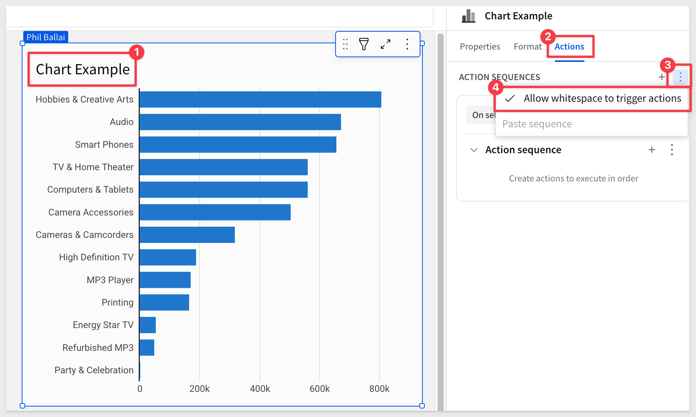


### Select tab action (Beta)
With the addition of tabbed containers--**such a cool feature,** you can now create an action to display a specific tab in a tabbed container element. 

Configure these actions based on user actions and optional conditions to customize what your tabbed container displays.

The tabs in a tabbed container can be visible or hidden from the end user. If they are hidden, the `Select tab` action is the only way to display tabs other than the default tab.

For more information, see [Create actions that modify or refresh elements.](https://help.sigmacomputing.com/docs/create-actions-that-modify-or-refresh-elements#select-tab-beta)


### Update row and Delete row actions (Beta)
Use the `Update row` and `Delete row` actions to modify input tables. 

`Update row` allows user interaction to update values in an existing row, while `Delete row` removes an entire row. 

These actions are designed to support form functionality, but can be used in other ways to accommodate different data app use cases.

For more information, see [Create actions that modify input table data.](https://help.sigmacomputing.com/docs/create-actions-that-modify-input-table-data)


### Updated application of the "On close" action trigger for modals
The `On close` trigger type for modals has been updated to only initiate actions when a user clicks the `Close icon` or anywhere outside the modal. 

The trigger no longer applies when the `Close modal` action is configured for the primary or secondary button.

If you configured actions for the `On close` trigger that are intended to initiate when a user clicks a button to trigger a `Close modal` action, you can move the actions to the applicable button trigger.


### Updated trigger type UI
In the `Actions panel`, action sequences are no longer added and grouped based on trigger type (On select, On change, On click, etc.). 

Each sequence indicates the trigger type, and you can select a different option from a dropdown when multiple types are available.


<!-- END OF SECTION-->


## Administration
Duration: 20


### Add a key file for Snowflake key pair connections
When configuring a Snowflake connection, you can add a `PKCS#8-formatted key file (.p8)` instead of pasting your private key when setting up key pair authentication for the connection or an OAuth service account.

***Why it matters:***<br>
This improves security and operational hygiene by allowing teams to manage keys as files instead of pasting sensitive material into UI fields.

For more information, see [Connect to Snowflake](https://help.sigmacomputing.com/docs/connect-to-snowflake)


### Alerts before OAuth sessions expire
Users now see an alert message 20 minutes before their connection-level OAuth session expires, prompting them to re-sign into the connection. 

For more information, see [Configure OAuth](https://help.sigmacomputing.com/docs/configure-oauth)


### Allow users with View license to ask natural language queries with Ask Sigma
The `Use Ask Sigma` permission can now be enabled for users with the `View` license (or Lite license). 

No existing account types were changed. 

To enable `Ask Sigma` for users who did not previously have access, update their account types to add the permission:


For more information, see [Account type and license overview](https://help.sigmacomputing.com/docs/account-type-and-license-overview)

<aside class="positive">
<strong>IMPORTANT:</strong><br> To continue analysis in a workbook, a user's account type must also have the Create, edit, and publish workbooks permission enabled.
</aside>


### Allow users with View license to browse connections
The `View connections` permission can now be enabled for users with the `View` license (or Lite license). 

Users with this permission enabled on their account type can view database or catalog, schema, or table names that they have access to. 

<aside class="positive">
<strong>IMPORTANT:</strong><br> This permission does not grant access to data in connections. 
</aside>


For more information, see [Manage access to data and connections](https://help.sigmacomputing.com/docs/manage-data-permissions)


### Allowlist new IP address for email burst exports
If your organization restricts email traffic sent from specific IP addresses, add 134.128.103.81 to the allowlist by September 22, 2025. 

This IP address is in addition to the 198.37.153.185 address that Sigma currently uses. 

<aside class="positive">
<strong>IMPORTANT:</strong><br> Organizations without this new IP address allowlisted might have issues receiving email burst exports after September 22, 2025.
</aside>

Alternatively, you can configure a custom SMTP server to use instead. For more information, see [Custom SMTP server](https://help.sigmacomputing.com/docs/customize-welcome-and-invite-emails#custom-smtp-server)


### App-based two-factor authentication for users (Beta)
You can now enable app based authentication for two factor authentication for individual user profiles in Sigma. 

Admins can reset app based authentication enrollment for users in their organization who have enabled it.

For more information, see [App-based authentication for users](https://help.sigmacomputing.com/docs/app-based-authentication-for-users)


### Audit log events for stored procedures
The Sigma Audit Logs connection now features a `STORED_PROCEDURES` event category that records events related to the execution of stored procedures.

For more information, see [Audit log events and metadata](https://help.sigmacomputing.com/docs/audit-log-events-and-metadata)


### Audit log regional support
Sigma now supports audit log events for organizations hosted in the `GCP KSA` and `Azure EU (West Europe)` regions.

***Why it matters:***<br>
Enables compliance and operational observability for customers operating in additional cloud regions, supporting local regulatory requirements.

For a list of all supported regions, see [Enable or disable audit logging](https://help.sigmacomputing.com/docs/enable-audit-logging)


### Audit log support for AWS UK region
Sigma now supports audit log events for organizations hosted in the AWS UK region.


### Audit logging events for app-based two-factor authentication (Beta)
You can now view app-based two-factor authentication login events in the audit logs.


### Audit logs now available in us-east-1 region
Organizations hosted in AWS us-east-1 are now able to access the Sigma Audit Logs connection, which records data related to user-initiated events that occur within your Sigma organization. The connection is disabled by default, but an Admin user can enable it in the Administration portal.

For more information, see [Enable audit logging](https://help.sigmacomputing.com/docs/enable-audit-logging)

There is also a [QuickStart on Audit Logging.](https://quickstarts.sigmacomputing.com/guide/administration_audit_logging/index.html?index=..%2F..index#0)


### AWS US East region is now available 
Sigma is now deployed in `AWS US East (us-east-1).` 

This region, located in Northern Virginia, is the largest AWS region and gives customers on the East Coast lower latency and enhanced performance when connecting to Sigma.


### Azure Canada region
Sigma is now deployed in Azure Canada. Located in `Toronto`, this deployment gives customers in Canada more control over data storage while enabling compliance with internal policies and external data residency requirements.

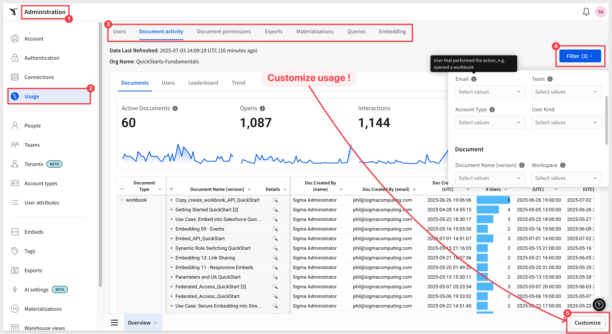

For more information, see [Supported cloud platforms and regions](https://help.sigmacomputing.com/docs/region-warehouse-and-feature-support#supported-cloud-platforms-and-regions)


### Azure SQL Database, SQL Server 2022 and Azure Managed Instance connections (Beta) 

Sigma now supports secure connections to Azure SQL Database, SQL Server 2022 and Azure SQL Managed Instances.

For more information on how to set up these connections, see [Connect to Azure SQL Database (Beta)](https://help.sigmacomputing.com/docs/connect-to-azure-sql-database) and [Connect to SQL Server and Azure SQL Managed Instance (Beta)](https://help.sigmacomputing.com/docs/connect-to-sql-server-2022)


### COMMENTS audit log dimension table
The `SIGMA_SHARED` schema in the Sigma Audit Logs connection now features a `COMMENTS` dimension table containing information about comment activity on workbooks and elements, including a full transcript, attachments, and mentioned users.

For more information, see [Sigma Shared metadata reference in Audit log events and metadata.](https://help.sigmacomputing.com/docs/audit-log-events-and-metadata#sigma-shared-metadata-reference)


### Disable audit logging
You can now disable audit logging in Sigma. 

<aside class="positive">
<strong>IMPORTANT:</strong><br> This will delete any storage integrations and cancel any scheduled exports. Sigma retains your audit log data for 30 days after disabling
</aside>

For more information, see: [Enable or disable audit logging](https://help.sigmacomputing.com/docs/enable-audit-logging)


### Dutch is now supported as a workbook locale
You can now set Dutch (nl-nl) as your workbook locale. Apply the Dutch language, date format, and currency can to workbook previews and embedded workbooks.

For more information, see [Manage workbook localization](https://help.sigmacomputing.com/docs/manage-workbook-localization)


### EN-AU now supported as an account locale
You can now set `Australian English` as your organization’s locale. 

Setting `EN-AU` as your organization’s locale will allow `EN-AU` number formatting, currency, and custom translations to be used as a default across the organization.

For more information, see [Manage organization locale.](https://help.sigmacomputing.com/docs/manage-organization-locale)


### Enable a unique SAML SP entity ID (Beta)
When setting up SAML-based authentication for a Sigma organization, you can now assign a unique service provider (SP) entity ID for the SAML configuration. With the unique entity ID for Sigma as an SP, you can configure your IdP to allow SAML authentication to multiple Sigma organizations.


### Enable a unique SAML SP entity ID (GA)
When setting up SAML-based authentication for a Sigma organization, you can now assign a unique service provider (SP) entity ID for the SAML configuration. 

With the unique entity ID for Sigma as an SP, you can configure your IdP to allow SAML authentication to multiple Sigma organizations.

***Why it matters:***<br>
This is essential for enterprises running multiple Sigma environments (dev, test, prod) or multi-tenant deployments, simplifying identity governance across orgs.

For more information, see [Enable unique SAML entity IDs](https://help.sigmacomputing.com/docs/single-sign-on-with-saml#optional-enable-unique-saml-entity-ids)


### Enable multiple identity providers for your organization (Beta)
You can now enable multiple identity providers (IdPs) for your Sigma organization. If you would like to enable multiple IdPs for your organization, please contact Sigma support.

For more information, see [Using multiple identity providers for your Sigma organization (Beta)]()


### Granular permissions for AI features 
Three separate feature permissions now allow admins to configure which account types can use AI features.

Settings for this are found in `Administration` > `Account Types` and scrolling down to `AI`:

 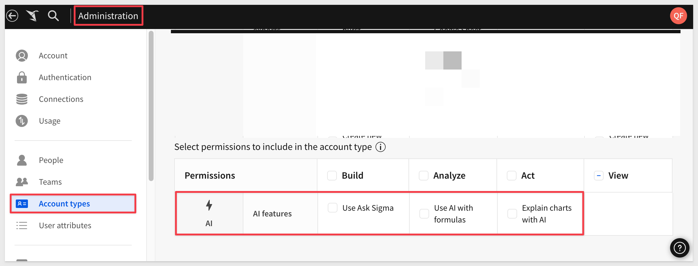

- The **Explain charts with AI** feature permission allows users to see and use the Explain this chart option on any visualization. 

- The **Use AI with formulas** feature permission allows users to use the AI-powered formula assistant to write new formulas, correct formula errors, and explain existing formulas. 

- The **Use Ask Sigma** feature permission allows users to ask natural language queries with Ask Sigma. 

<aside class="negative">
<strong>NOTE:</strong><br> The use of AI-powered features also requires an admin to configure an AI provider for the organization.
</aside>

For more information, see [Account type and license overview](https://help.sigmacomputing.com/docs/account-type-and-license-overview) and [Configure AI features for your organization](https://help.sigmacomputing.com/docs/configure-ai-features-for-your-organization)


### Improved management of developer credentials
On the `Developer access` page in the `Administration` portal, the owner of each set of developer credentials is now identified by `email` instead of by `user name. 

As a result, admins can now identify which API token is assigned to each user, even when multiple users share the same username.

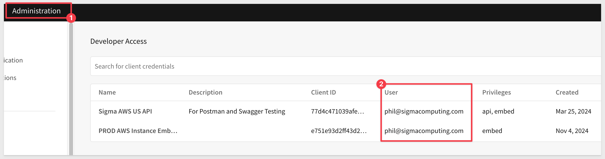


### Improved usage dashboards
Usage dashboards have been improved to provide better performance and easier navigation. 

To view insights into how your organization uses Sigma and data on your queries, embeds, materializations, and more, go to `Administration` > `Usage`. 

Just a few of the long list of changes are:

**Custom Views:**<br>
Users can customize their view of a usage dashboard, save it, and go back to it on their next visit. You can have as many views as you'd like. A view can be simple like saving a customer filter, sorting, or adding a new column. A view can also include adding an entirely new page of visualizations directly against the official Usage data model. You can effectively build and save your own usage dashboards now!

**Fresh design:**<br>
No more scrolling and searching for filters. Everything has been moved into a tabbed layout and filters are tucked away to reduce clutter.

**The latest Sigma features included:**<br>
    - **Tabbed Containers**
    - Modals
    - Popovers
    - Actions

**Overall performance improvements**<br>

You can also now create and save custom views of your usage dashboards, which allows you to customize the appearance, layout, sorting, and filters of your existing dashboards, or even create new ones of your own.

For more information, see [Usage overview](https://help.sigmacomputing.com/docs/usage-overview) 


### Infrastructure (for new trial account)
When creating a new Sigma organization as a free trial, you can now select your preferred cloud provider and region during the sign up process.

For more information, see [Supported regions, data platforms, and features](https://help.sigmacomputing.com/docs/region-warehouse-and-feature-support)


### Input table audit logging (Beta) 
Audit logs now record events and metadata related to input table activity. 

Admins can parse input table audit log data to understand the type of edit performed (e.g., create input table, add row, update row, delete row, etc.), who was responsible, and when the activity occurred. 

The metadata identifies the edited input table as well as the number of affected rows and columns, but it does not record the content of the edits.

For more information about input table audit log events and metadata, see the INPUT_TABLES event category in [Audit events reference](https://help.sigmacomputing.com/docs/audit-log-events-and-metadata#audit-events-reference):


### Inputting invalid SAML RelayState now displays error messages
When a SAML RelayState with invalid origin is entered, an error message is now displayed.


### Internal stages for CSV uploads
For Snowflake connections, you can now elect to import CSV files via internal or external stages after the files are processed in Sigma’s infrastructure. 

This is set at the organization level in Sigma:


For more information, see [Enable internal or external stages for CSV uploads](https://help.sigmacomputing.com/docs/enable-or-disable-csv-upload#enable-internal-or-external-stages-for-csv-uploads-snowflake)


### License tier updates
Sigma's license model now includes four tiers: View, Act, Analyze, and Build. **This structure applies to all organizations created on or after March 4, 2025.**

**The Four Tiers:**
- **View:** Suitable for report consumers who need access to prepared data and insights with baseline interactions
- **Act:** Ideal for collaborative data contributors who actively input and update data
- **Analyze:** Optimized for decision-making data consumers who require more deep-dive capabilities without building workbooks themselves
- **Build:** Designed for data architects, BI analysts, and report builders who model, transform, and analyze data

<aside class="negative">
<strong>NOTE:</strong><br> The Build license also supports system administrators who can manage organization settings and users.
</aside>

Organizations created prior to this date will continue using Lite, Essential, and Pro license tiers and will be scheduled for a license migration at a later date.

For more information about the new licenses, see [Account type and license overview.](https://help.sigmacomputing.com/docs/account-type-and-license-overview)


### Manage upgrade requests in the Administration portal (GA)
The ability to view and respond to account upgrade requests in the Administration portal is now generally available. When a user requests an upgrade to their account type to explore or create workbooks, an admin can review the request in Administration.

<aside class="negative">
<strong>NOTE:</strong><br> When an admin responds to an email requesting an upgrade, the link from the email opens the "Reassign account type" modal.
</aside>

For more information, see [Respond to account upgrade requests](https://help.sigmacomputing.com/docs/respond-to-account-upgrade-requests)


### Materialization with Snowflake dynamic tables (GA)
Materialization with Snowflake dynamic tables is now generally available (GA). 

If your Sigma organization has a Snowflake connection, you can configure materialization to use dynamic tables for materialization. 

<aside class="negative">
<strong>NOTE:</strong><br> New connections to Snowflake use dynamic tables for materialization by default.
</aside>

To set this up for an existing connection, see [Connect to Snowflake](https://help.sigmacomputing.com/docs/connect-to-snowflake#configure-write-access)

For more information, see [About materialization](https://help.sigmacomputing.com/docs/materialization#incremental-materialization-with-dynamic-tables)


### New columns on SUPPORT_CHATS table for audit logs
We have added several new columns to the `SUPPORT_CHATS` table providing greater insight into the conversations you’re having with support:

- Feature Group
- Main Question
- Problem Statement
- Product Classification
- Solution

This information can be found in your `AUDIT_LOG` > `SIGMA_SHARED` > `SUPPORT_CHATS` table and can be used to share questions and outcomes to other users as well, perhaps as part of a FAQ. 

For more information, see [Sigma Shared metadata reference](https://help.sigmacomputing.com/docs/audit-log-events-and-metadata#sigma-shared-metadata-reference)


### New IP address for email burst exports
If your organization restricts email traffic sent from specific IP addresses, add `134.128.103.81` to the allowlist by **September 22, 2025.** 

This IP address is in addition to the 198.37.153.185 address that Sigma currently uses. 

Organizations without this new IP address allowlisted might have issues receiving email burst exports after September 22, 2025.

Alternatively, you can configure a custom SMTP server to use instead. For more information, see [Custom SMTP server](https://help.sigmacomputing.com/docs/customize-welcome-and-invite-emails#custom-smtp-server)


### New permission for calling stored procedure actions
Administrators can now manage which users can call stored procedure actions from a workbook with the `Call stored procedure actions` permission. 

For more information, see [Account type and license overview](https://help.sigmacomputing.com/docs/account-type-and-license-overview)

The permission requires an `Act` or Essentials license. 

<aside class="positive">
<strong>IMPORTANT:</strong><br> Users must also have access to the stored procedure in the connection. 
</aside>

For all requirements, see [Create actions that call stored procedures (Beta)](https://help.sigmacomputing.com/docs/create-actions-that-call-stored-procedures)


### Passing multiple SAML userRole values is now supported
When configuring SAML, it is now possible to pass in multiple `userRole` values. 

The first valid account type in the list of userRole values will be assigned. 

For more information, see [Configure your IdP in Set up single sign-on with SAML](https://help.sigmacomputing.com/docs/single-sign-on-with-saml#configure-your-idp)


### PNG file type now supported for webhook exports
When exporting to a webhook endpoint, the PNG file type is now supported. 

Individual elements can be exported to webhooks as CSV, JSON, PDF or PNG.

For more information, see [Export to webhook](https://help.sigmacomputing.com/docs/export-to-webhook)


### Protect data with customer-managed keys in AWS and Azure
For Sigma organizations hosted in AWS or Azure cloud regions, you can now protect your data in Sigma with customer-managed keys. 

**Why it matters:**<br>
This capability meets enterprise compliance requirements and gives organizations complete control over their encryption keys — essential for regulated industries and security-conscious enterprises.

For more information, see [About using customer-managed keys in Sigma](https://help.sigmacomputing.com/docs/customer-managed-keys-cmk-faqs) 

For setup instructions, see [Set up customer-managed keys](https://help.sigmacomputing.com/docs/set-up-customer-managed-keys-cmk)


### Reduced 2FA code expiry times
Two-factor authentication email codes now expire after 5 minutes, instead of 15 minutes.


### Require all email exports to run as recipient
Sigma admins can now choose to require all email exports to run queries as recipients. 

After enabling this setting, all new and modified email export schedules run queries as the recipients:

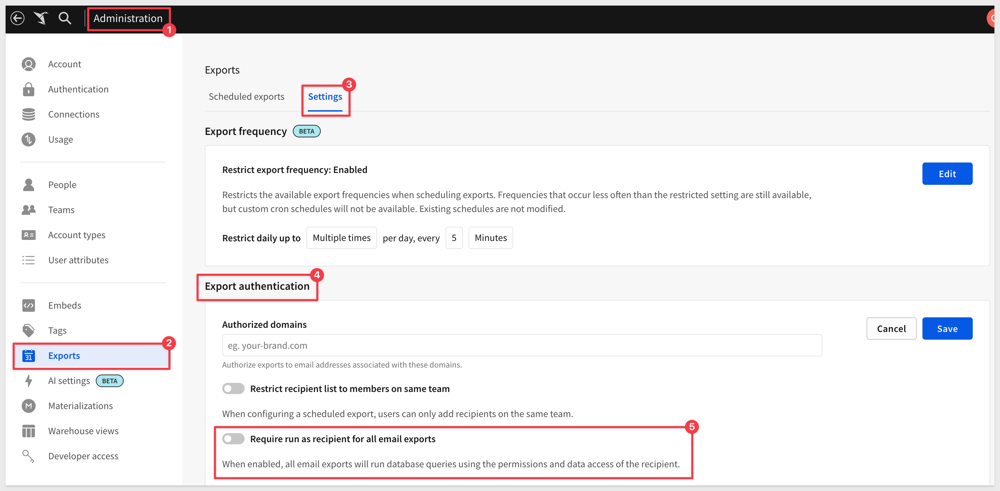

For more information, see [Manage export frequency and authentication settings](https://help.sigmacomputing.com/docs/restrict-export-recipients)


### Restrict access to copying data 
If you want to restrict the ability of Sigma users to copy more than one cell of data at a time, a user assigned the Admin account type can turn off the Bulk copy from tables toggle for your organization.

By default, the toggle is turned on, maintaining the existing behavior of allowing users to copy multiple cells from tables, pivot tables, input tables, and the underlying data of a chart.


### SAML configuration values now available in Administration portal
When setting up single sign-on with SAML, you can now copy and paste your SAML configuration values (e.g. prefix, RelayState) from the Administration portal. 

Go to `Administration` > `Authentication` > `Edit`, and your configuration values will be available under `Authentication Method & Options`:

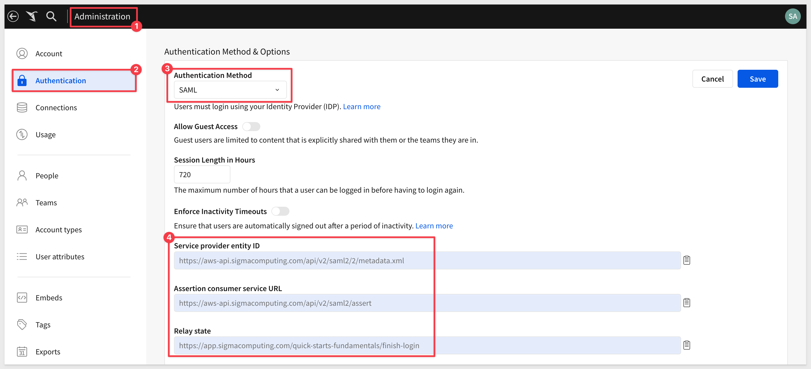

For more information, see: [Set up single sign-on with SAML](https://help.sigmacomputing.com/docs/single-sign-on-with-saml#configure-your-idp-manually)


### Scheduled Exports for usage dashboards
Related to the effort or overhaul the usage dashboards. usage users can now create their own views/bookmarks, and can also schedule those views.


### Scheduled materialization bypass on Snowflake connections
When using materialization with a Snowflake connection, Sigma detects data updates in materialized elements in workbooks and data models. 

If the underlying data hasn’t been updated since the last successful materialization, **Sigma bypasses the scheduled materialization to reduce unnecessary compute time and costs.**

For more information, see [Scheduled materialization bypass](https://help.sigmacomputing.com/docs/materialization#scheduled-materialization-bypass)


### Set up Key Pair authentication for OAuth service accounts (GA) 
You can now set up Key Pair authentication for Snowflake OAuth service accounts. 

For more information, see [Connect to Snowflake with OAuth](https://help.sigmacomputing.com/docs/connect-to-snowflake#connect-to-snowflake-with-oauth)


### Sigma now supports the Google Cloud Platform in the Kingdom of Saudi Arabia
Sigma is now deployed in GCP KSA (me-central2). 

This deployment delivers significantly lower latency and enhanced performance for Middle East customers when connecting to Sigma.


### Turkish now supported as a workbook locale
You can now set Turkish (tr-tr) as your workbook locale. Apply the Turkish language, date format, and currency to workbook previews and embedded workbooks.

For more information, see [Manage workbook localization](https://help.sigmacomputing.com/docs/manage-workbook-localization)


### Uniquely identify SAML attributes with the Sigma namespace prefix
You can now uniquely identify your SAML attributes by using the Sigma namespace prefix (https://schema.sigmacomputing.com/2025/01/claims). 

This can be applied to the `userRole` and `userGroups` attributes to avoid overlap with other app configurations. 

For example, the `userRole` attribute name would look like `https://schema.sigmacomputing.com/2025/01/claims/userRole`.

For more information, see [Configure SSO for your Sigma Organization in Single sign-on with SAML.](https://help.sigmacomputing.com/docs/single-sign-on-with-saml)


### Updated authentication method for Snowflake Partner Connect connections
New and existing connections to Snowflake created from Snowflake Partner Connect are authenticated using key pair authentication instead of basic authentication.

For more information, see [Connect to Snowflake](https://help.sigmacomputing.com/docs/connect-to-snowflake)

### Updated Exports tab in Administration
The `Exports` tab in `Administration` has been updated with additional functionality and information. 

You can now:
- Filter export schedules by when they were last run.
- Retry errored exports.
- View additional information like when your export was last run and the current status of each scheduled export.

For more information, see [Manage organization schedules](https://help.sigmacomputing.com/docs/manage-organization-schedules)

### Updated team creation behavior
Admins who create teams are no longer automatically added as members of that team. Teams now start empty, allowing the admin to choose whether or not to include themselves as a member.


### Updated user requirements for creating shared views
The ability to share saved views is now limited to users who are assigned account types with the `Create`, `edit`, and `publish workbooks` permission enabled:

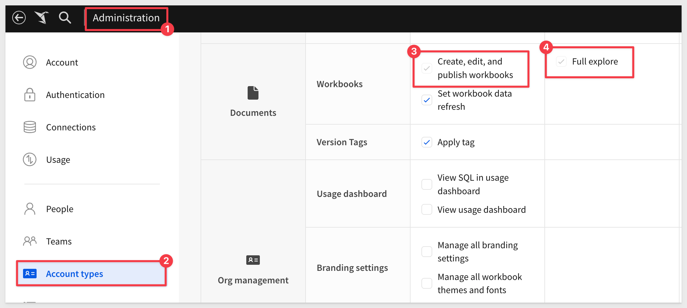

Users who are assigned account types with the `Full explore` permission enabled (without Create, edit, and publish workbooks) can create and save custom views, but cannot share them.

Existing shared views will remain shared regardless of the account type assigned to the user who created them. For more information about saved views, see Create and share saved views.


### Use different OAuth configurations for authenticating users to your connections than you use for your Sigma organization (Beta)
Sigma now supports authenticating a connection with OAuth without re-using OAuth credentials used for authenticating users to your Sigma organization. 

As a result:

- You no longer need to use OAuth as your authentication method for your Sigma organization in order to authenticate a connection with OAuth.
- If you use multiple IdPs and data platforms, you can create connections with different OAuth configurations as needed.
- When authenticating Snowflake connections with OAuth, you can configure Proof Key for Code Exchange (PKCE) and/or JSON Web Tokens (JWTs) to secure your connection.

For instructions on how to configure a unique OAuth connection for a Databricks or Snowflake connection, see:

[Connect to Databricks](https://help.sigmacomputing.com/docs/connect-to-databricks#configure-oauth-features)<br>

[Connect to Snowflake](https://help.sigmacomputing.com/docs/connect-to-snowflake#connect-to-snowflake-with-oauth)

For more general information about OAuth, see [Configure OAuth.](https://help.sigmacomputing.com/docs/configure-oauth#use-different-oauth-configurations-for-authenticating-users-to-your-connections-than-you-use-for-your-sigma-organization-beta)


### Use Snowflake as your OAuth authorization server (Beta) 
When you connect to Snowflake using OAuth, you can choose to authenticate directly with Snowflake functioning as the OAuth authorization server instead of configuring an external identity provider (IdP) to access Snowflake. 

You can only use Snowflake as your OAuth authorization server to authenticate to a Snowflake connection.

**Why it matters:**<br>
This simplifies authentication architecture by eliminating the need for external identity providers — reducing complexity and setup time for Snowflake customers while maintaining secure OAuth flows.

For more information, see [Use the Snowflake authorization server for connection-level OAuth](https://help.sigmacomputing.com/docs/connect-to-snowflake-oauth#use-the-snowflake-authorization-server-for-connection-level-oauth)


### User-friendly names for cloud platforms in the Administration portal
Friendly names are now used for cloud platforms in the Administration portal. To view your cloud platform, go to `Administration` > `Account` > `General Settings`, then locate the `Site` section. The Cloud field identifies the platform hosting your organization:


For more information, see [Supported regions, data platforms, and features](https://help.sigmacomputing.com/docs/region-warehouse-and-feature-support)


## AI Apps
Duration: 20


### AI export schedule names (Beta)
For all organizations that have an AI provider assigned, Sigma now uses AI to generate export schedule names based on your export attachment name, export destination type and format, and set conditions. 

These names are visible when viewing all your or your organization's scheduled exports in Sigma, and do not affect the contents of the export itself.

For more information, see [Use AI export schedule names (Beta)](https://help.sigmacomputing.com/docs/manage-organization-schedules#/use-ai-export-schedule-names-beta)


### App notification actions (Beta) 
Sigma is rolling out app notification actions to public beta for all customers. You can use app notification actions to notify users and channels via email and Slack, independent of an export or download. 

The feature enables interesting workflows, alerting users to information in real-time (or email) so that they may respond appropriately.

For more information, see [Create actions that send notifications and export data](https://help.sigmacomputing.com/docs/create-actions-that-send-notifications-and-export-data)

The Notify and export action replaces the existing Download and export action. Existing Download and export actions will be migrated without changes to functionality.


### App notifications (GA) 
You can now create actions that send notifications to users via email, Slack, and Microsoft Teams using the notify and export action. 

These actions can be configured independently of an export or attachment. 

Notification actions support dynamic messages and lists of recipients based on workbook data. 

**Why it matters:**<br>
This transforms a Sigma workbook from a passive analytics tool into an active business process driver — enabling automated alerts, approvals, and data-driven workflows that keep teams aligned and responsive.

For more information, see [Create actions that send notifications and export data](https://help.sigmacomputing.com/docs/create-actions-that-send-notifications-and-export-data)


### Ask away
The Ask Sigma interface is simple—but it’s also built to help you target specific data sources.

This time, let’s try a more focused question:

```plaintext
The CEO wants to know the bottom ten stores in the chain.
```

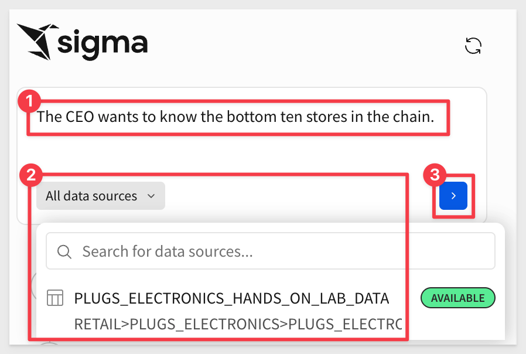

Ask Sigma explains what it's doing at each step and why. You can jump off into a workbook at any point to explore further on your own:

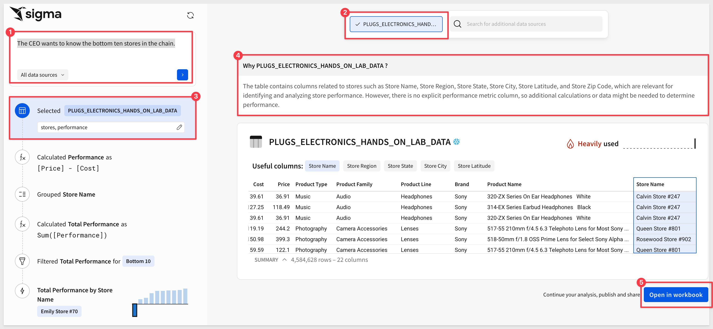

Once the response is ready, you’ll see:
- A full explanation of the result
- Options to adjust calculations
- Multiple charts to choose from for your workbook

Some generated charts may not be helpful—for example, `Store Latitude, Store Longitude, and Store Key` aren’t useful in this case. so we won't select them.


If you're happy with the results, you can open the selected items in a workbook—or keep refining in Ask Sigma.


Once inside a workbook, you can save it, make any changes you like, or use Sigma’s [Explore Anywhere](https://help.sigmacomputing.com/docs/view-underlying-data) feature for deeper analysis:

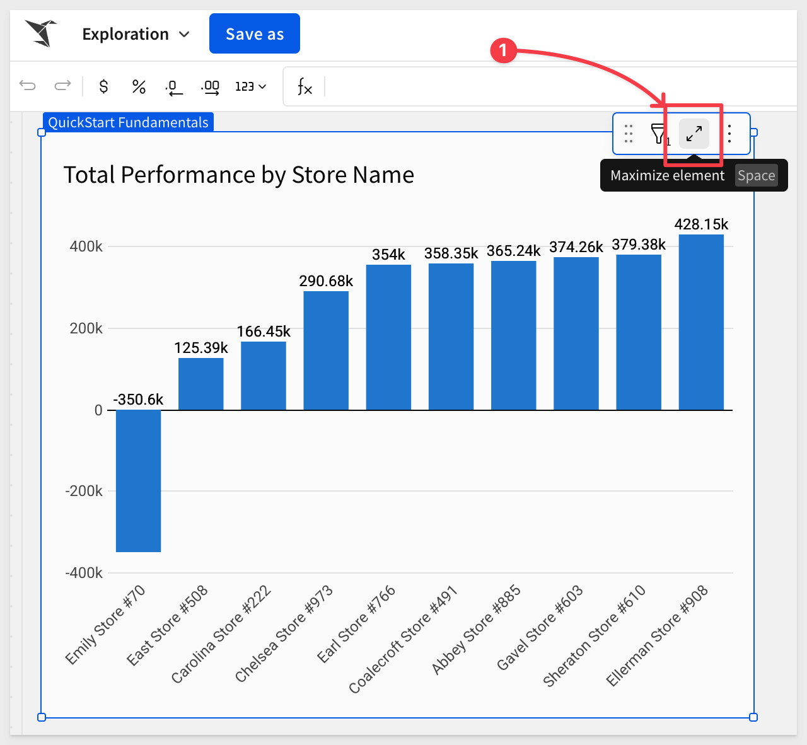<br><br>

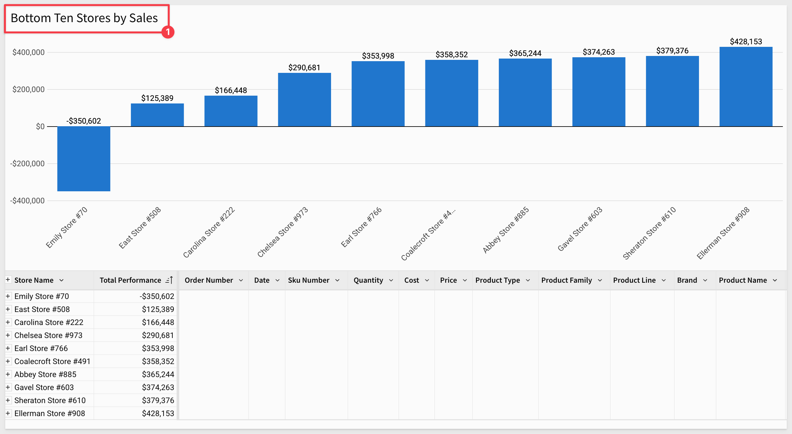

It’s clear that Ask Sigma changes the way people will use Sigma—and it’s only getting better. Stay tuned!


### Ask follow-up questions in Ask Sigma 
Ask Sigma now supports asking follow-up questions about your data. After you ask a question in Ask Sigma, you can continue the conversation, asking Ask Sigma to continue the analysis or change the analysis. To start a new conversation, click Reset.

As part of this change, you can no longer pass a prompt to Ask Sigma using a query string parameter and
share questions in a custom URL.

For more information, see [Ask natural language queries with Ask Sigma](https://help.sigmacomputing.com/docs/ask-natural-language-queries-with-ask-sigma)


### Ask follow-up questions in Ask Sigma 
Ask Sigma now supports asking follow-up questions about your data. 

After you ask a question in Ask Sigma, you can continue the conversation, asking Ask Sigma to continue the analysis or change the analysis. To start a new conversation, click `Reset`.

***Why it matters:***<br>
This turns Ask Sigma into a **conversational** analysis tool, allowing iterative exploration instead of restarting from a single-question workflow.

For more information, see [Ask natural language queries with Ask Sigma](https://help.sigmacomputing.com/docs/ask-natural-language-queries-with-ask-sigma)


### Ask Sigma (BETA) 
We’re at a point in time where AI is expected in any modern software product.

Providing AI functionality isn’t especially difficult these days—but making it easy to use and genuinely helpful requires thoughtful design and a deep understanding of how users can benefit from the results.

Incorrect or misleading AI output isn’t just frustrating—it wastes time, and in a business context, it can lead to poor decisions.

Ask Sigma breaks down every step AI took to generate its answer. This lets you double-check results, edit any step of the analysis, and work more confidently with AI.

Here’s a short video for those who don’t yet have an AI API key but want to see the functionality in action.

If the embedded video is tool small on your screen, you can [view the larger version here.](https://www.sigmacomputing.com/product/ask-sigma)


### Ask Sigma Discovery 
Now, when you access the Ask Sigma page, Ask Sigma automatically compiles expandable data collections based on the highlighted data sources for your organization. 

For example:


For more information, see [Ask Sigma Discovery](https://help.sigmacomputing.com/docs/ask-sigma-discovery)


### Ask Sigma for data source tables
When you view a data source table on the `Connections` page, you can now ask a question of the data source from the `Ask Sigma` option on the `Overview` tab. 

You can ask a question of any data source table visible to you, not just sources highlighted for Ask Sigma:


When you enter a question, Ask Sigma runs with it and in seconds we have a result we can use to answer the question, iterate on or explore in a workbook:


For more information, see [Ask a question on a data source table](https://help.sigmacomputing.com/docs/ask-natural-language-queries-with-ask-sigma#ask-a-question-on-a-data-source-table)


### Ask Sigma for data source tables
When you view a data source table on the `Connections` page, you can now ask a question of the data source from the Ask Sigma option on the `Overview` tab. 

You can ask a question of any data source table visible to you, not just sources highlighted for Ask Sigma. 

When you enter a question, Sigma opens Ask Sigma in a new browser tab, populated with the question that you asked.


### Ask Sigma returns best match workbooks (Beta) 
Ask Sigma now suggests workbook matches to user questions by automatically cataloging workbook usage data on a daily basis. Users assigned the Admin account type can manually update the workbooks cataloged at any time using the Reindex option on the Administrator > AI Settings page.

**Why it matters:**<br>
This update improves discovery and relevance by connecting user questions to the most used and contextually appropriate workbooks — helping teams find trusted answers faster.


### Ask Sigma supports data model relationships and Snowflake semantic views
When Ask Sigma responds to questions with a data model or Snowflake semantic view, Ask Sigma can join related tables to provide higher-quality answers.

For more information, see [Ask natural language queries with Ask Sigma](https://help.sigmacomputing.com/docs/ask-natural-language-queries-with-ask-sigma)


### Ask Sigma supports data model relationships and Snowflake semantic views
When Ask Sigma responds to questions with a data model or Snowflake semantic view, Ask Sigma can join related tables to provide higher-quality answers. 

If you want to ask questions directly of a semantic view, browse to the semantic view in the data catalog and use Ask Sigma on the semantic view.

***Why it matters:***<br>
Ask Sigma can now leverage governed relationships and semantic definitions, ensuring answers align with business logic and reduce join ambiguity.

For more information, see [Ask natural language queries with Ask Sigma](https://help.sigmacomputing.com/docs/ask-natural-language-queries-with-ask-sigma)


### Bonus: AI Formula Assistant (BETA)  
Sigma also includes a Formula Assistant powered by AI. It can:
- Write new formulas
- Correct formula errors
- Explain existing formulas used in workbooks and data models

Let’s say someone in Finance provides a formula they want applied at the group level:
```code
Revenue Efficiency Score= 
Quantity×Price+Cost
(Price−Cost)×Quantity
```

Instead of writing it manually, let the AI Formula Assistant convert it for you:


Once done, you can review the formula, rename the column, and format it to match your needs:

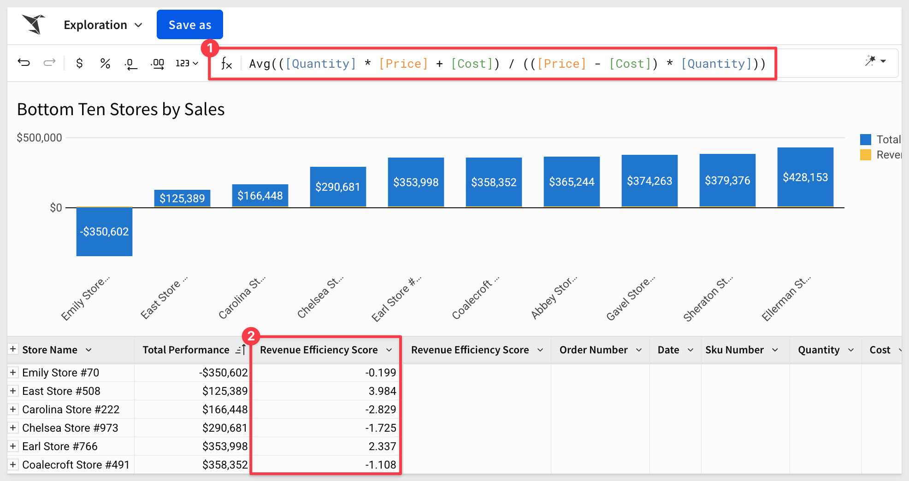

And if you’re not sure what the formula does, just ask the Formula Assistant to explain it:


Now we know: a low Revenue Efficiency Score is bad—and we should dig deeper into what’s bringing it down.

For more information, here are some documentation links:

[Ask natural language queries with Ask Sigma](https://help.sigmacomputing.com/docs/ask-natural-language-queries-with-ask-sigma)

[Embed Ask Sigma (Beta)](https://help.sigmacomputing.com/docs/embed-ask-sigma)

[Configure AI features for your organization](https://help.sigmacomputing.com/docs/configure-ai-features-for-your-organization)

### Call stored procedures with actions (GA) 
Call stored procedures defined in a Snowflake, BigQuery, or Amazon Redshift connection using an action is now GA. 

If the stored procedure returns non-tabular results like a string, number, or Boolean value, you can work with the output as an action variable and display the values in dynamic text or a control element.

For example, if you have an existing stored procedure to calculate project timelines based on several variables, you can set up an AI App with input control elements to collect the variables, pass them as arguments to a stored procedure action that calls the stored procedure, then display the results in a control element and store them in an input table in Sigma.

For more information, see [Create actions that call stored procedures](https://help.sigmacomputing.com/docs/create-actions-that-call-stored-procedures)

There are also QuickStarts:<br>
[Integrate 3rd Party REST API via Stored Procedure](https://quickstarts.sigmacomputing.com/guide/dataapps_calling_external_api_procedure/index.html?index=..%2F..index#0)

[Snapshotting with Stored Procedures](https://quickstarts.sigmacomputing.com/guide/dataapps_snapshotting_with_sp/index.html?index=..%2F..index#0)


### Column order enforced when dynamically moving columns
When you use a multi-select list control to dynamically move columns into and out of groupings or properties (via the Move columns action), the column order in the table now matches the order of the values defined in the control.

The `Move column` action moves columns into or out of a table grouping, pivot table property (row, column, or value), or chart property (axis, color, tooltip, etc.) in the target element. Columns can be moved based on a static selection or when column names match selected control values in the trigger element.

<aside class="positive">
<strong>IMPORTANT:</strong><br> If the target element is a table, the Move columns option is only available when the table contains existing groupings.

If the target element is a pivot table or chart, the action doesn't remove an existing column from the target property unless the property only supports one column.
</aside>

For more information, see [Move columns](https://help.sigmacomputing.com/docs/create-actions-that-modify-or-refresh-elements#move-columns)


### Configure a usage dashboard for Ask Sigma (Beta)
Admins can now configure a usage dashboard to view data about how Ask Sigma is used in their Sigma organization.

For more information, see [Configure a usage dashboard for Ask Sigma (Beta)](https://help.sigmacomputing.com/docs/configure-a-usage-dashboard-for-ask-sigma)

There is also a QuickStart: [Ask Sigma usage](https://quickstarts.sigmacomputing.com/guide/administration_ask_sigma_usage_dashboard/index.html?index=..%2F..index#0) to make it easy to deploy.


### Custom context menu actions (Beta) 
You can now add custom context menu items in tables, pivot tables, input tables, and charts to provide clear, discoverable triggers for actions relevant to selected cells and data points. 

You can add standalone menu items or create nested submenus that execute any action effect, including calling stored procedures, generating iframe events, and opening modals.

This unlocks really interesting workflows to get users the detail they need quickly.

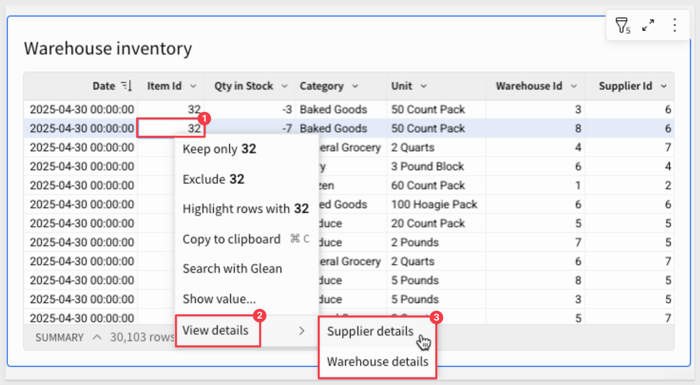

For more information, see [Create custom context menu actions (Beta)](https://help.sigmacomputing.com/docs/create-custom-context-menu-actions)


### Custom context menu actions (GA) 
You can now add custom context menu items in tables, pivot tables, input tables, and charts to provide clear, discoverable triggers for actions relevant to selected cells and data points.

You can add standalone menu items or create nested submenus that execute any action effect, including calling stored procedures, generating iframe events, and opening modals.

This feature enables a whole new level of customization that is both simple to implement, powerful and will accerlate end user adoption:


For more information, see [Create custom context menu actions](https://help.sigmacomputing.com/docs/create-custom-context-menu-actions)


### Dependent action notification for element deletion
When you delete an element that’s the target of an action, you’re notified of the dependency when confirming the element deletion. 

In the confirmation modal, you can select the `Delete impacted actions` checkbox to delete the dependent action along with the element. 

Alternatively, if you don’t select the checkbox, the broken action is retained, and you can reconfigure it as needed.


### Dynamic recipients and messages for notify and export actions to MS Teams
You can now configure a list of dynamic recipients and dynamic message contents for notify and export actions sent to Microsoft Teams. 

For more information, see [Send notifications by Microsoft Teams](https://help.sigmacomputing.com/docs/create-actions-that-send-notifications-and-export-data#send-notifications-or-export-data-to-microsoft-teams)


### Enable AI
To use AI features in Sigma, you’ll need to provide an API key from your selected AI provider.

Navigate to `Administration` > `AI settings`, select the AI provider and provide a valid `API Key`:

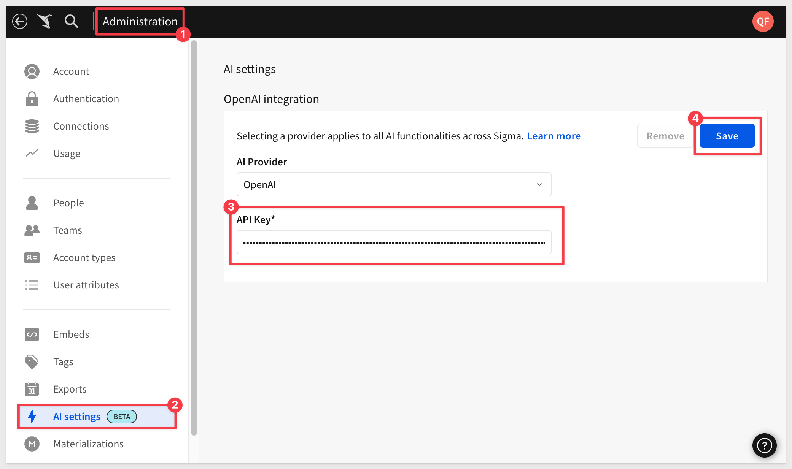

For more information, see [Configure AI features for your organization](https://help.sigmacomputing.com/docs/configure-ai-features-for-your-organization)


### Explore with related charts in Ask Sigma (Beta) 
After you receive an initial answer from `Ask Sigma`, you can continue your exploration. 

`Ask Sigma` provides related charts underneath its primary answer to offer avenues to analyze related data.

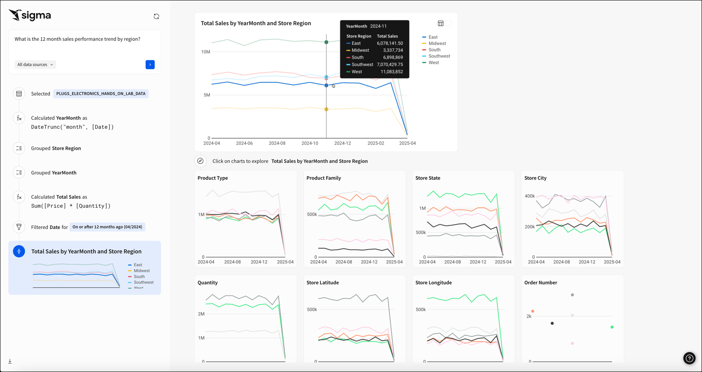

<aside class="positive">
<strong>IMPORTANT:</strong><br> This section is longer than normal due to the release of Sigma's AI features (BETA) and their impact on how users can use Sigma. We hope you find it useful.
</aside>


### Formula support in image URL
When configuring an image element, you can enter dynamic text in the `Image URL` field to source the URL from a formula. 

For example, `Lookup([Team/Profile Image URL], CurrentUserEmail(), [Team/Email])` references the Profile Image URL column in an existing `Teams` table to dynamically display profile images based on the current user.

For more information, see [Add hyperlinks and images to columns](https://help.sigmacomputing.com/docs/add-hyperlinks-to-columns)


### Gemini and Vertex AI integration (Beta)
You can now configure an external AI integration with `Google Gemini`, or a warehouse AI integration with `BigQuery` through `Google’s Vertex AI API`.

For more information, see [Configure warehouse AI model integration](https://help.sigmacomputing.com/docs/configure-warehouse-ai-model-integration) and [Manage external AI integrations](https://help.sigmacomputing.com/docs/manage-external-ai-integrations)

### Hands on demonstration
If you already have an AI API Key, you can this for yourself now. Otherwise, just follow along.

<aside class="positive"> <strong>From the author:</strong><br> I don’t usually write in the first person, but I’ll make an exception here. I genuinely believe Ask Sigma will start to change the way users work in Sigma—saving tons of time that’s better spent on refining results, not starting from scratch.

Let’s be clear—Ask Sigma is a tool at your disposal. You’re free to use it or not. But it’s worth understanding what I believe is the start of a fundamental shift: the way you think about starting a new project is changing.

Many software vendors like to say “Start with the end in mind.” That sounds good, but having a whiteboard diagram still means you must build everything from scratch—and also figure out how to use some product to build it.

Sure, Sigma is easy to learn and use—but Ask Sigma is even better than that.

Instead of starting with the end-state design, Ask Sigma wants you to start with a problem—framed as a question.

As shown in the video, Ask Sigma will work hard to answer even vague, generic questions like:
"Where are we doing the best?"

That question lacks context, and you can certainly ask clearer questions to receive results that are more aligned with what you're looking for.

But regardless of the query you submit, Ask Sigma provides additional analysis and breakdowns—so you can explore more data and follow your curiosity. You can always edit the AI-generated analysis to better pinpoint what you're after.

The best way to improve Ask Sigma’s performance—and human analysis, too—is to ensure the underlying data is robust and well-organized.

Ask Sigma leverages AI agents that reference metadata (like column and table descriptions), data models, and defined metrics to answer your query.

The more context you provide about your data, the better AI can work with it. So if you’re not getting the results you expect, don’t just tweak the wording of your question. Instead, collaborate with your data team to continuously refine and optimize your assets to drive better outcomes for everyone.

Let’s try it out in the demo below.
</aside> 

<aside class="negative"> <strong>IMPORTANT:</strong><br> Sigma is heavily invested in Ask Sigma—new features and improvements are rolling out all the time! </aside>


### If/else control flow in action sequences (Beta) 
Use `if/else` statements to create dynamic workflows within action sequences. 

If/else control flow adds flexibility to a sequence by allowing it to check one or more conditions and execute actions for the first condition that evaluates to `true`.

Key advantages of using an if/else control flow:

- Simplify action workflows by consolidating multiple conditions into a single sequence. See an example use case with and without if/else.
- Set conditions that reference results of previous actions in the sequence, including called stored procedures. See an example sequence that calls a stored procedure then uses the returned value to apply different logic in the if/else statement.
- Prevent workflow errors and incomplete logic by using an else component to define a default action path.

An typical workflow looks like this:


For more information, see [Build if/else control flow in an action sequence](https://help.sigmacomputing.com/docs/build-if-else-control-flow-in-an-action-sequence)


### If/else control flow in action sequences (GA) 
Use if/else statements to create dynamic workflows within action sequences. 

If/else control flow adds flexibility to a sequence by allowing it to check one or more conditions and execute actions for the first condition that evaluates to true.

The key advantages of using an if/else control flow are:
- Simplify action workflows by consolidating multiple conditions into a single sequence. [See an example use case with and without if/else](https://help.sigmacomputing.com/docs/build-if-else-control-flow-in-an-action-sequence#example-1-with-and-without-ifelse)
- Set conditions that reference results of previous actions in the sequence, including called stored procedures. [See an example sequence that calls a stored procedure then uses the returned value to apply different logic in the if/else statement](https://help.sigmacomputing.com/docs/build-if-else-control-flow-in-an-action-sequence#example-2-check-called-stored-procedure-output)
- Prevent workflow errors and incomplete logic by using an else component to define a default action path.

***Why it matters:***<br>
Action sequences can now support branching logic, enabling far more sophisticated data apps and automation flows without external orchestration tools.

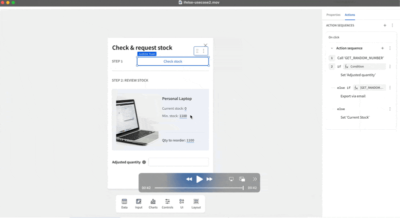

For more information, see [Build if/else control flow in an action sequence](https://help.sigmacomputing.com/docs/build-if-else-control-flow-in-an-action-sequence)


### Input table editing on mobile
Users can now edit input table data on mobile devices. This update enables mobile data app workflows, including direct data input and row updates via actions.


### Input table support on BigQuery connections (GA)
Input tables are now compatible with `BigQuery` connections. 

The dynamic workbook elements support structured data entry, allowing you to integrate new data points into your analysis and augment existing data from your data platform.

For more information about input tables and how to use them, see the following documentation:

[Intro to input tables](https://help.sigmacomputing.com/docs/intro-to-input-tables)
[Create new input tables](https://help.sigmacomputing.com/docs/create-new-input-tables)
[Edit existing input table columns](https://help.sigmacomputing.com/docs/edit-existing-input-table-columns)


### New account type permissions for exports, user attributes, and branding settings
The following admin feature permissions are now available for the `Build` account type and can be granted to custom account types:

- Manage users
- Manage user attributes
- Manage teams
- Manage export integrations

The `Branding` settings permission is now the `Manage email branding` permission and now only control access to the `Customize your email settings` for your organization. Branding settings for workbook themes and custom fonts are restricted under the `Manage all workbook themes and fonts` permission.

For more information, see [Account type and license overview](https://help.sigmacomputing.com/docs/account-type-and-license-overview)


### New AI model versions available
If you have an AI provider configured to use a Databricks connection, or to use Gemini as an external AI provider or through a BigQuery connection, the model version used by Ask Sigma and other AI features has been updated:

- Databricks connections now use databricks-claude-sonnet-4-5
- BigQuery connections now use Gemini 2.5 Flash
= Gemini as an external AI provider now uses Gemini 2.5 Flash

For more information, see [Configure warehouse AI model integration](https://help.sigmacomputing.com/docs/configure-warehouse-ai-model-integration) and [Manage external AI integrations](https://help.sigmacomputing.com/docs/manage-external-ai-integrations)


### Option to remove control selections with actions
In addition to replacing and adding control value selections, the `Set a control value` action now supports the ability to remove selections. 

When you configure separate `Set control value` actions using `Add to existing selection `and the new `Remove from existing selection option`, you can enable users to easily add and remove values from filter controls. For example:


### Pause or resume action sequences 
Pause or resume action sequences to debug and test actions. You can control the pause/resume state of individual sequences or globally change the state of all sequences in the workbook. 

To prevent stale paused states and avoid workflow disruptions, paused sequences automatically resume when the workbook is refreshed.

For more information, see [Create and manage action sequences](https://help.sigmacomputing.com/docs/create-and-manage-action-sequences#pause-or-resume-sequences)


### PostgreSQL support for calling stored procedure actions
You can now call a stored procedure on a PostgreSQL connection from a workbook action.

For more information, see [Create actions that call stored procedures (Beta)](https://help.sigmacomputing.com/docs/create-actions-that-call-stored-procedures)


### Select data sources to make available to Ask Sigma
Now we need to tell Sigma which data sources Ask Sigma can use. Since we are using third-party AI services like OpenAI, we want to be careful about which datasets we allow access to. This process controls that and limits access to data that may be proprietary.

For example, if we want Ask Sigma to have access to the `Sigma Sample Database > RETAIL > PLUGS_ELECTRONICS_HANDS_ON_LAB_DATA` we simply search for it, select the source we want and click `Sync`:


Once the sync is complete, you can filter on `Available` to confirm it’s ready for Ask Sigma:


Here’s where things follow the `Ask` workflow, rather than the `Create New Workbook` workflow.

Click the  icon, and then select `Ask Sigma`:

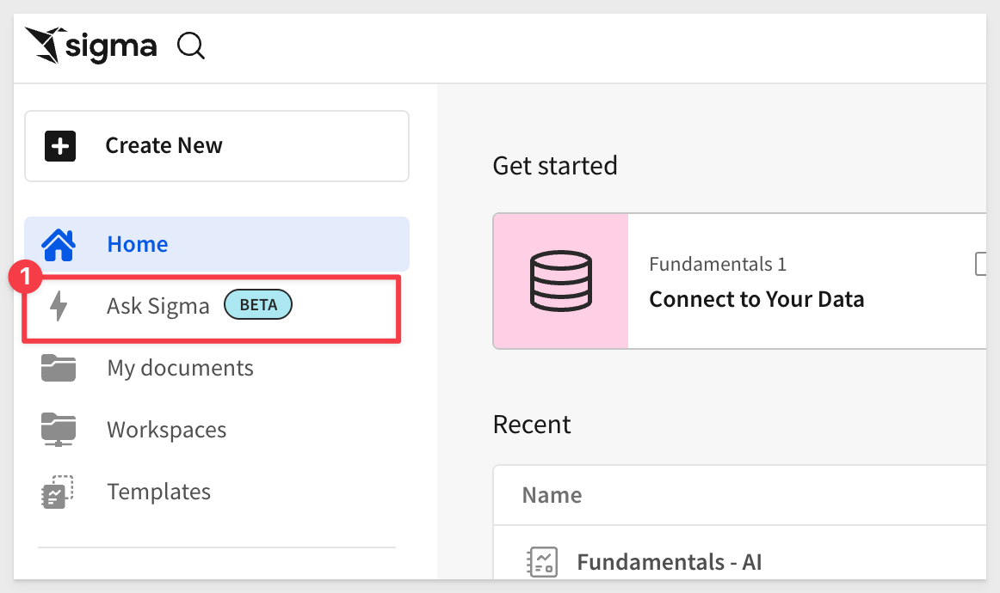


### Set range values with actions
The Set control value action now supports `Number range` and` Range slider` controls as target elements. You can configure the action to execute the following effects:

- Set or clear the min and max values of a Number range control
- Set the range start and end values of a Range slider control


### Show actions targeted by element
You can now quickly view and navigate to elements with actions that target the selected element. This makes it easier to identify and navigate in the actions workflow.

In the `action sequence` menu, select `Show actions targeting this element` to view a list of trigger elements sorted by page, then select an element to open its action sequences:


### Single-select columns in input tables (Beta)
Add a single-select column to an input table to allow users to select one value per row from a predefined list of values (text, number, or date). You can manually create and manage a list of distinct and repeatable values, or you can populate the list from an existing data source or element in the workbook. 

Values can then be formatted as pills and assigned different colors for visual differentiation and clarity.

**Why it matters:**<br>
This enhancement makes input tables more interactive and controlled, enabling structured data entry and consistent user selections that can drive downstream logic or metrics.

For more information, see [Configure single-select or multi-select columns on input tables](https://help.sigmacomputing.com/docs/configure-single-select-and-multi-select-columns-on-input-tables)


### Success alerts for action sequences
Add a custom success alert that displays after an action sequence runs successfully. The alert appears temporarily at the bottom of the window and can include a static or dynamic message.

For example:


For more information, see [Add or edit a success alert](https://help.sigmacomputing.com/docs/create-and-manage-action-sequences#add-or-edit-a-success-alert)


### Update row and Delete row actions for Input Tables (GA) 
You can now update and delete input table rows using actions. 

`Update row` allows user interaction to update values in an existing row, while `Delete row` removes an entire row. 

These actions are designed to support form functionality, but can be used in other ways to accommodate different AI App use cases.

For more information, see [Create actions that modify input table data](https://help.sigmacomputing.com/changelog/create-actions-that-modify-input-table-data)


### Warehouse AI model integration (Beta) 
If your organization is connected to Snowflake or Databricks, you can now use warehouse-hosted AI models to power Sigma AI features. 

<aside class="positive">
<strong>WHY THIS MATTERS:</strong><br> Customers who have sensitive data may prefer to use their own warehouse provider in order to prevent exposing data to third party providers.
</aside>

For information about selecting your data platform as your organization's AI provider, see [Configure warehouse AI model integration](https://help.sigmacomputing.com/docs/configure-warehouse-ai-model-integration)

Sigma's approach to integrating AI is really innovative and accelerates the time it takes to create meaningful content.

[Checkout our unique approach here](https://www.sigmacomputing.com/product/ai-ml)


<!-- END OF SECTION-->


## API
Duration: 20


### Ability to copy bookmarks when duplicating a workbook
The [Duplicate a workbook](https://help.sigmacomputing.com/reference/copyworkbook) (POST /v2/workbooks/{workbookId}/copy) endpoint now includes the copyBookmarks parameter that determines if saved views (formerly called bookmarks) are copied from the duplicated workbook.

- If set to all (available to admins only), every saved view (bookmark) applied to the workbook is copied.
- If set to accessible, only personal saved views and those shared with the user initiating the operation are copied.
- If not set, saved views are not copied.

Ownership of all saved views in the duplicate workbook transfers to the user initiating the operation.


### Allowlist IP addresses for API access (Beta)
Restrict access to the Sigma API for your organization by adding IP addresses and IP address ranges using CIDR notation to an allowlist. 

**With an allowlist configured, only users making API requests from allowed IP addresses can make successful requests.**

For more details, see [Restrict API access by IP address (Beta).](https://help.sigmacomputing.com/docs/restrict-api-access-by-ip-address)


### Allowlist IP addresses for API access (GA)
Administrators can now restrict access to the Sigma API by adding `IP addresses` and `IP address ranges` using CIDR notation to an allowlist. 

With an allowlist configured, only users making API requests from allowed IP addresses can make successful requests.


For more information, see [Restrict API access by IP address.](https://help.sigmacomputing.com/docs/restrict-api-access-by-ip-address)


### API request URLs now visible in the Administration portal
You can now view the base URL required for authenticating to the Sigma REST API in the Administration portal. 

Go to `Administration` > `Developer Access`: 

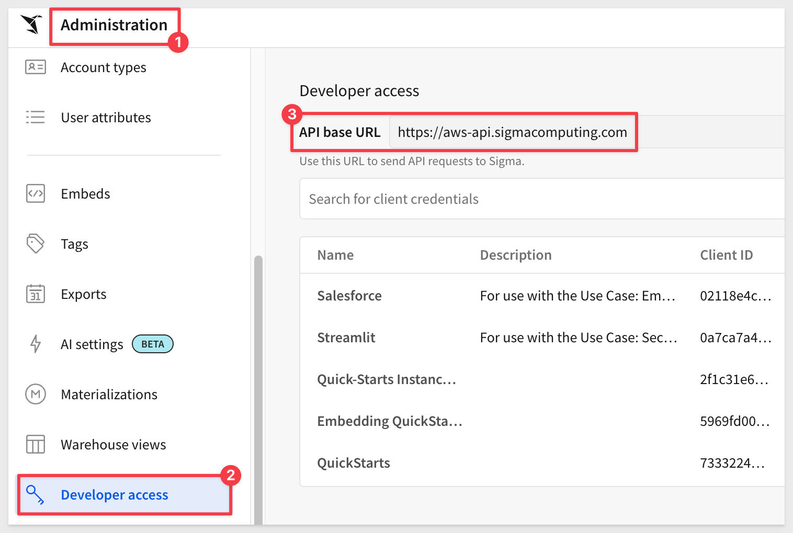

For more information, see [Get started with the Sigma REST API](https://help.sigmacomputing.com/reference/get-started-sigma-api)


### Custom SQL support for swap workbook data sources endpoint (Beta)
The [Swap workbook data sources endpoint](https://help.sigmacomputing.com/reference/sourceswapworkbook) now supports workbooks that use custom SQL statements, in addition to standard table-based sources.

This enables users to update and maintain workbooks without needing to manually rewrite custom SQL queries.


### Data models included in the response for the List files and List member files endpoints
The [List files](https://help.sigmacomputing.com/reference/fileslist) (GET /v2/files) and [List member files](https://help.sigmacomputing.com/reference/listaccessibleinodes) GET /v2/members/{memberId}/filesendpoint includes data models in the response. 

Data models are listed with a type of data-model and datasets are listed with a type of dataset.


### Expanded options for the Add workbook schedule endpoint
The `Add workbook schedule` endpoint [POST /v2/workbooks/{workbookId}/schedules](https://help.sigmacomputing.com/reference/postworkbookschedule) now supports options that were previously available only from the UI, such as creating a conditional export, repeating pivot header labels, compressing attachments to a zip file, and specifying control values for the export.


### Impersonate a user in API calls (Beta)
You can now impersonate other users in API calls when assigned the `Admin` account type, for example to retrieve and display the contents of their `My Documents` folder in embedded content.

**Why it matters:**<br>
This solves complex embedding scenarios where admins need to access user-specific content programmatically — enabling seamless customer support and advanced integration patterns without compromising security.

For more details and an example test Python script, see [Impersonate users](https://help.sigmacomputing.com/docs/impersonate-users)


### New 2.1 version for some API endpoints
The following endpoints are now available in a v2.1 version. 

The new versions use pagination for the API response by default, allowing you to retrieve large responses in manageable segments.

The following endpoints are updated:
- [List members](https://help.sigmacomputing.com/reference/listmemberspaginated)
- [List teams](https://help.sigmacomputing.com/reference/listteamspaginated)
- [List workspaces](https://help.sigmacomputing.com/reference/listworkspacespaginated)
- [List materialization schedules for a workbook](https://help.sigmacomputing.com/reference/listmaterializationschedulespaginated)
- [List scheduled exports for a workbook](https://help.sigmacomputing.com/reference/listworkbookschedulespaginated)

The equivalent endpoints in v2 continue to work, but might not use pagination by default for all customers.


### New API endpoint to update tag details
The following endpoint to update tag descriptions is now available:

`Update a tag` [PATCH /v2/tags/{tagId}](https://help.sigmacomputing.com/reference/updateversiontag)


### New API endpoint to update the schedule for an export
The following endpoint has been added to `update a workbook schedule` for an export.

This endpoint lets you create a file containing data exported from a workbook, allowing you to retrieve large datasets or detailed reports in a structured format. Export the entire workbook, a single workbook page, or an individual element. You can specify parameters to filter the data and format options for the file.

For more information, see [Export data from a workbook](https://help.sigmacomputing.com/reference/exportworkbook) 


### New API endpoint: list sources of a data model
The following endpoint to list sources of a data model is now available:

[List data model sources](https://help.sigmacomputing.com/reference/listdatamodelsources) will return a list of data sources of a data model given the `dataModelId`. The response can be a dataset, table, or the data model document and specific elements used as a source. 


### New API endpoints to list account types and account type permissions
The following endpoints to list account types and account type permissions are now available:

`List account types` [GET /v2/accountTypes](https://help.sigmacomputing.com/docs/listaccounttypes)
`List account type permissions` [GET /v2/accountTypes/{accountTypeId}/permissions](https://help.sigmacomputing.com/docs/listaccounttypepermissions)


### New API endpoints to list and get details for data models
The following endpoints to list data models and get details for a data model are now available:

`List data models` [GET /v2/dataModels](https://help.sigmacomputing.com/reference/listdatamodels)
`Get a data model` [GET /v2/dataModels/{dataModelId}](https://help.sigmacomputing.com/reference/getdatamodel)


### New API Recipe - Bulk Deactivate
For customers wanting to bulk deactivate (soft-delete) users from Sigma, this API recipe demonstrations how to accomplish that through the use of a regex pattern match against the user's name.

<aside class="negative">
<strong>NOTE:</strong><br> User records are never fully deleted from Sigma but rather deactivated, preventing future system access. Any workbooks created by the deactivated user are reassigned to the specified user.
</aside>

For more information, see [Sigma REST API Recipes](https://quickstarts.sigmacomputing.com/guide/developers_api_code_samples/index.html?index=..%2F..index#6)

### New endpoint to assign multiple user attributes to a team
You can now programmatically assign user attributes to a team in bulk via [Assign user attributes to a team](https://help.sigmacomputing.com/reference/assignuserattributestoteam)


### New endpoint to swap data model sources
The following endpoint to [Swap the sources of a data model](https://help.sigmacomputing.com/reference/swapdatamodelsources) is now available.

The endpoint supports swapping datasets and tables from your data platform, or swapping the connection used by the data model.


### New export API rate limits
The following endpoints now have rate limits:
- The Export data from a workbook (POST v2/workbooks/{workbookId}/export) endpoint is rate limited to `100 requests per minute`.
- The Export a workbook (POST v2/workbooks/{workbookId}/send) endpoint is rate limited to `100 requests per minute`.

***Why it matters:***<br>
Rate limits ensure stable platform performance and prevent accidental overuse from automated systems or batch workflows.

For all rate limits, see [Get started with the Sigma REST API](https://help.sigmacomputing.com/reference/get-started-sigma-api#api-limits)


### New option for Export data from a workbook endpoint
When exporting an entire workbook or workbook page using the `Export data from a workbook` method, the format parameter now supports the `xlsx` option to support the Excel file format.

For more information, see [Update a workbook schedule](https://help.sigmacomputing.com/reference/updateworkbookschedule) 


### New option for List workbook pages for a workbook and List elements in a workbook endpoints
You can now retrieve pages and elements for a saved view, formerly known as a `bookmark`, using the API.

The [List workbook pages](https://help.sigmacomputing.com/reference/listworkbookpages) for a workbook endpoint and the [List elements in a workbook](https://help.sigmacomputing.com/reference/listworkbookpageelements) endpoint now include the `bookmarkId` query parameter.


### New option for the Create a member API endpoint
When creating a member using the API, choose whether to send an invitation email to a non-embed user. 

The [Create a member](https://help.sigmacomputing.com/reference/createmember) endpoint now includes the `sendInvite` query parameter:


For more information, see [Create a member](https://help.sigmacomputing.com/reference/createmember)


### New options for Add workbook schedule endpoint
The `Add workbook schedule` endpoint, [POST /v2/workbooks/{workbookId}/schedules](https://help.sigmacomputing.com/reference/postworkbookschedule) now includes two new options:

The `parameters` option, allowing you to customize control values when programmatically adding an export schedule to a workbook.

The `ownerId` option, allowing you to specify a user to own the export schedule.


### New options for Lookup a connection and Sync a connection by path endpoints
The [Look up connections by path](https://help.sigmacomputing.com/reference/lookupconnection) POST /v2/connection/{connectionId}/lookup and [Sync a connection by path](https://help.sigmacomputing.com/reference/syncconnectionpath) POST /v2/connections/{connectionId}/sync endpoints include the option to look up or sync a stored procedure object in your connection.


### New options for the sync connection by path endpoint
The [Sync a connection by path](https://help.sigmacomputing.com/reference/syncconnectionpath) endpoint includes a new `useServiceAccount` query string parameter. 

When used with a connection that uses OAuth, the new option lets you use the service account credentials, instead of the user credentials associated with the API token, to sync the connection. When used with a connection that doesn't use OAuth, the new option has no effect.


### New options to swap data model sources for the Tag a workbook endpoint
The **Tag a workbook** [POST /v2/workbooks/tag](https://help.sigmacomputing.com/reference/tagworkbook) endpoint includes a new option to swap from or to a data model, including a tagged version of a data model. Similar to the UI, you can only swap a data model source to another version of the same data model.


### New output included in the List team members endpoint
The **List team members** [GET /v2/teams/{teamId}/members](https://help.sigmacomputing.com/reference/getteammembers) endpoint includes a new `addedBy` option in the response that provides the user ID of the person that added a user to a team.


### New parameters added for List workbooks endpoint
The [List workbooks](https://help.sigmacomputing.com/reference/listworkbooks) (GET /v2/workbooks) endpoint now supports two new optional query parameters:

**SkipPermissionCheck:** 
When set to `true`, allows the API client to return all workbooks in a Sigma organization, including those not shared with the requesting user. 

<aside class="positive">
<strong>IMPORTANT:</strong><br> The API client must have admin privileges to use this parameter.
</aside>

**isArchived parameter:** When set to `true`, filters the results to include only archived workbooks.


### New response output for the list columns for a workbook endpoint
The [List columns for a workbook element](https://help.sigmacomputing.com/reference/getelementcolumns) endpoint now includes the column formula in the response output.


### New writebackSchemas options for Create a connection and Update a connection endpoints
When adding a Snowflake or Databricks connection that uses OAuth with the [Create a connection](https://help.sigmacomputing.com/reference/createconnection) endpoint or updating one with the [Update a connection](https://help.sigmacomputing.com/reference/updateconnection) endpoint, you can use the new writebackSchemas option to provide multiple write-back schemas for the connection to use.

Multiple write-back schemas helps keep content created by different teams or users with different permissions in different schemas.


### Notice of deprecation; unpaginated responses from list endpoints
Returning unpaginated responses from list endpoints is now deprecated. 

**On March 15, 2026, this functionality will reach end of support and the following list endpoints that did not return a paginated response will only return a paginated response:**

- List members (GET /v2/members)
- List teams (GET /v2/teams)
- List workspaces (GET /v2/workspaces)
- List materialization schedules for a workbook (GET /v2/workbooks/{workbookId}/materialization-schedules)
- List scheduled exports for a workbook (GET /v2/workbooks/{workbookId}/schedules)

If you use these endpoints, update your API requests to include the limit query parameter to return a paginated response. 

After the end of support date, requests without the limit parameter return a paginated response of the default page size (50).

**If you are already using the paginated response from list endpoints, no action is needed.**


### Request an API token on any endpoint page
When accessing the Sigma public API documentation, you can request an `API token` from any endpoint documentation page, instead of first accessing the `Get access token` documentation page.

The endpoint for retrieving a token and refreshing an existing token is unchanged. This is not a code change to the API itself.


### Swap link sources for datasets
The `Swap workbook data sources` endpoint, [POST /v2/workbooks/{workbookId}/swapSources](https://help.sigmacomputing.com/reference/sourceswapworkbook) now includes the option to swap dataset links. 

When using the `sourceMapping` option, the `columnMapping` option supports specifying a link name and linked column name to swap from one dataset link to another dataset link.

For example, to change the source for a workbook from one dataset link to another, set the `fromId` and `toId` to the same dataset ID, but update the `fromColumn` to the name of the previous dataset link and linked column name and the toColumn to the desired dataset link and linked column:
```json
{
    "sourceMapping": [
        {
            "fromId": "bfa59799-69c7-423d-b965-7319cbfc2ebb",
            "toId": "bfa59799-69c7-423d-b965-7319cbfc2ebb",
            "columnMapping": [
                {
                    "fromColumn": ["Link name", "Missing column name"],
                    "toColumn": ["Link name", "New column name"]
                }
            ]
        }
    ]
}
```


### Unpaginated responses from list endpoints (Deprecated)
This deprecation was previously announced in Sigma's release notes on October 3, 2025. This updated announcement includes an official end of support date.

**Returning unpaginated responses from list endpoints is now deprecated. On June 2, 2026, this functionality will reach end of support and the following list endpoints did not return a paginated response will only return a paginated response:**

- List members (GET /v2/members)
- List teams (GET /v2/teams)
- List workspaces (GET /v2/workspaces)
- List materialization schedules for a workbook (GET /v2/workbooks/{workbookId}/materialization-schedules)
- List scheduled exports for a workbook (GET /v2/workbooks/{workbookId}/schedules)

If you use these endpoints, update your API requests to include the limit query parameter to return a paginated response. After the end of support date, requests without the limit parameter return a paginated response of the default page size (50).

If you are already using the paginated response from list endpoints, no action is needed.


<!-- END OF SECTION-->

## Bug Fixes
Duration: 20

**1:** A `Return home` option no longer appears for users after a secure embed is deleted.


**2:** Actions with conditions based on hidden columns now trigger as expected.


**3:** After copying and pasting a workbook or data model element with one or more columns that use metrics, those columns display correctly.


**4:** After deactivating a SCIM user, the folder created to contain the deactivated user's documents no longer includes a UUID and matches the behavior described in Deactivated user documents.


**5:** After deleting a materialization schedule on a published workbook, the workbook no longer opens a custom view.ß


**6:** An error where workbook level custom translation files did not show up in workbook settings is now fixed.


**7:** API endpoints that return information about tagged workbook versions now return an accurate `sourceWorkbookVersion.` Previously, the API returned the highest `sourceWorkbookVersion` even in cases where a lower s`ourceWorkbookVersion` had been tagged more recently.


**8:** Archived connections no longer cause unexpected errors in shared templates.


**9:** Changing organization level authentication from OAuth to another authentication method no longer causes independent OAuth configuration options to disappear in Administration.


**10:** Coachmarks are no longer visible in exports, embed, or when using `Present`.


**11:** Column descriptions added in a data model are now available in workbooks.


**12:** Content validation now updates elements from a data model used in a join.


**13:** Content validation was incorrectly performed on tagged versions of workbooks that used an untagged version of a data model as the source, causing those tagged versions to display errors.


**14:** Date-truncated bar charts with a time scale type are now correctly labeled. Previously, mismatches between organization and user timezones could sometimes cause labels for time axes to be incorrect.


**15:** Dynamic text in text elements now correctly displays line breaks (newline characters) and whitespace characters (tabs or spaces).


**16:** Dynamically changing the source of a table in a data element using custom SQL no longer stops related columns from being available in child elements of the source table.


**17:** Filtering and sorting now work as expected in `Administration` > `Materializations`.


**18:** For a data element sourced from a grouped table with one or more grouping levels collapsed, source columns were unavailable to select instead of being available.


**19:** For connections that use `OAuth`, users can now see and use stored procedures that they have access to.


**20:** For JWT-signed embeds, errors are now sent when the JWT token cannot be parsed and when the current user is not invited to the workbook they are attempting to access.


**21:** Formulas in action configurations were previously limited to functions supported by all compatible data platforms. You can now use any function supported by your connection's data platform.


**22:** Formulas with an argument referencing a hidden control (control element on a hidden page) now evaluate successfully, regardless of the reference’s argument position.


**23:** If users attempt to run a query with OAuth credentials that do not exist, they are now shown an improved error message.


**24:** In a custom view of a workbook embed when `:responsive_height` is set to `true`, the lineage view now displays correctly without being truncated.


**25:** In localized workbooks, actions that show or hide columns with names matching control values (dynamic show/hide) now correctly reference the translated labels. Previously, the actions were referencing the source labels, resulting in no matches with manually entered control values.


**26:** In OAuth-enabled embedded workbooks, OAuth connections are no longer disabled when external OAuth tokens are passed in an embed URL.


**27:** In secure embeds that use `OAuth` to access data, new embed users no longer need to reload the embed to clear a `no valid refresh token` error. Instead, the embed loads for a newly-created embed user on the first try.


**28:** In some cases, the `Edit` option in securely embedded content was not functional.


**29:** In the published version of a workbook, data elements no longer show an outline on hover.


**30:** Materialization schedules owned by users deactivated after `March 25, 2025` transfer to the administrator performing the deactivation, or if specified, the user chosen to receive the deactivated user's documents. Materialization schedules owned by users deactivated prior to that date fail to run and materialized elements might display an error.


**31:** Mobile view now includes a profile menu that provides users with the option to sign out of their Sigma account on a mobile device.


**32:** On Snowflake connections, using the specifier `%A` in the format argument of the `DateFormat` function returned the abbreviated name for the day of the week. 

Now, it returns the full name for the day of the week as expected. To return the abbreviated day, use the specifier `%a`.


**33:** Opening a tagged workbook now logs an `OBJECT_OPENED` event on the tagged version, as opposed to logging it on the untagged version.


**34:** Plugins now load initial control values as expected on refresh for version 1.0.9 or higher.


**35:** Previously, in Snowflake OAuth connections with service accounts enabled, if the serviceAccountWarehouse was not set in Sigma, it would be evaluated as undetermined (resulting in an error). Now, if the warehouse is set by a user attribute, the service account will use the default value of the user attribute.


**36:** Previously, selecting a text element would arbitrarily resize the element by adding rows. Now, this is less likely to happen.


**37:** Previously, text elements sometimes snapped to fit the length of their contents when resizing. Now, text elements can be resized regardless of the length of their contents.


**38:** Referencing a data element in SQL using sigma_element() syntax now correctly handles element titles that contain quotes.


**39:** Scheduled exports that email team members now send to the members of the team when the export is sent, instead of the members of the team when the schedule is added.


**40:** Secure embed users no longer see an “Invalid Databricks access token” error when accessing a workbook with OAuth credentials on a Databricks connection.


**41:** Sigma did not support workbook deletion for JWT-signed secure embeds. Now a user can delete a workbook from the menu and get redirected to an error page with the document browser to navigate to another workbook.


**42:** Sigma no longer allows users to create input tables on an OAuth connection when an input table edit log destination is not configured.


**43:** Sigma now correctly displays the selected state for a workbook page based on the selected Customize page visibility setting.


**44:** Sigma now uses improved logic for presenting the initial workbook page from a URL with the :nodeId parameter when the page includes conditional visibility rules. If the user cannot view the page, the first visible page is shown.


**45:** Tagged versions with errors caused by content validation continue to display errors until they are re-tagged.


**46:** Tagging a data model with a CSV uploaded no longer results in an error.


**47:** The  More menu for tables has been updated to remove a nonfunctional Make owner option.


**48:** The [Add workbook schedule](https://help.sigmacomputing.com/reference/postworkbookschedule) endpoint no longer displays invalid request errors when scheduling an export.


**49:** The [Add workbook schedule](https://help.sigmacomputing.com/reference/postworkbookschedule) endpoint no longer fails when attempting to create a schedule that exports to Slack. To fix this issue, the nonfunctional `slackChannelName` option was changed to `slackConversationId`.


**50:** The [Download an exported file](https://help.sigmacomputing.com/reference/downloadquery) now no longer fails when downloading a workbook.


**51:** The `, character` within columns is now correctly escaped for Snowflake CSV exports to cloud storage.


**52:** The `:hide_explore_toggle` parameter now hides the `Show customize panels` option in the element menu.


**53:** The `Create connection` endpoint [POST /v2/connections](https://help.sigmacomputing.com/reference/createconnection) and `Update connection` endpoint [PUT /v2/connections/{connectionId}](https://help.sigmacomputing.com/reference/updateconnection) no longer fail when creating or updating connections with OAuth. 

<aside class="negative">
<strong>NOTE:</strong><br> Note that for non-OAuth connections, the API validates that you can connect to the newly created or updated connection with your credentials. In the case of an OAuth connection, this validation step does not apply. Instead, manually validate that you can connect with your OAuth credentials after you create or update the connection.
</aside>


**54:** The `Data sources` tab of the `Select source` modal now shows options as expected even in smaller viewports.


**55:** The `Last sync` date visible when browsing connection objects reflects the last time Sigma attempted to sync an object, even if a sync was not performed because no data had changed.


**56:** The `List columns` for a workbook element endpoint `(GET /v2/workbooks/{workbookId}/elements/{elementId}/columns)` now correctly returns pagination data in the nextPage portion of the response.


**57:** The `Refresh element` action now successfully refreshes data for elements on hidden pages.


**58:** The `tag` parameter in the [Export data from a workbook](https://help.sigmacomputing.com/reference/exportworkbook) endpoint now works as expected.


**59:** The `workbook:saveas` outbound event now returns the ID of the original workbook and the ID of the newly saved workbook. Previously, the event only returned the ID of the newly saved workbook. 

For more information, see [Outbound event reference](https://help.sigmacomputing.com/docs/outbound-event-reference#workbooksaveas)


**60:** The Ask Sigma usage dashboard was unavailable to some organizations.


**61:** The Azure SCIM `PatchGroup` operation now allows for team updates for deactivated users.


**62:** The files endpoint no longer only returns workbooks owned by the specified user that are located in the My Documents folder. All workbooks owned by the user, including those located across different workspaces, are now returned.


**63:** The list of database or catalog objects visible when browsing a connection in Sigma can now be expanded to view more information without hovering, such as long table names.


**64:** The workbook header no longer displays an `Edit` button when viewing a tagged version, which cannot be edited directly.


**65:** The Workspaces page no longer displays a `Too many results resolved` error when attempting to load a very large number of workspaces. 


**66:** Time chart axes now align with chart data across all timespans and timezones as expected, with more intuitive tick markings across all organization timezones.


**67:** Users are no longer signed out of Sigma if they attempt to run a query with `OAuth credentials` that do not exist.


**68:** Users in an embed can no longer open the source of a data model.


**69:** Users with Can explore workbook access can now trigger an Open modal action when a formula-based condition on the sequence references elements on hidden pages.


**70:** When a container is selected, pressing Tab correctly changes selection from the container to the top-left-most element in the container.


**71:** When a data model was embedded, users only had the option to rename a data model from the list of documents instead of from the document menu for the data model.


**72:** When a page was duplicated that contained a data element with a data model metric and the element source was located on the same page, the metric displayed an "Invalid Query" error instead of data calculated by the metric.


**73:** When a Set control value action is triggered by selecting any column in a table, pivot table, or input table, pressing the up arrow key to select the column header (consequently selecting the entire column) no longer clears the control value.


**74:** When a user has access to specific version tagged documents in a folder, you can now grant access to all versions of 
documents in the Share Folder modal.


**75:** When a user has inherited access to a document from a version-tagged folder, the version tag is now shown in the Share Workbook or Share Data Model modal.


**76:** When a user triggers an action that exports a PDF via email, Sigma now adheres to the page size selected in the action configuration.


**77:** When a value in a `list control` is selected, the `display value` is now shown instead of the `raw value.`


**78:** When adding a data element that uses SQL as the source, the connection now correctly defaults to one that the user has access to use for SQL queries.


**79:** When adding a table in an embedded workbook, previewing a dataset resulted in an error. Now, the dataset can be previewed as expected.


**80:** When adding a version tag to a data model and swapping sources from one connection to another in cases where the table is available at a different path in each connection, the data sources no longer fail to swap with the error "Failed to find the table in connection".


**81:** When adding date data in an input table, the format of the data now respects the locale of the Sigma organization. For example, if your Sigma organization uses a locale of English (Great Britain) and you paste a date value of 10.05.2025 into an input table, the date correctly appears as May 10, 2025.


**82:** When an action sequence is configured with the `On select` trigger type for a column, the sequence is no longer initiated when a user clicks the column header.


**83:** When an action sequence on a chart has a condition referencing the `Selection` variable, triggering the sequence by clicking whitespace on the chart no longer generates an error.


**84:** When an action with an On select trigger is configured on a bar chart, selecting an axis label of an unaggregated value no longer generates column rank instead of the defined value.


**85:** When calling the [List bookmarks](https://help.sigmacomputing.com/reference/getworkbookbookmarks) for a workbook endpoint, the `isDefault` option is correctly returned for saved views set as the default for the workbook.


**86:** When calling the [Update a workbook bookmark](https://help.sigmacomputing.com/reference/updateworkbookbookmark) endpoint, setting the `isDefault` option for a saved view that was not previously set as the default correctly succeeds.


**87:** When changing the visibility of a column in a dataset, an invalid value that caused errors is no longer set.


**88:** When creating a linked input table, the modal now displays the write-back destination selection field first (above the list of columns) for improved visibility.


**89:** When editing tab names in a workbook, the & character now behaves as intended.


**90:** When entering a table in a SQL query, the autocomplete dropdown now excludes tables that the user does not have permission to view.


**91:** When exporting explorations, unavailable export options are now no longer shown, instead of throwing an error message.


**92:** When exporting grouped tables with totals, the totals now appear in a separate column with a correct header, for example, `"Column Name" (Grand Total)`.


**93:** When hidden column values are passed to controls through workbook actions, those columns are now correctly excluded from Excel files.


**94:** When migrating a dataset sourced by two joined datasets to a data model, the join is recreated correctly.


**95:** When multiple user avatars are visible in the header, they now overlap correctly.


**96:** When pressing Tab to navigate between elements in a container, the navigation order matches the position of the elements within the container.


**97:** When revoking access to a connection, database or catalog, schema, table, or stored procedure in Sigma, you can now only revoke access from the level to which the access was granted.


**98:** When selecting an element in a workbook to navigate to with the Navigate in this workbook action, the list of elements for a page matches the order of the elements on the page.


**99:** When sharing a template containing input tables across organizations, the input table data entry permissions in the shared template now matches what was defined in the source document.


**100:** When sharing a workbook, version tags now appear for all access levels as expected.


**101:** When sharing workbooks across organizations, users received an "Object Does Not Exist No matching record" error when attempting to replace the source of the shared workbook with a dataset.


**102:** When Sigma encounters errors during a data source swap involving custom SQL and input tables, Sigma now show the error messages at the bottom of the page.


**103:** When swapping the source of a workbook with the API, a joined table no longer displays an `Invalid argument` error and has its sources swapped successfully.


**104:** When the embed team name contains an apostrophe, the embed sandbox no longer shows an `invalid embed signature` error and loads the embed successfully.


**105:** When the signature of a stored procedure used in a stored procedure action is changed, the action now validates that the signature is the same and uses the new signature if possible.


**106:** When the top-left-most element in a container is selected, pressing Shift + Tab selects the parent container.


**107:** When the value of a grouping key is null, applying the `Selection variable` to an `Open link` action no longer returns a null value that opens a blank page.


**108:** When using connection-level OAuth, your email is no longer checked to see if it matches the email used for signing in to Sigma.


**109:** When viewing a workbook lineage in an embed, the `Shared with me` link now launches the embed modal instead of the native Sigma modal.


**110:** When writing SQL to query a BigQuery connection, project ID, dataset, and table names, and column names now autocomplete.


**111:** When you disable automatic user creation for embeds, you can now manage embed users in the `Administration` portal.


**112:** When you switch between `Secur`e and `JWT` mode in the embed sandbox, Sigma now clears the URL field so that you can load the new embed without any error messages.


**113:** Workbooks created using the [Create workbook from template](https://help.sigmacomputing.com/reference/saveworkbookfromtemplate) endpoint with `updateAutomatically` set to `true` now update properly for cases when the template was shared from another organization.


**114:** X-axis labels in trellis charts now display correctly when the y-axis title is displayed ( `Format` > `Y-Axi`s >` Axis title`) and shared x-axis is enabled (`Format` > `Trellis` > `Shared` > `X-Axis`).


**115:** You can now nest a popover element inside of a modal. Previously, this would cause an error. Popovers cannot be nested inside of popovers.


**116:** You can now select specific tables in a data model when adding or changing data sources for an element.


**117:** You can now successfully tag and swap the sources of a workbook version that uses a data model with data from multiple connections.


<!-- END OF SECTION-->

## Charts
Duration: 20


### Change to underlying data grouping for cartesian charts
Previously, underlying data was grouped for cartesian charts (bar, line, area, scatter, combo, box, and waterfall charts) regardless of whether the chart values were aggregated. 

With this update, when viewing underlying data, the grouping will match the chart aggregation. 

For example, if `Aggregate values` is unchecked, the underlying data is not grouped.

For more information, see: [View underlying data](https://help.sigmacomputing.com/docs/view-underlying-data)


### Configure chart axis marks
Configuring custom chart axis marks, like `ticks` and `grid lines`, is now supported. 

You can change the count or step size of both major (labeled) and minor (unlabeled) chart axis marks.

For more information, see [Configure chart axis marks](https://help.sigmacomputing.com/docs/configure-chart-axis-marks)


### Configure data labels per series on Cartesian charts (GA)
If your Cartesian (bar, line, area, or scatter) or combo chart visualizes multiple series of data, you can configure different data label settings for each series.

For more information, see [Format and show data labels](https://help.sigmacomputing.com/docs/display-chart-data-labels#format-and-show-data-labels)


### Create and format sparklines (Beta)
Sigma now supports creating and formatting `sparklines` in tables and pivot tables. 

You can add `sparklines` from a grouped column in a table (Add column via… > Sparkline), or using the SparklineAgg and Sparkline (JSON data only) functions.

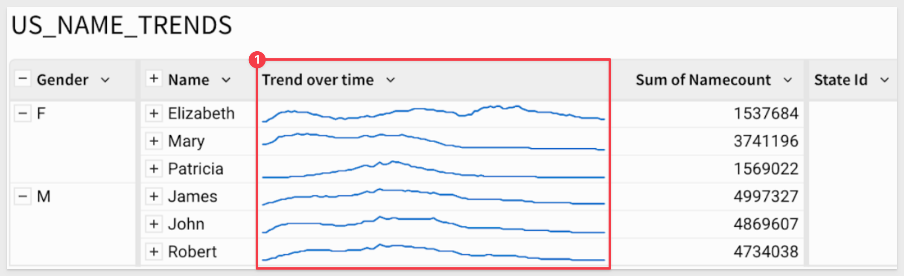

For more information, see [Create sparklines in a table (Beta)](https://help.sigmacomputing.com/docs/create-sparklines-in-a-table)


### Create sparklines in a table (GA)
The ability to create sparklines in a table is now generally available. You can now also configure sparkline tooltips and endpoint labels.

***Why it matters:***<br>
Sparklines add compact trend visibility directly in tables, enabling quick pattern detection without creating separate charts.

For more information, see [Create sparklines in a table](https://help.sigmacomputing.com/docs/create-sparklines-in-a-table)


### Customize chart and formatting color scales (GA)
Create custom color scales to use when formatting chart colors or conditional formatting for tables. Create a custom color scale for an organization theme, workbook theme, or for a specific data element.

For more information, see [Add a custom color scale.](https://help.sigmacomputing.com/docs/add-a-custom-color-scale)


### Customize chart and formatting color scales (GA)
Create custom color scales to use when formatting chart colors or conditional formatting for tables. Create a custom color scale for an organization theme, workbook theme, or for a specific data element.

For more information, see [Add a custom color scale.](https://help.sigmacomputing.com/docs/add-a-custom-color-scale)


### Interactive chart legends support map and funnel charts
Map and funnel charts that have a color by category set support the following interactive filtering capabilities in the legend:

- Hover over a legend entry to highlight corresponding data points.
- Click a legend entry label to isolate corresponding data points.
- Select or clear the checkbox of one or more legend entries to show or hide corresponding data points.
- Click anywhere (within the element) outside of the plot area or legend to reset the chart displ


### Legend control element (Beta) 
Add the `legend control element` to your workbook to target multiple charts with one legend and align colors across charts. 

The legend control functions as an interactive legend, letting you filter and highlight corresponding data points in targeted charts. Any categories not represented in the list are collected as an extra category, "Others", which can be turned off.

For example, the image below shows one legend control targeting two charts:

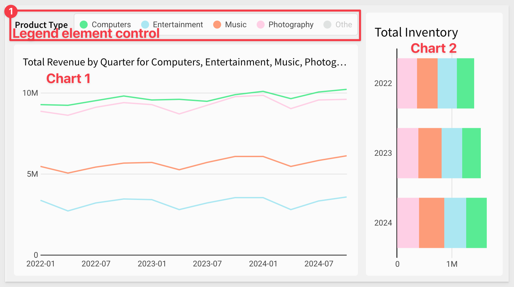

For more details, see [Create and configure a legend control (Beta)](https://help.sigmacomputing.com/docs/create-and-configure-a-legend-control)


### Legend controls (GA)
Add the legend control element to your workbook to target multiple charts with one legend and align colors across charts.

The legend control functions as an interactive legend, letting you filter and highlight corresponding data points in targeted charts. 

Any categories not represented in the list are collected as an extra category, `Others`, which can be turned off.

For example, the image below shows one legend targeting two charts with the `Others` category hidden:

 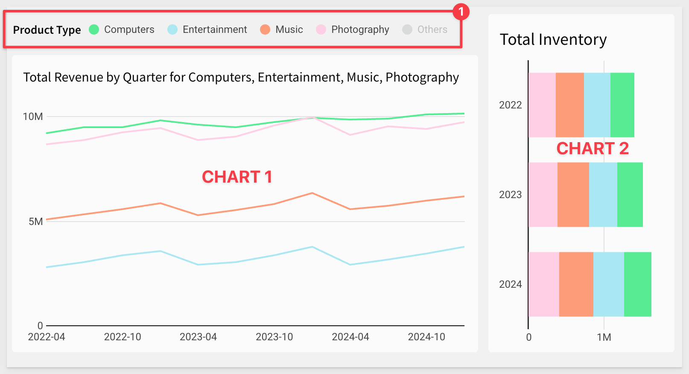

For more information, see [Create and configure a legend control](https://help.sigmacomputing.com/docs/create-and-configure-a-legend-control)


### Show longer chart axis labels
In Cartesian (bar, line, combo, area, scatter, box and waterfall) charts with an `ordinal axis`, **you can now show longer axis labels.** To allocate more space for longer labels, select the` Allow longer labels` checkbox under` Data labels`.


### Show strokes for all marks within a combo chart
You can now select the `Show strokes` options `On, Off or Auto` for data labels of line, area and scatter marks in a combo chart. 

Previously, only bar marks had these options. You can also now show or hide label strokes for all series in a combo chart using `Data labels` > `Apply to all series` > `Show stroke`.


<!-- END OF SECTION-->


## Data Modeling
Duration: 20


### Column-level security in data models with user attributes (GA)
Set column-level security (CLS) rules in a data model according to the assigned value of a user attribute.

Users and team members assigned a user attribute value that matches the value specified in the CLS rule can view the contents of the protected column. Users assigned other user attribute values, or not assigned a user attribute value, cannot view the contents of the protected column.

For more information, see [Configure column-level security in a data model](https://help.sigmacomputing.com/docs/column-level-security#configure-column-level-security-in-a-data-model)


### CSV upload number parsing (Beta)
When a column in an uploaded CSV file contains numbers with separators (commas, periods, spaces, etc.), Sigma parses the data as text strings by default. 

To parse the data as numbers, you can choose one of the following options:
- **Auto-detect:** Sigma automatically detects the format pattern and parses the data as numbers accordingly. Sigma can currently detect US standard number format and European number format.
- **Custom format:** Specify the number format pattern for Sigma to parse.

***Why it matters:***<br>
Data loading becomes more resilient to regional formatting differences, reducing the need for cleanup before analysis.

For more information, see [Parse numbers with separators](https://help.sigmacomputing.com/docs/upload-csv-data#parse-numbers-with-separators)


### Datasets (Deprecated)
**On June 2, 2026, datasets will reach end of support and creating new datasets and editing existing datasets will no longer be available.** 

Migrate existing datasets to data models, and update any documents that use datasets as a source to use data models instead.


### Migrate a dataset to a data model (Beta)
Create a data model from a dataset and its links by choosing to migrate a dataset. Optionally choose to update documents that reference the dataset automatically.

When you migrate a dataset, the dataset is unchanged and the contents of the dataset are recreated in the data model. You can also track the status of all datasets in your organization.

For more information about how to migrate a dataset and what is and isn't migrated to the new data model, see [Migrate a dataset to a data model](https://help.sigmacomputing.com/docs/migrate-a-dataset-to-a-data-model)


### Validate content in a data model (Beta)
When you make changes to a data model, those changes affect users of workbooks that use the data model as a source. 

You can now validate content to prevent breaking changes to those workbooks. 

Instead of manually replacing and updating deleted or changed columns and elements in affected documents, you can validate content in the data model and prevent these errors.

***Why it matters:***<br>
This adds a governance safety net for model changes, preventing downstream workbook breakage and reducing maintenance overhead.

For more information, see [Validate content in a data model](https://help.sigmacomputing.com/docs/validate-content-data-model) (Beta) and [Sync a draft with the latest published version](https://help.sigmacomputing.com/docs/edit-draft-and-publish-a-workbook#sync-a-draft-with-the-latest-published-version)


### View available columns for a source
When working with a data element in a workbook or data model, you can quickly discover and access the available columns from the data source, including related columns from a data model.

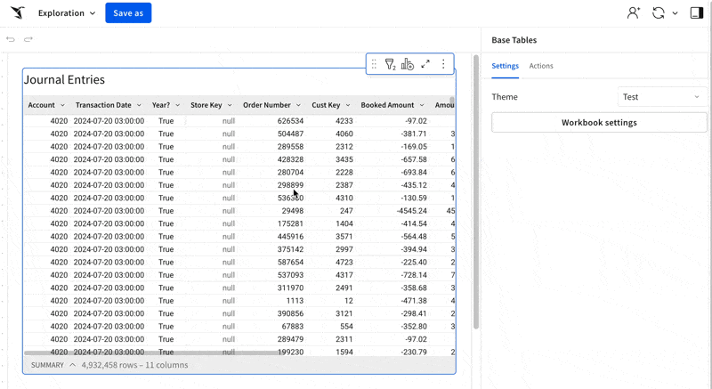


<!-- END OF SECTION-->


## Functions / Calculations
Duration: 20


### Add metrics to data models (Beta)
You can now add metrics to data models. Metrics are dynamic and reusable calculations that are specific to a data source. As such, metrics usually reference specific columns. Create a metric to provide reliable and efficient aggregate calculations, abstracting complex formulas away from business users.

When defining a metric on a data model, you can reference other metrics in your formula. Metrics propagate downstream, so a metric defined on one data model is also available to any data elements that use that data model as a source.

Data elements in data models and workbooks that were materialized before April 1, 2025 might not work with metrics. If columns that use metrics produce an Invalid Query error, and the table or an upstream table is materialized, manually re-run the materialization. If the error persists, contact Sigma Support.

For more information, see:

[About metrics](https://help.sigmacomputing.com/docs/about-metrics)
[Create and manage metrics](https://help.sigmacomputing.com/docs/create-and-manage-metrics)
[Navigate data models](https://help.sigmacomputing.com/docs/navigate-data-models)
[Use metrics in a workbook](https://help.sigmacomputing.com/docs/use-metrics-in-a-workbook)


### Add metrics to data models (GA)
Adding metrics to data models is now generally available. 

Metrics are dynamic and reusable calculations that are specific to a data source. 

As such, metrics usually reference specific columns. Create a metric to provide reliable and efficient aggregate calculations, abstracting complex formulas away from business users.

When defining a metric on a data model, you can reference other metrics in your formula. Metrics propagate downstream, so a metric defined on one data model is also available to any data elements that use that data model as a source.

For more information, see:

[About metrics](https://help.sigmacomputing.com/docs/about-metrics)<br>
[Create and manage metrics](https://help.sigmacomputing.com/docs/create-and-manage-metrics)<br>
[Navigate data models](https://help.sigmacomputing.com/docs/navigate-data-models)<br>
[Use metrics in a workbook](https://help.sigmacomputing.com/docs/use-metrics-in-a-workbook)


### Additional metadata for dbt jobs
If you run dbt jobs, you can see additional metadata about the dbt models and dbt jobs in the data catalog for a connection in Sigma. View the SQL used to create the model, the last run time, the job ID and run ID, and more.

For more information, see [Manage dbt Integration](https://help.sigmacomputing.com/docs/manage-dbt-integration)


### ArrayConcat function 
You can use the ArrayConcat function to combine multiple arrays, maintaining all items and their order.

**Why it matters:**<br>
This function simplifies array manipulation by letting you merge multiple lists without complex formulas — improving readability and efficiency in calculated columns or custom elements.

For more information, see [ArrayConcat](https://help.sigmacomputing.com/docs/arrayconcat)


### Column-level security for data models (Beta)
You can now apply column-level security (CLS) to elements in data models. 

Column-level security restricts access to column-level data, ensuring that sensitive and confidential information is secure and accessible only to authorized users. 

CLS in a data model element allows configuration for specific users or teams.

For example, we may not want to allow users to see the `Cost Amount` column in a sales table:

 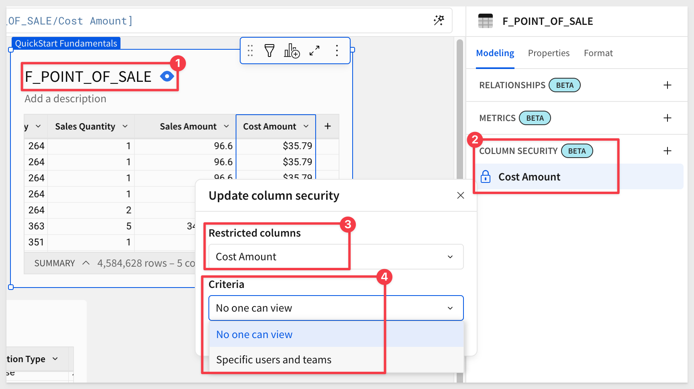

For more information, see [Configure column-level security](https://help.sigmacomputing.com/docs/column-level-security)


### Column-level security for data models (GA) 
Applying column-level security (CLS) to elements in data models is now generally available. 

Column-level security restricts access to column-level data for or one or more users or teams using the data model table downstream. This ensures that sensitive and confidential information is secure and accessible only to authorized users.

<aside class="negative">
<strong>BEST PRACTICE:</strong><br> Sigma recommends creating a team for each group of users to whom you want to restrict column access.
</aside>

For more information, see [Configure column-level security](https://help.sigmacomputing.com/docs/column-level-security)


### Column-level security in data models with user attributes (Beta) 
Set column-level security (CLS) rules in a data model according to the assigned value of a user attribute. 

Users and team members assigned a user attribute value that matches the value specified in the CLS rule can view the contents of the protected column. 

Users assigned other user attribute values, or not assigned a user attribute value, cannot view the contents of the protected column.

For more information, see [Configure column-level security in a data model](https://help.sigmacomputing.com/docs/column-level-security#configure-column-level-security-in-a-data-model)


### Data models (GA)
Data models are now generally available. 

Data models provide a semantic layer for your data, letting you organize and store data in a structured governed way without modifying raw data. 

You can create and manage reusable data elements with visual semantic modeling in an entity relationship diagram, empowering business users to independently model and explore data.

For more information, see:

[Get started with data modeling](https://help.sigmacomputing.com/docs/get-started-with-data-modeling)<br>
[Create and manage data models](https://help.sigmacomputing.com/docs/create-and-manage-data-models)<br>
[Navigate data models](https://help.sigmacomputing.com/docs/navigate-data-models)

There is a also a QuickStart: [Fundamentals 10: Data Modeling](https://quickstarts.sigmacomputing.com/guide/fundamentals_10_data_modeling/index.html?index=..%2F..index#0)


### dbt Semantic Layer integration (GA) 
You can configure and query a dbt Semantic Layer integration, allowing you to leverage your predefined dbt metrics in Sigma workbooks. 

To filter your queries, or pass other data to your queries, you can also reference control values.

To set up the dbt Semantic Layer integration, see [Configure a dbt Semantic Layer integration](https://help.sigmacomputing.com/docs/configure-a-dbt-semantic-layer-integration)

For details about query syntax, see [Query a dbt Semantic Layer integration](https://help.sigmacomputing.com/docs/query-a-dbt-semantic-layer-integration)


### Define relationships in data models (Beta)
You can pre-configure relationships between tables in a data model to enable business users to work with related data without performing ad hoc joins. 

A relationship defines the join logic for Sigma to use to join the tables, making the columns from both tables available to the source table for analysis and exploration **on demand.** 

When a user analyzes the source table in a workbook and adds a related column, Sigma performs the join.

<aside class="positive">
<strong>IMPORTANT:</strong><br> When a data model is used in a workbook, only the tables that have selected columns from the relationship are queried from the warehouse. The relationship may have tables that are available but if no columns are selected by the user, the table is not queried. This is called "join pruning" and improved performance and help reduce warehouse compute cost by not requesting tables that are not required by Sigma.
</aside>

Relationships between data model tables only support many-to-one or one-to-one joins, and are not automatically created between tables from a connected data source, even if the table has primary and foreign keys defined.

The video below shows selecting an existing data model relationship and opening the `Edit relationship` modal to view more details, such as relationship name, description, and keys:

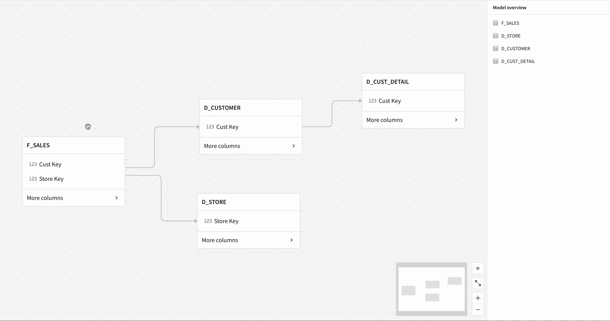

For more information, see [​​Define relationships in data models (Beta)](https://help.sigmacomputing.com/docs/define-relationships-in-data-models) 

For guidance using related columns in a workbook, see [Use related columns in a workbook (Beta)](https://help.sigmacomputing.com/docs/use-related-columns-in-a-workbook)


### Define relationships in data models (GA)
You can now add relationships between tables in a data model to enable business users to work with related data without performing ad hoc joins. 

A relationship defines the join logic for Sigma to use to join the tables, making the columns from both tables available to the source table for analysis and exploration on demand. When a user analyzes the source table in a workbook and adds a related column, Sigma performs the join.

Relationships between data model tables only support many-to-one or one-to-one joins, and are not automatically created between tables from a connected data source, even if the table has primary and foreign keys defined.

Newly available functionality:

- Use related columns in data models
- Add relationships to elements disabled as a source

For more information, see [​​Define relationships in data models](https://help.sigmacomputing.com/docs/define-relationships-in-data-models) 

For guidance using related columns in a workbook or data model, see [Use related columns in a workbook or data model](https://help.sigmacomputing.com/docs/use-related-columns-in-a-workbook)


### Improved data model overview
The status of elements in the model overview panel is more visible when you open a data model for editing but have not yet selected any elements. Elements enabled as a source show with a  icon and elements disabled as a source show with a  icon.


### Improved management of data model source visibility
Instead of managing the visibility of an element in a data model with a  on the element, now you manage the visibility of a table as a source from the Modeling tab.

For more information, see [Enable or disable an element as a data source](https://help.sigmacomputing.com/docs/create-and-manage-data-models#enable-or-disable-an-element-as-a-data-source)


### Map changed columns in a data model
When you publish a data model with changes that could break downstream elements, you are now prompted to map changed columns to prevent errors such as Unknown column [columnID] or Column [ColumnID] does not exist.

For more information, see [Map changed columns in a data model](https://help.sigmacomputing.com/docs/create-and-manage-data-models#map-changed-columns-in-a-data-model)


### Materialization for data models (GA)
Scheduling materialization for elements in data models is now generally available. 

If you have data sources that use expensive or long-running queries, such as a complex join between data elements, or a dataset with high cardinality and multiple grouping levels and calculated columns, setting up materialization enhances query performance and can help reduce compute costs.

For more information, see [About materialization](https://help.sigmacomputing.com/docs/materialization) and [Create a data element materialization schedule](https://help.sigmacomputing.com/docs/schedule-materialization-for-a-data-model-or-workbook#create-a-data-element-materialization-schedule) for a data model or workbook.


### Materialization support for version-tagged data models
You can now schedule materialization for each tagged version of a data model. 

For more information, see [Schedule materialization for a version-tagged data model](https://help.sigmacomputing.com/docs/schedule-materialization-for-a-version-tagged-data-model)


### Materialization support for version-tagged data models (GA)
Schedule materialization for each tagged version of a data model. If the published version already has a materialization schedule for one or more elements, you can choose to reuse the same schedule for the tagged version.

When you promote a tag to a new version of the data model, such as moving a tag from an older version of the data model to the latest published version, a new materialization run is started. While the materialization runs for the newly tagged version, the materialized data for the previously tagged version of the data model is used.

For more information, see [Schedule materialization for a version-tagged data model](https://help.sigmacomputing.com/docs/schedule-materialization-for-a-version-tagged-data-model)


### More options for managing source visibility
You can enable or disable a table as a data source in a data model from the data model overview using `Show as source ()`, or the toggle on the modeling tab of the editor panel. 

For more information, see [Enable or disable an element as a data source](https://help.sigmacomputing.com/docs/create-and-manage-data-models#enable-or-disable-an-element-as-a-data-source)


### New tutorial content: Intro to data models
A new tutorial covering the basics of creating a data model and preparing it for use as a data source in downstream analyses is now available. See [Tutorial: Intro to data modeling](https://help.sigmacomputing.com/docs/data-modeling-tutorial) to follow along and learn to create a data model with step-by-step instructions.

There is also a QuickStart: [Fundamentals 10: Data Modeling](https://quickstarts.sigmacomputing.com/guide/fundamentals_10_data_modeling/index.html?index=..%2F..index#0)


### Python element in data models (Beta)
If your organization is connected to Databricks, you can add `Python elements` in data models to write and run Python code. 

For more information, see [Set up a Databricks connection for Python](https://help.sigmacomputing.com/docs/set-up-a-databricks-connection-for-python) and [Write and run Python code in Sigma](https://help.sigmacomputing.com/docs/write-and-run-python-code)


### Reference Sigma workbook elements when writing Custom SQL in data models (Beta)
When writing custom SQL in data models, you can now use the `sigma_element()` syntax to reference Sigma workbook elements. 

For more information, see [Reference existing Sigma workbook elements](https://help.sigmacomputing.com/docs/write-custom-sql#reference-existing-sigma-workbook-elements)


### Updated behavior when targeting a data model source parameter from a workbook control
When passing values from a workbook control to a data model, you no longer need to target the source parameter with a specific data model table element. 

Instead, you can associate a control element in the workbook with a control element in the data model itself.

Existing workbook control elements that target data model elements with source parameters continue to work.

For more information, see [Create and manage a control element](https://help.sigmacomputing.com/docs/create-and-manage-a-control-element#pass-a-value-from-a-workbook-control-to-a-data-model-control)

Sigma has made significant changes to the way users can model data. Data Models represent the next iteration of Datasets. We’re investing heavily in Data Models over the coming months and years, with plans to add a whole suite of functionality outlined in this post. 

In April, we are releasing several new features in this area to beta. 


<!-- END OF SECTION-->

## Embedding
Duration: 20


### Ask Sigma now supported in secure embeds signed with JWT (Beta) 
Secure embedding with JWTs now extends to the `Ask Sigma` page. 

Embed `Ask Sigma` in your own application to offer your end users the ability to ask natural language queries of the data they have permission to access. 

Apply custom theming and remove Sigma branding for seamless integration.

For example:


For more information, see [Embed Ask Sigma (Beta)](https://help.sigmacomputing.com/docs/embed-ask-sigma) and [Ask natural language queries with Ask Sigma](https://help.sigmacomputing.com/docs/ask-natural-language-queries-with-ask-sigma)


### Ask Sigma now supported in secure embeds signed with JWT (GA) 
Secure embedding with JWTs now extends to the Ask Sigma page. 

Embed Ask Sigma in your own application to offer your end users the ability to ask natural language queries of the data they have permission to access. Apply custom theming and remove Sigma branding for seamless integration.

For more information, see [Embed Ask Sigma](https://help.sigmacomputing.com/docs/embed-ask-sigma) and [Ask natural language queries with Ask Sigma](https://help.sigmacomputing.com/docs/ask-natural-language-queries-with-ask-sigma)

There is also a QuickStart: [Embedding 08: Embedding Ask Sigma](https://quickstarts.sigmacomputing.com/guide/embedding_08_ask_sigma_v3/index.html?index=..%2F..index#0)


### Authenticate secure embeds using JSON Web Tokens (JWTs) (GA) 
Sigma supports authenticating secure embeds using **JSON Web Tokens (JWTs).** 

JWTs are compact, URL-safe tokens that can be digitally signed, ensuring that the data they contain is tamper-proof. Using JWT-signed URLs for your embeds offers several advantages, including offering a secure way to embed content that can be accessed by both external users and internal users.

For more information, see [Create an embed API with JSON web tokens](https://help.sigmacomputing.com/docs/create-an-embed-api-with-json-web-tokens)

There is also a QuickStart on this topic: [Embedding 16: Secure Embedding with JWT](https://quickstarts.sigmacomputing.com/guide/embedding_16_jwt/index.html?index=..%2F..index#0)


### Change to email notifications for embed user account type changes
Email notifications are no longer sent to embed users when an admin makes changes to those users’ account type.


### Copy paste elements across embedded content
Sigma now supports copy pasting elements from one embed to another. To support this in embedded content, update your iframe to allow copy paste actions. 

For example:
```code
<iframe src="<embed URL>" allow="clipboard-read; clipboard-write">
```
<aside class="negative">
<strong>NOTE:</strong><br> You can only copy paste from and to embedded content with this iframe configuration.
</aside>

For more information, see [Manage iframes for embeds](https://help.sigmacomputing.com/docs/manage-iframes-for-embeds)


### Dynamic text for embed element URLs
Embed elements now accept dynamic text in the URL field. You can now press `=` while editing the URL field to open the formula bar and configure a dynamic entry. This can be used to make embed contents responsive to control values, as well as changes to other workbook elements.


### Embed SDK for React (GA)
The `Embed SDK for React` offers a developer-friendly interface that simplifies integration into applications. 

Developers can access detailed installation and usage guides on Github.

For more information, see [Embed SDK for React](https://help.sigmacomputing.com/docs/embed-sdk-for-react) or review the [Embedding 15: Embed-SDK for React QuickStart.](https://quickstarts.sigmacomputing.com/guide/embedding_15_embed_sdk/index.html?index=..%2F..index&_gl=1*sstmup*_gcl_au*NjI3NDQxOTM0LjE3MzY5Nzc3NTc.*_ga*MjAyNzIyMDcwLjE3MTcxODQ4Nzk.*_ga_PMMQG4DCHC*MTczODY5ODEzNC40ODkuMS4xNzM4Njk5NzA1LjYwLjAuMA..#0)


### Hide bookmarks URL parameters
Sigma now provides a new `hide_bookmarks` URL parameter that enable you to hide saved views from the embed menu. This is also available in the embed sandbox.

For more information, see [Embed URL parameters](https://help.sigmacomputing.com/docs/embed-url-parameters)


### New connection_oauth_tokens JWT claim
The `connection_oauth_tokens` JWT claim is now available. 

This is an optional claim that allows you to pass OAuth tokens through JWT-signed URLs for connection-level OAuth. 

For more information, see [JWT claims](https://help.sigmacomputing.com/docs/create-an-embed-api-with-json-web-tokens#jwt-claims)


### New option to disable the explore button
You can now use the `hide_explore_toggle` URL parameter to hide the `Explore` toggle from the embed menu for JWT embeds.

For more information, see [Embed URL parameters](https://help.sigmacomputing.com/changelog#:~:text=Embed%20URL%20parameters)


### New outbound event emitted for deleted workbooks
When a workbook is successfully deleted from the embed menu, an outbound workbook:ondelete event is emitted.

For more information, see [workbook:ondelete](https://help.sigmacomputing.com/docs/inbound-and-outbound-events-in-embeds#workbookondelete)

There is also a QuickStart: [Embedding 16: Secure Embedding with JWT](https://quickstarts.sigmacomputing.com/guide/embedding_16_jwt/index.html?index=..%2F..index#0)


### New outbound event emitted for saved workbooks
When a workbook is successfully saved using the `Save as` option from the embed menu, an outbound `workbook:saveas` event is emitted. The event returns the `worbookId` of the new workbook.

Developers can use this event to implement custom messages or workflows.

For more information, see [workbook:saveas](https://help.sigmacomputing.com/docs/outbound-event-reference#workbooksaveas)


### New outbound events in embeds
Use two new outbound events, `workbook:bookmark:ondelete` and `workbook:bookmark:onupdate`, to communicate and interact between embedded content and the host application.

The event, `workbook:bookmark:ondelete` occurs when an embed user deletes a bookmark using the embed UI.

The event, `workbook:bookmark:onupdate` occurs when an embed user updates a bookmark using the embed UI by either changing the bookmark name, setting or removing it as the default view, sharing the bookmark, or unsharing the bookmark by setting it as a personal view.

For more information, see [Implement inbound and outbound events in embeds.](https://help.sigmacomputing.com/docs/inbound-and-outbound-events-in-embeds)


### QuickStart series has been refactored
The entire [QuickStart embedding series](https://quickstarts.sigmacomputing.com/?cat=embedding) has been redone to incorporate new embed functionality, sample source code in GitHub, design changes related to horizon and license changes.

Did I mention there are 17 in total!

- Embedding 01: Getting Started - This one anchors them all and needs to be completed first.
- Embedding 02–03: Federated Access, JWTs & Parameters
- Embedding 04: Isolation Solutions
- Embedding 06: Creating a Premium Service
- Embedding 08: Ask Sigma Integration
- Embedding 10: Version Tagging
- Embedding 13–16: Link Sharing, Public Access, React SDK, and more
- Use Cases: Salesforce (using Lightning Web Components), Streamlit

Embedding 05 is missing by design- a placeholder for a new feature coming soon.

<aside class="negative">
<strong>NOTE:</strong><br> The older embed series QuickStarts are moved but still available by link. There is also mentioned on the QuickStart homepage. 
</aside>


### Removed links to Sigma pages in embedded application workbooks
In embedded applications, Sigma no longer includes links that reference Sigma processes or link to Sigma documentation. Sigma links in these sections of a workbook do not appear in embeds:

- Column details
- Functions bar, specifically the Function icon
- Lineage / query history
- Metric tab


### Secure embed URLs signed with client credentials (Deprecated)
Secure embeds with URLs that are secured with client credentials, formerly known as `user-backed` embeds, are **deprecated as of August 4, 2025** and will reach end of support early next year. 

Instead, migrate to secure embed URLs signed with JSON Web Token (JWT).

For guidance, see [Migrate to JWT-signed secure embed URLs](https://help.sigmacomputing.com/docs/migrate-to-jwt-signed-secure-embed-urls)

All the [embed QuickStarts](https://quickstarts.sigmacomputing.com/?cat=embedding) have been revised in support of JWT. 

For questions and additional details, **contact your Customer Success Manager.**


### Securely embed data models (Beta)
If you securely embed Sigma with a JWT-signed URL, you can embed Sigma data models into your client application. All JWT claims and embed query string parameters are supported for embedding a data model.

The URL structure for embedding a data model is the same as embedding a workbook. Use the following URL structure to embed a data model:
``` code
https://app.sigmacomputing.com/<organization-slug>/data-model/<dataModelName>-<dataModelId>
```

For more information, see [Create an embed API with JSON Web Tokens](https://help.sigmacomputing.com/changelog/2025-12-05#/:~:text=Securely%20embed%20data,Web%20Tokens.)


<!-- END OF SECTION-->


## Functions / Calculations
Duration: 20


### ArrayExcept function
The ArrayExcept function returns an array of all unique elements from one specified array not included in another specified array. 

For example, consider a table that lists all available colors of different clothing items. To see all colors available for each item, ***excluding the colors black and white**, use the ArrayExcept formula:
```code
ArrayExcept([Colors], Array("black", "white"))
```

 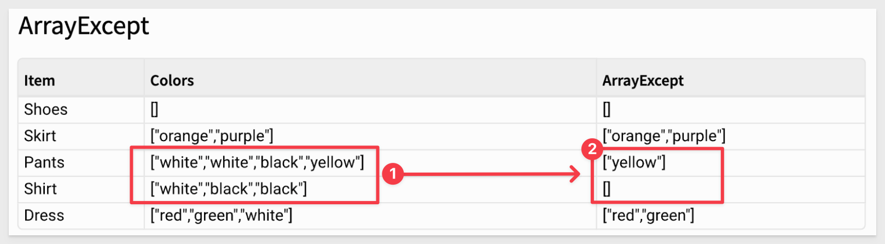

This can be a big time saver!

For more information, see [ArrayExcept](https://help.sigmacomputing.com/docs/arrayexcept)


### Azure SQL connections now support record formulas and the ArrayAgg function
You can now use record formulas and the `ArrayAg` function on an Azure SQL connection.

For more information, see [Generate and access structured objects](https://help.sigmacomputing.com/docs/generate-and-access-structured-objects) and [ArrayAgg](https://help.sigmacomputing.com/docs/arrayagg)


### ConvertTimezone function accepts dynamic arguments
The ConvertTimezone function now accepts a column of IANA time zones in the timezone and from_timezone arguments. 

For more information, see [ConvertTimezone](https://help.sigmacomputing.com/docs/converttimezone)


### Geography functions on Databricks (Beta)
All geography functions except for Centroid, Intersects, and Within are now available on Databricks connections. This includes the passthrough functions CallGeography and AggGeography. 

For more information, see [Geography functions](https://help.sigmacomputing.com/docs/geography-functions#/)


### Get additional formula guidance 
When you write formulas in workbooks and data models, additional guidance is now available to help! 

If guidance is available, a wavy underline appears. 

Hover over the highlight to see a tip or a warning that your results might not be what you expect, and select `Apply formula` to update your formula with one click.


This works for simple and complex formulas and help catch those little syntax issues that can be a time-waster too.


### IsEven and IsOdd functions
You can now use the `IsEven` and `IsOdd` functions to check whether the integer part of a number is even or odd. 

For more information, see [IsEven](https://help.sigmacomputing.com/docs/iseven) and [IsOdd](https://help.sigmacomputing.com/docs/isodd)


### New DayOfYear function and day_of_year DatePart argument
Return the day of the year as a number (1-365, or 1-366 in leap years) from a date using the [DayOfYear](https://help.sigmacomputing.com/docs/dayofyear) function. 

You can also return the day of the year as a number using day_of_year in the precision argument of the [DatePart](https://help.sigmacomputing.com/docs/datepart) function.


### New video tutorial series: Getting started with functions and groupings in Sigma
A new series of video tutorial content is now available covering the basics of grouping data in Sigma and performing calculations with grouped data using aggregate and window functions. 

See [Create and manage tables](https://help.sigmacomputing.com/docs/create-and-manage-tables#video-introduction-to-functions-and-groupings) to view the first video in the series or go to the [Sigma training videos page](https://www.sigmacomputing.com/resources/training-videos/table-grouping-and-functions?_gl=1*sxz9ax*_gcl_au*MTI4MzM4NjQwLjE3NTAwMzc3NzI.*_ga*MTAzMjQzMDMwNC4xNzQyMjI4NzA5*_ga_PMMQG4DCHC*czE3NTUwOTUyMzMkbzQwNCRnMSR0MTc1NTEwMTQzOCRqNjAkbDAkaDA.) to watch the entire five-part series.


### NullIf function
You can use the `NullIf` function to return "null" if the first argument is equal to the second. Otherwise, it returns the first argument. 

For more information, see [NullIf](https://help.sigmacomputing.com/docs/nullif)


### SparklineAgg support for Azure SQL Database and SQL Server (Beta)
The `SparklineAgg` function is now supported for Azure SQL Database and SQL Server.

For more information, see [SparklineAgg](https://help.sigmacomputing.com/docs/sparklineagg)


### SplitToArray function
The `SplitToArray` function splits a specified string by a given delimiter and returns an array of substrings. 

For more information, see [SplitToArray](https://help.sigmacomputing.com/docs/splittoarray)


### Three new functions
Sigma has enabled three functions that are useful in any situation where you want to quantify the relationship between two numeric variables, particularly in exploratory data analysis, trend evaluation, or predictive modeling.

#### RegressionSlope function
The RegressionSlope function calculates the slope of the linear regression line. The function is now supported for Databricks, Snowflake, and PostgreSQL.

For more information, see [RegressionSlope](https://help.sigmacomputing.com/docs/regressionslope)

#### RegressionIntercept function
The RegressionIntercept function calculates the `y-intercept` of the linear regression line. The function is now supported for Databricks, Snowflake, and PostgreSQL.

For more information, see [RegressionIntercept](https://help.sigmacomputing.com/docs/regressionintercept)

#### RegressionR2 function
The RegressionR2 function calculates the `R2 value`, or coefficient of determination, of the linear regression line. The function is now supported for Databricks, Snowflake, and PostgreSQL.

For more information, see [RegressionR2](https://help.sigmacomputing.com/docs/regressionr2)

### UrlPart Function
You can now extract specified components (host, port, path, etc.) from a URL, making it much easier to parse the data.

For more information and examples, see [UrlPart](https://help.sigmacomputing.com/docs/urlpart)


<!-- END OF SECTION-->


## Filters and controls
Duration: 20


### Specify date values in controls with Unix timestamps
Date range controls and date controls now accept date values as `Unix timestamps` (milliseconds since epoch) when setting values with URL query string parameters or from an action.

For exampleL
```code
 ?date-control-ID=1738260555.
```

For more information, see [Set control values in a URL using query string parameters.](https://help.sigmacomputing.com/docs/workbook-control-values-in-the-url)


<!-- END OF SECTION-->

## Input Tables
Duration: 20


### Change to data validation on percentage-based columns
Percentage-formatted input table columns with data validation have been updated with the following behavior to make it easier for users to understand:

- In the data validation range configuration, integer input is now treated as a percentage. For example, if a user enters 80 as the minimum value, the input is converted to 80% instead of scaling to 8000%.

- In the column, integer input is now treated as a percentage and is accepted when it meets the validation criteria. For example, if the validation range is 75%–100% and a user enters 85, the input is converted to 85% and passes validation.

- In the column, percentage input (value with % suffix) is no longer rescaled. For example, if a user enters85%, the input is interpreted literally as 85% instead of scaling to 8500% (as a conversion from 85). When input fails validation, the tooltip message now displays the range as percentages. For example, if the validation range is 75%–100%, the tooltip indicates `Input must be between 75.00% and 100.00%` instead of `Input must be between 75 and 100.`


### Created at/by columns in input tables (Beta)
You can now add `Created at` and `Created by` columns to input tables to record metadata associated with each row’s creation.

This is in addition to and different than the current `Last updated at/by` columns.

**Created at:**	Date and time the row was added to the input table.

**Created by:**	Email address of the user who initially added the row to the input table.


For more information, see [Add row edit history](https://help.sigmacomputing.com/docs/add-system-generated-columns-to-input-tables#add-row-edit-history)


### Edit input tables account type permission (Beta) 
The ability to edit input table data is now enabled through the new `Edit input tables` account type permission. By removing it from the `Basic explore` permission, Sigma allows admins to provision input table editing separately from explore capabilities like viewing unaggregated underlying data, using drill paths, filtering columns, etc.

***Why it matters:***<br>
Separating edit rights from explore rights gives admins more granular control over who can change structured inputs.

For more information, see [Account type permission availability matrix](https://help.sigmacomputing.com/docs/account-type-and-license-overview#account-type-permission-availability-matrix)

<aside class="negative">
<strong>NOTE:</strong><br> The "Edit input tables" permission is automatically enabled for all existing account types with the Basic explore permission enabled. 

For information about managing these permissions, see [Create and manage account types](https://help.sigmacomputing.com/docs/create-and-manage-account-types)
</aside>


### Improved error handling for non-compliant write-ahead logging (WAL) schema
Sigma now detects when input table edits are unsuccessful due to a non-compliant [write-ahead log (WAL) schema](https://en.wikipedia.org/wiki/Write-ahead_logging). 

This occurs when a user makes one or more changes to the schema in the data platform, leaving Sigma unable to write data to the WAL.

When this error (wrong schema for WAL table) is detected, Sigma sends an email to admins containing information about the error and a link to troubleshooting guidance.

***Why it matters:***<br>
Quicker diagnosis of WAL schema issues reduces downtime and avoids silent failures during data entry.

For more information, see [Troubleshoot input table connection issues](https://help.sigmacomputing.com/docs/troubleshoot-input-table-connection-issues)


### Input table audit logging (GA) 
Audit logs now record events and metadata related to input table activity. Admins can parse input table audit log data to understand the type of edit performed (e.g., create input table, add row, update row, delete row, etc.), who was responsible, and when the activity occurred. The metadata identifies the edited input table as well as the number of affected rows and columns, but it does not record the content of the edits.

For more information, see the [Audit log events and metadata](https://help.sigmacomputing.com/docs/audit-log-events-and-metadata#audit-events-reference)


### Input table editing for workbook viewers (Beta)
Data entry permission on input tables now includes a new option: 
- Editable in published version - all users

When this option is selected, any user with the `Edit input tables permission` enabled on their account type and access to the workbook—including those granted `Can view access`—can edit input table data.

***Why it matters:***<br>
This expands collaborative data entry to a broader audience while still respecting account-type-based edit controls.

For more information, see [Change the data entry permission on input tables](https://help.sigmacomputing.com/docs/customize-data-entry-permission-on-input-tables)


### Input table error handling
The following changes to input tables have been implemented to improve data integrity and prevent unexpected data loss:

- Input table edits that are unsuccessful due to configuration or availability issues in the connection or data platform (which must be resolved by the customer) are now treated as fatal errors and will no longer be retried.

- When Sigma detects a configuration or availability issue in the connection or data platform, it blocks edits to relevant input tables and displays an “Unable to edit” message directly on the input table elements until the configuration issue is resolved.

- Sigma sends admins an email alert that identifies the misconfigured or unavailable connection, displays the error message, and provides troubleshooting guidance.


### Input table support on BigQuery connections (Beta)
Input tables are now compatible with `BigQuery` connections. 

The dynamic workbook elements support structured data entry, allowing you to integrate new data points into your analysis and augment existing data from your data platform.

For more information about input tables and how to use them, see the following documentation:

[Intro to input tables](https://help.sigmacomputing.com/docs/intro-to-input-tables)
[Create new input tables](https://help.sigmacomputing.com/docs/create-new-input-tables)
[Edit existing input table columns](https://help.sigmacomputing.com/docs/edit-existing-input-table-columns)

There is a also a QuickStart (Snowflake based, but any supported connection will work too): [Sigma Input Tables: Use Cases](https://quickstarts.sigmacomputing.com/guide/input_tables_use_cases/index.html?index=..%2F..index#0)


### Input tables are now supported on Amazon Redshift connections (GA) 

Input tables are now compatible with Amazon Redshift connections. These dynamic workbook elements support structured data entry that allows you to integrate new data points into your analysis and augment existing data.

For more information about input tables and how to use them, see the following documentation:

[Intro to input tables](https://help.sigmacomputing.com/docs/intro-to-input-tables)
[Create new input tables](https://help.sigmacomputing.com/docs/create-new-input-tables)
[Edit existing input table columns](https://help.sigmacomputing.com/docs/edit-existing-input-table-columns)

There is also a [QuickStart](https://quickstarts.sigmacomputing.com/guide/input_tables_use_cases/index.html?index=..%2F..index#0) that demonstrates common use case. While this QuickStart uses Snowflake, they will behave the same on Redshift as well. 


### Multi-select columns in input tables (Beta) 
You can now use multi-select columns in input tables to enable users to add one or more discrete values to a single cell. 

You can create and manage a predefined list of custom values or choose an existing data source or element in the workbook to populate the list. 

Values are displayed as individual pills and can be assigned different colors for visual differentiation and clarity:


For more information, see [Configure multi-select columns on input tables](https://help.sigmacomputing.com/docs/configure-multi-select-columns-on-input-tables)


### PostgreSQL input table support (GA) 
Input table support on PostgreSQL connections is now generally available.

Input tables enable structured data entry, allowing you to add new data points, update existing inputs, and supplement existing data from your data platform.

***Why it matters:***<br>
Organizations using PostgreSQL can now enable governed, write-back data entry workflows without needing Snowflake or BigQuery.

For more information about input tables and how to use them, see the following documentation:

[Intro to input tables](https://help.sigmacomputing.com/docs/intro-to-input-tables)
[Create new input tables](https://help.sigmacomputing.com/docs/create-new-input-tables)
[Edit existing input table columns](https://help.sigmacomputing.com/docs/add-or-edit-input-table-data)


### Version tagging for input tables (Beta)
You can apply version tags to documents that contain input tables, creating a copy of the input table data in the tagged version. 

Optionally, you can create the copy on a different connection than the original input table. 

***Why it matters:***<br>
This allows stable reference versions of input data for audits, snapshots, or long-running analysis workflows.

For more information, see [Use input tables with version tagging](https://help.sigmacomputing.com/docs/use-input-tables-with-version-tagging-beta)


<!-- END OF SECTION-->


## New QuickStarts in 2025
Duration: 20


### AI App QuickStarts are Here! 

In fact, there are **ten** to choose from right now!

[AI App Fundamentals](https://quickstarts.sigmacomputing.com/guide/dataaps_fundamentals/index.html?index=..%2F..index#0)

[Adjustment Change Log](https://quickstarts.sigmacomputing.com/guide/dataapps_adjustments_change_log/index.html?index=..%2F..index#0)

[Approvals](https://quickstarts.sigmacomputing.com/guide/dataapps_approvals_flow/index.html?index=..%2F..index#0)

[Discounted Cash Flow](https://quickstarts.sigmacomputing.com/guide/dataapps_finance_discounted_cash_flow/index.html?index=..%2F..index#0)

[Forms Quick Capture and Analysis with Sigma](https://quickstarts.sigmacomputing.com/guide/dataapps_create_a_form_simple/index.html?index=..%2F..index#0)

[Integrate 3rd Party REST API via Stored Procedure](https://quickstarts.sigmacomputing.com/guide/dataapps_calling_external_api_procedure/index.html?index=..%2F..index#0)

[Native Sigma Snapshot Workflow](https://quickstarts.sigmacomputing.com/guide/dataapps_native_sigma_snapshot_workflow/index.html?index=..%2F..index#0)

[Pivot Spreading](https://quickstarts.sigmacomputing.com/guide/dataapps_pivot_spreading/index.html?index=..%2F..index#0)

[Reconciliation](https://quickstarts.sigmacomputing.com/guide/dataapps_reconciliation/index.html?index=..%2F..index#0)

[Snapshotting with Stored Procedures](https://quickstarts.sigmacomputing.com/guide/dataapps_snapshotting_with_sp/index.html?index=..%2F..index#0)


<!-- END OF SECTION-->


### Connect Snowflake Intelligence to Sigma Workbook
Chat with your Snowflake Cortex Agents directly inside Sigma—no external tools, 100% warehouse-native. 

In ~45 minutes you'll build a workbook where users can select agents, ask natural-language questions, and seamlessly transition from AI responses to structured analytics.

You'll learn to:
* Set up Snowflake Intelligence and create Cortex Agents
* Configure secure API access with service users, roles, and Programmatic Access Tokens (PAT)
* Build a stored procedure that invokes Cortex Agents via REST API
* Create a Sigma workbook with input tables and actions for agent interactions
* Log all conversations for audit and analysis
* Connect agents to your data using custom tools and functions

Perfect for Snowflake users who want AI-powered analytics without leaving their data warehouse—ask questions in natural language, then immediately dive into Sigma's full visualization and computation capabilities.

For more information, see [Connect Snowflake Intelligence to Sigma Workbook](https://quickstarts.sigmacomputing.com/guide/partners_snowflake_intelligence/index.html?index=..%2F..index#0)


### Create an Ask Sigma Usage Dashboard
In this QuickStart, we explore how to securely enable and monitor [Ask Sigma usage](https://quickstarts.sigmacomputing.com/guide/administration_ask_sigma_usage_dashboard/index.html?index=..%2F..index#0) in your organization.


### Embed Sigma into Microsoft SharePoint
Bring Sigma right into SharePoint Online—securely and seamlessly—with this [QuickStart](https://quickstarts.sigmacomputing.com/guide/embedding_use_case_sharepoint/index.html?index=..%2F..index#0)

This approach leverages Microsoft 365 authentication, flows the correct user identity into Sigma, and eliminates extra logins—making it the production-ready pattern most customers use.

**Great for:** IT admins, SharePoint devs, and BI teams embedding analytics in M365.


### Embedding Series Refactoring
The entire [QuickStart embedding series](https://quickstarts.sigmacomputing.com/?cat=embedding) has been redone to incorporate new embed functionality, sample source code in GitHub, design changes related to horizon and license changes.

Did I mention there are 17 in total!

- Embedding 01: Getting Started - This one anchors them all and needs to be completed first.
- Embedding 02–03: Federated Access, JWTs & Parameters
- Embedding 04: Isolation Solutions
- Embedding 06: Creating a Premium Service
- Embedding 08: Ask Sigma Integration
- Embedding 10: Version Tagging
- Embedding 13–16: Link Sharing, Public Access, React SDK, and more
- Use Cases: Salesforce (using Lightning Web Components), Streamlit

Embedding 05 is missing by design- a placeholder for a new feature coming soon.

<aside class="negative">
<strong>NOTE:</strong><br> The older embed series QuickStarts are moved but still available by [this link](https://quickstarts.sigmacomputing.com/deprecated/) There is also mentioned on the QuickStart homepage. 
</aside>


### New API Recipe (Reassign Ownership by Email)ß
This recipe will change the owner of all workbooks owned by a specified email address to a new email address.

For more information, see [Workbook: Reassign Ownership by Email](https://quickstarts.sigmacomputing.com/guide/developers_api_code_samples/index.html?index=..%2F..index#23)


### OAuth 2.0 & PKCE for Secure Data Integration
This conceptual [QuickStart](https://quickstarts.sigmacomputing.com/guide/security_oauth_pkce_secure_integration/index.html?index=..%2F..index#0) breaks down how to use OAuth 2.0 with PKCE to secure Sigma’s access to cloud data platforms—especially in embedded scenarios.

Security teams and architects need a clear, shared model for how Sigma authenticates and queries on behalf of users. 

This QS gives a vendor-neutral, implementation-aware overview that you can use to:
- Pick the right pattern for your Sigma deployment (internal vs embedded, per-user vs service account)
- Understand where PKCE fits and how Sigma supports
- Talk credibly with security, platform, and app teams about risk, audibility, and compliance

IMPORTANT NOTES:
Conceptual only — no hands-on build or trial setup required
Aimed at security architects, data platform owners, and embedding developers who need a design-level view


### Plugin Use Case 01: Dashboard Builder (Embedding Series)
A brand-new developer QuickStart shows how to build a configurable, embed-ready dashboard experience using Sigma’s plugin framework, a locally hosted Angular plugin, and a lightweight JavaScript host app.

- Users pick KPIs and layout areas, then save setups with Sigma bookmarks; extra metadata persists in a local JSON db (lowdb).
- Includes a Sigma workbook template with curated KPIs and control wiring for fast setup.

**Why it matters:**<br>
Gives product teams a governed, self-service way to let end users “assemble” dashboards inside your app—no heavy front-end rebuild. You keep Sigma’s security/governance, gain rapid customization, and can proof-out plugin patterns for larger embedded experiences.

[Plugin Use Case 01: Dashboard Builder QuickStart](https://quickstarts.sigmacomputing.com/guide/embedding_plugin_useage_01_dashboard_builder/index.html?index=..%2F..index#0)<br>
[Project README (code + steps)](https://github.com/sigmacomputing/quickstarts-public/blob/main/plugin_use_cases/public/dashboard-builder/README.md) <br>
[Prereq: REST API Usage 01 — Getting Started](https://quickstarts.sigmacomputing.com/guide/embedding_rest_api_usage_01_getting%20started_started/index.html?index=..%2F..index#0)


### Popular Functions  
This [new QuickStart](https://quickstarts.sigmacomputing.com/guide/functions_popular_functions/index.html?index=..%2F..index#0) highlights Sigma’s most frequently used functions (according  to CS) through practical, retail-data examples—covering the core patterns users rely on every day.

- Categorize values with BinFixed and BinRange
- Handle nulls cleanly with Zn and Coalesce
- Search and classify text with Contains and RegexpExtract
- Filter efficiently with In, IsNull, IsNotNull
- Enrich analysis using Lookup
- Understand contribution with PercentOfTotal and Subtotal
- Apply clean multi-condition logic with Switch

These patterns cover the 80/20 of everyday workbook building—categorizing values, fixing nulls, parsing strings, enriching with lookups, and calculating contributions without SQL detours. Faster builds, fewer mistakes, clearer insights.

A full, prebuilt workbook template is available so users can explore every example without building the workbook themselves. Great for learning the functions quickly or using the workbook as a reference model.

The [Common Date Functions QuickStart](https://quickstarts.sigmacomputing.com/guide/common_date_functions/index.html?index=..%2F..index#0) also has a template now too!


### QuickStarts API Toolkit
This new QuickStart introduces the `QuickStarts API Toolkit` — a lightweight, self-contained portal for experimenting with Sigma API recipes and common operations on your local machine.

**What it can do:**

- Save authentication settings to encrypted local storage, making it simple to test across multiple Sigma instances

- Run API recipes directly, view/copy responses, and even copy the script itself

- Run “Quick API” operations, a small set of the most common operations to GET information fast

- Supports “smart parameters”; select users, teams, or workbooks from a list when Sigma makes them available, instead of hunting for IDs manually

**NOTE:** The API Toolkit is not intended to replace or provide all the operations available in our API Reference and never will.

**How it fits with existing tools (with links):**

**Swagger / API Reference:** this is the full list of endpoints & parameters. THE SOURCE OF TRUTH

**QuickStarts API Recipes:** reusable JS samples in your IDE

**Postman:** team-friendly 3rd-party API tool that is very popular with developers

**QuickStarts API Toolkit:** quick experiments with a web UI & smart parameter pickers

For more information, see [QuickStarts API Toolkit](https://quickstarts.sigmacomputing.com/guide/developers_quickstarts_api_tookit/index.html?index=..%2F..index#0)


### Resolving The Fan Trap with Sigma and Snowflake UDF
In this QuickStart, we explore a fan trap use case and one way to solve it in Sigma.

A fan trap occurs when a one-to-many relationship is followed by another one-to-many relationship, leading to potential overcounting of values in queries. 

[Resolving The Fan Trap with Sigma and Snowflake UDF](https://quickstarts.sigmacomputing.com/guide/tables_fan_traps/index.html?index=..%2F..index#0)


### REST API use case QuickStarts Series: 
This new series demonstrate common API methods in the host application, using sample code provided in the QuickStarts public git repo. Perfect for developers embedding Sigma into SaaS apps or internal tools who want to deliver a more dynamic, personalized experience between their app and the Sigma embed.

The first one, "Getting Started" is mandatory for the others in this series, so start there to set up your local environment.

[REST API Usage 04: – Scheduling Exports](https://quickstarts.sigmacomputing.com/guide/embedding_rest_api_usage_04_export_modal/index.html?index=..%2F..index#0)<br>
This new QuickStart demonstrates how to extend an embedded Sigma experience by enabling scheduled exports—directly from a host application.

Using our API, you’ll learn how to:
- Create and manage exports operations from a host application.
- Schedule recurring exports with configurable format, timing, and recipients.
- Manage existing schedules, including edit, delete, and run now options

This approach is especially useful for SaaS and internal applications where users need to share Sigma content via email—without accessing the full Sigma UI.

Example of what you will build:


[REST API Usage 05: – Workbook Descriptions](https://quickstarts.sigmacomputing.com/guide/embedding_rest_api_usage_05_wb_descriptions/index.html?index=..%2F..index#0)<br>
This QuickStart demonstrates how to enhance embedded Sigma workbooks by enabling custom metadata entry through the host application. In this example, we use workbook descriptions—but the same pattern can support usage notes, business context, lineage details, and more.

Using our API, you’ll learn how to:
- Let users add, update, or remove descriptive context for embedded workbooks
- Store metadata in a lightweight local DB (lowdb) for flexibility
- Display that metadata directly, without modifying the Sigma UI

Example of what you will build:


[REST API Usage 06: – Copy or Create a New Workbook](https://quickstarts.sigmacomputing.com/guide/embedding_rest_api_useage_06_copy_or_new_wb/index.html?index=..%2F..index#0)<br>
This new QuickStart demonstrates how to extend an embedded application—supporting workflows for creating and copying workbooks from the host application using Sigma’s REST API.

Using our API, you’ll learn how to:
- Create new workbooks in the user’s My Documents folder
- Copy existing workbooks with optional renaming and team sharing
- Auto-handle naming conflicts and refresh the embed on success

Example of what you will build:


[REST API Usage 07: - Custom Loading Indicators](https://quickstarts.sigmacomputing.com/guide/embedding_rest_api_useage_07_custom_loader/index.html?index=..%2F..index#0)<br>
This QuickStart shows how to improve your embedded Sigma experience by adding a custom loading indicator while a workbook is initializing.

You’ll learn how to:
- Display a CSS-based overlay during embed loading
- Listen for the workbook:dataLoaded event to hide the loader at the right time
- Handle timeouts gracefully if the embed doesn’t load

This pattern is simple but important—it gives you complete control over the user experience and helps eliminate “blank screen” confusion in embedded deployments.

Example of what you will build:


[REST API Usage 08: Filters ](https://quickstarts.sigmacomputing.com/guide/embedding_rest_api_useage_08_filters/index.html?index=..%2F..index#0)<br>

This QuickStart shows how to keep filters in sync between the host application and an embedded Sigma workbook—so filter changes in the host instantly update the embedded content.

You’ll learn how to:
- Add matching List and Date Range controls in Sigma to respond to host‑side filter updates
- Use a jQuery date range picker for flexible date selection
- Hide workbook‑side controls while still driving them from the host application

The result: A seamless, user‑friendly filter experience with centralized logic in the host app.

Example of what you will build:
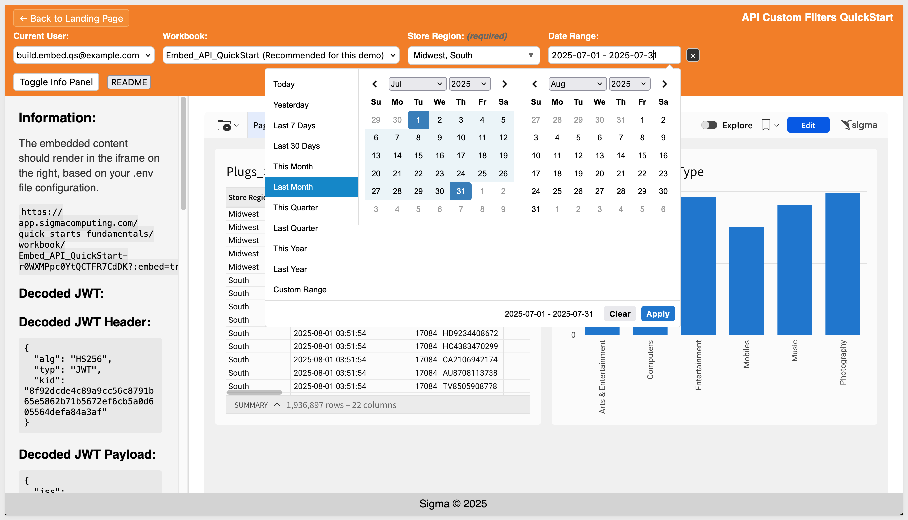

[REST API Usage 10: Hide Menus & Page Navigation](https://quickstarts.sigmacomputing.com/guide/embedding_rest_api_useage_09_hide_menus/index.html?index=..%2F..index#0)<br>

This QuickStart demonstrates how to hide Sigma’s built-in menus and control workbook page navigation directly from your host application.

Key takeaways:
- Use JWT and .env parameters to hide Sigma’s folder nav, page controls, and menus
- Fetch Workbook pages dynamically using the Sigma Embedding API
- Allow embed page control from the host application

Whether you're embedding a single workbook or managing multi-page, role-aware navigation, this pattern helps keep the experience native to the host application.

Example of what you will build:


[REST API Usage 10: Hide Menus & Page Navigation](https://quickstarts.sigmacomputing.com/guide/embedding_rest_api_useage_09_hide_menus/index.html?index=..%2F..index#0)<br>

This QuickStart demonstrates filter synchronization between a host application and Sigma embeds. It uses `Store Region` and `Date Range` filters in the host application that stay in sync with matching controls in the embedded Sigma workbook—creating a seamless experience where filter changes instantly update the embedded content

You’ll learn how to:
Let users select a preferred workbook that auto-loads when their account is chosen
Change or clear the default at any time
Store preferences in local storage for a tailored embed experience

Example of what you will build:


[REST API Usage 11 – Custom Workbook List](https://quickstarts.sigmacomputing.com/guide/embedding_rest_api_useage_11_custom_workbook_list/index.html?index=..%2F..index#0)
This QuickStart shows how to create a visual, interactive workbook selection experience for embedded Sigma apps using a simple carousel interface.

We discuss how to:
- Use the List Member Files API to fetch accessible workbooks for a user
- Display them as clickable thumbnails for easy browsing
- Apply best practices for secure organization, such as dedicated workspaces for embed users
- Extend the pattern to filter results by path or team membership for tighter access control

Example of what you will build:


### REST API use case QuickStarts Series: 
This new series demonstrate common API methods in the host application, using sample code provided in the QuickStarts public git repo. Perfect for developers embedding Sigma into SaaS apps or internal tools who want to deliver a more dynamic, personalized experience between their app and the Sigma embed.

The first one, "Getting Started" is mandatory for the others in this series, so start there to set up your local environment.

**[REST API Usage 01: Getting Started](https://quickstarts.sigmacomputing.com/guide/embedding_rest_api_usage_01_getting%20started_started/index.html?index=..%2F..index#0)**<br>
- Embed workbooks using Sigma's REST API
- Switch between Build and View users
- Dynamically load workbook, page and element options

Example of what you will build:


**[Rest API Usage 02: Bookmarks](https://quickstarts.sigmacomputing.com/guide/embedding_rest_api_usage_02_bookmarks/index.html?index=..%2F..index#0)**<br>
- Build users can save filtered views as bookmarks
- View users can apply bookmarks from a dropdown

Example of what you will build:


**[REST API Usage 03 – Bookmark Sharing with a Local DB](https://quickstarts.sigmacomputing.com/guide/embedding_rest_api_usage_03_bookmark_sharing_with_a_local_db/index.html?index=..%2F..index#0)**<br>
- Save bookmarks with user/team share settings
- Manage or delete bookmarks across both Sigma and a local DB
- Restrict bookmark access to specific roles (e.g., View vs Build users)

Example of what you will build:
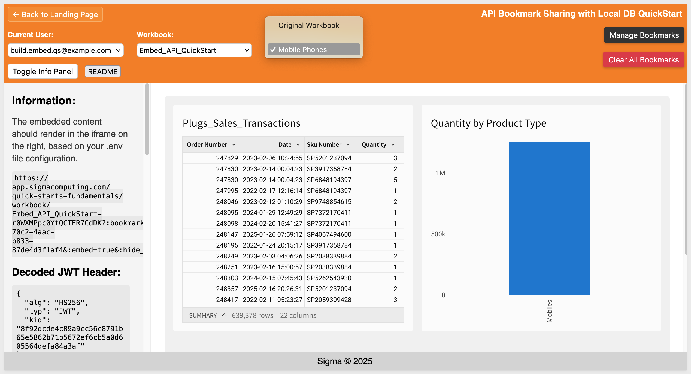


### Snowflake Summit 2025 - Hands on Lab
In this [QuickStart](https://quickstarts.sigmacomputing.com/guide/partners_snowflake_summit_2025/index.html?index=..%2F..index#0) (which was launched at this year's Snowflake Summit) you will create an analysis using AI, and leverage a data application and forecast out product performance. You will act as a category manager at a retail company building out an ad-hoc analysis from an AI-generated jump-off point to determine your category plan for the year.

[Fundamentals 10: Data Modeling](https://quickstarts.sigmacomputing.com/guide/fundamentals_10_data_modeling/index.html?index=..%2F..index#0)

In this QuickStart, we explore how to build a Sigma data model, join and organize tables, create calculated fields and metrics, apply column-level security, and improve usability through folders and materialization. With these tools, you're ready to deliver clean, consistent, and secure data to your users—all without writing SQL.


<!-- END OF SECTION-->


## Pivot Tables
Duration: 20


### Display images in pivot table cells 
If your pivot table has a column that contains links to images, such as thumbnail images of retail products, you can transform the column to display the image links as images. 

You can set images to display in pivot table row, column, or values columns.

For more information, see [Display linked images in a table or pivot table.](https://help.sigmacomputing.com/docs/add-hyperlinks-to-columns#display-linked-images-in-a-table-or-pivot-table)


<!-- END OF SECTION-->


## Security
Duration: 20

### Implicit TLS now supported for custom SMTP servers
You can now use `implicit Transport Layer Security` (TLS) when configuring custom SMTP servers by using **port 465.**

For more information, see [Configure a custom SMTP server](https://help.sigmacomputing.com/docs/customize-welcome-and-invite-emails#custom-smtp-server)


### IP Allowlist for UI/Application (GA) 
You can configure an IP allowlist for the Sigma UI. After enabling the allowlist, you can add individual IP addresses or ranges of addresses in CIDR notation. Only users in the allowlist are able to access the Sigma application through the user interface. For more information, see Restrict access to Sigma by IP.

Previously, the IP allowlist applied only to the API. Existing IP allowlists for the API have been preserved with a Scope of API.


For more information, see [Restrict access to Sigma by IP](https://help.sigmacomputing.com/docs/restrict-access-to-sigma-by-ip-address)

**Why it matters:**<br>
This enhancement strengthens security by allowing admins to restrict UI access to trusted networks — ensuring Sigma access policies align with enterprise perimeter controls.

### Set up an app for two-factor authentication (GA)
If you use a username and password to log in to Sigma, you can set up an authenticator app to generate two-factor authentication codes instead of having codes sent to your email address.

You can turn off the app-based two-factor authentication at any time, or an admin can reset it, to receive two-factor authentication codes via email instead.

For more information, see [Set up an app for two-factor authentication](https://help.sigmacomputing.com/docs/app-based-authentication-for-users)


<!-- END OF SECTION-->


## Workbooks
Duration: 20

### Add CC and BCC recipients to emailed exports
You can now specify `CC or BCC recipients` in ad hoc and scheduled exports by entering a comma-separated list of email addresses or team names.

***Why it matters:***<br>
This makes automated reporting workflows more flexible and reduces the need to forward reports manually.

### Add user-added text translations for default locales
You can now add user-added text translations for both default and non-default locales in a workbook. 

Previously, uploading and downloading user-added text translations was only supported for non-default locales.

For more information, see [Manage workbook localization](https://help.sigmacomputing.com/docs/manage-workbook-localization)

### Add custom data labels to area, bar, line, scatter, and combo charts
It can sometimes be useful to display a more verbose data label on a chart to help the user better understand meaning.

By default, a chart can display data labels for the aggregate series of the chart, such as the Y-axis or X-axis values, depending on the chart and orientation. With this addition, some charts, and for region and point maps, you can specify a column to use to provide custom data labels for a chart.

Simply select one or more columns to add custom data labels to area, bar, line, scatter, and combo charts.

For more information see [Display chart data labels.](https://help.sigmacomputing.com/docs/display-chart-data-labels)


### Add shortcuts to documents (GA)
If you want to save links to documents in more than one location, you can add a shortcut:

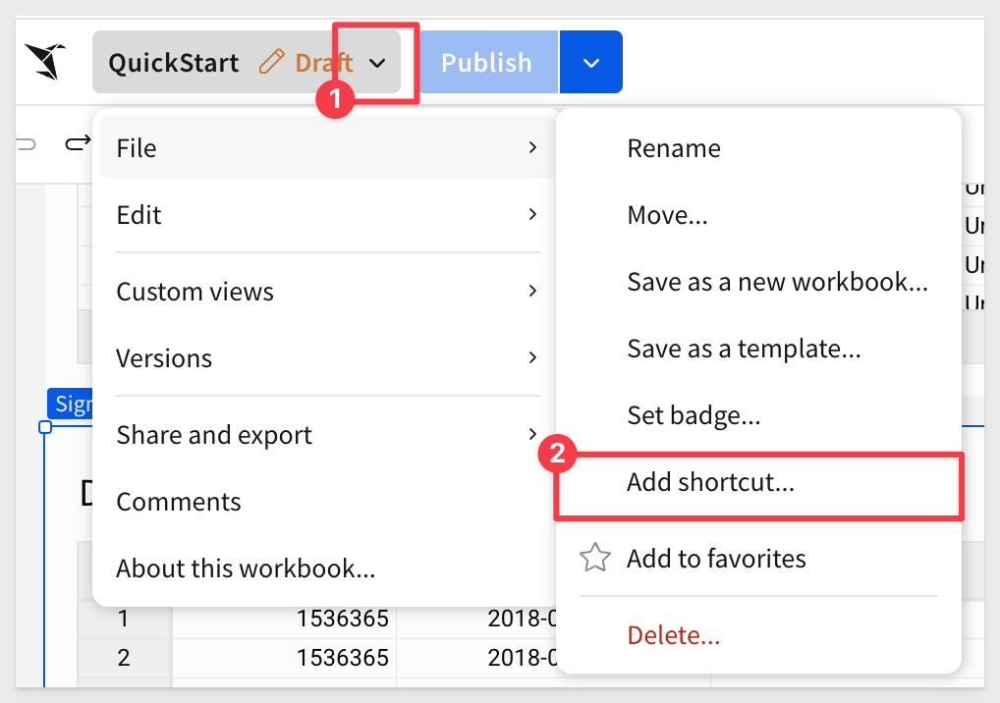

Use shortcuts to make specific data sources easier to find in the source picker, or to organize documents to make key workbooks and data models easier to access.

The shortcut icon looks a little different than a standard workbook: 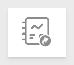

For more information, see [Add shortcuts to documents](https://help.sigmacomputing.com/docs/add-shortcuts-to-documents)


### Additional options and new default handling for null values in filters and controls
When filtering data with null values using a data element filter or a control element, you now have three options to handle null values:
**1:** Always, to always include null values, regardless of whether a filter value is set. Equivalent to the previous functionality where `Include nulls` is selected.

**2:** Never, to never include null values, regardless of whether a filter value is set. Equivalent to the previous functionality where `Include nulls` is deselected.

**3:** When no value is selected, to include null values only if the filter or control has no selected value.

The `When no value `is selected option is the new default for filters and controls created after Thursday, August 7th. **Existing filters or controls are unaffected by this change.**


### Aggregate totals across higher grouping levels (GA)
When displaying subtotals in your pivot table, you can now change whether the row subtotals are aggregated and displayed just for the immediate parent pivot rows, or also displayed at higher grouping levels.

For more information, see [Aggregate totals across higher grouping levels (Beta)](https://help.sigmacomputing.com/docs/working-with-pivot-tables#aggregate-totals-across-higher-grouping-levels-beta)


### Auto-update page anchor names in the navigation element
When the name of a page anchor is changed, the names of any associated navigation options in a navigation element now automatically update to match the new name.


### Change divider stroke styles
You can now change the Stroke style for divider elements to Solid, Dashed, or Dotted.

For more information, see [Divider](https://help.sigmacomputing.com/docs/intro-to-ui-elements#divider) in Intro to UI elements.


### Change the grid density within containers (Beta)
You can now change the `density of the grid` within a container or tabbed container element. 

By default, a container's grid has `twelve` horizontal grid spaces, which expand and contract to fit the container size. 

Using the new `Column density` setting, you can opt to configure a lower or higher density, depending on your layout. 

Higher density gives you a finer grain of control over element positions in large containers.

For more information, see [Change the grid column density of a container (Beta).](https://help.sigmacomputing.com/docs/organize-workbook-layouts-with-containers#change-the-grid-column-density-of-a-container-beta) 


### Change the layout grid density of a container (GA)
You can change the layout grid density of a container or tabbed container. 

In the `Properties panel` for a container or tabbed container, set the `Layout grid density` setting as either Low, Medium, or High. 

Containers made from a group of selected elements have a Medium density by default if the selected elements cover 12 or fewer columns on the workbook page. 

If the selected elements cover more than 12 columns, the container defaults to High density.

For more information, see [Change the layout grid density of a container](https://help.sigmacomputing.com/docs/use-containers-to-organize-workbook-layouts#change-the-layout-grid-density-of-a-container)


### Conditional background colors for containers
You can configure formatting rules that conditionally change the background color of a container. For more information, see [Style a container](https://help.sigmacomputing.com/docs/use-containers-to-organize-workbook-layouts#style-a-container)


### Conditional exports no longer list the condition in the email message
Any export scheduled to send an email when a condition is met **no longer lists the condition** in the email message.

If you still want to include the condition in the export, update the message included in the scheduled export to include the condition. 

For more information, see [Schedule a conditional export or alert](https://help.sigmacomputing.com/docs/schedule-a-conditional-export-or-alert)


### Conditional formatting retained for XLSX files
When a table, input table, or pivot table with conditional formatting is exported as an XLSX-formatted (Excel) file, the conditional formatting is retained. Conditional formatting includes single color, color scale, and data bar formatting. This makes for reports that are more familiar to users and better-looking too.


### Configure global BCC email addresses
You can now configure global BCC recipients for all emails in your custom email branding settings.

**Why it matters:**<br>
This ensures compliance teams and auditors automatically receive copies of all Sigma communications — critical for maintaining audit trails and meeting regulatory oversight requirements.

For more information, see [Custom email branding](https://help.sigmacomputing.com/docs/custom-email-branding)


### Copy and paste multiple elements at once 
You can now copy and paste more than one element at a time in a workbook or data model.

**Why it matters:**<br>
This enhancement speeds up workbook and data model design by allowing bulk duplication of layout elements, reducing repetitive setup work.

For more information, see [Copy and paste workbook elements](https://help.sigmacomputing.com/docs/copy-and-paste-elements#/)


### Copy/Paste improvement
Pasted elements previously appeared at the default size for that element. Now, pasted elements match the size of the copied element.


### Create and filter hierarchies (Beta)
Use hierarchies to group columns categorically and define the order of data granularity. When you create a hierarchy, you can:

- Define the order of the hierarchical data.
- Easily visualize all parts of the hierarchy together in a pivot table or grouped table.
- Format all levels of the hierarchy consistently, such as when applying conditional formatting.

If your hierarchical data is ragged, Sigma visualizes the ragged hierarchy, letting you view your hierarchy in a dense layout instead of empty rows like a non-ragged hierarchical view. 

For more information about creating a hierarchy column, see [Work with hierarchies](https://help.sigmacomputing.com/docs/hierarchies) and the function reference for the [RaggedHierarchy function](https://help.sigmacomputing.com/docs/raggedhierarchy)

After you create a hierarchy, you can filter different levels of the hierarchy using a filter on the data element or with a hierarchy control element. 

For more information, see [Hierarchy control](https://help.sigmacomputing.com/docs/intro-to-control-elements#hierarchy-control)


### Custom banding colors for table and pivot table rows
When formatting a table or pivot table, you can now use custom colors for row banding.

For more information, see [Banding](https://help.sigmacomputing.com/docs/format-and-customize-a-table#banding)


### Custom page headers (Beta) 
Custom page headers supports the display of common information on one or more workbook pages. 

Page headers allow you to repeat contents like titles, filters, or navigation options across multiple pages in a single configuration. 

Scroll options allow you to create a sticky header that moves with the user as they scroll. 

For more information, see [Add custom page headers to a workbook](https://help.sigmacomputing.com/docs/add-custom-page-headers-to-a-workbook#/)


### Custom totals and subtotals for pivot tables and grouped tables (Beta)
In a pivot table or grouped table, you can change the way that totals and subtotals are calculated by choosing to change the aggregate used for a subtotal, or modifying the formula for a grand total or subtotal directly.

With this update, the default names of subtotals and totals update to `Column Name total` for subtotals or `Grand total` for totals. You can change the label of any subtotal or grand total.

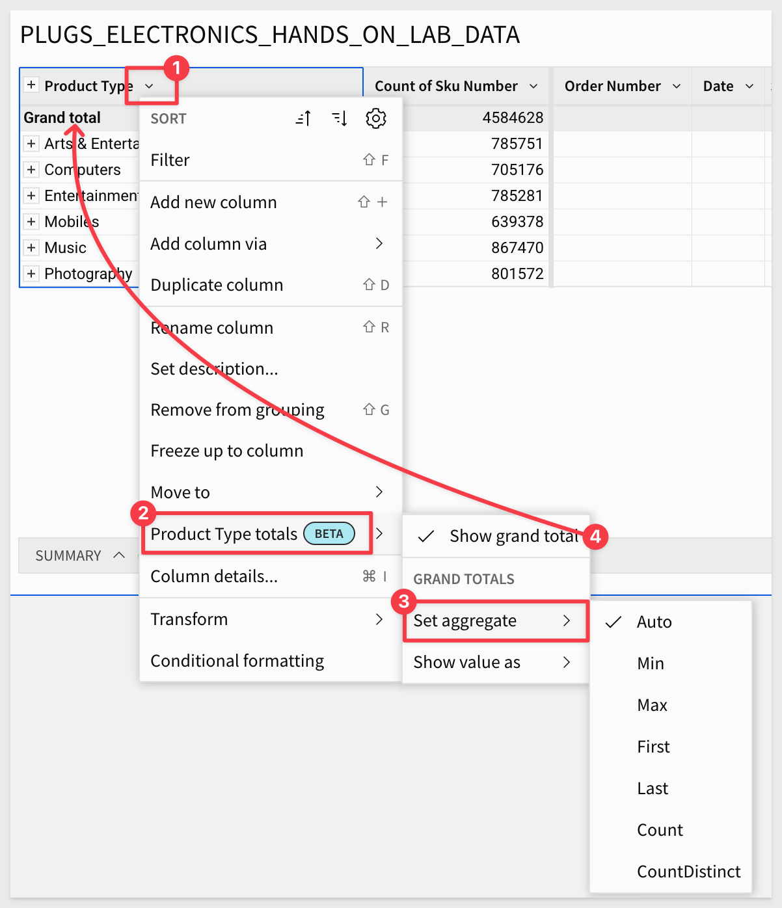

For more information, see [Customize totals and subtotals (Beta)](https://help.sigmacomputing.com/docs/pivot-table-subtotals#customize-totals-and-subtotals-beta)


### Custom totals and subtotals for pivot tables and grouped tables (GA)
In a pivot table or grouped table, you can change the way that totals and subtotals are calculated by choosing to change the aggregate used for a subtotal, or modifying the formula for a grand total or subtotal directly.

With this update, the default names of subtotals and totals update to `Column Name` total for `subtotals` or `Grand total` for totals. You can also change the label of any `subtotal` or `grand total`.

For more information, see [Customize totals and subtotals](https://help.sigmacomputing.com/docs/pivot-table-subtotals#customize-totals-and-subtotals)


### Customize chart and formatting color scales (Beta)
You can now create custom color scales to use when formatting chart colors or conditional formatting for tables. Create a custom color scale for an organization theme, workbook theme, or for a specific data element.


For more details, see [Add a custom color scale (Beta).](https://help.sigmacomputing.com/docs/add-a-custom-color-scale)


### Customize element styles in a workbook layout
You can now customize the styling of data elements such as tables, input tables, visualizations, and UI elements. 

- Add or remove padding, change the corner style, add a border, and change the text alignment for text elements.

- Set default styles in an organization theme, customize styles for an entire workbook in the workbook settings, or style individual elements.

For more information, see [Customize element background and styles](https://help.sigmacomputing.com/docs/customize-element-background-and-styles) and [Workbook settings overview](https://help.sigmacomputing.com/docs/workbook-settings-overview)


### Customize page headers (GA)  
You can enable custom page headers to appear on one or more workbook pages. 

Page headers allow you to repeat contents like titles, filters, or navigation options across multiple pages in a single configuration. 

Scroll options allow you to create a sticky header that moves with the user as they scroll. 

For more information, see [Add custom page headers to a workbook](https://help.sigmacomputing.com/docs/add-custom-page-headers-to-a-workbook)


### Customize text fonts and sizes
You can now use custom fonts and sizes for text elements, in addition to using preset text styles, by using `Break` style and `Restore` style.

For more information, see [Text elements](https://help.sigmacomputing.com/docs/text-elements#/apply-formatting-to-a-text-element)


### Dependent materialization schedules (Beta)
You can now set up dependent materialization schedules in workbooks and data models. 

If you materialize both parent and child elements in a workbook or data model, you can set up materialization schedules that include child elements to run after the parent materialization schedule completes.

For more information, see: [Schedule materialization for a data model or workbook](https://help.sigmacomputing.com/docs/schedule-materialization-for-a-data-model-or-workbook#set-up-a-dependent-materialization-schedule)

<aside class="negative">
<strong>NOTE:</strong><br> This functionality is not available for dataset materializations.
</aside>


### Deprecation: {{ }} format
Previously, control values could be referenced in image and embed elements using the format `{{control-id}}`. This format has been deprecated, and existing elements using this format have been migrated to use dynamic text. 

Press `=` on your keyboard to open the formula bar and reference control values via dynamic text.


### Detach a control from an element
You can now "detach" an element as a target of a control, you can now detach the control from the element from the element's filter menu.

This is handy when adding or remapping controls in the build stage of projects or when changes are required later. 


### Double-click to rename tabs in tabbed containers
You can now double-click the name of a tab in a tabbed container to rename it. This is in addition to the previously available rename options in the editor panel.


### Drag to move the live chat window 
When chatting with a Sigma support engineer, you can now click and drag the handle on the top left corner of the live chat window to move it to a more convenient location on your screen. 

This helps you more easily interact with Sigma Support and access key parts of your screen at the same time.


### Email template - updated design
The default email templates used for scheduled exports, invitations to join an organization, and more now have an updated design. Custom email branding still applies to the default email templates.

In response to customer feedback, the updated email template for scheduled exports now correctly references the schedule creator instead of the workbook owner.


### Error notifications when exporting to a deleted Google Drive folder
Previously, if a Google Drive folder that is targeted in a export job was deleted, the user would not be informed. To address this potential situation, an error is now shown if there are exports scheduled to deliver to a deleted Google Drive folder.


### Excel-formatted exports include empty cell display value
If your pivot table has an empty cell display value set, scheduled and on demand exports to Excel (XLSX) of that pivot table now include the display value.


### Export elements from saved views and version tags from the export modal
When sending ad hoc or scheduled exports, you can now select elements that are unique to saved views or version tags from the export modal, `Share and export` > `Export…/Schedule exports`. 

When exporting elements that are only on a saved view, and not in the published workbook, you must open the export modal from the saved view.

For more information, see [Send or schedule workbook exports](https://help.sigmacomputing.com/docs/send-or-schedule-workbook-exports)


### Export from Amazon Redshift connections to S3 buckets (Beta)
You can now export data from a Redshift connection to an Amazon S3 bucket.

For more information, see: [Export to cloud storage (Beta)](https://help.sigmacomputing.com/docs/export-to-cloud-storage)


### Export PDFs to larger page sizes (Beta)
When you export a workbook, page, or element to a `PDF`, you can now choose the page size. 

In addition to the previously supported Letter size, you can now export to Legal, Tabloid, A0, A1, A2, A3, and A4 page sizes.


### Export PDFs to larger page sizes (GA)
When you export a workbook, page, or element to a PDF, you can now choose the page size. In addition to the previously supported Letter size, you can now export to Legal, Tabloid, A0, A1, A2, A3, and A4 page sizes.


### Export raw data formats from bookmarks
You can now export data from a Bookmark to a CSV, Excel, or JSON-formatted file.


### Export to cloud storage (GA) 
If your workbook has elements from a Snowflake or Redshift connection, exporting the data for those elements to cloud storage associated with those connections is now generally available.


### Export to Microsoft Teams and SharePoint (Beta)
You can now export a workbook, workbook page, or element from Sigma to a `Microsoft Teams channel` or a `Microsoft SharePoint folder`.

To start exporting to `Teams` or `SharePoint`, a user with the Admin account type must set up a [Microsoft integration](https://help.sigmacomputing.com/docs/manage-microsoft-integration) and the relevant account type permission must be enabled for users.

For more information, see [Export to Microsoft Teams](https://help.sigmacomputing.com/docs/export-to-microsoft-teams) and [Export to Microsoft SharePoint](https://help.sigmacomputing.com/docs/export-to-microsoft-sharepoint)


### Export to Microsoft Teams and SharePoint (GA) 
You can now export a workbook, workbook page, or element from Sigma to a Microsoft Teams channel or a Microsoft SharePoint folder.

To start exporting to Teams or SharePoint, a user assigned the Admin account type must set up a [Microsoft integration](https://help.sigmacomputing.com/docs/manage-microsoft-integration)and the relevant account type permission must be enabled for users.

For more information, see [Export to Microsoft Teams](https://help.sigmacomputing.com/docs/export-to-microsoft-teams) or [Export to Microsoft SharePoint](https://help.sigmacomputing.com/docs/export-to-microsoft-sharepoint)


### Export to webhook supports PDF files
Send PDF-formatted files to a webhook endpoint from Sigma.

For more information, see [Export to webhook](https://help.sigmacomputing.com/docs/export-to-webhook)


### Format plugin background colors
You can now use the `Format` tab to set a background color for your plugin. 

This includes an `Auto` setting to automatically match the background color to the color of your workbook theme. 

For more information, see [Use your organization’s plugins](https://help.sigmacomputing.com/docs/use-your-organizations-plugins)

There is also a QuickStart on using plugins, [Extend Sigma with Plugins](https://quickstarts.sigmacomputing.com/guide/developers_plugins/index.html?index=..%2F..index#0)


### Format Slack messages in exports
You can now add formatting to Slack messages, such as hyperlinks and text formatting which help the notification gain visibility in Slack.

For more information, see [Export to Slack](https://help.sigmacomputing.com/docs/export-to-slack)


### Freeze columns in pivot tables
Pivot tables now support the ability to `freeze` or `unfreeze` the position of column:

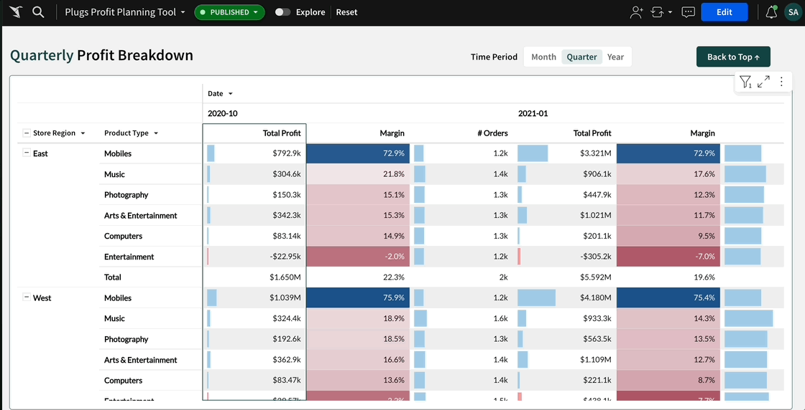

For more information, see [Format column location in a table.](https://help.sigmacomputing.com/docs/format-and-customize-a-table#format-column-location-in-a-table)


### Hide or show fixed pivot table headers (Beta)
You can now hide or show fixed row and column headers in pivot tables.

For more information, see [Hide or show fixed pivot table headers (Beta)](https://help.sigmacomputing.com/docs/working-with-pivot-tables#hide-or-show-fixed-pivot-table-headers-beta)


### Image backgrounds for containers
You can configure background images for containers from an upload, as well as static and dynamic image URLs.

For more information, see [Style a container](https://help.sigmacomputing.com/docs/use-containers-to-organize-workbook-layouts#style-a-container)


### Improved details in data source selection 
When browsing for a data source in Sigma, such as when choosing or changing the source for a data element, you can see the connection name, full path to the table, and any usage statistics for the table. For example:


### Keyboard shortcut for cell selection
When you select a single cell in a table, you can add adjacent cells to the selection using the keyboard shortcut `⌘+⇧+arrow` (Mac) or `ctrl+⇧+arrow` (Windows).


### Layout grid is hidden by default 
When editing workbooks and data models, grid lines are visible when moving elements and are otherwise hidden.

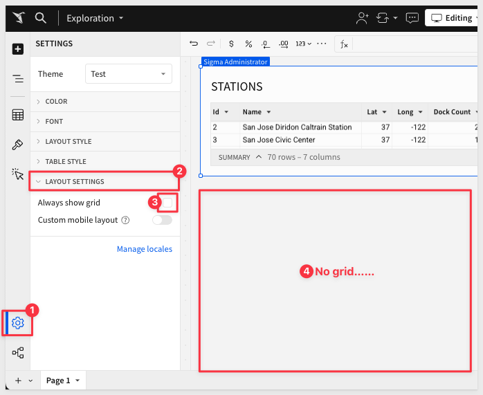

To show grid lines by default, you can modify the layout settings for a specific workbook. 

For more information, see [Layout settings in Workbook settings overview.](https://help.sigmacomputing.com/docs/workbook-settings-overview#layout-settings)


### Legacy workbook layout (Deprecated)
**The classic or legacy workbook layout is deprecated.**

On March 3, 2026, editing of workbooks with legacy (non-grid) layouts will be disabled and you must upgrade workbooks to grid layout.

On June 2, 2026, this functionality will reach end of support and workbooks will be automatically upgraded when the workbook is opened. 

For more information, see [upgrade workbooks to grid layout](https://help.sigmacomputing.com/docs/upgrade-workbooks-from-legacy-layouts-to-grid-layouts)


### Limit display values in a data element (Beta)
You can now limit the number of values displayed in a grouped table, pivot table, or chart, and group the remaining values in an "Others" category.

You can transform an existing column or using the [VisibilityLimit](https://help.sigmacomputing.com/docs/visibilitylimit) function with a sorted table.

Different from a Top N filter , limiting the display values lets you change which values are displayed without affecting the calculated totals and other values.

For example, to only show the top 3 performing stores in each store region in a pivot table, you can limit the displayed stores to the top 3 sorted by total products sold:

```code
VisibilityLimit([Store Name], 3)
```

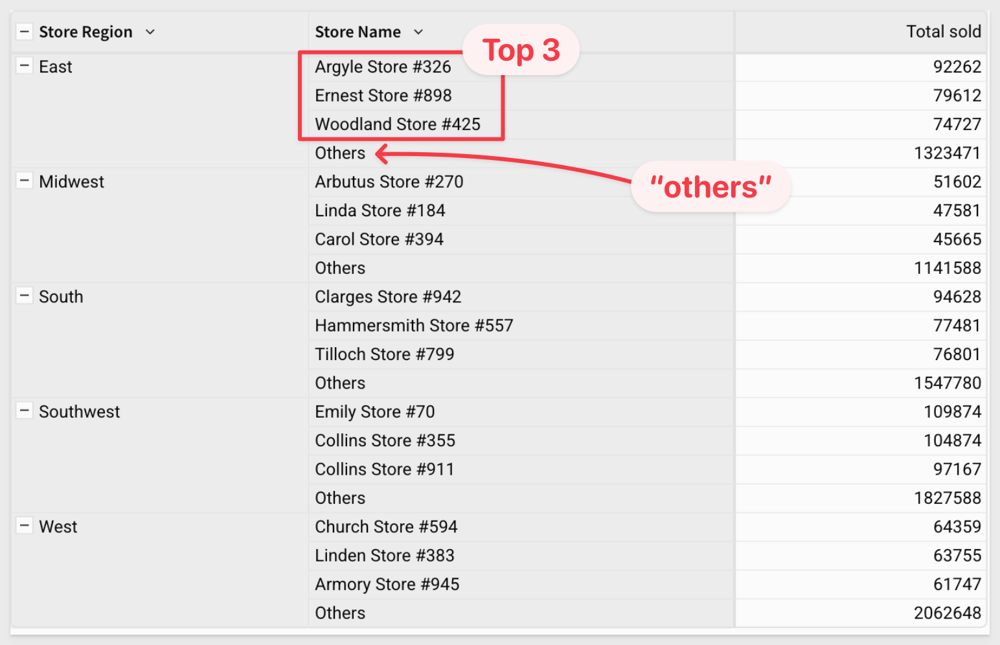

For more information, see [Limit displayed values in a data element](https://help.sigmacomputing.com/docs/limit-displayed-values-in-a-data-element)


### Limit display values in a data element (GA)
Limit the number of values displayed in a grouped table, pivot table, or chart, and group the remaining values in an "Others" category. You can transform an existing column or use the `VisibilityLimit` function with a sorted table.

For more information, see [Limit displayed values in a data element](https://help.sigmacomputing.com/docs/limit-displayed-values-in-a-data-element)


### Linked references in workbook template shares
Linked references to datasets are now included when you share a workbook template between organizations


### Minimum element size removed
Minimum element size is now **a suggestion for all elements.** 

When resizing, Sigma indicates when an element is below the recommended size, but allows you to resize it regardless. 

Elements below the recommended size might experience minor visual issues depending on the element, contents, and display.

***Why it matters:***<br>
Designers have more freedom to create compact dashboards and fine-tune layout density.


### More precise formatting of grand totals and subtotals
You can now format the grand totals and subtotals of a pivot table or grouped table separately from other values in the column. 

For example, format the grand total row of a pivot table to display numbers in SI units, while the values columns display whole numbers.

For more information, see [Format and customize a table](https://help.sigmacomputing.com/docs/format-and-customize-a-table#format-column-and-totals-data)


### Navigation element (Beta) 
You can use the navigation element to display a list of destinations users can visit. 

The navigation element shows each option is an individual button, which you can configure to send users to a workbook page, workbook element, or external link when clicked. 

Submenus allow you to nest additional navigation options under a top-level option. 

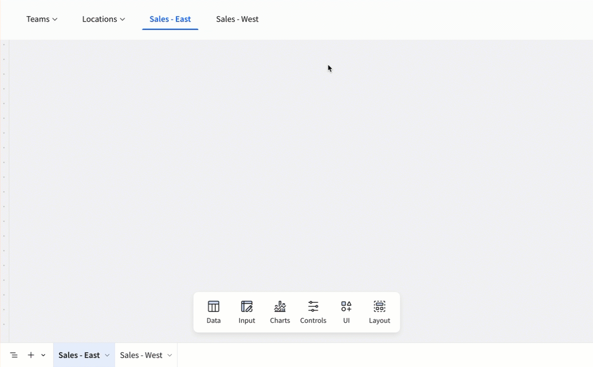

For more information, see [Use the navigation element to guide user exploration](https://help.sigmacomputing.com/docs/use-the-navigation-element-to-guide-user-exploration#/)


### Navigation element (GA)  
You can use the navigation element to display a list of destinations users can visit.

The navigation element shows each option as an individual button, which you can configure to send users to a workbook page, workbook element, or external link when clicked. Submenus allow you to nest additional navigation options under a top-level option. 


For more information, see [Use the navigation element to guide user exploration](https://help.sigmacomputing.com/docs/use-the-navigation-element-to-guide-user-exploration)


### New design for date and date range controls
`Date` and `Date range` controls have a new design that enables navigating the controls with your keyboard, improving accessibility and usability.


### New supported workbook locales
English (Canada), English (Ireland), Spanish (Mexico) and Chinese (Traditional) are now supported workbook locales. This includes language, date format, number format, and currency. You can preview a workbook in
en-ca, en-ie, es-mx, or zh-tw.

For more information, see [Manage workbook localization](https://help.sigmacomputing.com/docs/manage-workbook-localization)


### Number input control operators
You can now configure a `number input` control to filter the targeted data differently. Other filter operators besides the default of `=` (equal to) to show data that is `greater than or equal to (>=)` or `less than or equal to (<=)` the inputted number value. The new functionality is shown below:


For more information, see [Intro to control elements](https://help.sigmacomputing.com/docs/intro-to-control-elements)


### Option to unshare a shared view of a workbook
In the `Saved views` panel, you can quickly change a shared view to a personal view to remove visibility for other users with access to the workbook. Click `More` next to the name of a shared view, then select `Set as personal view` to make it only visible to you.

**Why it matters:**<br>
This update gives users finer control over workbook visibility, making it easy to convert shared content back to private when needed for draft or personal use.


### Optional version tag descriptions
When you create a version tag you are no longer required to enter a description for it.


### Organize columns into folders (Beta) 
When working with data elements in data models and workbooks you can organize columns into folders, letting you nest columns into relevant groups. 

Folders that you create in a data model or parent element are available to downstream elements, like a data element that uses a data model as a data source, or a child element.

For more information, see [Organize columns into folders](https://help.sigmacomputing.com/docs/organize-columns-into-folders)


### Organize columns into folders (GA) 
When working with data elements in data models and workbooks you can organize columns into folders, letting you nest columns into relevant groups. 

Folders that you create in a data model or parent element are available to downstream elements, like a data element that uses a data model as a data source, or a child element.

This is really useful there there are a large number of columns that make sense to logically group together and will make it easier on users too.

For more information, see [Organize columns into folders](https://help.sigmacomputing.com/docs/organize-columns-into-folders)


### Pivot table totals changes
The placement of pivot table totals has changed to be up one level in the table. For row totals, the change is only visible when displaying rows as separate columns. This change will be available gradually over the next week.


### Popovers (Beta) 
You can now use popovers to display information in containers anchored to specific elements. 

Popovers allow you to present relevant content (tables, charts, controls, etc.) only when needed, creating a more efficient and simplified workbook interface.


### Popovers (GA) 
You can now use popovers to display information in containers anchored to specific button elements. 

Popovers allow you to present relevant content (tables, charts, controls, etc.) only when needed, creating a more efficient and simplified workbook interface.

For example, use them to create a compact way to display multiple filters:


For more information, see [Use popovers to simplify a workbook interface](https://help.sigmacomputing.com/docs/use-popovers-to-simplify-a-workbook-interface)


### Redesigned user interface 
The workbook and data model UI has been redesigned to simplify the creation experience in Sigma. The redesign includes the following changes:

- **Streamlined workbook header:** We’ve combined essential actions—such as saving, commenting, and sharing—into one spot. No more clicking around to find what you need.

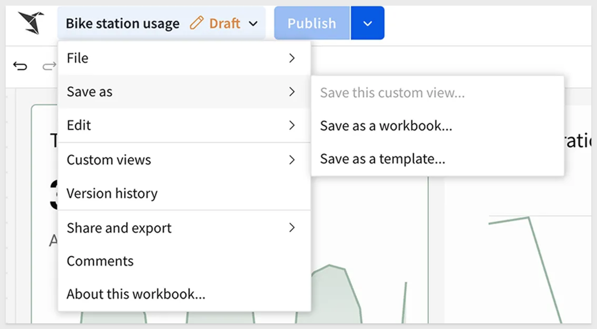

- **New ways to create and edit elements:**
        - An Add new element bar where you can add elements at any time.
        - A simplified editor panel with tabs to access element properties, format, and actions.
        - For an overview of the new workbook UI, see Navigating a workbook (link).

- **Simpler custom views:** Previously known as `Explore`, these views are now easier to create and customize. You can save them, share them, or discard changes and return to the original Workbook anytime.


- **Refined editor panel:** Properties, formatting options, and actions are now neatly organized into tabs, so you can make quick adjustments without feeling lost.

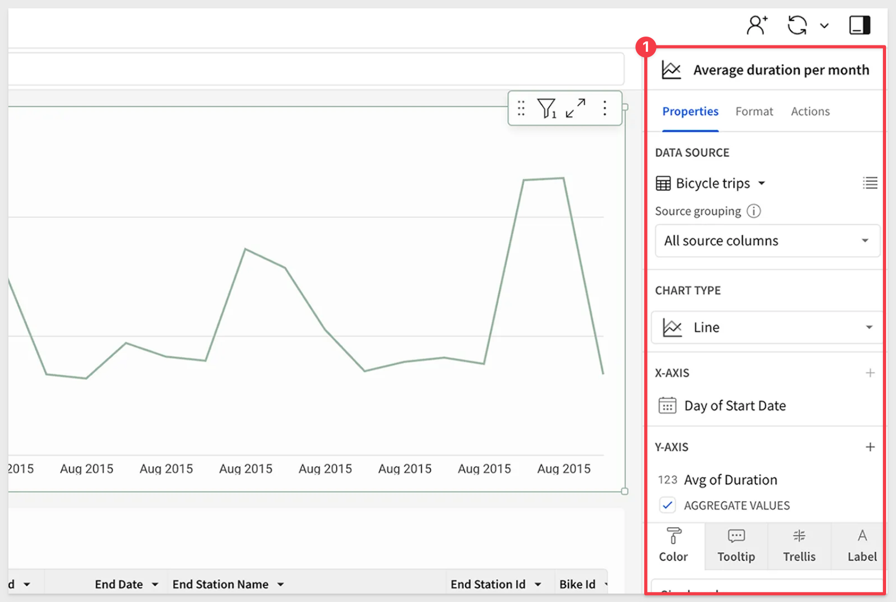

- **A new floating element bar:** Insert charts, tables, and other elements on the fly. It’s all about making sure inspiration doesn’t have to wait.


Sigma’s redesign sharpens the experience without sacrificing power. A cleaner UI, smarter workflows, and a more intuitive flow mean you can move faster, focus on what matters, and get to insights without distractions. Whether you’re deep into analysis or just getting started, Sigma stays flexible and responsive to your needs. This is just the start—we’ll keep pushing forward to make data exploration even more seamless, powerful, and accessible. 

The new UI has been rolled out for all **new** Sigma organizations, and will continue to be enabled in a multi-stage rollout for all existing organizations.

To learn more about the design ethos behind this change, see [Making Sigma Click: Introducing Our Refreshed Interface.](https://www.sigmacomputing.com/blog/making-sigma-click-introducing-our-refreshed-interface?_gl=1*616xf3*_gcl_au*MTAxNTE2MDYxOC4xNzMzNzY1NDI3*_ga*MjYwNTkzMzY0LjE2NzA0NDY3NTc.*_ga_PMMQG4DCHC*MTc0MTM2MTExMi4xMDYuMS4xNzQxMzYxMTY0LjguMC4w)


### Redesigned user interface for workbooks and data models
The workbook and data model UI has been redesigned to simplify the creation experience in Sigma. The redesign includes the following changes:

- **Streamlined workbook header:** We’ve combined essential actions—such as saving, commenting, and sharing—into one spot. No more clicking around to find what you need.


- **New ways to create and edit elements:**
        - An Add new element bar where you can add elements at any time.
        - A simplified editor panel with tabs to access element properties, format, and actions.
        - For an overview of the new workbook UI, see Navigating a workbook (link).

- **Simpler custom views:** Previously known as `Explore`, these views are now easier to create and customize. You can save them, share them, or discard changes and return to the original Workbook anytime.


- **Refined editor panel:** Properties, formatting options, and actions are now neatly organized into tabs, so you can make quick adjustments without feeling lost.


- **A new floating element bar:** Insert charts, tables, and other elements on the fly. It’s all about making sure inspiration doesn’t have to wait.


Sigma’s redesign sharpens the experience without sacrificing power. A cleaner UI, smarter workflows, and a more intuitive flow mean you can move faster, focus on what matters, and get to insights without distractions. Whether you’re deep into analysis or just getting started, Sigma stays flexible and responsive to your needs. This is just the start—we’ll keep pushing forward to make data exploration even more seamless, powerful, and accessible. 

The new UI has been rolled out for all **new** Sigma organizations, and will continue to be enabled in a multi-stage rollout for all existing organizations.

To learn more about the design ethos behind this change, see [Making Sigma Click: Introducing Our Refreshed Interface.](https://www.sigmacomputing.com/blog/making-sigma-click-introducing-our-refreshed-interface?_gl=1*616xf3*_gcl_au*MTAxNTE2MDYxOC4xNzMzNzY1NDI3*_ga*MjYwNTkzMzY0LjE2NzA0NDY3NTc.*_ga_PMMQG4DCHC*MTc0MTM2MTExMi4xMDYuMS4xNzQxMzYxMTY0LjguMC4w)


### Reference data elements in custom SQL statements (Beta)
You can now reference data elements and other custom SQL elements in SQL statements in Sigma using the sigma_element('Element Title') syntax.

For example:
```code
SELECT * FROM sigma_element('Fiscal Year Forecast')
WHERE "Revenue" > 100000
```

For more information, see [Write custom SQL](https://help.sigmacomputing.com/docs/write-custom-sql#reference-existing-sigma-workbook-elements)


### Reference data elements in custom SQL statements (GA)
You can reference data elements and other custom SQL elements in SQL statements in Sigma using the `sigma_element` syntax. Creating a warehouse view from a table created using custom SQL that uses this syntax is also now supported.

For more information, see [Write custom SQL](https://help.sigmacomputing.com/docs/write-custom-sql)


### Reference multi-select control values in custom SQL
You can now reference the selected values of a multi-select list values control in custom SQL queries. 

The selected values can be used to filter results in subqueries and CTEs, combined with formulas like ArrayLength, and more. 

For more information, see [Reference multiple values from a multi-select list in SQL](https://help.sigmacomputing.com/docs/reference-workbook-control-values-in-sql-statements#reference-multiple-values-from-a-multi-select-list-in-sql)


### Refined header on the Sigma home page
The home page header has been redesigned to match the recently updated workbook and data model UI. 

The change is ***aesthetic and does not impact any functionality.*** 

The new updated homepage header has rolled out for some organizations, and will continue to be incrementally rolled out over the coming weeks.


### Run Python code (Beta)
Add a Python element to any workbook or data model to write and run Python code. 

Support for Python code is now available for organizations with a connection to Snowflake. 

For more information, see [Set up a Snowflake connection for Python (Beta)](https://help.sigmacomputing.com/docs/set-up-a-snowflake-connection-for-python)

You can write Python code that performs complex tasks like data transformation, data analysis, forecasting, prediction, or retrieve and send data to third-party API endpoints. When writing Python in Sigma, you can also:

- Reference data elements like tables, pivot tables, and input tables as DataFrames.
- Incorporate user input into your code by referencing control values.
- Build tables and charts with the output from your Python code.
- Use autocomplete to reference data sources available in your connection.
- Import libraries, including custom libraries, configured when you set up the connection.
- Run Python code directly on the Python element, or trigger the code to run from an action. Workbooks with a Python element can be exported and embedded. 

***Why it matters:***<br>
This brings advanced analytics, forecasting, and custom computations directly into Sigma without moving data or relying on external services.

For more information, see [Write and run Python code in Sigma](https://help.sigmacomputing.com/docs/write-and-run-python-code)


### Run Python code in a workbook (Beta) 
For organizations with a connection to Databricks, you can now add a Python element to any workbook to write and run Python code directly in Sigma. 

This is awesome for complex tasks like data transformation, data analysis, forecasting, prediction, or retrieve and send data to third-party API endpoints. 

When writing Python in Sigma, you can also:
- Reference data elements like tables, pivot tables, and input tables as DataFrames.
- Incorporate user input into your code by referencing control values.
- Build tables and charts with the output from your Python code.
- Use autocomplete to reference data sources available in your connection.
- Import libraries, including custom libraries, available in your Databricks instance.
- Run Python code directly on the Python element, or trigger the code to run from an action. Workbooks with a Python element can be exported and embedded. 

This is SUPER POWERFUL!

For more information, see [Write and run Python code in Sigma](https://help.sigmacomputing.com/docs/write-and-run-python-code)


### Schedule exports as an email burst (GA) 
You can send a custom-filtered report to a dynamic list of recipients as a scheduled email burst. 

Send a workbook, workbook pages, and individual workbook elements as supported attachment types, such as PDF, Excel, or PNG files.

For more information, see [Export as email burst.](https://help.sigmacomputing.com/docs/export-as-email-burst)

There is also [QuickStart on email bursting.](https://quickstarts.sigmacomputing.com/guide/administration_export_bursting/index.html?index=..%2F..index#0)


### Search for documents shared with you by link
Documents that you have previously accessed through a shared link are now returned in search results.


### Select all search results in list and hierarchy filters and controls
When using search in a list or hierarchy filters and controls, you can now select all values from the search results.


### Set conditional exports to alert a specific number of times (Beta)
Limit the number of conditional exports by setting the frequency of an export to send only a given number of times per day, per week, or all time.

For example, a conditional export that sends an email when there is data in a table can be set to alert once per day.


### Shared view limitations
Each workbook is now limited to `10 shared views.` If a workbook has version tags, the limit applies per tagged version. 

There is no limit on the number of personal saved views (previously known as personal bookmarks) per workbook.

Organizations with more than existing 10 saved views will be able to keep their existing views, but not be able to make more.


### Show or hide all totals in a grouped table
You can now show or hide totals for all levels of a grouped table. 

Simply right-click a table cell to open the `context menu` and select S`how all totals` or `Hide all totals` to show or hide totals for all grouping levels of the table.

For more information, see [Show totals in a grouped table for more details.](https://help.sigmacomputing.com/docs/create-and-manage-tables#show-totals-in-a-grouped-table)


### Stretch to fit sizing option for image elements
You can now select a `Stretch to fit` sizing option for image elements. When selected, images stretch to match the dimensions of the image element on the workbook page.

For more information, see [Image elements](https://help.sigmacomputing.com/docs/image-elements)


### Tabbed containers (Beta) 
Sigma already supported workbook pages that traditional spreadsheet users were familiar with.

Tabbed containers bring that functionality ***inside*** the workbook itself and are a fundamental design element used in data apps.

Add a tabbed container to your workbook pages when you want to offer multiple sets of content in the same section of your workbook canvas. 

A tabbed container has multiple tabs at the top of the container, which can either be visible or hidden for end users. 

By placing content on different tabs and configuring logic about which tab should display, you can allow users to experience different views in the same space without scrolling or navigating elsewhere.

For example:


### Tabbed containers (GA) 
Sigma now supports tabbed container elements. 

Add a tabbed container to your workbook pages when you want to offer multiple sets of content in the same section of your workbook canvas. A tabbed container has multiple tabs at the top of the container, which can either be visible or hidden for end users. 

By placing content on different tabs and configuring logic about which tab should display, you can allow users to experience different views in the same space without scrolling or navigating elsewhere. 


For more information, see [Use tabbed containers to organize workbook content](https://help.sigmacomputing.com/docs/use-tabbed-containers-to-organize-workbook-content)


### Three digit zip codes on region maps
Three digit US zip codes are now supported when creating map visualizations. This allows for less granular visualizations in maps to be created.

For more information, see [Maps](https://help.sigmacomputing.com/docs/maps#/map---region)


### Transpose a table (Beta) 
Sigma now supports transposing a table from rows to columns, or columns to rows. 

Transposing data can be useful for data analysis, as it allows you to pivot or un-pivot your data according to your individual use case.

This can be especially useful for visualizations, as you may want to reshape your data to suit specific chart types –such as needing date values oriented in a single column for line charts.

For more information, see [Transpose a table](https://help.sigmacomputing.com/docs/transpose-a-table)


### Transpose a table (GA)
The ability to transpose a table from rows to columns and columns to rows is now generally available. This feature allows you to pivot or unpivot data according to your use case and is really easy to use.

For more information, see [Transpose a table](https://help.sigmacomputing.com/docs/transpose-a-table)


### Updated default export notification names
When scheduling exports, the default naming now follows this format:

- When exporting an entire workbook:<br>
[Destination] [Format Type]

- When exporting a specific page or element in a workbook:<br>
[Attachment Name] [Destination] [Format Type]


### Updated scheduled export limitation
Previously, scheduled exports would be automatically suspended if there were 5 consecutive failures within 5 calendar days, or if there were 10 consecutive export failures. 

Now, they will only be suspended if there are 10 consecutive export failures.


### Updated UI for unavailable export options
When configuring additional options for exports, options in the export modal that are not applicable based on your export configurations will now be greyed out.

For more information, see [Configure additional options for exports](https://help.sigmacomputing.com/docs/configure-additional-options-for-exports)


### Updated workbook URL format
In workbook URLs, the `:explore` and `:bookmark` parameters have been renamed to `:customView` and `:savedView` respectively. 

This update aligns the UI redesign that introduced custom views and saved views in place of explore capabilities and bookmarks.

URLs for existing workbooks have been automatically reformatted, and navigating to a previous URL that uses `:explore` or `:bookmark` parameters will redirect to a current URL that uses `:customView `and `:savedView`. **This change does not apply to embed events or public APIs.**


### Version tagging for warehouse views (Beta)
You can create warehouse views from a tagged version of a workbook or data model. 

By creating a warehouse view from a tagged version, you can maintain a stable query for a virtual table in your warehouse, regardless of changes made to the published version. 

***Why it matters:***<br>
Tagged views ensure stable, reproducible queries even when your published version evolves — essential for downstream reporting.

For more information, see [Use warehouse views with version tagging](https://help.sigmacomputing.com/docs/use-warehouse-views-with-version-tagging)


### Vertical alignment options for controls
All control types (except the legend control) now have vertical alignment options, allowing you to change the position of the control within the element boundaries to the top, center, or bottom.

***Why it matters:***<br>
Improves dashboard layout precision and helps better align controls within complex designs.


### View column descriptions in pivot tables
If your pivot table contains columns with descriptions set, you can now hover over the column header to view the column description.


### Warehouse view support for transposed tables
You can now create a warehouse view for a transposed table.

To transpose a table, see [Transpose a table](https://help.sigmacomputing.com/docs/transpose-a-table) 

To create a warehouse view, see [Create and manage warehouse views](https://help.sigmacomputing.com/docs/create-and-manage-workbook-warehouse-views)


### Workbook descriptions 
You can now add descriptions to a workbook. Describe what the workbook is for, how it can be used, and other useful information. Workbook descriptions can be viewed by anyone with access to view the workbook.

**To add a description:**<br>
- Select the workbook name to open the document menu, then select `About this workbook.`
- In the text box below the workbook name, type a description. The description saves automatically.


### Worksheets and dashboards (Deprecated)
Worksheets and dashboards are now deprecated (dataset worksheets continue to be supported).

**To ensure continued access to your content, convert worksheets and dashboards to workbooks.**

On March 3, 2026, editing of worksheets and dashboards will be disabled. 

On June 2, 2026 this functionality will reach end of support and existing worksheets and dashboards will no longer be available. 

For more information, see [convert worksheets and dashboards to workbooks](https://help.sigmacomputing.com/docs/convert-worksheets-and-dashboards-to-workbooks)


<!-- END OF SECTION-->

## Additional Information
Duration: 20

**Additional Resource Links**

[Blog](https://www.sigmacomputing.com/blog/)<br>
[Community](https://community.sigmacomputing.com/)<br>
[Help Center](https://help.sigmacomputing.com/hc/en-us)<br>
[QuickStarts](https://quickstarts.sigmacomputing.com/)<br>
<br>

[](https://twitter.com/sigmacomputing)&emsp;
[](https://www.linkedin.com/company/sigmacomputing)&emsp;
[](https://www.facebook.com/sigmacomputing)


<!-- END OF SECTION-->
