author: pballai
id: fundamentals_10_data_modeling
summary: fundamentals_10_data_modeling
categories: Fundamentals
status: Published
feedback link: https://github.com/sigmacomputing/sigmaquickstarts/issues
tags: default
lastUpdated: 2024-10-24

# Fundamentals 10: Data Modeling

## Overview 
Duration: 5 

Many Sigma users are used to creating a new workbook and then using warehouse tables as the data source for their content. This often requires the user to do extra data preparation work, like joining tables together, renaming fields or creating aggregations. This modeling logic is bound to a single workbook and is not reusable across your Sigma deployment. This can lead to duplicated effort and inconsistent reporting.

With Data Models, you can define your data transformation and semantics in one place, and use them anywhere in Sigma. This avoids duplicating effort, and provides a single source of truth for your Analytics Engineering team to collaborate on key business logic and metric definitions.

In this QuickStart, you'll learn how to:

- Understand Sigma's data modeling philosophy and features
- Create a data model using sample data
- Define relationships across tables
- Add custom columns and formulas
- Create metrics
- Use column-level security
- Use column folders
- Materialize a data model
- Deploy reusable models for analysis

### Our Modeling Approach
A primary design goal for Sigma data modeling is to make model creation seamless so your data team can move fast, without managing additional complex code, and deliver governed analytics to stakeholders.

Business users can focus on gaining insights from data without needing to worry about its physical structure, and can also contribute directly to the data model through Sigma’s UI. Sigma models are collaborative and versioned—ideal for both data teams and business users.

<aside class="positive">
<strong>IMPORTANT:</strong><br> Some screens in Sigma may appear slightly different from those shown in QuickStarts. This is because Sigma is continuously adding and enhancing functionality. Rest assured, Sigma’s intuitive interface ensures that any differences will not prevent you from successfully completing any QuickStart.
</aside>

For more information on Sigma's product release strategy, see [Sigma product releases](https://help.sigmacomputing.com/docs/sigma-product-releases)

If something is not working as you expect, here is how to [contact Sigma support](https://help.sigmacomputing.com/docs/sigma-support)

### Target Audience
This QuickStart is intended for data analysts, analytics engineers, and data-savvy business users who are responsible for modeling, curating, or transforming data within Sigma. It is especially useful for those who:

- Want to create reusable, governed datasets for analysis.
- Need to join and enrich warehouse tables visually without writing SQL.
- Are tasked with delivering consistent metrics to business stakeholders.

### Prerequisites

<ul>
  <li>A computer with a current browser. It does not matter which browser you want to use.</li>
  <li>Access to your Sigma environment.</li>
  <li>Some familiarity with Sigma is assumed. Not all steps will be shown, as the basics are assumed to be understood.</li>
 </ul>

<aside class="positive">
<strong>IMPORTANT:</strong><br> Sigma recommends using non-production resources when completing QuickStarts.
</aside>

<button>[Sigma Free Trial](https://www.sigmacomputing.com/free-trial/)</button>

<aside class="negative">
<strong>IMPORTANT:</strong><br> Some features may still carry the "Beta" tag in production Sigma instances. Beta features are subject to quick, iterative changes. As a result, the latest product version may differ from the contents of this document.
</aside>
 


## Create a Data Model
Duration: 5

### Use case
For this demonstration, let’s assume we are a data analyst at a retailer called Plugs Electronics. Marketing wants to do some ad-hoc analysis against sales transactions and wants to work from trusted data without making mistakes. 

Corporate policy dictates that marketing should not have access to actual customer names and addresses but city/state information is fine. 

The CFO wants to make sure that any calculations that are performed meet the published standard.

Since marketing’s requirements are not fully defined, we’ll provide access to product and store tables so they can be added to their analysis if needed. 

### Set up the data model
Let's use Sigma's data modeling tools to create a reusable model to serve as the foundation for a workbook.

To create or manage a data model, the following is required:

- Users must be assigned an account type with the Create, Edit, and Publish datasets permissions enabled.

- Users must be the data model owner or be granted Can edit access to the data model.

By default, Sigma account types provide the following data modeling permissions:

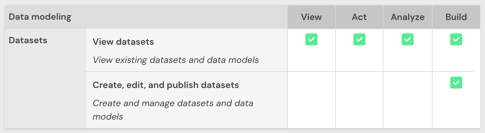

Access to individual datasets, data models, and workbooks are determined by [folder and document permissions](https://help.sigmacomputing.com/docs/folder-and-document-permissions)

From the Sigma homepage, click `Create new` > `Datamodel`:


The data modeling page looks and behaves a lot like a standard Sigma workbook by design.

The more we work with Sigma, the more metadata becomes available, which helps drive Sigma’s suggestions

For example, it’s suggesting that `PLUGS_ELECTRONICS_HANDS_ON_LAB_DATA` is popular:


There are five tables that can provide the requested information for marketing. These are provided to all Sigma customers in the `Sigma Sample Database` > `PLUGS_ELECTRONICS` schema:


### Base table
To satisfy marketing's main request, we are going to create a "base table" by joining three tables together, culling the column list manually and creating a calculated column.

Much of the data model interface follows the familiar Sigma workflow to make things as easy as possible. 

From the `Element bar`, select `Data` and drag a `Table` element onto the page:


Click `Select

We could navigate to the table but it is easier to just search for `F_SALES` and select the table from the `RETAIL` schema:


The table is added to the page and we can work with it just as we would in a Sigma workbook. 

Rename the table to `Plugs Sales`.

Hide the four columns as shown below:


Notice that in the `Source columns` list the four columns are still selected:

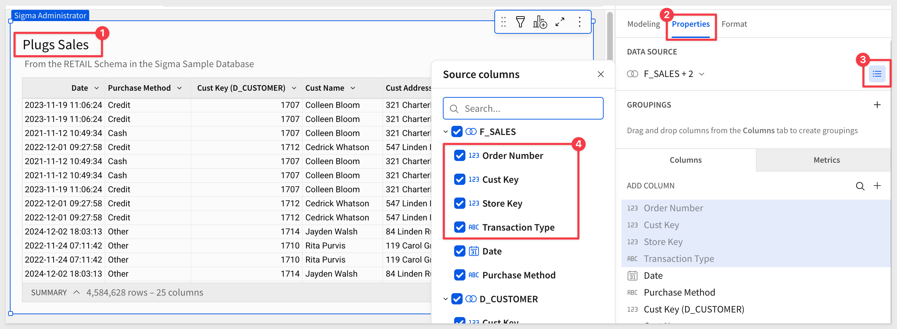

What this means is that downstream (i.e., when the data model is used in a workbook) the four hidden columns do not appear initially, but are available for the user to un-hide:

For example, if we used the data model we have so far in a workbook, we can see the columns are still available, though not selected by default:


<aside class="positive">
<strong>IMPORTANT:</strong><br> Hiding columns does not prevent downstream workbook builders from accessing them.
</aside>

Use the `Undo` icon to unhide these columns:


Save the data model as `Data Model QuickStart`. 


<!-- END OF SECTION-->

## Join More Tables
Duration: 5

Since we know that marketing will always need columns from the `D_CUSTOMER` and `F_POINT_OF_SALE` tables, we can join them directly. 

Using joins, we’ll connect these two tables. Combined with the base table, this satisfies marketing’s initial request.

From `Plugs Sales`, select `Element source` > `Join` from the table menu:


Search for `D_CUSTOMER` and select the one from the `RETAIL` schema.

Accept all columns and set the `Join keys` to `Cust Key`. There are 105 customers who have never made a purchase:


Click the `+` icon to add another table to the join, this time selecting the `F_POINT_OF_SALE` table and joining on `Order Number`:


Click `Preview output`.

Sigma shows us the lineage of the joins and gives us an opportunity to deselect columns as needed:


<aside class="negative">
<strong>NOTE:</strong><br> Deselecting a column while in the lineage view does not prevent the column from being reselected in the data model later. If the column is not needed at all, delete the column prior to publishing the data model.
</aside>

Since this is our "base table" it is a good idea to delete columns that users will never need. For example, columns with duplicate information or key columns that won’t be used to create relationships later.

For example, we can delete `Cust Key` and `Cust Key (D_Customer)` but we need to keep `Store Key` and `Product Key`, as we’ll use those to create a relationship later. For now, we can just hide the last two columns:


### Calculated columns
Since our base table does not have columns for `Revenue` or `Profit`, we can add them easily:


Add a new column ,and rename it to `Revenue`. Set the formula to:
```code
[Sales Amount] * [Sales Quantity]
```

Add another column, and rename it to `Profit`, and set the formula to:
```code
[Revenue] - ([Cost Amount] * [Sales Quantity])
```

The results look like this:


Click `Publish`.


<!-- END OF SECTION-->

## Relationships
Duration: 5

Data models serve as a starting point for builders in Sigma to explore data. Relationships power this experience and make it easy for the builder to quickly get what they need through predefined modeling logic, rather than working directly with raw warehouse content such as tables or views.

Once built, the data model might look like this, allowing the builder to get moving much more quickly than starting a workbook from scratch. 


### Creating the relationships
We could just join the other tables to `Plugs Sales` using the join workflow. 

While this will still work, we’d miss out on one of the key benefits of using relationships—join pruning.

Join pruning offers several benefits:

- If a downstream query doesn’t use any fields from a joined table, that join can be skipped entirely during execution.

- It can reduce query cost, complexity, and runtime.

By keeping `Plugs Sales` as the base dataset and using relationships for tables less often used, we gain:

- Clear lineage: we always know the grain and logic origin.

- Separation of concerns: `F_SALES` remains a clean fact table, reusable elsewhere.

- Simpler troubleshooting: if a join breaks or inflates rows, it’s scoped to the child model.

- Cleaner published models: downstream users only see what they need.

### Add Product and Store tables
Before we can create a relationship, we need to add the two tables we want to expose to the builder.

Add the `D_PRODUCT` and `D_STORE` tables from the `RETAIL` schema directly to the workbook.

We want to prevent the tables from appearing in the published data model, so we can toggle `Visible as source` off for both tables:


With `Plugs Sales` selected, click the `+` to create a new relationship:


Configure the first relationship for `D_PRODUCT` as:


Repeat the process to add `D_STORE` as another relationship:


We now have two relationships, which can be edited by clicking on the pencil icon:

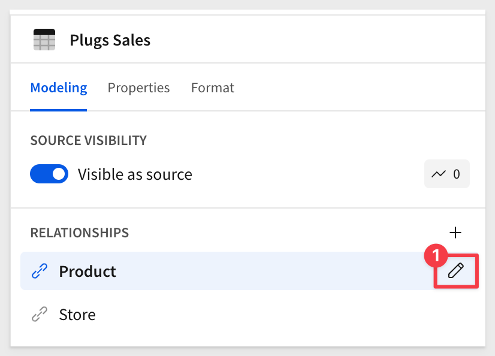

We can access the ERD as shown:

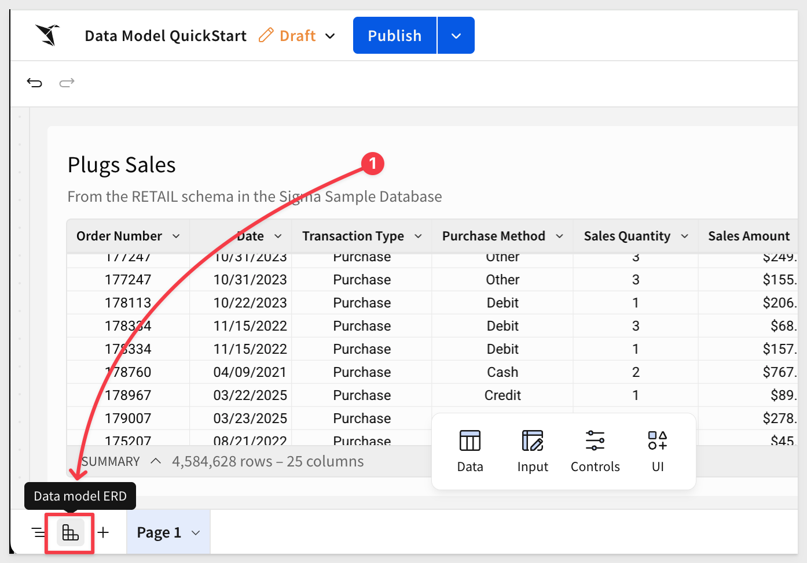

Using the ERD, we can create more relationships, metrics, apply column security and materialization too. 

For more information on the ERD, see [Define relationships in data models](https://help.sigmacomputing.com/docs/define-relationships-in-data-models)

Click the ERD icon again to return to the data model.

If we look at the data model [lineage](https://help.sigmacomputing.com/docs/workbook-data-lineage), we see the two additional tables listed, but not part of any join:

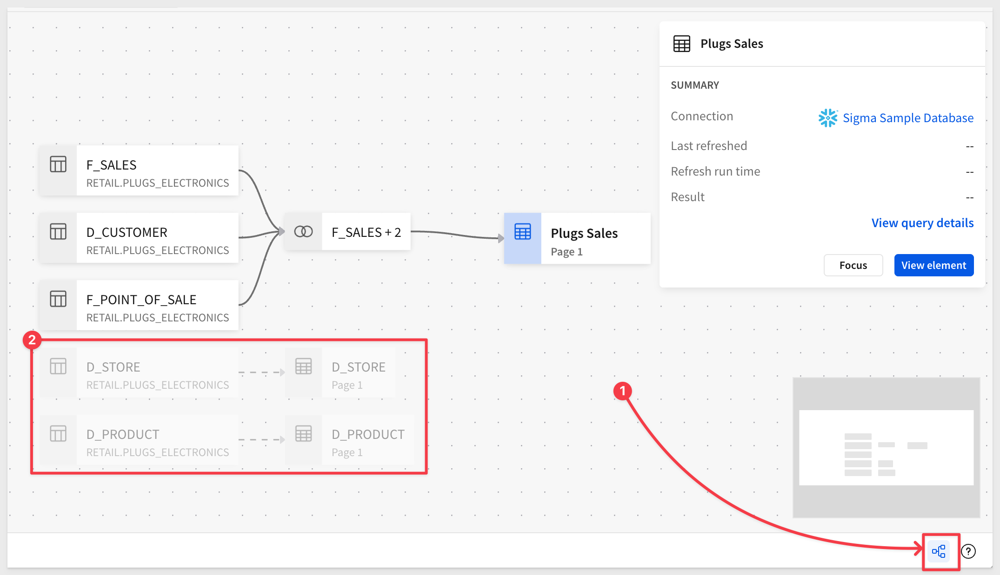

Exit lineage and click `Publish`.


<!-- END OF SECTION-->

## Join Pruning
Duration: 5

Now that we have a published data model, we can test to make sure join pruning is actually happening.

<aside class="negative">
<strong>NOTE:</strong><br> For this test, it may be helpful to just make a duplicate browser tab so the data model remains open too. This is just for demonstration purposes, using the same Sigma user.
</aside>

We duplicated the browser tab and then clicked the  icon to return home.

Create a new workbook and add a new table to it.

Select the `Data Model QuickStart` from the `Suggested` list, and then select the `Plugs Sales` table. 

If it is not on your list, use `Table and Datasets` to navigate to where it's saved:


Here are a few things to note:

- 1: The manual joins we made to create `Plugs Sales` are not visible to the user, but we are able to quickly return to the data model:


At this point, the data model page looks like this, but we’re not done building yet, so we’ll cover that more later.

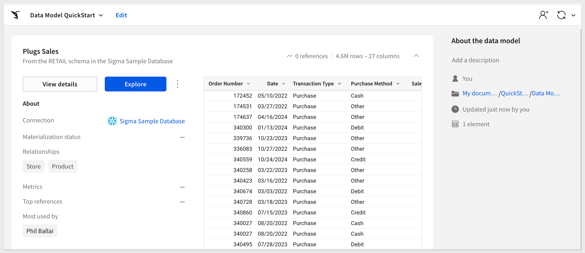

- 2: The two "extra" tables are present in the source column list, but no columns are selected from either table:

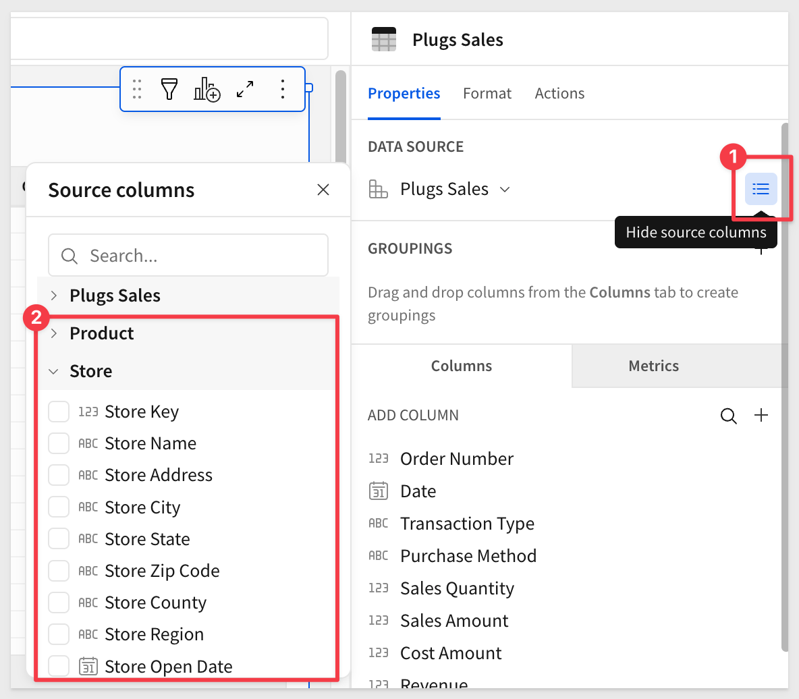

- 3: The `Cust Name` and `Cust Address` columns are present in our table. This is against the use case policy described earlier and we’ll need to fix that. Hiding the columns is not sufficient and we will correct this shortly:


### Query history
Sigma automatically generates SQL to retrieve data from the warehouse. We can access that by clicking on the `Query History` icon as shown:

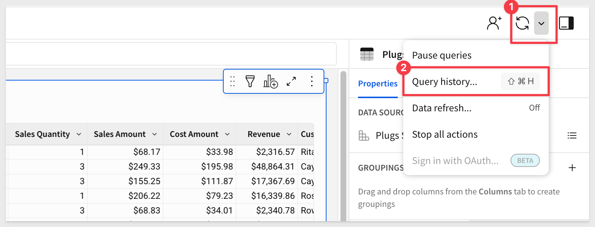

In our case, the page was just loaded so there are only two entries on the list. The second one is the table data being fetched from the warehouse cache. It came from the cache because we had accessed it recently, so it was still stored.

Our 4.5-million-record table loaded in just 1.5 seconds!

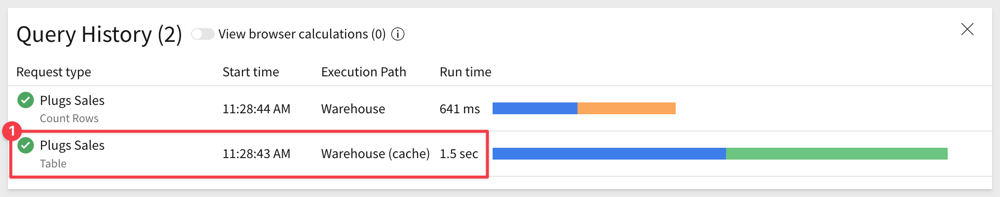

To read more about how Sigma optimizes data operations, see [Sigma's Query Engine](https://quickstarts.sigmacomputing.com/guide/developers_sigma_calculations/index.html?index=..%2F..index#0)

If we click into the table request, we can scroll down in the SQL code to see that only the three tables that were manually joined are present. The other two tables (D_STORE and D_PRODUCT) are not present (i.e., pruned).


Close query history and reselect the `Plugs Sales` table.

Now select any column from the `Product` table:


Reopen query history and click into the new entry:

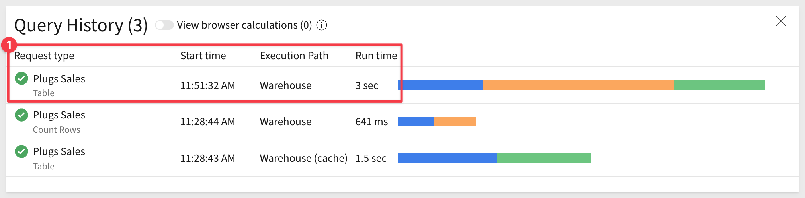

Now we see the `D_PRODUCT` table is being joined but the `D_STORE` table is still not present:


<aside class="positive">
<strong>IMPORTANT:</strong><br> Be thoughtful when deciding which tables to include as relationships instead of using a standard join to the base table. Consider four key factors: need, performance, security, and cost.
</aside>


<!-- END OF SECTION-->

## Metrics
Duration: 5

Metrics are dynamic, reusable calculations tied to a specific data source. As such, metrics usually reference specific columns. You can create a metric to provide reliable and efficient aggregate calculations, abstracting complex formulas away from business users.

When metrics are added at the data model level, they can be easily added on demand, in downstream workbooks. This ensures consistent logic across tables, visualizations, and pivot tables.

Return to the data model.

Click the `Plugs Sales` table.

For example, if we want to add a metric for `Total Revenue`, we click the `+` for `METRICS` in the `Modeling` section of the data model.

Configure the new metric as shown, using this formula:

```code
Sum([Revenue])
```

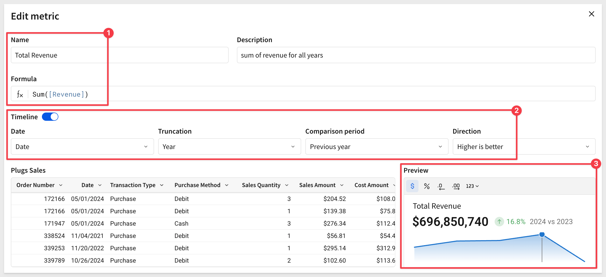

`Save` the new metric and click `Publish`.

The `Timeline` option enables a KPI-style chart in the `Preview` section of the data model landing page.

If we `Go to the published version` of the data model...:


...we see the new metric:

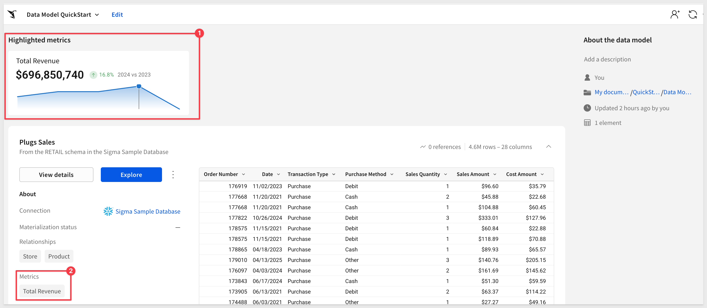

Click `Edit` to return to editing the data model.

### Metrics with a formula-based filter
Formulas in Sigma are flexible and powerful. For example, we can use a formula in a metric that will return data for the `East` region only.

Click `Edit` on the data model and select the `Plugs Sales` table.

Add another metric to the data model and configure it using this formula:
```code
SumIf([Revenue], [Cust Region] = "East")
```


Click `Publish`.

The new metric is added to the data model landing page:

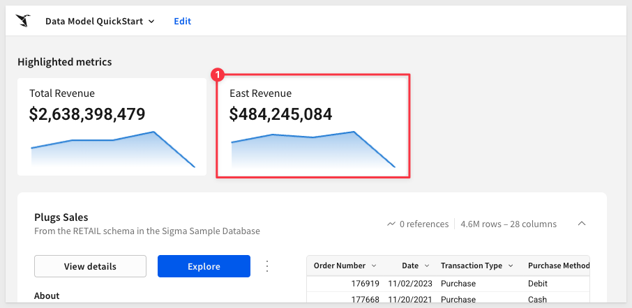

Note that we can click on the new metric (on the landing page) and it presents the option to `Explore in workbook`:

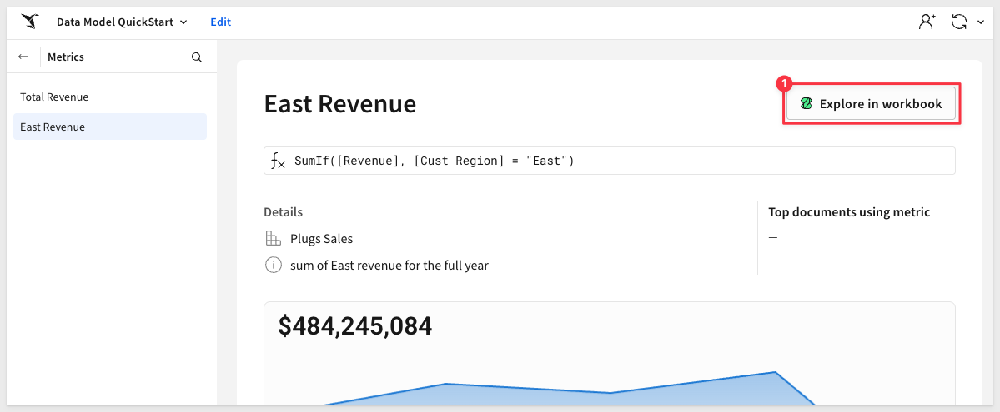

Once open, we can drill down to the row level detail with the `East` region being the only data available:

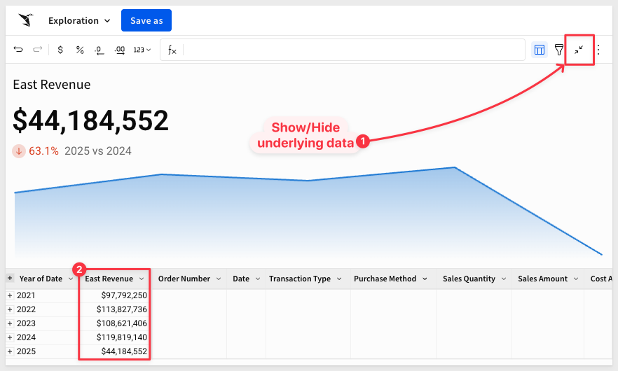

### Using the metric
Return to the data model landing page. 

One way to do that quickly is:


Builders only need to click the explore button to open a new workbook using the full data model:


We can now group by `Cust Region` and use the `Total Revenue` metric that is supplied for us as a `CALCULATION`:


The user does not see the underlying calculation, but knows that since it is a metric, they can trust it as the approved calculation.

### Metric best practices:

**Define Metrics in Your Data Models:**<br>
Establish Metrics within Data Models to ensure uniform calculations across all analyses.​ When Metrics are created in Data Models (rather than on warehouse tables), users gain significantly more functionality, including a display of metrics at the top of a Data Model, and a centralized browsing UX.

**Apply Time Series to Metric Displays:**<br>
When creating a Metric, you have the ability to specify a time series field to display the Metric value over time in all Metric previews. This provides users with more context around the KPI. You can also choose to compare metric values to previous periods if desired.

**Use Descriptive Naming Conventions:**<br>
Name Metrics intuitively and provide clear descriptions to aid user understanding and adoption.​

**Use Aggregations in Metrics:**<br>
Metrics are meant to serve as aggregations over dimensional columns. They’ll always calculate at the correct level of aggregation, no matter how many groupings you use. Be sure to use aggregations in your Metric Formulas


<!-- END OF SECTION-->

## Column Level Security (CLS)
Duration: 5

Column-Level Security (CLS) in Sigma allows builders to restrict access to specific columns within a data model, ensuring sensitive information is accessible only to authorized users.

Configuring CLS in data models enforces consistent security policies across all downstream analyses and workbooks. 

When CLS rules are updated in a data model, they automatically propagate to all downstream references.

With the data model in `Edit` mode, we can select the `+` for column security:

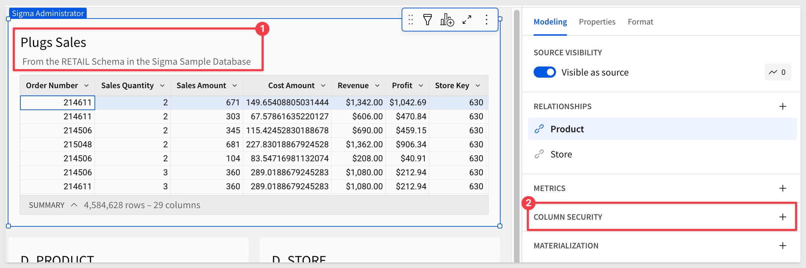

Select the two columns we want to secure, and the method we want to use:

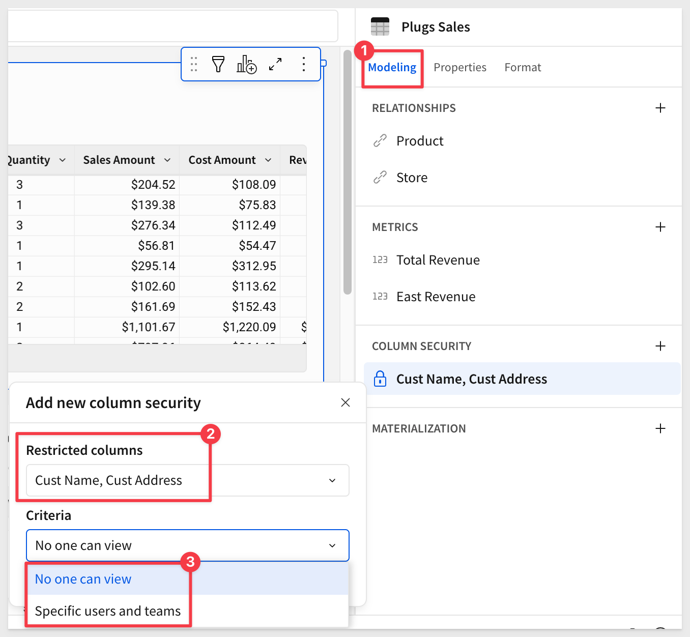

When set to `No one can view`, the columns will not appear—even if the data model is accidentally shared with a non-builder.

Click `Publish`.

If we view the data model in the `Publised version` and `Explore` it, we see that the restricted columns do not appear in the column list and are not available via `Source columns`:

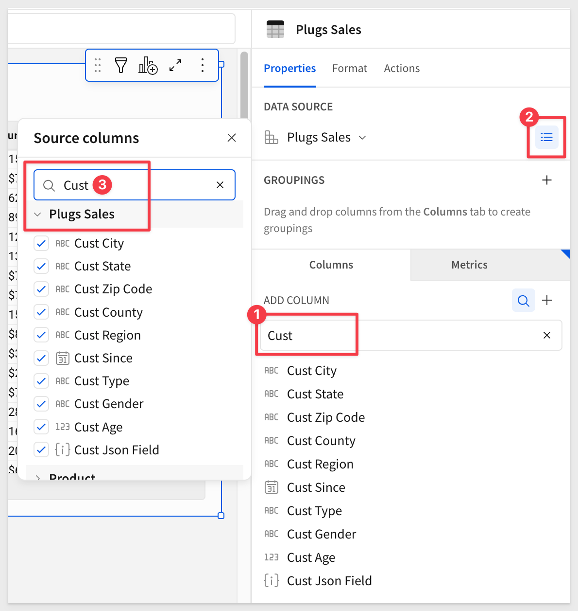

### CLS best practices

**Apply CLS at the Parent Level:**<br> 
Column-Level Security policies are inherited from parent to child elements. Therefore, to ensure that any given column is secured on all downstream elements, it's best to apply CLS at the root or original parent element.

**Utilize Teams for CLS:**<br>
Instead of assigning CLS on a per-user basis, it’s quicker and more scalable to apply CLS rules on a team basis. New team members automatically inherit CLS policies.

**Regularly Review Permissions:**<br> 
Regularly audit and update CLS settings to stay aligned with organizational changes and compliance requirements.


<!-- END OF SECTION-->

## Materialization
Duration: 5

Sigma data models support built-in materialization.

Data models that use expensive or long-running queries, such as a complex join between data elements, or data with high cardinality, multiple grouping levels, and calculated columns, setting up materialization can enhance query performance and can help reduce compute costs.

In the data model, click the `+` icon next to `MATERIALIZATION` to create a new job:

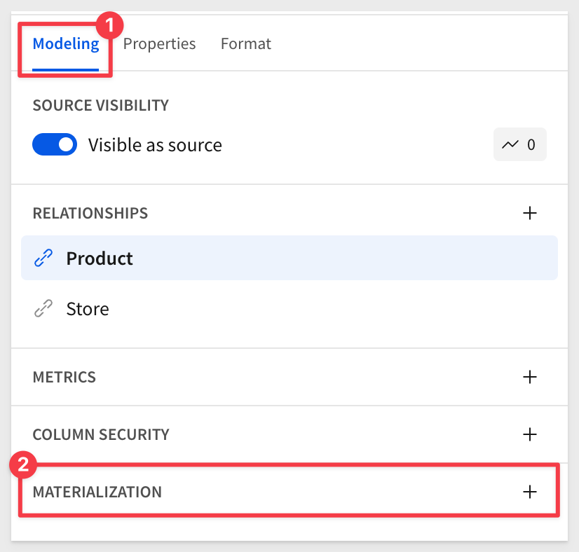

Sigma provides a simple form that enables builders to avoid the complexity of setting up materialization in the warehouse directly. 

Simply select the table(s) to include and set a schedule:


For more information, see [About materialization](https://help.sigmacomputing.com/docs/materialization)

There is also a QuickStart; [Materialization with Sigma](https://quickstarts.sigmacomputing.com/guide/administration_materialization/index.html?index=..%2F..index#0)


<!-- END OF SECTION-->

## Organizing Columns
Duration: 5

Some customers work with very wide tables containing dozens of columns, which can be a hassle for builders who would otherwise need to scroll through the column list or use search to locate a specific field.

Sigma simplifies this by allowing columns to be grouped into logically named folders.

For example, in the `Plugs Sales` table, we may want to group all customer-related columns into a folder called `Customer Details`:


It’s impressive how such a small feature can improve the user experience. At Sigma, we call these “quality-of-life improvements” and we are adding more all the time:


<aside class="negative">
<strong>NOTE:</strong><br> Folders are automatically propagated to any workbooks using the data model.
</aside>


<!-- END OF SECTION-->

## What we've covered
Duration: 5

In this QuickStart, we explored how to build a Sigma data model, join and organize tables, create calculated fields and metrics, apply column-level security, and improve usability through folders and materialization. With these tools, you're ready to deliver clean, consistent, and secure data to your users—all without writing SQL.

**Additional Resource Links**

[Blog](https://www.sigmacomputing.com/blog/)<br>
[Community](https://community.sigmacomputing.com/)<br>
[Help Center](https://help.sigmacomputing.com/hc/en-us)<br>
[QuickStarts](https://quickstarts.sigmacomputing.com/)<br>

Be sure to check out all the latest developments at [Sigma's First Friday Feature page!](https://quickstarts.sigmacomputing.com/firstfridayfeatures/)
<br>

[](https://twitter.com/sigmacomputing)&emsp;
[](https://www.linkedin.com/company/sigmacomputing)&emsp;
[](https://www.facebook.com/sigmacomputing)


<!-- END OF WHAT WE COVERED -->
<!-- END OF QUICKSTART -->
