author: pballai
summary: fundamentals_1_getting_around_v3
id: fundamentals_1_getting_around_v3
categories: fundamentals
status: Published
feedback link: https://github.com/sigmacomputing/sigmaquickstarts/issues
tags: default
authors: phil@sigmacomputing.com
lastUpdated: 2026-05-15

# Fundamentals 01: Overview
<!-- -->

## Overview
Duration: 6

This QuickStart is part of a series designed to help new Sigma users get oriented and start working with the platform.

The Fundamentals series covers a broad range of topics at an introductory level. Each QuickStart includes links to deeper resources — follow what’s relevant to you.

If you’re coming from another BI platform, these community resources may help you get up to speed faster:

[Sigma Differences From Other BI Tools Overview For New Sigma Creators](https://community.sigmacomputing.com/docs?topic=3285)

[I am a Dashboard Builder New to Sigma. How Can I Quickly Get Up To Speed?](https://community.sigmacomputing.com/docs?topic=3650)

Each QuickStart in the series uses sample data Sigma provides to all customers — sales data from our fictitious company **Plugs Electronics.**

<aside class="positive">
<strong>ABOUT THE SAMPLE DATABASE:</strong><br> Sigma provides a connection to sample data to all customers free of charge. Administrators may disable this in Administration > General Settings > Features. If the sample data is not visible in your instance, check with your administrator.
</aside>

<aside class="positive">
<strong>IMPORTANT:</strong><br> Some screens in Sigma may appear slightly different from those shown in QuickStarts. Sigma continuously adds and enhances functionality, but these differences won’t prevent you from completing the steps.
</aside>

For more information on Sigma’s product release strategy, see [Sigma product releases](https://help.sigmacomputing.com/docs/sigma-product-releases)

If something isn’t working as expected, here’s how to [contact Sigma support](https://help.sigmacomputing.com/docs/sigma-support)

<aside class="negative">
<strong>IMPORTANT:</strong><br> Some features may carry the "Beta" tag. Beta features are subject to quick, iterative changes, so the latest product version may differ from what’s shown here.
</aside>

### About Sigma
Sigma is a front-end for your cloud data warehouse—an analytics platform for spreadsheets, interactive AI-enabled apps, and more. It centralizes your data, eliminates silos, and replaces fragmented tools for various use cases within a governed environment. Additionally, Sigma enables businesses to monetize their data through embedding Sigma in bespoke Saas applications.

Many solutions exist, but Sigma stands out. Here's why:

Sigma is multi-modal, designed for users of all skill levels. Data engineers can write SQL, data scientists can use Python, and business users can work with spreadsheet functions. Want to build a complex app workflow? Sigma makes it easy.

It's also the only platform that lets users securely write back data—updating rows or columns without overwriting the warehouse.

Sigma is built for collaboration, allowing teams to work together in real time on live data.

For developers embedding Sigma in a larger platform, every feature is available—no need to manually code elements.

With full feature parity and no coding required, Sigma is a strong choice for teams building embedded analytics.

Many customers are already using Sigma to replace existing, purpose built SaaS applications.

### Target Audience
This QuickStart is designed for new Sigma users across three roles:

- **Users** — analysts or report consumers who want to query and explore data, with or without AI
- **Builders** — developers or analysts creating workbooks, dashboards, and apps
- **Admins** — administrators evaluating Sigma’s governance, licensing, and operational capabilities

### How QuickStarts are organized

The [Sigma QuickStarts library](https://quickstarts.sigmacomputing.com/) contains over 100 guides organized into categories — Fundamentals, AI Apps, Administration, Embedding, and more. You don't need to complete them all. Use the categories to find what's relevant to your role and goals.

The **Fundamentals series** (this one included) is the recommended starting point for anyone new to Sigma. It covers the core concepts and capabilities at an introductory level, with links to deeper resources along the way.

After completing this QuickStart, here are suggested paths based on your role:

**Users** — analysts, report consumers, and anyone exploring data:
- [Fundamentals 2: Working with Data](https://quickstarts.sigmacomputing.com/guide/fundamentals_2_data_v3/index.html?index=..%2F..index#0)
- [Fundamentals 3: Pivot Tables](https://quickstarts.sigmacomputing.com/guide/fundamentals_3_data_pivot_tables_v3/index.html?index=..%2F..index#0)
- [Fundamentals 5: Charts](https://quickstarts.sigmacomputing.com/guide/fundamentals_5_charts_v3/index.html?index=..%2F..index#0)
- [Fundamentals 6: Controls](https://quickstarts.sigmacomputing.com/guide/fundamentals_6_controls_v3/index.html?index=..%2F..index#0)

**Builders** — developers and analysts creating workbooks, apps, and models:
- All of the above, plus:
- [AI Apps Category](https://quickstarts.sigmacomputing.com/?cat=aiapps)
- [Pixel Perfect Reporting](https://quickstarts.sigmacomputing.com/guide/fundamentals_11_pixel_perfect_reporting/index.html?index=..%2F..index#0)
- [Input Tables](https://quickstarts.sigmacomputing.com/guide/fundamentals_4_input_v3/index.html?index=..%2F..index#0)
- [Input Tables: Use Cases](https://quickstarts.sigmacomputing.com/guide/input_tables_use_cases/index.html?index=..%2F..index#0)
- [Design Elements (UI & Layout)](https://quickstarts.sigmacomputing.com/guide/fundamentals_7_design_v3/index.html?index=..%2F..index#0)
- [Beyond the Basics](https://quickstarts.sigmacomputing.com/guide/fundamentals_9_beyond_the_basics_v3/index.html?index=..%2F..index#0)
- [Data Modeling](https://quickstarts.sigmacomputing.com/guide/fundamentals_10_data_modeling/index.html)

**Admins** — administrators managing users, connections, and governance:
- [Fundamentals 8: Administration](https://quickstarts.sigmacomputing.com/guide/fundamentals_8_administration_v3/index.html?index=..%2F..index#0)
- [Administration Category](https://quickstarts.sigmacomputing.com/?cat=administration)
- [Security Category](https://quickstarts.sigmacomputing.com/?cat=security)

**Developers** — engineers building embedded analytics or integrating Sigma via API:
- [Developer Category](https://quickstarts.sigmacomputing.com/?cat=developers)
- [Embedding Category](https://quickstarts.sigmacomputing.com/?cat=embedding)
- [Data Models as Code](https://quickstarts.sigmacomputing.com/guide/developers_data_models_as_code/index.html?index=..%2F..index#0)

<aside class="positive">
<strong>NOTE:</strong><br> Not sure where to start? Complete this QuickStart first — it gives you enough context to know which path fits your role.
</aside>

### Prerequisites
<ul>
  <li>A computer with a current browser.</li>
  <li>Access to a Sigma environment. A Sigma trial is acceptable and preferred for this series.</li>
</ul>

<aside class="positive">
<strong>IMPORTANT:</strong><br> Sigma recommends using non-production resources when completing QuickStarts.
</aside>

### What You’ll Learn
- How to set up a Sigma trial and navigate the user interface
- Key Sigma terminology and how workbooks, pages, and elements relate to each other
- How to create, save, and share a workbook
- How to use Sigma Assistant for AI-powered analysis
- How to organize content with pages, containers, modals, and other layout elements
- How account types and scheduled exports work


<!-- END OF OVERVIEW -->

## Sigma Trial Setup
Duration: 6

If you don’t have a Sigma account yet, sign up for a free trial to follow along with QuickStarts.
 
<button>[Try Sigma Free](https://www.sigmacomputing.com/go/free-trial)</button>

Once on the trial setup page fill out the form and click `Start Trial`:


Fill out the form, click `Start Trial` and confirm the CAPTCHA.

You will receive notice that Sigma is sending an email invitation:


In your email application, open the email from Sigma and click `Verify Email Address`:


<aside class="negative">
<strong>NOTE:</strong><br> If you have not received this email within 10 minutes, please check your spam folder, and if not there, ask for assistance from support. The email will be "from" Sigma Computing using the address: info@send.sigmacomputing.com.
</aside>

When the page loads in your default browsers, enter in your `Company Name` and `Company Login URL` (if you prefer something different)


Sigma will pre-select a cloud location where the trial will be created. If location matters for your testing, click the pencil icon to select a different location. 

For example, if you are in Europe you may want to select Frankfurt:


For more information, see [Supported regions, data platforms, and features](https://help.sigmacomputing.com/docs/region-warehouse-and-feature-support)

Click the `Update` and then the `Continue` button:

Next create your user profile and click the `Create` button:


You are placed in Sigma and there is a `Trial guide` to explore too.

Click `Hide` to close the trial guide:


You should also receive a welcome email from Sigma:


If something is not working as you expect, here is how to [contact Sigma support](https://help.sigmacomputing.com/docs/sigma-support)

<aside class="positive">
<strong>IMPORTANT:</strong><br> Trial instances are setup with administrative rights for the user who established the account. This provides access to all Sigma's default functionality, so you can explore everything. 
</aside>


<!-- END OF SIGMA TRIAL SETUP -->

## Getting Around the UI
Duration: 6

The Sigma homepage provides quick access to everything you need to get started.

<aside class="negative">
<strong>NOTE:</strong> What you see on the homepage depends on your assigned account type. Users with fewer permissions will see a more limited set of options.
</aside>

The main areas are numbered and described below:


**Top bar**

 **Sigma Logo:** Click the Sigma logo in the upper left to return to the homepage from anywhere in the portal.

 **Search:** Click the search icon to find content across your Sigma environment.

 **Notifications:** The bell icon shows alerts and activity relevant to your account.

 **User Profile:** Click your initials in the upper right to access your profile, preferences, and sign-out and other options.

**Left sidebar**

 **Create New:** The blue button at the top of the sidebar is your starting point for any new content:
<ul>
  <li><strong>Workbook:</strong> The primary interface for users and builders to view and interact with data and apps.</li>
  <li><strong>Report:</strong> A document type designed to help you create predictable, pixel-perfect PDF exports.</li>
  <li><strong>Data Model:</strong> A reusable data layer shared across workbooks and reports.</li>
  <li><strong>SQL Query:</strong> Write and run SQL directly against your connected warehouse.</li>
  <li><strong>CSV Upload:</strong> Upload a CSV file to the warehouse for analysis.</li>
</ul>

 **Navigation:**
<ul>
  <li><strong>Home:</strong> Returns to the homepage.</li>
  <li><strong>Documents:</strong> Your personal folder for content you've created.</li>
  <li><strong>Workspaces:</strong> Shared folders for organizing and sharing content with specific teams or members.</li>
  <li><strong>Templates:</strong> Pre-built workbook structures available for quick reuse.</li>
  <li><strong>Shared with you:</strong> Content others have shared with you directly.</li>
  <li><strong>Recent:</strong> Content you've accessed recently.</li>
  <li><strong>Favorites:</strong> Content you've marked as a favorite for quick access.</li>
  <li><strong>Trash:</strong> Deleted content, recoverable before permanent removal.</li>
</ul>

 **Connections:** Lists available data warehouse connections. Clicking one shows the tables and schemas you have access to. Connections are configured by administrators in the Administration section. Initially, only the `Sigma Sample Database` will be shown. This is hosted by Sigma and can be disabled by an administrator if preferred.

<aside class="negative">
<strong>NOTE:</strong><br> Trial accounts created from the Sigma website include the "Sigma Sample Database", which connects to a Sigma-managed Snowflake account. Trials created from cloud provider marketplaces may include additional connections.
</aside>

 **Administration:** Available to administrators only. Provides access to user management, connections, account settings, and more.

**Main content area**

 **Get Started:** When you first log in, this section shows trial status and recommended help documents (these are not QuickStarts but rather help docs) to help you orient quickly. Use the `Show guide` link in the upper right of this area to toggle it on or off.

 **Top Viewed:** As your team creates and uses content, the most-accessed workbooks will appear here. It will be empty at the start as there has been no activity yet.

 **Invite your colleagues:** Provides a quick method for adding users to your account. This is a configurable convenience; users in Sigma can be managed in the administration section or externally via any SAML 2.0 compatible identity management provider (e.g., Okta, Auth0, etc.)

 **Help:** The help button in the lower right corner provides access to documentation, release notes, and live chat support.

<aside class="positive">
<strong>IMPORTANT:</strong><br> There is a link to "Live Chat" in this menu. Use it! Sigma is fanatical about supporting our customers.
</aside>

If you ever need to know what is new in Sigma, there are two resources:

[Release Notes](https://help.sigmacomputing.com/changelog)

We also publish a monthly summary on the "First Friday" of each month, covering everything released in the prior month, including bug fixes.

[First Friday Features](https://quickstarts.sigmacomputing.com/firstfridayfeatures/)


<!-- END OF GETTING AROUND IN THE UI -->

## Some Terminology
Duration: 6

Before diving in, it helps to understand some of the core terms Sigma uses. 

<aside class="positive">
<strong>IMPORTANT:</strong><br> Don't worry about memorizing all of these upfront — Sigma's terminology is designed to be intuitive, and most terms describe what they do. The list below covers the most common ones you'll encounter. The rest will become familiar as you explore.
</aside>

The diagram below shows how the key concepts relate to each other at a high level.


Sigma connects to your data through **Connections**, organizes content in **Workspaces**, and everything you build lives in a **Document** — a workbook, report, or data model. Workbooks contain **Pages**, and pages are built from **Elements** — tables, charts, controls, and more. **Actions** wire those elements together, turning a static workbook into an interactive app.

The following sections describe each of these core terms in more detail.

**Document Types**
<ul>
  <li><strong>Document:</strong> The general term for any content item in Sigma — workbooks, reports, and data models are all documents.</li>
  <li><strong>Workbook:</strong> Sigma’s primary document type. A workbook can contain data tables, charts, controls, and apps — all on one or more pages.</li>
  <li><strong>Report:</strong> A fixed-layout document optimized for pixel-perfect PDF exports.</li>
  <li><strong>Data Model:</strong> A reusable data layer that defines shared tables, columns, and calculations for use across workbooks and reports.</li>
</ul>

**Workbook Lifecycle**
<ul>
  <li><strong>Exploration:</strong> An unsaved, ad hoc workbook. Explorations let you query and analyze data without cluttering your folders. Save only when the work is worth keeping.</li>
  <li><strong>Draft / Published:</strong> Once saved, a workbook exists in two states — a draft (work in progress, visible only to editors) and a published version (the stable version visible to viewers).</li>
</ul>

**Workbook Structure**
<ul>
  <li><strong>Page:</strong> Each workbook contains one or more pages, similar to tabs in a spreadsheet.</li>
  <li><strong>Element:</strong> The building block of any workbook page. Every table, chart, control, input table, image, or text block is an element.</li>
</ul>

**Element Types**
<ul>
  <li><strong>Table:</strong> A spreadsheet-like data element displaying rows and columns from your connected data source.</li>
  <li><strong>Chart:</strong> A visual data element such as a bar chart, line chart, scatter plot, or map.</li>
  <li><strong>Input Table:</strong> A data entry element that allows users to add or edit data directly in Sigma.</li>
  <li><strong>Control:</strong> An interactive element — such as a date picker, dropdown, or text input — used to filter or drive other elements on the page.</li>
  <li><strong>Container:</strong> A layout element that groups other elements together on a page. Useful for visual organization and building app interactions.</li>
  <li><strong>Modal:</strong> A hidden workbook page that appears as an overlay when triggered by a user action.</li>
</ul>

**Actions**
<ul>
  <li><strong>Actions:</strong> Interactions configured on elements that trigger a response elsewhere in the workbook — such as filtering a chart, opening a modal, or writing data back to the warehouse. Actions are what transform a workbook from a static report into an app.</li>
</ul>

**Data & Connections**
<ul>
  <li><strong>Connection:</strong> A configured link between Sigma and a cloud data warehouse. Connections are set up by administrators and determine what data is available.</li>
</ul>

**Organization & Access**
<ul>
  <li><strong>Workspace:</strong> A shared folder for organizing and collaborating on documents with specific teams or members.</li>
  <li><strong>Account Type:</strong> Determines what a user can see and do in Sigma — such as whether they can create workbooks, edit data, or access administration features.</li>
</ul>

**AI**
<ul>
  <li><strong>Sigma Assistant:</strong> Sigma’s built-in AI assistant. Ask questions in plain language, generate formulas, summarize data, and more — directly inside a workbook.</li>
</ul>

There are different icons used throughout Sigma to distinguish document types and objects at a glance.


<!-- END OF SECTION-->

## Sigma Assistant and AI
Duration: 8

AI is built into Sigma throughout — not as a separate product or add-on, but as a native capability available where you already work. Whether you're writing formulas, exploring data, or building apps, AI is there to help.

### AI provider setup

Before any AI feature can be used, an administrator must configure an AI provider. Sigma supports two approaches:

- **Warehouse-hosted models** — AI runs entirely within your data platform (for example, Snowflake Cortex or BigQuery ML), so your data never leaves your environment.
- **External AI providers** — OpenAI ChatGPT, Azure OpenAI, Google Gemini and others.

For example, we configured OpenAI as our external provider in `Administration` > `AI Settings`:


For setup instructions, see [Configure an AI provider](https://help.sigmacomputing.com/docs/configure-ai-features-for-your-organization#set-up-an-ai-provider)

<aside class="positive">
<strong>NOTE:</strong><br> Don't have an AI provider configured yet? No problem — follow along in this section to understand what's available. You can set up a provider later when you're ready.
</aside>

Once configured, `Assistant` becomes available on the homepage:


### AI features in Sigma

Once a provider is configured, AI is available in several places across the product:

<ul>
  <li><strong>Sigma Assistant:</strong> A conversational AI panel in the workbook. Ask questions in plain language, get AI-generated charts and tables, and explore your data interactively. Results open directly in a workbook for further analysis. <a href="https://help.sigmacomputing.com/docs/ask-natural-language-queries-with-ask-sigma">Learn more</a></li>
  <li><strong>Formula Assistant:</strong> Write new formulas by describing what you want, correct formula errors, or ask AI to explain what an existing formula does — all from the formula bar. <a href="https://help.sigmacomputing.com/docs/use-ai-with-formulas">Learn more</a></li>
  <li><strong>Explain this Chart:</strong> Generate an AI-powered description of any chart, including key insights and trends. The result can be copied directly into a text element alongside the chart. <a href="https://help.sigmacomputing.com/docs/explain-visualizations-with-ai">Learn more</a></li>
  <li><strong>AI Queries:</strong> Run AI-powered analysis on text data as part of your workbook calculations — sentiment analysis, classification, summarization, and more. <a href="https://help.sigmacomputing.com/docs/perform-ai-queries">Learn more</a></li>
  <!-- <li><strong>Chat Element:</strong> Embed a conversational AI interface directly on a workbook page, so end users can ask questions about the data without leaving the app.</li> -->
</ul>

<aside class="positive">
<strong>WHY IT MATTERS:</strong><br> These aren't isolated AI features — they're integrated into the same governed, live-data environment your team already uses. Users get AI assistance without exposing sensitive data to uncontrolled external systems, and admins retain full control over which data sources AI can access.

</aside>

### Select data sources for Sigma Assistant

Before Sigma Assistant can answer questions, you need to tell it which data sources it can use. This keeps AI grounded in trusted, approved data and prevents accidental exposure of sensitive information to third-party providers.

Navigate to `Administration` > `AI` > `Assistant`.

Search for the data source you want to enable — for example, searching for `Hands` and checking the box for `PLUGS_ELECTRONICS_HANDS_ON_LAB_DATA` in the `Sigma Sample Database` > `RETAIL` schema, and clicking `Sync`:


Once the sync is complete, filter on `Available` to confirm the source is ready.

<aside class="positive">
<strong>BEST PRACTICE:</strong><br> Connecting raw warehouse tables to Sigma Assistant works, but data models produce significantly better results. A data model lets your data team pre-define column names, descriptions, and metrics that AI uses to interpret your questions accurately. Instead of guessing what a column called <code>QTY_NET</code> means, Sigma Assistant can reference a model where it's already labeled "Net Quantity Sold" with a clear description. The more context your data model provides, the more accurate and useful the AI responses will be.

For more information, see <a href="https://help.sigmacomputing.com/docs/get-started-with-data-modeling">Get started with data modeling</a>.
</aside>

After clearing the search filter, we see the table is `HIGHLIGHTED`. In our case there is a `CUSTOMERS` table on the list but `NOT HIGHLIGHTED`. This is listed because it was recently used, so Sigma listed it as a convenience but since it is not  `HIGHLIGHTED`, it is not available to the Assistant:


### Hands-on: Sigma Assistant

Sigma Assistant changes how you start an analysis. Instead of deciding what to build first, you start with a question.

From the homepage, click the Sigma logo icon and select `Sigma Assistant`:


The Sigma Assistant interface is straightforward — type a question, and it will work to answer it using the data sources you've made available. 

Let's confirm the `CUSTOMERS` table is not available and see what Assistant does have access to:
```copy-code
What data sources do you have access to?
```


Now let's ask a focused business question:
```copy-code
The CEO wants to know the bottom ten stores in the chain.
```

Before submitting, click the `+` button in the input area to select a specific data source. This scopes the query to a particular table and avoids ambiguity when multiple data sources are available:

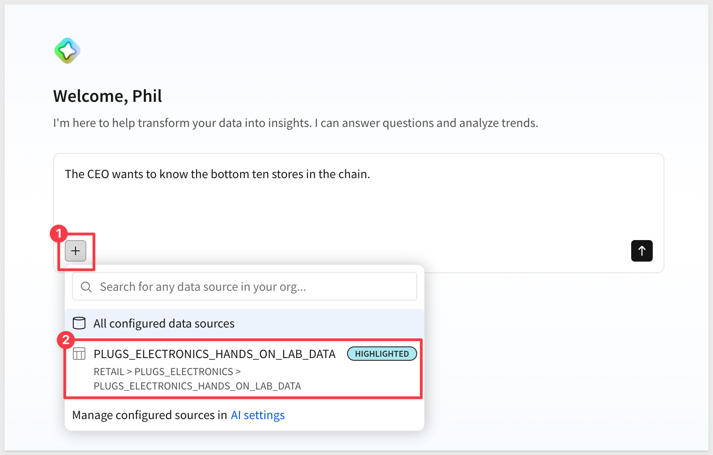

Select `PLUGS_ELECTRONICS_HANDS_ON_LAB_DATA` and submit the question.

Sigma Assistant explains what it's doing at each step and why. For those who need to see it, the SQL query used is shown:


You can see the logic behind the result, adjust any step, and follow your curiosity into the data:


Once the response is ready, you'll see a full explanation, chart options, and the ability to open selected results directly in a workbook for further analysis by clicking the `Explore` icon.

<aside class="positive">
<strong>NOTE:</strong><br> Before launching into a workbook, you can continue asking Sigma Assistant follow-up questions to refine the results. Ask for a different breakdown, narrow the date range, filter by product type, or explore a different angle entirely. Only open the workbook when you're ready to save and build on the results.
</aside>


Once in the workbook, we see that two tables and the chart are included (after moving them around a bit) and Assistant handled the grouping and calculation required to answer the question:


Now we can save it, refine it, or use Sigma's [drill-down](https://help.sigmacomputing.com/docs/view-underlying-data) capabilities for deeper analysis. We'll continue building on this workbook in the next section.

<!-- We can still access `Assistant` in the workbook by clicking the 
 icon:

 -->

### Formula Assistant

The Formula Assistant is available directly in the formula bar of any workbook or data model. It can:

- **Write a formula** — describe what you want to calculate, and AI suggests the formula
- **Correct a formula** — if Sigma detects an error, AI interprets your intent and suggests a fix
- **Explain a formula** — AI describes what an existing formula does in plain language

It becomes available when a table is selected:


Notice that Sigma Assistant generated a column called `performance_metric`. It's not immediately obvious what that column is calculating. This is a perfect use case for the Formula Assistant's `Explain this formula` capability.

Click the `performance_metric` column to select it. In the formula bar, click the AI wand icon and select `Explain this formula`:


The Formula Assistant will return a plain-language explanation of exactly what the formula calculates — what columns it references, how the calculation works, and what the result represents:


While this is a very basic example, this is an important pattern: Sigma Assistant generates analysis quickly, and the Formula Assistant lets you verify what was built. You stay in control of the results, even when AI does the initial work.

For more information, see [Use AI with formulas](https://help.sigmacomputing.com/docs/use-ai-with-formulas)

For more information on all AI features, see [Get started with AI in Sigma](https://help.sigmacomputing.com/docs/getting-started-with-ai)

### Two paths, one platform

Sigma Assistant and the Formula Assistant are genuinely useful — and they're only getting more capable. But powerful AI doesn't eliminate the value of understanding how things work.

Some users want to start with a question and get an answer in seconds. Others want to build from scratch, understand the data structure, and control every step. Some want both — starting with AI to explore quickly, then refining manually to get exactly what they need.

Sigma is designed to support both workflows without forcing a choice. You can let AI handle the initial analysis and then edit the results directly in a workbook. Or you can skip AI entirely and build everything by hand. The platform is the same either way — the same data, the same elements, the same publish and share workflow.

All of the AI features covered in this section work with whichever AI provider your administrator has configured — whether that's a warehouse-hosted model like Snowflake Cortex or an external provider like OpenAI or Anthropic. Your organization chooses the provider; the experience in Sigma remains the same.

There is also an additional layer worth knowing about: the **Sigma MCP Server**. 

Rather than using AI inside Sigma, the MCP Server brings your Sigma data to your AI tool of choice — so you can query and explore Sigma directly from Anthropic Claude ("Claude"). That is covered in the next section.


<!-- END OF SECTION-->

## Sigma MCP Server
Duration: 5

### What is an MCP server?

MCP stands for **Model Context Protocol** — an open standard that allows AI assistants to connect to external tools and data sources in a structured, secure way. Think of it as a universal adapter: instead of an AI assistant being limited to what it already knows, MCP lets it reach out to live systems and work with real data in real time.

The Sigma MCP Server implements this protocol for Sigma. Once configured, Claude can search your Sigma environment, inspect data structures, and run queries against your connected warehouse — all without you opening Sigma in a browser.

### What this means for Sigma users

The AI features covered in the previous section (Sigma Assistant, Formula Assistant, etc.) work inside Sigma — you open a workbook, ask a question, and the answer appears in context.

The MCP Server flips that around. You stay in your AI tool and bring Sigma to it. The core workflow is:

<ul>
  <li><strong>Discover:</strong> Search for documents, data models, workbooks, and tables across your Sigma organization.</li>
  <li><strong>Describe:</strong> Inspect the structure of any table or data model — column names, types, and definitions.</li>
  <li><strong>Query:</strong> Run natural language queries against any data source you have access to, without writing SQL.</li>
</ul>

This is particularly useful for analysts and developers who already work in AI-assisted environments and want Sigma data available in that same context.

<aside class="positive">
<strong>WHY IT MATTERS:</strong><br> The MCP Server doesn't bypass Sigma's permission model — it respects your account type and document-level access. Administrators retain full control over what data is reachable, making this a governed extension of Sigma into AI workflows rather than a workaround.
</aside>

### Setup

The Sigma MCP Server is available to all Sigma customers today via Claude's MCP registry. This provides a pre-configured MCP server that connects Claude to Sigma.

#### Required from Sigma
We need two pieces of information from Sigma so that we can provide them to Claude.

Copy these two values to a text file for use in Claude later.

1. **MCP URL:**<br>
Log into Sigma and click the profile icon in the upper left corner and select `MCP`. Click the copy icon and save the value off to a text file.

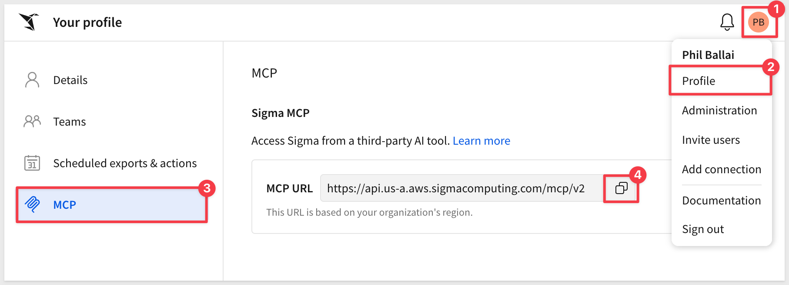

2. **Organization name:**<br>
This is part of the URL Sigma is using in your browser; for example:

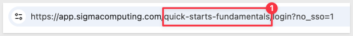

Copy your value off to a text file.

#### Claude setup
Log into Claude using your browser.

1. In Claude, click `Customize` from the left sidebar:

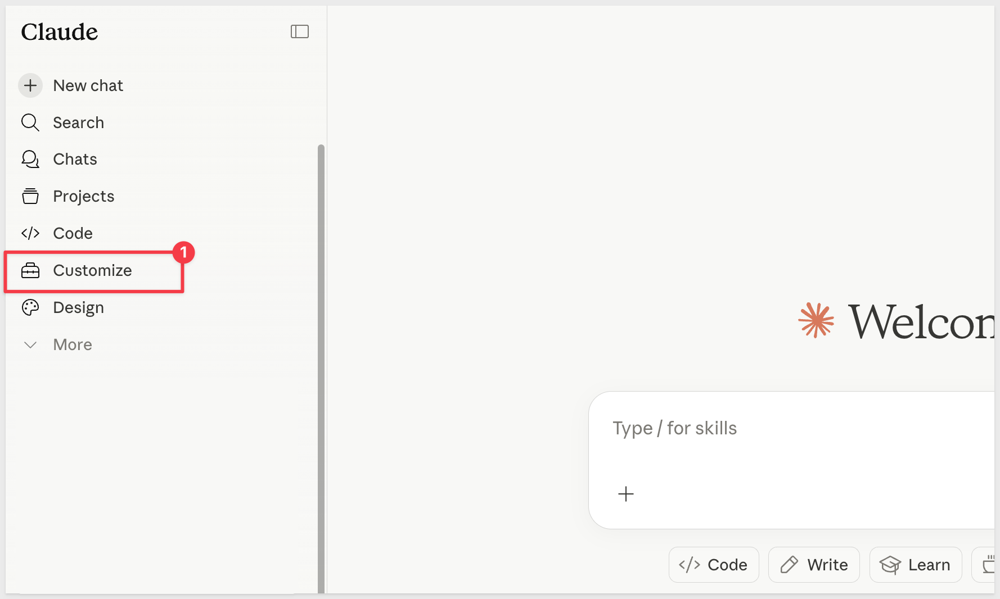

Under `Customize` click `Connectors`, `+` and `Browse connectors`:

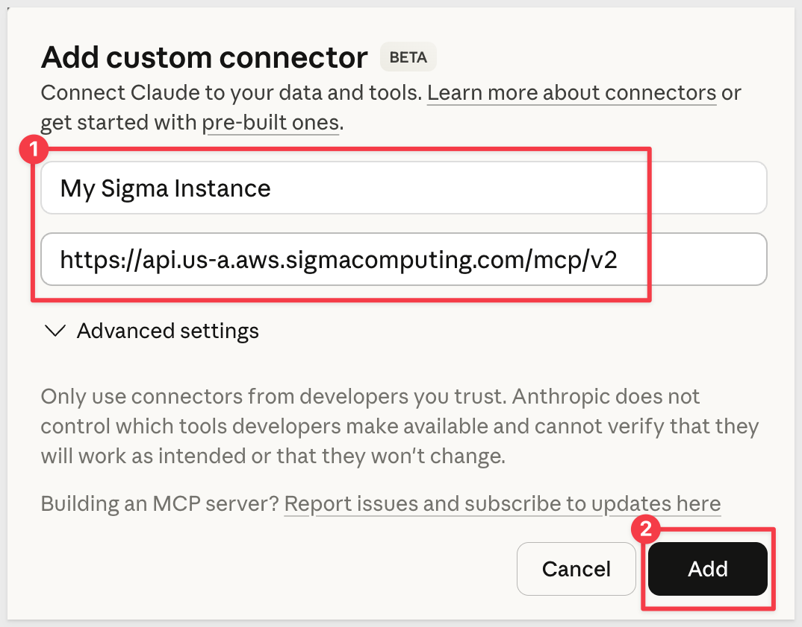

2. Search for `Sigma` and click `+`:


3. Paste the `MCP URL` copied from Sigma into Claude and click `Continue`:

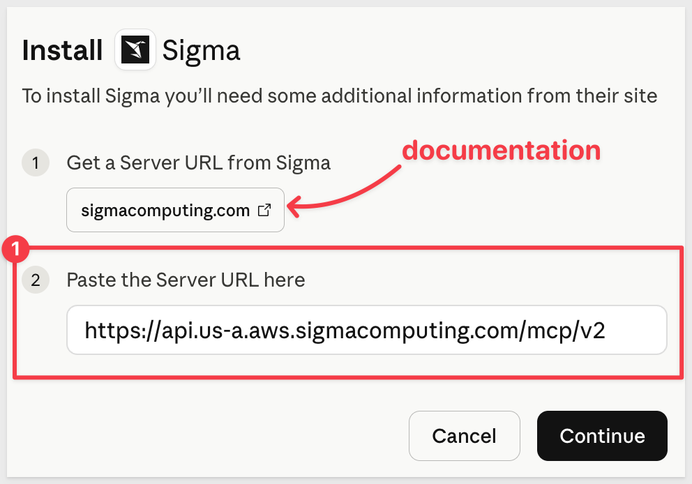

4. Add your Sigma organization name and click `Continue`:

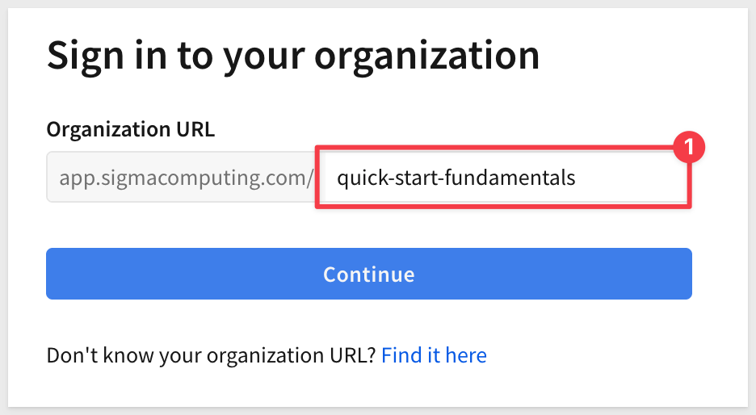

Provide your Sigma credentials and log in.

5. When prompted by Claude, click `Allow`:


If successful, we can `Approve` the operations Sigma will permit via Claude. For testing we selected `Always allow` for all tools:


Now Claude can interact with your Sigma environment using plain language. We can also decide which tool permissions we want to allow. 

5. We ask a simple question about our Sigma instance, which is a new trial and has only one workbook currently:

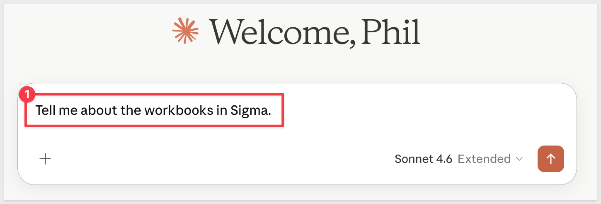

Since Claude has access, it is able to find the workbook and describe it to us:

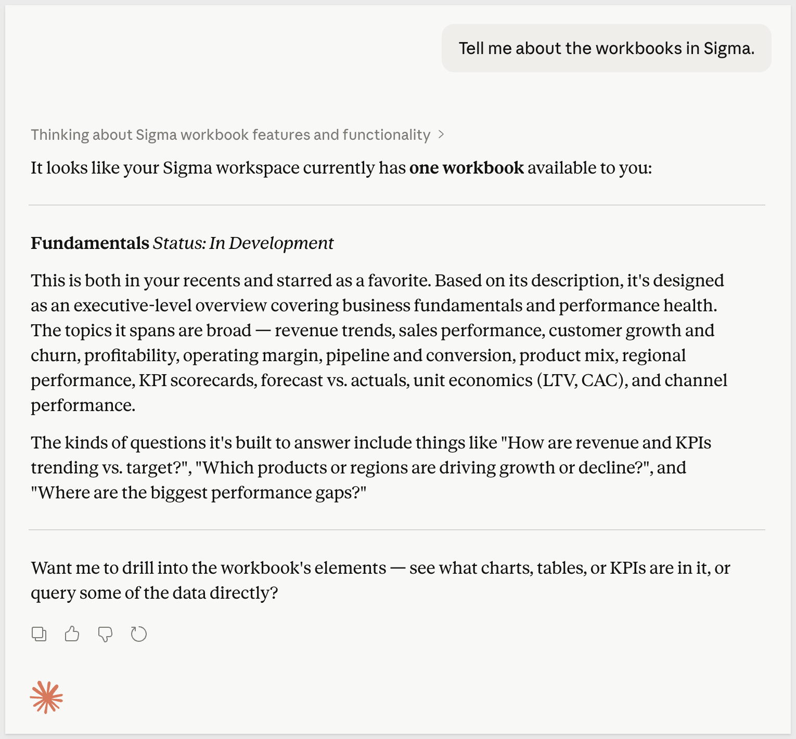

<aside class="negative">
<strong>NOTE:</strong><br> You will need appropriate Sigma permissions to use the MCP Server — at minimum, <code>View connections</code> on your account type and <code>Can view</code> or <code>Can use</code> access on the specific documents or connections you want to query.
</aside>

The value here is in the workflow. Instead of switching between Claude and Sigma to answer a data question, you stay in one place. Claude handles the discovery and query work, and you get answers grounded in your actual, live Sigma data — not a training dataset or a cached snapshot.

For teams that already work in AI-assisted environments, this means Sigma data becomes a natural part of that workflow rather than a separate tool you have to open.


For full setup instructions, see [Use the Sigma MCP Server](https://help.sigmacomputing.com/docs/use-sigma-mcp-server)

For a hands-on walkthrough — including how to configure a Claude Project with org-specific context, search your Sigma environment, and run natural language queries against live data — see [Natural Language Analytics with Claude and Sigma](https://quickstarts.sigmacomputing.com/guide/aiapps_natural_language_with_claude/index.html).


<!-- END OF SECTION-->

## Workbooks
Duration: 6

A workbook is where analysis happens in Sigma. It can hold tables, charts, controls, text, and apps — all organized across one or more pages, all connected to live data.

In this section, you’ll create a workbook from scratch, add data from the Sigma Sample Database, and walk through the key concepts: the exploration state, saving, the workbook interface, and the publish workflow.

### Create a new workbook

From the Sigma home page, click `Create New` in the left sidebar, then select `Workbook`.

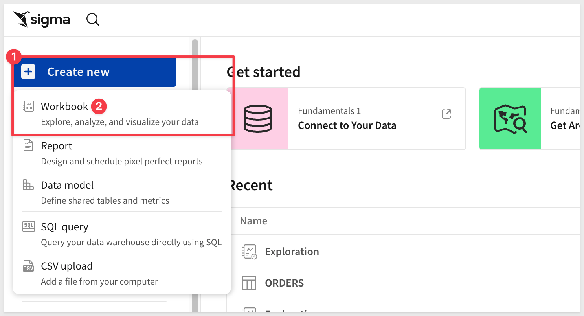

Sigma opens a blank workbook in the exploration state. You’ll notice there’s no name yet — the workbook doesn’t exist in your files until you choose to save it.

<aside class=”positive”>
<strong>NOTE:</strong><br> In Sigma, all workbooks start as unsaved explorations. If the analysis isn’t worth keeping, you can close it without saving and nothing is created. If it is worth keeping, you save it — and then it enters a draft/publish workflow.
</aside>

### Workbook settings

Before adding any data, it's worth knowing that workbooks have their own settings that control how they look and behave. Click the `Workbook Settings` button in the element panel:

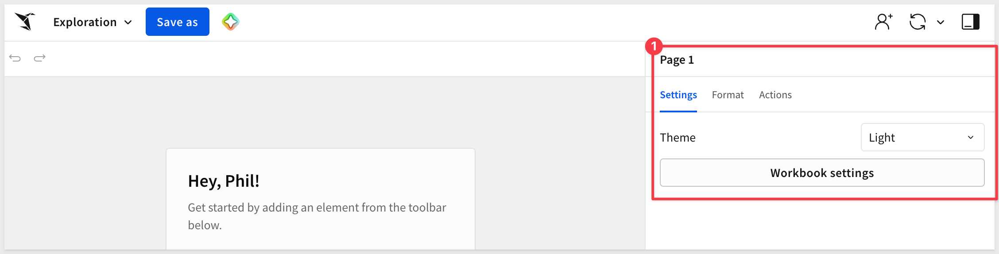

The settings panel is organized into expandable sections:

<ul>
  <li><strong>Theme:</strong> Set a Light or Dark theme for the workbook.</li>
  <li><strong>Color:</strong> Configure the color palette used across charts and visualizations.</li>
  <li><strong>Font:</strong> Set the default font family and size for text elements.</li>
  <li><strong>Layout Style:</strong> Control padding, spacing, and canvas behavior.</li>
  <li><strong>Table Style:</strong> Set default styling for table elements — borders, row height, header appearance.</li>
  <li><strong>Layout Settings:</strong> Configure how the workbook scales and responds across screen sizes.</li>
  <li><strong>Workbook Navigation:</strong> Enable and configure in-workbook navigation menus for viewers.</li>
</ul>

At the bottom of the panel, `Manage locales` allows you to configure number and date formatting for different regional audiences.

These settings apply to the entire workbook and can be adjusted at any time. 

Another "nice-to-have" feature allows you to hide the `Element panel` to provide more working surface. There are times when this can be useful:

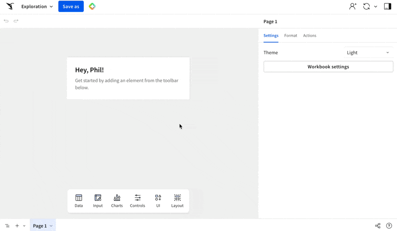

For more information, see [Workbook settings overview](https://help.sigmacomputing.com/docs/workbook-settings-overview)

### Add data

Let's add a table to the workbook. Open the `Data` group on the `Element bar` and drag/drop (or just click) a `Table` onto the canvas:

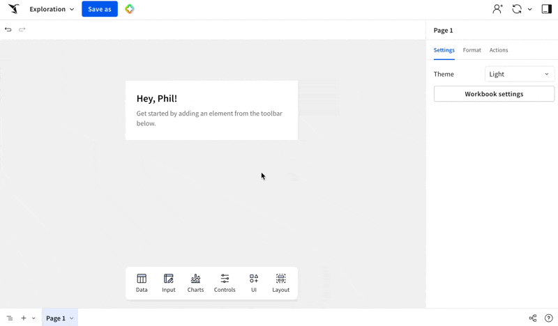

Resizing and arranging elements is really simple as is selecting the source of the data from the warehouse. 

Data can be sourced from suggestions made by Sigma (based on recent activity), other elements in the workbook or from any available connection.

As shown in the gif, search for `Hands` and choose  > the `PLUGS_ELECTRONICS_HANDS_ON_LAB_DATA` table from the `RETAIL` schema.

Sigma adds the table to the canvas and pulls the data live from the cloud data warehouse. You’re not working with a copy or a snapshot — the data reflects whatever is in the warehouse at query time.

Notice that this table is over **4.5 million rows** and 22 columns:

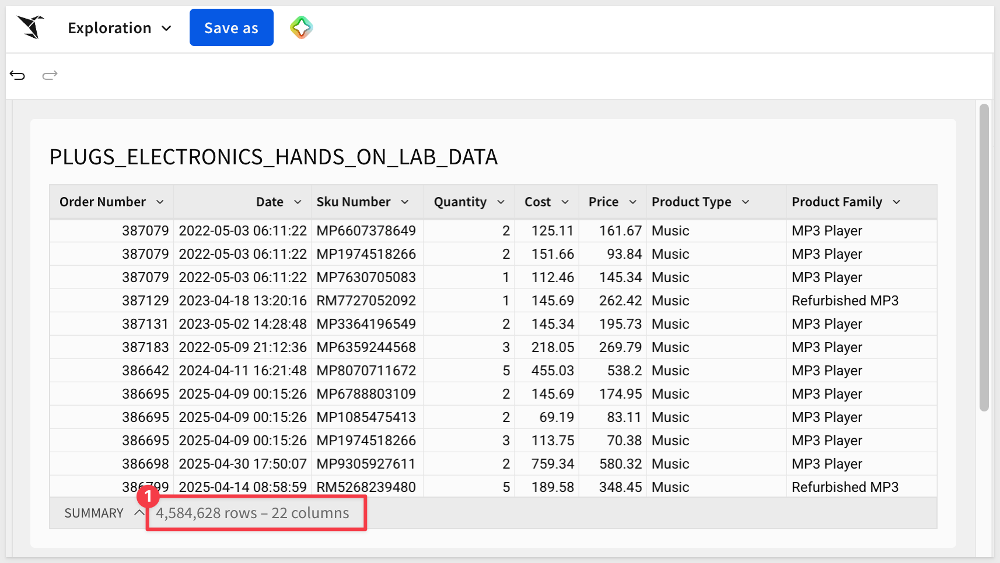

<aside class=”negative”>
<strong>NOTE:</strong><br> Workbooks can connect to data from multiple sources — tables in your cloud data warehouse, data models created in Sigma, or CSV files uploaded directly.
</aside>

### The workbook interface

With the table on the canvas, take a moment to get oriented.


Each workbook can have one or more **pages**. Each page has its own canvas. The table you just added is on `Page 1`.

Objects on the canvas are called **elements** — tables, charts, controls, text, buttons, and so on. 

When an element on the canvas is selected, it will have a blue border and the `Element Panel` will show the related configuration:

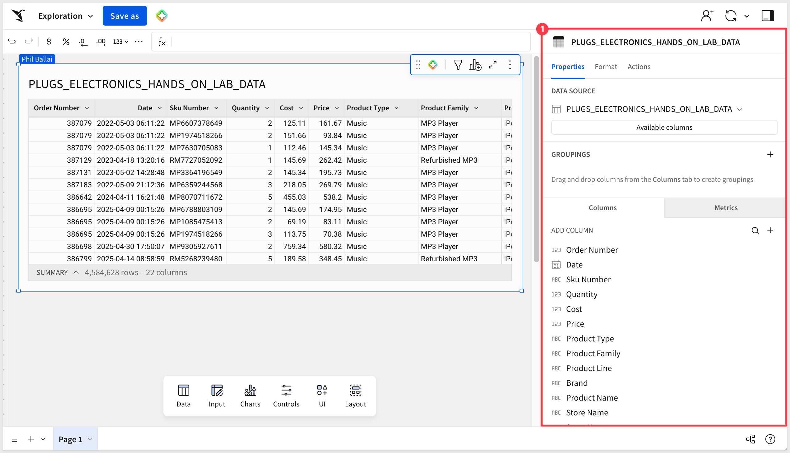

The titles of elements on the page can easily be renamed by double-clicking the name. For example, change the `PLUGS_ELECTRONICS_HANDS_ON_LAB_DATA` title to `Sales Transactions`.

When the `Sales Transactions` table > `Order Number` column is selected, we can access the `Toolbar`, `Formula bar` and `Element features`. 

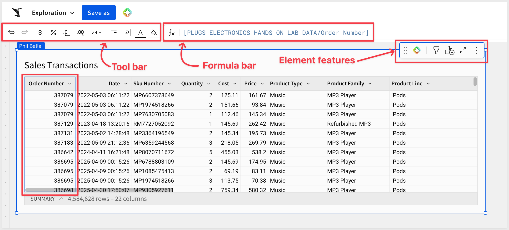

The **formula bar** is super-powerful as it gives you access to [Sigma’s full library of functions](https://help.sigmacomputing.com/docs/popular-functions) and is where custom calculations are written and edited.

Important to notice that icons for undo and redo are present - . These are really handy, and will be used often.

<aside class=”positive”>
<strong>IMPORTANT:</strong><br> Use the `Undo` and `Redo` arrows in the toolbar — not the browser’s back button. The browser back button will navigate away from the workbook.
</aside>


### Save the workbook

When you’re ready to keep this workbook, click `Save As` in the upper left corner.

Give the workbook a name that would make sense to you and to anyone you might share it with later. For this QuickStart, create a folder called `QuickStarts` and name the workbook `Fundamentals`.

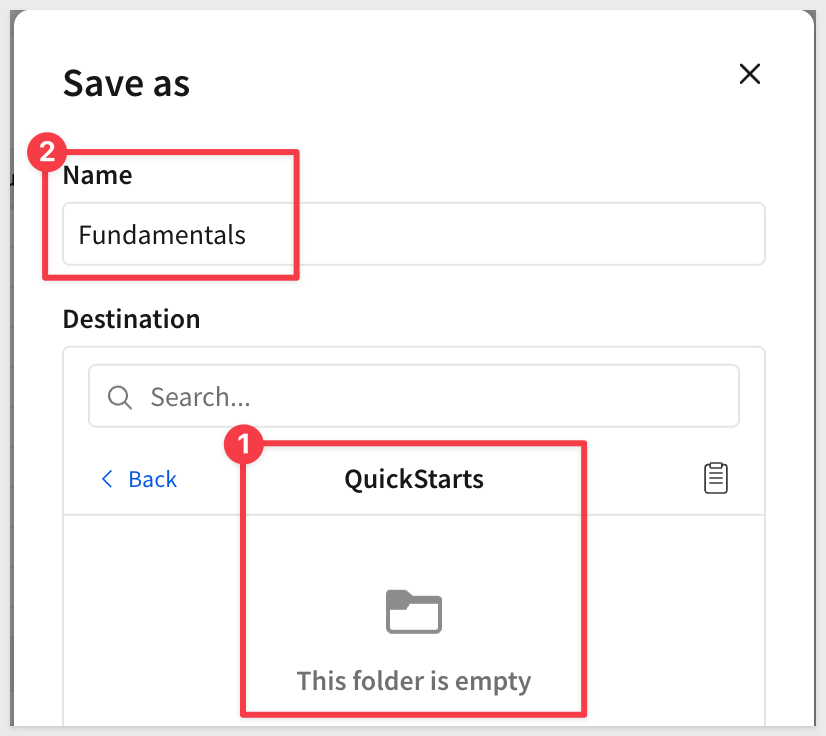

Once saved, the workbook is now in **Draft** mode. The `Publish` button is visible in the header, but it remains inactive as we just saved the workbook. It will remain inactive until you make changes.

### About this workbook

Click the down-arrow next to the workbook name and select `About this workbook`.

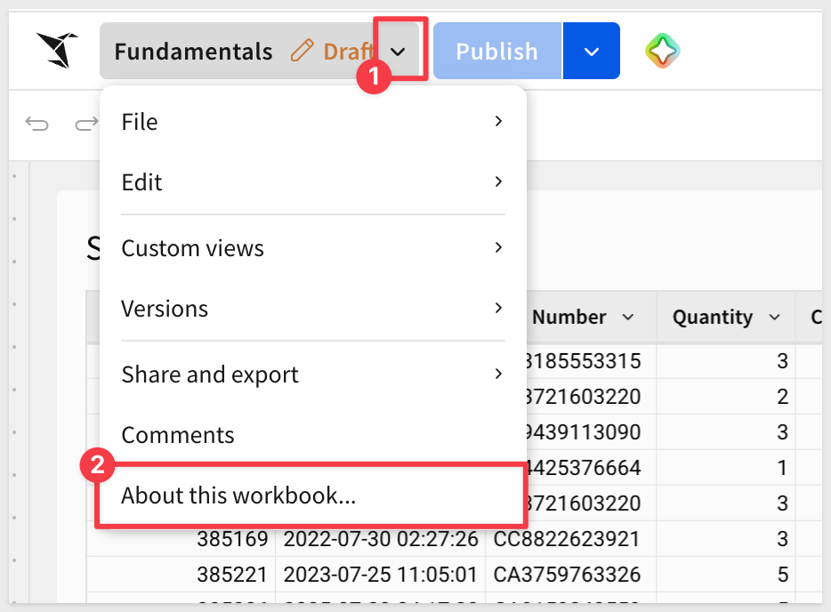

From here you can:
<ul>
  <li>Star the workbook to add it to your Favorites section on the home page left sidebar menu.</li>
  <li>Leave a text comment to provide additional context.</li>
  <li>Details about where the workbook is stored, who owns it which is useful when the workbook is shared to you and so on.</li>
</ul>

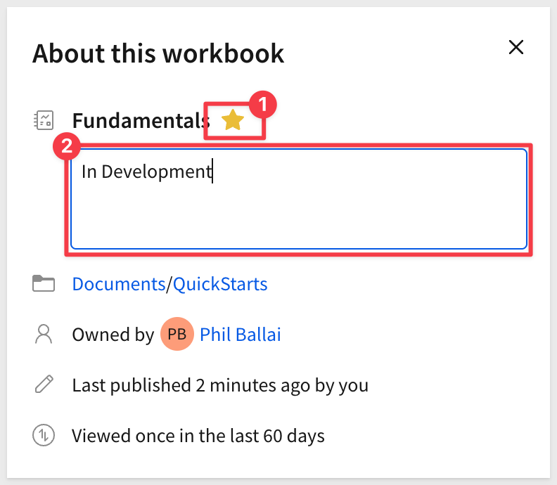

You may also want to set a `Badge` on the workbook, to inform users about the status of the content:

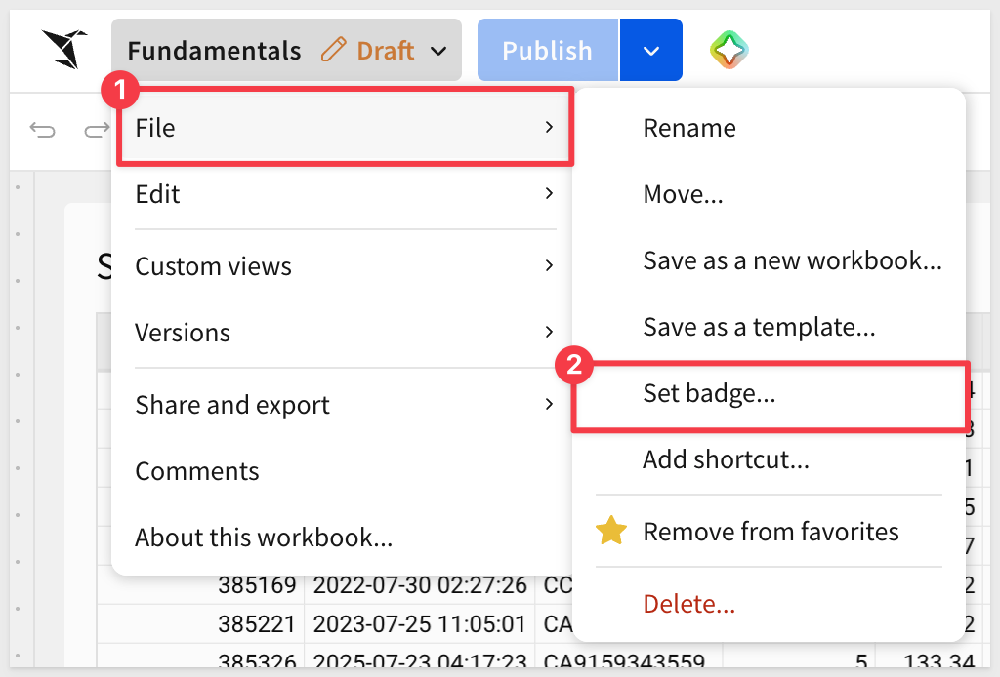<br>

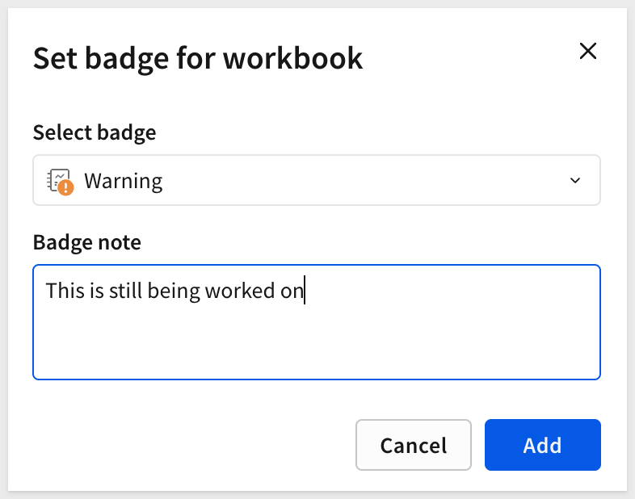<br>

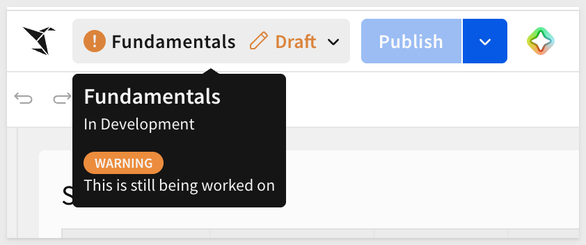<br>

### Publish and view

When you’re ready to share the workbook with others, click `Publish`. This promotes the current draft to the published version — the version all users with access will see.

Opening the `Publish` drop-down before clicking provides additional options:

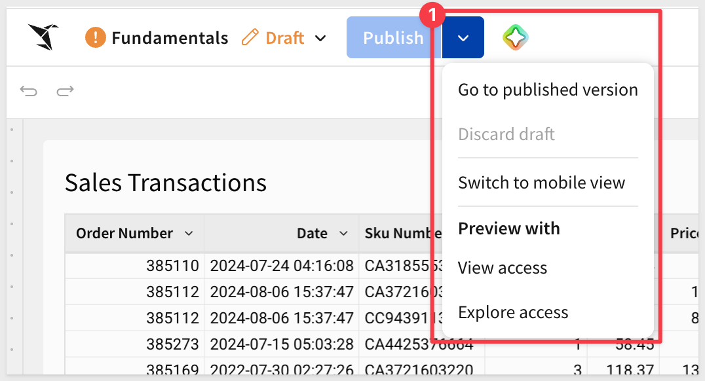

<ul>
  <li>Go to the published version to see what viewers see.</li>
  <li>Discard unpublished draft changes.</li>
  <li>Preview the workbook at a smaller screen size for mobile use.</li>
  <li>Preview with different access rights applied.</li>
</ul>

<aside class=”positive”>
<strong>NOTE:</strong><br> Sigma also supports workbook version history and version tagging for more controlled release workflows. For more information, see <a href=”https://help.sigmacomputing.com/docs/workbook-versions-and-version-history”>Workbook version history</a> and <a href=”https://help.sigmacomputing.com/docs/version-tagging”>Version tagging</a>.
</aside>

### The published view

After publishing, click `Go to published version` from the `Publish` menu.

In the published view, the header shows an option to return to `Edit` mode, plus a `Custom view` icon. 

Custom views let you make changes visible only to you — useful for adapting a shared workbook to your own needs without affecting what others see.

If a user has the permission, they can use `File` > `Save as a new workbook` to save that view for themselves (and perhaps others):

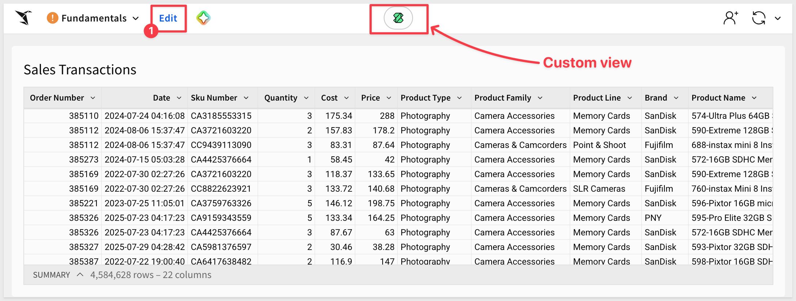

Once you’re done reviewing, click `Edit` in the header to return to editing mode.


<!-- END OF WORKBOOKS -->

## Pages
Duration: 6

Each workbook page has its own canvas and can be made to operate independently of others, or not.

For example, on one page, we may want to have the data and controls you are using to drive the content on other pages. 

On another page, we may want to provide some instructions for the users. Sigma is flexible enough you can create very different designs and even make the design properties reusable as [Theme](https://help.sigmacomputing.com/docs/create-and-manage-workbook-themes)

### Create a data page
A dedicated data page in a workbook can be useful for storing information that other users don’t need to see. However, elements on the data page can still be easily referenced on any other workbook page.

<aside class="positive">
<strong>WHY IT MATTERS:</strong><br> When a source table — for example, a Sales Transactions table — lives on a data page, Sigma fetches that data from the warehouse once. 

Any child elements created from it (such as charts or summary tables) and any references to it from other pages in the workbook are served from that same result, without triggering additional warehouse queries. 

This keeps compute costs down and performance consistent as a workbook grows. 

For a deeper look at how Sigma handles calculations and query execution, see the <a href="https://quickstarts.sigmacomputing.com/guide/developers_sigma_calculations/index.html">Sigma's Query Engine</a> QuickStart.
</aside>

In the lower left corner of the workbook there is a page tab called `Page 1`.

Double-click on the `Page 1` text and rename the page to `Data`. 

Add a new page and name it `Dashboard` for now:

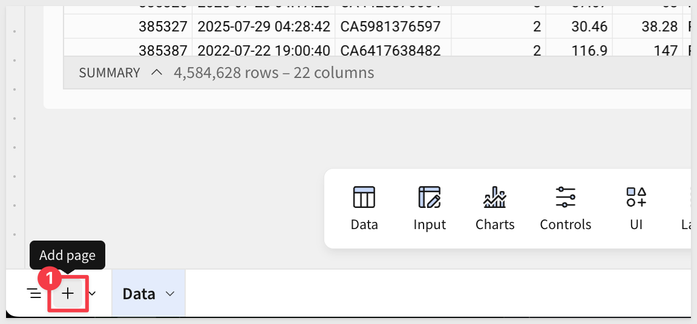

Drag the `Dashboard` page to be first in line.

Click the menu arrow on the `Data` page and select `Hide page`:

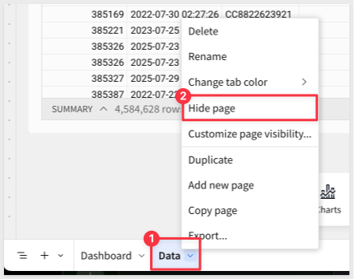

The `Data` tab will now carry an icon to indicate that it will not be visible to users who do not have edit rights.

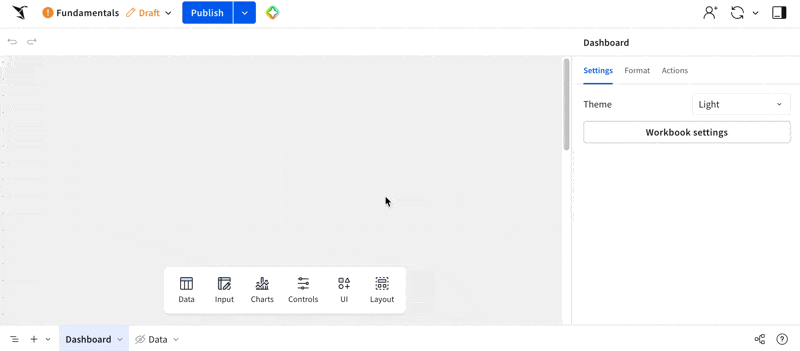

<aside class="positive">
<strong>NOTE:</strong><br> Hidden pages are permission-aware — users with edit access will still see the page, while viewers will not. To verify this behavior, use the <code>Preview with</code> option in the <code>Publish</code> menu. This lets you simulate how the workbook appears to users with different permission levels without publishing or sharing anything.
</aside>

All Sigma elements use a common method for making adjustments via the `3-dot` or "[Kebab Menu](https://en.wikipedia.org/wiki/File:Kebab-menu-ui-icon-1.svg)" option.

For example, if we wanted to move the `Sales Transactions` table to another page, we can do that easily:

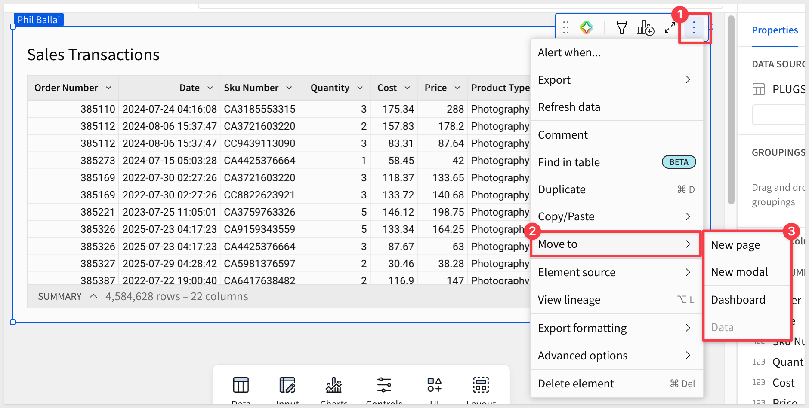

<aside class="positive">
<strong>IMPORTANT:</strong><br> It is easy to move elements between pages and any associations that an element has to other elements is automatically maintained. This "automatic association" is what allows us to have a "Data" page that is hidden from users, but contains elements that we can reference in any other page.
</aside>

Now that we made some changes, the `Publish` button is active again.

### Version history

Every change you make to a workbook — including structural changes like hiding the `Data` page — is tracked automatically. Sigma maintains a full version history so you can review what changed, when, and who made the change. If something goes wrong, you can restore a previous version without losing other work.

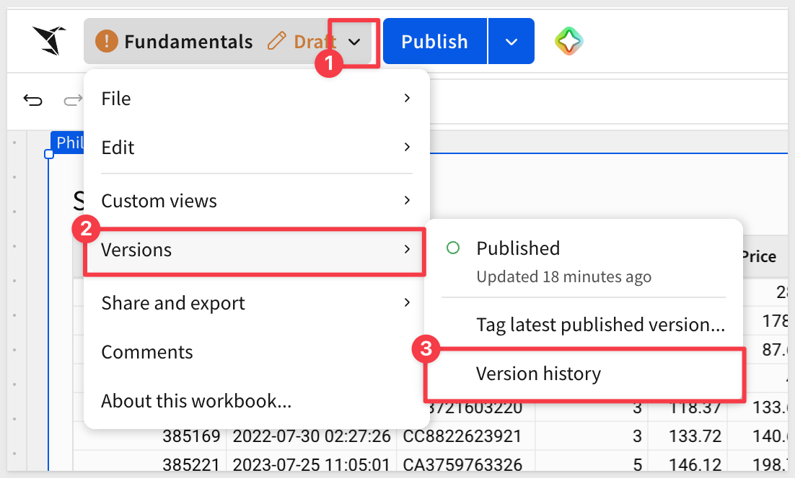

<aside class="positive">
<strong>NOTE:</strong><br> Version history is available for saved workbooks. To access it, open the workbook menu (the down-arrow next to the workbook name) and select <code>Version history</code>. For more information, see <a href="https://help.sigmacomputing.com/docs/workbook-versions-and-version-history">Workbook version history</a>.
</aside>

When we changed the visibility of the `Data` page, that is tracked and can be reverted by clicking on any of the earlier changes. 

<aside class="positive">
<strong>IMPORTANT:</strong><br> Version history provides a much deeper level of control than just using undo/redo which is more session based. When more than one user is editing a workbook, it also shows who made each change.
</aside>

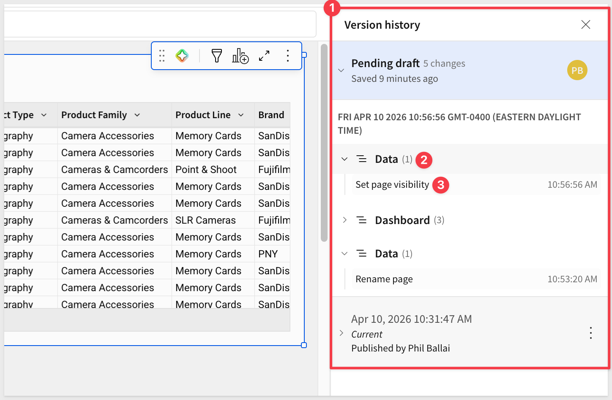


### Use a page for instructions or useful information
Creating a dedicated workbook page to inform and assist users who are looking at the workbook is a best practice.

As an example, this `Financial Services: Portfolio Risk Modeling` workbook has informative text along with some navigation buttons along the top and uses a dark theme. Since it is on the `Home` page, it is the first thing users see:


Sigma provides many pre-built [templates](https://help.sigmacomputing.com/docs/get-started-with-workbook-templates) that you can explore, see how things are configured, and use for your own projects. 

You can even create templates from your own workbooks too:


<!-- END OF PAGES -->

## Layout Elements
Duration: 6

Sigma offers several layout elements that help you structure workbook pages, improve navigation, and create interactive user experiences. Each element is designed to make your content more organized, visually appealing, and easier to use. 

Having all these options allows you to get creative with workbook functionality and design—encouraging your users to engage with and return to your workbooks.

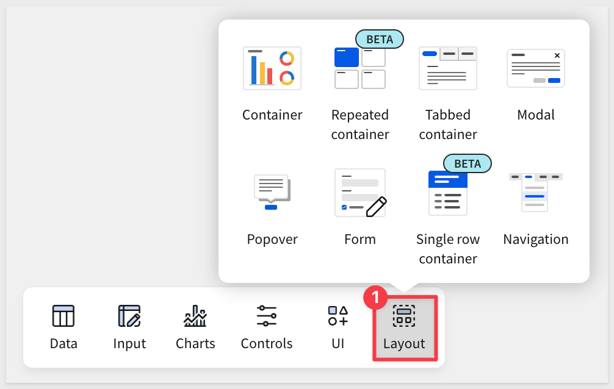

### Containers
Sigma's container feature allows you to organize workbook pages by grouping elements within a customizable container. 

This provides an intuitive way to manage layouts, ensuring that related elements remain visually cohesive. 

Containers not only streamline the design process by enabling you to adjust and style grouped components collectively, but also enhance flexibility when rearranging or resizing elements on the canvas. 

This powerful feature simplifies complex workbook structures, making it easier to maintain consistency in both functionality and appearance.

In the animation below, we show how containers dramatically improve the appearance of existing Sigma workbooks.


To learn more about using containers, see [Organize workbook layouts with containers](https://help.sigmacomputing.com/docs/organize-workbook-layouts-with-containers)

### Tabbed Container
Tabbed containers let you organize related content into separate tabs within the same space. This saves screen real estate, reduces scrolling, and allows users to easily switch between different views or datasets without leaving the page.

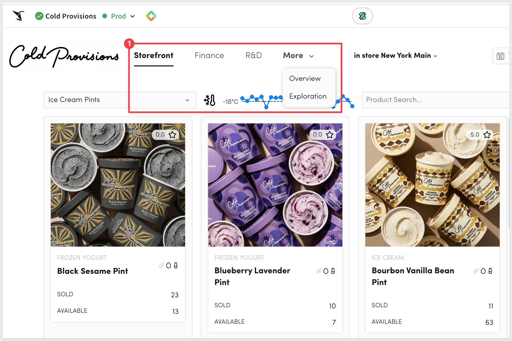

### Modal
A modal feels somewhat similar to a page but behaves differently in that it enables a pop-up window that overlays the workbook. Modals are ideal for highlighting important content, collecting input, or guiding users through a focused interaction without navigating away from the main page.

Modals can be used for simple things like confirming a change or complex as shown in the [Approvals QuickStart](https://quickstarts.sigmacomputing.com/guide/dataapps_approvals_flow/index.html?index=..%2F..index#0)


### Popover
Popovers display additional information or interactive controls in a small floating panel triggered by a click or hover.
They’re perfect for providing contextual help, quick filters, or small forms without cluttering the main layout.

An example can be seen on the `Administration` > `Usage` page where a popover is used for filters, freeing up space:


### Form
Forms enable users to input and submit data directly within a workbook. They can be used to capture user feedback, send parameters to queries, or write data back to your warehouse—bringing interactivity and data collection directly into your Sigma dashboards.

There is a QuickStart, [Building Forms for Data Capture and Analysis](https://quickstarts.sigmacomputing.com/guide/aiapps_forms/index.html#0) that walks through the process of using forms to capture trade show leads.

Here is an example of a form for capturing trade show leads:


<!-- END OF PAGES -->

## Account Types
Duration: 6

<aside class="negative">
<strong>NOTE:</strong><br> This section is useful to understand how different users may use Sigma. If you are not involved in those decisions, feel free to skip to the next section.
</aside>

Sigma’s licensing model includes tiers that define the usage terms of your organization members: `View`, `Act`, `Analyze` and `Build`. 

If your organization utilizes older Lite/Essential/Pro license model, [refer to this document.](https://help.sigmacomputing.com/docs/create-and-manage-account-types-2024)

Each license tier establishes a different set of available permissions that enable access to Sigma’s features and capabilities. 

At a high-level, this is what each tier provides:

<ul>
  <li><strong>View:</strong> Suitable for report consumers who need access to prepared data and insights with baseline interactions.</li>
  <li><strong>Act:</strong> Ideal for collaborative data contributors who actively input and update data.</li>
  <li><strong>Analyze:</strong> Optimized for decision-making data consumers who require more deep-dive capabilities without building workbooks themselves.</li>
  <li><strong>Build:</strong> Designed for data architects, BI analysts, and report builders who model, transform, and analyze data.</li>
</ul>

<aside class="negative">
<strong>NOTE:</strong><br> The Build license also is used for system administrators. The key difference is that an administrator has an elevated account type. This allows them to manage organization settings and users and so on.
</aside>

As an `administrator`, we can see these default account types by navigating to `Administration` > `Account Types`.

Here we see the default types, description and can also create a new custom account type.

Custom account types provide the ability to define a granular permission level using `Account Types`. 


For more information, see [Account type and License Overview](https://help.sigmacomputing.com/docs/account-type-and-license-overview)


<!-- END OF SHARING -->

## Sharing
Duration: 6

Sharing in Sigma is simple. Permissions to access a Sigma document can be granted, modified, or revoked by either the document’s owner or an organization admin. 

Return to the `Fundamentals` workbook, and click the `Share` icon in the upper right corner of the workbook:

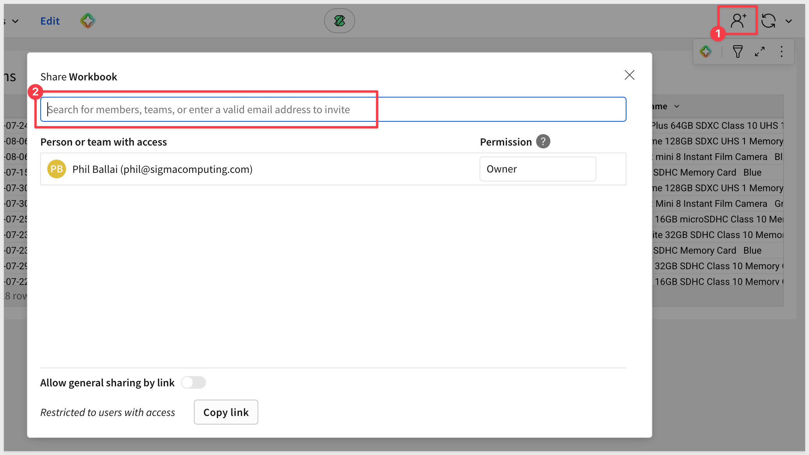

In the share modal we can select a team or member that we want to share the workbook, and at what permission level.

For example, we invited another user (using [Gmail's alias feature](https://support.google.com/a/answer/33327?hl=en)) and set their permissions to `Build`.

Now we can share the workbook with that new user and select the level of access we want to allow. 


The new user can see the workbook by navigating to `Shared with me` on the homepage. We logged into Sigma as the new user using a different browser and can see the shared workbook:

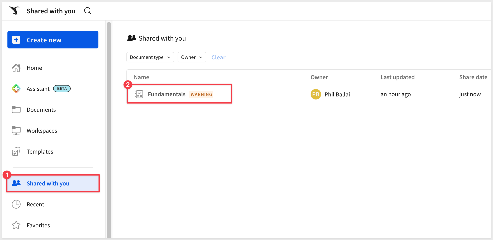

### Live edit

When we are both editing the same workbook, we can see each other's activity.

First we elevated the `Build` user to `Edit` permission using the workbooks sharing icon again.

<aside class="negative">
<strong>NOTE:</strong><br> To use live edit, users need to have `Edit` access.
</aside>

Then we logged both users in using Chrome and Safari browsers and placed the workbook into `Edit`.

Each user can see the others presence on the table:

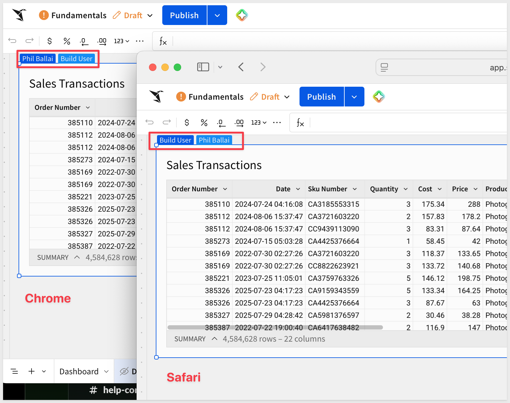

<aside class="negative">
<strong>NOTE:</strong><br> We simulated this using two different browsers, each with a different user logged into Sigma.
</aside>

For more information, see [About sharing with users, teams, and all organization members](https://help.sigmacomputing.com/docs/share-a-workbook#about-sharing-with-users-teams-and-all-organization-members)


<!-- END OF SHARING -->

## Scheduling
Duration: 6

Sigma workbooks support the ability to export data immediately or on a user-defined schedule.

Open the workbooks menu and select `Share and export` > `Scheduled exports...`:

<aside class="negative">
<strong>NOTE:</strong><br> The `Export` option is also provided for immediate export. There are some restrictions on data export. For more information, see <a href="https://help.sigmacomputing.com/docs/download-workbook-data">Download workbook data</a>.
</aside>

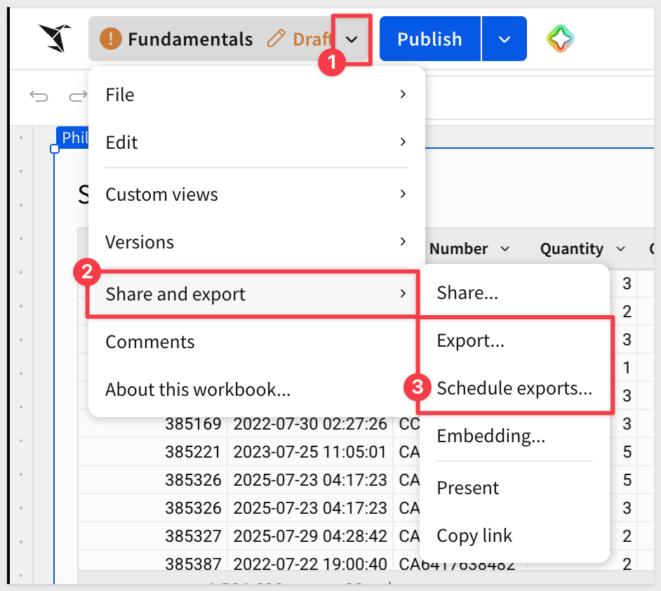

In the modal window, click `Create new Schedule`

<aside class="negative">
<strong>NOTE:</strong><br> There is also an option provided to see all your scheduled exports in one place. The same summary page is also available under `Your profile` icon on the homepage.
</aside>

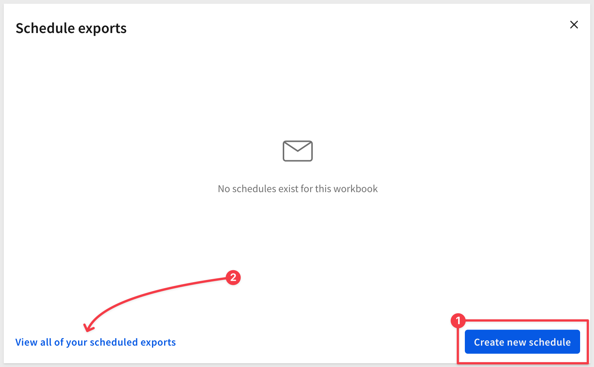

We are able to customize several areas of this operation. 

### Export (select a type)
There are many destinations supported. Click the desired icon, provide one or more recipients, a subject and message:

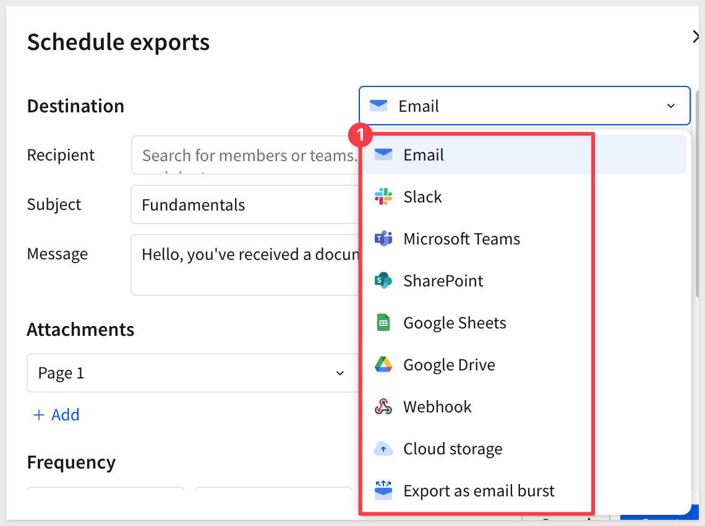

For the most recent list of supported export destinations, see [Schedule a conditional export or alert](https://help.sigmacomputing.com/docs/schedule-a-conditional-export-or-alert)

### What to attach
Add one or more attachments, the format and orientation to include with the export:

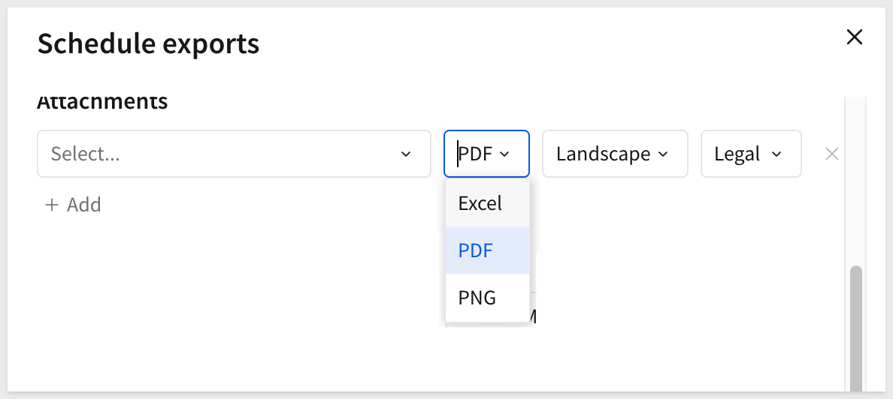

Use the  `+ Add another attachment` to build a message from more than one part of a workbook.

### Frequency & Conditions

The `Frequency` tab controls when the export runs and the timezone it runs in. Set the schedule to match the cadence your audience expects — daily, weekly, or at a custom interval.

Sigma also supports conditional exports — exports that only deliver when specific data conditions are met. For example, you can configure a schedule to send only when a metric exceeds a threshold, ensuring recipients receive a notification only when action may be required.

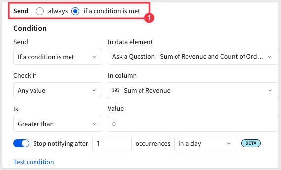

<aside class="negative">
<strong>NOTE:</strong><br> Conditional exports are not available on trial accounts. To explore this feature, you'll need access to a full Sigma environment. For setup details, see <a href="https://help.sigmacomputing.com/docs/schedule-a-conditional-export-or-alert#schedule-an-export-based-on-data-availability">Schedule a conditional export or alert</a>.
</aside>

### More options
For workbooks that have parameter-driven data based on the user, sent items can be run with data filtered for the recipient:

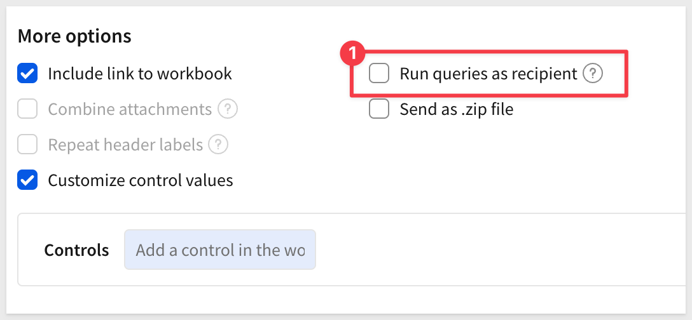

A very powerful feature of scheduling allows us to deliver reports deterministically, based on control parameters.

For more information, see [Filter by control values](https://help.sigmacomputing.com/docs/configure-additional-options-for-exports) on this page.

### Managing my workbook schedule
Once a user creates a schedule, it is shown on the `Schedule exports` modal. At this point, we can take some `Action` on it, including running it now:

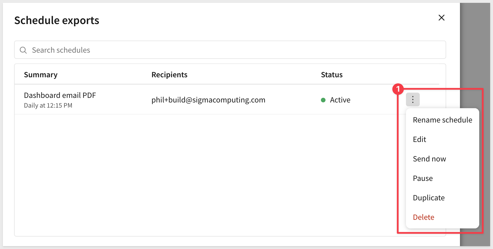

### Administrative control
Once created, administrators can see it on the list of available `Exports` in the `Administration` section:

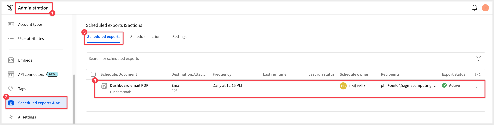

Administrators are able to delete jobs at their discretion.

### Export element
There is also a method to export data for any single workbook element. While it is preferred to use Sigma to work with warehouse data, there are times where an export is required. 

For example, our workbook has one table, `Sales Transactions`. 

We can access the element menu for this table and select `Export` > and select a document type. Downloading up to one million rows of data in the available formats is supported.

<aside class="negative">
<strong>NOTE:</strong><br> Creating a delivered export or a scheduled export is also available from this menu.
</aside>

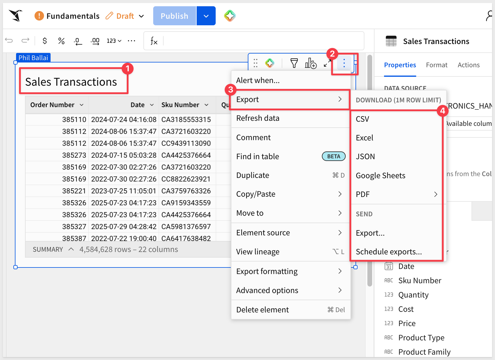

For more information, see [Schedule a conditional export or alert](https://help.sigmacomputing.com/docs/schedule-a-conditional-export-or-alert)


<!-- END OF SCHEDULING -->

## What we've covered
Duration: 6

This QuickStart introduced the foundational layer of working in Sigma — the interface, the terminology, and the core workflows that everything else builds on.

You navigated the Sigma home page, explored the UI, created a workbook from scratch, and followed a document from exploration through draft to published. Along the way you saw how Sigma Assistant can accelerate initial analysis, how pages and data pages keep workbooks organized and warehouse-efficient, and how sharing, version history, and scheduled exports fit into a real workflow.

The patterns introduced here apply across every workbook you'll build going forward. The next QuickStart in the series picks up where this one leaves off — working with data in Sigma:

[Fundamentals 2: Working with Data](https://quickstarts.sigmacomputing.com/guide/fundamentals_2_data_v3/index.html?index=..%2F..index#0)

[](https://twitter.com/sigmacomputing)&emsp;
[](https://www.linkedin.com/company/sigmacomputing)&emsp;
[](https://www.facebook.com/sigmacomputing)


<!-- END OF WHAT WE COVERED -->
<!-- END OF QUICKSTART -->
