author: pballai
summary: fundamentals_1_getting_around_v3
id: fundamentals_1_getting_around_v3
categories: fundamentals
status: Published
feedback link: https://github.com/sigmacomputing/sigmaquickstarts/issues
tags: default
authors: phil@sigmacomputing.com
lastUpdated: 2026-04-15

# Fundamentals 01: Overview
<!-- -->

## Overview
Duration: 6

This QuickStart is part of a series designed to help new Sigma users get oriented and start working with the platform.

The Fundamentals series covers a broad range of topics at an introductory level. Each QuickStart includes links to deeper resources — follow what’s relevant to you.

If you’re coming from another BI platform, these community resources may help you get up to speed faster:

[Sigma Differences From Other BI Tools Overview For New Sigma Creators](https://community.sigmacomputing.com/docs?topic=3285)

[I am a Dashboard Builder New to Sigma. How Can I Quickly Get Up To Speed?](https://community.sigmacomputing.com/docs?topic=3650)

If you’re primarily interested in data modeling, start with [Fundamentals 10: Data Modeling](https://quickstarts.sigmacomputing.com/guide/fundamentals_10_data_modeling/index.html?index=..%2F..index#0).

Each QuickStart in the series uses sample data Sigma provides to all customers — sales data from our fictitious company **Plugs Electronics.**

<aside class="positive">
<strong>ABOUT THE SAMPLE DATABASE:</strong><br> Sigma provides a connection to sample data to all customers free of charge. Administrators may disable this in Administration > General Settings > Features. If the sample data is not visible in your instance, check with your administrator.
</aside>

<aside class="positive">
<strong>IMPORTANT:</strong><br> Some screens in Sigma may appear slightly different from those shown in QuickStarts. Sigma continuously adds and enhances functionality, but these differences won’t prevent you from completing the steps.
</aside>

For more information on Sigma’s product release strategy, see [Sigma product releases](https://help.sigmacomputing.com/docs/sigma-product-releases).

If something isn’t working as expected, here’s how to [contact Sigma support](https://help.sigmacomputing.com/docs/sigma-support).

<aside class="negative">
<strong>IMPORTANT:</strong><br> Some features may carry the "Beta" tag. Beta features are subject to quick, iterative changes, so the latest product version may differ from what’s shown here.
</aside>

### About Sigma
Sigma is a front-end for your cloud data warehouse—an analytics platform for spreadsheets, interactive AI-enabled apps, and more. It centralizes your data, eliminates silos, and replaces fragmented tools for various use cases within a governed environment. Additionally, Sigma enables businesses to monetize their data through embedding Sigma in bespoke Saas applications.

Many solutions exist, but Sigma stands out. Here's why:

Sigma is multi-modal, designed for users of all skill levels. Data engineers can write SQL, data scientists can use Python, and business users can work with spreadsheet functions. Want to build a complex app workflow? Sigma makes it easy.

It's also the only platform that lets users securely write back data—updating rows or columns without overwriting the warehouse.

Sigma is built for collaboration, allowing teams to work together in real time on live data, just like a well-coordinated game.

For developers embedding Sigma in a larger platform, every feature is available—no need to manually code elements.

With full feature parity and no coding required, Sigma is the fastest, most flexible, and most powerful embedding tool on the market.

Many customers are already using Sigma to replace existing, purpose built SaaS applications.

### Target Audience
This QuickStart is designed for new Sigma users across three roles:

- **Users** — analysts or report consumers who want to query and explore data, with or without AI
- **Builders** — developers or analysts creating workbooks, dashboards, and apps
- **Admins** — administrators evaluating Sigma’s governance, licensing, and operational capabilities

### How QuickStarts are organized

The [Sigma QuickStarts library](https://quickstarts.sigmacomputing.com/) contains over 100 guides organized into categories — Fundamentals, AI Apps, Administration, Embedding, and more. You don't need to complete them all. Use the categories to find what's relevant to your role and goals.

The **Fundamentals series** (this one included) is the recommended starting point for anyone new to Sigma. It covers the core concepts and capabilities at an introductory level, with links to deeper resources along the way.

After completing this QuickStart, here are suggested paths based on your role:

**Users** — analysts, report consumers, and anyone exploring data:
- [Fundamentals 2: Working with Data](https://quickstarts.sigmacomputing.com/guide/fundamentals_2_working_with_data/index.html)
- [Fundamentals 3: Pivot Tables](https://quickstarts.sigmacomputing.com/guide/fundamentals_3_pivot-tables/index.html)
- [Fundamentals 5: Charts](https://quickstarts.sigmacomputing.com/guide/fundamentals_5_charts/index.html)
- [Fundamentals 6: Controls](https://quickstarts.sigmacomputing.com/guide/fundamentals_6_controls/index.html)

**Builders** — developers and analysts creating workbooks, apps, and models:
- All of the above, plus:
- [Fundamentals 4: Input Tables](https://quickstarts.sigmacomputing.com/guide/fundamentals_4_input-tables/index.html)
- [Fundamentals 7: Design Elements](https://quickstarts.sigmacomputing.com/guide/fundamentals_7_design-elements/index.html)
- [Fundamentals 9: Beyond the Basics](https://quickstarts.sigmacomputing.com/guide/fundamentals_9_beyond-the-basics/index.html)
- [Fundamentals 10: Data Modeling](https://quickstarts.sigmacomputing.com/guide/fundamentals_10_data_modeling/index.html)
- [AI Apps QuickStarts](https://quickstarts.sigmacomputing.com/?cat=dataapps)

**Admins** — administrators managing users, connections, and governance:
- [Fundamentals 8: Administration](https://quickstarts.sigmacomputing.com/guide/fundamentals_8_administration/index.html)
- [Administration QuickStarts](https://quickstarts.sigmacomputing.com/?cat=administration)

**Developers** — engineers building embedded analytics or integrating Sigma via API:
- [Fundamentals 10: Data Modeling](https://quickstarts.sigmacomputing.com/guide/fundamentals_10_data_modeling/index.html)
- [Embedding QuickStarts](https://quickstarts.sigmacomputing.com/?cat=embedding)
- [Developer QuickStarts](https://quickstarts.sigmacomputing.com/?cat=developer)

<aside class="positive">
<strong>NOTE:</strong><br> Not sure where to start? Complete this QuickStart first — it gives you enough context to know which path fits your role.
</aside>

### Prerequisites
<ul>
  <li>A computer with a current browser.</li>
  <li>Access to a Sigma environment. A Sigma trial is acceptable and preferred for this series.</li>
</ul>

<aside class="positive">
<strong>IMPORTANT:</strong><br> Sigma recommends using non-production resources when completing QuickStarts.
</aside>

### What You’ll Learn
- How to set up a Sigma trial and navigate the user interface
- Key Sigma terminology and how workbooks, pages, and elements relate to each other
- How to create, save, and share a workbook
- How to use Sigma Assistant for AI-powered analysis
- How to organize content with pages, containers, modals, and other layout elements
- How account types and scheduled exports work


<!-- END OF OVERVIEW -->

## Sigma Trial Setup
Duration: 6

If you don’t have a Sigma account yet, sign up for a free trial to follow along with QuickStarts.
 
<button>[Try Sigma Free](https://www.sigmacomputing.com/go/free-trial)</button>

Once on the trial setup page fill out the form and click `Start Trial`:

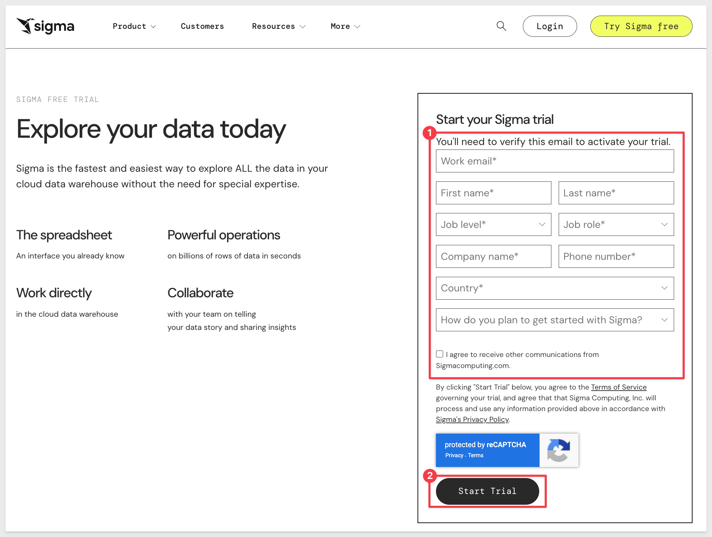

Fill out the form, click `Start Trial` and confirm the CAPTCHA.

You will receive notice that Sigma is sending an email invitation:

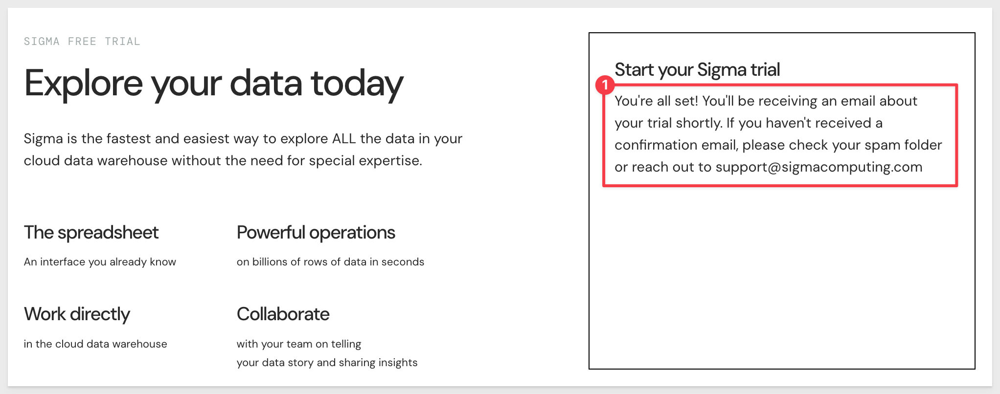

In your email application, open the email from Sigma and click `Verify Email Address`:

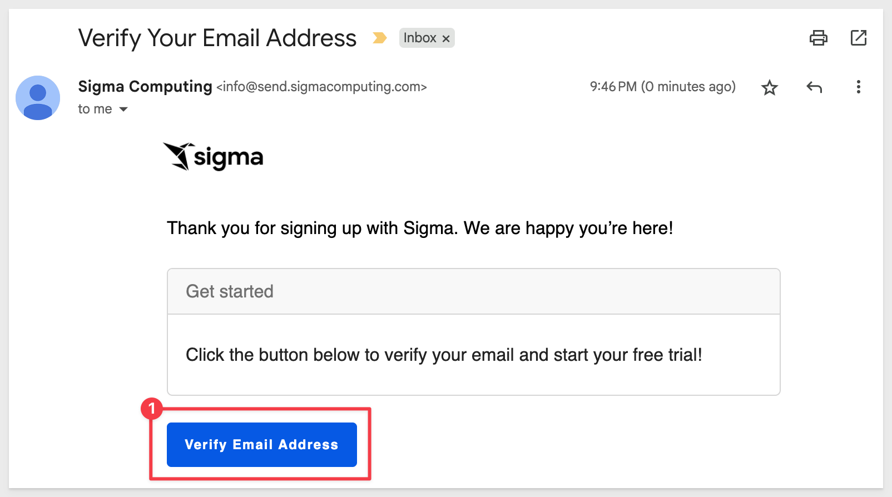

<aside class="negative">
<strong>NOTE:</strong><br> If you have not received this email within 10 minutes, please check your spam folder, and if not there, ask for assistance from support. The email will be "from" Sigma Computing using the address: info@send.sigmacomputing.com.
</aside>

When the page loads in your default browsers, enter in your `Company Name` and `Company Login URL` (if you prefer something different).

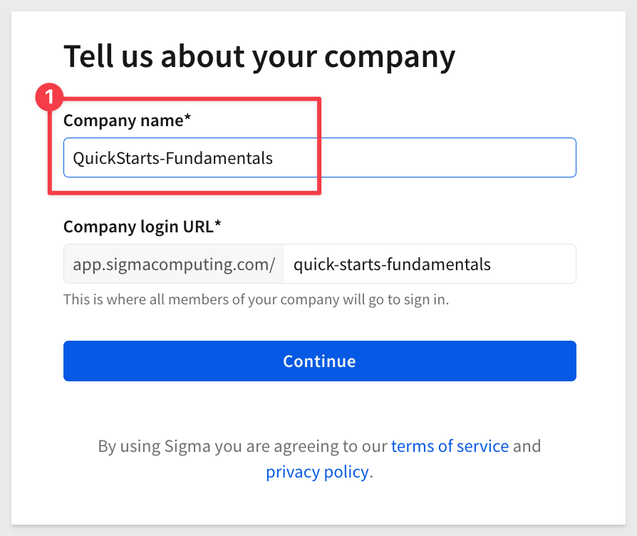

Sigma will pre-select a cloud location where the trial will be created. If location matters for your testing, click the pencil icon to select a different location. 

For example, if you are in Europe you may want to select Frankfurt:

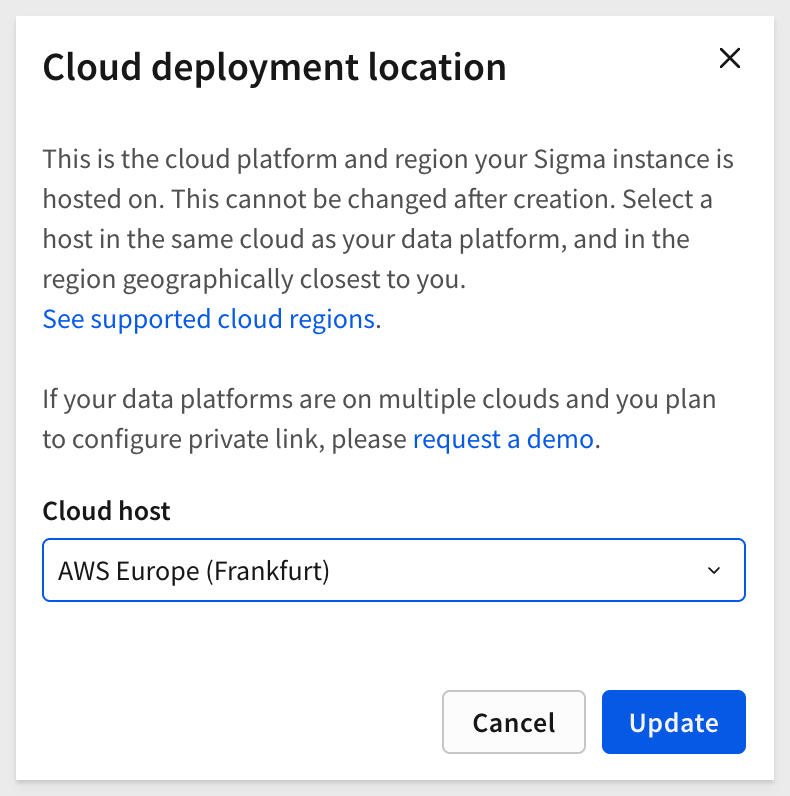

For more information, see [Supported regions, data platforms, and features](https://help.sigmacomputing.com/docs/region-warehouse-and-feature-support)

Click the `Update` and then the `Continue` button:

Next create your user profile and click the `Create` button:

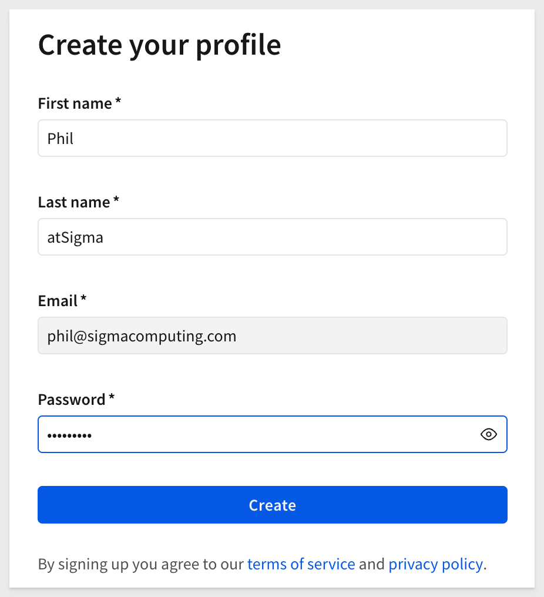

You are placed in Sigma and there is a `Trial guide` to explore too.

Click `Hide` to close the trial guide:

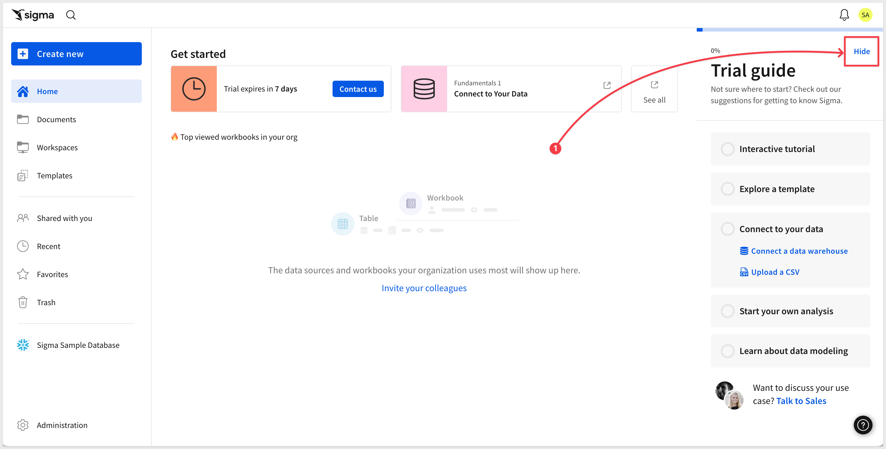

You should also receive a welcome email from Sigma:

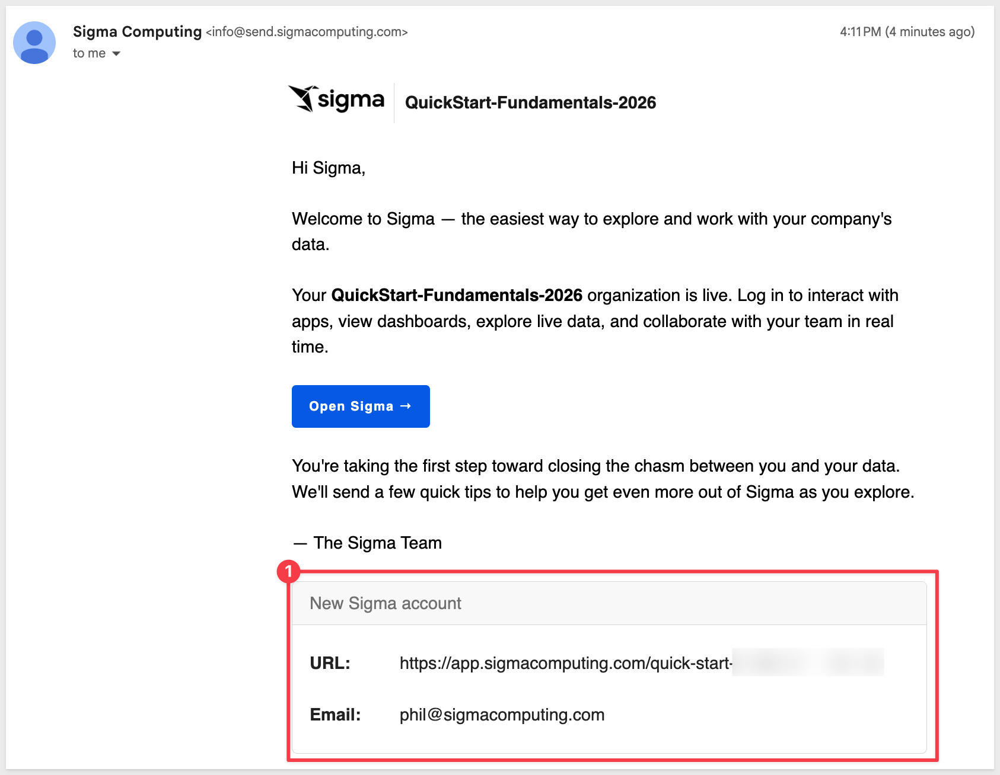

If something is not working as you expect, here is how to [contact Sigma support](https://help.sigmacomputing.com/docs/sigma-support)

<aside class="positive">
<strong>IMPORTANT:</strong><br> Trial instances are setup with administrative rights for the user who established the account. This provides access to all Sigma's default functionality, so you can explore everything. 
</aside>


<!-- END OF SIGMA TRIAL SETUP -->

## Getting Around the UI
Duration: 6

The Sigma homepage provides quick access to everything you need to get started.

<aside class="negative">
<strong>NOTE:</strong> What you see on the homepage depends on your assigned account type. Users with fewer permissions will see a more limited set of options.
</aside>

The main areas are numbered and described below:

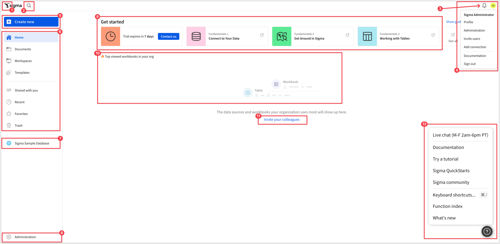

**Top bar**

 **Sigma Logo:** Click the Sigma logo in the upper left to return to the homepage from anywhere in the portal.

 **Search:** Click the search icon to find content across your Sigma environment.

 **Notifications:** The bell icon shows alerts and activity relevant to your account.

 **User Profile:** Click your initials in the upper right to access your profile, preferences, and sign-out and other options.

**Left sidebar**

 **Create New:** The blue button at the top of the sidebar is your starting point for any new content:
<ul>
  <li><strong>Workbook:</strong> The primary inteface for users and builders to view and interact with data and apps.</li>
  <li><strong>Report:</strong> A document type designed to help you create predictable, pixel-perfect PDF exports.</li>
  <li><strong>Data Model:</strong> A reusable data layer shared across workbooks and reports.</li>
  <li><strong>SQL Query:</strong> Write and run SQL directly against your connected warehouse.</li>
  <li><strong>CSV Upload:</strong> Upload a CSV file to the warehouse for analysis.</li>
</ul>

 **Navigation:**
<ul>
  <li><strong>Home:</strong> Returns to the homepage.</li>
  <li><strong>Documents:</strong> Your personal folder for content you've created.</li>
  <li><strong>Workspaces:</strong> Shared folders for organizing and sharing content with specific teams or members.</li>
  <li><strong>Templates:</strong> Pre-built workbook structures available for quick reuse.</li>
  <li><strong>Shared with you:</strong> Content others have shared with you directly.</li>
  <li><strong>Recent:</strong> Content you've accessed recently.</li>
  <li><strong>Favorites:</strong> Content you've marked as a favorite for quick access.</li>
  <li><strong>Trash:</strong> Deleted content, recoverable before permanent removal.</li>
</ul>

 **Connections:** Lists available data warehouse connections. Clicking one shows the tables and schemas you have access to. Connections are configured by administrators in the Administration section. Initially, only the `Sigma Sample Database` will be shown. This is hosted by Sigma and can be disabled by an administrator if preferred.

<aside class="negative">
<strong>NOTE:</strong><br> Trial accounts created from the Sigma website include the "Sigma Sample Database", which connects to a Sigma-managed Snowflake account. Trials created from cloud provider marketplaces may include additional connections.
</aside>

 **Administration:** Available to administrators only. Provides access to user management, connections, account settings, and more.

**Main content area**

 **Get Started:** When you first log in, this section shows trial status and recommended help documents (these are not QuickStarts but rather help docs) to help you orient quickly. Use the `Show guide` link in the upper right of this area to toggle it on or off.

 **Top Viewed:** As your team creates and uses content, the most-accessed workbooks will appear here. It will be empty at the start as there has been no activity yet.

 **Invite your colleagues:** Provides a quick method for adding users to your account. This is a configurable convenience; users in Sigma can be managed in the administration section or externally via any SAML 2.0 compatible identity management provider (ie: Okta, Auth0 ect...).

 **Help:** The help button in the lower right corner provides access to documentation, release notes, and live chat support.

<aside class="positive">
<strong>IMPORTANT:</strong><br> There is a link to "Live Chat" in this menu. Use it! Sigma is fanatical about supporting our customers.
</aside>

If you ever need to know what is new in Sigma, there are two resources:

[Release Notes](https://help.sigmacomputing.com/changelog)

We also publish a monthly summary on the "First Friday" of each month, covering everything released in the prior month, including bug fixes.

[First Friday Features](https://quickstarts.sigmacomputing.com/firstfridayfeatures/)


<!-- END OF GETTING AROUND IN THE UI -->

## Some Terminology
Duration: 6

Before diving in, it helps to understand some of the core terms Sigma uses. 

<aside class="positive">
<strong>IMPORTANT:</strong><br> Don't worry about memorizing all of these upfront — Sigma's terminology is designed to be intuitive, and most terms describe what they do. The list below covers the most common ones you'll encounter. The rest will become familiar as you explore.
</aside>

The diagram below shows how the key concepts relate to each other at a high level.

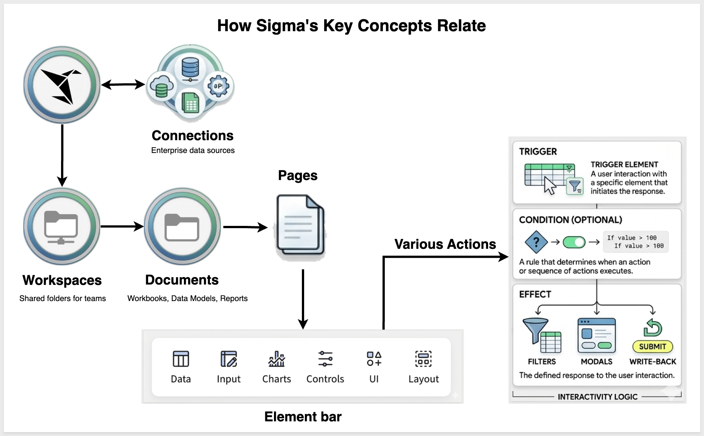

Sigma connects to your data through **Connections**, organizes content in **Workspaces**, and everything you build lives in a **Document** — a workbook, report, or data model. Workbooks contain **Pages**, and pages are built from **Elements** — tables, charts, controls, and more. **Actions** wire those elements together, turning a static workbook into an interactive app.

The following sections describe each of these core terms in more detail.

**Document Types**
<ul>
  <li><strong>Document:</strong> The general term for any content item in Sigma — workbooks, reports, and data models are all documents.</li>
  <li><strong>Workbook:</strong> Sigma’s primary document type. A workbook can contain data tables, charts, controls, and apps — all on one or more pages.</li>
  <li><strong>Report:</strong> A fixed-layout document optimized for pixel-perfect PDF exports.</li>
  <li><strong>Data Model:</strong> A reusable data layer that defines shared tables, columns, and calculations for use across workbooks and reports.</li>
</ul>

**Workbook Lifecycle**
<ul>
  <li><strong>Exploration:</strong> An unsaved, ad hoc workbook. Explorations let you query and analyze data without cluttering your folders. Save only when the work is worth keeping.</li>
  <li><strong>Draft / Published:</strong> Once saved, a workbook exists in two states — a draft (work in progress, visible only to editors) and a published version (the stable version visible to viewers).</li>
</ul>

**Workbook Structure**
<ul>
  <li><strong>Page:</strong> Each workbook contains one or more pages, similar to tabs in a spreadsheet.</li>
  <li><strong>Element:</strong> The building block of any workbook page. Every table, chart, control, input table, image, or text block is an element.</li>
</ul>

**Element Types**
<ul>
  <li><strong>Table:</strong> A spreadsheet-like data element displaying rows and columns from your connected data source.</li>
  <li><strong>Chart:</strong> A visual data element such as a bar chart, line chart, scatter plot, or map.</li>
  <li><strong>Input Table:</strong> A data entry element that allows users to add or edit data directly in Sigma.</li>
  <li><strong>Control:</strong> An interactive element — such as a date picker, dropdown, or text input — used to filter or drive other elements on the page.</li>
  <li><strong>Container:</strong> A layout element that groups other elements together on a page. Useful for visual organization and building app interactions.</li>
  <li><strong>Modal:</strong> A hidden workbook page that appears as an overlay when triggered by a user action.</li>
</ul>

**Actions**
<ul>
  <li><strong>Actions:</strong> Interactions configured on elements that trigger a response elsewhere in the workbook — such as filtering a chart, opening a modal, or writing data back to the warehouse. Actions are what transform a workbook from a static report into an app.</li>
</ul>

**Data & Connections**
<ul>
  <li><strong>Connection:</strong> A configured link between Sigma and a cloud data warehouse. Connections are set up by administrators and determine what data is available.</li>
</ul>

**Organization & Access**
<ul>
  <li><strong>Workspace:</strong> A shared folder for organizing and collaborating on documents with specific teams or members.</li>
  <li><strong>Account Type:</strong> Determines what a user can see and do in Sigma — such as whether they can create workbooks, edit data, or access administration features.</li>
</ul>

**AI**
<ul>
  <li><strong>Sigma Assistant:</strong> Sigma’s built-in AI assistant. Ask questions in plain language, generate formulas, summarize data, and more — directly inside a workbook.</li>
</ul>

There are different icons used throughout Sigma to distinguish document types and objects at a glance.


<!-- END OF SECTION-->

## Sigma Assistant and AI
Duration: 8

AI is built into Sigma throughout — not as a separate product or add-on, but as a native capability available where you already work. Whether you're writing formulas, exploring data, or building apps, AI is there to help.

### AI provider setup

Before any AI feature can be used, an administrator must configure an AI provider. Sigma supports two approaches:

- **Warehouse-hosted models** — AI runs entirely within your data platform (for example, Snowflake Cortex or BigQuery ML), so your data never leaves your environment.
- **External AI providers** — OpenAI ChatGPT, Azure OpenAI, Google Gemini and others.

For example, we configured OpenAI as our external provider in `Administration` > `AI Settings`:

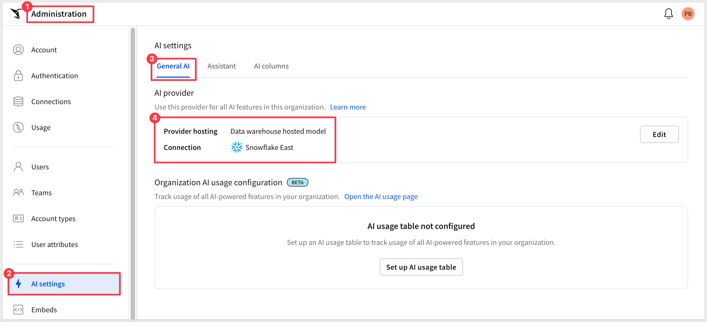

For setup instructions, see [Configure an AI provider](https://help.sigmacomputing.com/docs/configure-ai-features-for-your-organization#set-up-an-ai-provider)

<aside class="positive">
<strong>NOTE:</strong><br> Don't have an AI provider configured yet? No problem — follow along in this section to understand what's available. You can set up a provider later when you're ready.
</aside>

Once configured, `Assistant` becomes available on the homepage:

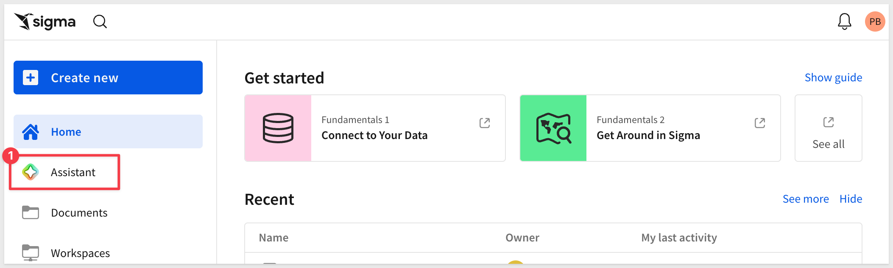

### AI features in Sigma

Once a provider is configured, AI is available in several places across the product:

<ul>
  <li><strong>Sigma Assistant:</strong> A conversational AI panel in the workbook. Ask questions in plain language, get AI-generated charts and tables, and explore your data interactively. Results open directly in a workbook for further analysis. <a href="https://help.sigmacomputing.com/docs/ask-natural-language-queries-with-ask-sigma">Learn more</a></li>
  <li><strong>Formula Assistant:</strong> Write new formulas by describing what you want, correct formula errors, or ask AI to explain what an existing formula does — all from the formula bar. <a href="https://help.sigmacomputing.com/docs/use-ai-with-formulas">Learn more</a></li>
  <li><strong>Explain this Chart:</strong> Generate an AI-powered description of any chart, including key insights and trends. The result can be copied directly into a text element alongside the chart. <a href="https://help.sigmacomputing.com/docs/explain-visualizations-with-ai">Learn more</a></li>
  <li><strong>AI Queries:</strong> Run AI-powered analysis on text data as part of your workbook calculations — sentiment analysis, classification, summarization, and more. <a href="https://help.sigmacomputing.com/docs/perform-ai-queries">Learn more</a></li>
  <li><strong>Chat Element:</strong> Embed a conversational AI interface directly on a workbook page, so end users can ask questions about the data without leaving the app.</li>
</ul>

<aside class="positive">
<strong>WHY IT MATTERS:</strong><br> These aren't isolated AI features — they're integrated into the same governed, live-data environment your team already uses. Users get AI assistance without exposing sensitive data to uncontrolled external systems, and admins retain full control over which data sources AI can access.

</aside>

### Select data sources for Sigma Assistant

Before Sigma Assistant can answer questions, you need to tell it which data sources it can use. This keeps AI grounded in trusted, approved data and prevents accidental exposure of sensitive information to third-party providers.

Navigate to `Administration` > `AI` > `Assistant`.

Search for the data source you want to enable — for example, searching for `Hands` and checking the box for `PLUGS_ELECTRONICS_HANDS_ON_LAB_DATA` in the `Sigma Sample Database` > `RETAIL` schema, and clicking `Sync`:

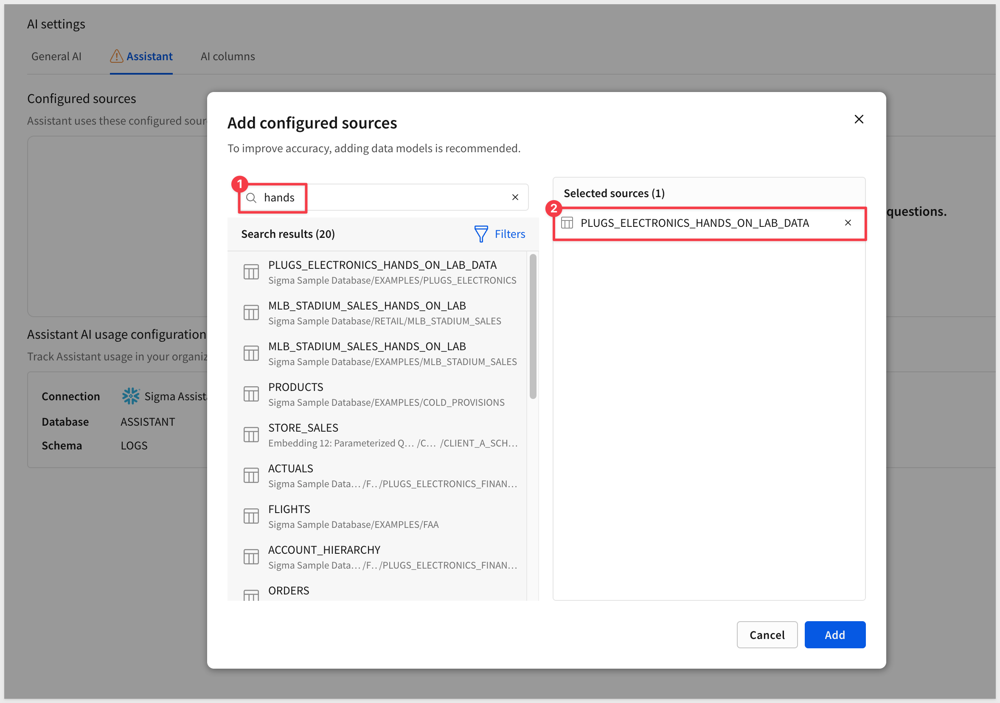

Once the sync is complete, filter on `Available` to confirm the source is ready.

<aside class="positive">
<strong>BEST PRACTICE:</strong><br> Connecting raw warehouse tables to Sigma Assistant works, but data models produce significantly better results. A data model lets your data team pre-define column names, descriptions, and metrics that AI uses to interpret your questions accurately. Instead of guessing what a column called <code>QTY_NET</code> means, Sigma Assistant can reference a model where it's already labeled "Net Quantity Sold" with a clear description. The more context your data model provides, the more accurate and useful the AI responses will be.

For more information, see <a href="https://help.sigmacomputing.com/docs/get-started-with-data-modeling">Get started with data modeling</a>.
</aside>

After clearing the search filter, we see the table is `HIGHLIGHTED`. In our case there is a `CUSTOMERS` table on the list but `NOT HIGHLIGHTED`. This is listed because it was recently used, so Sigma listed it as a convienence but since it is not  `HIGHLIGHTED`, it is not available to the Assistant:

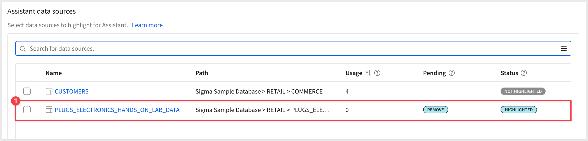

### Hands-on: Sigma Assistant

Sigma Assistant changes how you start an analysis. Instead of deciding what to build first, you start with a question.

From the homepage, click the Sigma logo icon and select `Sigma Assistant`:

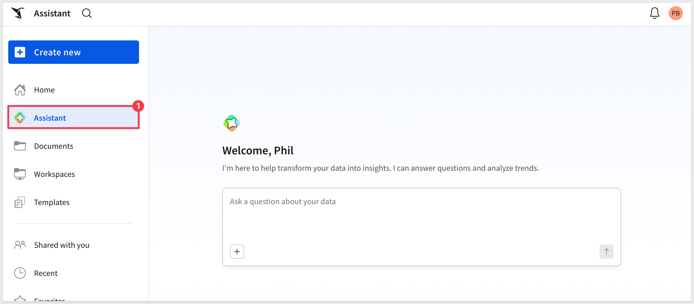

The Sigma Assistant interface is straightforward — type a question, and it will work to answer it using the data sources you've made available. 

Let's confirm the `CUSTOMERS` table is not available and see what Assistant does have access to:
```copy-code
What data sources do you have access to?
```
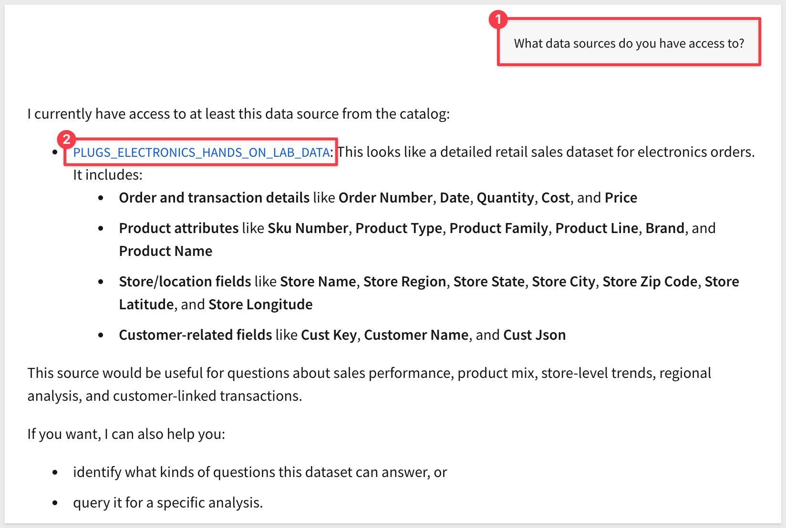

Now let's ask a focused business question:
```copy-code
The CEO wants to know the bottom ten stores in the chain.
```

Sigma Assistant explains what it's doing at each step and why. For those who need to see it, the SQL query used is shown:

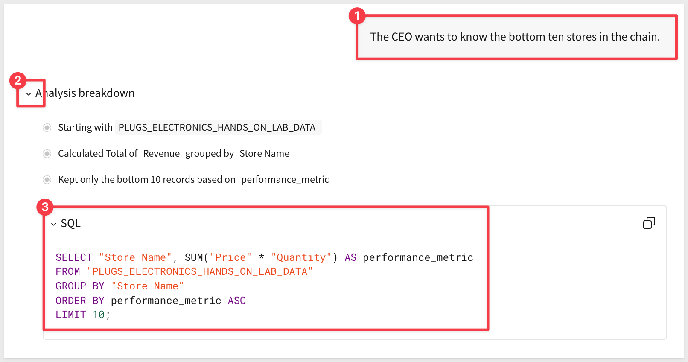

You can see the logic behind the result, adjust any step, and follow your curiosity into the data:

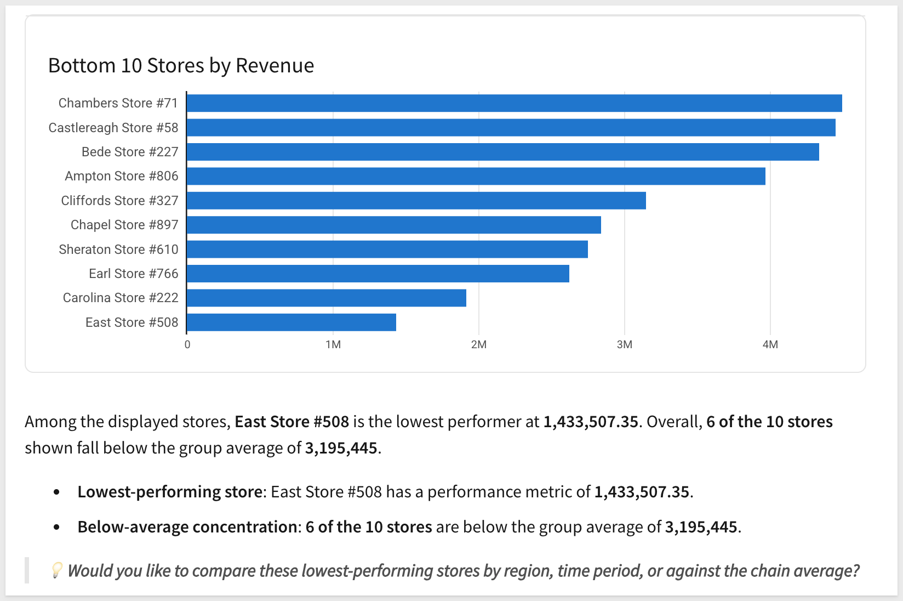

Once the response is ready, you'll see a full explanation, chart options, and the ability to open selected results directly in a workbook for further analysis by clicking the `Explore` icon.

<aside class="positive">
<strong>NOTE:</strong><br> Before launching into a workbook, you can continue asking Sigma Assistant follow-up questions to refine the results. Ask for a different breakdown, narrow the date range, filter by product type, or explore a different angle entirely. Only open the workbook when you're ready to save and build on the results.
</aside>

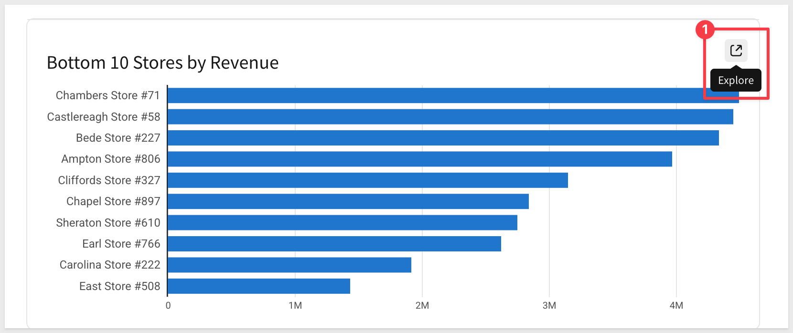

Once in the workbook, we see that two tables and the chart are included (after moving them around a bit) and Assistant handled the grouping and calculation required to answer the question:

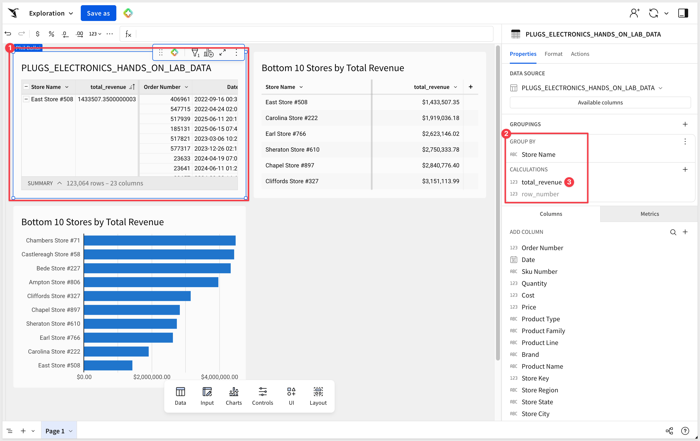

Now we can save it, refine it, or use Sigma's [drill-down](https://help.sigmacomputing.com/docs/view-underlying-data) capabilities for deeper analysis. We'll continue building on this workbook in the next section.

We can still access `Assistant` in the workbook by clicking the 
 icon:

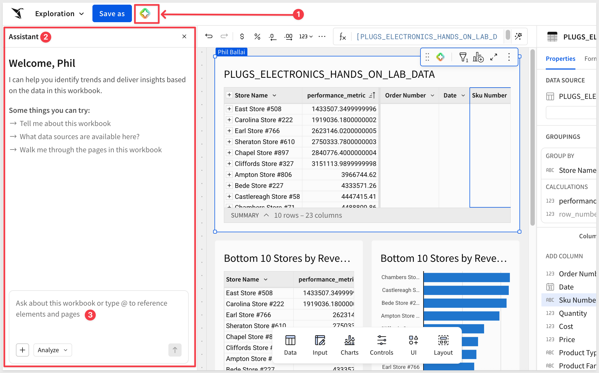

### Formula Assistant

The Formula Assistant is available directly in the formula bar of any workbook or data model. It can:

- **Write a formula** — describe what you want to calculate, and AI suggests the formula
- **Correct a formula** — if Sigma detects an error, AI interprets your intent and suggests a fix
- **Explain a formula** — AI describes what an existing formula does in plain language

It becomes available when a table is selected:

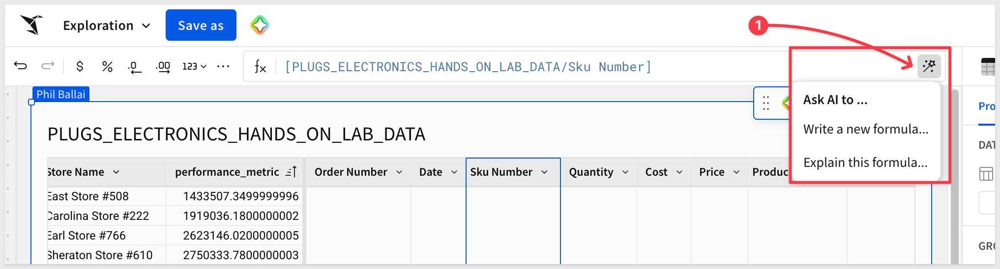

Notice that Sigma Assistant generated a column called `performance_metric`. It's not immediately obvious what that column is calculating. This is a perfect use case for the Formula Assistant's `Explain this formula` capability.

Click the `performance_metric` column to select it. In the formula bar, click the AI wand icon and select `Explain this formula`:

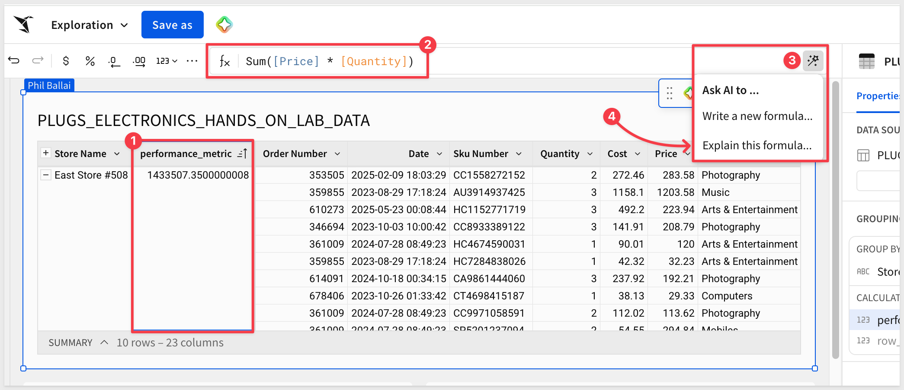

The Formula Assistant will return a plain-language explanation of exactly what the formula calculates — what columns it references, how the calculation works, and what the result represents:

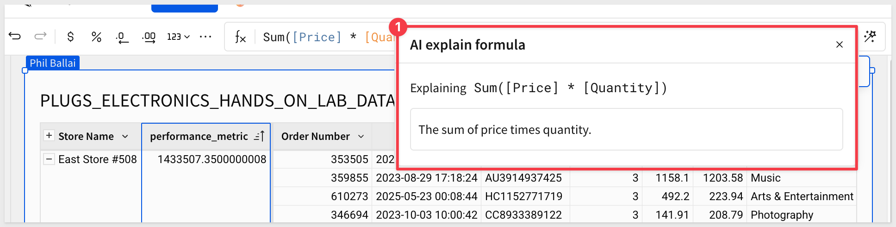

While this is a very basic example, this is an important pattern: Sigma Assistant generates analysis quickly, and the Formula Assistant lets you verify what was built. You stay in control of the results, even when AI does the initial work.

For more information, see [Use AI with formulas](https://help.sigmacomputing.com/docs/use-ai-with-formulas)

For more information on all AI features, see [Get started with AI in Sigma](https://help.sigmacomputing.com/docs/getting-started-with-ai)


<!-- END OF SECTION-->

## Workbooks
Duration: 6

There are different paths when creating content in Sigma, but we will focus on the most common methods in this QuickStart. 

So you can get started quickly, Sigma provides some common data in the `Sigma Sample Database`.

At the lower-left of the home page, click on `Connections` and then click the `Sigma Sample Database`:

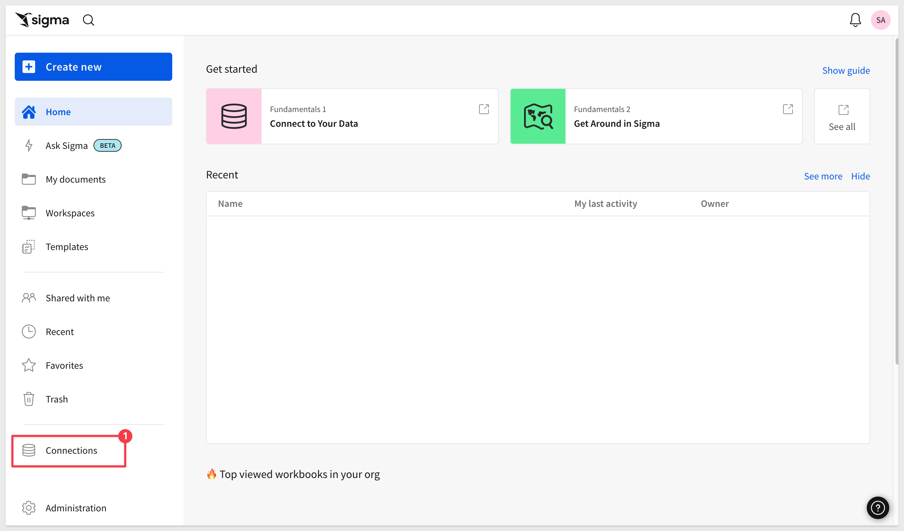

We can see all the different data available, and we are prompted to `Select a table to preview`. 

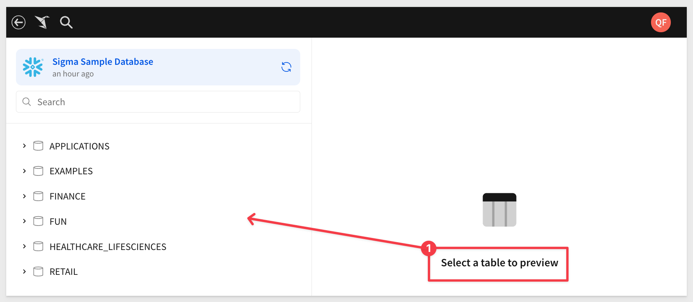

<aside class="negative">
<strong>NOTE:</strong><br> This interface allows you to quickly preview the columns and data that is available, so it is easy to decide which table has the information needed.
</aside>

Select the `Plugs_Electronics` ("Plugs”) schema in the `RETAIL` database, expand it and select the `F_SALES` table. 

We can see all the data that is **live in the cloud data warehouse**, assuming we have permission to view it. 

In item #5, we can see the total row count is about **717k+ rows in 6 columns**.

We are looking at the data (in the **Overview** tab), but we can also look at column details, metrics, links, lineage and permissions too.

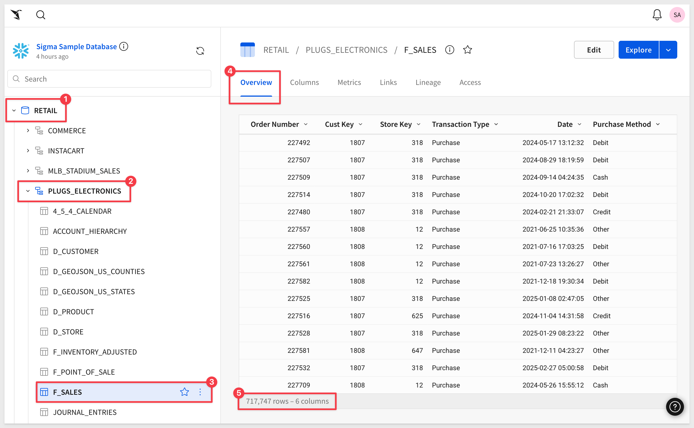

<aside class="positive">
<strong>IMPORTANT:</strong><br> There is a lot more we can do with this table in this interface such as "pre-assign" friendly column names, create metrics (pre-defined calculations), assign permissions and more.
</aside>

To begin our analysis, we want to begin exploring this data. Click the `Explore` button in the upper right corner (**click the button, not the drop arrow**).

<aside class="positive">
<strong>IMPORTANT:</strong><br> The "Explore" drop menu also provides a means to use this table as a starting for data modeling. 
</aside>

The explore button has opened a new workbook for us, and placed the `F_SALES` table on it too:

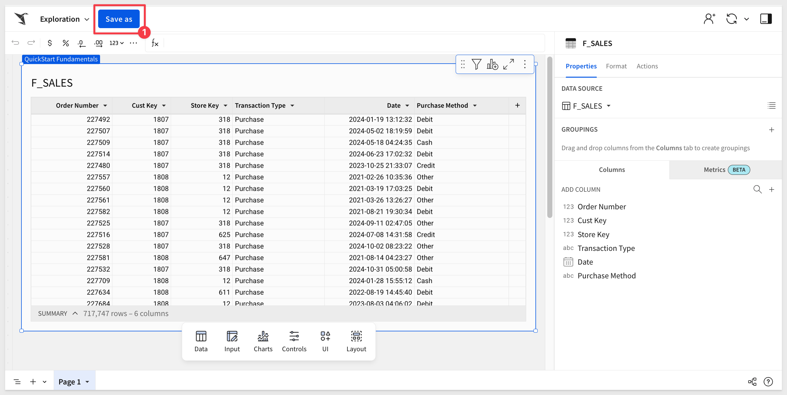

**Now this is important to understand:**

In Sigma, all workbooks remain purely exploratory until you actively save the first version.

Often, ad hoc analysis is only needed in the moment—why clutter folders with one-off documents that will never be used again?

If you create something valuable, you can save it, and continue building on it later. Otherwise, you can simply abandon the unsaved workbook.

<aside class="negative">
<strong>NOTE:</strong> Workbooks support data from multiple sources. This data can come either from tables in your cloud data warehouse (CDW), from your organizations datasets/datamodels in Sigma or from CSV files upload into Sigma.
</aside>

Now that we have our first unsaved workbook, let's take a moment to review some of the features.

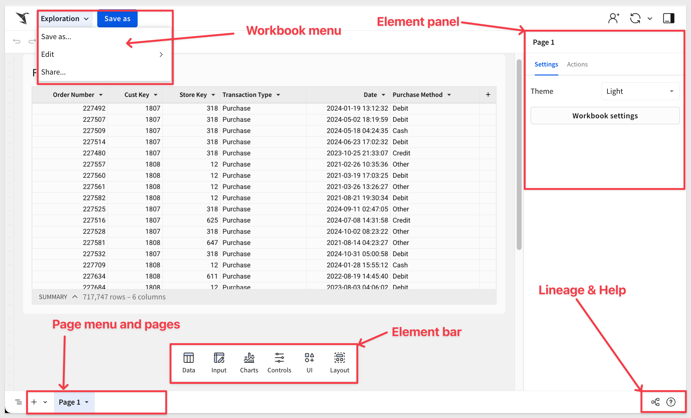

Each `workbook` can have one or more `Pages`, and each page has its own canvas or working area. For example, `Page 1` has the `F_SALES` table on its canvas. 

Objects on a page's canvas are called `Elements`. Examples are tables, charts, controls, buttons, text and so on. 

The `Element Panel` is active when one element on the canvas is selected and allows configuration for the selected element.

Click on the `F_SALES` table. When an element on the canvas is selected, it will have a blue border and the `Element Panel` will show the related configuration:

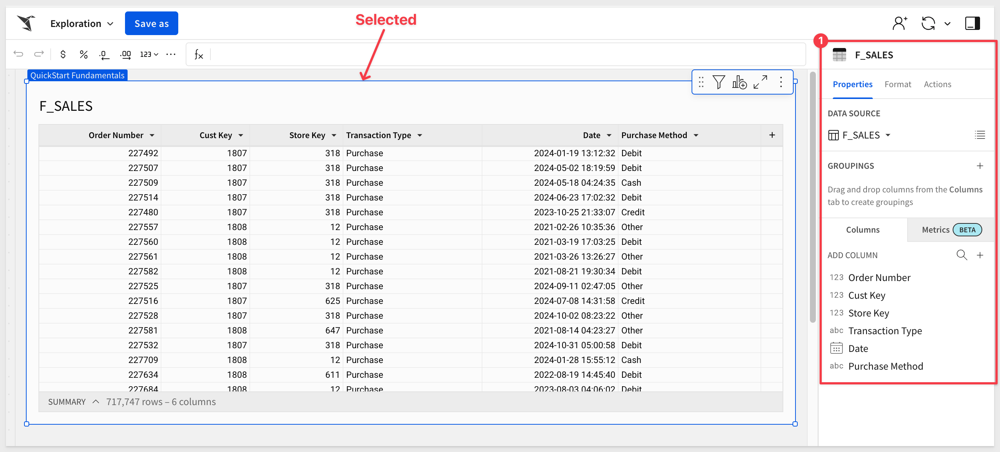

When the `F_Sales` table is selected, we can access the toolbar, formula bar and table features. We will explore these more later, but note that icons for undo and redo are present. These are really handy, and will be used often.

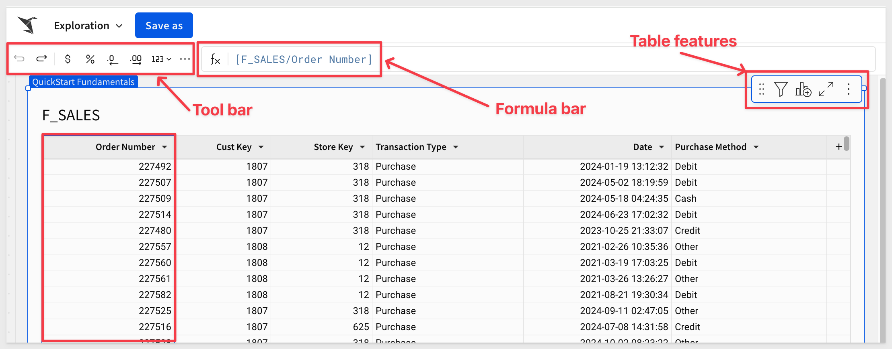

<aside class="positive">
<strong>IMPORTANT:</strong><br> Use the Undo and Redo arrows in the toolbar instead of the browser's back button.
</aside>

The `Formula bar` is where we can leverage Sigma's [extensive library of functions. ](https://help.sigmacomputing.com/docs/popular-functions)

You can collapse the `Element Panel` by clicking on the  icon in the upper right corner of the page.

The `Element Bar` is always shown (except when the collapse icon has been selected), and provides a simple way to drag and drop elements onto the canvas. They are grouped logically, so it is easy to find what you need. 

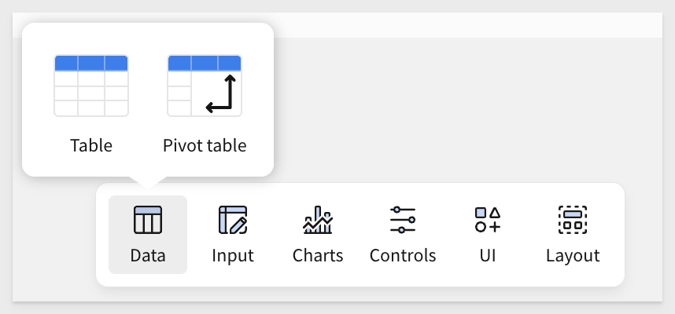

Let’s save this workbook for now. Click the `Save As` button in the upper left corner. 

It is best practice to name workbooks something that makes sense to you and others you might share this workbook with later.

Notice that we are given options on where to save it, using a familiar folder structure. 

Click `Create Folder` and name it `QuickStarts`. Then click into the `QuickStarts` folder, and name the workbook `Fundamentals`:

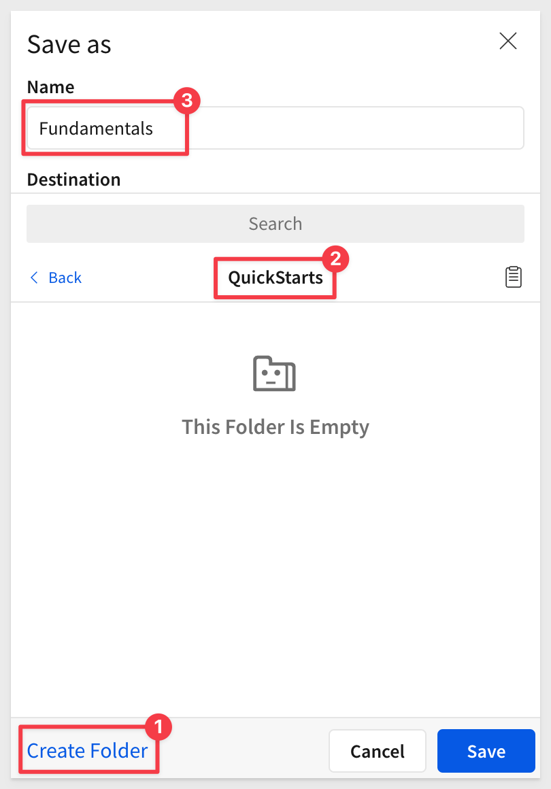

Workbooks have a menu that is accessed by clicking the down-arrow to the right of the name.

Open that and select `About this workbook`:

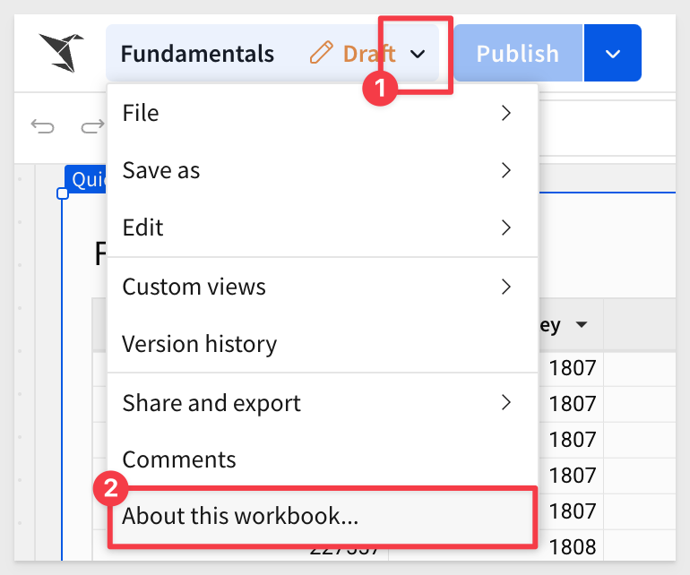

Clicking the star icon adds the workbook to your favorites list, which appears on the homepage.

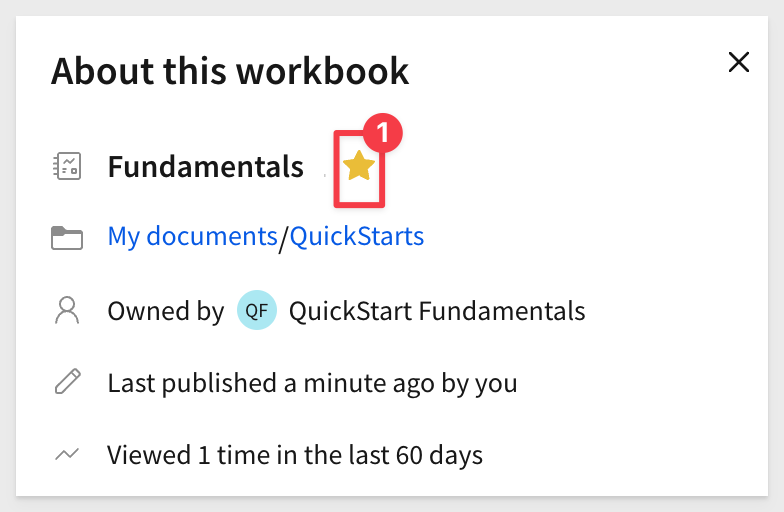

You can also set a `Badge` on a workbook, to inform other users about the current state of the work. For example, `Endorsed` or `In Development`, and also leave a text comment to provide more context. 

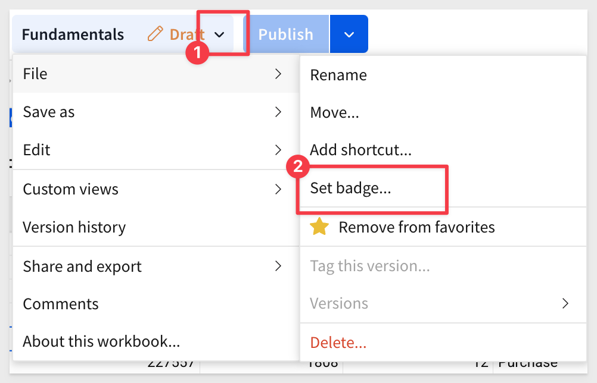

Once set, the workbook will show both the endorsement and the text:

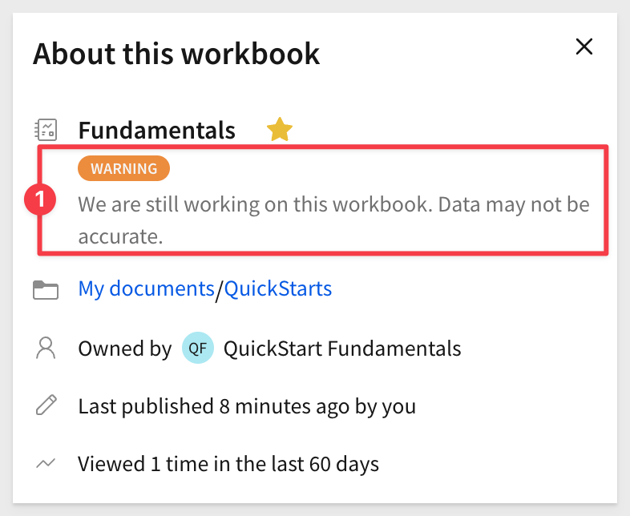

Now that you have saved the workbook, we are in `Draft` mode and the  `Publish` button is grey, indicating that we have no unpublished changes pending. We are still in `Editing` mode. 

The `Publish` button is not active until we make some other change.

Opening the `Publish` menu provides additional options:

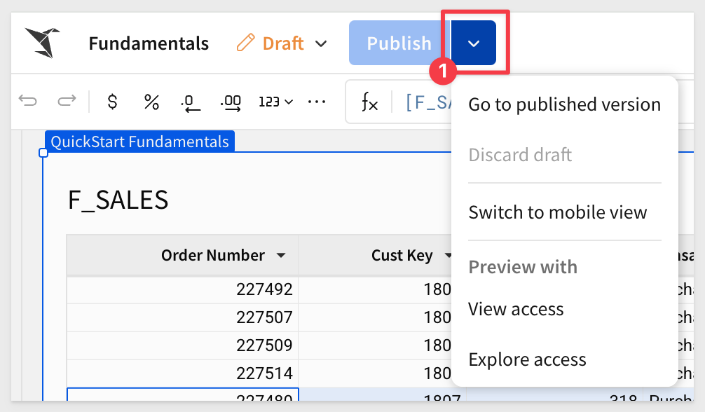

**These options allow you to:**
<ul>
      <li>View the workbook as all users will see it in production.</li>
      <li>Throw away and changes that were made in an unpublished draft.</li>
      <li>View as if using a smaller screen device.</li>
      <li>Preview with different access rights applied.</li>
</ul>

<aside class="positive">
<strong>IMPORTANT:</strong><br> Sigma has many more features to help address the need for version control.
</aside>

[For more information on workbook version history, click here.](https://help.sigmacomputing.com/docs/workbook-versions-and-version-history)

[For more information on version tagging (control) in Sigma, click here.](https://help.sigmacomputing.com/docs/version-tagging)

### Viewing the published version
After clicking on `Go to published version`, the header now shows options to return to `Edit` mode and an icon that allows you to customize the workbook with changes only visible to you. This is a great way to repurpose an existing workbook to suit your specific needs. 

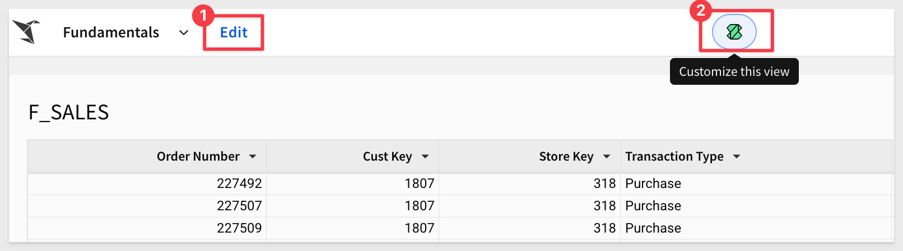

Once you make changes in the `Custom view`, you can opt to save them as a new workbook or discard. 

Click the `Close view` button and click the `Edit` text to return to editing mode.


<!-- END OF WORKBOOKS -->


## Pages
Duration: 6

Each workbook page has its own canvas and can be made to operate independently of others, or not.

For example, on one page, we may want to have the data and controls you are using to drive the content on other pages. 

On another page, we may want to provide some instructions for the users.

### Create a data page
A dedicated data page in a workbook can be useful for storing information that other users don’t need to see. However, elements on the data page can still be easily referenced on any other workbook page.

In the lower left corner of the workbook there is a page tab called `Page 1`. 

Double-click on the `Page 1` text and rename the page to `Data`. 

Add a new page and name it `Dashboard` for now.

Drag the `Dashboard` page to be first in line.

Click the menu arrow on the `Data` page and select `Hide page`:

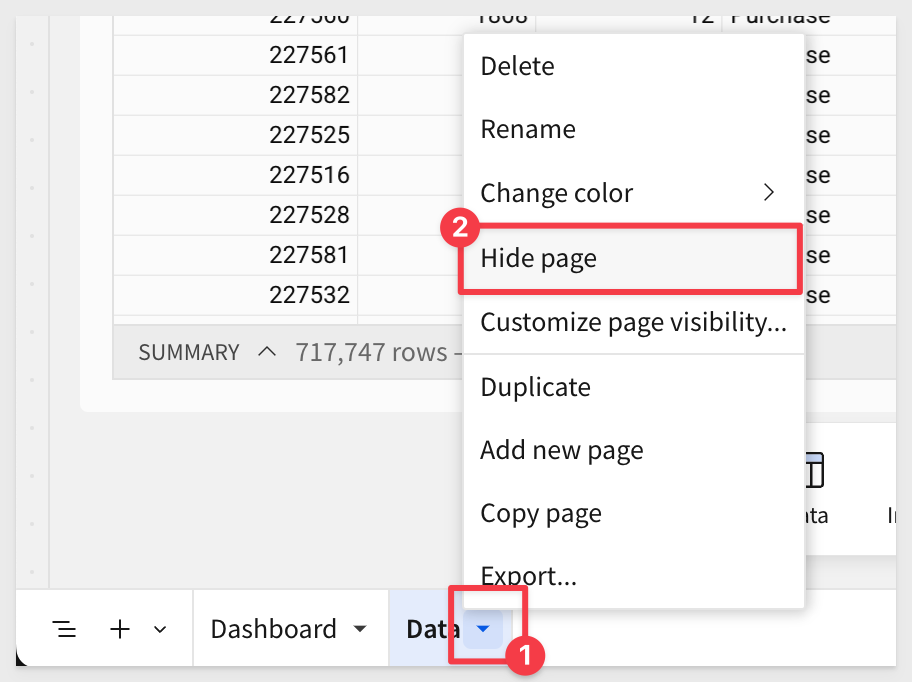

The `Data` tab will now carry an icon to indicate that it will not be visible to users who do not have edit rights.

On the `F_SALES` table, open its menu and select `Move to` > `Dashboard`:

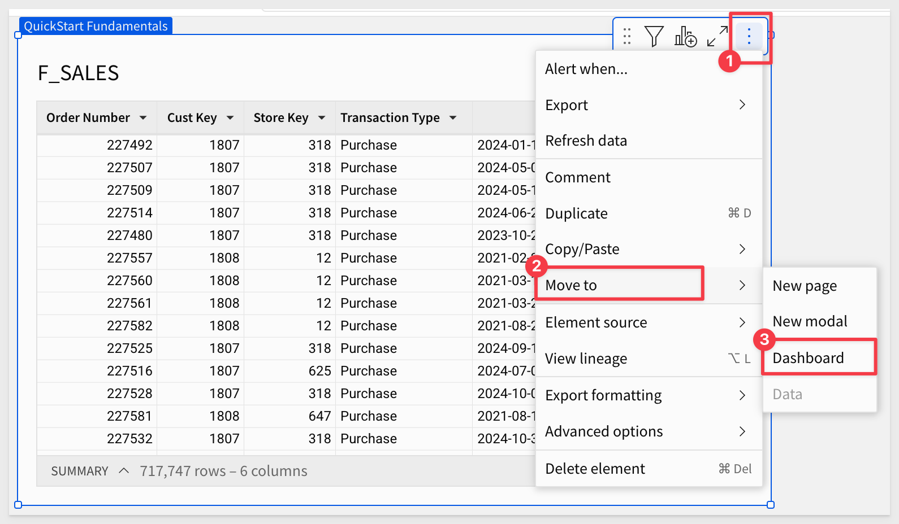

<aside class="positive">
<strong>IMPORTANT:</strong><br> It is easy to move elements between pages and any associations that an element has to other elements is automatically maintained. This "automatic association" is what allows us to have a "Data" page that is hidden from user, but contains elements that we can reference in any other page.
</aside>

Click `Publish`.

### Use a page for instructions or useful information
Creating a dedicated workbook page to inform and assist users who are looking at the workbook is a best practice.

As an example, the image below is the `Home` page from the `Financial Services: Portfolio Risk Modeling` workbook. It has informative text along with some navigation buttons along the top:

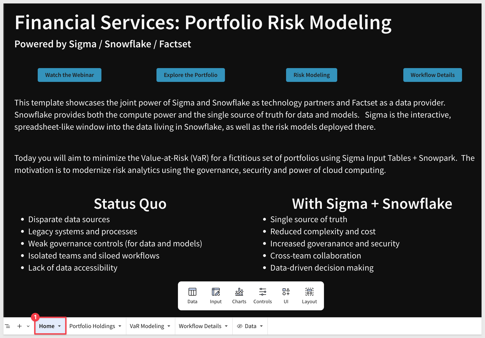

There are many pre-built [templates](https://help.sigmacomputing.com/docs/get-started-with-workbook-templates) that you can explore, see how things are configured, and use for your own projects. 

You can even create templates from your own workbooks too:

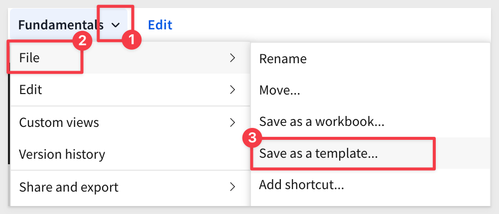


<!-- END OF PAGES -->

## Layout Elements
Duration: 6

Sigma offers several layout elements that help you structure workbook pages, improve navigation, and create interactive user experiences. Each element is designed to make your content more organized, visually appealing, and easier to use. 

Having all these options allows you to get creative with workbook functionality and design—encouraging your users to engage with and return to your workbooks.

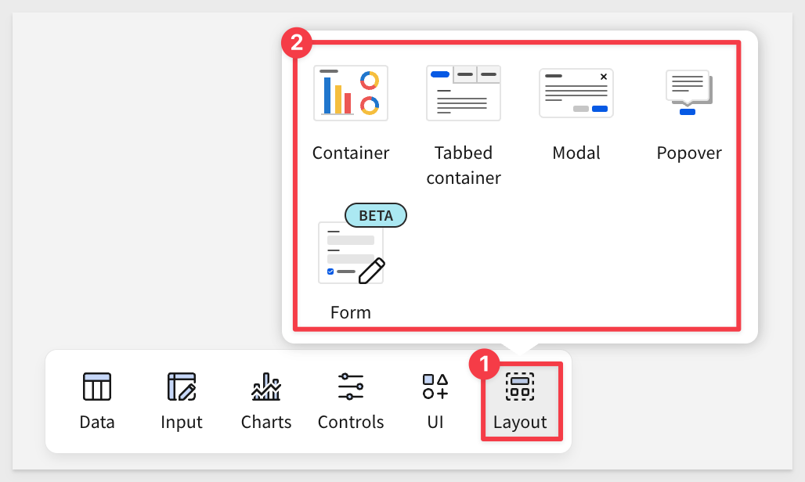

### Containers
Sigma's container feature allows you to organize workbook pages by grouping elements within a customizable container. 

This provides an intuitive way to manage layouts, ensuring that related elements remain visually cohesive. 

Containers not only streamline the design process by enabling you to adjust and style grouped components collectively, but also enhance flexibility when rearranging or resizing elements on the canvas. 

This powerful feature simplifies complex workbook structures, making it easier to maintain consistency in both functionality and appearance.

In the animation below, we show how containers dramatically improve the appearance of existing Sigma workbooks.


To learn more about using containers, see [Organize workbook layouts with containers](https://help.sigmacomputing.com/docs/organize-workbook-layouts-with-containers)

### Tabbed Container
Tabbed containers let you organize related content into separate tabs within the same space. This saves screen real estate, reduces scrolling, and allows users to easily switch between different views or datasets without leaving the page.

An example can be seen on the `Administration` > `Usage` page where the content actually uses nested tabbed containers:

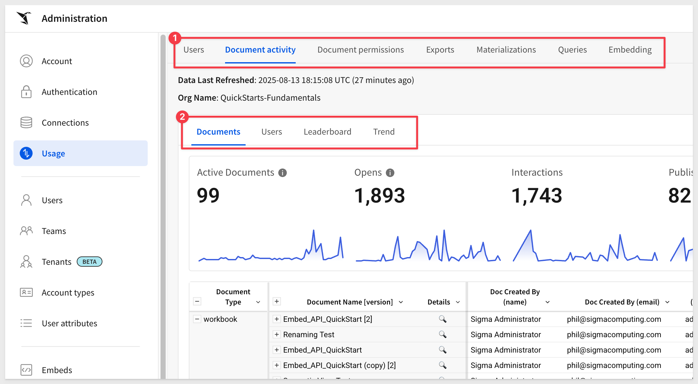

### Modal
A modal is a pop-up window that overlays the workbook. Modals are ideal for highlighting important content, collecting input, or guiding users through a focused interaction without navigating away from the main page.

Modals can be used for simple things like confirming a change or complex as shown in the [Approvals QuickStart](https://quickstarts.sigmacomputing.com/guide/dataapps_approvals_flow/index.html?index=..%2F..index#0)

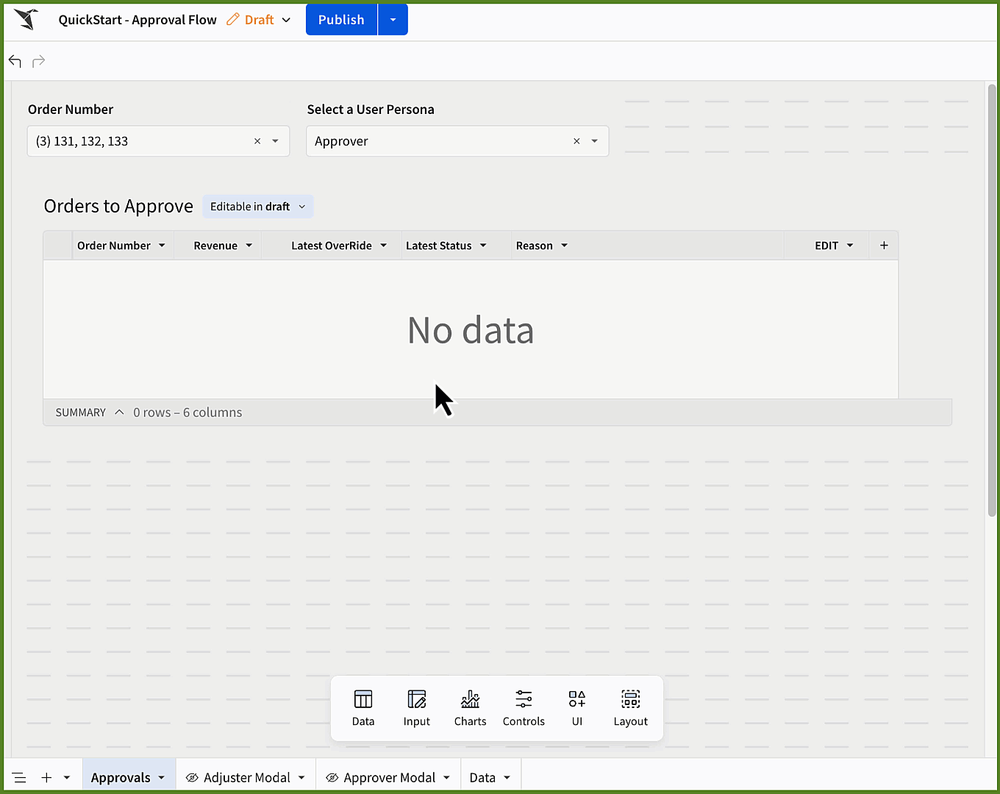

### Popover
Popovers display additional information or interactive controls in a small floating panel triggered by a click or hover.
They’re perfect for providing contextual help, quick filters, or small forms without cluttering the main layout.

An example can be seen on the `Administration` > `Usage` page where a popover is used for filters, freeing up space:

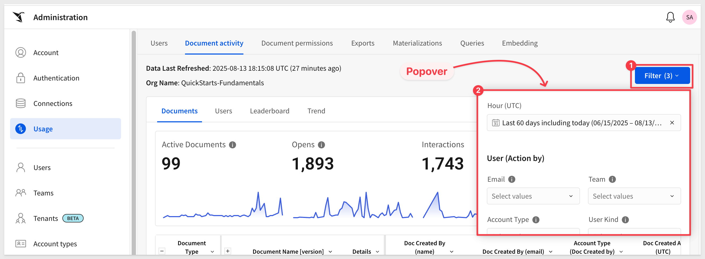

### Form
Forms enable users to input and submit data directly within a workbook. They can be used to capture user feedback, send parameters to queries, or write data back to your warehouse—bringing interactivity and data collection directly into your Sigma dashboards.

There is a QuickStart, [Forms: Quick Capture and Analysis with Sigma](https://quickstarts.sigmacomputing.com/guide/dataapps_create_a_form_simple/index.html?index=..%2F..index#0) that walks through the process of using forms to capture trade show leads.

Here is an example of a form for capturing trade show leads:

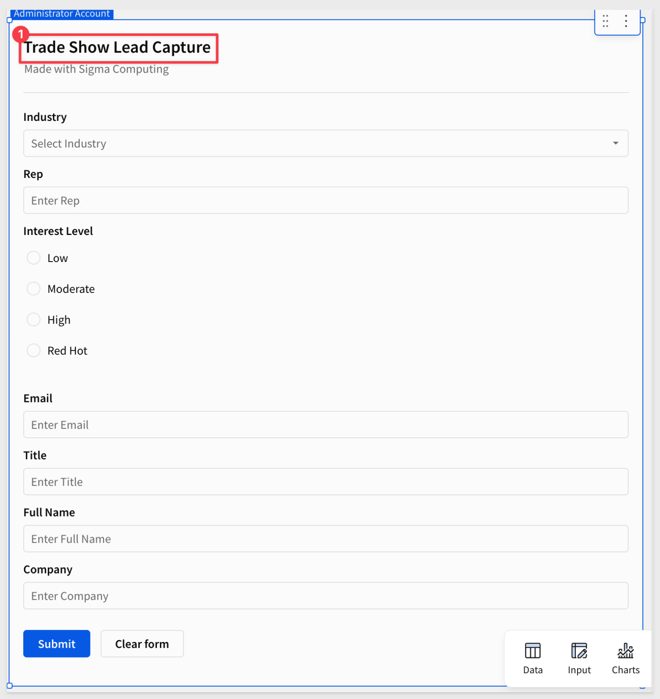


<!-- END OF PAGES -->

## Account Types
Duration: 6

<aside class="negative">
<strong>NOTE:</strong><br> This section is useful to understand how different users may use Sigma. If you are not involved in those decisions, feel free to skip to the next section.
</aside>

Sigma’s licensing model includes tiers that define the usage terms of your organization members: `View`, `Act`, `Analyze` and `Build`. 

If your organization utilizes older Lite/Essential/Pro license model, [refer to this document.](https://help.sigmacomputing.com/docs/create-and-manage-account-types-2024)

Each license tier establishes a different set of available permissions that enable access to Sigma’s features and capabilities. 

At a high-level, this is what each tier provides:

<ul>
  <li><strong>View:</strong> Suitable for report consumers who need access to prepared data and insights with baseline interactions.</li>
  <li><strong>Act:</strong> Ideal for collaborative data contributors who actively input and update data.</li>
  <li><strong>Analyze:</strong> Optimized for decision-making data consumers who require more deep-dive capabilities without building workbooks themselves.</li>
  <li><strong>Build:</strong> Designed for data architects, BI analysts, and report builders who model, transform, and analyze data.</li>
</ul>

<aside class="negative">
<strong>NOTE:</strong><br> The Build license also is used for system administrators. The key difference is that an administrator has an elevated account type. This allows them to manage organization settings and users and so on.
</aside>

As an `administrator`, we can see these default account types by navigating to `Administration` > `Account Types`.

Here we see the default types, description and can also create a new custom account type.

Custom account types provide the ability to define a granular permission level using `Account Types`. 

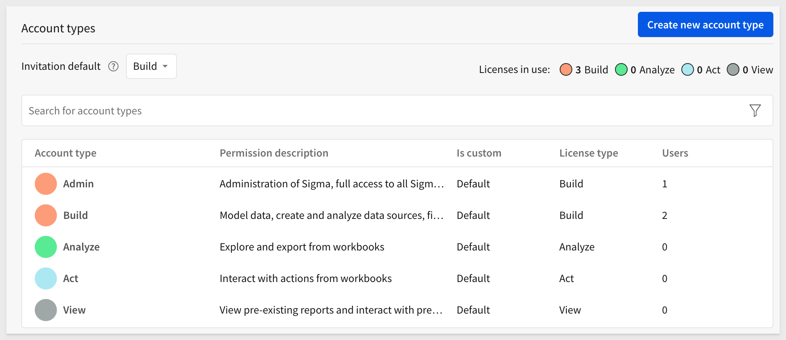

For more information, see [Account type and License Overview](https://help.sigmacomputing.com/docs/account-type-and-license-overview)


<!-- END OF SHARING -->

## Sharing
Duration: 6

Sharing in Sigma is simple. Permissions to access a Sigma document can be granted, modified, or revoked by either the document’s owner or an organization admin. 

Return to the `Fundamentals` workbook, and click the `Share` icon in the upper right corner of the workbook:

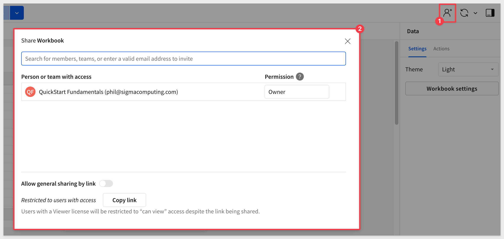

In the share modal we can select a team or member that we want to share the workbook, and at what permission level.

For example, we invited another user (using [Gmail's alias feature](https://support.google.com/a/answer/33327?hl=en)) and set their permissions to `Build`.

Now we can share the workbook with that new user and select the level of access we want to allow. 

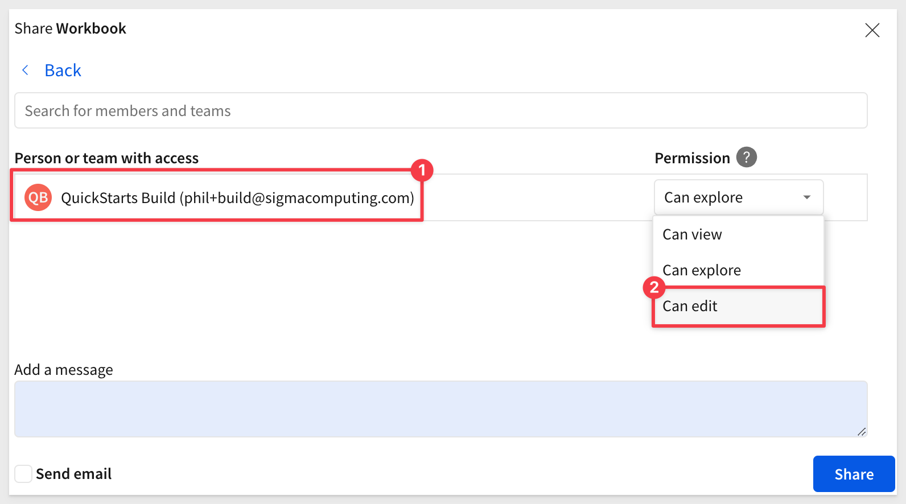

The new user can see the workbook by navigating to `Shared with me` on the homepage:

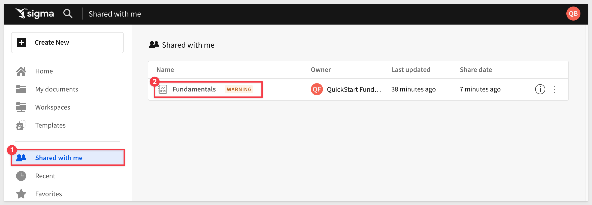

### Live edit

When we are both viewing / working in the same workbook, we can see each others activity.

<aside class="negative">
<strong>NOTE:</strong><br> To use live edit, users need to have `Edit` access.
</aside>

For example, if both users have the table selected:

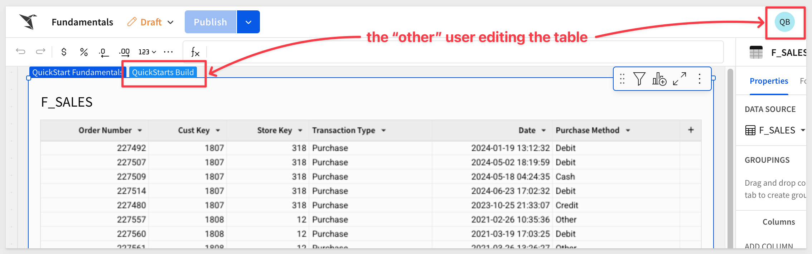

<aside class="negative">
<strong>NOTE:</strong><br> We simulated this using two different browsers, each with a different user logged into Sigma.
</aside>

For more information, see [About sharing with users, teams, and all organization members](https://help.sigmacomputing.com/docs/share-a-workbook#about-sharing-with-users-teams-and-all-organization-members)


<!-- END OF SHARING -->


## Scheduling
Duration: 6

Sigma workbooks support the ability to export data immediately or on a user-defined schedule.

Open the workbooks menu and select `Share and export` > `Scheduled exports...`:

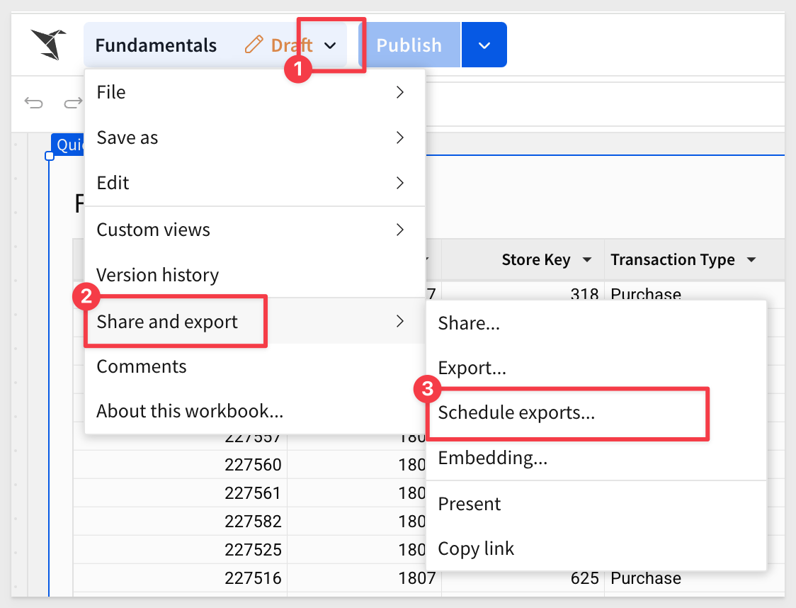

In the modal window, click `Add Schedule`

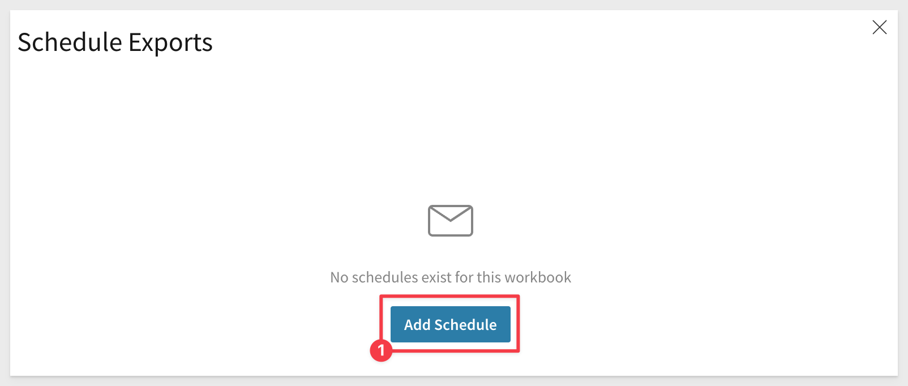

We are able to customize several areas of this operation. 

### Export (select a type)
There are many destinations supported. Click the desired icon, provide one or more recipients, a subject and message:

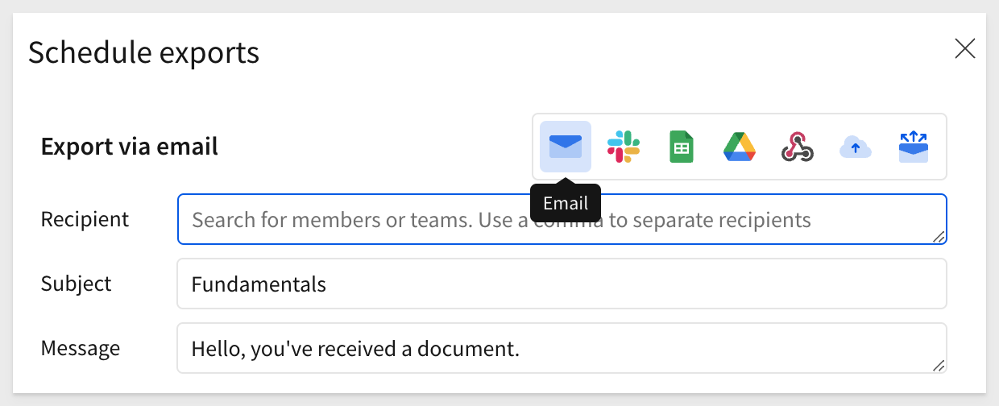

### What to attach
Add one or more attachments, the format and orientation to include with the export:

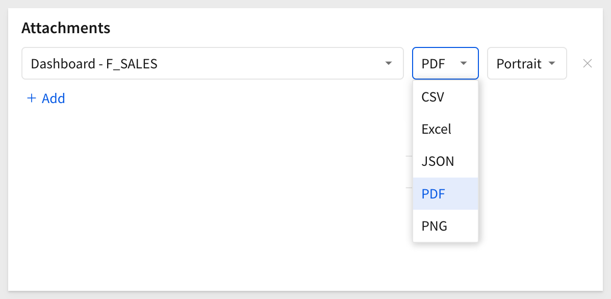

Use the  `+ Add another attachment` to build a message from more than one part of a workbook.

### Frequency & Conditions
A really powerful feature, is the ability to configure specific conditions that must be satisfied, in order for the export to occur:

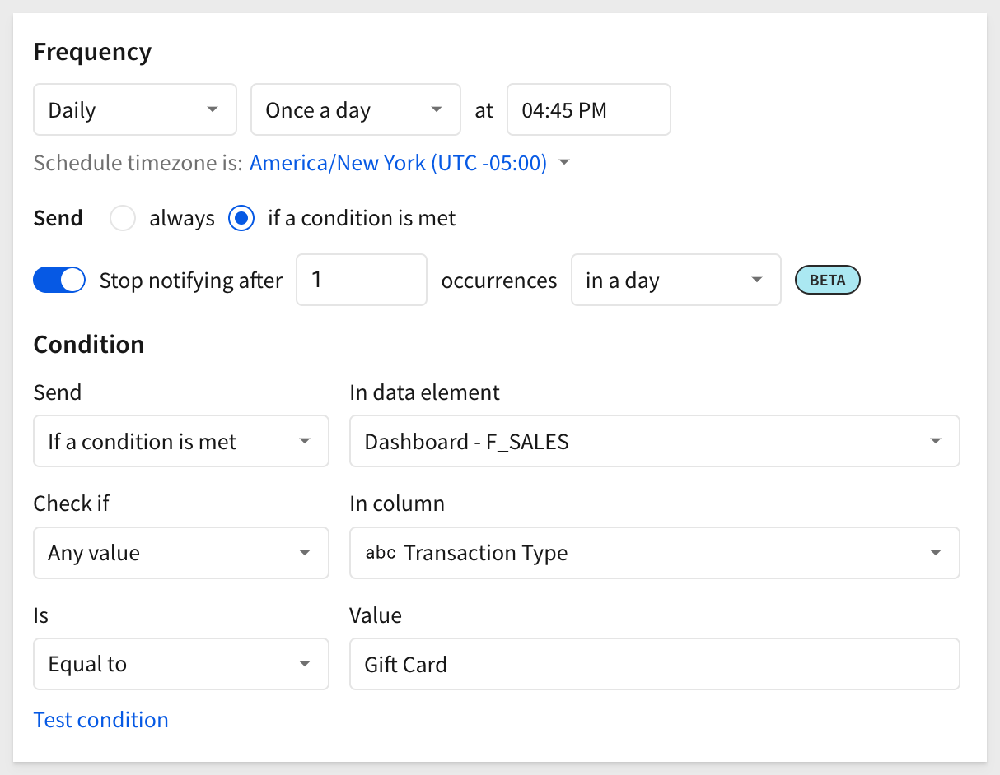

This can create some really interesting workflows and notifications to drive actions and efficiency.

The ability to validate any condition before it is put into service is an important step. By clicking the `Test condition` button, we can see while our condition seemed valid, the data does not agree:

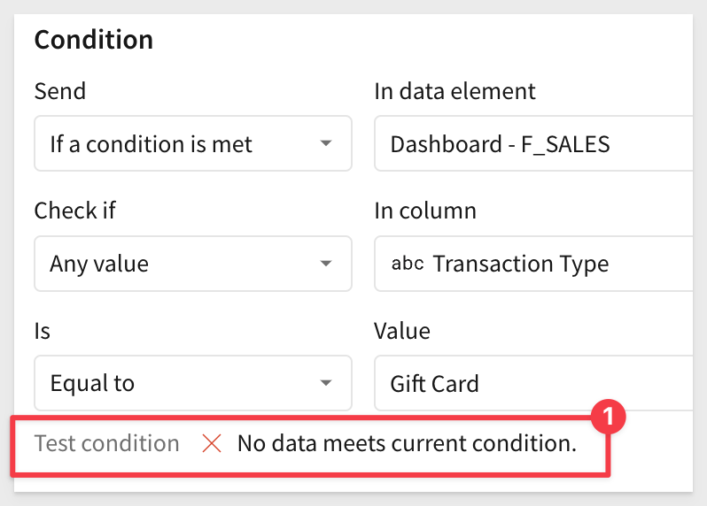

### More options
For workbooks that have parameter-driven data based on the user, sent items can be run with data filtered for the recipient:

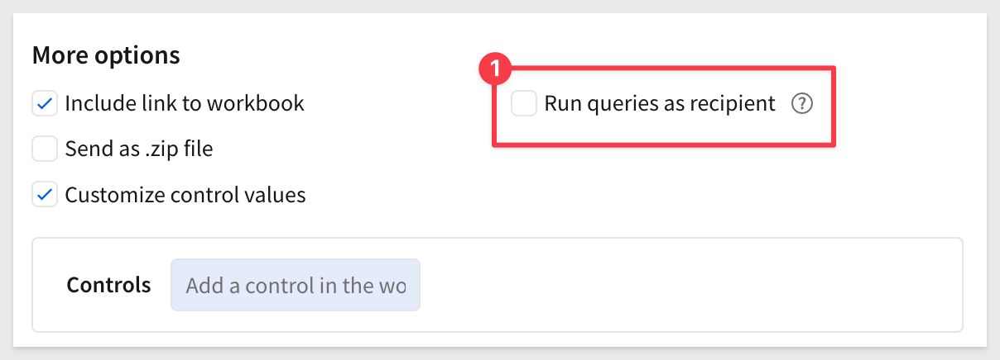

A very powerful feature of scheduling allows us to deliver reports deterministically, based on control parameters.

For more information, see [Filter by control values](https://help.sigmacomputing.com/docs/configure-additional-options-for-exports) on this page.

### Managing my workbook schedule
Once a user creates a schedule, it is shown on the `Schedule exports` modal. At this point, we can take some `Action` on it, including running it now:

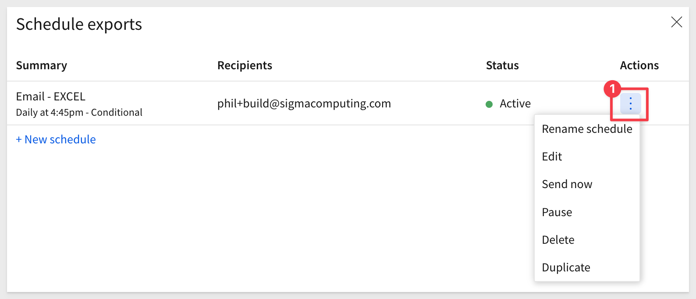

### Administrative control
Once created, administrators can see it on the list of available `Exports` in the `Administration` section:

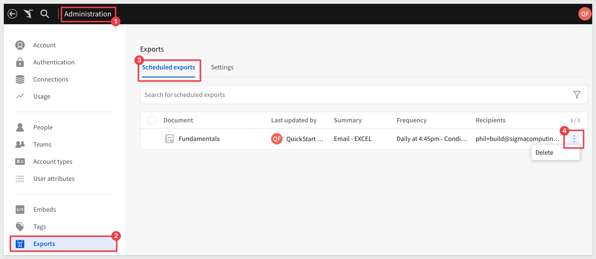

Administrators are able to delete jobs at their discretion.

### Export element
There is also a method to export data for any single workbook element. While it is preferred to use Sigma to work with warehouse data, there are times where an export is required. 

For example, our workbook has one table, `F_SALES`. 

We can access the element menu for this table and select `Export` > and select a document type. Downloading up to one million rows of data in the available formats is supported.

<aside class="negative">
<strong>NOTE:</strong><br> Creating a delivered export or a scheduled export is also available form this menu.
</aside>

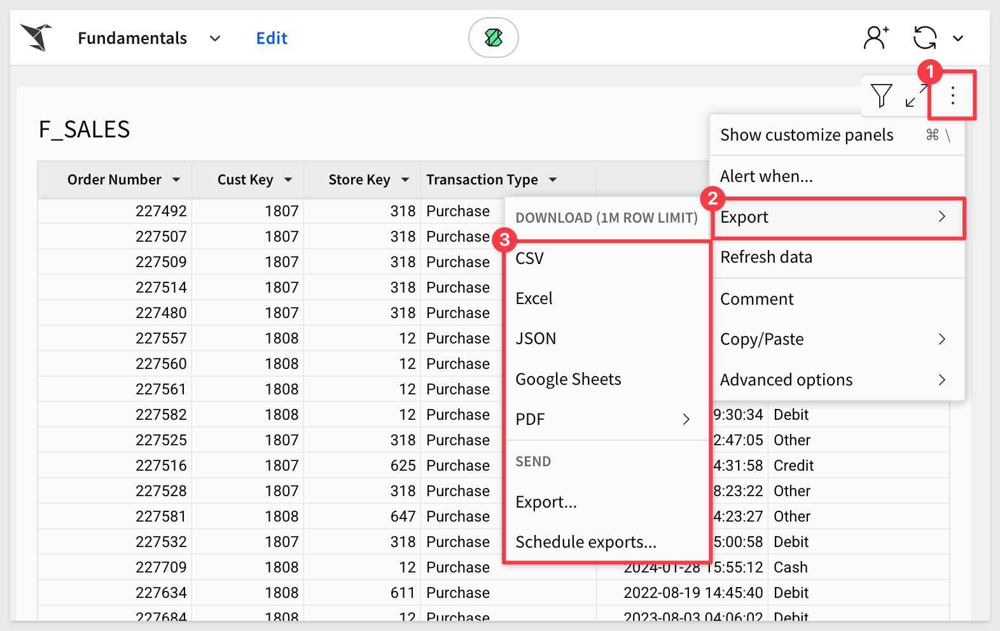


For more information on exporting to email, see [Export to email](https://help.sigmacomputing.com/docs/export-to-email)

For more information on exporting to Google Sheets or Drive, see [Export to Google Drive](https://help.sigmacomputing.com/docs/export-to-google-sheets-or-drive)

For more information on exporting to cloud storage, see [Export to cloud storage](https://help.sigmacomputing.com/docs/export-to-cloud-storage)

For more information on exporting to web-hook, see [Export to webhook](https://help.sigmacomputing.com/docs/export-to-webhook)

For more information export bursting, see [Export as email burst](https://help.sigmacomputing.com/docs/export-as-email-burst)


<!-- END OF SCHEDULING -->

## What we've covered
Duration: 6

In this QuickStart we covered navigating the Sigma user interface, common terminology and some of the most common functionality. 

The next QuickStart in this series covers using [data elements in Sigma](https://quickstarts.sigmacomputing.com/guide/fundamentals_2_data_v3/index.html?index=..%2F..index#0)

### Advanced users
The select list of links below are provided for those are interested in diving right into Sigma in a deeper way. Of course, there are many QuickStarts to choose from apart from these too. These show the wide variety of functionality available in Sigma.

There is a ton of data app resources on our [About Sigma data apps](https://help.sigmacomputing.com/docs/data-apps) help page. Check them out!

[Building Data Apps with Sigma QuickStarts library](https://quickstarts.sigmacomputing.com/?cat=dataapps)

[Fundamentals 8: Beyond the Basics](https://quickstarts.sigmacomputing.com/guide/fundamentals_8_beyond_the_basics_1/index.html?index=..%2F..index#7)

[Sigma Input Tables: Use Cases](https://quickstarts.sigmacomputing.com/guide/input_tables_use_cases/index.html?index=..%2F..index#0)

[Sigma REST API Recipes](https://quickstarts.sigmacomputing.com/guide/developers_api_code_samples/index.html?index=..%2F..index#0)

[Sigma's Query Engine](https://quickstarts.sigmacomputing.com/guide/developers_sigma_calculations/index.html?index=..%2F..index#0)

**Additional Resource Links**

Be sure to check out all the latest developments at [Sigma's First Friday Feature page!](https://quickstarts.sigmacomputing.com/firstfridayfeatures/)

[Help Center Home](https://help.sigmacomputing.com)<br>
[Sigma Community](https://community.sigmacomputing.com/)<br>
[Sigma Blog](https://www.sigmacomputing.com/blog/)<br>
<br>

[](https://twitter.com/sigmacomputing)&emsp;
[](https://www.linkedin.com/company/sigmacomputing)&emsp;
[](https://www.facebook.com/sigmacomputing)


<!-- END OF WHAT WE COVERED -->
<!-- END OF QUICKSTART -->
