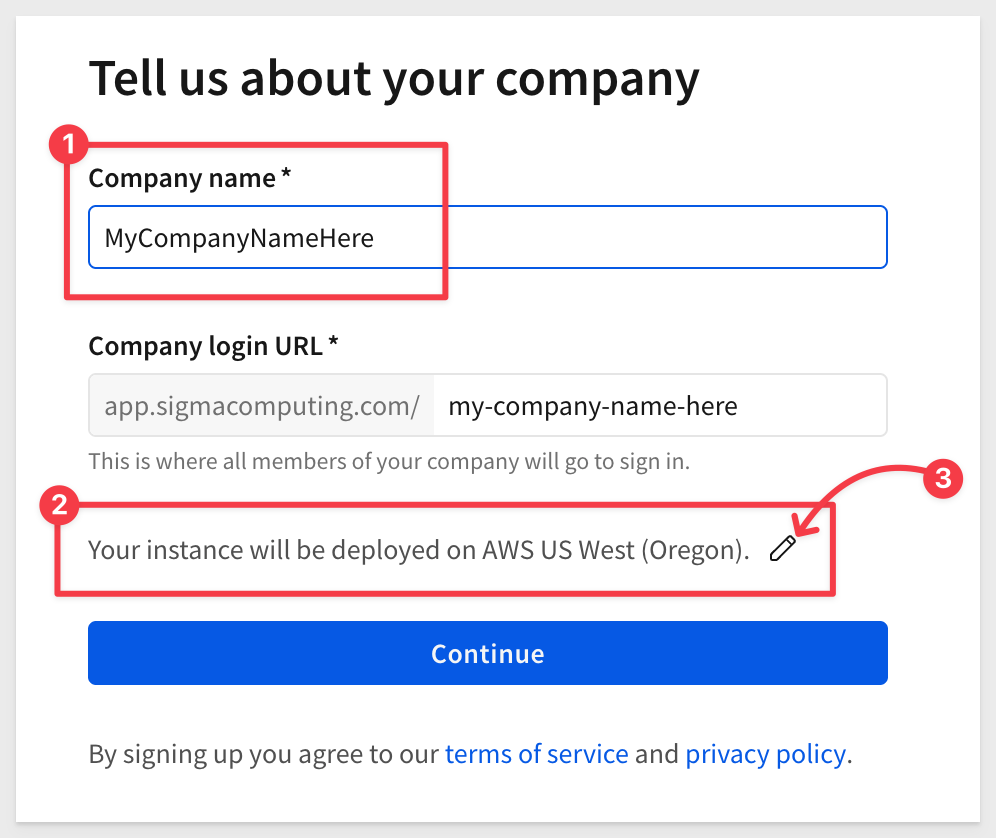
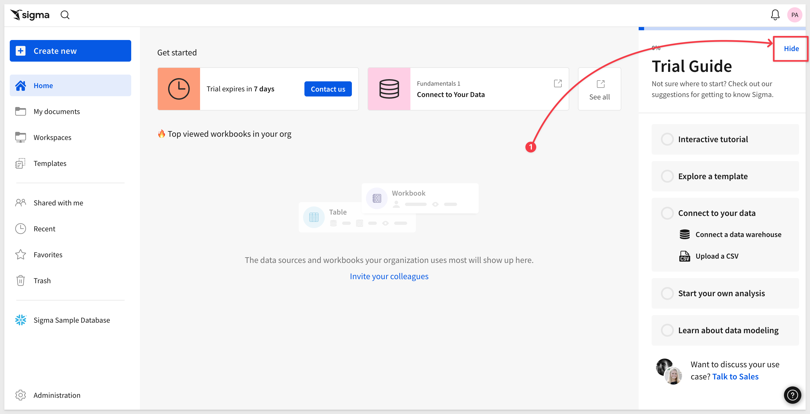
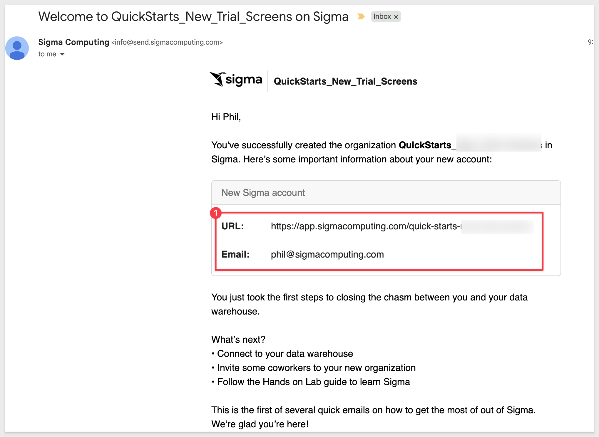
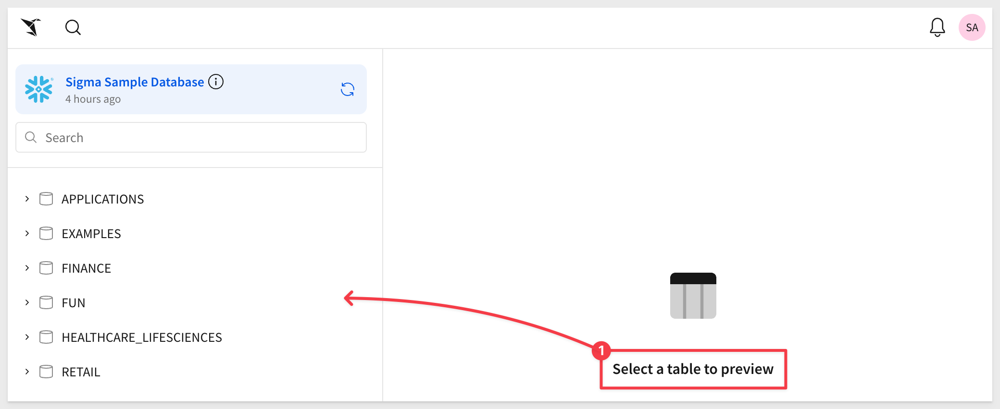
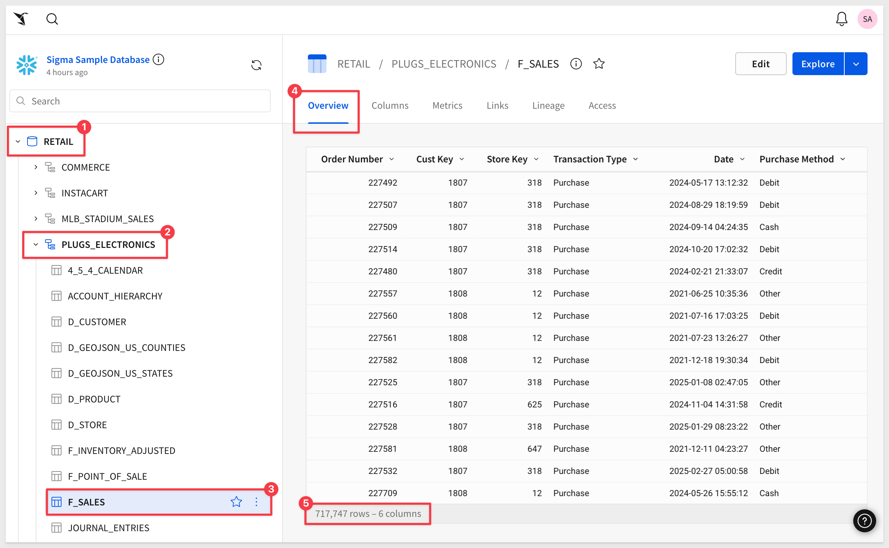
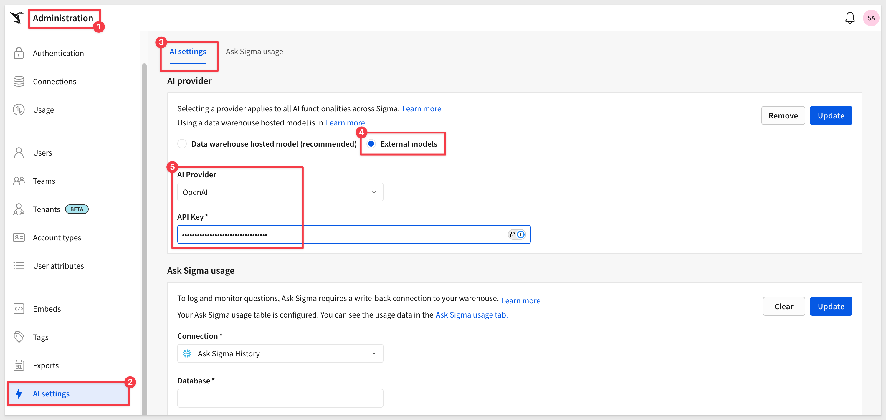
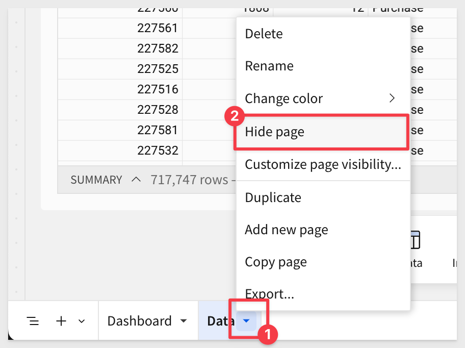
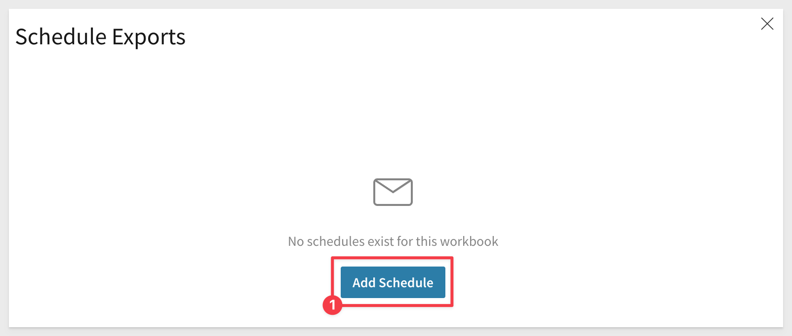
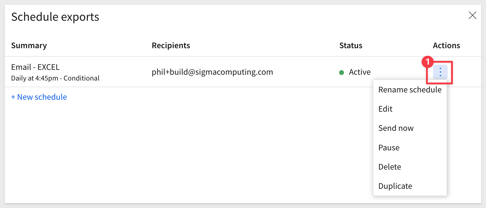

author: pballai
summary: fundamentals_1_getting_around_v3
id: fundamentals_1_getting_around_v3
categories: fundamentals
status: Published
feedback link: https://github.com/sigmacomputing/sigmaquickstarts/issues
tags: default
authors: phil@sigmacomputing.com
lastUpdated: 2025-04-01

# Fundamentals 01: Getting Around
<!-- -->

## Overview
Duration: 6

This QuickStart is part of a series designed to give new users an overview of Sigma, helping them quickly get up to speed and start leveraging its powerful capabilities.

The Fundamentals series of QuickStarts is tailored for a diverse audience with varying skill levels. To support this, we’ve included numerous links to additional resources. While you don’t need to read everything, feel free to explore topics that interest you.

We understand that many users have experience with BI platforms. Since Sigma is designed for ease of use, these users may prefer to focus on learning its key differences.

If you fall into that category, please review these summaries:

[Sigma Differences From Other BI Tools Overview For New Sigma Creators.](https://community.sigmacomputing.com/docs?topic=3285)

[I am a Dashboard Builder New to Sigma. How Can I Quickly Get Up To Speed?](https://community.sigmacomputing.com/docs?topic=3650)

[I am interesting in data modeling in Sigma, see Fundamentals 10: Data Modeling](https://quickstarts.sigmacomputing.com/guide/fundamentals_10_data_modeling/index.html?index=..%2F..index#0)

Each QuickStart in the series will use sample data Sigma provides to all customers. We will be using sales data from our fictitious company **Plugs Electronics.** 

<aside class="positive">
<strong>ABOUT THE SAMPLE DATABASE:</strong><br> Sigma provides a connection to sample data to all customers free of charge. Customer administrators may elect to disable this connection in the Administration > General Settings > Features section of the portal. If the sample data is not visible in your instance, check with your administrator. 
</aside>

<aside class="positive">
<strong>IMPORTANT:</strong><br> Some screens in Sigma may appear slightly different from those shown in QuickStarts. This is because Sigma is continuously adding and enhancing functionality. Rest assured, Sigma’s intuitive interface ensures that any differences will not prevent you from successfully completing any QuickStart.
</aside>

For more information on Sigma's product release strategy, see [Sigma product releases.](https://help.sigmacomputing.com/docs/sigma-product-releases)

If something isn’t working as expected, here is how to [contact Sigma support.](https://help.sigmacomputing.com/docs/sigma-support)

<aside class="negative">
<strong>IMPORTANT:</strong><br> Some features may carry the "Beta" tag. Beta features are subject to quick, iterative changes. As a result, the latest product version may differ from the contents of this document.
</aside>

### About Sigma
Sigma is a front-end for your cloud data warehouse—an analytics platform for spreadsheets, interactive data apps, and more. It centralizes your data, eliminates silos, and replaces fragmented tools for various use cases within a governed environment. Additionally, Sigma enables businesses to monetize their data through embedding.

Many BI solutions exist, but Sigma stands out. Here’s why:

Sigma is multi-modal, designed for users of all skill levels. Data engineers can write SQL, data scientists can use Python, and business users can work with spreadsheet functions. Want to build a data app? Sigma makes it easy.

It's also the only platform that lets users securely write back data—updating rows or columns without overwriting the warehouse.

Sigma is built for collaboration, allowing teams to work together in real time on live data, just like a well-coordinated game.

For developers embedding Sigma in a larger platform, every feature is available—no need to manually code elements.

With full feature parity and no coding required, Sigma is the fastest, most flexible, and most powerful embedding tool on the market.

 ### Target Audience
The typical audience for this QuickStart includes users of Excel, common Business Intelligence or Reporting tools, and semi-technical users who want to try out or learn Sigma.

### Prerequisites
<ul>
  <li>A computer with a current browser. It does not matter which browser you want to use.</li>
  <li>Access to your Sigma environment. A Sigma trial environment is acceptable and preferred.</li>
</ul>

<aside class="positive">
<strong>IMPORTANT:</strong><br> Sigma recommends using non-production resources when completing QuickStarts.
</aside>

### What You’ll Learn
Through this QuickStart we will walk through how to access a Sigma trial environment, navigate the user interface, and so much more. 


<!-- END OF OVERVIEW -->

## Sigma Trial Setup
Duration: 6

If you don’t have a Sigma account yet, sign up for a free trial to follow along with QuickStarts.
 
<button>[Free Trial](https://www.sigmacomputing.com/free-trial/)</button>

**Fill out the form on Sigma's Trial page:**

When ready, click the `START TRIAL` button.


Fill out the form and click `Start Trial`.

You will receive notice that Sigma is sending an email invitation:


In your email application, open the email from Sigma and click `Verify Email Address`.  


<aside class="negative">
<strong>NOTE:</strong><br> If you have not received this email within 10 minutes, please check your spam folder, and if not there, ask for assistance from support. The email will be "from" Sigma Computing using the address: info@send.sigmacomputing.com.
</aside>

Feel free to contact Sigma support at any time using the [methods listed here.](https://help.sigmacomputing.com/docs/sigma-support)

When the page loads in your default browsers, enter in your `Company Name` and `Company Login URL` (if you prefer something different) and click the `Continue` button:



Create your user profile and click the `Create` button:


You should now see the Welcome Message for your `Sigma Trial`. There is a video tutorial you can watch if you like, but for this QuickStart, just click `Go to home page`:



You should also receive a welcome email from Sigma:



<aside class="positive">
<strong>IMPORTANT:</strong><br> Trial instances are setup with administrative rights for the user who established the account. This provides access to all Sigma's default functionality, so you can explore everything. 
</aside>


<!-- END OF SIGMA TRIAL SETUP -->

## Getting Around the UI
Duration: 6

On the homepage, click `Hide` to remove the trial guide.

<aside class="negative">
<strong>NOTE:</strong><br> Click the `Show guide` link anytime to display the trial guide later.
</aside>

The home page is logically organized for quick access to key features.

<aside class="negative">
<strong>NOTE:</strong> Other users will only see content/features as configured by their assigned "Account Type". 
</aside>

The main functions are numbered and described below:


 **Papercrane:** If you want to get back to the home page from anywhere in the portal, just click the Sigma `Papercrane` logo in the upper left corner.

 **Search:** You can click in the search bar at any point to search for content within Sigma.

 **Create New:** Use this anytime you want to create new content.
    <ul>
      <li><strong>Workbook:</strong> our spreadsheet-like UI for analyzing data</li>
      <li><strong>Data Model:</strong> A data model is a type of Sigma document that provides the framework for creating and managing a collection of reusable elements.</li>
      <li><strong>Write SQL:</strong> allows you to write SQL to run against the data warehouse.</li>
      <li><strong>Upload CSV:</strong> allows you to upload a CSV to the warehouse in order to perform analysis.</li>
    </ul>
     
If at any time you notice an item labeled **BETA**, it means the feature is mature enough for all customers to evaluate while we finalize its release.

If you ever need to know what is new in Sigma, there are two resources for that:

[Release Notes](https://help.sigmacomputing.com/changelog)

We also provide a summary on the "First Friday" of each month, which includes everything released in the prior month, including bug fixes.

[First Friday Features can be found here](https://quickstarts.sigmacomputing.com/firstfridayfeatures/)
 
 **My Content:**
 <ul>
      <li><strong>Home:</strong> will bring you back to home screen.</Li>
      <li><strong>My Documents:</strong> is a personal folder for you to save content you have created.</Li>
      <li><strong>Workspaces:</strong> are a way to organize and share content with specific members or teams within your organization. Items placed in workspaces can be accessed by anyone who has permission to that workspace.</Li>
      <li><strong>Templates:</strong> provides a way to standardize and share workbook structures, for quick and consistent reuse.</Li>
      <li><strong>Shared with Me:</strong> will show a list of items others have shared directly with you.</Li>
      <li><strong>Recent:</strong> will bring up items you have accessed recently.</Li>
      <li><strong>Favorites:</strong> will show a list of items that you have marked "favorite", for quicker access.</Li>
      <li><strong>Trash:</strong> the typical recycle bin functionality.</Li>
 </ul>

 **Connections Section:**
Visible to administrators and content creators by default, lists the data warehouses available. 

Clicking on one of them shows the tables in that warehouse you can access. There can be many connections for a single Sigma account, each configured with different levels of access to the warehouse, to be shared with members or teams. The actual connection configuration is done in the administration section.

<aside class="negative">
<strong>NOTE:</strong><br> Trials created from the Sigma website show the "Sigma Sample Database", which uses a Sigma provided Snowflake account. Trials created from cloud provider marketplaces may have additional connections.
</aside>

 **Top viewed:** Empty at the start, as teams start to create and use content, the most popular will float to the top of this listing.

 **Invite your colleagues:** Provides a quick method for adding users to your account. This is a configurable convenience; users in Sigma can be managed in the administration section or externally via any SAML 2.0 compatible identity management provider (ie: Okta, Auth0 ect...).

 **User Profile:**
In the top right corner, there is a box with your username initial. Clicking on it reveals your profile, where you can make changes to your preferences and sign out. Other UI options may or may not be visible to you depending on your permissions.

 **Help:** has lots of useful information for you to explore, to help you get the most out of Sigma.

<aside class="positive">
<strong>IMPORTANT:</strong><br> There is a link to "Live Chat" in this menu. Use it! Sigma is fanatical about supporting our customers. 
</aside>

 **Administration:** Dedicated area for user management and other common configuration settings. Only shown to users in the Admin role.</li>

Now that we have our initial orientation done, we can move on to the next section.


<!-- END OF GETTING AROUND IN THE UI -->

## Some Terminology
Duration: 6

Let’s begin by establishing some basic terminology Sigma uses.

In Sigma, analysis and presentation are seamlessly integrated into a spreadsheet-like experience.

This is useful to know because if you want to build something in Sigma (e.g., a dashboard, report, etc.), you’ll need a workbook, at least one page, and some data. Data can come from a cloud data warehouse or end-user input, but we’ll talk more about that later.

Of course, this is all baseline terminology and pretty easy to understand. Here are some basic terms Sigma uses.

 <ul>
      <li><strong>Workbook:</strong> A workbook in Sigma is akin to an Excel file or Google Sheet.</li>
      <li><strong>Pages:</strong> Each workbook can contain multiple pages, similar to Excel worksheets.</li>
      <li><strong>Tables:</strong> Spreadsheet-like representation of your data.</li>
      <li><strong>Input Tables:</strong> Spreadsheet-like interface that allows data capture/editing.</li>
      <li><strong>Controls:</strong> In general, provide filtering to other elements but can do more too.</li>
      <li><strong>Modals:</strong> Hidden workbook pages that behave like "pop-ups" when the user clicks on some trigger.</li>
      <li><strong>Container:</strong> A grouping of elements on a page. Useful for styling and data app actions.</li>
      <li><strong>Data Model:</strong> A data model is a type of Sigma document that provides the framework for creating and managing a collection of reusable elements.</li>
</ul>

There are lots of other terms used (ie: Charts), but they are mostly self-explanatory. 

There are different icons for different objects in Sigma.

It can be handy to know what some of these these icons represent:


<!-- END OF SECTION-->

## Workbooks
Duration: 6

There are different paths when creating content in Sigma, but we will focus on the most common methods in this QuickStart. 

So you can get started quickly, Sigma provides some common data in the `Sigma Sample Database`.

At the lower-left of the home page, click on `Sigma Sample Database` to see what tables are available:


We can see all the different data available, and we are prompted to `Select a table to preview`. 



<aside class="negative">
<strong>NOTE:</strong><br> This interface allows you to quickly preview the columns and data that is available, so it is easy to decide which table has the information needed.
</aside>

Select the `Plugs_Electronics` ("Plugs”) schema in the `RETAIL` database, expand it and select the `F_SALES` table. 

We can see all the data that is **live in the cloud data warehouse**, assuming we have permission to view it. 

In item #5, we can see the total row count is about **717k+ rows in 6 columns**.

We are looking at the data (in the **Overview** tab), but we can also look at column details, metrics, links, lineage and permissions too.



<aside class="positive">
<strong>IMPORTANT:</strong><br> There is a lot more we can do with this table in this interface such as "pre-assign" friendly column names, create metrics (pre-defined calculations), assign permissions and more.
</aside>

To begin our analysis, we want to begin exploring this data. Click the `Explore` button in the upper right corner (**click the button, not the drop arrow**).

<aside class="positive">
<strong>IMPORTANT:</strong><br> The "Explore" drop menu also provides a means to use this table as a starting for for data modeling. 
</aside>

The explore button has opened a new workbook for us, and placed the `F_SALES` table on it too:


**Now this is important to understand:**

In Sigma, all workbooks remain purely exploratory until you actively save the first version.

Often, ad hoc analysis is only needed in the moment—why clutter folders with one-off documents that will never be used again?

If you create something valuable, you can save it, and continue building on it later. Otherwise, you can simply abandon the unsaved workbook.

<aside class="negative">
<strong>NOTE:</strong> Workbooks support data from multiple sources. This data can come either from tables in your cloud data warehouse (CDW), from your organizations datasets/datamodels in Sigma or from CSV files upload into Sigma.
</aside>

Now that we have our first unsaved workbook, let's take a moment to review some of the features.


Each `workbook` can have one or more `Pages`, and each page has its own canvas or working area. For example, `Page 1` has the `F_SALES` table on its canvas. 

Objects on a page's canvas are called `Elements`. Examples are tables, charts, controls, buttons, text and so on. 

The `Element Panel` is active when one element on the canvas is selected and allows configuration for the selected element.

Click on the `F_SALES` table. When an element on the canvas is selected, it will have a blue border and the `Element Panel` will show the related configuration:


When the `F_Sales` table is selected, we can access the toolbar, formula bar and table features. We will explore these more later, but note that icons for undo and redo are present. These are really handy, and will be used often.


<aside class="positive">
<strong>IMPORTANT:</strong><br> Use the Undo and Redo arrows in the toolbar instead of the browser's back button.
</aside>

The `Formula bar` is where we can leverage Sigma's [extensive library of functions. ](https://help.sigmacomputing.com/docs/popular-functions)

You can collapse the `Element Panel` by clicking on the  icon in the upper right corner of the page.

The `Element Bar` is always shown (except when the collapse icon has been selected), and provides a simple way to drag and drop elements onto the canvas. They are grouped logically, so it is easy to find what you need. 


Let’s save this workbook for now. Click the `Save As` button in the upper right corner. 

It is best practice to name workbooks something that makes sense to you and others you might share this workbook with later.

Notice that we are given options on where to save it, using a familiar folder structure. 

Click `Create Folder` and name it `QuickStarts`. Then click into the `QuickStarts` folder, and name the workbook `Fundamentals`:


Workbooks have a menu that is accessed by clicking the down-arrow to the right of the name.

Open that and select `About this workbook`:


Clicking the star icon adds the workbook to your favorites list, which appears on the homepage.


You can also set a `Badge` on a workbook, to inform other users about the current state of the work. For example, `Endorsed` or `In Development`, and also leave a text comment to provide more context. 


Once set, the workbook will show both the endorsement and the text:


Now that you have saved the workbook, we are in `Draft` mode and the  `Publish` button is grey, indicating that we have no unpublished changes pending. We are still in `Editing` mode. 

The `Publish` button is not active until we make some other change.

Opening the `Publish` menu provides additional options:


**These options allow you to:**
<ul>
      <li>View the workbook as all users will see it in production.</li>
      <li>Throw away and changes that were made in an unpublished draft.</li>
      <li>View as if using a smaller screen device.</li>
      <li>Preview with different access rights applied.</li>
</ul>

<aside class="positive">
<strong>IMPORTANT:</strong><br> Sigma has many more features to help address the need for version control.
</aside>

[For more information on workbook version history, click here.](https://help.sigmacomputing.com/docs/workbook-versions-and-version-history)

[For more information on version tagging (control) in Sigma, click here.](https://help.sigmacomputing.com/docs/version-tagging)

### Viewing the published version
After clicking on `Go to published version`, the header now shows options to return to `Edit` mode and an icon that allows you to customize the workbook with changes only visible to you. This is a great way to repurpose an existing workbook to suit your specific needs. 


Once you make changes in the `Custom view`, you can opt to save them as a new workbook or discard. 

Click the `Close view` button and click the `Edit` text to return to editing mode.


<!-- END OF WORKBOOKS -->

## The Power of Artificial Intelligence (AI)
Duration: 6

As we move through the Fundamentals series, we’ll learn how to build using all the great features Sigma provides. That said, we’re at a point in time where AI is expected in any modern software product.

Providing AI functionality isn’t especially difficult these days—but making it easy to use and genuinely helpful requires thoughtful design and a deep understanding of how users can benefit from the results.


Allowing users to ask questions is one thing but how can we tell what the AI is doing? 

- Is it using trusted data sources? 
- What steps, calculation and workflow did it use to generate results? 
- What steps, calculations, and workflows did it use to generate results? 
- Once we have the response, what’s next for the user?

We have addressed all these and more with our unique design, summarized below in three sections:

**1: Discovery**<br>
Ensure corporate governance by restricting source data used for analysis and preventing exposing data to third-parties.

**2: Trust**<br>
Ensure that only verified, trusted data sources are used. Decisions made from bad data are time-consuming and potentially costly too.

**3: Exploration**<br>  
Allow users to launch selected results into a workbook for further analysis or sharing.

Ask Sigma breaks down every step AI took to generate its answer. This lets you double-check results, edit any step of the analysis, and work more confidently with AI.


Here’s a short video for those who don’t yet have an AI API key but want to see the functionality in action.

If the embedded video is too small on your screen, you can [view the larger version here.](https://www.sigmacomputing.com/product/ask-sigma)


### Hands on demonstration
If you already have an AI API Key, you can configure this in your Sigma instance. Otherwise, just follow along.

<aside class="positive"> <strong>From the author:</strong><br> I don’t usually write in the first person, but I’ll make an exception here. I genuinely believe Ask Sigma will start to change the way users work in Sigma—saving tons of time that’s better spent on refining results, not starting from scratch.

Let’s be clear—Ask Sigma is a tool at your disposal. You’re free to use it or not. But it’s worth understanding what I believe is the start of a fundamental shift: the way you think about starting a new project is changing.

Many software vendors like to say “Start with the end in mind.” That sounds good, but having a whiteboard diagram still means you must build everything from scratch—and also figure out how to use some product to build it.

Sure, Sigma is easy to learn and use—but Ask AI is even better than that.

Instead of starting with the end-state design, Ask AI wants you to start with a problem—framed as a question.

As shown in the video, Ask Sigma will work hard to answer even vague, generic questions like:
"Where are we doing the best?"

That question lacks context, and you can certainly ask clearer questions to receive results that are more aligned with what you're looking for.

But regardless of the query you submit, Ask Sigma provides additional analysis and breakdowns—so you can explore more data and follow your curiosity. You can always edit the AI-generated analysis to better pinpoint what you're after.

The best way to improve Ask Sigma’s performance—and human analysis, too—is to ensure the underlying data is robust and well-organized.

Ask Sigma leverages AI agents that reference metadata (like column and table descriptions), data models, and defined metrics to answer your query.

The more context you provide about your data, the better AI can work with it. So if you’re not getting the results you expect, don’t just tweak the wording of your question. Instead, collaborate with your data team to continuously refine and optimize your assets to drive better outcomes for everyone.

Let’s try it out in the demo below.
</aside> 

<aside class="negative"> <strong>IMPORTANT:</strong><br> Sigma is heavily invested in Ask Sigma—new features and improvements are rolling out all the time! </aside>

### Enable AI
To use AI features in Sigma, you’ll need to provide an API key from your selected AI provider.

<aside class="positive">
<strong>IMPORTANT:</strong><br> Customers who have sensitive data may want to use their own warehouse provider in order to prevent exposing data to third party providers.

To ensure data stays under your control, Sigma also supports warehouse AI models.
</aside>

For more information, see [Configure warehouse AI model integration](https://help.sigmacomputing.com/docs/configure-warehouse-ai-model-integration)

Navigate to `Administration` > `AI settings`, select the AI provider and provide a valid `API Key`:



For more information, see [Configure AI features for your organization](https://help.sigmacomputing.com/docs/configure-ai-features-for-your-organization)

### Select data sources to make available to Ask Sigma
Now we need to tell Sigma which data sources Ask Sigma can use. Since we are using third-party AI services like OpenAI, we want to be careful about which datasets we allow access to. This process controls that and limits access to data that may be proprietary.

For example, if we want Ask Sigma to have access to the `Sigma Sample Database > RETAIL > PLUGS_ELECTRONICS_HANDS_ON_LAB_DATA` we simply search for it, select the source we want and click `Sync`:


Once the sync is complete, you can filter on `Available` to confirm it’s ready for Ask Sigma:


Here’s where things follow the `Ask` workflow, rather than the `Create New Workbook` workflow.

Click the  icon, and then select `Ask Sigma`:


### Ask away
The Ask Sigma interface is simple—but it’s also built to help you target specific data sources.

This time, let’s try a more focused question:

```plaintext
The CEO wants to know the bottom ten stores in the chain.
```


Ask Sigma explains what it's doing at each step and why. You can jump off into a workbook at any point to explore further on your own:


Once the response is ready, you’ll see:
- A full explanation of the result
- Options to adjust calculations
- Multiple charts to choose from for your workbook

Some generated charts may not be helpful—for example, `Store Latitude, Store Longitude, and Store Key` aren’t useful in this case. so we won't select them.


If you're happy with the results, you can open the selected items in a workbook—or keep refining in Ask Sigma.


Once inside a workbook, you can save it, make any changes you like, or use Sigma’s [Explore Anywhere](https://help.sigmacomputing.com/docs/view-underlying-data) feature for deeper analysis:

<br><br>


It’s clear that Ask Sigma changes the way people will use Sigma—and it’s only getting better. Stay tuned!

### Bonus: AI Formula Assistant
Sigma also includes a Formula Assistant powered by AI. It can:
- Write new formulas
- Correct formula errors
- Explain existing formulas used in workbooks and data models

Let’s say someone in Finance provides a formula they want applied at the group level:
```code
Revenue Efficiency Score= 
Quantity×Price+Cost
(Price−Cost)×Quantity
```

Instead of writing it manually, let the AI Formula Assistant convert it for you:


Once done, you can review the formula, rename the column, and format it to match your needs:


And if you’re not sure what the formula does, just ask the Formula Assistant to explain it:


Now we know: a low Revenue Efficiency Score is bad—and we should dig deeper into what’s bringing it down.

For more information, here are some documentation links:

[Ask natural language queries with Ask Sigma](https://help.sigmacomputing.com/docs/ask-natural-language-queries-with-ask-sigma)

[Embed Ask Sigma (Beta)](https://help.sigmacomputing.com/docs/embed-ask-sigma)

[Configure AI features for your organization](https://help.sigmacomputing.com/docs/configure-ai-features-for-your-organization)


<!-- END OF WORKBOOKS -->

## Pages
Duration: 6

Each workbook page has its own canvas and can be made to operate independently of others, or not.

For example, on one page, we may want to have the data and controls you are using to drive the content on other pages. 

On another page, we may want to provide some instructions for the users.

### Create a data page
A dedicated data page in a workbook can be useful for storing information that other users don’t need to see. However, elements on the data page can still be easily referenced on any other workbook page.

In the lower left corner of the workbook there is a page tab called `Page 1`. 

Double-click on the `Page 1` text and rename the page to `Data`. 

Add a new page and name it `Dashboard` for now.

Drag the `Dashboard` page to be first in line.

Click the menu arrow on the `Data` page and select `Hide page`:



The `Data` tab will now carry an icon to indicate that it will not be visible to users who do not have edit rights.

On the `F_SALES` table, open its menu and select `Move to` > `Dashboard`:


<aside class="positive">
<strong>IMPORTANT:</strong><br> It is easy to move elements between pages and any associations that an element has to other elements is automatically maintained. This "automatic association" is what allows us to have a "Data" page that is hidden from user, but contains elements that we can reference in any other page.
</aside>

Click `Publish`.

### Use a page for instructions or useful information
Creating a dedicated workbook page to inform and assist users who are looking at the workbook is a best practice.

As an example, the image below is the `Home` page from the `Financial Services: Portfolio Risk Modeling` workbook. It has informative text along with some navigation buttons along the top:


There are many pre-built [templates](https://help.sigmacomputing.com/docs/get-started-with-workbook-templates) that you can explore, see how things are configured, and use for your own projects. 

You can even create templates from your own workbooks too:


<!-- END OF PAGES -->

## Containers
Duration: 6

Sigma's container feature allows you to organize workbook pages by grouping elements within a customizable container. 

This provides an intuitive way to manage layouts, ensuring that related elements remain visually cohesive. 

Containers not only streamline the design process by enabling you to adjust and style grouped components collectively, but also enhance flexibility when rearranging or resizing elements on the canvas. 

This powerful feature simplifies complex workbook structures, making it easier to maintain consistency in both functionality and appearance.

In the animation below, we show how containers dramatically improve the appearance of existing Sigma workbooks.


To learn more about using containers, see [Organize workbook layouts with containers](https://help.sigmacomputing.com/docs/organize-workbook-layouts-with-containers)


<!-- END OF PAGES -->


## Account Types
Duration: 6

<aside class="negative">
<strong>NOTE:</strong><br> This section is useful to understand how different users may use Sigma. If you are not involved in those decisions, feel free to skip to the next section.
</aside>

Sigma’s licensing model includes tiers that define the usage terms of your organization members: `View`, `Act`, `Analyze` and `Build`. 

If your organization utilizes older Lite/Essential/Pro license model, [refer to this document.](https://help.sigmacomputing.com/docs/create-and-manage-account-types-2024)

Each license tier establishes a different set of available permissions that enable access to Sigma’s features and capabilities. 

At a high-level, this is what each tier provides:

<ul>
  <li><strong>View:</strong> Suitable for report consumers who need access to prepared data and insights with baseline interactions.</li>
  <li><strong>Act:</strong> Ideal for collaborative data contributors who actively input and update data.</li>
  <li><strong>Analyze:</strong> Optimized for decision-making data consumers who require more deep-dive capabilities without building workbooks themselves.</li>
  <li><strong>Build:</strong> Designed for data architects, BI analysts, and report builders who model, transform, and analyze data.</li>
</ul>

<aside class="negative">
<strong>NOTE:</strong><br> The Build license also is used for system administrators. The key difference is that an administrator has an elevated account type. This allows them to manage organization settings and users and so on.
</aside>

As an `administrator`, we can see these default account types by navigating to `Administration` > `Account Types`.

Here we see the default types, description and can also create a new custom account type.

Custom account types provide the ability to define a granular permission level using `Account Types`. 


For more information, see [Account type and License Overview](https://help.sigmacomputing.com/docs/account-type-and-license-overview)


<!-- END OF SHARING -->

## Sharing
Duration: 6

Sharing in Sigma is simple. Permissions to access a Sigma document can be granted, modified, or revoked by either the document’s owner or an organization admin. 

Return to the `Fundamentals` workbook, and click the `Share` icon in the upper right corner of the workbook:


In the share modal we can select a team or member that we want to share the workbook, and at what permission level.

For example, we invited another user (using [Gmail's alias feature](https://support.google.com/a/answer/33327?hl=en)) and set their permissions to `Build`.

Now we can share the workbook with that new user and select the level of access we want to allow. 


The new user can see the workbook by navigating to `Shared with me` on the homepage:


### Live edit

When we are both viewing / working in the same workbook, we can see each others activity.

<aside class="negative">
<strong>NOTE:</strong><br> To use live edit, users need to have `Edit` access.
</aside>

For example, if both users have the table selected:


<aside class="negative">
<strong>NOTE:</strong><br> We simulated this using two different browsers, each with a different user logged into Sigma.
</aside>

For more information, see [About sharing with users, teams, and all organization members](https://help.sigmacomputing.com/docs/share-a-workbook#about-sharing-with-users-teams-and-all-organization-members)


<!-- END OF SHARING -->


## Scheduling
Duration: 6

Sigma workbooks support the ability to export data immediately or on a user-defined schedule.

Open the workbooks menu and select `Share and export` > `Scheduled exports...`:


In the modal window, click `Add Schedule`



We are able to customize several areas of this operation. 

### Export (select a type)
There are many destinations supported. Click the desired icon, provide one or more recipients, a subject and message:


### What to attach
Add one or more attachments, the format and orientation to include with the export:


Use the  `+ Add another attachment` to build a message from more than one part of a workbook.

### Frequency & Conditions
A really powerful feature, is the ability to configure specific conditions that must be satisfied, in order for the export to occur:


This can create some really interesting workflows and notifications to drive actions and efficiency.

The ability to validate any condition before it is put into service is an important step. By clicking the `Test condition` button, we can see while our condition seemed valid, the data does not agree:


### More options
For workbooks that have parameter-driven data based on the user, sent items can be run with data filtered for the recipient:


A very powerful feature of scheduling allows us to deliver reports deterministically, based on control parameters.

For more information, see [Filter by control values](https://help.sigmacomputing.com/docs/configure-additional-options-for-exports) on this page.

### Managing my workbook schedule
Once a user creates a schedule, it is shown on the `Schedule exports` modal. At this point, we can take some `Action` on it, including running it now:



### Administrative control
Once created, administrators can see it on the list of available `Exports` in the `Administration` section:


Administrators are able to delete jobs at their discretion.

### Export element
There is also a method to export data for any single workbook element. While it is preferred to use Sigma to work with warehouse data, there are times where an export is required. 

For example, our workbook has one table, `F_SALES`. 

We can access the element menu for this table and select `Export` > and select a document type. Downloading up to one million rows of data in the available formats is supported.

<aside class="negative">
<strong>NOTE:</strong><br> Creating a delivered export or a scheduled export is also available form this menu.
</aside>


For more information on exporting to email, see [Export to email](https://help.sigmacomputing.com/docs/export-to-email)

For more information on exporting to Google Sheets or Drive, see [Export to Google Drive](https://help.sigmacomputing.com/docs/export-to-google-sheets-or-drive)

For more information on exporting to cloud storage, see [Export to cloud storage](https://help.sigmacomputing.com/docs/export-to-cloud-storage)

For more information on exporting to web-hook, see [Export to webhook](https://help.sigmacomputing.com/docs/export-to-webhook)

For more information export bursting, see [Export as email burst](https://help.sigmacomputing.com/docs/export-as-email-burst)


<!-- END OF SCHEDULING -->

## What we've covered
Duration: 6

In this QuickStart we covered navigating the Sigma user interface, common terminology and some of the most common functionality. 

The next QuickStart in this series covers using [data elements in Sigma](https://quickstarts.sigmacomputing.com/guide/fundamentals_2_data_v3/index.html?index=..%2F..index#0)

### Advanced users
The select list of links below are provided for those are interested in diving right into Sigma in a deeper way. Of course, there are many QuickStarts to choose from apart from these too. These show the wide variety of functionality available in Sigma.

There is a ton of data app resources on our [About Sigma data apps](https://help.sigmacomputing.com/docs/data-apps) help page. Check them out!

[Building Data Apps with Sigma QuickStarts library](https://quickstarts.sigmacomputing.com/?cat=dataapps)

[Fundamentals 8: Beyond the Basics](https://quickstarts.sigmacomputing.com/guide/fundamentals_8_beyond_the_basics_1/index.html?index=..%2F..index#7)

[Sigma Input Tables: Use Cases](https://quickstarts.sigmacomputing.com/guide/input_tables_use_cases/index.html?index=..%2F..index#0)

[Sigma REST API Recipes](https://quickstarts.sigmacomputing.com/guide/developers_api_code_samples/index.html?index=..%2F..index#0)

[Sigma's Query Engine](https://quickstarts.sigmacomputing.com/guide/developers_sigma_calculations/index.html?index=..%2F..index#0)

**Additional Resource Links**

Be sure to check out all the latest developments at [Sigma's First Friday Feature page!](https://quickstarts.sigmacomputing.com/firstfridayfeatures/)

[Help Center Home](https://help.sigmacomputing.com)<br>
[Sigma Community](https://community.sigmacomputing.com/)<br>
[Sigma Blog](https://www.sigmacomputing.com/blog/)<br>
<br>

[](https://twitter.com/sigmacomputing)&emsp;
[](https://www.linkedin.com/company/sigmacomputing)&emsp;
[](https://www.facebook.com/sigmacomputing)


<!-- END OF WHAT WE COVERED -->
<!-- END OF QUICKSTART -->
