summary: Fundamentals for new users and Sigma Trials
id: fundamentals-1-getting-around
categories: fundamentals
status: Published
feedback link: https://github.com/sigmacomputing/sigmaquickstarts/issues
tags: default
authors: Phil Ballai-Sigma Computing
lastUpdated: 2023-07-19

# Fundamentals 1: Getting Around
<!-- ------------------------ -->

## Overview 
Duration: 6

This QuickStart is part of a series designed to instruct new users how to use Sigma to explore and analyze data using Pivot Tables. 

We will be working with some common sales data from our fictitious company ‘Plugs Electronics’. This data is provided to you automatically. We will look at sales data, but throughout the course of other QuickStarts will incorporate more sources from associated store, product, and customer data.

The other “Fundamentals” QuickStarts explore topics such as working with Tables, Pivot Tables, Dashboards and more. We have broken these QuickStarts up so that they can be taken in any order you want, except the “Fundamentals 1: Getting Around” QuickStart should be taken first.

 ### Sigma Target Audience
Sigma combines with the unlimited power of the cloud data warehouse and the familiar feel of a spreadsheet; no limit on the amount of data you wish to analyze. Sigma is awesome for users of Excel and even better for customers who have millions of rows of data.

Typical audience for this QuickStart is users of Excel, common Business Intelligence or Reporting tools and semi-technical users who want to try out or learn Sigma. Everything is done in a browser so you already know how to use that. No SQL or technical skills are needed to do this QuickStart.

### Prerequisites
<ul>
  <li>A computer with a current browser. It does not matter which browser you want to use.</li>
  <li>Access to your Sigma environment. A Sigma trial environment is acceptable and preferred.</li>
  <li>If have not already, you can sign up for a Sigma Trial here:</li>
</ul>

<button>[Free Trial](https://www.sigmacomputing.com/free-trial/)</button>

### What You’ll Learn
Through this QuickStart we will walk through how to access a Sigma Trial environment, navigate the user interface and more. 

### What You’ll Build
We will be working with some common sales data from our fictitious company ‘Plugs Electronics’. This data is provided to you automatically. We will look at sales data, but throughout the course of other QuickStarts will incorporate more sources from associated store, product, and customer data.

<!-- END OF OVERVIEW -->

## **Sigma Trial Setup**
Duration: 6

Sigma combines with the unlimited power of the cloud data warehouse and the familiar feel of a spreadsheet; no limit on the amount of data you wish to analyze. Sigma is awesome for users of Excel and even better for customers who have millions of rows of data. 
Sign up for a free trial (if you do not already have an account):
Sign up for a free trial account here: 
<button>
[Free Trial](https://www.sigmacomputing.com/free-trial/)
</button>

**Fill out the form on Sigma's Trial page:**
 

**You will receive an Email invitation:** 
Open the email and click `Verify Email Address`. If you have not received this email within 10 minutes, please check your spam folder and if not there, ask for assistance immediately. The link will open a new tab on the profile creation page. Enter in your name and a password and click `CONTINUE`.

Create your user profile and click `Create`: 

You should now see the Welcome Message on your `Sigma Trial` homepage: 
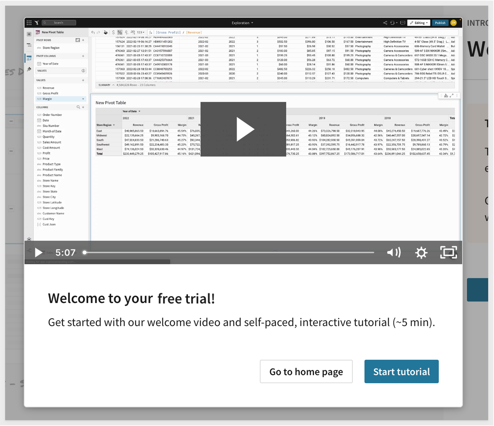

**Review the Tutorial (optional)** 
If this is the first time you have used Sigma you may want to spend a few minutes reviewing the short video tutorial but this QuickStart will cover most of these topics so it is not really necessary. 

<!-- END OF SIGMA TRIAL SETUP -->

## **Getting Around the UI**
Duration: 6

The Home page is organized logically to make it easy to get to things quickly. The main functions are highlighted below: 

<aside class="negative">
<strong>NOTE:</strong> As the user who initiated the Trial you are granted Admin rights. Other users may not see every option as dictated by their role assignment. Administration is covered in a different QuickStart.
</aside>

 

If you want to get Home from anywhere in the portal, just click the Sigma logo in the upper left corner.

Once you open a different page you may notice the back arrow next to the Sigma logo. This allows you to go back one level.
 
 

<ol type="1">
  <li><strong>Search:</strong> You can click in the search bar at any point to search for content within Sigma.</li>
  
  <li><strong>My Content:</strong> Use this anytime you want to create new content 
    <ol type="i"> 
      <li><strong>Home</strong> will bring back to home screen</Li>
      <li><strong>Recents</strong> will bring up items you have accessed recently</Li>
      <li><strong>Favorites</strong> will show a list of items that you have favorite or quicker access</Li>
      <li><strong>Shared with Me</strong> will show a list of items others have shared directly with you</Li>
      <li><strong>My Documents</strong> is a personal folder for you to save content you have created</Li>
      <li><strong>Workspaces</strong> are a way to organize and share content with specific members or teams within your organization. Items placed in workspaces can be accessed by anyone who has permission to that workspace.</Li>
      <li><strong>Connections</strong> (visible to Administrators and Creators by default): Connections list the data warehouses you have connections to. Clicking on one of them shows the tables in that warehouse you can access. There can be many connections for a single Sigma account, each configured with different levels of access to the warehouse, to be shared with members or teams. 
      </ol>

<aside class="negative">
<strong>NOTE:</strong>  In this QuickStart you can only see and access the “Sigma Sample Database” database used for this QuickStart.
</aside>

  <li><strong>Create New:</strong> Access various content available to your role. These include:
    <ol type="i"> 
      <li><strong>Workbook:</strong> our spreadsheet UI for analyzing data</Li>
      <li><strong>Dataset:</strong> enables the curation of data to then be shared with others</Li>
      <li><strong>Custom SQL:</strong> allows you to write SQL to run against the data warehouse
      <li><strong>CSV upload:</strong> allows you to upload a csv in order to perform analysis within a Workbook</Li>
    </ol>
  </li>

  </li>
    <li><strong>Administration:</strong> Dedicated area for user management and other common configuration settings. Only shown to users in the Admin role.</li>
   <li><strong>Canvas:</strong> This area is where most of your working sessions will be. The Home page will change based on what you are doing over time, showing your most recent work and other useful links. </li>
   <li><strong>User Profile:</strong> On the top right corner is a box with your username initial. Clicking on it reveals Profile where you can make changes to your preferences and sign out.  Other UI options may or may not be visible to you depending on your permissions.  These options will be covered in a different module.</li>
   <li><strong>Help:</strong> has lots of useful information for you to explore later.</li>
</ol>

<!-- END OF GETTING AROUND IN THE UI -->

## **Workbooks, Pages and Datasets**
Duration: 6

Let’s begin by establishing some basic terminology Sigma uses. Consider that a `Workbook is like a book you have read; `the Workbook is the title of the book. Each page of the book is a Canvas and the words are all part of a Dataset. 

From that we can understand that a `Workbook contains Pages` (each with one Canvas) that display information that comes from a Dataset. 

The `Canvas on each Page` makes it easy to bring multiple data elements, including tables, charts, free-form text, and images into a Single page to make it easy to tell a data story or narrative with live data and collaborate with colleagues. Analysis and presentation are now seamlessly integrated in a spreadsheet-like experience. Run meetings or your entire business on Sigma

This is useful to know because if you want to build something in Sigma (ie: dashboard, report etc...) you need a Workbook, at least one Page and some data. 

Now there is one more feature to mention; `Controls`. A Sigma control is typically a drop list that filters the Page data (or individual item). There are more Controls than drop lists but we will cover that later. 

Of course, this is all baseline terminology that Sigma uses to make it easy to understand. 

There are different icons for different objects in Sigma. For example here are three you will look for often:

`Click on My Documents` and then click into the `Examples` folder and then click the `Plugs Electronics Sales Performance Workbook`. 

Notice the icon to the left of the Workbook title? That represents a Workbook.  

This sample Workbook gives you an idea of what a Dashboard might look like in Sigma. Notice the name at the top middle and the three Pages at the bottom left. `Click into them` to see what information is available QuickStart. Sigma allows you to build this type of content from massive datasets really quickly. Of course there is more you can do but this just gets you familiar with the Elements and navigation.

When you are done, click the Sigma icon to go Home. 

<!-- END OF WOOKBOOKS DATASETS AND PAGES -->

## **Workbooks** ##
Duration: 6

There are different paths when creating content in Sigma but we will focus on the most common methods in this QuickStart. Let's start working with our sample data.

At the lower-left of the home page, under `Connections`, click on `Sigma Sample Database` to connect to the Snowflake table used in the QuickStart.

We can see all the different database samples available to my user account but the canvas is blank because we have not selected anything yet:

Select the `RETAIL` schema and the `Plugs_Electronics` (we will just call it “Plugs”) database, expand it and select the `PLUGS_ELECTRONICS_HANDS_ON_LAB_DATA` table. We now have a direct view into the Snowflake database table. Notice that the data is loaded onto the Canvas. The name is shown at the top middle of the screen and the total row count is about **4.58 million rows in 22 columns**.

We are looking at the data (in the Overview tab) and we can also look at the column detail, permissions and other information about this table. However we cannot do anything with this data just yet. 

To begin our analysis we want to begin exploring this data. Click the `Explore` button in the upper right corner (**click the button, not the drop arrow**).

We often find ourselves conducting ad hoc analysis that is only needed in the current moment. So why clutter folders with one off documents never to be used again?

All workbooks are considered purely exploratory until you, as their creator, actively save their first version. This means you have one central location to start both your ad hoc analysis and reporting. Once you begin exploring your data, you can choose to leave the unsaved workbook behind, or you can save it and continue to build it later.

<aside class="negative">
<strong>NOTE:</strong> Workbooks support data from multiple sources. This data can come either from tables in your Cloud Data Warehouse (CDW), from your organization's datasets in Sigma or from CSV upload into Sigma.
</aside>

We are now inside a Sigma Workbook; a collaborative canvas for data driven decision makers. As you can see our table was added to the Canvas.  Each Workbook can have one or more `Pages`, and each page has its own canvas. Each canvas supports one or more visual elements (e.g. charts, tables, controls, images, etc). 

Click on the `PLUGS_ELECTRONICS_HANDS_ON_LAB_DATA` table.

The left hand pane (#2) shows a vertical view of all our column names and groupings.

The toolbar (#1) can be found directly under the workbook header. The toolbar's content changes depending on the element you have selected.

Buttons for undo, redo, and page theming can always be found in the toolbar as well.

Let’s save this Workbook for now. Click the `Save As` button in the upper right corner. Give it a name that makes sense to you and others you might later share it with. We used `Plugs Sales`. 

Notice that you are given options on where to save it using a familiar folder structure. We created a folder called `Fundamentals` and named the workbook `Plugs Sales`:

If you need to rename it later you can by clicking on the workbook name's drop menu and selecting `Rename`. You could also just double-click the workbook name and type a new one:

Now that you have saved the workbook, it's state is changed to `Published` and we are still in `Editing` mode. The `Publish` button is not active.

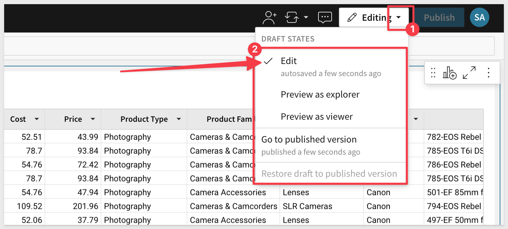

**These options allow you to:**
<ul>
      <li>Continue to work on the Workbook (Edit)</li>
      <li>Preview the Workbook as users with Explorer or Viewer rights will see it (Preview as...)</li>
      <li>Review the last published version before you make your saves in Edit mode (Go to published version)</li>
      <li>Restore previous Published version if you make a mistake Publishing new (Restore draft to published version)</li>
</ul>

<aside class="positive">
<strong>IMPORTANT:</strong>  Sigma has many more features to help address the need for version control.
</aside>

[For more information on version control in Sigma, please click here.]()

In the lower left corner of the Page there is a tab. Click the `down-arrow` and rename the tab to `Data`. We will use this table as a Workbook source of data for work in later labs.

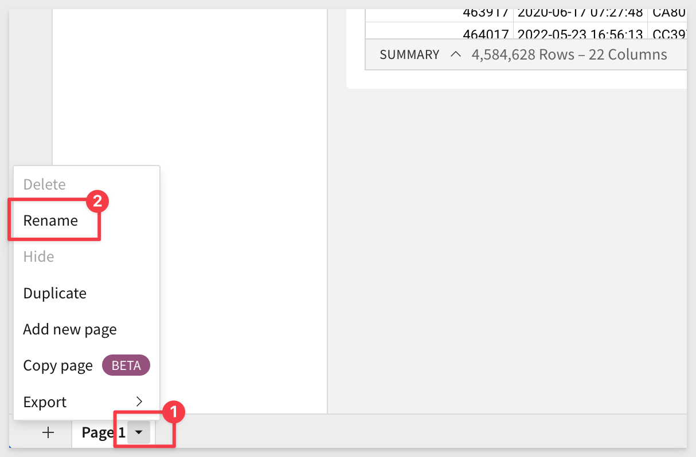

<aside class="negative">
<strong>NOTE:</strong>  You can also just double-click on the page name and enter a new name too.
</aside>

Now that we have made a change to the workbook, the `Publish` button becomes active again.

Click the `Publish` button and then click `Editing / Go to the published version` link. 

Notice that you are taken to the workbook with one page called `Data` and we are able to return to edit mode via the `Edit` button. 

Click anywhere on the one table.

Notice that there are some controls in the upper right corner of the table. The available options are limited based on the mode you are in (Published, Edit) and what user role you have. These will be very useful as we go forward. Feel free to click into any of them now. 

Notice that the **file download is limited to 1M rows** (the Excel limit). You want your users working in Sigma and not downloading data and building ungoverned spreadsheets with potentially old data and incorrect formulas. 

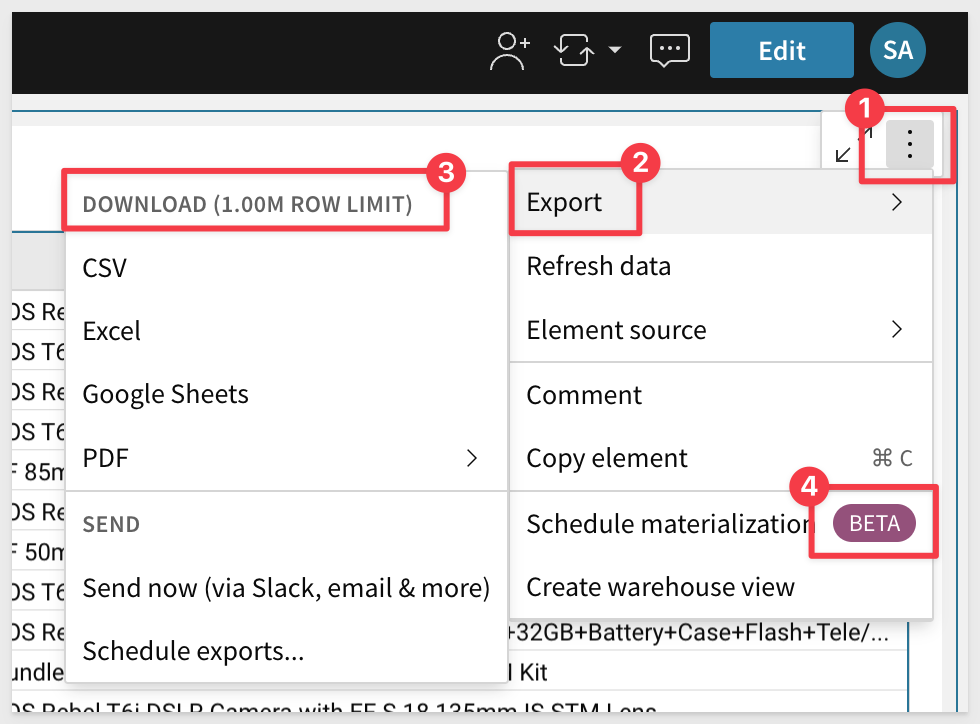

<aside class="positive">
<strong>IMPORTANT:</strong>  Sigma releases new features all the time and some are offered as public beta. Those are indicated by the "Beta" tag you see on the previous screenshot. The tag will disappear when the feature is released.
</aside>

To see what is new in Sigma, [you can visit this page that has information on new features, public betas and bug fixes for the previous month.](https://quickstarts.sigmacomputing.com/firstfridayfeatures/)

[Weekly release notes are made available here as well](https://help.sigmacomputing.com/hc/en-us/articles/360041688433)

<!-- END OF WOOKBOOKS -->

## **Pages** ##
Duration: 6

If not in Edit mode, click the `Edit` button to return to that. Notice that we can easily add Workbook Pages by clicking the `+` link at the bottom left corner of the Page. You can also perform other functions by clicking on the individual Page arrow. 

Each Page has its own Canvas and can be made to operate independently of others or not. For example, on one Page you may want to have the Dataset you are using to drive the content on other Pages. On another Page you may want to have some end user instructions as shown in the Example Workbook we saw earlier:

When in a Workbook in Edit mode you will add Elements to the Canvas using the Editor Panel as shown:

The Editor Panel contains all the Elements you will use to create your Workbook and Pages. We will cover each of these in separate QuickStarts as there are a large amount of functionality in each option. Feel free to experiment with adding Elements to pages if you wish, it is easy to delete Elements that you no longer want on your Page.

<aside class="positive">
<strong>IMPORTANT:</strong> Changes to Workbook Pages are saved as a Draft. You can make changes and not publish, close the Workbook and when you reopen it your Draft changes are still there waiting for you when in Edit mode. They only appear to other users when the Workbook is published
</aside>

When an existing Page element is selected, its configuration is automatically displayed in the workbook's editor panel. For example, selecting a chart will automatically display all the chart options on the Element Panel. 

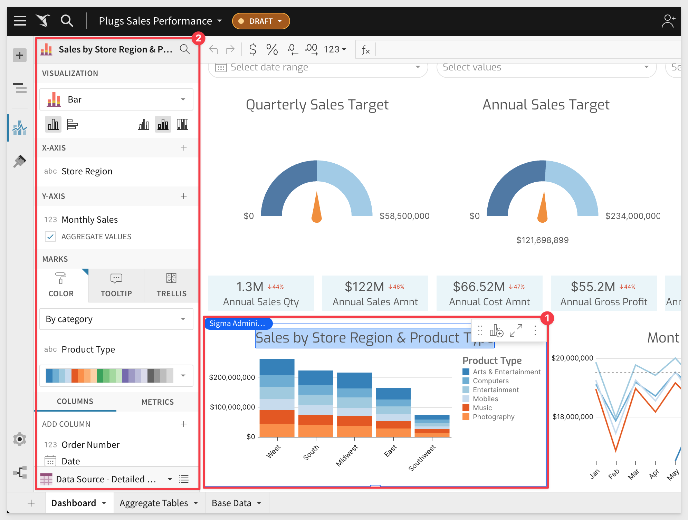

<!-- END OF PAGES -->

## **Sharing with Others** ##
Duration: 6

With Sigma your users are always looking at the most recent data using governed Workbooks in a familiar interface. Sharing Workbooks is an important part of enforcing that amongst the user community. 

Sharing is very easy and permission to access a Sigma document can be shared, modified or revoked by either the individual document’s owner or an organization admin. 

Workbooks support three permission types: `View`, `Explore` and `Edit`.
<ul>
  <li><strong>Can View</strong> is a read only user who can view, create a copy,  send and schedule exports.</li>
  <li><strong>Can Explore</strong> is a user who want to perform additional analysis in an unconstrained fashion</li>
  <li><strong>Can Edit</strong> allows the original Workbook to be altered as if they were the owner.</li>
</ul>

Click the `Share` icon as shown:

Under the Share modal's Share tab, select the team or organization member with whom you would like to share the workbook. In this case, we want to share with the `FinanceViewers` team, with `Viewer` permissions.

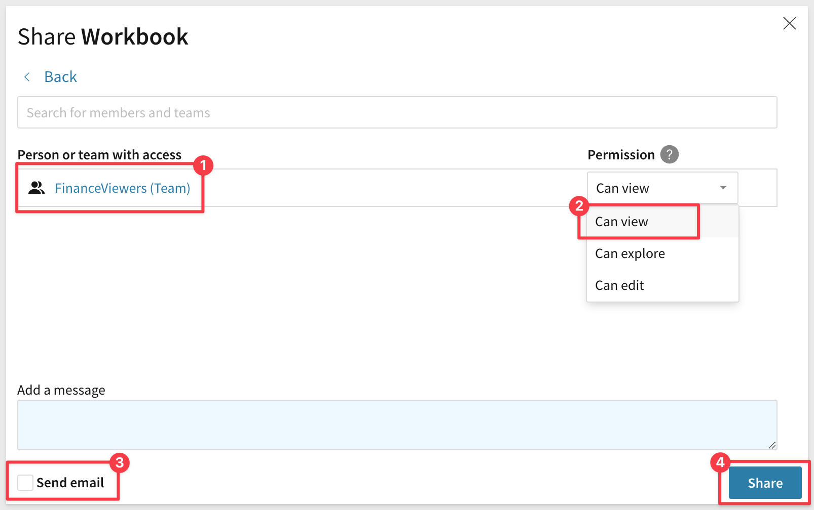

The `Share Workbook` modal shows who has access and their permission level. There are also a few other options to grant access via link.

[More information and options on Sharing is found here](https://help.sigmacomputing.com/hc/en-us/articles/1500010776381-Share-a-Workbook#h_01F6R0YCKPH200BN7XEHMA6SC8)

<!-- END OF SHARING -->

## **Scheduling** ##
Duration: 6

You can send Workbook content on a schedule using the option off the Workbook name drop list as shown:

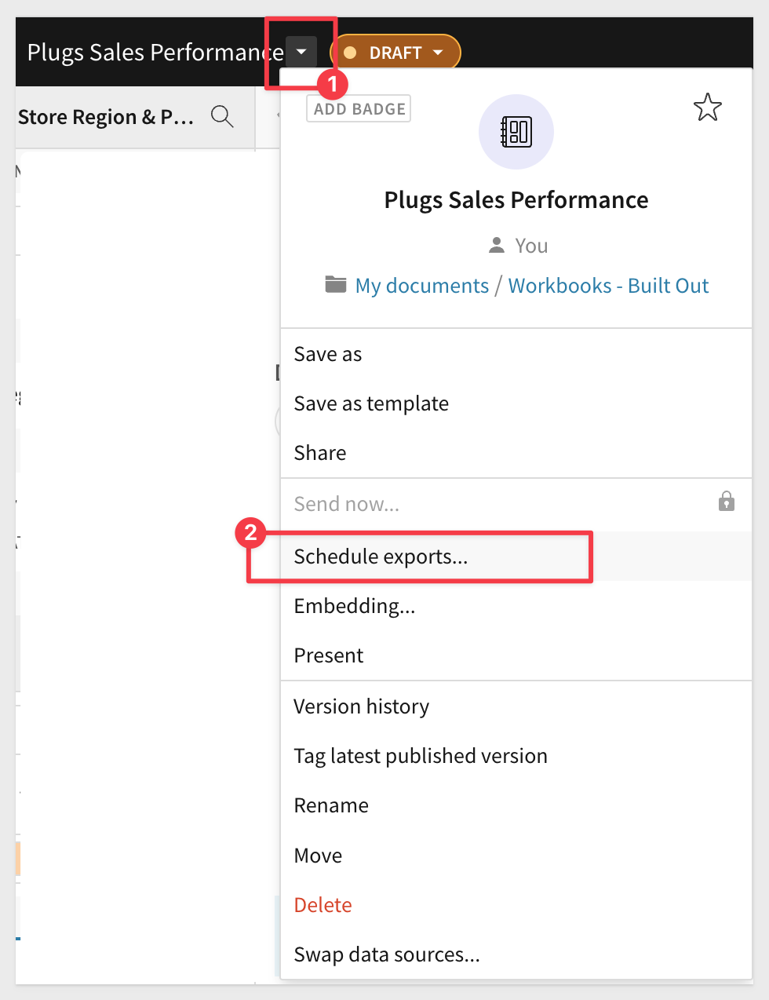

In the modal window, click `Add Schedule`

You are able to customize several areas of this operation. Feel free to try it as the Sigma trial is a live system and will act on your instructions. Notice that you can get granular on which part of the Workbook is sent and what format to send. For Workbooks that have parameter driven data based on the user, you sent items can be run with data filtered for the recipient. 

You can also use the  `+ Add another attachment` to build a message from more than one part of a Workbook. 

A very powerful feature of scheduling allows you to deliver reports deterministically based on parameters you define. You can even test if the condition is met or not, against the existing data:

There is a lot of flexibility in this operation, most of which is very straightforward. 

**Controls:** allows you to send Page Controls (ie: drop list filter settings) in the exported content. In the search box below Controls, search for and select the control by control-id. You must have a Page Control to use this; we have not added one so far but will learn about them later. 

**Send Condition:**
Allows you to set more specific conditions which must be met if a Schedule is to be executed. 

<aside class="negative">
<strong>NOTE:</strong> You can also test each one of these to make sure that you get the results you expect.</aside>

**Always:** you're all set. Continue to the next step.

**If there's no data:** select a determining element under In data element.

**If there's data:** select a determining element under In data element.

**If a condition is met:** Allows you to check the data for specific conditions to determine if a condition is met and send the message. For example, we are checking the Quality column in the Table data to see if there are 10 or less items in stock. If true, the condition is met and the message would be sent on the schedule configured.

The message received has a link the Sigma Workbook (whatever was selected to send) as well as the attachment in PDF:

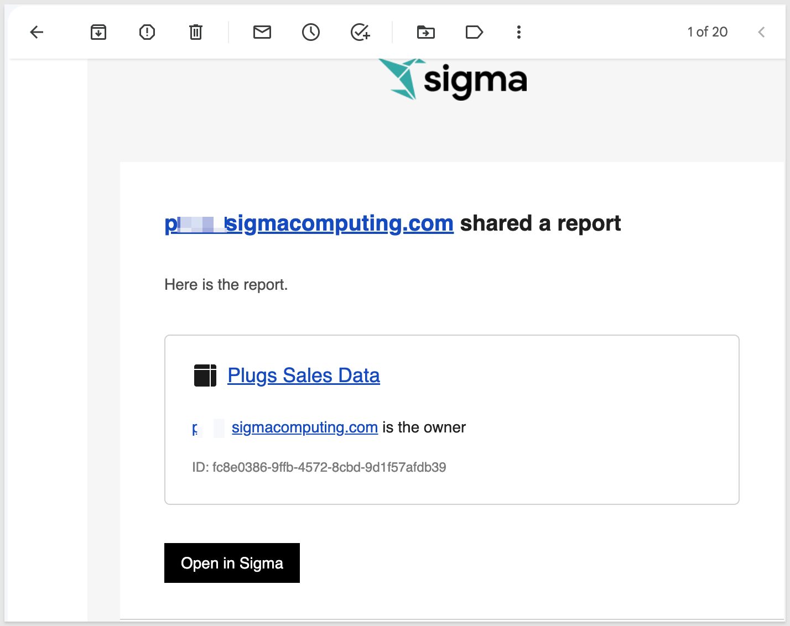  

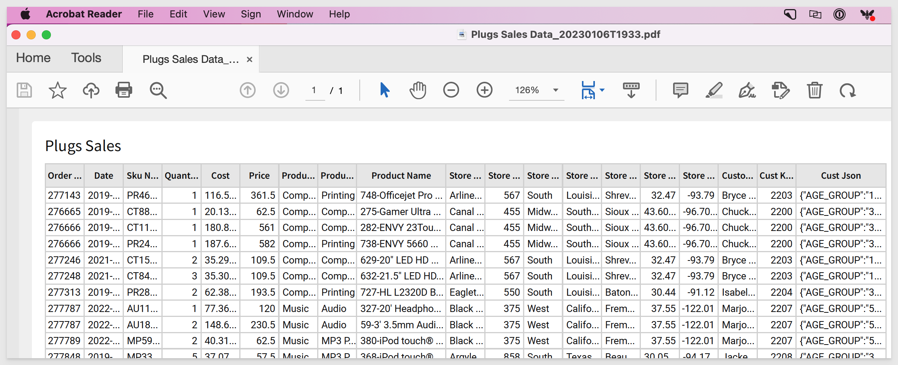

Once you have created a schedule, you can see it on the list of available `Schedule Exports`.

Back in the Sigma Workbook select the `Workbook name` drop list and click `Schedule Exports`.

Here, you can edit, delete, pause or "send now" any listed export job:

[For more information on Scheduling click here.](https://help.sigmacomputing.com/hc/en-us/sections/4404152371347-Send-Schedule-and-Export)

<!-- END OF SCHEDULING -->

## **Live Edit** ##
Duration: 6

Sigma is all about collaboration and Live Edits takes that to another level. **Live Edits allows multiple users to work on the same Workbook in real time, with all editors sharing one live draft.** This is similar to Google Docs if you have ever used that. Our customers told us that they wanted to be able to work on the same document at the same time with others so that their business could use Sigma to move even faster than ever. 

<aside class="negative">
<strong>NOTE:</strong> This feature requires another user in the Trial and as Administrator you can add one if you like or just follow along. 
</aside>

Navigate to `Home` / `Administration` / `People`. 

Click the `Invite People` button.

Fill out the pop-up:

Have the new user accept the email invitation from Sigma and set up their account. So we could have both accounts logged into Sigma at the same time we used Chrome for one and Firefox for the other.

<aside class="positive">
<strong>IMPORTANT:</strong> Using your original Sigma trial account, Share the Plugs Sales Workbook with the new user. This was shown earlier and go back if you don’t remember the steps. Take care which Permission level you set; for Live Edit the user needs Edit Permission. 
</aside>

Using Firefox (and logged in as the 2nd user) I can see that I have the Plugs Sales Workbook Shared with me on the `Shared with Me` page:

**Put the Workbook into Edit mode in both browsers** and you will notice that you can see that there is another user working on the same workbook. Notice that in Firefox the user is “EP” but there is another user also making edits (PB).

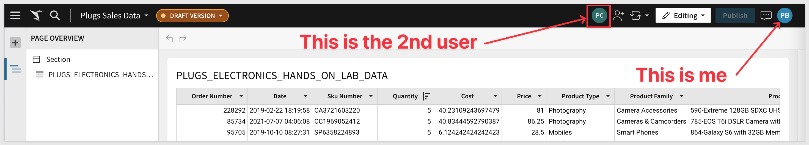

**But which part of the Workbook is each user active in?**

`Click the Table` and you will see who is active on that Element:

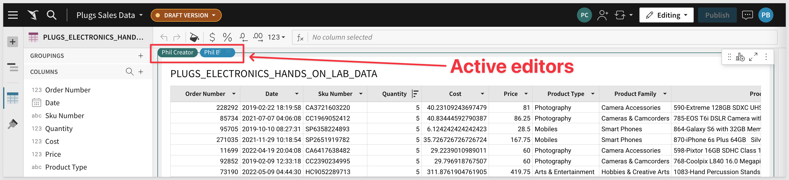

[For more information on Live Edit click here.](https://help.sigmacomputing.com/hc/en-us/articles/9384868843027-Workbook-Live-Edit)

<!-- END OF LIVE EDIT -->

## What we've covered
Duration: 6

In this QuickStart we covered navigating the Sigma user interface, common terminology and some of the most common functionality. 

[Click here to move to the next QuickStart in this series.](https://quickstarts.sigmacomputing.com/guide/fundamentals-2-working-with-tables/index.html)

**Additional Resource Links**

[Help Center Home](https://help.sigmacomputing.com/hc/en-us) 
[Sigma Community](https://community.sigmacomputing.com/) 
[Sigma Blog](https://www.sigmacomputing.com/blog/) 
 

&emsp;

<!-- END OF WHAT WE COVERED -->
<!-- END OF QUICKSTART -->
